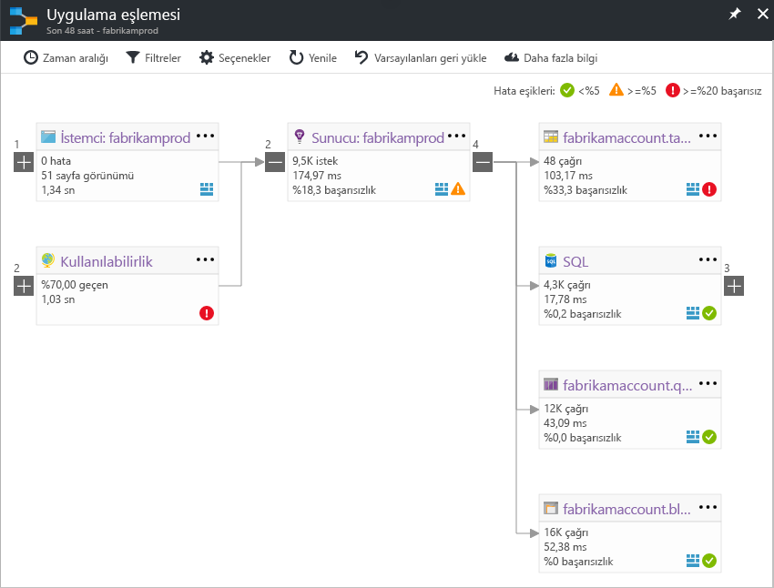

# Application ınsights'ta uygulama eşlemesiApplication Map in Application Insights
İçinde [Azure Application Insights](app-insights-overview.md), uygulama eşlemesi olan uygulama bileşenlerinizin bağımlılık ilişkilerini visual düzeni.In [Azure Application Insights](app-insights-overview.md), Application Map is a visual layout of the dependency relationships of your application components. Her bileşen yük, performans, hataları ve Uyarıları gibi bir performans sorunu veya hatası neden herhangi bir bileşeni keşfetmenize yardımcı olmak için KPI'ları gösterir.Each component shows KPIs such as load, performance, failures, and alerts, to help you discover any component causing a performance issue or failure. Aracılığıyla herhangi bir bileşeni Application Insights olaylarını gibi daha ayrıntılı tanılama tıklayabilirsiniz.You can click through from any component to more detailed diagnostics, such as Application Insights events. Uygulamanızı Azure hizmetlerini kullanıyorsa, üzerinden SQL Database Advisor önerileri gibi Azure tanılama tıklatabilirsiniz.If your app uses Azure services, you can also click through to Azure diagnostics, such as SQL Database Advisor recommendations.

Diğer grafikler gibi bir uygulama eşlemesi tam olarak işlevsel olduğu Azure panoya sabitleyebilirsiniz.Like other charts, you can pin an application map to the Azure dashboard, where it is fully functional. 

## Uygulama eşlemesi açınOpen the application map
Uygulamanız için genel bakış dikey penceresinden harita açın:Open the map from the overview blade for your application:

Harita gösterir:The map shows:

* Kullanılabilirlik testleriAvailability tests
* İstemci tarafı bileşen (JavaScript SDK'sı ile izlenen)Client-side component (monitored with the JavaScript SDK)
* Sunucu tarafı bileşeniServer-side component
* İstemci ve sunucu bileşenleri bağımlılıklarıDependencies of the client and server components

Genişletme ve bağımlılık bağlantı gruplarına daraltma:You can expand and collapse dependency link groups:

Bir tür (SQL, HTTP vb.) pek çok bağımlılık varsa, bunlar gruplandırılmış görünebilir.If you have many dependencies of one type (SQL, HTTP etc.), they may appear grouped. 

## Nokta sorunlarıSpot problems
Her düğüm bu bileşen için yükleme, performans ve hata hızlarını gibi ilgili performans göstergelerini içerir.Each node has relevant performance indicators, such as the load, performance, and failure rates for that component. 

Uyarı simgeleri olası sorunlar vurgulayın.Warning icons highlight possible problems. Turuncu bir uyarı isteklerinde sayfa görünümleri veya bağımlılık çağrıları hataları olduğu anlamına gelir.An orange warning means there are failures in requests, page views or dependency calls. Kırmızı bir hata oranı %5 yukarıda anlamına gelir.Red means a failure rate above 5%. Bu eşikler ayarlamak istiyorsanız, Seçenekleri'ni açın.If you want to adjust these thresholds, open Options.

Etkin Göster yukarı da uyarır:Active alerts also show up: 

SQL Azure kullanırsanız, ne zaman gösteren bir simge yoktur nasıl performansını iyileştirebilir ilişkin öneriler vardır.If you use SQL Azure, there's an icon that shows when there are recommendations on how you can improve performance. 

Daha fazla bilgi almak için herhangi bir simgesini tıklatın:Click any icon to get more details:

## Tanılama geçişli tıklatmaDiagnostic click through
Harita üzerinde düğümlerinin her biri için tanılama aracılığıyla hedeflenen tıklatın sunar.Each of the nodes on the map offers targeted click through for diagnostics. Seçenekler düğüm türüne bağlı olarak değişir.The options vary depending on the type of the node.

Azure üzerinde barındırılan bileşenler için bunları doğrudan bağlantıların seçenekleri içerir.For components that are hosted in Azure, the options include direct links to them.

## Filtreler ve zaman aralığıFilters and time range
Varsayılan olarak, seçilen zaman aralığı için kullanılabilir tüm verileri harita özetler.By default, the map summarizes all the data available for the chosen time range. Ancak, yalnızca belirli işlem adları veya bağımlılıkları içerecek şekilde filtre uygulayabilirsiniz.But you can filter it to include only specific operation names or dependencies.

* İşlem adı: Bu sayfa görünümleri ve sunucu tarafı istek türleri içerir.Operation name: This includes both page views and server-side request types. Bu seçenek, yalnızca seçili işlemler için istemci/sunucu-tarafı düğümde KPI eşlemesini gösterir.With this option, the map shows the KPI on the server/client-side node for the selected operations only. Bu belirli işlemler bağlamında adlı bağımlılıkları gösterir.It shows the dependencies called in the context of those specific operations.
* Bağımlılık temel name: Bu, sunucu tarafı bağımlılıkları ve AJAX tarayıcı bağımlılıklar içerir.Dependency base name: This includes the AJAX browser dependencies and server-side dependencies. Özel bağımlılık telemetrisi TrackDependency API ile rapor ise, bunlar ayrıca burada görünür.If you report custom dependency telemetry with the TrackDependency API, they also appear here. Haritada göstermek için bağımlılıklar seçebilirsiniz.You can select the dependencies to show on the map. Şu anda bu seçimi sunucu tarafı istekleri ya da istemci-tarafı sayfa görünümleri filtre uygulamaz.Currently this selection does not filter the server-side requests, or the client-side page views.

## Filtreleri KaydetSave filters
Filtre uygulanmış bir görünüm üzerine uyguladığınız filtreleri Kaydet sabitlemek bir [Pano](app-insights-dashboards.md).To save the filters you have applied, pin the filtered view onto a [dashboard](app-insights-dashboards.md).

## Hata bölmesiError pane
Harita düğümünde tıkladığınızda bir hata bölmesi sağ taraftaki hataları bu düğüm için özetleme görüntülenir.When you click a node in the map, an error pane is displayed on the right-hand side summarizing failures for that node. Hataları ilk işlem Kimliğine göre gruplandırılmış ve sorun kimliğine göre gruplandırılmışFailures are grouped first by operation ID and then grouped by problem ID.

Bir arıza tıklatarak bu hatanın en son örneğine alır.Clicking on a failure takes you to the most recent instance of that failure.

## Kaynak durumuResource health
Bazı kaynak türleri için kaynak durumu hata bölmesinin üst kısmında görüntülenir.For some resource types, resource health is displayed at the top of the error pane. Örneğin, bir SQL düğümü tıklatarak veritabanı sistem durumu ve puanlı herhangi bir uyarı gösterir.For example, clicking a SQL node will show the database health and any alerts that have fired.

Bu kaynak için standart genel bakış ölçümlerini görüntülemek için kaynak adı tıklatabilirsiniz.You can click the resource name to view standard overview metrics for that resource.

## Uçtan uca sistem uygulama eşlemeleriEnd-to-end system app maps

*SDK'sı sürüm 2.3 veya üstü gerektirir**Requires SDK version 2.3 or higher*

Uygulamanız çeşitli bileşenleri - Örneğin, bir arka uç hizmeti Ayrıca web uygulaması'na - sahip sonra bunları gösterebilir tüm bir tümleşik uygulama harita üzerinde.If your application has several components - for example, a back-end service in addition to the web app - then you can show them all on one integrated app map.

Uygulama harita yüklü Application Insights SDK'sı ile sunucu arasında yapılan tüm HTTP bağımlılık çağrıları izleyerek sunucu düğümleri bulur.The app map finds server nodes by following any HTTP dependency calls made between servers with the Application Insights SDK installed. Her bir Application Insights kaynağı, bir sunucu içeren varsayılır.Each Application Insights resource is assumed to contain one server.

### Birden çok rol uygulama eşleme (Önizleme)Multi-role app map (preview)

Önizleme birden çok rol uygulama eşleme özelliğini uygulama eşlemesi aynı Application Insights kaynağına veri gönderilirken birden fazla sunucuyla sayesinde / izleme anahtarı.The preview multi-role app map feature allows you to use the app map with multiple servers sending data to the same Application Insights resource  / instrumentation key. Harita sunucuları, telemetri öğeler üzerinde cloud_RoleName özelliği tarafından ayrılmış.Servers in the map are segmented by the cloud_RoleName property on telemetry items. Ayarlama *birden çok rol uygulama eşlemesi* için *üzerinde* bu yapılandırmayı etkinleştirmek için önizlemeleri dikey penceresinden.Set *Multi-role Application Map* to *On* from the Previews blade to enable this configuration.

Bu yaklaşım, bir mikro hizmetler uygulamasındaki ya da tek bir Application Insights kaynağı içinde birden çok sunucudaki olayları ilişkilendirmek istediğiniz diğer senaryolarda istenebilir.This approach may be desired in a micro-services application, or in other scenarios where you want to correlate events across multiple servers within a single Application Insights resource.

## VideoVideo

> [!VIDEO https://channel9.msdn.com/events/Connect/2016/112/player] 

## Geri BildirimFeedback
Portal geri bildirimi seçeneği aracılığıyla geri bildirim sağlayın.Please provide feedback through the portal feedback option.

## Sonraki adımlarNext steps

* [Azure portalAzure portal](https://portal.azure.com)
