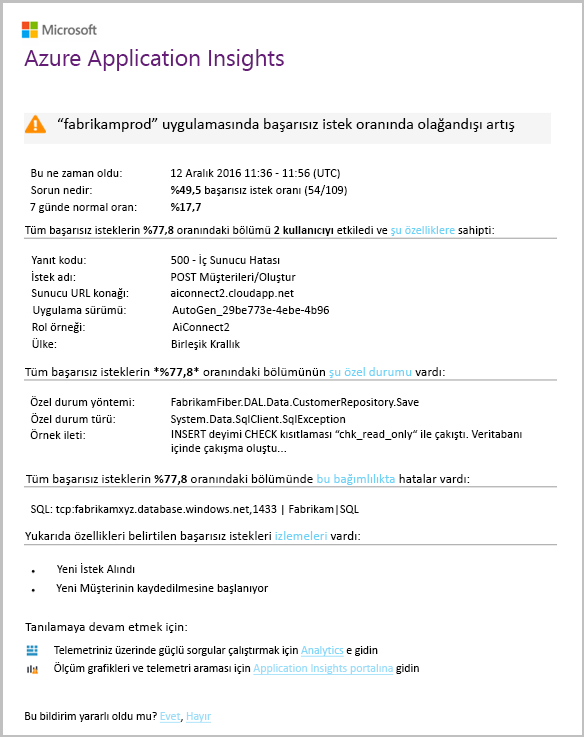

# DevOps için Application Insights genel bakışOverview of Application Insights for DevOps

İle [Application Insights](app-insights-overview.md), uygulamanızı nasıl gerçekleştiriyor hızlıca bulabilir ve canlı olduğunda kullanılıyor.With [Application Insights](app-insights-overview.md), you can quickly find out how your app is performing and being used when it's live. Bir sorun varsa, bunu, hello etkisini değerlendirmenize yardımcı olur ve hello neden saptamanıza yardımcı olur hakkında bilmenizi sağlar.If there's a problem, it lets you know about it, helps you assess hello impact, and helps you determine hello cause.

Web uygulamaları geliştirir ekibinden bir hesap şöyledir:Here's an account from a team that develops web applications:

* *"Birkaç gün önce bir 'ikincil' düzeltme dağıttığımız. Biz geniş test geçişi çalıştırılmadı, ancak bazı beklenmeyen değişiklik hello ön ve arka uç arasındaki uyumsuzluk neden hello yükü içine ne yazık ki birleştirilmiş. Hemen sunucu özel durumları, surged bizim uyarı tetiklenir ve biz hello durumdan haberdar. Birkaç tıklama hello Application Insights portalındaki hemen özel durum callstacks toonarrow hello sorun aşağı gelen yeterli bilgi aldı. Biz geri hemen ve hello hasar sınırlıdır. Application Insights yaptı döngüsü bu kısmı hello devops çok kolay ve işlem yapılabilir."**"A couple of days ago, we deployed a 'minor' hotfix. We didn't run a broad test pass, but unfortunately some unexpected change got merged into hello payload, causing incompatibility between hello front and back ends. Immediately, server exceptions surged, our alert fired, and we were made aware of hello situation. A few clicks away on hello Application Insights portal, we got enough information from exception callstacks toonarrow down hello problem. We rolled back immediately and limited hello damage. Application Insights has made this part of hello devops cycle very easy and actionable."*

Bu makalede biz hello geliştirir Fabrikam banka bir ekipte izleyin çevrimiçi bankacılık nasıl kullandıkları sistem (RÇY) toosee Application Insights tooquickly toocustomers yanıt ve güncelleştirmeler yapabilir.In this article we follow a team in Fabrikam Bank that develops hello online banking system (OBS) toosee how they use Application Insights tooquickly respond toocustomers and make updates.  

Merhaba takım hello aşağıdaki çizimde gösterilen bir DevOps döngüde çalışır:hello team works on a DevOps cycle depicted in hello following illustration:

Gereksinimleri geliştirme biriktirme (görev listesi) akış.Requirements feed into their development backlog (task list). Bunlar genellikle çalışma - geliştirmeleri ve uzantıları var olan uygulamanın toohello hello formunda genellikle yazılımlara sprint kısa çalışır.They work in short sprints, which often deliver working software - usually in hello form of improvements and extensions toohello existing application. Hello dinamik uygulama sık sık yeni özelliklerle güncelleştirilmiştir.hello live app is frequently updated with new features. Canlı olsa da, hello takım performans ve hello Yardımı Application Insights ile kullanım için izler.While it's live, hello team monitors it for performance and usage with hello help of Application Insights. Bu APM veri kendi geliştirme biriktirme akışları.This APM data feeds back into their development backlog.

Merhaba takım yakından için Application Insights toomonitor hello canlı web uygulaması kullanır:hello team uses Application Insights toomonitor hello live web application closely for:

* Performans.Performance. Nasıl yanıt süreleri olan istek sayısı değişir toounderstand istedikleri; ne kadar CPU, ağ, disk ve diğer kaynakları kullanılıyor; ve hello performans sorunlarını olduğu.They want toounderstand how response times vary with request count; how much CPU, network, disk, and other resources are being used; and where hello bottlenecks are.
* Hataları.Failures. Özel durumlar varsa veya başarısız istekleri ya da bir performans sayacı kendi rahat aralığın dışında kalırsa, böylece işlemleri gerçekleştirebilir takım gereksinimlerini tooknow hızlı bir şekilde hello.If there are exceptions or failed requests, or if a performance counter goes outside its comfortable range, hello team needs tooknow rapidly so that they can take action.
* Kullanımı.Usage. Yeni bir özellik yayımlandığında hello takım istediğiniz tooknow toowhat ölçüde kullanılır ve kullanıcıların bir güçlükle onunla olup olmadığına.Whenever a new feature is released, hello team want tooknow toowhat extent it is used, and whether users have any difficulties with it.

Şimdi hello geri bildirim hello döngüsünün parçası üzerinde odaklanır:Let's focus on hello feedback part of hello cycle:

## Zayıf kullanılabilirlik AlgılaDetect poor availability
Marcela Markova hello RÇY ekipteki Kıdemli bir geliştiricinin ve çevrimiçi performansını izleme hello sağlama alır.Marcela Markova is a senior developer on hello OBS team, and takes hello lead on monitoring online performance. Aynen birkaç ayarlar [kullanılabilirlik testleri](app-insights-monitor-web-app-availability.md):She sets up several [availability tests](app-insights-monitor-web-app-availability.md):

* Merhaba ana giriş sayfası hello uygulama için tek URL test http://fabrikambank.com/onlinebanking/.A single-URL test for hello main landing page for hello app, http://fabrikambank.com/onlinebanking/. Aynen 'Hoş Geldiniz!' HTTP kodu 200 ve metin ölçütüne göre ayarlar.She sets criteria of HTTP code 200 and text 'Welcome!'. Bu test başarısız olursa, hello ağ veya hello sunucuları veya belki de bir dağıtım sorunu ciddi yanlış bir şey yoktur.If this test fails, there's something seriously wrong with hello network or hello servers, or maybe a deployment issue. (Veya birisi hello Hoş Geldiniz değiştirildi!(Or someone has changed hello Welcome! ileti kendi bilinen izin vererek olmadan hello sayfasında.)message on hello page without letting her know.)
* Her oturum açtığında ve geçerli listeleme, birkaç önemli ayrıntıları her sayfada denetimi hesap alır daha derin çok adımlı bir test.A deeper multi-step test, which logs in and gets a current account listing, checking a few key details on each page. Bu test hello bağlantı toohello hesapları veritabanının çalıştığını doğrular.This test verifies that hello link toohello accounts database is working. Aynen kurgusal Müşteri Kimliği kullanır: test amaçları için birkaç tanesi tutulur.She uses a fictitious customer id: a few of them are maintained for test purposes.

Bu testler ayarlama, Marcela bu hello takım herhangi kesinti hakkında hızlı bir şekilde bilir emin olur.With these tests set up, Marcela is confident that hello team will quickly know about any outage.  

Merhaba web testi grafik kırmızı nokta olarak hataları görünecektir:Failures show up as red dots on hello web test chart:

Ancak daha da önemlisi, herhangi bir hata hakkında uyarı toohello geliştirme ekibi e-posta ile.But more importantly, an alert about any failure is emailed toohello development team. Neredeyse tüm müşterilerin hello önce bu şekilde, bunlar bildirin.In that way, they know about it before nearly all hello customers.

## Performansı İzleMonitor Performance
Application ınsights'ta Hello genel bakış sayfasında bulunan çeşitli gösteren bir grafik olduğundan [anahtar ölçümleri](app-insights-web-monitor-performance.md).On hello overview page in Application Insights, there's a chart that shows a variety of [key metrics](app-insights-web-monitor-performance.md).

Tarayıcı sayfa yükleme süresi doğrudan web sayfalarından gönderilen telemetri türetilir.Browser page load time is derived from telemetry sent directly from web pages. Sunucu yanıt süresi, sunucu istek sayısı ve başarısız istek sayısı tüm hello web sunucusunda ölçülen ve buradan tooApplication Öngörüler gönderilen.Server response time, server request count, and failed request count are all measured in hello web server and sent tooApplication Insights from there.

Marcela hello sunucu yanıt grafiğini ile biraz ilgilenen ' dir.Marcela is slightly concerned with hello server response graph. Bu grafik zaman hello sunucu kullanıcının tarayıcıdan bir HTTP isteğini alır ve hello yanıt döndüğünde arasındaki ortalama süre hello gösterir.This graph shows hello average time between when hello server receives an HTTP request from a user's browser, and when it returns hello response. Merhaba sistem bilgisayardaki yük değiştikçe olağan dışı toosee Bu grafikteki bir değişim değil.It isn't unusual toosee a variation in this chart, as load on hello system varies. Ancak bu durumda olduğu anlaşılıyor toobe küçük miktarı artar hello sayısı isteklerinin ve büyük arasında bir bağıntı hello yanıt süresi miktarı artar.But in this case, there seems toobe a correlation between small rises in hello count of requests, and big rises in hello response time. Yalnızca kendi sınırlarına işletim hello sistemi belirtebilir.That could indicate that hello system is operating just at its limits.

Aynen hello sunucuları grafikleri açar:She opens hello Servers charts:

Olduğu anlaşılıyor toobe kaynak sınırlaması, hiçbir belirtisi olabilir hello darbe hello sunucu yanıt grafiklerde yalnızca bir rastlantı şekilde.There seems toobe no sign of resource limitation there, so maybe hello bumps in hello server response charts are just a coincidence.

## Uyarıları toomeet hedeflerini ayarlamaSet alerts toomeet goals
Bununla birlikte, aynen hello yanıt süreleri tookeep bir göz ister.Nevertheless, she'd like tookeep an eye on hello response times. Çok yüksek gidin, ilgili tooknow hemen istediği.If they go too high, she wants tooknow about it immediately.

Aynen ayarlar için bir [uyarı](app-insights-metrics-explorer.md), yanıt zamanları tipik bir eşik değerinden yüksek.So she sets an [alert](app-insights-metrics-explorer.md), for response times greater than a typical threshold. Bu yanıt süreleri yavaşsa, kendisi hakkında anlarsınız kendi güven verir.This gives her confidence that she'll know about it if response times are slow.

Uyarılar, çok çeşitli diğer ölçümleri üzerinde ayarlanabilir.Alerts can be set on a wide variety of other metrics. Örneğin, e-postaları hello özel durum sayısı yüksek olur ya da hello kullanılabilir bellek düşük gider veya istemci isteklerini bir en yüksek ise alabilir.For example, you can receive emails if hello exception count becomes high, or hello available memory goes low, or if there is a peak in client requests.

## Akıllı algılama Uyarıları hakkında bilgi sahibi olmakStay informed with Smart Detection Alerts
Ertesi gün, bir uyarı e-posta Application Insights ulaşır.Next day, an alert email does arrive from Application Insights. Ancak kendisi açıldığında, aynen aynen ayarlamak hello yanıt süresi uyarı değil bulur.But when she opens it, she finds it isn't hello response time alert that she set. Bunun yerine, her başarısız isteklerin - diğer bir deyişle, 500 veya daha fazla hata kodları döndürmüş istekleri ani bir artışa olmamıştı söyler.Instead, it tells her there's been a sudden rise in failed requests - that is, requests that have returned failure codes of 500 or more.

Kullanıcılar genellikle hello kodda oluşturulan bir özel aşağıdaki hata - burada gördünüz başarısız isteklerdir.Failed requests are where users have seen an error - typically following an exception thrown in hello code. "Üzgünüz ayrıntılarınızı şu an güncelleştiremedik." söyleyen bir ileti görürler olabilirMaybe they see a message saying "Sorry we couldn't update your details right now." Veya mutlak utanç en kötü yığın dökümü hello web sunucusu'nın hello kullanıcının ekran görüntülenir.Or, at absolute embarrassing worst, a stack dump appears on hello user's screen, courtesy of hello web server.

Bu uyarı bir beklenmedik biçimde çünkü Hello aynen olduğundan, hello Aranan son zamanı sayısı encouragingly düşük isteği başarısız oldu.This alert is a surprise, because hello last time she looked at it, hello failed request count was encouragingly low. Bir küçük hataları meşgul Server'da beklenen toobe sayısıdır.A small number of failures is toobe expected in a busy server.

Ayrıca edildi beklenmedik biçimde her için biraz aynen tooconfigure bu uyarı kaydetmedi olduğundan.It was also a bit of a surprise for her because she didn't have tooconfigure this alert. Application Insights akıllı algılama içerir.Application Insights include Smart Detection. Tooyour uygulamanın normal hata düzeni ve belirli bir sayfada ya da yüksek yük ya da bağlantılı tooother ölçümleri altında "için kullanılan" hataları otomatik olarak ayarlar.It automatically adjusts tooyour app's usual failure pattern, and "gets used to" failures on a particular page, or under high load, or linked tooother metrics. Yalnızca bir neden varsa hello alarm oluşturur BT'nin tooexpect gelir.It raises hello alarm only if there's a rise above what it comes tooexpect.

Bu çok kullanışlı bir e-postadır.This is a very useful email. Yalnızca bir alarm yükseltmek değil.It doesn't just raise an alarm. Çok sayıda hello önceliklendirme ve tanılama iş çok yapar.It does a lot of hello triage and diagnostic work, too.

Etkilenen kaç müşteriler ve hangi web sayfaları veya işlemleri gösterir.It shows how many customers are affected, and which web pages or operations. Marcela tooget hello tüm ekip bu yangın ayrıntıya çalışma gerek duyduğu aynen veya olup haftaya kadar yoksayılabilir karar verebilirsiniz.Marcela can decide whether she needs tooget hello whole team working on this as a fire drill, or whether it can be ignored until next week.

Merhaba e-posta Ayrıca belirli bir özel durum oluştu ve - daha ilginç - o hello hatası başarısız çağrılar tooa belirli veritabanıyla ilişkili olduğunu gösterir.hello email also shows that a particular exception occurred, and - even more interesting - that hello failure is associated with failed calls tooa particular database. Bu Marcela'nın takım yakın zamanda herhangi bir güncelleştirme dağıtılmamış olsa bile neden hello hataya aniden görünen açıklanmaktadır.This explains why hello fault suddenly appeared even though Marcela's team has not deployed any updates recently.

Marcella bu e-postaya göre hello veritabanı takım hello lideri ping atar.Marcella pings hello leader of hello database team based on this email. Aynen bir düzeltmenin hello içinde son yarım saat yayımlanmış öğrenir; ve hata, belki de bulunmamış olabilir ikincil şema değişikliği...She learns that they released a hot fix in hello past half hour; and Oops, maybe there might have been a minor schema change....

Bu nedenle hello sorun sabit günlükleri araştırma önce bile ve bunu doğan 15 dakika içinde hello yolu toobeing açıktır.So hello problem is on hello way toobeing fixed, even before investigating logs, and within 15 minutes of it arising. Ancak, Marcela hello bağlantı tooopen Application Insights tıklatır.However, Marcela clicks hello link tooopen Application Insights. Düz başarısız bir istek açar ve kârlılığı hello ilişkili bağımlılık çağrıları listesinde çağrısı başarısız veritabanı görebilir.It opens straight onto a failed request, and she can see the failed database call in hello associated list of dependency calls.

## Özel durumlar AlgılaDetect exceptions
Kurulum, biraz ile [özel durumlar](app-insights-asp-net-exceptions.md) bildirilen tooApplication Öngörüler otomatik olarak olursunuz.With a little bit of setup, [exceptions](app-insights-asp-net-exceptions.md) are reported tooApplication Insights automatically. Bunlar aynı zamanda açıkça çağrıları çok ekleyerek yakalanabilir[TrackException()](app-insights-api-custom-events-metrics.md#trackexception) hello koda:They can also be captured explicitly by inserting calls too[TrackException()](app-insights-api-custom-events-metrics.md#trackexception) into hello code:  

    var telemetry = new TelemetryClient();
    ...
    try
    { ...
    }
    catch (Exception ex)
    {
       // Set up some properties:
       var properties = new Dictionary <string, string>
         {{"Game", currentGame.Name}};

       var measurements = new Dictionary <string, double>
         {{"Users", currentGame.Users.Count}};

       // Send hello exception telemetry:
       telemetry.TrackException(ex, properties, measurements);
    }

belirgin bir kurtarma olmadıkça hello Fabrikam banka takım hello uygulama olarak her zaman bir özel durum telemetri göndermesini gelişmiştir.hello Fabrikam Bank team has evolved hello practice of always sending telemetry on an exception, unless there's an obvious recovery.  

Aslında, bunların daha da geniş stratejidir: hello müşteri olduğu yerde ne engellenen her durumda telemetri gönderdikleri veya tooan özel durum hello kodda karşılık olup olmadığını toodo, istedikleri.In fact, their strategy is even broader than that: They send telemetry in every case where hello customer is frustrated in what they wanted toodo, whether it corresponds tooan exception in hello code or not. Hello dış arası banka aktarım sistemi işletimsel bir nedenden dolayı (hata hello müşterinin) "Bu işlem tamamlanamıyor" iletisi döndürürse, örneğin, ardından bunlar olay izler.For example, if hello external inter-bank transfer system returns a "can't complete this transaction" message for some operational reason (no fault of hello customer) then they track that event.

    var successCode = AttemptTransfer(transferAmount, ...);
    if (successCode < 0)
    {
       var properties = new Dictionary <string, string>
            {{ "Code", returnCode, ... }};
       var measurements = new Dictionary <string, double>
         {{"Value", transferAmount}};
       telemetry.TrackEvent("transfer failed", properties, measurements);
    }

TrackException kullanılan tooreport özel durumların nedeni hello yığını bir kopyasını gönderir.TrackException is used tooreport exceptions because it sends a copy of hello stack. TrackEvent kullanılan tooreport diğer olayları değil.TrackEvent is used tooreport other events. Tanılama aşamasında yararlı olabilecek herhangi bir özellik ekleyebilirsiniz.You can attach any properties that might be useful in diagnosis.

Özel durumlar ve olayları görünmesini hello [tanılama arama](app-insights-diagnostic-search.md) dikey.Exceptions and events show up in hello [Diagnostic Search](app-insights-diagnostic-search.md) blade. Bunlara toosee hello ek özellikler incelemek ve yığın izleme.You can drill into them toosee hello additional properties and stack trace.

## Proaktif izlemeMonitor proactively
Marcela, yalnızca uyarılar için beklerken kalmaya devam etmez.Marcela doesn't just sit around waiting for alerts. Yeniden her dağıtım hemen sonra aynen bir inceler [yanıt sürelerini](app-insights-web-monitor-performance.md) - hem de genel şekil hello ve özel durum yanı sıra, en yavaş istekler Merhaba tablonun sayar.Soon after every redeployment, she takes a look at [response times](app-insights-web-monitor-performance.md) - both hello overall figure and hello table of slowest requests, as well as exception counts.  

Genellikle her hafta hello ile son karşılaştırma aynen her dağıtım hello performans etkisini değerlendirebilirsiniz.She can assess hello performance effect of every deployment, typically comparing each week with hello last. Varsa ani worsening, kârlılığı, hello ilgili geliştiricilere başlatır.If there's a sudden worsening, she raises that with hello relevant developers.

## Önceliklendirme sorunlarıTriage issues
-Hello önem ve bir sorun kapsamını değerlendirmesinde - önceliklendirme hello ilk algılama sonra adımdır.Triage - assessing hello severity and extent of a problem - is hello first step after detection. Merhaba takım gece yarısı diyoruz?Should we call out hello team at midnight? Veya sonraki uygun boşluk hello biriktirme listesi hello kadar bırakılabilir?Or can it be left until hello next convenient gap in hello backlog? Değerlendirme içinde anahtar bazı sorular verilmiştir.There are some key questions in triage.

Ne sıklıkta gerçekleştiriliyor? Merhaba genel bakış dikey penceresinde Hello grafiklerde perspektif tooa sorun verin.How often is it happening? hello charts on hello Overview blade give some perspective tooa problem. Örneğin, Fabrikam uygulama hello bir gece dört web test uyarılar oluşturulur.For example, hello Fabrikam application generated four web test alerts one night. Hala hello testleri çoğu yeşil oturuyormuş hello grafiği hello sabah baktığınızda, hello takım gerçekten bazı kırmızı nokta olduğunu görebilir.Looking at hello chart in hello morning, hello team could see that there were indeed some red dots, though still most of hello tests were green. Merhaba kullanılabilirlik şemasına ayrıntılara, tüm bu zaman zaman ortaya çıkan sorunları bir test konumdan olduğunu açıktı.Drilling into hello availability chart, it was clear that all of these intermittent problems were from one test location. Bu açıkça yalnızca bir rota etkileyen bir ağ sorunu oluştu ve büyük olasılıkla kendisini temizler.This was obviously a network issue affecting only one route, and would most likely clear itself.  

Bunun aksine, özel durum sayısı veya yanıt süreleri hello grafiği çarpıcı ve kararlı bir artışa açıkça şeydir toopanic hakkında.By contrast, a dramatic and stable rise in hello graph of exception counts or response times is obviously something toopanic about.

Yararlı önceliklendirme Taktik bunun deneyin, kendiniz ' dir.A useful triage tactic is Try It Yourself. Merhaba çalıştırırsanız aynı sorun bildiğiniz gerçek olduğu.If you run into hello same problem, you know it's real.

Kullanıcıların hangi kesir etkilendiğini? tooobtain kaba yanıt hello oturum sayısı tarafından hello hata oranı bölün.What fraction of users are affected? tooobtain a rough answer, divide hello failure rate by hello session count.

Yavaş yanıtlar olduğunda en yavaş yanıt istekleri Merhaba tablonun her sayfanın hello kullanım sıklığı ile karşılaştırın.When there are slow responses, compare hello table of slowest-responding requests with hello usage frequency of each page.

Engellenen hello senaryo ne kadar önemli mi?How important is hello blocked scenario? Belirli bir kullanıcı hikayesinin engelleme işlevsel bir sorun varsa, çok önemli midir?If this is a functional problem blocking a particular user story, does it matter much? Müşteriler, faturalar ödeme edilemez, bu ciddi olur; Ekran rengi tercihlerini değiştiremezsiniz, belki de bekleyebilir.If customers can't pay their bills, this is serious; if they can't change their screen color preferences, maybe it can wait. Merhaba olay ya da özel durum ayrıntısı veya hello yavaş sayfa hello kimliğini Merhaba, müşterilerin burada yaşıyorsanız söyler.hello detail of hello event or exception, or hello identity of hello slow page, tells you where customers are having trouble.

## Sorunları tanılamaDiagnose issues
Tanılama değil oldukça hello hata ayıklama aynıdır.Diagnosis isn't quite hello same as debugging. Merhaba kodlarda İzleme başlamadan önce neden, kaba fikrini olmalıdır hello sorun nerede ve ne zaman oluştuğunu.Before you start tracing through hello code, you should have a rough idea of why, where and when hello issue is occurring.

**Ne zaman böyle bir durum?**  hello Geçmiş görünümünü hello olay ve ölçüm grafikleri tarafından sağlanan kolay toocorrelate efektleri ile olası nedenleri sağlar.**When does it happen?** hello historical view provided by hello event and metric charts makes it easy toocorrelate effects with possible causes. Yanıt süresi veya özel durum hızları aralıklı yükselme olup, hello istek sayısına ulaştığı arayın: aynı hello tarafı, saat sonra kaynak sorunu gibi görünüyor.If there are intermittent peaks in response time or exception rates, look at hello request count: if it peaks at hello same time, then it looks like a resource problem. Daha fazla CPU veya bellek tooassign gerekiyor mu?Do you need tooassign more CPU or memory? Yoksa hello yük yönetemez bir bağımlılık mı?Or is it a dependency that can't manage hello load?

**Bu bize?****Is it us?**  Olasılığı daha sonra - Örneğin ne zaman hello müşterinin hesap özetine istediği - isteğinin belirli bir türdeki performans ani açılan varsa, web uygulamanızın yerine bir dış alt olabilir.If you have a sudden drop in performance of a particular type of request - for example when hello customer wants an account statement - then there's a possibility it might be an external subsystem rather than your web application. Ölçüm Gezgini hello bağımlılık hata oranı ve bağımlılık süresi ücretlerin seçin ve birkaç saat veya gün, algılanan hello sorunla geçmiş hello üzerinden kendi geçmişlerini karşılaştırın.In Metrics Explorer, select hello Dependency Failure rate and Dependency Duration rates and compare their histories over hello past few hours or days with hello problem you detected. Değişiklikler var. ilişkilendirerek, bir dış alt tooblame olabilir.If there are correlating changes, then an external subsystem might be tooblame.  

Coğrafi konuma sorunları bazı yavaş bağımlılık sorunlardır.Some slow dependency issues are geolocation problems. Fabrikam banka Azure sanal makineleri kullanır ve bunlar yanlışlıkla hesap sunucusu ve web sunucusu farklı bir ülkede bulunan olduğunu buldu.Fabrikam Bank uses Azure virtual machines, and discovered that they had inadvertently located their web server and account server in different countries. Çarpıcı geliştirme geçirerek olana bunlardan biri.A dramatic improvement was brought about by migrating one of them.

**Biz ne?****What did we do?** Hello sorunu toobe bir bağımlılık olarak görünüp görünmediğini ve her zaman vardır durumda değilse, büyük olasılıkla tarafından son zamanlarda bir değişiklik neden oldu.If hello issue doesn't appear toobe in a dependency, and if it wasn't always there, it's probably caused by a recent change. Merhaba hello ölçüm ve olay grafikleri tarafından sağlanan geçmiş perspektif kolay toocorrelate kolaylaştırır ani değişiklikler dağıtımlar ile.hello historical perspective provided by hello metric and event charts makes it easy toocorrelate any sudden changes with deployments. Merhaba arama hello sorun için aşağı, daraltır.That narrows down hello search for hello problem.

**Ne var ne yok?****What's going on?** Bazı sorunlar nadiren oluşur ve zor tootrack aşağı test ederek çevrimdışı olabilir.Some problems occur only rarely and can be difficult tootrack down by testing offline. Tüm yapabiliriz olduğunda tootry toocapture hello hata Canlı oluşur.All we can do is tootry toocapture hello bug when it occurs live. Özel durum raporlarında hello yığın dökümleri inceleyebilirsiniz.You can inspect hello stack dumps in exception reports. Ayrıca, sık kullandığınız günlük ile veya TrackTrace() ya da TrackEvent() ile izleme çağrıları yazabilirsiniz.In addition, you can write tracing calls, either with your favorite logging framework or with TrackTrace() or TrackEvent().  

Fabrikam ile arası hesap aktarımları, ancak yalnızca hesap türleri için belirli zaman zaman ortaya çıkan bir sorun var.Fabrikam had an intermittent problem with inter-account transfers, but only with certain account types. toounderstand daha iyi olanlar, hello kod içinde bir özellik tooeach çağrı hello hesap türü ekleme, anahtar noktalarda TrackTrace() çağrıları eklenir.toounderstand better what was happening, they inserted TrackTrace() calls at key points in hello code, attaching hello account type as a property tooeach call. Yalnızca bu izlemeler çıkışı kolay toofilter tanılama Arama'da yapılan.That made it easy toofilter out just those traces in Diagnostic Search. Bunlar, ayrıca parametre değerleri özellikleri ve ölçüleri toohello izleme çağrıları iliştirilmiş.They also attached parameter values as properties and measures toohello trace calls.

## Yanıt toodiscovered sorunlarıRespond toodiscovered issues
Merhaba sorunu tanı koydu sonra planı toofix yapabilir.Once you've diagnosed hello issue, you can make a plan toofix it. Belki de geri son zamanlarda bir değişiklik veya belki de yalnızca bir tane Düzelt tooroll gerekir.Maybe you need tooroll back a recent change, or maybe you can just go ahead and fix it. Merhaba düzeltme yaptıktan sonra Application Insights başarılı olup olmadığını bildirir.Once hello fix is done, Application Insights tells you whether you succeeded.  

Fabrikam Bank'ın geliştirme ekibi Application Insights kullanılan toobefore halinden daha fazla yapılandırılmış bir yaklaşım tooperformance ölçüm alın.Fabrikam Bank's development team take a more structured approach tooperformance measurement than they used toobefore they used Application Insights.

* Bunlar belirli ölçümleri açısından performans hedefleri hello Application Insights genel bakış sayfasında ayarlayın.They set performance targets in terms of specific measures in hello Application Insights overview page.
* Bunlar performans ölçümleri 'funnels.' kullanıcı ilerlemeyi ölçmek hello ölçümleri gibi hello başından Merhaba uygulaması tasarlamaThey design performance measures into hello application from hello start, such as hello metrics that measure user progress through 'funnels.'  

## Kullanıcı etkinliğini izlemeMonitor user activity
Yanıt süresi sürekli olarak iyi ve birkaç özel durum olduğunda hello geliştirme ekibi üzerinde toousability taşıyabilirsiniz.When response time is consistently good and there are few exceptions, hello dev team can move on toousability. Tooimprove hello kullanıcı deneyimini nasıl ve ne tooencourage daha fazla kullanıcı tooachieve hello istenen hakkında düşünebilirsiniz hedefler.They can think about how tooimprove hello users' experience, and how tooencourage more users tooachieve hello desired goals.

Application Insights Ayrıca hangi kullanıcıların bir uygulamayla yerine kullanılan toolearn olabilir.Application Insights can also be used toolearn what users do with an app. Sorunsuz çalışır duruma geldiğinde hello takım hangi kullanıcıların veya gibi zorluk ile ve ne sıklıkta geri dönmeden hello en yaygın özelliklerdir tooknow ister.Once it's running smoothly, hello team would like tooknow which features are hello most popular, what users like or have difficulty with, and how often they come back. Bunları yaklaşan işlerini önceliklendirmek yardımcı olur.That will help them prioritize their upcoming work. Ve her bir özelliğin toomeasure hello başarısını hello geliştirme döngüsü bir parçası olarak planlayabilirsiniz.And they can plan toomeasure hello success of each feature as part of hello development cycle. 

Örneğin, tipik kullanıcı gezisine hello web sitesi aracılığıyla bir Temizle "Huni." sahipFor example, a typical user journey through hello web site has a clear "funnel." Birçok müşteri kredi farklı türlerde hello oranlarda arayın.Many customers look at hello rates of different types of loan. Daha küçük bir sayı hello tırnak formunda toofill geçin.A smaller number go on toofill in hello quotation form. Olanların bir teklif almak, birkaç bir tane hello kredisi alın.Of those who get a quotation, a few go ahead and take out hello loan.

Müşteriler büyük sayıda hello burada bırakma dikkate alarak, hello iş tooget hello toohello alt aracılığıyla daha fazla kullanıcı Huni nasıl dışarı çalışabilir.By considering where hello greatest numbers of customers drop out, hello business can work out how tooget more users through toohello bottom of hello funnel. Bazı durumlarda, bir kullanıcı deneyimi (UX) hatası olabilir - örneğin, sabit toofind hello 'İleri' düğmesine olduğu veya hello yönergeleri açık değil.In some cases, there might be a user experience (UX) failure - for example, hello 'next' button is hard toofind, or hello instructions aren't obvious. Büyük olasılıkla, açılan aşımı ayarlarına daha önemli iş nedenleri vardır: hello kredisi oranları çok yüksek olabilir.More likely, there are more significant business reasons for drop-outs: maybe hello loan rates are too high.

Ne olursa olsun hello nedeniyle, kullanıcıların ne yaptıklarını iş hello takım hello veriler yardımcı olur.Whatever hello reasons, hello data helps hello team work out what users are doing. Daha fazla izleme çağrıları olabilir ayrıntılı toowork eklenir.More tracking calls can be inserted toowork out more detail. Tüm kullanıcı eylemlerden hello ince ayrıntılarını TrackEvent() kullanılan toocount olabilir tek tek düğmesini tıklattığında, bir kredi ödeme gibi toosignificant başarılar.TrackEvent() can be used toocount any user actions, from hello fine detail of individual button clicks, toosignificant achievements such as paying off a loan.

Merhaba takım kullanılan toohaving kullanıcı etkinliği hakkında bilgi alma.hello team is getting used toohaving information about user activity. Günümüzde, yeni bir özellik tasarım olduğunda, kullanım hakkında geri bildirim nasıl elde çalışırlar.Nowadays, whenever they design a new feature, they work out how they will get feedback about its usage. Bunlar hello başlangıç hello özelliğinden izleme çağrıları tasarlayın.They design tracking calls into hello feature from hello start. Her geliştirme döngüsü hello görüşleri tooimprove hello özelliği kullanırlar.They use hello feedback tooimprove hello feature in each development cycle.

[Kullanımı izleme hakkında daha fazla okuma](app-insights-usage-overview.md).[Read more about tracking usage](app-insights-usage-overview.md).

## Merhaba DevOps döngüsü UygulaApply hello DevOps cycle
Bu nedenle nasıl bir takım kullanım Application Insights yalnızca toofix tek veren, tooimprove geliştirme yaşam döngüleri olmasıdır.So that's how one team use Application Insights not just toofix individual issues, but tooimprove their development lifecycle. I bunu nasıl Application Insights ile uygulama performans yönetimi, kendi uygulamalarında yardımcı olabileceği hakkında fikir edinmek verdiği umuyoruz.I hope it has given you some ideas about how Application Insights can help you with application performance management in your own applications.

## VideoVideo

> [!VIDEO https://channel9.msdn.com/events/Connect/2016/112/player]

## Sonraki adımlarNext steps
Uygulamanızın hello özelliklere bağlı olarak çeşitli şekillerde başlayabiliriz.You can get started in several ways, depending on hello characteristics of your application. En iyi uyan seçin:Pick what suits you best:

* [ASP.NET web uygulamasıASP.NET web application](app-insights-asp-net.md)
* [Java web uygulamasıJava web application](app-insights-java-get-started.md)
* [Node.js web uygulamasıNode.js web application](app-insights-nodejs.md)
* Üzerinde barındırılan uygulamalar, dağıtılmış [IIS](app-insights-monitor-web-app-availability.md), [J2EE](app-insights-java-live.md), veya [Azure](app-insights-azure.md).Already deployed apps, hosted on [IIS](app-insights-monitor-web-app-availability.md), [J2EE](app-insights-java-live.md), or [Azure](app-insights-azure.md).
* [Web sayfaları](app-insights-javascript.md) -tek sayfa uygulaması veya normal web sayfası - kullanın Bu kendi başına veya toplama tooany hello sunucu seçenekleri.[Web pages](app-insights-javascript.md) - Single Page App or ordinary web page - use this on its own or in addition tooany of hello server options.
* [Kullanılabilirlik testleri](app-insights-monitor-web-app-availability.md) tootest uygulamanızdan hello genel internet.[Availability tests](app-insights-monitor-web-app-availability.md) tootest your app from hello public internet.
