# Application Insights nedir?
Application Insights, farklı platformlardaki web geliştiricilerine yönelik kapsamlı bir Uygulama Performans Yönetimi (APM) hizmetidir. Toomonitor kullanmak canlı web uygulamanızı. Performans anormalliklerini otomatik olarak algılar. Sorunları ve hangi kullanıcıların gerçekte uygulamanızla yerine toounderstand tanılamak güçlü analytics araçları toohelp içerir.  Bunun tasarlandığından toohelp sürekli olarak artırmak performans ve kullanılabilirlik. Uygulamalar için çalışır platformları .NET, Node.js ve J2EE dahil olmak üzere çeşitli şirket içi barındırılan veya hello bulutta. DevOps işleminizi ile tümleşir ve bağlantı noktaları tooa çeşitli geliştirme araçları vardır.

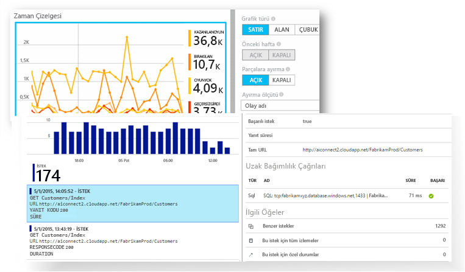

[Merhaba giriş animasyonuna göz atın](https://www.youtube.com/watch?v=fX2NtGrh-Y0).

## Application Insights nasıl çalışır?
Uygulamanızda küçük araçları paketini yükleyin ve hello Microsoft Azure portalında Application Insights kaynağı ayarlayın. Merhaba araçları uygulamanızı izler ve telemetri verileri toohello portal gönderir. (Merhaba uygulaması her yerden çalıştırabilirsiniz - Azure üzerinde barındırılan toobe sahip değil.)

Yalnızca hello web hizmeti uygulama ancak aynı zamanda arka plan bileşenleri izleme ve JavaScript hello web sayfalarında kendilerini hello. 

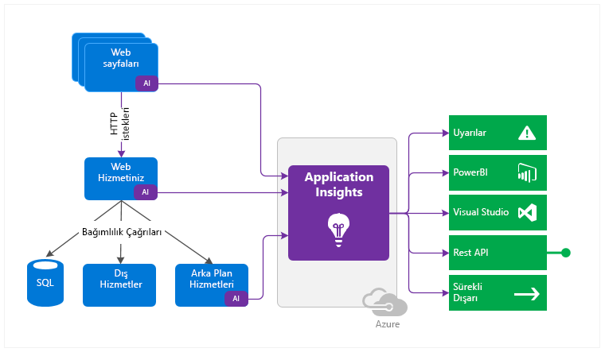

Ayrıca, performans sayaçları, Azure Tanılama veya Docker günlükleri gibi hello konak ortamlarından telemetri içinde çeker. Ayrıca, yapay istekleri tooyour web hizmeti düzenli aralıklarla göndermek web testleri ayarlayabilirsiniz.

Tüm bu telemetri akışları tümleştirilir hello Azure portal, uygulayabileceğiniz güçlü Analitik ve arama araçları toohello ham verileri.

### Merhaba yükünü nedir?
Merhaba, uygulamanızın performansı çok küçük etkisidir. İzleme çağrıları engelleyici değildir ve toplanarak ayrı bir iş parçacığında gönderilir.

## Application Insights neleri izler?

Application Insights hello geliştirme ekibi, uygulamanızı nasıl çalıştığını ve nasıl kullanıldığını anlamak toohelp hedefler. Şunları izler:

* **İstek oranları, yanıt süreleri ve hata oranları**: Hangi sayfaların günün hangi saatlerinde popüler olduğunu ve kullanıcılarınızın konumunu öğrenin. En iyi performansı hangi sayfaların gösterdiğini görün. Daha fazla istek olduğunda yanıt süreleriniz ve hata oranlarınız yükseliyorsa bir kaynak atama sorununuz olabilir. 
* **Bağımlılık oranları, yanıt süreleri ve hata oranları**: Dış hizmetlerin sizi yavaşlatıp yavaşlatmadığını öğrenin.
* **Özel durumlar** - toplanan hello istatistik analiz veya belirli örnekleri seçin ve hello yığın izleme ve ilgili istekleri ayrıntıya gidin. Hem sunucu hem de tarayıcı özel durumları raporlanır.
* **Sayfa görüntüleme sayısı ve yükleme performansı**: Kullanıcılarınızın tarayıcıları tarafından gerçekleştirilir.
* Web sayfalarından **AJAX çağrıları**: Oranlar, yanıt süreleri ve hata oranları.
* **Kullanıcı ve oturum sayıları**.
* Windows veya Linux sunucu makinelerinizden CPU, bellek ve ağ kullanımı gibi **performans sayaçları**. 
* Docker veya Azure’dan **konak tanılama**. 
* Uygulamanızdan **tanılama izleme günlükleri**: İzleme olayları ile istekler arasında bağıntı kurmanıza imkan tanır.
* **Özel olayları ve ölçümleri** öğeleri satılan veya oyunları kazanılan gibi kendiniz hello istemci veya sunucu kodunda tootrack iş olaylarını yazma.

## Telemetrimi nerede görebilirim?

Vardır yolları tooexplore bolca verilerinizi. Aşağıdaki makaleleri inceleyin:

|  |  |
| --- | --- |
| [**Akıllı algılama ve el ile uyarılar**](app-insights-proactive-diagnostics.md) Otomatik uyarı olduğunda hello normal düzeni dışında bir şey tooyour uygulamanın normal desenleri telemetri ve tetikleyici uyarlayın. Belirli özel veya standart ölçüm düzeylerinde de [uyarılar](app-insights-alerts.md) ayarlayabilirsiniz. |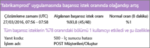 |
| [**Uygulama eşlemesi**](app-insights-app-map.md) anahtar ölçümleri ve Uyarıları ile uygulamanızı Hello bileşenleri. |  |
| [**Profil Oluşturucu**](app-insights-profiler.md) Merhaba yürütme profilleri örneklenen isteklerinin inceleyin. |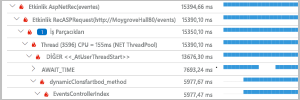 |
| [**Kullanım analizi**](app-insights-usage-overview.md) Kullanıcıların segmentlere nasıl ayrıldığını ve nasıl elde tutulduğunu çözümleyin.| |
| [**Örnek verileri için tanılama arama**](app-insights-diagnostic-search.md) İstekler, özel durumlar, bağımlılık çağrıları, günlük izlemeleri ve sayfa görüntülemeleri gibi olaylarda arama yapın ve bunları filtreleyin.  |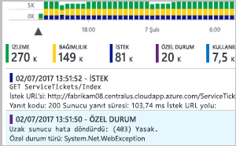 |
| [**Toplu veriler için Ölçüm Gezgini**](app-insights-metrics-explorer.md) İstek, hata ve özel durum oranları; yanıt süreleri, sayfa yükleme süreleri gibi toplu verileri keşfedin, filtreleyin ve bölümlere ayırın. | |
| [**Panolar**](app-insights-dashboards.md#dashboards) Birden çok kaynaktan toplanan verileri birleştirin ve başkalarıyla paylaşın. Birden çok bileşen uygulamaları için ve hello takım odasında sürekli görüntülenmesi için harika. | |
| [**Canlı Ölçüm Akışı**](app-insights-live-stream.md) Yeni bir yapı dağıttığınızda, bu her şeyin beklendiği gibi çalıştığından emin yakın gerçek zamanlı performans göstergeleri toomake izleyin. |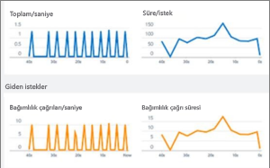 |
| [**Analiz**](app-insights-analytics.md) Bu güçlü sorgulama dilini kullanarak uygulamanızın performansı ve kullanımıyla ilgili zor soruları yanıtlayın. |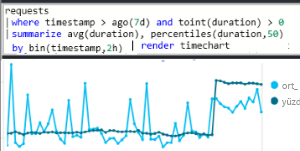 |
| [**Visual Studio**](app-insights-visual-studio.md) Performans veri hello kod konusuna bakın. Toocode Yığın izlemeleri gidin.|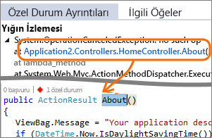 |
| [**Anlık görüntü hata ayıklayıcısı**](app-insights-snapshot-debugger.md) Dinamik işlemlerden örneklenen anlık görüntülerdeki hataları parametre değerleriyle ayıklayın.|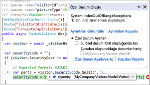 |
| [**Power BI**](app-insights-export-power-bi.md) Kullanım ölçümlerini diğer iş zekası verileriyle tümleştirin.| 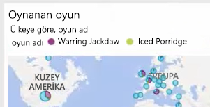|
| [**REST API**](https://dev.applicationinsights.io/) Kod ölçümleri ve ham verileri üzerinden toorun sorgular yazarsınız.|  |
| [**Sürekli dışarı aktarma**](app-insights-export-telemetry.md) Bunu ulaşır ulaşmaz ham verileri toostorage toplu verme. |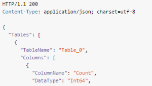 |

## Application Insights’ı nasıl kullanabilirim?

### İzleme
Application Insights’ı uygulamanıza yükleyin, [kullanılabilirlik web testleri](app-insights-monitor-web-app-availability.md) ayarlayın ve:

* Ayarlanmış bir [Pano](app-insights-dashboards.md) yükler ve AJAX çağrıları yük, yanıtlama ve bağımlılıklarınızı hello performansını bir, takım odası tookeep için sayfa.
* Merhaba yavaş ve çoğu başarısız olan istekler olduğu bulur.
* Gözcü [canlı akış](app-insights-live-stream.md) tooknow herhangi bir düşüşü hakkında hemen yeni bir sürüm dağıttığınızda.

### Algılama, Tanılama
Bir uyarı aldığınızda veya bir sorun bulduğunuzda:

* Bu durumdan kaç kullanıcının etkilendiğini değerlendirin.
* Hatalar ile özel durumlar, bağımlılık çağrıları ve izlemeler arasında bağıntı kurun.
* Profil oluşturucuyu, anlık görüntüleri, yığın dökümlerini ve izleme günlüklerini inceleyin.

### Oluşturma, Ölçme, Öğrenme
[Ölçü hello etkinliğini](app-insights-usage-overview.md) dağıttığınız her yeni özellik.

* Toomeasure planlama müşteriler yeni UX veya iş özellikleri kullanma.
* Kodunuza özel telemetri yazın.
* Temel hello sonraki geliştirme, telemetrisinden üzerinde sabit kanıt döngüsü.

## başlarken
Application Insights biridir hello Microsoft Azure ve telemetri içinde barındırılan birçok Hizmetleri çözümleme ve sunu var. gönderilir. Başka bir şey yapmadan önce bir abonelik çok gerekir böylece[Microsoft Azure](http://azure.com). Ücretsiz toosign olduğu ve seçerseniz temel hello [planı fiyatlandırma](https://azure.microsoft.com/pricing/details/application-insights/) Application Insights ' ücretsizdir, uygulamanızın toohave önemli kullanım büyümüştür kadar. Kuruluşunuzun zaten bir abonelik varsa, bunlar, Microsoft hesabı tooit ekleyebilirsiniz.

Birkaç yolu vardır tooget başlatıldı. Sizin için en uygun yöntemi kullanarak başlayın. Başkalarının daha sonra hello ekleyebilirsiniz.

* **Çalışma zamanında: hello sunucuda web uygulamanızı izleme.** Herhangi bir güncelleştirme toohello kod önler. Yönetici erişim tooyour sunucusu gerekir.
  * [**Şirket içinde veya bir VM’de IIS**](app-insights-monitor-performance-live-website-now.md)
  * [**Azure web uygulaması veya VM**](app-insights-monitor-performance-live-website-now.md)
  * [**J2EE**](app-insights-java-live.md)
* **Geliştirme zaman: Application Insights tooyour kodu ekleyin.** Toowrite özel telemetri ve tooinstrument arka uç ve Masaüstü uygulamaları sağlar.
  * [Visual Studio](app-insights-asp-net.md) 2013 güncelleştirme 2 veya sonraki bir sürüm.
  * [Eclipse](app-insights-java-eclipse.md)’te veya [diğer araçlarda](app-insights-java-get-started.md) Java
  * [Node.js](app-insights-nodejs.md)
  * [Diğer platformlar](app-insights-platforms.md)
* Sayfa görütüleme, AJAX ve diğer istemci tarafı telemetri verileri bakımından **[web sayfalarınızı izleyin](app-insights-javascript.md)**.
* **[Kullanılabilirlik testleri](app-insights-monitor-web-app-availability.md)**: Sunucularımızdan web sitenize düzenli aralıklarla ping gönderin.

## Sonraki adımlar
Çalışma zamanında şunlarla kullanmaya başlayın:

* [IIS sunucusu](app-insights-monitor-performance-live-website-now.md)
* [J2EE sunucusu](app-insights-java-live.md)

Geliştirme zamanında şunlarla kullanmaya başlayın:

* [ASP.NET](app-insights-asp-net.md)
* [Java](app-insights-java-get-started.md)
* [Node.js](app-insights-nodejs.md)

## Destek ve geri bildirim
* Sorular ve Sorunlar:
  * [Sorun giderme][qna]
  * [MSDN Forumu](https://social.msdn.microsoft.com/Forums/vstudio/home?forum=ApplicationInsights)
  * [StackOverflow](http://stackoverflow.com/questions/tagged/ms-application-insights)
* Önerileriniz:
  * [UserVoice](https://visualstudio.uservoice.com/forums/357324)
* Blog:
  * [Application Insights blogu](https://azure.microsoft.com/blog/tag/application-insights)

## Videolar

[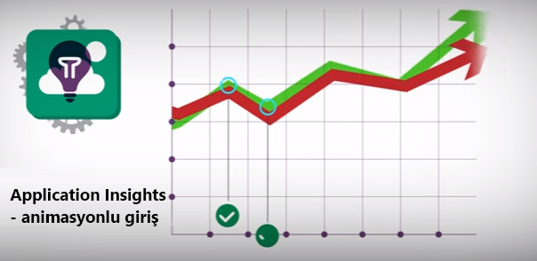](https://www.youtube.com/watch?v=fX2NtGrh-Y0)

> [!VIDEO https://channel9.msdn.com/events/Connect/2016/100/player] 

<!--Link references-->

[android]: https://github.com/Microsoft/ApplicationInsights-Android
[azure]: ../insights-perf-analytics.md
[client]: app-insights-javascript.md
[desktop]: app-insights-windows-desktop.md
[detect]: app-insights-detect-triage-diagnose.md
[greenbrown]: app-insights-asp-net.md
[ios]: https://github.com/Microsoft/ApplicationInsights-iOS
[java]: app-insights-java-get-started.md
[knowUsers]: app-insights-web-track-usage.md
[platforms]: app-insights-platforms.md
[portal]: http://portal.azure.com/
[qna]: app-insights-troubleshoot-faq.md
[redfield]: app-insights-monitor-performance-live-website-now.md
