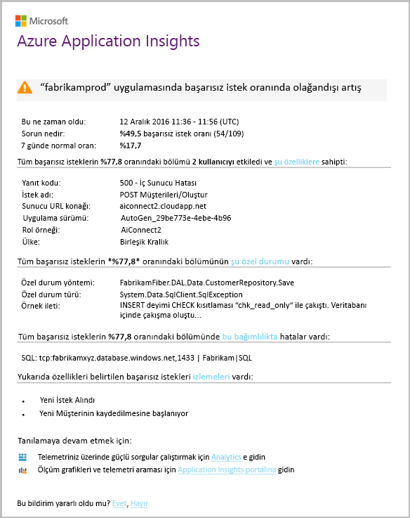

# Akıllı algılama - hatası anormallikleri
[Application Insights](app-insights-overview.md) otomatik olarak web uygulamanızı hello oranı başarısız isteklerin olağan dışı bir artışa karşılaşırsa yakın gerçek zamanlı olarak bildirir. Olağan dışı bir HTTP isteklerini veya başarısız olarak rapor bağımlılık çağrıları hello oranını artışa algılar. İstekler için başarısız olan istekler genellikle yanıt kodları 400 veya daha yüksek olan dosyalardır. Önceliklendirme ve hello sorunu tanılamak toohelp hello özelliklerini hello hataları ve ilgili telemetri analizini hello bildiriminde sağlanır. Daha fazla tanı için bağlantılar toohello Application Insights portalı vardır. machine learning kullandıkça hello özelliğinin hiçbir Kurulum ve yapılandırma, gerekir algoritmaları toopredict hello normal hata oranı.

Bu özellik hello bulutta veya kendi sunucularda barındırılan, Java ve ASP.NET web uygulamaları için kullanılabilir. Çağıran çalışan rolü varsa, örneğin, istek veya bağımlılık telemetri - oluşturduğu herhangi bir uygulama için de çalıştığını [TrackRequest()](app-insights-api-custom-events-metrics.md#trackrequest) veya [TrackDependency()](app-insights-api-custom-events-metrics.md#trackdependency).

Ayarladıktan sonra [projeniz için Application Insights](app-insights-overview.md), ve uygulamanızı belirli bir minimum miktar telemetri oluşturur sağlanan akıllı algılama hatası anormallikleri 24 saat kendisinden önce uygulamanızın toolearn hello normal davranışını alır. açık ve Uyarıları gönderebilirsiniz.

Burada, örnek uyarıyı verilmiştir.

> [!NOTE]
> Varsayılan olarak, bu örnek daha kısa bir biçim posta alın. Ancak [anahtar toothis ayrıntılı biçimde](#configure-alerts).
>
>

Size bildirir dikkat edin:

* Merhaba hata oranı toonormal uygulamanızın davranışını karşılaştırılan.
* Kaç kullanıcı – ne kadar tooworry bilmesi etkilenir.
* Merhaba hatalarla ilgili özellik deseni. Bu örnekte, belirli yanıt kodu, istek adı (işlem) ve uygulamanın sürüm yoktur. Hemen size bildirir nerede toostart kodunuzda aranıyor. Diğer olasılıklar belirli bir tarayıcı veya istemci işletim sistemi olabilir.
* özel durum, günlük izlemelerini ve bağımlılık hatası (veritabanları veya diğer dış bileşenlere) işlemleri hello hatalarla ilgili toobe görünen hello.
* Doğrudan hello telemetri Application ınsights'ta toorelevant aramaları bağlar.

## Akıllı algılama yararları
Sıradan [ölçüm uyarıları](app-insights-alerts.md) bir sorun olabilir söyleyin. Ancak akıllı algılama, aksi takdirde toodo kendiniz sahip hello analiz çok gerçekleştirme hello tanılama iş başlatır. Merhaba sonuçları düzgünce paketlenmiş yardımcı tooget hızlı bir şekilde elde hello sorununun toohello kök.

## Nasıl çalışır?
Akıllı algılama hello telemetriyi uygulamanızdan ve belirli hello başarısızlık oranları alınan izler. Bu kural hello hangi hello isteklerinde sayar `Successful request` özelliği false ve hangi Merhaba çağrı bağımlılık hello sayısı `Successful call` özellik değer false. Varsayılan olarak, istekleri için `Successful request == (resultCode < 400)` (özel kod çok yazmıştır sürece[filtre](app-insights-api-filtering-sampling.md#filtering) ya da kendi oluşturma [TrackRequest](app-insights-api-custom-events-metrics.md#trackrequest) çağrıları). 

Uygulamanızın performansı tipik bir düzen davranışının sahiptir. Bazı istekleri veya bağımlılık çağrıları diğerlerinden daha eğilimlidir toofailure olacaktır; ve hello genel hata oranı yük arttıkça artar. Akıllı algılama toofind bu anormallikleri öğrenme makine kullanır.

Telemetri web uygulamanızdan Application Insights geldiğinde akıllı algılama hello geçerli davranışını son birkaç gün içinde hello görülen hello desenlerle karşılaştırır. Hata oranı olağan dışı bir artışa by comparison with önceki performans gözlenir, analiz tetiklenir.

Analiz tetiklendiğinde hello hizmeti bir küme analizi hello başarısız istek üzerinde tootry tooidentify hello hataları niteleyen değerlerin bir desen gerçekleştirir. Merhaba yukarıdaki örnekte, hello analiz çoğu hata belirli Sonuç kodu, istek adı, sunucu URL'si ana bilgisayar ve rol örneği hakkında olduğunu buldu. Bunun aksine, hello analiz hello istemci işletim sistemi özelliği birden çok değer dağıtılır ve bu nedenle listelenmez buldu.

Hizmetiniz bu telemetri aramaları izlenmiş olan zaman hello analyser bir özel durum ve olanlar ilişkili tüm izleme günlüklerini örneği ile birlikte, tanımlanan hello kümedeki isteklerle ilişkili bağımlılık hatası arar istek sayısı.

değil yapılandırmadığınız sürece hello ortaya çıkan çözümleme tooyou uyarı gönderilir.

Hello gibi [el ile ayarladığınız uyarıları](app-insights-alerts.md), hello hello uyarının durumunu inceleyin ve Application Insights kaynağınıza, hello uyarıları dikey penceresinde yapılandırın. Ancak diğer uyarılar yok yukarı tooset gerekir veya akıllı algılama yapılandırın. İsterseniz, devre dışı bırakın ya da kendi hedef e-posta adreslerini değiştirin.

## Uyarıları yapılandırma
Akıllı algılama devre dışı bırakmak, hello e-posta alıcılarını değiştirmek, bir Web kancası oluşturma veya ayrıntılı toomore kabul uyarı iletileri.

Merhaba uyarıları sayfasını açın. El ile ayarlayın ve, şu anda hello uyarı durumunda olup olmadığını görebilirsiniz herhangi bir uyarı birlikte hatası anormallikleri eklenir.

Merhaba uyarı tooconfigure'ı tıklatın.

Akıllı algılama devre dışı bırakabilir, ancak bunu silemezsiniz dikkat edin (veya başka bir tane oluşturun).

#### Ayrıntılı uyarıları
"Daha ayrıntılı tanılama Al" ı seçerseniz hello e-posta daha fazla tanı bilgilerini içerir. Bazı durumlarda mümkün toodiagnose hello sorun hello e-posta hello verilerden yalnızca oluşturulması.

Olduğundan daha ayrıntılı uyarı hello hafif bir risk, hassas bilgiler içerebilir çünkü özel durum ve izleme iletilerini içerir. Kodunuzu bu iletilerine hassas bilgiler verebilecek ancak, bu yalnızca gerçekleşir.

## Önceliklendirme ve bir uyarı tanılama
Merhaba başarısız istek oranı olağan dışı bir artışa algılandığını bildiren bir uyarı gösterir. Uygulamanızı veya kendi ortam ile ilgili bazı sorunlar olduğunu olasıdır.

İsteklerin ve etkilenen kullanıcıların sayısını Hello sınıflandırılacak nasıl Acil hello sorunu karar verebilirsiniz değil. Merhaba yukarıdaki örnekte, %22.5 hello hata oranı normal %1 hızıyla karşılaştıran, hatalı bir şey olacağına olduğunu gösterir. Üzerindeki diğer yandan Merhaba, yalnızca 11 kullanıcılar bundan etkilendi. Uygulamanızı olsaydı, ne kadar ciddi olan mümkün tooassess olacaktır.

Çoğu durumda, mümkün toodiagnose hello sorunu hızlı bir şekilde hello isteği adı, özel durum, sağlanan bağımlılık hatası ve izleme verileri olacaktır.

Diğer bazı ipuçları vardır. Örneğin, bu örnekte hello bağımlılık hata oranı olan hello (%89.3) özel durum oranı hello gibi aynı. Bu hello özel durum burada NET bir fikir veren doğrudan hello bağımlılık hatasından - ortaya öneren toostart kodunuzda aranıyor.

tooinvestigate Ayrıca, her bölümdeki hello bağlantılar yönlendirilirsiniz düz tooa [arama sayfası](app-insights-diagnostic-search.md) toohello ilgili istekleri, özel durum, bağımlılık veya izlemeleri filtrelenir. Veya hello açabilirsiniz [Azure portal](https://portal.azure.com), uygulamanız için toohello Application Insights kaynağı gidin ve hello hataları dikey penceresini açın.

Bu örnekte, tıklatmak hello 'bağımlılık hataları Ayrıntıları Görüntüle' bağlantı hello Application Insights arama dikey pencere açılır. Merhaba kök nedeni örneği vardır hello SQL deyimini gösterir: null değerlere zorunlu alanlarda sağlanan ve hello kaydetme işlemi sırasında doğrulamayı geçemedi.

## Son uyarıları gözden geçirin

Tıklatın **akıllı algılama** tooget toohello en son uyarısı:

## Merhaba fark nedir...
Akıllı algılama hatası anormallikleri tamamlar diğer benzer ancak ayrı özelliklerini Application Insights.

* [Ölçüm uyarıları](app-insights-alerts.md) tarafından ayarlanır ve çok çeşitli ölçümleri CPU doluluğu, istek hızları, sayfa yükleme sürelerinin ve benzerleri gibi izleyebilirsiniz. Toowarn kullanabilirsiniz, örneğin, daha fazla kaynak tooadd gerekiyorsa. Bunun aksine, size, web uygulamanızın başarısız istek oranı önemli ölçüde artırır sonra gerçek zamanlı şekilde yakın tooweb uygulamanın kıyasla önemli ölçümleri (şu anda yalnızca başarısız istek oranı), küçük aralığını tasarlanmış toonotify akıllı algılama hatası anormallikleri kapsar Normal davranışı.

    Akıllı algılama eşiğini yanıt tooprevailing koşullarında otomatik olarak ayarlar.

    Akıllı algılama, hello tanılama iş başlatır.
* [Akıllı performans anormallikleri](app-insights-proactive-performance-diagnostics.md) de kullandığı Intelligence toodiscover olağan dışı düzenleri ölçümlerinizi makine ve sizin tarafınızdan yapılandırma gereklidir. Ancak hatası anormallikleri akıllı algılama, performans anormallikleri akıllı algılama hello amacı hatalı hizmet, kullanım topluluğu, - örneğin, belirli bir tarayıcı türü belirli sayfalara tarafından toofind kesimleri. hiçbir sonuç bulunursa, büyük olasılıkla toobe bir uyarı daha az Acil olduğunu ve Hello analiz günlük gerçekleştirilir. Bunun aksine, hello çözümleme hatası anormallikleri için sürekli olarak gelen telemetriyi gerçekleştirilir ve sunucu başarısızlık oranları beklenenden daha büyük olduğunda dakika içinde bildirilir.

## Bir akıllı algılaması uyarısı alırsanız
*Neden bu uyarı aldınız?*

* Başarısız istekler karşılaştırıldığında oranı toohello normal taban noktadan önceki hello olağan dışı bir artışa algıladık. Merhaba hataları ve ilişkili telemetri analizi sonra içine görünmelidir bir sorun olduğunu düşünün.

*Merhaba bildirim kesinlikle bir sorun sahibim anlama geliyor?*

* Biz tooalert uygulama kesintisi ya da azalma üzerinde çalışır, ancak yalnızca, tam olarak hello semantik ve hello uygulama veya kullanıcılar üzerindeki etkiyi hello anlayabilirsiniz.

*Bu nedenle, yazarlar verilerimi göz önünde bulundurmanız?*

* Hayır. Merhaba hizmet tamamen otomatik olarak yapılır. Yalnızca hello bildirimler alın. Verileriniz [özel](app-insights-data-retention-privacy.md).

*Toosubscribe toothis uyarı var mı?*

* Hayır. Her uygulamanın gönderdiği telemetri isteği hello akıllı algılama uyarı kuralı vardır.

*Aboneliği veya miyim toomy iş arkadaşlarınızı yerine gönderilen hello bildirim alma?*

* Evet, içinde uyarı kuralları tıklatın hello akıllı algılama kuralı tooconfigure onu. Merhaba uyarıyı devre dışı bırakmak veya hello uyarı için alıcıları değiştirin.

*I hello e-posta kesildi. Merhaba Portalı'nda hello bildirimleri nereden bulabilirim?*

* Hello etkinliklerini günlüğe kaydeder. Azure, uygulamanız için hello Application Insights kaynağını açma sonra etkinlik günlükleri seçin.

*Bazı hello uyarılar hakkında bilinen sorunlar ve tooreceive istemiyorsunuz bunları.*

* Bizim biriktirme listesi üzerinde uyarı gizleme sunuyoruz.

## Sonraki adımlar
Bu tanılama araçları hello telemetriyi uygulamanızdan incelemek yardımcı olur:

* [Ölçüm Gezgini](app-insights-metrics-explorer.md)
* [Arama Gezgini](app-insights-diagnostic-search.md)
* [Analizi - güçlü sorgu dili](app-insights-analytics-tour.md)

Akıllı algılamaların tamamen otomatik olarak yapılır. Ancak, belki de daha fazla bazı uyarılar tooset ister misiniz?

* [El ile yapılandırılmış ölçüm uyarıları](app-insights-alerts.md)
* [Kullanılabilirlik web testleri](app-insights-monitor-web-app-availability.md)
