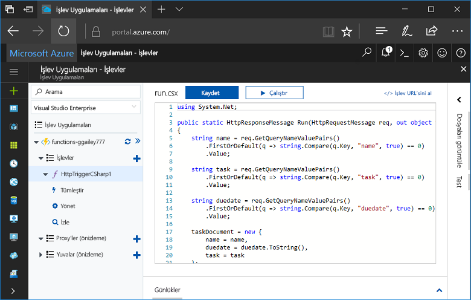
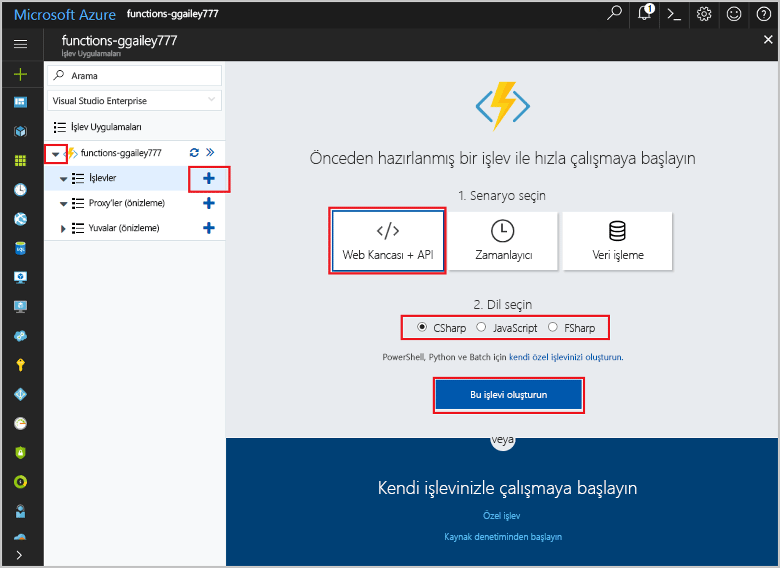
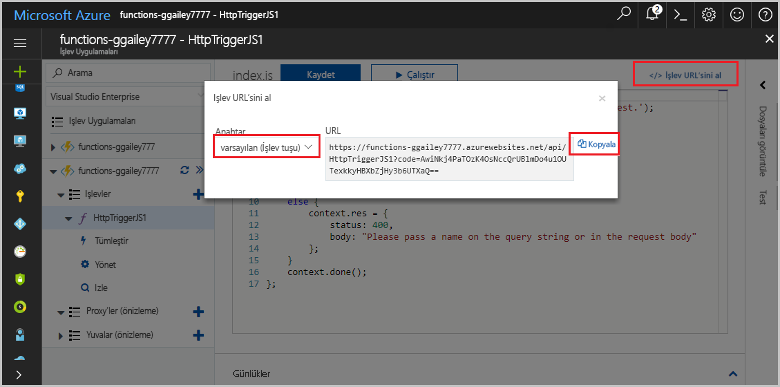
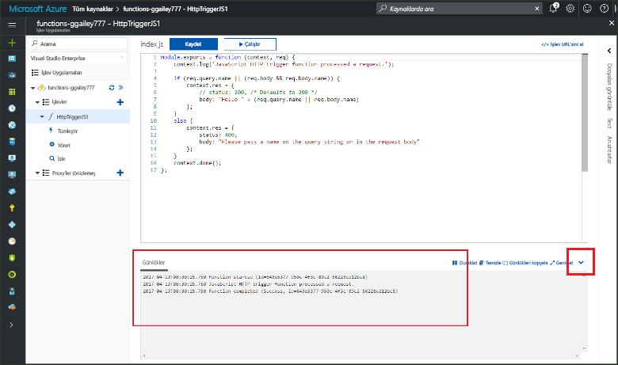

# Hello Azure portalını ilk işlevinizi oluşturmaCreate your first function in hello Azure portal

Azure işlevleri sağlayan bir VM oluşturun veya bir web uygulaması yayımlama toofirst gerek kalmadan sunucusuz bir ortamda kodunuzu yürütün.Azure Functions lets you execute your code in a serverless environment without having toofirst create a VM or publish a web application. Bu konuda, toouse toocreate hello Azure portalı "hello world" işlevinde nasıl çalıştığını öğrenin.In this topic, learn how toouse Functions toocreate a "hello world" function in hello Azure portal.

[!INCLUDE [quickstarts-free-trial-note](../../includes/quickstarts-free-trial-note.md)]

## İçinde tooAzure oturumLog in tooAzure

İçinde toohello oturum [Azure portal](https://portal.azure.com/).Log in toohello [Azure portal](https://portal.azure.com/).

## İşlev uygulaması oluşturmaCreate a function app

Bir işlev uygulaması toohost hello işlevlerinizin yürütülmesini olması gerekir.You must have a function app toohost hello execution of your functions. İşlev uygulaması, kaynakların daha kolay yönetilmesi, dağıtılması ve paylaşılması için işlevleri bir mantıksal birim olarak gruplandırmanıza olanak tanır.A function app lets you group functions as a logic unit for easier management, deployment, and sharing of resources. 

[!INCLUDE [Create function app Azure portal](../../includes/functions-create-function-app-portal.md)]

[!INCLUDE [functions-portal-favorite-function-apps](../../includes/functions-portal-favorite-function-apps.md)]

Ardından, hello yeni işlev uygulamada bir işlev oluşturun.Next, you create a function in hello new function app.

## HTTP ile tetiklenen bir işlev oluşturmaCreate an HTTP triggered function

1. Yeni işlev uygulamanız genişletin ve ardından hello  **+**  sonraki çok düğmesini**işlevler**.Expand your new function app, then click hello **+** button next too**Functions**.

2.  Merhaba, **hızlı şekilde kullanmaya** sayfasında, **Web kancası + API**, **bir dil seçin** işlevi ve tıklatın **bu işlev oluşturma** .In hello **Get started quickly** page, select **WebHook + API**, **Choose a language** for your function, and click **Create this function**. 
   
    

Bir işlev hello şablonu için bir HTTP tetiklenen işlevi kullanarak seçmiş olduğunuz dili oluşturulur.A function is created in your chosen language using hello template for an HTTP triggered function. Bir HTTP isteği göndererek hello yeni işlev çalıştırabilirsiniz.You can run hello new function by sending an HTTP request.

## Test hello işleviTest hello function

1. Yeni işlevinizde **</> İşlev URL'sini al**'a tıklayın, **varsayılan (İşlev anahtarı)** seçeneğini belirleyin ve ardından **Kopyala**'ya tıklayın.In your new function, click **</> Get function URL**, select **default (Function key)**, and then click **Copy**. 

    

2. Merhaba işlevi URL'sini tarayıcınızın adres çubuğuna yapıştırın.Paste hello function URL into your browser's address bar. Merhaba sorgu dizesi eklemek `&name=<yourname>` toothis URL ve tuşuna hello `Enter` klavye tooexecute hello isteğiniz üzerinde anahtar.Append hello query string `&name=<yourname>` toothis URL and press hello `Enter` key on your keyboard tooexecute hello request. Merhaba, hello Edge tarayıcısında hello işlevi tarafından döndürülen hello yanıt örneği aşağıdadır:hello following is an example of hello response returned by hello function in hello Edge browser:

    

    Merhaba istek URL'sini içerir, varsayılan olarak, tooaccess gerekli bir anahtarı işlevinizi HTTP üzerinden.hello request URL includes a key that is required, by default, tooaccess your function over HTTP.   

3. İşlevinizi çalıştığında, izleme bilgilerini toohello günlüklerine yazılır.When your function runs, trace information is written toohello logs. Merhaba önceki yürütme toosee hello izleme çıktısını hello Portalı'nda tooyour işlevi dönün ve yukarı ok Merhaba ekranında tooexpand hello sonundaki hello **günlükleri**.toosee hello trace output from hello previous execution, return tooyour function in hello portal and click hello up arrow at hello bottom of hello screen tooexpand **Logs**. 

   

## Kaynakları temizlemeClean up resources

[!INCLUDE [Clean up resources](../../includes/functions-quickstart-cleanup.md)]

## Sonraki adımlarNext steps

HTTP ile tetiklenen basit bir işlevi kullanarak işlev uygulaması oluşturdunuz.You have created a function app with a simple HTTP triggered function.  

[!INCLUDE [Next steps note](../../includes/functions-quickstart-next-steps.md)]

Daha fazla bilgi için bkz. [Azure İşlevleri HTTP ve web kancası bağlamaları](functions-bindings-http-webhook.md).For more information, see [Azure Functions HTTP and webhook bindings](functions-bindings-http-webhook.md).

