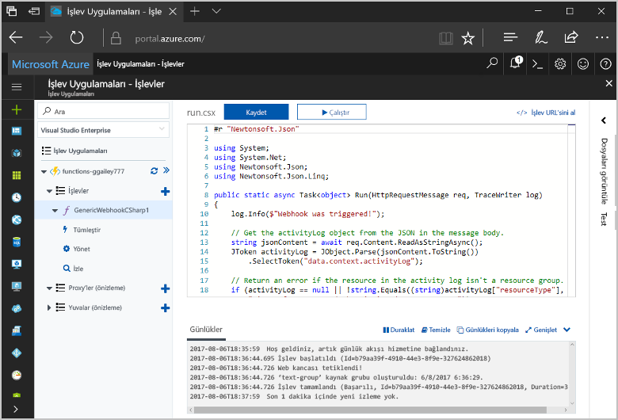
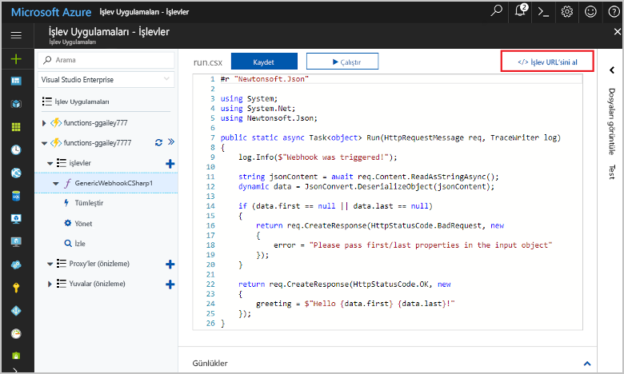
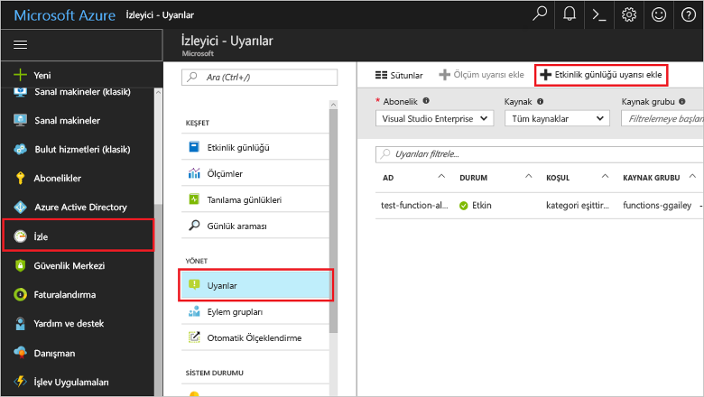
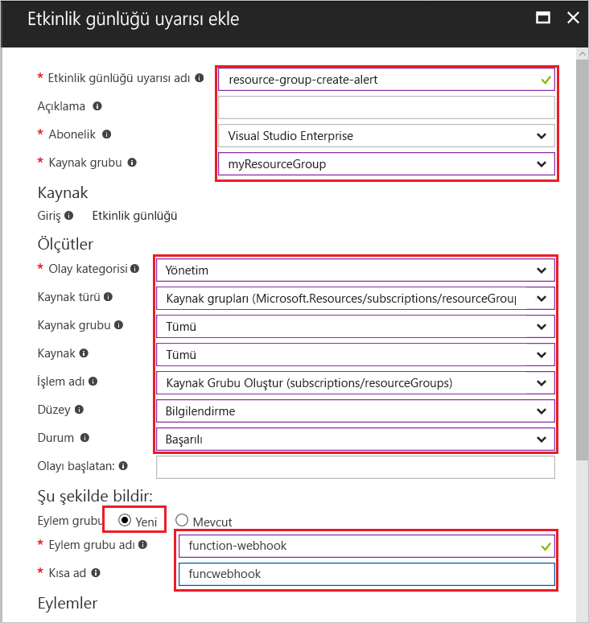
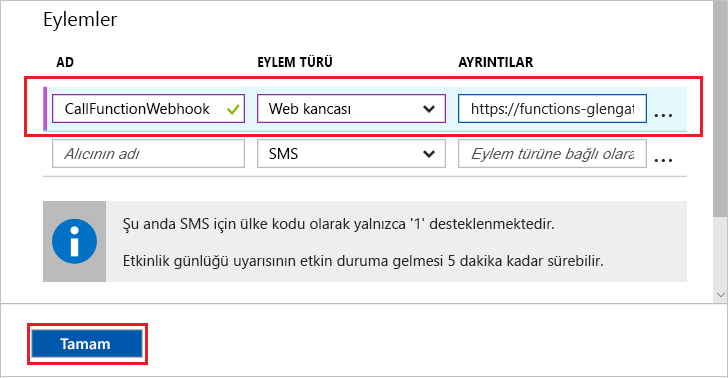
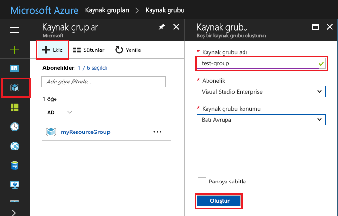
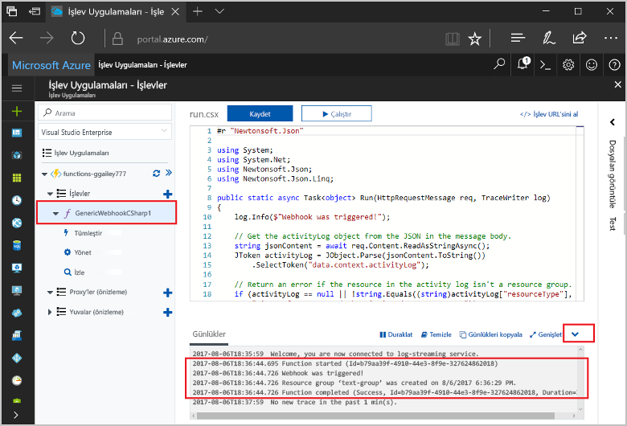

# <a name="create-a-function-triggered-by-a-generic-webhook"></a><span data-ttu-id="6a7e7-103">Genel bir Web kancası tarafından tetiklenen bir işlev oluşturun</span><span class="sxs-lookup"><span data-stu-id="6a7e7-103">Create a function triggered by a generic webhook</span></span>

<span data-ttu-id="6a7e7-104">Azure işlevleri sağlayan bir VM oluşturun veya bir web uygulaması yayımlama toofirst gerek kalmadan sunucusuz bir ortamda kodunuzu yürütün.</span><span class="sxs-lookup"><span data-stu-id="6a7e7-104">Azure Functions lets you execute your code in a serverless environment without having toofirst create a VM or publish a web application.</span></span> <span data-ttu-id="6a7e7-105">Örneğin, Azure İzleyici tarafından verilen bir uyarı tarafından tetiklenen bir işlev toobe yapılandırabilirsiniz.</span><span class="sxs-lookup"><span data-stu-id="6a7e7-105">For example, you can configure a function toobe triggered by an alert raised by Azure Monitor.</span></span> <span data-ttu-id="6a7e7-106">Bu konuda, bir kaynak grubu olduğunda tooexecute C# kodu tooyour abonelik nasıl eklenen gösterir.</span><span class="sxs-lookup"><span data-stu-id="6a7e7-106">This topic shows you how tooexecute C# code when a resource group is added tooyour subscription.</span></span>   



## <a name="prerequisites"></a><span data-ttu-id="6a7e7-108">Ön koşullar</span><span class="sxs-lookup"><span data-stu-id="6a7e7-108">Prerequisites</span></span> 

<span data-ttu-id="6a7e7-109">toocomplete Bu öğretici:</span><span class="sxs-lookup"><span data-stu-id="6a7e7-109">toocomplete this tutorial:</span></span>

+ <span data-ttu-id="6a7e7-110">Azure aboneliğiniz yoksa başlamadan önce [ücretsiz bir hesap](https://azure.microsoft.com/free/?WT.mc_id=A261C142F) oluşturun.</span><span class="sxs-lookup"><span data-stu-id="6a7e7-110">If you don't have an Azure subscription, create a [free account](https://azure.microsoft.com/free/?WT.mc_id=A261C142F) before you begin.</span></span>

[!INCLUDE [functions-portal-favorite-function-apps](../../includes/functions-portal-favorite-function-apps.md)]

## <a name="create-an-azure-function-app"></a><span data-ttu-id="6a7e7-111">Azure İşlev uygulaması oluşturma</span><span class="sxs-lookup"><span data-stu-id="6a7e7-111">Create an Azure Function app</span></span>

[!INCLUDE [Create function app Azure portal](../../includes/functions-create-function-app-portal.md)]

<span data-ttu-id="6a7e7-112">Ardından, hello yeni işlev uygulamada bir işlev oluşturun.</span><span class="sxs-lookup"><span data-stu-id="6a7e7-112">Next, you create a function in hello new function app.</span></span>

## <span data-ttu-id="6a7e7-113"><a name="create-function"></a>Genel Web kancası tetiklenen bir işlev oluşturun</span><span class="sxs-lookup"><span data-stu-id="6a7e7-113"><a name="create-function"></a>Create a generic webhook triggered function</span></span>

1. <span data-ttu-id="6a7e7-114">Merhaba, işlev uygulaması'nı genişletin ve  **+**  sonraki çok düğmesini**işlevler**.</span><span class="sxs-lookup"><span data-stu-id="6a7e7-114">Expand your function app and click hello **+** button next too**Functions**.</span></span> <span data-ttu-id="6a7e7-115">Bu işlev olan Merhaba, birinci işlevi uygulamanızı seçin **özel işlevi**.</span><span class="sxs-lookup"><span data-stu-id="6a7e7-115">If this function is hello first one in your function app, select **Custom function**.</span></span> <span data-ttu-id="6a7e7-116">Merhaba eksiksiz işlev şablonları görüntüler.</span><span class="sxs-lookup"><span data-stu-id="6a7e7-116">This displays hello complete set of function templates.</span></span>

    

2. <span data-ttu-id="6a7e7-118">Select hello **Genel Web kancası - C#** şablonu.</span><span class="sxs-lookup"><span data-stu-id="6a7e7-118">Select hello **Generic WebHook - C#** template.</span></span> <span data-ttu-id="6a7e7-119">C# işlevi için bir ad yazın ve ardından **oluşturma**.</span><span class="sxs-lookup"><span data-stu-id="6a7e7-119">Type a name for your C# function, then select **Create**.</span></span>

      

2. <span data-ttu-id="6a7e7-121">Yeni işlevinizi tıklatın **<> / Get işlevi URL**, daha sonra kopyalayın ve hello değeri kaydedin.</span><span class="sxs-lookup"><span data-stu-id="6a7e7-121">In your new function, click **</> Get function URL**, then copy and save hello value.</span></span> <span data-ttu-id="6a7e7-122">Bu değer tooconfigure hello Web kancası kullanın.</span><span class="sxs-lookup"><span data-stu-id="6a7e7-122">You use this value tooconfigure hello webhook.</span></span> 

    
         
<span data-ttu-id="6a7e7-124">Ardından, bir etkinlik günlüğü uyarı Azure İzleyicisi'nde bir Web kancası uç noktası oluşturun.</span><span class="sxs-lookup"><span data-stu-id="6a7e7-124">Next, you create a webhook endpoint in an activity log alert in Azure Monitor.</span></span> 

## <a name="create-an-activity-log-alert"></a><span data-ttu-id="6a7e7-125">Bir etkinlik günlüğü uyarı oluşturabilir.</span><span class="sxs-lookup"><span data-stu-id="6a7e7-125">Create an activity log alert</span></span>

1. <span data-ttu-id="6a7e7-126">De Azure portal Merhaba, toohello gidin **İzleyici** hizmeti, select **uyarıları**, tıklatıp **etkinlik günlüğü uyarı Ekle**.</span><span class="sxs-lookup"><span data-stu-id="6a7e7-126">In hello Azure portal, navigate toohello **Monitor** service, select **Alerts**, and click **Add activity log alert**.</span></span>   

    

2. <span data-ttu-id="6a7e7-128">Merhaba tabloda belirtildiği gibi Hello ayarları kullanın:</span><span class="sxs-lookup"><span data-stu-id="6a7e7-128">Use hello settings as specified in hello table:</span></span>

    

    | <span data-ttu-id="6a7e7-130">Ayar</span><span class="sxs-lookup"><span data-stu-id="6a7e7-130">Setting</span></span>      |  <span data-ttu-id="6a7e7-131">Önerilen değer</span><span class="sxs-lookup"><span data-stu-id="6a7e7-131">Suggested value</span></span>   | <span data-ttu-id="6a7e7-132">Açıklama</span><span class="sxs-lookup"><span data-stu-id="6a7e7-132">Description</span></span>                              |
    | ------------ |  ------- | -------------------------------------------------- |
    | <span data-ttu-id="6a7e7-133">**Etkinlik günlüğü uyarı adı**</span><span class="sxs-lookup"><span data-stu-id="6a7e7-133">**Activity log alert name**</span></span> | <span data-ttu-id="6a7e7-134">kaynak-grubu-oluştur-uyarı</span><span class="sxs-lookup"><span data-stu-id="6a7e7-134">resource-group-create-alert</span></span> | <span data-ttu-id="6a7e7-135">Merhaba etkinlik günlüğü uyarı adı.</span><span class="sxs-lookup"><span data-stu-id="6a7e7-135">Name of hello activity log alert.</span></span> |
    | <span data-ttu-id="6a7e7-136">**Abonelik**</span><span class="sxs-lookup"><span data-stu-id="6a7e7-136">**Subscription**</span></span> | <span data-ttu-id="6a7e7-137">Aboneliğiniz</span><span class="sxs-lookup"><span data-stu-id="6a7e7-137">Your subscription</span></span> | <span data-ttu-id="6a7e7-138">Bu öğretici için kullandığınız hello abonelik.</span><span class="sxs-lookup"><span data-stu-id="6a7e7-138">hello subscription you are using for this tutorial.</span></span> | 
    |  <span data-ttu-id="6a7e7-139">**Kaynak Grubu**</span><span class="sxs-lookup"><span data-stu-id="6a7e7-139">**Resource Group**</span></span> | <span data-ttu-id="6a7e7-140">myResourceGroup</span><span class="sxs-lookup"><span data-stu-id="6a7e7-140">myResourceGroup</span></span> | <span data-ttu-id="6a7e7-141">Merhaba uyarı kaynakları dağıtılan hello kaynak grubu.</span><span class="sxs-lookup"><span data-stu-id="6a7e7-141">hello resource group that hello alert resources are deployed to.</span></span> <span data-ttu-id="6a7e7-142">Kullanarak hello aynı kaynak grubunu hello öğreticiyi tamamladıktan sonra işlev uygulaması daha kolay tooclean kolaylaştırır gibi.</span><span class="sxs-lookup"><span data-stu-id="6a7e7-142">Using hello same resource group as your function app makes it easier tooclean up after you complete hello tutorial.</span></span> |
    | <span data-ttu-id="6a7e7-143">**Olay kategorisi**</span><span class="sxs-lookup"><span data-stu-id="6a7e7-143">**Event category**</span></span> | <span data-ttu-id="6a7e7-144">Yönetim</span><span class="sxs-lookup"><span data-stu-id="6a7e7-144">Administrative</span></span> | <span data-ttu-id="6a7e7-145">Bu kategori tooAzure kaynakları yapılan değişiklikleri içerir.</span><span class="sxs-lookup"><span data-stu-id="6a7e7-145">This category includes changes made tooAzure resources.</span></span>  |
    | <span data-ttu-id="6a7e7-146">**Kaynak türü**</span><span class="sxs-lookup"><span data-stu-id="6a7e7-146">**Resource type**</span></span> | <span data-ttu-id="6a7e7-147">Kaynak grupları</span><span class="sxs-lookup"><span data-stu-id="6a7e7-147">Resource groups</span></span> | <span data-ttu-id="6a7e7-148">Uyarıları tooresource Grup etkinlikleri filtreler.</span><span class="sxs-lookup"><span data-stu-id="6a7e7-148">Filters alerts tooresource group activities.</span></span> |
    | <span data-ttu-id="6a7e7-149">**Kaynak Grubu**</span><span class="sxs-lookup"><span data-stu-id="6a7e7-149">**Resource Group**</span></span><br/><span data-ttu-id="6a7e7-150">ve **kaynak**</span><span class="sxs-lookup"><span data-stu-id="6a7e7-150">and **Resource**</span></span> | <span data-ttu-id="6a7e7-151">Tümü</span><span class="sxs-lookup"><span data-stu-id="6a7e7-151">All</span></span> | <span data-ttu-id="6a7e7-152">Tüm kaynaklar izleyin.</span><span class="sxs-lookup"><span data-stu-id="6a7e7-152">Monitor all resources.</span></span> |
    | <span data-ttu-id="6a7e7-153">**İşlem adı**</span><span class="sxs-lookup"><span data-stu-id="6a7e7-153">**Operation name**</span></span> | <span data-ttu-id="6a7e7-154">Kaynak Grubu oluşturma</span><span class="sxs-lookup"><span data-stu-id="6a7e7-154">Create Resource Group</span></span> | <span data-ttu-id="6a7e7-155">Uyarıları toocreate işlemleri filtreler.</span><span class="sxs-lookup"><span data-stu-id="6a7e7-155">Filters alerts toocreate operations.</span></span> |
    | <span data-ttu-id="6a7e7-156">**Düzeyi**</span><span class="sxs-lookup"><span data-stu-id="6a7e7-156">**Level**</span></span> | <span data-ttu-id="6a7e7-157">Bilgilendirme</span><span class="sxs-lookup"><span data-stu-id="6a7e7-157">Informational</span></span> | <span data-ttu-id="6a7e7-158">Bilgilendirici düzeyi uyarılar içerir.</span><span class="sxs-lookup"><span data-stu-id="6a7e7-158">Include informational level alerts.</span></span> | 
    | <span data-ttu-id="6a7e7-159">**Durumu**</span><span class="sxs-lookup"><span data-stu-id="6a7e7-159">**Status**</span></span> | <span data-ttu-id="6a7e7-160">Başarılı oldu</span><span class="sxs-lookup"><span data-stu-id="6a7e7-160">Succeeded</span></span> | <span data-ttu-id="6a7e7-161">Başarılı bir şekilde tamamladınız uyarıları tooactions filtreler.</span><span class="sxs-lookup"><span data-stu-id="6a7e7-161">Filters alerts tooactions that have completed successfully.</span></span> |
    | <span data-ttu-id="6a7e7-162">**Eylem grubu**</span><span class="sxs-lookup"><span data-stu-id="6a7e7-162">**Action group**</span></span> | <span data-ttu-id="6a7e7-163">Yeni</span><span class="sxs-lookup"><span data-stu-id="6a7e7-163">New</span></span> | <span data-ttu-id="6a7e7-164">Bir uyarı oluştuğunda, hello eylemi alır tanımlayan yeni bir eylem grubu oluşturun.</span><span class="sxs-lookup"><span data-stu-id="6a7e7-164">Create a new action group, which defines hello action takes when an alert is raised.</span></span> |
    | <span data-ttu-id="6a7e7-165">**Eylem grup adı**</span><span class="sxs-lookup"><span data-stu-id="6a7e7-165">**Action group name**</span></span> | <span data-ttu-id="6a7e7-166">Web kancası işlevi</span><span class="sxs-lookup"><span data-stu-id="6a7e7-166">function-webhook</span></span> | <span data-ttu-id="6a7e7-167">Ad tooidentify hello eylem grup.</span><span class="sxs-lookup"><span data-stu-id="6a7e7-167">A name tooidentify hello action group.</span></span>  | 
    | <span data-ttu-id="6a7e7-168">**Kısa ad**</span><span class="sxs-lookup"><span data-stu-id="6a7e7-168">**Short name**</span></span> | <span data-ttu-id="6a7e7-169">funcwebhook</span><span class="sxs-lookup"><span data-stu-id="6a7e7-169">funcwebhook</span></span> | <span data-ttu-id="6a7e7-170">Merhaba eylem grubu için kısa bir ad.</span><span class="sxs-lookup"><span data-stu-id="6a7e7-170">A short name for hello action group.</span></span> |  

3. <span data-ttu-id="6a7e7-171">İçinde **Eylemler**, hello tabloda belirtildiği gibi hello ayarlarını kullanarak Eylem Ekle:</span><span class="sxs-lookup"><span data-stu-id="6a7e7-171">In **Actions**, add an action using hello settings as specified in hello table:</span></span> 

    

    | <span data-ttu-id="6a7e7-173">Ayar</span><span class="sxs-lookup"><span data-stu-id="6a7e7-173">Setting</span></span>      |  <span data-ttu-id="6a7e7-174">Önerilen değer</span><span class="sxs-lookup"><span data-stu-id="6a7e7-174">Suggested value</span></span>   | <span data-ttu-id="6a7e7-175">Açıklama</span><span class="sxs-lookup"><span data-stu-id="6a7e7-175">Description</span></span>                              |
    | ------------ |  ------- | -------------------------------------------------- |
    | <span data-ttu-id="6a7e7-176">**Ad**</span><span class="sxs-lookup"><span data-stu-id="6a7e7-176">**Name**</span></span> | <span data-ttu-id="6a7e7-177">CallFunctionWebhook</span><span class="sxs-lookup"><span data-stu-id="6a7e7-177">CallFunctionWebhook</span></span> | <span data-ttu-id="6a7e7-178">Merhaba eylem için bir ad.</span><span class="sxs-lookup"><span data-stu-id="6a7e7-178">A name for hello action.</span></span> |
    | <span data-ttu-id="6a7e7-179">**Eylem türü**</span><span class="sxs-lookup"><span data-stu-id="6a7e7-179">**Action type**</span></span> | <span data-ttu-id="6a7e7-180">Web Kancası</span><span class="sxs-lookup"><span data-stu-id="6a7e7-180">Webhook</span></span> | <span data-ttu-id="6a7e7-181">Merhaba yanıt toohello uyarı, bir Web kancası URL'si adlandırılır belirtir.</span><span class="sxs-lookup"><span data-stu-id="6a7e7-181">hello response toohello alert is that a Webhook URL is called.</span></span> |
    | <span data-ttu-id="6a7e7-182">**Ayrıntılar**</span><span class="sxs-lookup"><span data-stu-id="6a7e7-182">**Details**</span></span> | <span data-ttu-id="6a7e7-183">İşlev URL'si</span><span class="sxs-lookup"><span data-stu-id="6a7e7-183">Function URL</span></span> | <span data-ttu-id="6a7e7-184">Daha önce kopyaladığınız hello işlevinin Hello Web kancası URL'si yapıştırın.</span><span class="sxs-lookup"><span data-stu-id="6a7e7-184">Paste in hello webhook URL of hello function that you copied earlier.</span></span> |<span data-ttu-id="6a7e7-185">v</span><span class="sxs-lookup"><span data-stu-id="6a7e7-185">v</span></span>

4. <span data-ttu-id="6a7e7-186">Tıklatın **Tamam** toocreate hello uyarı ve eylem grubu.</span><span class="sxs-lookup"><span data-stu-id="6a7e7-186">Click **OK** toocreate hello alert and action group.</span></span>  

<span data-ttu-id="6a7e7-187">bir kaynak grubu, aboneliğinizde oluşturulduğunda hello Web kancası şimdi adı verilir.</span><span class="sxs-lookup"><span data-stu-id="6a7e7-187">hello webhook is now called when a resource group is created in your subscription.</span></span> <span data-ttu-id="6a7e7-188">Ardından, işlevi toohandle hello hello hello istek gövdesinde JSON günlük verilerini hello kodunu güncelleştirin.</span><span class="sxs-lookup"><span data-stu-id="6a7e7-188">Next, you update hello code in your function toohandle hello JSON log data in hello body of hello request.</span></span>   

## <a name="update-hello-function-code"></a><span data-ttu-id="6a7e7-189">Merhaba işlev kodunu güncelleştirmesi</span><span class="sxs-lookup"><span data-stu-id="6a7e7-189">Update hello function code</span></span>

1. <span data-ttu-id="6a7e7-190">Merhaba portalında geri tooyour işlevi uygulamasına gidin ve işlevinizi genişletin.</span><span class="sxs-lookup"><span data-stu-id="6a7e7-190">Navigate back tooyour function app in hello portal, and expand your function.</span></span> 

2. <span data-ttu-id="6a7e7-191">Merhaba C# kodu hello portalında hello işlevindeki koddan hello ile değiştirin:</span><span class="sxs-lookup"><span data-stu-id="6a7e7-191">Replace hello C# script code in hello function in hello portal with hello following code:</span></span>

    ```csharp
    #r "Newtonsoft.Json"
    
    using System;
    using System.Net;
    using Newtonsoft.Json;
    using Newtonsoft.Json.Linq;
    
    public static async Task<object> Run(HttpRequestMessage req, TraceWriter log)
    {
        log.Info($"Webhook was triggered!");
    
        // Get hello activityLog object from hello JSON in hello message body.
        string jsonContent = await req.Content.ReadAsStringAsync();
        JToken activityLog = JObject.Parse(jsonContent.ToString())
            .SelectToken("data.context.activityLog");
    
        // Return an error if hello resource in hello activity log isn't a resource group. 
        if (activityLog == null || !string.Equals((string)activityLog["resourceType"], 
            "Microsoft.Resources/subscriptions/resourcegroups"))
        {
            log.Error("An error occured");
            return req.CreateResponse(HttpStatusCode.BadRequest, new
            {
                error = "Unexpected message payload or wrong alert received."
            });
        }
    
        // Write information about hello created resource group toohello streaming log.
        log.Info(string.Format("Resource group '{0}' was {1} on {2}.",
            (string)activityLog["resourceGroupName"],
            ((string)activityLog["subStatus"]).ToLower(), 
            (DateTime)activityLog["submissionTimestamp"]));
    
        return req.CreateResponse(HttpStatusCode.OK);    
    }
    ```

<span data-ttu-id="6a7e7-192">Şimdi, aboneliğinizde yeni bir kaynak grubu oluşturarak hello işlevi test edebilirsiniz.</span><span class="sxs-lookup"><span data-stu-id="6a7e7-192">Now you can test hello function by creating a new resource group in your subscription.</span></span>

## <a name="test-hello-function"></a><span data-ttu-id="6a7e7-193">Test hello işlevi</span><span class="sxs-lookup"><span data-stu-id="6a7e7-193">Test hello function</span></span>

1. <span data-ttu-id="6a7e7-194">Hello kaynak grubu simgesini'hello Azure portal, select hello sol **+ Ekle**, bir **kaynak grubu adı**seçip **oluşturma** toocreate boş bir kaynak grubu.</span><span class="sxs-lookup"><span data-stu-id="6a7e7-194">Click hello resource group icon in hello left of hello Azure portal, select **+ Add**, type a **Resource group name**, and select **Create** toocreate an empty resource group.</span></span>
    
    

2. <span data-ttu-id="6a7e7-196">Tooyour işlevi geri dönün ve hello genişletin **günlükleri** penceresi.</span><span class="sxs-lookup"><span data-stu-id="6a7e7-196">Go back tooyour function and expand hello **Logs** window.</span></span> <span data-ttu-id="6a7e7-197">Hello kaynak grubu oluşturulduktan sonra hello etkinlik günlüğü uyarı Tetikleyicileri hello Web kancası ve hello işlevi yürütür.</span><span class="sxs-lookup"><span data-stu-id="6a7e7-197">After hello resource group is created, hello activity log alert triggers hello webhook and hello function executes.</span></span> <span data-ttu-id="6a7e7-198">Merhaba hello toohello günlükleri yazılan yeni kaynak grubu adını bakın.</span><span class="sxs-lookup"><span data-stu-id="6a7e7-198">You see hello name of hello new resource group written toohello logs.</span></span>  

    

3. <span data-ttu-id="6a7e7-200">(İsteğe bağlı) Geri dönün ve oluşturduğunuz hello kaynak grubunu silebilirsiniz.</span><span class="sxs-lookup"><span data-stu-id="6a7e7-200">(Optional) Go back and delete hello resource group that you created.</span></span> <span data-ttu-id="6a7e7-201">Bu etkinlik Tetik hello işlevi değil unutmayın.</span><span class="sxs-lookup"><span data-stu-id="6a7e7-201">Note that this activity doesn't trigger hello function.</span></span> <span data-ttu-id="6a7e7-202">Bunun nedeni, operations filtrelenir hello uyarı tarafından Sil.</span><span class="sxs-lookup"><span data-stu-id="6a7e7-202">This is because delete operations are filtered out by hello alert.</span></span> 

## <a name="clean-up-resources"></a><span data-ttu-id="6a7e7-203">Kaynakları temizleme</span><span class="sxs-lookup"><span data-stu-id="6a7e7-203">Clean up resources</span></span>

[!INCLUDE [Next steps note](../../includes/functions-quickstart-cleanup.md)]

## <a name="next-steps"></a><span data-ttu-id="6a7e7-204">Sonraki adımlar</span><span class="sxs-lookup"><span data-stu-id="6a7e7-204">Next steps</span></span>

<span data-ttu-id="6a7e7-205">Genel bir Web kancası bir istek alındığında çalıştırılan bir işlev oluşturdunuz.</span><span class="sxs-lookup"><span data-stu-id="6a7e7-205">You have created a function that runs when a request is received from a generic webhook.</span></span> 

[!INCLUDE [Next steps note](../../includes/functions-quickstart-next-steps.md)]

<span data-ttu-id="6a7e7-206">Web kancası bağlamaları hakkında daha fazla bilgi için bkz. [Azure İşlevleri HTTP ve web kancası bağlamaları](functions-bindings-http-webhook.md).</span><span class="sxs-lookup"><span data-stu-id="6a7e7-206">For more information about webhook triggers, see [Azure Functions HTTP and webhook bindings](functions-bindings-http-webhook.md).</span></span> <span data-ttu-id="6a7e7-207">C# ' ta, işlevleri geliştirme hakkında daha fazla toolearn bkz [Azure işlevleri C# betik Geliştirici Başvurusu](functions-reference-csharp.md).</span><span class="sxs-lookup"><span data-stu-id="6a7e7-207">toolearn more about developing functions in C#, see [Azure Functions C# script developer reference](functions-reference-csharp.md).</span></span>

