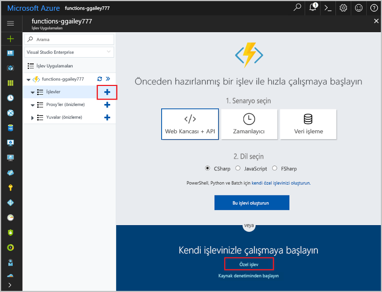

# <a name="create-a-function-triggered-by-a-generic-webhook"></a>Genel bir Web kancası tarafından tetiklenen bir işlev oluşturun

Azure işlevleri sağlayan bir VM oluşturun veya bir web uygulaması yayımlama toofirst gerek kalmadan sunucusuz bir ortamda kodunuzu yürütün. Örneğin, Azure İzleyici tarafından verilen bir uyarı tarafından tetiklenen bir işlev toobe yapılandırabilirsiniz. Bu konuda, bir kaynak grubu olduğunda tooexecute C# kodu tooyour abonelik nasıl eklenen gösterir.   


## <a name="prerequisites"></a>Ön koşullar 

toocomplete Bu öğretici:

+ Azure aboneliğiniz yoksa başlamadan önce [ücretsiz bir hesap](https://azure.microsoft.com/free/?WT.mc_id=A261C142F) oluşturun.

[!INCLUDE [functions-portal-favorite-function-apps](../../includes/functions-portal-favorite-function-apps.md)]

## <a name="create-an-azure-function-app"></a>Azure İşlev uygulaması oluşturma

[!INCLUDE [Create function app Azure portal](../../includes/functions-create-function-app-portal.md)]

Ardından, hello yeni işlev uygulamada bir işlev oluşturun.

## <a name="create-function"></a>Genel Web kancası tetiklenen bir işlev oluşturun

1. Merhaba, işlev uygulaması'nı genişletin ve  **+**  sonraki çok düğmesini**işlevler**. Bu işlev olan Merhaba, birinci işlevi uygulamanızı seçin **özel işlevi**. Merhaba eksiksiz işlev şablonları görüntüler.

    

2. Select hello **Genel Web kancası - C#** şablonu. C# işlevi için bir ad yazın ve ardından **oluşturma**.

      

2. Yeni işlevinizi tıklatın **<> / Get işlevi URL**, daha sonra kopyalayın ve hello değeri kaydedin. Bu değer tooconfigure hello Web kancası kullanın. 

    
         
Ardından, bir etkinlik günlüğü uyarı Azure İzleyicisi'nde bir Web kancası uç noktası oluşturun. 

## <a name="create-an-activity-log-alert"></a>Bir etkinlik günlüğü uyarı oluşturabilir.

1. De Azure portal Merhaba, toohello gidin **İzleyici** hizmeti, select **uyarıları**, tıklatıp **etkinlik günlüğü uyarı Ekle**.   

    

2. Merhaba tabloda belirtildiği gibi Hello ayarları kullanın:

    

    | Ayar      |  Önerilen değer   | Açıklama                              |
    | ------------ |  ------- | -------------------------------------------------- |
    | **Etkinlik günlüğü uyarı adı** | kaynak-grubu-oluştur-uyarı | Merhaba etkinlik günlüğü uyarı adı. |
    | **Abonelik** | Aboneliğiniz | Bu öğretici için kullandığınız hello abonelik. | 
    |  **Kaynak Grubu** | myResourceGroup | Merhaba uyarı kaynakları dağıtılan hello kaynak grubu. Kullanarak hello aynı kaynak grubunu hello öğreticiyi tamamladıktan sonra işlev uygulaması daha kolay tooclean kolaylaştırır gibi. |
    | **Olay kategorisi** | Yönetim | Bu kategori tooAzure kaynakları yapılan değişiklikleri içerir.  |
    | **Kaynak türü** | Kaynak grupları | Uyarıları tooresource Grup etkinlikleri filtreler. |
    | **Kaynak Grubu**<br/>ve **kaynak** | Tümü | Tüm kaynaklar izleyin. |
    | **İşlem adı** | Kaynak Grubu oluşturma | Uyarıları toocreate işlemleri filtreler. |
    | **Düzeyi** | Bilgilendirme | Bilgilendirici düzeyi uyarılar içerir. | 
    | **Durumu** | Başarılı oldu | Başarılı bir şekilde tamamladınız uyarıları tooactions filtreler. |
    | **Eylem grubu** | Yeni | Bir uyarı oluştuğunda, hello eylemi alır tanımlayan yeni bir eylem grubu oluşturun. |
    | **Eylem grup adı** | Web kancası işlevi | Ad tooidentify hello eylem grup.  | 
    | **Kısa ad** | funcwebhook | Merhaba eylem grubu için kısa bir ad. |  

3. İçinde **Eylemler**, hello tabloda belirtildiği gibi hello ayarlarını kullanarak Eylem Ekle: 

    

    | Ayar      |  Önerilen değer   | Açıklama                              |
    | ------------ |  ------- | -------------------------------------------------- |
    | **Ad** | CallFunctionWebhook | Merhaba eylem için bir ad. |
    | **Eylem türü** | Web Kancası | Merhaba yanıt toohello uyarı, bir Web kancası URL'si adlandırılır belirtir. |
    | **Ayrıntılar** | İşlev URL'si | Daha önce kopyaladığınız hello işlevinin Hello Web kancası URL'si yapıştırın. |v

4. Tıklatın **Tamam** toocreate hello uyarı ve eylem grubu.  

bir kaynak grubu, aboneliğinizde oluşturulduğunda hello Web kancası şimdi adı verilir. Ardından, işlevi toohandle hello hello hello istek gövdesinde JSON günlük verilerini hello kodunu güncelleştirin.   

## <a name="update-hello-function-code"></a>Merhaba işlev kodunu güncelleştirmesi

1. Merhaba portalında geri tooyour işlevi uygulamasına gidin ve işlevinizi genişletin. 

2. Merhaba C# kodu hello portalında hello işlevindeki koddan hello ile değiştirin:

    ```csharp
    #r "Newtonsoft.Json"
    
    using System;
    using System.Net;
    using Newtonsoft.Json;
    using Newtonsoft.Json.Linq;
    
    public static async Task<object> Run(HttpRequestMessage req, TraceWriter log)
    {
        log.Info($"Webhook was triggered!");
    
        // Get hello activityLog object from hello JSON in hello message body.
        string jsonContent = await req.Content.ReadAsStringAsync();
        JToken activityLog = JObject.Parse(jsonContent.ToString())
            .SelectToken("data.context.activityLog");
    
        // Return an error if hello resource in hello activity log isn't a resource group. 
        if (activityLog == null || !string.Equals((string)activityLog["resourceType"], 
            "Microsoft.Resources/subscriptions/resourcegroups"))
        {
            log.Error("An error occured");
            return req.CreateResponse(HttpStatusCode.BadRequest, new
            {
                error = "Unexpected message payload or wrong alert received."
            });
        }
    
        // Write information about hello created resource group toohello streaming log.
        log.Info(string.Format("Resource group '{0}' was {1} on {2}.",
            (string)activityLog["resourceGroupName"],
            ((string)activityLog["subStatus"]).ToLower(), 
            (DateTime)activityLog["submissionTimestamp"]));
    
        return req.CreateResponse(HttpStatusCode.OK);    
    }
    ```

Şimdi, aboneliğinizde yeni bir kaynak grubu oluşturarak hello işlevi test edebilirsiniz.

## <a name="test-hello-function"></a>Test hello işlevi

1. Hello kaynak grubu simgesini'hello Azure portal, select hello sol **+ Ekle**, bir **kaynak grubu adı**seçip **oluşturma** toocreate boş bir kaynak grubu.
    
    

2. Tooyour işlevi geri dönün ve hello genişletin **günlükleri** penceresi. Hello kaynak grubu oluşturulduktan sonra hello etkinlik günlüğü uyarı Tetikleyicileri hello Web kancası ve hello işlevi yürütür. Merhaba hello toohello günlükleri yazılan yeni kaynak grubu adını bakın.  

    

3. (İsteğe bağlı) Geri dönün ve oluşturduğunuz hello kaynak grubunu silebilirsiniz. Bu etkinlik Tetik hello işlevi değil unutmayın. Bunun nedeni, operations filtrelenir hello uyarı tarafından Sil. 

## <a name="clean-up-resources"></a>Kaynakları temizleme

[!INCLUDE [Next steps note](../../includes/functions-quickstart-cleanup.md)]

## <a name="next-steps"></a>Sonraki adımlar

Genel bir Web kancası bir istek alındığında çalıştırılan bir işlev oluşturdunuz. 

[!INCLUDE [Next steps note](../../includes/functions-quickstart-next-steps.md)]

Web kancası bağlamaları hakkında daha fazla bilgi için bkz. [Azure İşlevleri HTTP ve web kancası bağlamaları](functions-bindings-http-webhook.md). C# ' ta, işlevleri geliştirme hakkında daha fazla toolearn bkz [Azure işlevleri C# betik Geliştirici Başvurusu](functions-reference-csharp.md).

