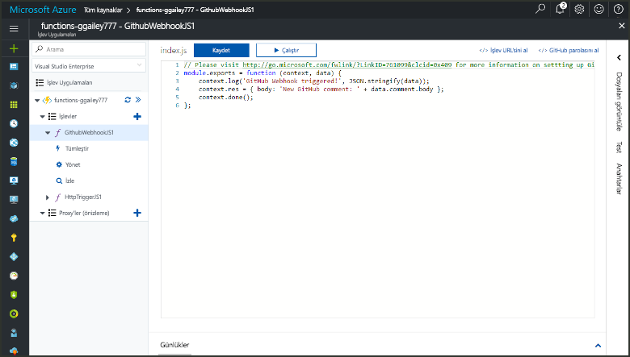
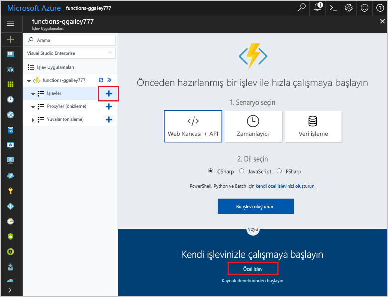
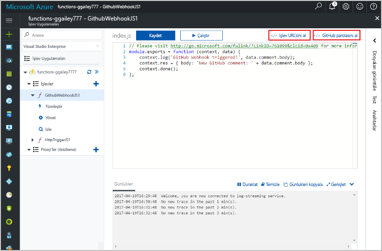
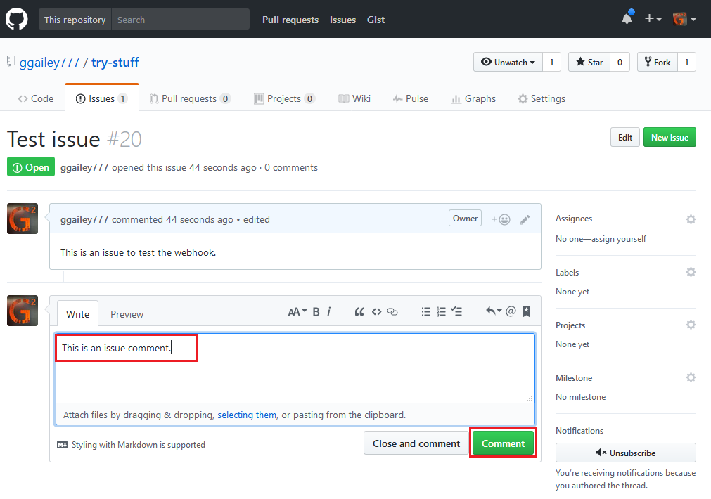
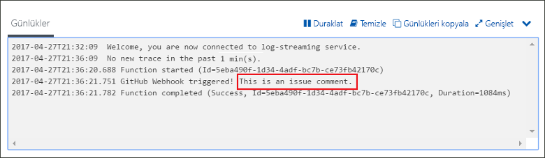

# GitHub web kancası tarafından tetiklenen bir işlev oluşturma

Bilgi nasıl toocreate HTTP Web kancası isteğiyle bir GitHub özgü yükü tarafından tetiklenen bir işlev.

## Ön koşullar

+ En az bir proje içeren bir GitHub hesabı.
+ Azure aboneliği. Aboneliğiniz yoksa başlamadan önce [ücretsiz bir hesap](https://azure.microsoft.com/free/?WT.mc_id=A261C142F) oluşturun.

[!INCLUDE [functions-portal-favorite-function-apps](../../includes/functions-portal-favorite-function-apps.md)]

## Azure İşlev uygulaması oluşturma

[!INCLUDE [Create function app Azure portal](../../includes/functions-create-function-app-portal.md)]

Ardından, hello yeni işlev uygulamada bir işlev oluşturun.

## GitHub web kancası ile tetiklenen bir işlev oluşturma

1. Merhaba, işlev uygulaması'nı genişletin ve  **+**  sonraki çok düğmesini**işlevler**. Bu işlev uygulamanızda hello ilk işlevi ise seçin **özel işlevi**. Merhaba eksiksiz işlev şablonları görüntüler.

    

2. Select hello **GitHub Web kancası** istediğiniz dili için şablon. **İşlevinizi adlandırın** ve ardından **Oluştur**'a tıklayın.

      

3. Yeni işlevinizi tıklatın **<> / Get işlevi URL**, daha sonra kopyalayın ve başlangıç değerleri kaydedin. Aynı şeyi hello **<> / alma GitHub gizli**. Bu değerleri tooconfigure hello Web kancası Github'da kullanın.

    

Ardından, GitHub deponuzda web kancasını oluşturursunuz.

## Merhaba Web kancası yapılandırın

1. Github'da, sahip olduğunuz tooa depo gidin. Varsa çatallandırdığınız depoları da kullanabilirsiniz. Toofork depo gerekiyorsa kullanın <https://github.com/Azure-Samples/functions-quickstart>.

1. **Ayarlar**’a tıklayın, sonra da **Web Kancaları**’na ve **Web kancası ekle**’ye tıklayın.

    

1. Merhaba tabloda belirtildiği gibi ayarları kullanın ve ardından **Web kancası eklemek**.

    

| Ayar | Önerilen değer | Açıklama |
|---|---|---|
| **Yük URL'si** | Kopyalanan değer | Tarafından döndürülen hello değeri kullanmak **<> / Get işlevi URL**. |
| **Gizli dizi**   | Kopyalanan değer | Tarafından döndürülen hello değeri kullanmak **<> / alma GitHub gizli**. |
| **İçerik türü** | uygulama/json | Merhaba işlevi bir JSON yükü bekliyor. |
| Olay tetikleyicileri | Olayları ayrı ayrı seçmeme izin ver | Yalnızca tootrigger sorunu açıklama olaylarına istiyoruz.  |
| | Sorun açıklaması |  |

Şimdi, Web kancası hello yeni bir sorun açıklama eklendiğinde yapılandırılmış tootrigger işlevinizi olur.

## Test hello işlevi

1. Merhaba, GitHub deposunda açmak **sorunları** yeni bir tarayıcı penceresi sekmesindedir.

1. Merhaba yeni penceresinde **yeni sorun**bir başlık yazın ve ardından **yeni sorun gönderme**.

1. Merhaba sayısındaki bir yorum yazın ve'ı tıklatın **açıklama**.

    

1. Toohello portalına geri dönün ve hello günlüklerine bakın. Merhaba yeni açıklama metni içeren bir izleme girişi görmeniz gerekir.

     

## Kaynakları temizleme

[!INCLUDE [Next steps note](../../includes/functions-quickstart-cleanup.md)]

## Sonraki adımlar

GitHub web kancasından istek alındığında çalıştırılan bir işlev oluşturdunuz.

[!INCLUDE [Next steps note](../../includes/functions-quickstart-next-steps.md)]

Web kancası bağlamaları hakkında daha fazla bilgi için bkz. [Azure İşlevleri HTTP ve web kancası bağlamaları](functions-bindings-http-webhook.md).
