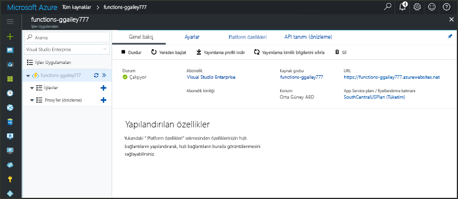

# Azure’da bir zamanlayıcı tarafından tetiklenen bir işlev oluşturmaCreate a function in Azure that is triggered by a timer

Nasıl toouse Azure işlevleri toocreate çalıştırılan bir işlevi tanımladığınız bir zamanlamaya bağlı öğrenin.Learn how toouse Azure Functions toocreate a function that runs based a schedule that you define.

## Ön koşullarPrerequisites

toocomplete Bu öğretici:toocomplete this tutorial:

+ Azure aboneliğiniz yoksa başlamadan önce [ücretsiz bir hesap](https://azure.microsoft.com/free/?WT.mc_id=A261C142F) oluşturun.If you don't have an Azure subscription, create a [free account](https://azure.microsoft.com/free/?WT.mc_id=A261C142F) before you begin.

[!INCLUDE [functions-portal-favorite-function-apps](../../includes/functions-portal-favorite-function-apps.md)]

## Azure İşlev uygulaması oluşturmaCreate an Azure Function app

[!INCLUDE [Create function app Azure portal](../../includes/functions-create-function-app-portal.md)]

Ardından, hello yeni işlev uygulamada bir işlev oluşturun.Next, you create a function in hello new function app.

## Zamanlayıcı ile tetiklenen işlev oluşturmaCreate a timer triggered function

1. Merhaba, işlev uygulaması'nı genişletin ve  **+**  sonraki çok düğmesini**işlevler**.Expand your function app and click hello **+** button next too**Functions**. Bu işlev uygulamanızda hello ilk işlevi ise seçin **özel işlevi**.If this is hello first function in your function app, select **Custom function**. Merhaba eksiksiz işlev şablonları görüntüler.This displays hello complete set of function templates.

    

2. Select hello **TimerTrigger** istediğiniz dili için şablon.Select hello **TimerTrigger** template for your desired language. Ardından hello tabloda belirtildiği gibi hello ayarları kullanın:Then use hello settings as specified in hello table:

    

    | AyarSetting | Önerilen değerSuggested value | AçıklamaDescription |
    |---|---|---|
    | **İşlevinizi adlandırın****Name your function** | TimerTriggerCSharp1TimerTriggerCSharp1 | Tetiklenen Zamanlayıcı işlevinizin Hello adını tanımlar.Defines hello name of your timer triggered function. |
    | **[Zamanlama](http://en.wikipedia.org/wiki/Cron#CRON_expression)****[Schedule](http://en.wikipedia.org/wiki/Cron#CRON_expression)** | 0 \*/1 \* \* \* \*0 \*/1 \* \* \* \* | Altı alan [CRON ifade](http://en.wikipedia.org/wiki/Cron#CRON_expression) , işlevi toorun dakikada zamanlar.A six field [CRON expression](http://en.wikipedia.org/wiki/Cron#CRON_expression) that schedules your function toorun every minute. |

2. **Oluştur**'a tıklayın.Click **Create**. Seçtiğiniz dilde her dakika çalışan bir işlev oluşturulur.A function is created in your chosen language that runs every minute.

3. Yürütme toohello günlüklerine yazılmış izleme bilgilerini görüntüleyerek doğrulayın.Verify execution by viewing trace information written toohello logs.

    

Şimdi, böylece daha az sıklıkta saatte gibi çalışır hello işlevin zamanlamasını değiştirebilirsiniz.Now, you can change hello function's schedule so that it runs less often, such as once every hour. 

## Güncelleştirme hello Zamanlayıcı zamanlamasıUpdate hello timer schedule

1. İşlevinizi genişletin ve **Tümleştir**’e tıklayın.Expand your function and click **Integrate**. Bu, giriş tanımlayın ve bağlamaları işlevi için çıktı ve hello ayarlamaktır yerdir.This is where you define input and output bindings for your function and also set hello schedule. 

2. `0 0 */1 * * *` şeklinde yeni bir **Zamanlama** değeri girin ve **Kaydet**’e tıklayın.Enter a new **Schedule** value of `0 0 */1 * * *`, and then click **Save**.  

Saatte bir çalışan bir işleviniz oldu.You now have a function that runs once every hour. 

## Kaynakları temizlemeClean up resources

[!INCLUDE [Next steps note](../../includes/functions-quickstart-cleanup.md)]

## Sonraki adımlarNext steps

Bir zamanlamaya göre çalışan bir işlev oluşturdunuz.You have created a function that runs based on a schedule.

[!INCLUDE [Next steps note](../../includes/functions-quickstart-next-steps.md)]

Zamanlayıcı tetikleyicileri hakkında daha fazla bilgi edinmek için bkz. [Azure İşlevleri ile kod yürütme zamanlama](functions-bindings-timer.md).For more information timer triggers, see [Schedule code execution with Azure Functions](functions-bindings-timer.md).