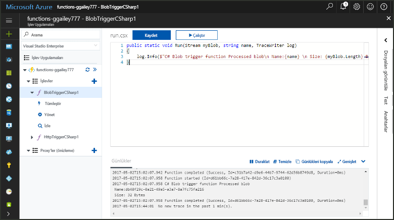
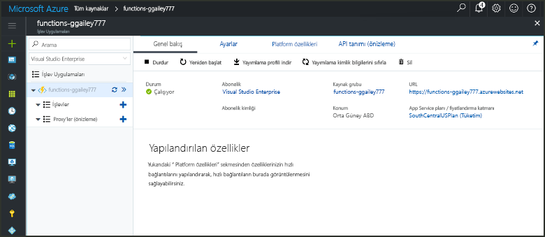
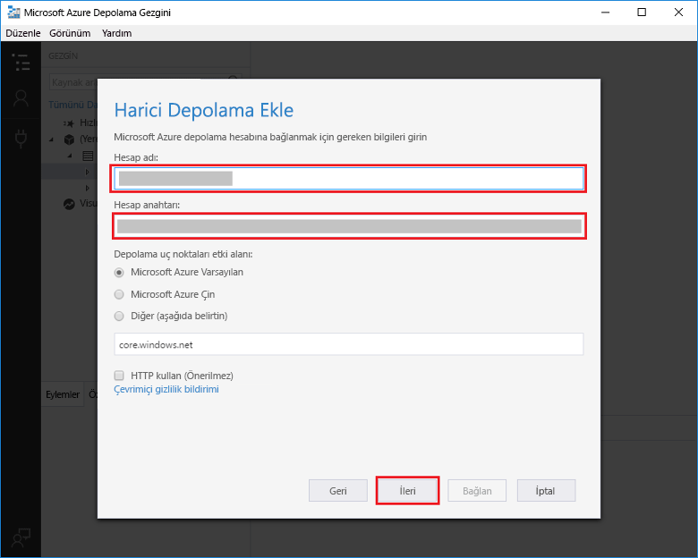
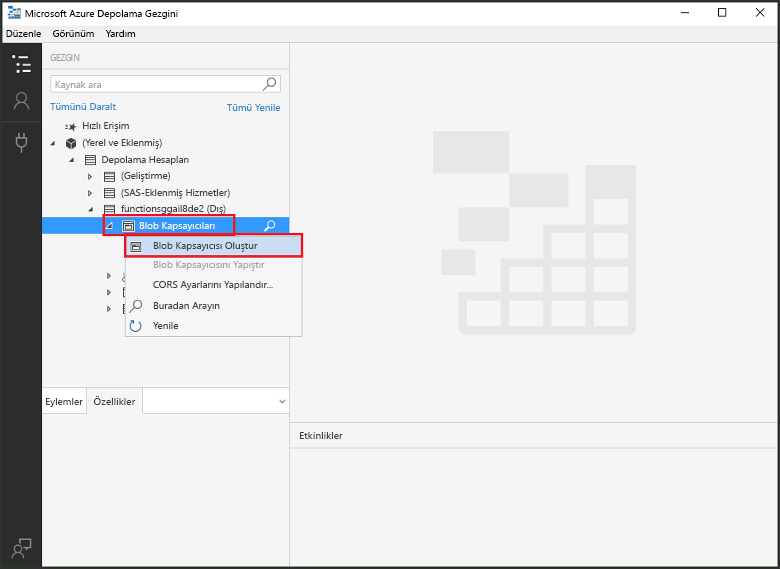
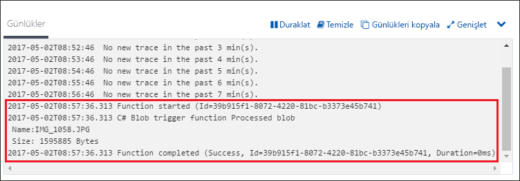

# Azure Blob depolama ile tetiklenen bir işlev oluşturmaCreate a function triggered by Azure Blob storage

Toocreate dosyaları olduğunda tetiklenen bir işlev Azure Blob depolama alanına güncelleştirilmiş tooor nasıl karşıya öğrenin.Learn how toocreate a function triggered when files are uploaded tooor updated in Azure Blob storage.

## Ön koşullarPrerequisites

+ Merhaba yükleyip [Microsoft Azure Storage Gezgini](http://storageexplorer.com/).Download and install hello [Microsoft Azure Storage Explorer](http://storageexplorer.com/).
+ Azure aboneliği.An Azure subscription. Aboneliğiniz yoksa başlamadan önce [ücretsiz bir hesap](https://azure.microsoft.com/free/?WT.mc_id=A261C142F) oluşturun.If you don't have one, create a [free account](https://azure.microsoft.com/free/?WT.mc_id=A261C142F) before you begin.

[!INCLUDE [functions-portal-favorite-function-apps](../../includes/functions-portal-favorite-function-apps.md)]

## Azure İşlev uygulaması oluşturmaCreate an Azure Function app

[!INCLUDE [Create function app Azure portal](../../includes/functions-create-function-app-portal.md)]

Ardından, hello yeni işlev uygulamada bir işlev oluşturun.Next, you create a function in hello new function app.

## Blob depolama ile tetiklenen bir işlev oluşturmaCreate a Blob storage triggered function

1. Merhaba, işlev uygulaması'nı genişletin ve  **+**  sonraki çok düğmesini**işlevler**.Expand your function app and click hello **+** button next too**Functions**. Bu işlev uygulamanızda hello ilk işlevi ise seçin **özel işlevi**.If this is hello first function in your function app, select **Custom function**. Merhaba eksiksiz işlev şablonları görüntüler.This displays hello complete set of function templates.

    

2. Select hello **BlobTrigger** şablonu istediğiniz dili ve hello tabloda belirtildiği gibi hello ayarları kullanın.Select hello **BlobTrigger** template for your desired language, and use hello settings as specified in hello table.

    

    | AyarSetting | Önerilen değerSuggested value | AçıklamaDescription |
    |---|---|---|
    | **Path****Path**   | mycontainer/{name}mycontainer/{name}    | İzlenmekte olan Blob depolamanın konumu.Location in Blob storage being monitored. Merhaba dosya adı hello BLOB hello bağlama hello olarak geçirilir _adı_ parametresi.hello file name of hello blob is passed in hello binding as hello _name_ parameter.  |
    | **Depolama hesabı bağlantısı****Storage account connection** | AzureWebJobStorageAzureWebJobStorage | Merhaba depolama hesabı bağlantısı işlevi uygulamanız tarafından zaten kullanılmakta kullanın veya yeni bir tane oluşturun.You can use hello storage account connection already being used by your function app, or create a new one.  |
    | **İşlevinizi adlandırın****Name your function** | İşlev uygulamanızda benzersiz olmalıdırUnique in your function app | Blob ile tetiklenen bu işlevin adı.Name of this blob triggered function. |

3. Tıklatın **oluşturma** toocreate işlevinizi.Click **Create** toocreate your function.

Ardından, tooyour Azure depolama hesabı bağlanmak ve hello oluşturmak **mycontainer** kapsayıcı.Next, you connect tooyour Azure Storage account and create hello **mycontainer** container.

## Merhaba kapsayıcı oluşturmaCreate hello container

1. İşlevinizde **Tümleştir**'e tıklayın, **Belgeler**'i genişletin ve hem **Hesap adı** hem de **Hesap anahtarı** değerlerini kopyalayın.In your function, click **Integrate**, expand **Documentation**, and copy both **Account name** and **Account key**. Bu kimlik bilgileri tooconnect toohello depolama hesabı kullanın.You use these credentials tooconnect toohello storage account. Depolama hesabınız zaten bağlanmış olduğunuz toostep 4 atlayın.If you have already connected your storage account, skip toostep 4.

    

1. Merhaba çalıştırmak [Microsoft Azure Storage Gezgini](http://storageexplorer.com/) aracı, hello tıklatın Bağlan simgesi hello sol tarafta, seçin **bir depolama hesabı adı ve anahtar kullanmak**, tıklatıp **sonraki**.Run hello [Microsoft Azure Storage Explorer](http://storageexplorer.com/) tool, click hello connect icon on hello left, choose **Use a storage account name and key**, and click **Next**.

    

1. Merhaba girin **hesap adı** ve **hesap anahtarı** 1. adımdaki tıklatın **sonraki** ve ardından **Bağlan**.Enter hello **Account name** and **Account key** from step 1, click **Next** and then **Connect**. 

    

1. Merhaba bağlı depolama hesabı'nı genişletin, sağ tıklatın **Blob kapsayıcıları**, tıklatın **oluşturma blob kapsayıcısı**, türü `mycontainer`, ve ENTER tuşuna basın.Expand hello attached storage account, right-click **Blob containers**, click **Create blob container**, type `mycontainer`, and then press enter.

    

Bir blob kapsayıcısını sahip olduğunuza göre bir dosya toohello kapsayıcısı yükleyerek hello işlevi test edebilirsiniz.Now that you have a blob container, you can test hello function by uploading a file toohello container.

## Test hello işleviTest hello function

1. Geri Azure portal hello, Gözat tooyour işlevi genişletin hello **günlükleri** hello sonunda hello sayfası ve emin olun, bu günlük akış duraklatıldı değil.Back in hello Azure portal, browse tooyour function expand hello **Logs** at hello bottom of hello page and make sure that log streaming isn't paused.

1. Depolama Gezgini’nde depolama hesabınızı genişletin, **Blob kapsayıcıları** ve **mycontainer** öğesine tıklayın.In Storage Explorer, expand your storage account, **Blob containers**, and **mycontainer**. **Karşıya Yükle**’ye ve ardından **Dosyaları yükle...** seçeneğine tıklayın.Click **Upload** and then **Upload files...**.

    

1. Merhaba, **dosyaları karşıya yükleme** iletişim kutusunda, hello **dosyaları** alan.In hello **Upload files** dialog box, click hello **Files** field. Bir görüntü dosyası gibi yerel bilgisayarınızda tooa dosyasını bulun, seçin ve **açık** ve ardından **karşıya**.Browse tooa file on your local computer, such as an image file, select it and click **Open** and then **Upload**.

1. Tooyour işlev günlükleri gidip bu hello blobu okuma emin olun.Go back tooyour function logs and verify that hello blob has been read.

   

    >[!NOTE]
    > İşlevi uygulamanızı hello varsayılan tüketim planında çalıştığında, olabilir bir gecikme dakika arasında hello eklenen veya güncelleştirilen blob ile Merhaba tooseveral yukarı işlev tetiklenen.When your function app runs in hello default Consumption plan, there may be a delay of up tooseveral minutes between hello blob being added or updated and hello function being triggered. Blob ile tetiklenen işlevlerde düşük gecikme süresi gerekiyorsa, işlev uygulamanızı bir App Service planında çalıştırmayı düşünün.If you need low latency in your blob triggered functions, consider running your function app in an App Service plan.

## Kaynakları temizlemeClean up resources

[!INCLUDE [Next steps note](../../includes/functions-quickstart-cleanup.md)]

## Sonraki adımlarNext steps

Güncelleştirilmiş tooor Blob storage'da bir blob eklendiğinde çalıştırılan bir işlev oluşturdunuz.You have created a function that runs when a blob is added tooor updated in Blob storage. 

[!INCLUDE [Next steps note](../../includes/functions-quickstart-next-steps.md)]

Blob depolama tetikleyicileri hakkında daha fazla bilgi için bkz. [Azure İşlevleri Blob depolama bağlamaları](functions-bindings-storage-blob.md).For more information about Blob storage triggers, see [Azure Functions Blob storage bindings](functions-bindings-storage-blob.md).
