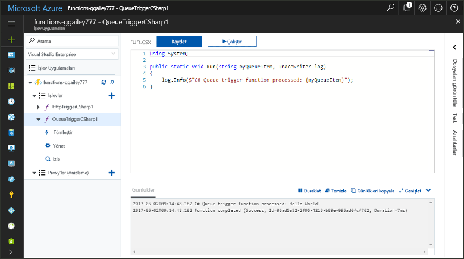
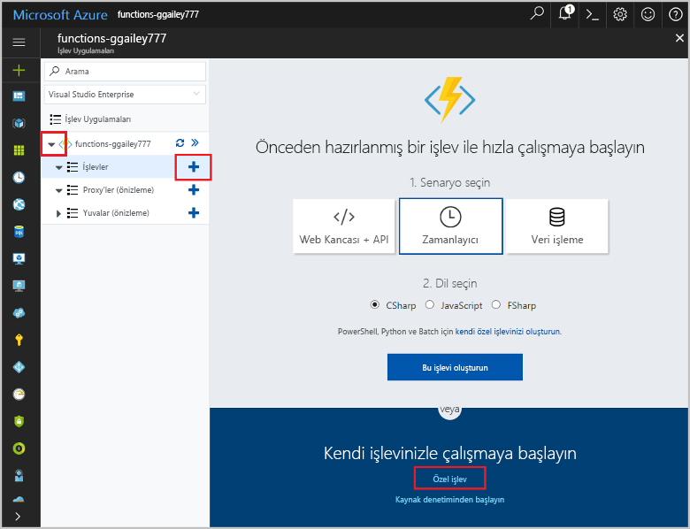
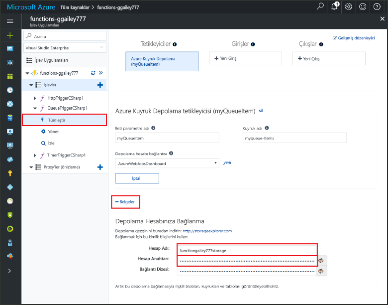
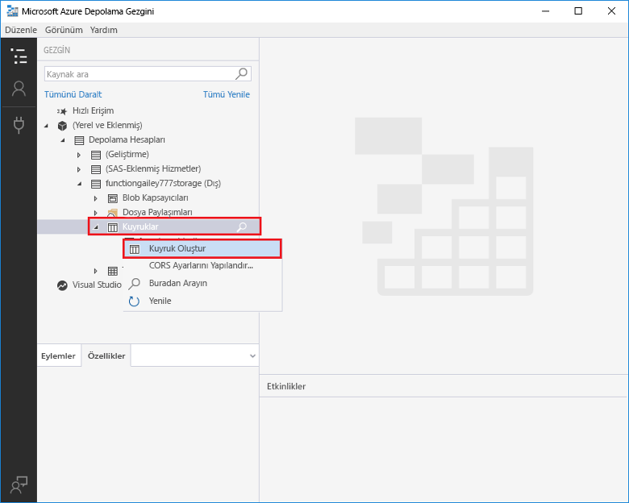
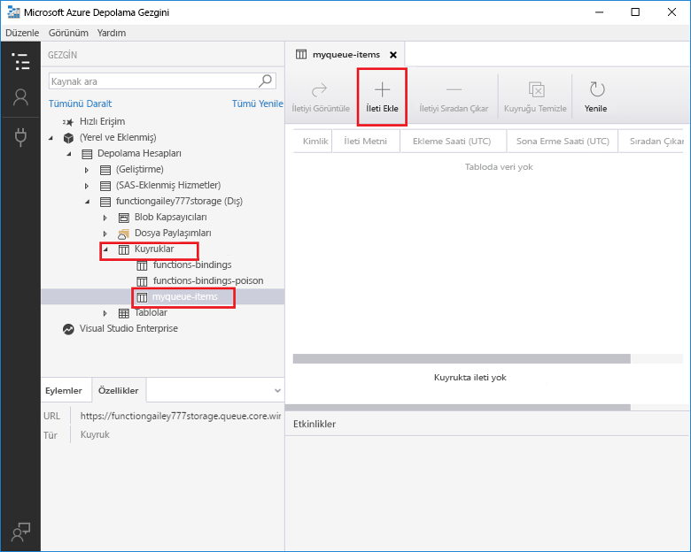
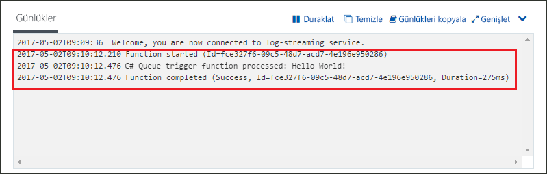

# Azure Kuyruk Depolama tarafından tetiklenen bir işlev oluşturma

Nasıl toocreate iletileri olduğunda tetiklenen bir işlev tooan Azure Storage kuyruğuna gönderilen bilgi edinin.

## Ön koşullar

- Merhaba yükleyip [Microsoft Azure Storage Gezgini](http://storageexplorer.com/).

- Azure aboneliği. Aboneliğiniz yoksa başlamadan önce [ücretsiz bir hesap](https://azure.microsoft.com/free/?WT.mc_id=A261C142F) oluşturun.

[!INCLUDE [functions-portal-favorite-function-apps](../../includes/functions-portal-favorite-function-apps.md)]

## Azure İşlev uygulaması oluşturma

[!INCLUDE [Create function app Azure portal](../../includes/functions-create-function-app-portal.md)]

Ardından, hello yeni işlev uygulamada bir işlev oluşturun.

## Kuyruk ile tetiklenen bir işlev oluşturma

1. Merhaba, işlev uygulaması'nı genişletin ve  **+**  sonraki çok düğmesini**işlevler**. Bu işlev uygulamanızda hello ilk işlevi ise seçin **özel işlevi**. Merhaba eksiksiz işlev şablonları görüntüler.

    

2. Select hello **QueueTrigger** şablonu istediğiniz dili ve hello tabloda belirtildiği gibi hello ayarları kullanın.

    
    
    | Ayar | Önerilen değer | Açıklama |
    |---|---|---|
    | **Kuyruk adı**   | myqueue-items    | Merhaba adını, depolama hesabınız tooconnect tooin sırası. |
    | **Depolama hesabı bağlantısı** | AzureWebJobStorage | Merhaba depolama hesabı bağlantısı işlevi uygulamanız tarafından zaten kullanılmakta kullanın veya yeni bir tane oluşturun.  |
    | **İşlevinizi adlandırın** | İşlev uygulamanızda benzersiz olmalıdır | Kuyruk tarafından tetiklenen bu işlevin adı. |

3. Tıklatın **oluşturma** toocreate işlevinizi.

Ardından, tooyour Azure depolama hesabı bağlanmak ve hello oluşturmak **Sıram öğeleri** depolama kuyruğu.

## Merhaba kuyruk oluşturma

1. İşlevinizde **Tümleştir**'e tıklayın, **Belgeler**'i genişletin ve hem **Hesap adı** hem de **Hesap anahtarı** değerlerini kopyalayın. Bu kimlik bilgileri tooconnect toohello depolama hesabı kullanın. Depolama hesabınız zaten bağlanmış olduğunuz toostep 4 atlayın.

    v

1. Merhaba çalıştırmak [Microsoft Azure Storage Gezgini](http://storageexplorer.com/) aracı, hello tıklatın Bağlan simgesi hello sol tarafta, seçin **bir depolama hesabı adı ve anahtar kullanmak**, tıklatıp **sonraki**.

    

1. Merhaba girin **hesap adı** ve **hesap anahtarı** 1. adımdaki tıklatın **sonraki** ve ardından **Bağlan**.

    

1. Merhaba bağlı depolama hesabı'nı genişletin, sağ tıklatın **sıraları**, tıklatın **Oluşturma sırası**, türü `myqueue-items`, ve ENTER tuşuna basın.

    

Bir depolama kuyruğu sahip olduğunuza göre bir ileti toohello sırası ekleyerek hello işlevi test edebilirsiniz.

## Test hello işlevi

1. Geri Azure portal hello, Gözat tooyour işlevi genişletin hello **günlükleri** hello sonunda hello sayfası ve emin olun, bu günlük akış duraklatıldı değil.

1. Depolama Gezgini'nde depolama hesabınızı genişletin, **Kuyruklar**'ı ve **myqueue-items** öğesini seçip **İleti ekle**'ye tıklayın.

    

1. "Hello World!" iletinizi **İleti metni** alanına yazın ve **Tamam**'a tıklayın.

1. Birkaç saniye bekleyin, sonra tooyour işlev günlükleri geri dönün ve hello yeni ileti hello sırasından okuma doğrulayın.

    

1. Depolama Gezgini içinde geri tıklayın **yenileme** ve hello ileti işlendikten ve artık hello sırada olduğunu doğrulayın.

## Kaynakları temizleme

[!INCLUDE [Next steps note](../../includes/functions-quickstart-cleanup.md)]

## Sonraki adımlar

Bir ileti tooa depolama kuyruğu eklendiğinde çalıştırılan bir işlev oluşturdunuz.

[!INCLUDE [Next steps note](../../includes/functions-quickstart-next-steps.md)]

Kuyruk depolama tetikleyicileri hakkında daha fazla bilgi için bkz. [Azure İşlevleri Kuyruk depolama bağlamaları](functions-bindings-storage-queue.md).