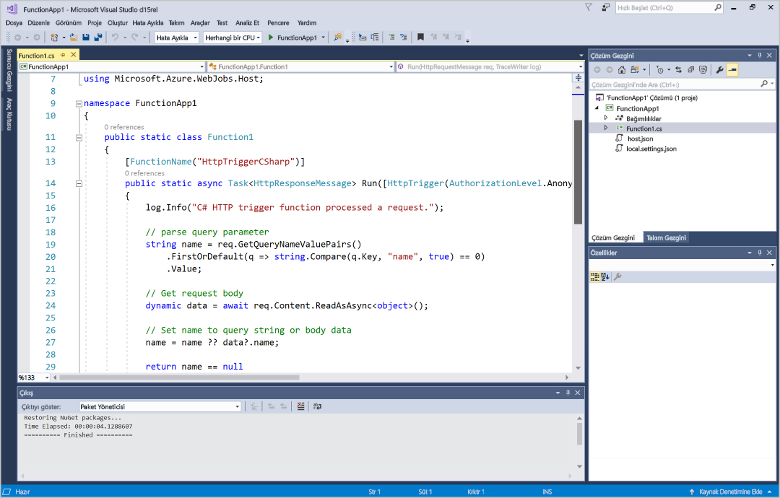
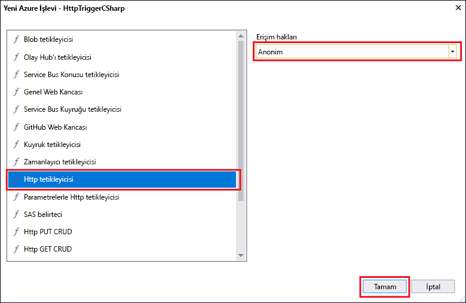

# Visual Studio kullanarak ilk işlevinizi oluşturmaCreate your first function using Visual Studio

Azure işlevleri sağlayan bir VM oluşturun veya bir web uygulaması yayımlama toofirst gerek kalmadan sunucusuz bir ortamda kodunuzu yürütün.Azure Functions lets you execute your code in a serverless environment without having toofirst create a VM or publish a web application.

Bu konuda, nasıl toouse Azure işlevleri toocreate için Visual Studio 2017 araçları hello ve bir "hello world" işlevi yerel olarak test öğrenin.In this topic, you learn how toouse hello Visual Studio 2017 tools for Azure Functions toocreate and test a "hello world" function locally. Merhaba işlevi kod tooAzure sonra yayımlar.You will then publish hello function code tooAzure. Bu araçları, Visual Studio 2017 sürüm 15.3 hello Azure geliştirme iş yükü parçası veya sonraki bir sürümü kullanılabilir.These tools are available as part of hello Azure development workload in Visual Studio 2017 version 15.3, or a later version.

## Ön koşullarPrerequisites

toocomplete Bu öğretici, yükleme:toocomplete this tutorial, install:

* [Visual Studio 2017 sürüm 15.3](https://www.visualstudio.com/vs/preview/), hello dahil olmak üzere **Azure geliştirme** iş yükü.[Visual Studio 2017 version 15.3](https://www.visualstudio.com/vs/preview/), including hello **Azure development** workload.

    
    
    >[!NOTE]  
    Yükleme veya tooVisual Studio 2017 sürüm 15.3 yükselttikten sonra Azure işlevleri için toomanually güncelleştirme hello Visual Studio 2017 araçları da gerekebilir.After you install or upgrade tooVisual Studio 2017 version 15.3, you might also need toomanually update hello Visual Studio 2017 tools for Azure Functions. Merhaba hello araçlarından güncelleştirebilirsiniz **Araçları** menüsünün altında **Uzantılar ve güncelleştirmeler...**   >  **Güncelleştirmeleri** > **Visual Studio Marketi'ine** > **Azure işlevleri ve Web Araçları işleri**  >  **Güncelleştirme**.You can update hello tools from hello **Tools** menu under **Extensions and Updates...** > **Updates** > **Visual Studio Marketplace** > **Azure Functions and Web Jobs Tools** > **Update**. 

[!INCLUDE [quickstarts-free-trial-note](../../includes/quickstarts-free-trial-note.md)] 

## Visual Studio'da bir Azure İşlevleri projesi oluşturmaCreate an Azure Functions project in Visual Studio

[!INCLUDE [Create a project using hello Azure Functions template](../../includes/functions-vstools-create.md)]

Merhaba proje oluşturduğunuza göre ilk işlevinizi oluşturabilirsiniz.Now that you have created hello project, you can create your first function.

## Create Hello işleviCreate hello function

1. **Çözüm Gezgini**’nde, proje düğümünüze sağ tıklayın ve **Yeni** > **Öğe Ekle**’yi seçin.In **Solution Explorer**, right-click on your project node and select **Add** > **New Item**. **Azure İşlevi**’ni seçin ve **Ekle**’ye tıklayın.Select **Azure Function** and click **Add**.

2. **HttpTrigger**’ı seçin, **İşlev Adı** yazın, **Erişim Hakları** için **Anonim**’i seçin ve **Oluştur**’a tıklayın.Select **HttpTrigger**, type a **Function Name**, select **Anonymous** for **Access Rights**, and click **Create**. oluşturulan hello işlevi herhangi bir istemciden bir HTTP isteği tarafından erişilir.hello function created is accessed by an HTTP request from any client. 

    

    Kod dosyası işlevi kodunuzu uygulayan bir sınıf içeren tooyour projesi eklenir.A code file is added tooyour project that contains a class that implements your function code. Bu kod adı değeri ve geri kırmak alan bir şablona temel alır.This code is based on a template, which receives a name value and echos it back. Merhaba **FunctionName** öznitelik işlevinizi hello adını ayarlar.hello **FunctionName** attribute sets hello name of your function. Merhaba **HttpTrigger** öznitelik hello işlevi tetikler selamlama iletisine gösterir.hello **HttpTrigger** attribute indicates hello message that triggers hello function. 

    

HTTP ile tetiklenen işlev oluşturduğunuza göre, artık bunu yerel bilgisayarınızda test edebilirsiniz.Now that you have created an HTTP-triggered function, you can test it on your local computer.

## Yerel olarak test hello işleviTest hello function locally

Azure İşlevleri Temel Araçları, Azure İşlevleri projenizi yerel geliştirme bilgisayarınızda çalıştırmanıza olanak sağlar.Azure Functions Core Tools lets you run Azure Functions project on your local development computer. Bu araçları ilk kez Visual Studio'dan bir işlev başlattığınızda hello istendiğinde tooinstall var.You are prompted tooinstall these tools hello first time you start a function from Visual Studio.  

1. tootest işlevinizi, F5 tuşuna basın.tootest your function, press F5. İstenirse, Visual Studio toodownload hello isteğini kabul edin ve Azure işlevleri çekirdek (CLI) Araçları'nı yükleyin.If prompted, accept hello request from Visual Studio toodownload and install Azure Functions Core (CLI) tools.  Böylece Hello araçları HTTP isteklerini işleyebilir tooenable bir güvenlik duvarı özel durumu da gerekebilir.You may also need tooenable a firewall exception so that hello tools can handle HTTP requests.

2. Kopya hello hello Azure işlevleri çalışma zamanı, işlevinden URL'sini çıktı.Copy hello URL of your function from hello Azure Functions runtime output.  

    

3. Merhaba HTTP isteği Hello URL'sini tarayıcınızın adres çubuğuna yapıştırın.Paste hello URL for hello HTTP request into your browser's address bar. Merhaba sorgu dizesi eklemek `&name=<yourname>` toothis URL ve hello istek yürütülemiyor.Append hello query string `&name=<yourname>` toothis URL and execute hello request. Merhaba aşağıdaki hello yanıt hello işlevi tarafından döndürülen hello tarayıcı toohello yerel GET isteğini gösterir:hello following shows hello response in hello browser toohello local GET request returned by hello function: 

    

4. hata ayıklama, toostop tıklatın hello **durdurmak** hello Visual Studio araç çubuğunda.toostop debugging, click hello **Stop** button on hello Visual Studio toolbar.

Hello işlevi, yerel bilgisayarınızda düzgün çalıştığını doğruladıktan sonra zaman toopublish hello proje tooAzure olur.After you have verified that hello function runs correctly on your local computer, it's time toopublish hello project tooAzure.

## Yayımlama Hello proje tooAzurePublish hello project tooAzure

Projenizi yayımlayabilmeniz için önce Azure aboneliğinizde bir işlev uygulamanızın olması gerekir.You must have a function app in your Azure subscription before you can publish your project. Visual Studio'dan bir işlev uygulaması oluşturabilirsiniz.You can create a function app right from Visual Studio.

[!INCLUDE [Publish hello project tooAzure](../../includes/functions-vstools-publish.md)]

## Azure'da işlevinizi test etmeTest your function in Azure

1. Merhaba işlevi uygulamasının temel URL'si Hello hello yayımlama profili sayfadan kopyalayın.Copy hello base URL of hello function app from hello Publish profile page. Hello yerine `localhost:port` hello işlevi hello yeni temel URL ile yerel olarak test edilirken kullanılan hello URL'sinin.Replace hello `localhost:port` portion of hello URL you used when testing hello function locally with hello new base URL. Önceki gibi emin tooappend hello sorgu dizesi yapmak `&name=<yourname>` toothis URL ve hello istek yürütülemiyor.As before, make sure tooappend hello query string `&name=<yourname>` toothis URL and execute hello request.

    Bu işlev görülüyor, HTTP çağrıları hello URL tetiklenen:hello URL that calls your HTTP triggered function looks like this:

        http://<functionappname>.azurewebsites.net/api/<functionname>?name=<yourname> 

2. Bu yeni URL hello HTTP isteği için tarayıcınızın adres çubuğuna yapıştırın.Paste this new URL for hello HTTP request into your browser's address bar. Merhaba aşağıdaki hello yanıt hello işlevi tarafından döndürülen hello tarayıcı toohello uzak GET isteğini gösterir:hello following shows hello response in hello browser toohello remote GET request returned by hello function: 

    
 
## Sonraki adımlarNext steps

Visual Studio toocreate C# işlev uygulaması basit bir HTTP tetiklenen işleviyle kullandınız.You have used Visual Studio toocreate a C# function app with a simple HTTP triggered function. 

+ toolearn nasıl tooconfigure proje toosupport Tetikleyicileri ve bağlamaları, diğer türlerini görmek hello [yapılandırma hello proje yerel geliştirme için](functions-develop-vs.md#configure-the-project-for-local-development) bölümüne [Visual Studio için Azure işlevleri Araçları](functions-develop-vs.md).toolearn how tooconfigure your project toosupport other types of triggers and bindings, see hello [Configure hello project for local development](functions-develop-vs.md#configure-the-project-for-local-development) section in [Azure Functions Tools for Visual Studio](functions-develop-vs.md).
+ Yerel test ve hello Azure işlevleri çekirdek araçlarını kullanarak hata ayıklama hakkında daha fazla toolearn bkz [koduna ve test Azure işlevleri yerel olarak](functions-run-local.md).toolearn more about local testing and debugging using hello Azure Functions Core Tools, see [Code and test Azure Functions locally](functions-run-local.md). 
+ .NET sınıf kitaplıkları işlevleri geliştirme hakkında daha fazla toolearn bkz [Azure işlevlerini kullanarak .NET sınıf kitaplıkları](functions-dotnet-class-library.md).toolearn more about developing functions as .NET class libraries, see [Using .NET class libraries with Azure Functions](functions-dotnet-class-library.md). 

