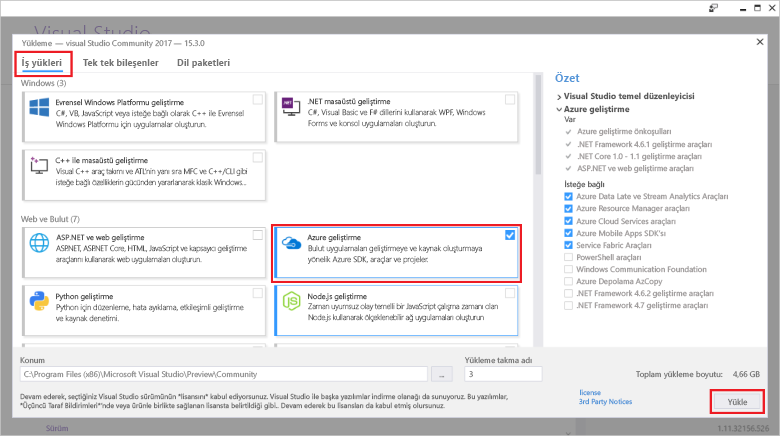

# <a name="azure-functions-tools-for-visual-studio"></a><span data-ttu-id="cce24-103">Visual Studio için Azure işlevleri araçları</span><span class="sxs-lookup"><span data-stu-id="cce24-103">Azure Functions Tools for Visual Studio</span></span>  

<span data-ttu-id="cce24-104">Visual Studio 2017 için Azure işlevleri araçları, geliştirme, test ve C# işlevleri tooAzure dağıtmanıza olanak sağlayan Visual Studio için bir uzantısıdır.</span><span class="sxs-lookup"><span data-stu-id="cce24-104">Azure Functions Tools for Visual Studio 2017 is an extension for Visual Studio that lets you develop, test, and deploy C# functions tooAzure.</span></span> <span data-ttu-id="cce24-105">İlk Azure işlevleri deneyiminizi varsa hakkında daha fazla bilgi edinebilirsiniz [bir giriş tooAzure işlevleri](functions-overview.md).</span><span class="sxs-lookup"><span data-stu-id="cce24-105">If this is your first experience with Azure Functions, you can learn more at [An introduction tooAzure Functions](functions-overview.md).</span></span>

<span data-ttu-id="cce24-106">Hello Azure işlevleri araçları hello aşağıdaki avantajları sağlar:</span><span class="sxs-lookup"><span data-stu-id="cce24-106">hello Azure Functions Tools provides hello following benefits:</span></span> 

* <span data-ttu-id="cce24-107">Düzenleme, yapı ve işlevleri yerel geliştirme bilgisayarınızda çalıştırın.</span><span class="sxs-lookup"><span data-stu-id="cce24-107">Edit, build, and run functions on your local development computer.</span></span> 
* <span data-ttu-id="cce24-108">Yayımlama Azure işlevlerinizi doğrudan tooAzure proje.</span><span class="sxs-lookup"><span data-stu-id="cce24-108">Publish your Azure Functions project directly tooAzure.</span></span> 
* <span data-ttu-id="cce24-109">Web işleri öznitelikleri toodeclare işlev bağlamaları doğrudan hello tanımları bağlama için ayrı bir function.json Bakımı yerine C# kodu kullanın.</span><span class="sxs-lookup"><span data-stu-id="cce24-109">Use WebJobs attributes toodeclare function bindings directly in hello C# code instead of maintaining a separate function.json for binding definitions.</span></span>
* <span data-ttu-id="cce24-110">Geliştirme ve önceden derlenmiş C# işlevleri dağıtın.</span><span class="sxs-lookup"><span data-stu-id="cce24-110">Develop and deploy pre-compiled C# functions.</span></span> <span data-ttu-id="cce24-111">Önceden derlenmiş işlevleri bir daha iyi soğuk başlangıç daha performans C# betik tabanlı işlevleri sağlar.</span><span class="sxs-lookup"><span data-stu-id="cce24-111">Pre-complied functions provide a better cold-start performance than C# script-based functions.</span></span> 
* <span data-ttu-id="cce24-112">Visual Studio geliştirme hello yararları tümünün yaparken işlevlerinizi C# kod.</span><span class="sxs-lookup"><span data-stu-id="cce24-112">Code your functions in C# while having all of hello benefits of Visual Studio development.</span></span> 

<span data-ttu-id="cce24-113">Bu konu nasıl toouse hello Azure işlevleri araçları Visual Studio 2017 toodevelop için C# işlevlerinizi gösterir.</span><span class="sxs-lookup"><span data-stu-id="cce24-113">This topic shows you how toouse hello Azure Functions Tools for Visual Studio 2017 toodevelop your functions in C#.</span></span> <span data-ttu-id="cce24-114">Da bilgi nasıl toopublish, proje tooAzure bir .NET derlemesi olarak.</span><span class="sxs-lookup"><span data-stu-id="cce24-114">You also learn how toopublish your project tooAzure as a .NET assembly.</span></span>

## <a name="prerequisites"></a><span data-ttu-id="cce24-115">Ön koşullar</span><span class="sxs-lookup"><span data-stu-id="cce24-115">Prerequisites</span></span>

<span data-ttu-id="cce24-116">Azure işlevleri araçları hello Azure geliştirme iş yükünü dahil [Visual Studio 2017 sürüm 15.3](https://www.visualstudio.com/vs/), veya sonraki bir sürümü.</span><span class="sxs-lookup"><span data-stu-id="cce24-116">Azure Functions Tools is included in hello Azure development workload of [Visual Studio 2017 version 15.3](https://www.visualstudio.com/vs/), or a later version.</span></span> <span data-ttu-id="cce24-117">Merhaba eklediğinizden emin olun **Azure geliştirme** Visual Studio 2017 sürüm 15.3 yüklemenizdeki iş yükü:</span><span class="sxs-lookup"><span data-stu-id="cce24-117">Make sure you include hello **Azure development** workload in your Visual Studio 2017 version 15.3 installation:</span></span>



<span data-ttu-id="cce24-119">toocreate ve işlevleri dağıtmak, ayrıca gerekir:</span><span class="sxs-lookup"><span data-stu-id="cce24-119">toocreate and deploy functions, you also need:</span></span>

* <span data-ttu-id="cce24-120">Etkin bir Azure aboneliği.</span><span class="sxs-lookup"><span data-stu-id="cce24-120">An active Azure subscription.</span></span> <span data-ttu-id="cce24-121">Bir Azure aboneliğiniz yoksa [serbest hesapları](https://azure.microsoft.com/free/?WT.mc_id=A261C142F) kullanılabilir.</span><span class="sxs-lookup"><span data-stu-id="cce24-121">If you don't have an Azure subscription, [free accounts](https://azure.microsoft.com/free/?WT.mc_id=A261C142F) are available.</span></span>

* <span data-ttu-id="cce24-122">Bir Azure depolama hesabı.</span><span class="sxs-lookup"><span data-stu-id="cce24-122">An Azure Storage account.</span></span> <span data-ttu-id="cce24-123">toocreate bir depolama hesabı bkz [depolama hesabı oluşturma](../storage/common/storage-create-storage-account.md#create-a-storage-account).</span><span class="sxs-lookup"><span data-stu-id="cce24-123">toocreate a storage account, see [Create a storage account](../storage/common/storage-create-storage-account.md#create-a-storage-account).</span></span>  
## <a name="create-an-azure-functions-project"></a><span data-ttu-id="cce24-124">Azure işlevleri projesi oluşturma</span><span class="sxs-lookup"><span data-stu-id="cce24-124">Create an Azure Functions project</span></span> 

[!INCLUDE [Create a project using hello Azure Functions](../../includes/functions-vstools-create.md)]


## <a name="configure-hello-project-for-local-development"></a><span data-ttu-id="cce24-125">Merhaba projeyi yerel geliştirme için yapılandırın</span><span class="sxs-lookup"><span data-stu-id="cce24-125">Configure hello project for local development</span></span>

<span data-ttu-id="cce24-126">Hello Azure işlevleri şablonunu kullanarak yeni bir proje oluşturduğunuzda, aşağıdaki dosyaları hello içeren boş C# projesinde alın:</span><span class="sxs-lookup"><span data-stu-id="cce24-126">When you create a new project using hello Azure Functions template, you get an empty C# project that contains hello following files:</span></span>

* <span data-ttu-id="cce24-127">**Host.JSON**: yapılandırmanıza olanak hello işlevleri ana bilgisayar.</span><span class="sxs-lookup"><span data-stu-id="cce24-127">**host.json**: Lets you configure hello Functions host.</span></span> <span data-ttu-id="cce24-128">Bu ayarlar hem de yerel olarak ve Azure içinde çalışırken geçerlidir.</span><span class="sxs-lookup"><span data-stu-id="cce24-128">These settings apply both when running locally and in Azure.</span></span> <span data-ttu-id="cce24-129">Daha fazla bilgi için bkz: [host.json](https://github.com/Azure/azure-webjobs-sdk-script/wiki/host.json) başvurusu makalesinde.</span><span class="sxs-lookup"><span data-stu-id="cce24-129">For more information, see [host.json](https://github.com/Azure/azure-webjobs-sdk-script/wiki/host.json) reference article.</span></span>
    
* <span data-ttu-id="cce24-130">**Local.Settings.JSON**: işlevleri yerel olarak çalıştırırken kullanılan ayarları bulundurur.</span><span class="sxs-lookup"><span data-stu-id="cce24-130">**local.settings.json**: Maintains settings used when running functions locally.</span></span> <span data-ttu-id="cce24-131">Bu ayarlar, Azure tarafından kullanılmaz, hello tarafından kullanılan [Azure işlevleri çekirdek Araçları](functions-run-local.md).</span><span class="sxs-lookup"><span data-stu-id="cce24-131">These settings are not used by Azure, they are used by hello [Azure Functions Core Tools](functions-run-local.md).</span></span> <span data-ttu-id="cce24-132">Bağlantı dizeleri tooother Azure gibi bu dosya toospecify ayarları kullanmak Hizmetleri.</span><span class="sxs-lookup"><span data-stu-id="cce24-132">Use this file toospecify settings, such as connection strings tooother Azure services.</span></span> <span data-ttu-id="cce24-133">Yeni bir anahtar toohello ekleme **değerleri** dizi projenizdeki işlevleri gerektirdiği her bağlantı için.</span><span class="sxs-lookup"><span data-stu-id="cce24-133">Add a new key toohello **Values** array for each connection required by functions in your project.</span></span> <span data-ttu-id="cce24-134">Daha fazla bilgi için bkz: [yerel ayarları dosyasına](functions-run-local.md#local-settings-file) hello Azure işlevleri çekirdek araçları konu başlığı.</span><span class="sxs-lookup"><span data-stu-id="cce24-134">For more information, see [Local settings file](functions-run-local.md#local-settings-file) in hello Azure Functions Core Tools topic.</span></span>

<span data-ttu-id="cce24-135">Merhaba işlevleri çalışma zamanı bir Azure Storage hesabı dahili olarak kullanır.</span><span class="sxs-lookup"><span data-stu-id="cce24-135">hello Functions runtime uses an Azure Storage account internally.</span></span> <span data-ttu-id="cce24-136">Tüm HTTP ve Web kancalarını dışında türleri tetiklemek için hello ayarlamalısınız **Values.AzureWebJobsStorage** anahtar tooa geçerli Azure depolama hesabı bağlantı dizesi.</span><span class="sxs-lookup"><span data-stu-id="cce24-136">For all trigger types other than HTTP and webhooks, you must set hello **Values.AzureWebJobsStorage** key tooa valid Azure Storage account connection string.</span></span>

[!INCLUDE [Note toonot use local storage](../../includes/functions-local-settings-note.md)]

 <span data-ttu-id="cce24-137">tooset hello depolama hesabı bağlantı dizesi:</span><span class="sxs-lookup"><span data-stu-id="cce24-137">tooset hello storage account connection string:</span></span>

1. <span data-ttu-id="cce24-138">Visual Studio'da açın **Cloud Explorer**, genişletin **depolama hesabı** > **depolama hesabınız**seçeneğini belirleyip **özellikleri**ve kopyalama hello **birincil bağlantı dizesi** değeri.</span><span class="sxs-lookup"><span data-stu-id="cce24-138">In Visual Studio, open **Cloud Explorer**, expand **Storage Account** > **Your Storage Account**, then select **Properties** and copy hello **Primary Connection String** value.</span></span>   

2. <span data-ttu-id="cce24-139">Projenizdeki hello local.settings.json proje dosyasını açın ve ayarlayın hello hello değerini **AzureWebJobsStorage** anahtar kopyaladığınız toohello bağlantı dizesi.</span><span class="sxs-lookup"><span data-stu-id="cce24-139">In your project, open hello local.settings.json project file and set hello value of hello **AzureWebJobsStorage** key toohello connection string you copied.</span></span>

3. <span data-ttu-id="cce24-140">Merhaba önceki adım tooadd benzersiz anahtarlar toohello yineleyin **değerleri** dizi işlevlerinizi tarafından gereken diğer bağlantılar için.</span><span class="sxs-lookup"><span data-stu-id="cce24-140">Repeat hello previous step tooadd unique keys toohello **Values** array for any other connections required by your functions.</span></span>  

## <a name="create-a-function"></a><span data-ttu-id="cce24-141">İşlev oluşturma</span><span class="sxs-lookup"><span data-stu-id="cce24-141">Create a function</span></span>

<span data-ttu-id="cce24-142">Önceden derlenmiş işlevlerde hello işlevi tarafından kullanılan hello bağlamaları hello kodda öznitelikleri uygulama tarafından tanımlanır.</span><span class="sxs-lookup"><span data-stu-id="cce24-142">In pre-compiled functions, hello bindings used by hello function are defined by applying attributes in hello code.</span></span> <span data-ttu-id="cce24-143">İşlevlerinizi sağlanan hello şablonlardan hello Azure işlevleri araçları toocreate kullandığınızda, bu öznitelikler için uygulanır.</span><span class="sxs-lookup"><span data-stu-id="cce24-143">When you use hello Azure Functions Tools toocreate your functions from hello provided templates, these attributes are applied for you.</span></span> 

1. <span data-ttu-id="cce24-144">**Çözüm Gezgini**’nde, proje düğümünüze sağ tıklayın ve **Yeni** > **Öğe Ekle**’yi seçin.</span><span class="sxs-lookup"><span data-stu-id="cce24-144">In **Solution Explorer**, right-click on your project node and select **Add** > **New Item**.</span></span> <span data-ttu-id="cce24-145">Seçin **Azure işlevi**, bir **adı** hello sınıfı ve tıklatın **Ekle**.</span><span class="sxs-lookup"><span data-stu-id="cce24-145">Select **Azure Function**, type a **Name** for hello class, and click **Add**.</span></span>

2. <span data-ttu-id="cce24-146">Tetikleyici seçin, hello bağlama özelliklerini ayarlama ve tıklatın **oluşturma**.</span><span class="sxs-lookup"><span data-stu-id="cce24-146">Choose your trigger, set hello binding properties, and click **Create**.</span></span> <span data-ttu-id="cce24-147">bir kuyruk depolama oluşturma işlevi tetiklendiğinde hello aşağıdaki örnek hello ayarlarını gösterir.</span><span class="sxs-lookup"><span data-stu-id="cce24-147">hello following example shows hello settings when creating a Queue storage triggered function.</span></span> 

    
    
    <span data-ttu-id="cce24-148">Adlı bir bağlantı dizesi anahtar **QueueStorage** sağlanır, hello local.settings.json dosyasında tanımlanmış.</span><span class="sxs-lookup"><span data-stu-id="cce24-148">A connection string key named **QueueStorage** is supplied, which is defined in hello local.settings.json file.</span></span> 
 
3. <span data-ttu-id="cce24-149">İncelemek hello yeni eklenen sınıfı.</span><span class="sxs-lookup"><span data-stu-id="cce24-149">Examine hello newly added class.</span></span> <span data-ttu-id="cce24-150">Statik bkz **çalıştırmak** ile Merhaba öznitelikli yöntemi, **FunctionName** özniteliği.</span><span class="sxs-lookup"><span data-stu-id="cce24-150">You see a static **Run** method, that is attributed with hello **FunctionName** attribute.</span></span> <span data-ttu-id="cce24-151">Bu öznitelik, hello yöntemi hello işlevi için hello giriş noktası olarak gösterir.</span><span class="sxs-lookup"><span data-stu-id="cce24-151">This attribute indicates that hello method is hello entry point for hello function.</span></span> 

    <span data-ttu-id="cce24-152">Örneğin, C# sınıfı aşağıdaki hello temel bir sıra tetiklenen depolama işlevini temsil eder:</span><span class="sxs-lookup"><span data-stu-id="cce24-152">For example, hello following C# class represents a basic Queue storage triggered function:</span></span>

    ````csharp
    using System;
    using Microsoft.Azure.WebJobs;
    using Microsoft.Azure.WebJobs.Host;
    
    namespace FunctionApp1
    {
        public static class Function1
        {
            [FunctionName("QueueTriggerCSharp")]        
            public static void Run([QueueTrigger("myqueue-items", Connection = "QueueStorage")]string myQueueItem, TraceWriter log)
            {
                log.Info($"C# Queue trigger function processed: {myQueueItem}");
            }
        }
    } 
    ````
 
    <span data-ttu-id="cce24-153">Bağlama özgü öznitelik uygulanan tooeach bağlama sağlanan parametresi toohello giriş noktası yöntemidir.</span><span class="sxs-lookup"><span data-stu-id="cce24-153">A binding-specific attribute is applied tooeach binding parameter supplied toohello entry point method.</span></span> <span data-ttu-id="cce24-154">Merhaba özniteliği hello bağlama bilgileri parametre olarak alır.</span><span class="sxs-lookup"><span data-stu-id="cce24-154">hello attribute takes hello binding information as parameters.</span></span> <span data-ttu-id="cce24-155">Merhaba önceki örnekte hello ilk parametresine sahip bir **QueueTrigger** tetiklenen sıra işlevini belirten uygulanan, öznitelik.</span><span class="sxs-lookup"><span data-stu-id="cce24-155">In hello previous example, hello first parameter has a **QueueTrigger** attribute applied, indicating queue triggered function.</span></span> <span data-ttu-id="cce24-156">Merhaba kuyruk adı ve bağlantı dizesi ayarı adı parametre olarak geçirilir.</span><span class="sxs-lookup"><span data-stu-id="cce24-156">hello queue name and connection string setting name are passed as parameters.</span></span>  

## <a name="testing-functions"></a><span data-ttu-id="cce24-157">İşlevleri test etme</span><span class="sxs-lookup"><span data-stu-id="cce24-157">Testing functions</span></span>

<span data-ttu-id="cce24-158">Azure İşlevleri Temel Araçları, Azure İşlevleri projenizi yerel geliştirme bilgisayarınızda çalıştırmanıza olanak sağlar.</span><span class="sxs-lookup"><span data-stu-id="cce24-158">Azure Functions Core Tools lets you run Azure Functions project on your local development computer.</span></span> <span data-ttu-id="cce24-159">Bu araçları ilk kez Visual Studio'dan bir işlev başlattığınızda hello istendiğinde tooinstall var.</span><span class="sxs-lookup"><span data-stu-id="cce24-159">You are prompted tooinstall these tools hello first time you start a function from Visual Studio.</span></span>  

<span data-ttu-id="cce24-160">tootest işlevinizi, F5 tuşuna basın.</span><span class="sxs-lookup"><span data-stu-id="cce24-160">tootest your function, press F5.</span></span> <span data-ttu-id="cce24-161">İstenirse, Visual Studio toodownload hello isteğini kabul edin ve Azure işlevleri çekirdek (CLI) Araçları'nı yükleyin.</span><span class="sxs-lookup"><span data-stu-id="cce24-161">If prompted, accept hello request from Visual Studio toodownload and install Azure Functions Core (CLI) tools.</span></span>  <span data-ttu-id="cce24-162">Böylece Hello araçları HTTP isteklerini işleyebilir tooenable bir güvenlik duvarı özel durumu da gerekebilir.</span><span class="sxs-lookup"><span data-stu-id="cce24-162">You may also need tooenable a firewall exception so that hello tools can handle HTTP requests.</span></span>

<span data-ttu-id="cce24-163">Çalışan hello proje ile dağıtılan işlevi test edersiniz gibi kodunuzu test edebilirsiniz.</span><span class="sxs-lookup"><span data-stu-id="cce24-163">With hello project running, you can test your code as you would test deployed function.</span></span> <span data-ttu-id="cce24-164">Daha fazla bilgi için bkz: [Azure işlevleri, kodunuzu test etmek için stratejileri](functions-test-a-function.md).</span><span class="sxs-lookup"><span data-stu-id="cce24-164">For more information, see [Strategies for testing your code in Azure Functions](functions-test-a-function.md).</span></span> <span data-ttu-id="cce24-165">Hata ayıklama modunda çalışırken, kesme noktaları Visual Studio'da beklendiği gibi ulaşıldığından.</span><span class="sxs-lookup"><span data-stu-id="cce24-165">When running in debug mode, breakpoints are hit in Visual Studio as expected.</span></span> 

<span data-ttu-id="cce24-166">Merhaba nasıl tootest bir sıra işlevi tetiklenen bir örnek için bkz: [tetiklenen sıra işlevi hızlı başlangıç Öğreticisi](functions-create-storage-queue-triggered-function.md#test-the-function).</span><span class="sxs-lookup"><span data-stu-id="cce24-166">For an example of how tootest a queue triggered function, see hello [queue triggered function quickstart tutorial](functions-create-storage-queue-triggered-function.md#test-the-function).</span></span>  

<span data-ttu-id="cce24-167">hello Azure işlevleri çekirdek araçlarını kullanma hakkında daha fazla toolearn bkz [kod ve yerel olarak Azure işlevlerini test](functions-run-local.md).</span><span class="sxs-lookup"><span data-stu-id="cce24-167">toolearn more about using hello Azure Functions Core Tools, see [Code and test Azure functions locally](functions-run-local.md).</span></span>

## <a name="publish-tooazure"></a><span data-ttu-id="cce24-168">TooAzure yayımlama</span><span class="sxs-lookup"><span data-stu-id="cce24-168">Publish tooAzure</span></span>

[!INCLUDE [Publish hello project tooAzure](../../includes/functions-vstools-publish.md)]

>[!NOTE]  
><span data-ttu-id="cce24-169">Merhaba local.settings.json eklediğiniz herhangi bir ayarı de toohello işlev uygulaması Azure'da eklenmesi gerekir.</span><span class="sxs-lookup"><span data-stu-id="cce24-169">Any settings you added in hello local.settings.json must be also added toohello function app in Azure.</span></span> <span data-ttu-id="cce24-170">Bu ayarlar otomatik olarak eklenmez.</span><span class="sxs-lookup"><span data-stu-id="cce24-170">These settings are not added automatically.</span></span> <span data-ttu-id="cce24-171">Gerekli ayarları tooyour işlev uygulaması şu yollardan biriyle ekleyebilirsiniz:</span><span class="sxs-lookup"><span data-stu-id="cce24-171">You can add required settings tooyour function app in one of these ways:</span></span>
>
>* <span data-ttu-id="cce24-172">[Hello Azure portal kullanarak](functions-how-to-use-azure-function-app-settings.md#settings).</span><span class="sxs-lookup"><span data-stu-id="cce24-172">[Using hello Azure portal](functions-how-to-use-azure-function-app-settings.md#settings).</span></span>
>* <span data-ttu-id="cce24-173">[Hello kullanarak `--publish-local-settings` seçeneği yayımlama hello Azure işlevleri çekirdek Araçları](functions-run-local.md#publish).</span><span class="sxs-lookup"><span data-stu-id="cce24-173">[Using hello `--publish-local-settings` publish option in hello Azure Functions Core Tools](functions-run-local.md#publish).</span></span>
>* <span data-ttu-id="cce24-174">[Hello Azure CLI kullanarak](/cli/azure/functionapp/config/appsettings#set).</span><span class="sxs-lookup"><span data-stu-id="cce24-174">[Using hello Azure CLI](/cli/azure/functionapp/config/appsettings#set).</span></span> 

## <a name="next-steps"></a><span data-ttu-id="cce24-175">Sonraki adımlar</span><span class="sxs-lookup"><span data-stu-id="cce24-175">Next steps</span></span>

<span data-ttu-id="cce24-176">Azure işlevleri araçları hakkında daha fazla bilgi için bkz: hello ortak Sorular bölümünü hello [Azure işlevleri için Visual Studio 2017 Araçları](https://blogs.msdn.microsoft.com/webdev/2017/05/10/azure-function-tools-for-visual-studio-2017/) blog postası.</span><span class="sxs-lookup"><span data-stu-id="cce24-176">For more information about Azure Functions Tools, see hello Common Questions section of hello [Visual Studio 2017 Tools for Azure Functions](https://blogs.msdn.microsoft.com/webdev/2017/05/10/azure-function-tools-for-visual-studio-2017/) blog post.</span></span>

<span data-ttu-id="cce24-177">toolearn hello Azure işlevleri çekirdek araçları hakkında daha fazla bilgi görmek [kod ve yerel olarak Azure işlevlerini test](functions-run-local.md).</span><span class="sxs-lookup"><span data-stu-id="cce24-177">toolearn more about hello Azure Functions Core Tools, see [Code and test Azure functions locally](functions-run-local.md).</span></span>  
<span data-ttu-id="cce24-178">.NET sınıf kitaplıkları işlevleri geliştirme hakkında daha fazla toolearn bkz [Azure işlevlerini kullanarak .NET sınıf kitaplıkları](functions-dotnet-class-library.md).</span><span class="sxs-lookup"><span data-stu-id="cce24-178">toolearn more about developing functions as .NET class libraries, see [Using .NET class libraries with Azure Functions](functions-dotnet-class-library.md).</span></span> <span data-ttu-id="cce24-179">Bu konu ayrıca nasıl toouse öznitelikleri toodeclare hello bağlamaları Azure işlevleri tarafından desteklenen çeşitli örnekler sağlar.</span><span class="sxs-lookup"><span data-stu-id="cce24-179">This topic also provides examples of how toouse attributes toodeclare hello various types of bindings supported by Azure Functions.</span></span>    
