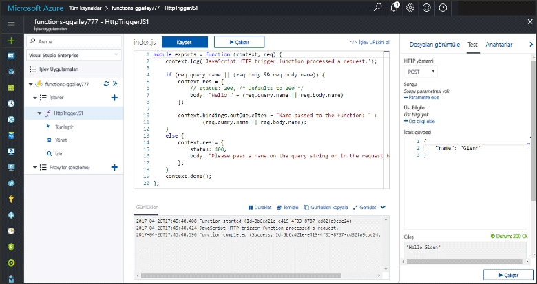
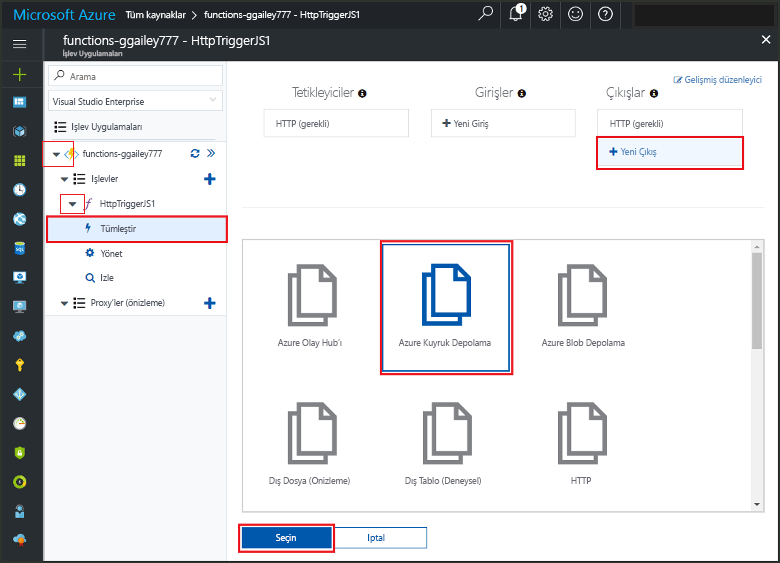
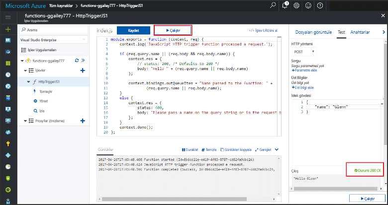
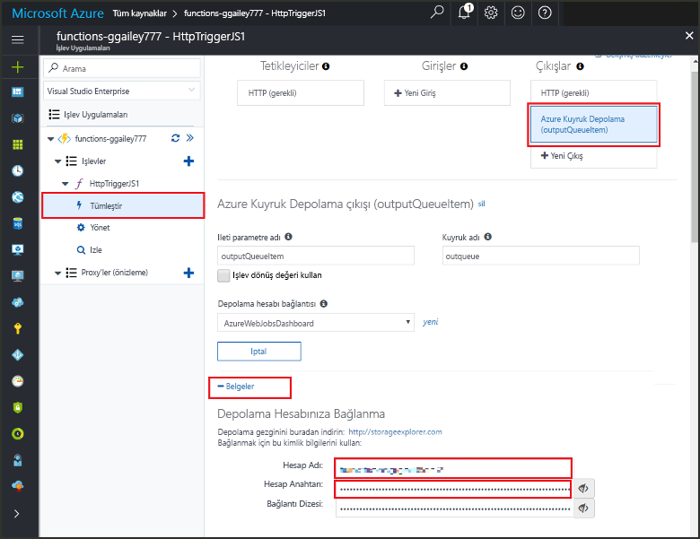
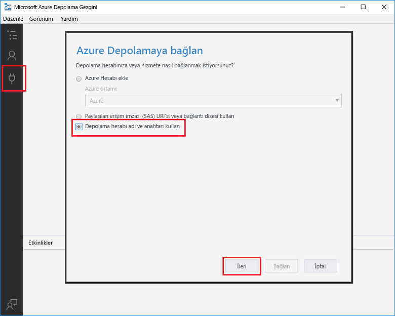

# <a name="add-messages-tooan-azure-storage-queue-using-functions"></a>İşlevler kullanılarak iletileri tooan Azure depolama kuyruğu ekleme

Azure işlevleri, giriş ve çıkış bağlama işlevinizde bir bildirim temelli yolu tooconnect tooexternal hizmet verileri belirtin. Bu konuda, nasıl tooupdate bağlaması bir çıktı ekleyerek varolan bir işlev tooAzure kuyruk depolama iletileri gönderir öğrenin.  



## <a name="prerequisites"></a>Ön koşullar 

[!INCLUDE [Previous topics](../../includes/functions-quickstart-previous-topics.md)]

* Merhaba yüklemek [Microsoft Azure Storage Gezgini](http://storageexplorer.com/).

## <a name="add-binding"></a>Çıkış bağlaması ekleme
 
1. İşlev uygulamanızı ve işlevinizi genişletin.

2. Seçin **tümleştir** ve **+ yeni çıktı**, ardından **Azure kuyruk depolama** ve **seçin**.
    
    

3. Merhaba tabloda belirtildiği gibi Hello ayarları kullanın: 

    

    | Ayar      |  Önerilen değer   | Açıklama                              |
    | ------------ |  ------- | -------------------------------------------------- |
    | **Kuyruk adı**   | myqueue-items    | Merhaba Hello adını, depolama hesabınız tooconnect tooin sırası. |
    | **Depolama hesabı bağlantısı** | AzureWebJobStorage | Merhaba depolama hesabı bağlantısı işlevi uygulamanız tarafından zaten kullanılmakta kullanın veya yeni bir tane oluşturun.  |
    | **İleti parametre adı** | outputQueueItem | Merhaba çıkış bağlama parametresinin Hello adı. | 

4. Tıklatın **kaydetmek** tooadd hello bağlama.
 
Tanımlanan bir çıktı bağlama sahip olduğunuza göre tooupdate hello kod toouse hello bağlama tooadd iletileri tooa sırası gerekir.  

## <a name="update-hello-function-code"></a>Merhaba işlev kodunu güncelleştirmesi

1. İşlev toodisplay hello işlevi kodunuzu hello Düzenleyicisi'nde seçin. 

2. C#, bir işlev için tooadd hello aşağıdaki gibi işlev tanımının güncelleştirme **outputQueueItem** depolama bağlama parametresi. JavaScript işlevi için bu adımı atlayın.

    ```cs   
    public static async Task<HttpResponseMessage> Run(HttpRequestMessage req, 
        ICollector<string> outputQueueItem, TraceWriter log)
    {
        ....
    }
    ```

3. Kod toohello işlevi yalnızca hello yöntemi döndürmeden önce aşağıdaki hello ekleyin. Merhaba uygun parçacığı işlevinizi hello dili için kullanın.

    ```javascript
    context.bindings.outputQueueItem = "Name passed toohello function: " + 
                (req.query.name || req.body.name);
    ```

    ```cs
    outputQueueItem.Add("Name passed toohello function: " + name);     
    ```

4. Seçin **kaydetmek** toosave değişiklikler.

toohello HTTP tetikleyicisini geçirilen hello değeri bir ileti eklenen toohello sırada dahil edilir.
 
## <a name="test-hello-function"></a>Test hello işlevi 

1. Merhaba kod değişiklikler kaydedildikten sonra seçin **çalıştırmak**. 

    

2. Merhaba günlükleri toomake hello işlevi başarılı olduğundan emin olun. Adlı yeni bir sıra **outqueue** depolama hesabınıza bağlama hello çıktısını alırken işlevleri çalışma zamanı ilk kullanılan hello tarafından oluşturulur.

Ardından, tooyour depolama hesabı tooverify hello yeni kuyruk ve tooit eklenen selamlama iletisine bağlanabilir. 

## <a name="connect-toohello-queue"></a>Toohello sıra Bağlan

Zaten Depolama Gezgini yüklediyseniz ve tooyour depolama hesabı bağlı Atla hello ilk üç adımı.    

1. İşlevinde seçin **tümleştir** ve hello yeni **Azure kuyruk depolama** bağlama çıktı sonra genişletin **belgelerine**. Hem **Hesap adı** hem de **Hesap anahtarı** değerlerini kopyalayın. Bu kimlik bilgileri tooconnect toohello depolama hesabı kullanın.
 
    

2. Hello çalıştırmak [Microsoft Azure Storage Gezgini](http://storageexplorer.com/) aracı, select hello Bağlan simgesi hello sol tarafta, seçin **bir depolama hesabı adı ve anahtar kullanmak**seçip **sonraki**.

    
    
3. Yapıştır hello **hesap adı** ve **hesap anahtarı** bunların karşılık gelen alanlara adım 1 öğesinden sonra seçin **sonraki**, ve **Bağlan**. 
  
    

4. Merhaba bağlı depolama hesabı genişletin, **sıraları** ve bir sıraya adlı doğrulayın **Sıram öğeleri** bulunmaktadır. Ayrıca bir iletiyi zaten hello görmeniz gerekir.  
 
    
 

## <a name="clean-up-resources"></a>Kaynakları temizleme

[!INCLUDE [Next steps note](../../includes/functions-quickstart-cleanup.md)]

## <a name="next-steps"></a>Sonraki adımlar

Bir çıkış bağlama tooan varolan işlevi eklediniz. 

[!INCLUDE [Next steps note](../../includes/functions-quickstart-next-steps.md)]

Bağlama tooQueue depolama hakkında daha fazla bilgi için bkz: [Azure işlevleri depolama kuyruğu bağlamaları](functions-bindings-storage-queue.md). 


