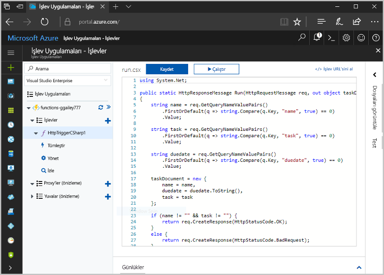
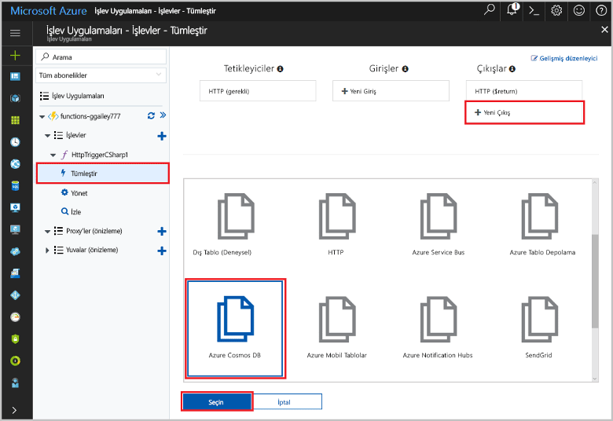
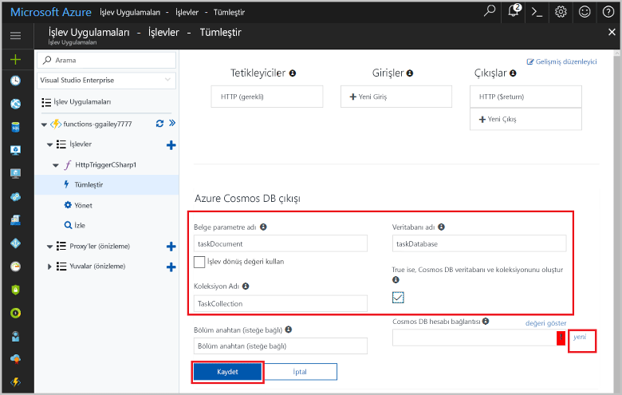
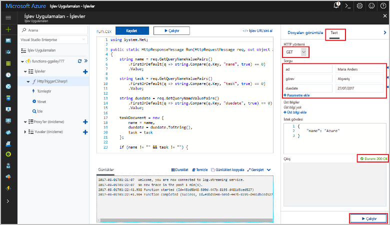
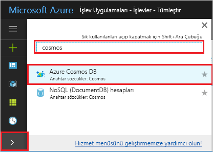
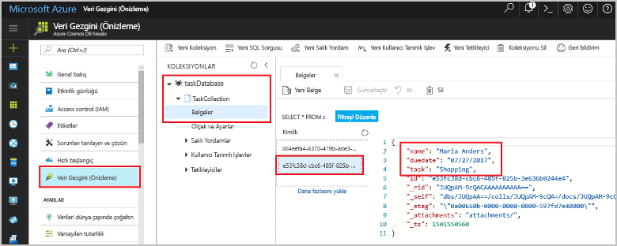

# <a name="store-unstructured-data-using-azure-functions-and-cosmos-db"></a><span data-ttu-id="71e87-104">Azure İşlevleri ve Cosmos DB’yi kullanarak yapılandırılmamış verileri depolama</span><span class="sxs-lookup"><span data-stu-id="71e87-104">Store unstructured data using Azure Functions and Cosmos DB</span></span>

<span data-ttu-id="71e87-105">[Azure Cosmos DB](https://azure.microsoft.com/services/cosmos-db/) mükemmel şekilde toostore yapılandırılmamış ve JSON verileri.</span><span class="sxs-lookup"><span data-stu-id="71e87-105">[Azure Cosmos DB](https://azure.microsoft.com/services/cosmos-db/) is a great way toostore unstructured and JSON data.</span></span> <span data-ttu-id="71e87-106">Cosmos DB, Azure İşlevleri ile birlikte kullanıldığında verilerin ilişkisel bir veritabanında depolanmasına göre çok daha az kodla verileri hızlı ve kolay bir şekilde depolar.</span><span class="sxs-lookup"><span data-stu-id="71e87-106">Combined with Azure Functions, Cosmos DB makes storing data quick and easy with much less code than required for storing data in a relational database.</span></span>

<span data-ttu-id="71e87-107">Azure işlevleri, giriş ve çıkış bağlama işlevinizde bir bildirim temelli yolu tooconnect tooexternal hizmet verileri belirtin.</span><span class="sxs-lookup"><span data-stu-id="71e87-107">In Azure Functions, input and output bindings provide a declarative way tooconnect tooexternal service data from your function.</span></span> <span data-ttu-id="71e87-108">Bu konuda, nasıl tooupdate bir var olan C# işlev tooadd Cosmos DB belgede yapılandırılmamış veri depolayan bir çıktı bağlama hakkında bilgi edinin.</span><span class="sxs-lookup"><span data-stu-id="71e87-108">In this topic, learn how tooupdate an existing C# function tooadd an output binding that stores unstructured data in a Cosmos DB document.</span></span> 



## <a name="prerequisites"></a><span data-ttu-id="71e87-110">Ön koşullar</span><span class="sxs-lookup"><span data-stu-id="71e87-110">Prerequisites</span></span>

<span data-ttu-id="71e87-111">toocomplete Bu öğretici:</span><span class="sxs-lookup"><span data-stu-id="71e87-111">toocomplete this tutorial:</span></span>

[!INCLUDE [Previous quickstart note](../../includes/functions-quickstart-previous-topics.md)]

## <a name="add-an-output-binding"></a><span data-ttu-id="71e87-112">Çıktı bağlaması ekleme</span><span class="sxs-lookup"><span data-stu-id="71e87-112">Add an output binding</span></span>

1. <span data-ttu-id="71e87-113">İşlev uygulamanızı ve işlevinizi genişletin.</span><span class="sxs-lookup"><span data-stu-id="71e87-113">Expand both your function app and your function.</span></span>

1. <span data-ttu-id="71e87-114">Seçin **tümleştir** ve **+ yeni çıkış**, hello olduğu başlangıç sayfasının sağ üst.</span><span class="sxs-lookup"><span data-stu-id="71e87-114">Select **Integrate** and **+ New Output**, which is at hello top right of hello page.</span></span> <span data-ttu-id="71e87-115">**Azure Cosmos DB**’yi seçip **Seç**’e tıklayın.</span><span class="sxs-lookup"><span data-stu-id="71e87-115">Choose **Azure Cosmos DB**, and click **Select**.</span></span>

    

3. <span data-ttu-id="71e87-117">Kullanım hello **Azure Cosmos DB çıktı** hello tabloda belirtildiği gibi ayarları:</span><span class="sxs-lookup"><span data-stu-id="71e87-117">Use hello **Azure Cosmos DB output** settings as specified in hello table:</span></span> 

    

    | <span data-ttu-id="71e87-119">Ayar</span><span class="sxs-lookup"><span data-stu-id="71e87-119">Setting</span></span>      | <span data-ttu-id="71e87-120">Önerilen değer</span><span class="sxs-lookup"><span data-stu-id="71e87-120">Suggested value</span></span>  | <span data-ttu-id="71e87-121">Açıklama</span><span class="sxs-lookup"><span data-stu-id="71e87-121">Description</span></span>                                |
    | ------------ | ---------------- | ------------------------------------------ |
    | <span data-ttu-id="71e87-122">**Belge parametre adı**</span><span class="sxs-lookup"><span data-stu-id="71e87-122">**Document parameter name**</span></span> | <span data-ttu-id="71e87-123">taskDocument</span><span class="sxs-lookup"><span data-stu-id="71e87-123">taskDocument</span></span> | <span data-ttu-id="71e87-124">Kodda toohello Cosmos DB Nesne başvurur adı.</span><span class="sxs-lookup"><span data-stu-id="71e87-124">Name that refers toohello Cosmos DB object in code.</span></span> |
    | <span data-ttu-id="71e87-125">**Veritabanı adı**</span><span class="sxs-lookup"><span data-stu-id="71e87-125">**Database name**</span></span> | <span data-ttu-id="71e87-126">taskDatabase</span><span class="sxs-lookup"><span data-stu-id="71e87-126">taskDatabase</span></span> | <span data-ttu-id="71e87-127">Veritabanı toosave belgeleri adı.</span><span class="sxs-lookup"><span data-stu-id="71e87-127">Name of database toosave documents.</span></span> |
    | <span data-ttu-id="71e87-128">**Koleksiyon adı**</span><span class="sxs-lookup"><span data-stu-id="71e87-128">**Collection name**</span></span> | <span data-ttu-id="71e87-129">TaskCollection</span><span class="sxs-lookup"><span data-stu-id="71e87-129">TaskCollection</span></span> | <span data-ttu-id="71e87-130">Cosmos DB veritabanları koleksiyonunun adı.</span><span class="sxs-lookup"><span data-stu-id="71e87-130">Name of collection of Cosmos DB databases.</span></span> |
    | <span data-ttu-id="71e87-131">**TRUE ise, hello Cosmos DB veritabanı ve koleksiyonu oluşturur**</span><span class="sxs-lookup"><span data-stu-id="71e87-131">**If true, creates hello Cosmos DB database and collection**</span></span> | <span data-ttu-id="71e87-132">İşaretli</span><span class="sxs-lookup"><span data-stu-id="71e87-132">Checked</span></span> | <span data-ttu-id="71e87-133">Merhaba koleksiyonu zaten mevcut değil; Bu yüzden oluşturun.</span><span class="sxs-lookup"><span data-stu-id="71e87-133">hello collection doesn't already exist, so create it.</span></span> |

4. <span data-ttu-id="71e87-134">Seçin **yeni** sonraki toohello **Cosmos DB belge bağlantısı** etiket ve seçin **+ Yeni Oluştur**.</span><span class="sxs-lookup"><span data-stu-id="71e87-134">Select **New** next toohello **Cosmos DB document connection** label, and select **+ Create new**.</span></span> 

5. <span data-ttu-id="71e87-135">Kullanım hello **yeni hesabı** hello tabloda belirtildiği gibi ayarları:</span><span class="sxs-lookup"><span data-stu-id="71e87-135">Use hello **New account** settings as specified in hello table:</span></span> 

    

    | <span data-ttu-id="71e87-137">Ayar</span><span class="sxs-lookup"><span data-stu-id="71e87-137">Setting</span></span>      | <span data-ttu-id="71e87-138">Önerilen değer</span><span class="sxs-lookup"><span data-stu-id="71e87-138">Suggested value</span></span>  | <span data-ttu-id="71e87-139">Açıklama</span><span class="sxs-lookup"><span data-stu-id="71e87-139">Description</span></span>                                |
    | ------------ | ---------------- | ------------------------------------------ |
    | <span data-ttu-id="71e87-140">**ID**</span><span class="sxs-lookup"><span data-stu-id="71e87-140">**ID**</span></span> | <span data-ttu-id="71e87-141">Veritabanının adı</span><span class="sxs-lookup"><span data-stu-id="71e87-141">Name of database</span></span> | <span data-ttu-id="71e87-142">Merhaba Cosmos DB veritabanı için benzersiz kimliği</span><span class="sxs-lookup"><span data-stu-id="71e87-142">Unique ID for hello Cosmos DB database</span></span>  |
    | <span data-ttu-id="71e87-143">**API**</span><span class="sxs-lookup"><span data-stu-id="71e87-143">**API**</span></span> | <span data-ttu-id="71e87-144">SQL (DocumentDB)</span><span class="sxs-lookup"><span data-stu-id="71e87-144">SQL (DocumentDB)</span></span> | <span data-ttu-id="71e87-145">Merhaba belge veritabanı API seçin.</span><span class="sxs-lookup"><span data-stu-id="71e87-145">Select hello document database API.</span></span>  |
    | <span data-ttu-id="71e87-146">**Abonelik**</span><span class="sxs-lookup"><span data-stu-id="71e87-146">**Subscription**</span></span> | <span data-ttu-id="71e87-147">Azure Aboneliği</span><span class="sxs-lookup"><span data-stu-id="71e87-147">Azure Subscription</span></span> | <span data-ttu-id="71e87-148">Azure Aboneliği</span><span class="sxs-lookup"><span data-stu-id="71e87-148">Azure Subscription</span></span>  |
    | <span data-ttu-id="71e87-149">**Kaynak Grubu**</span><span class="sxs-lookup"><span data-stu-id="71e87-149">**Resource Group**</span></span> | <span data-ttu-id="71e87-150">myResourceGroup</span><span class="sxs-lookup"><span data-stu-id="71e87-150">myResourceGroup</span></span> |  <span data-ttu-id="71e87-151">İşlev uygulamanızı içeren hello var olan kaynak grubunu kullanın.</span><span class="sxs-lookup"><span data-stu-id="71e87-151">Use hello existing resource group that contains your function app.</span></span> |
    | <span data-ttu-id="71e87-152">**Konum**</span><span class="sxs-lookup"><span data-stu-id="71e87-152">**Location**</span></span>  | <span data-ttu-id="71e87-153">WestEurope</span><span class="sxs-lookup"><span data-stu-id="71e87-153">WestEurope</span></span> | <span data-ttu-id="71e87-154">Merhaba depolanan belgeler tooother uygulamaları veya işlev uygulaması tooeither yakın bir konum seçin.</span><span class="sxs-lookup"><span data-stu-id="71e87-154">Select a location near tooeither your function app or tooother apps that use hello stored documents.</span></span>  |

6. <span data-ttu-id="71e87-155">Tıklatın **Tamam** toocreate hello veritabanı.</span><span class="sxs-lookup"><span data-stu-id="71e87-155">Click **OK** toocreate hello database.</span></span> <span data-ttu-id="71e87-156">Birkaç dakika toocreate hello veritabanı sürebilir.</span><span class="sxs-lookup"><span data-stu-id="71e87-156">It may take a few minutes toocreate hello database.</span></span> <span data-ttu-id="71e87-157">Merhaba veritabanı oluşturulduktan sonra hello veritabanı bağlantı dizesi işlevi uygulama ayarı olarak depolanır.</span><span class="sxs-lookup"><span data-stu-id="71e87-157">After hello database is created, hello database connection string is stored as a function app setting.</span></span> <span data-ttu-id="71e87-158">Bu uygulama ayarı Hello adını eklenir **Cosmos DB hesap bağlantı**.</span><span class="sxs-lookup"><span data-stu-id="71e87-158">hello name of this app setting is inserted in **Cosmos DB account connection**.</span></span> 
 
8. <span data-ttu-id="71e87-159">Merhaba bağlantı dizesi ayarladıktan sonra Seç **kaydetmek** toocreate hello bağlama.</span><span class="sxs-lookup"><span data-stu-id="71e87-159">After hello connection string is set, select **Save** toocreate hello binding.</span></span>

## <a name="update-hello-function-code"></a><span data-ttu-id="71e87-160">Merhaba işlev kodunu güncelleştirmesi</span><span class="sxs-lookup"><span data-stu-id="71e87-160">Update hello function code</span></span>

<span data-ttu-id="71e87-161">Merhaba varolan C# işlevi kod koddan hello ile değiştirin:</span><span class="sxs-lookup"><span data-stu-id="71e87-161">Replace hello existing C# function code with hello following code:</span></span>

```csharp
using System.Net;

public static HttpResponseMessage Run(HttpRequestMessage req, out object taskDocument, TraceWriter log)
{
    string name = req.GetQueryNameValuePairs()
        .FirstOrDefault(q => string.Compare(q.Key, "name", true) == 0)
        .Value;

    string task = req.GetQueryNameValuePairs()
        .FirstOrDefault(q => string.Compare(q.Key, "task", true) == 0)
        .Value;

    string duedate = req.GetQueryNameValuePairs()
        .FirstOrDefault(q => string.Compare(q.Key, "duedate", true) == 0)
        .Value;

    taskDocument = new {
        name = name,
        duedate = duedate.ToString(),
        task = task
    };

    if (name != "" && task != "") {
        return req.CreateResponse(HttpStatusCode.OK);
    }
    else {
        return req.CreateResponse(HttpStatusCode.BadRequest);
    }
}

```
<span data-ttu-id="71e87-162">Bu kod örneği sorgu dizeleri hello HTTP isteğini okur ve bunlara hello toofields atar `taskDocument` nesnesi.</span><span class="sxs-lookup"><span data-stu-id="71e87-162">This code sample reads hello HTTP Request query strings and assigns them toofields in hello `taskDocument` object.</span></span> <span data-ttu-id="71e87-163">Merhaba `taskDocument` bağlama hello ilişkili belge veritabanında depolanan bu bağlama parametresi toobe gelen hello nesne verileri gönderir.</span><span class="sxs-lookup"><span data-stu-id="71e87-163">hello `taskDocument` binding sends hello object data from this binding parameter toobe stored in hello bound document database.</span></span> <span data-ttu-id="71e87-164">Merhaba veritabanı hello hello işlevi ilk çalıştığında oluşturulur.</span><span class="sxs-lookup"><span data-stu-id="71e87-164">hello database is created hello first time hello function runs.</span></span>

## <a name="test-hello-function-and-database"></a><span data-ttu-id="71e87-165">Test hello işlevi ve veritabanı</span><span class="sxs-lookup"><span data-stu-id="71e87-165">Test hello function and database</span></span>

1. <span data-ttu-id="71e87-166">Merhaba sağ penceresi genişletin ve seçin **Test**.</span><span class="sxs-lookup"><span data-stu-id="71e87-166">Expand hello right window and select **Test**.</span></span> <span data-ttu-id="71e87-167">Altında **sorgu**, tıklatın **+ parametresini ekleyin** ve parametreleri toohello sorgu dizesi aşağıdaki hello ekleyin:</span><span class="sxs-lookup"><span data-stu-id="71e87-167">Under **Query**, click **+ Add parameter** and add hello following parameters toohello query string:</span></span>

    + `name`
    + `task`
    + `duedate`

2. <span data-ttu-id="71e87-168">**Çalıştır**’a tıklayın ve 200 durumunun döndürüldüğünü doğrulayın.</span><span class="sxs-lookup"><span data-stu-id="71e87-168">Click **Run** and verify that a 200 status is returned.</span></span>

    

1. <span data-ttu-id="71e87-170">Sol hello Azure portal tarafı hello üzerinde hello simge çubuğu genişletin türü `cosmos` alan ve select hello arama **Azure Cosmos DB**.</span><span class="sxs-lookup"><span data-stu-id="71e87-170">On hello left side of hello Azure portal, expand hello icon bar, type `cosmos` in hello search field, and select **Azure Cosmos DB**.</span></span>

    

2. <span data-ttu-id="71e87-172">Oluşturduğunuz, select hello veritabanını seçip **Veri Gezgini**.</span><span class="sxs-lookup"><span data-stu-id="71e87-172">Select hello database you created, then select **Data Explorer**.</span></span> <span data-ttu-id="71e87-173">Merhaba genişletin **koleksiyonları** düğümleri hello yeni belge seçin ve hello belge içeren bazı ek meta veri yanı sıra, sorgu dizesi değerlerini onaylayın.</span><span class="sxs-lookup"><span data-stu-id="71e87-173">Expand hello **Collections** nodes, select hello new document, and confirm that hello document contains your query string values, along with some additional metadata.</span></span> 

    

<span data-ttu-id="71e87-175">Cosmos DB veritabanında yapılandırılmamış veri depolayan bir bağlama tooyour HTTP tetikleyici başarıyla eklediniz.</span><span class="sxs-lookup"><span data-stu-id="71e87-175">You have successfully added a binding tooyour HTTP trigger that stores unstructured data in a Cosmos DB database.</span></span>

[!INCLUDE [Clean-up section](../../includes/clean-up-section-portal.md)]

## <a name="next-steps"></a><span data-ttu-id="71e87-176">Sonraki adımlar</span><span class="sxs-lookup"><span data-stu-id="71e87-176">Next steps</span></span>

[!INCLUDE [functions-quickstart-next-steps](../../includes/functions-quickstart-next-steps.md)]

<span data-ttu-id="71e87-177">Bağlama tooa Cosmos DB veritabanı hakkında daha fazla bilgi için bkz: [Azure işlevleri Cosmos DB bağlamaları](functions-bindings-documentdb.md).</span><span class="sxs-lookup"><span data-stu-id="71e87-177">For more information about binding tooa Cosmos DB database, see [Azure Functions Cosmos DB bindings](functions-bindings-documentdb.md).</span></span>
