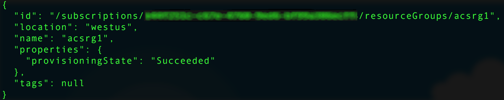

# <a name="deploy-a-docker-container-hosting-solution-using-hello-azure-cli-20"></a><span data-ttu-id="7c325-103">Barındırma çözümünüzü Hello Azure CLI 2.0 kullanarak bir Docker kapsayıcısı dağıtma</span><span class="sxs-lookup"><span data-stu-id="7c325-103">Deploy a Docker container hosting solution using hello Azure CLI 2.0</span></span>

<span data-ttu-id="7c325-104">Kullanım hello `az acs` komutları hello Azure CLI 2.0 toocreate ve Azure kapsayıcı hizmeti kümelerde yönetin.</span><span class="sxs-lookup"><span data-stu-id="7c325-104">Use hello `az acs` commands in hello Azure CLI 2.0 toocreate and manage clusters in Azure Container Service.</span></span> <span data-ttu-id="7c325-105">Hello kullanarak Azure kapsayıcı hizmeti kümesi dağıtabilirsiniz [Azure portal](container-service-deployment.md) veya Azure kapsayıcı hizmeti API'leri hello.</span><span class="sxs-lookup"><span data-stu-id="7c325-105">You can also deploy an Azure Container Service cluster by using hello [Azure portal](container-service-deployment.md) or hello Azure Container Service APIs.</span></span>

<span data-ttu-id="7c325-106">İlgili Yardım `az acs` komutlar geçmesi hello `-h` parametresi tooany komutu.</span><span class="sxs-lookup"><span data-stu-id="7c325-106">For help on `az acs` commands, pass hello `-h` parameter tooany command.</span></span> <span data-ttu-id="7c325-107">Örneğin: `az acs create -h`.</span><span class="sxs-lookup"><span data-stu-id="7c325-107">For example: `az acs create -h`.</span></span>


## <a name="prerequisites"></a><span data-ttu-id="7c325-108">Ön koşullar</span><span class="sxs-lookup"><span data-stu-id="7c325-108">Prerequisites</span></span>
<span data-ttu-id="7c325-109">bir Azure kapsayıcı hizmeti kümesi kullanarak toocreate Merhaba Azure CLI 2.0, şunları yapmalısınız:</span><span class="sxs-lookup"><span data-stu-id="7c325-109">toocreate an Azure Container Service cluster using hello Azure CLI 2.0, you must:</span></span>
* <span data-ttu-id="7c325-110">bir Azure hesabı ([ücretsiz deneme sürümü edinin](https://azure.microsoft.com/pricing/free-trial/))</span><span class="sxs-lookup"><span data-stu-id="7c325-110">have an Azure account ([get a free trial](https://azure.microsoft.com/pricing/free-trial/))</span></span>
* <span data-ttu-id="7c325-111">yüklü ve hello ayarlanmış olması [Azure CLI 2.0](/cli/azure/install-az-cli2)</span><span class="sxs-lookup"><span data-stu-id="7c325-111">have installed and set up hello [Azure CLI 2.0](/cli/azure/install-az-cli2)</span></span>

## <a name="get-started"></a><span data-ttu-id="7c325-112">başlarken</span><span class="sxs-lookup"><span data-stu-id="7c325-112">Get started</span></span> 
### <a name="log-in-tooyour-account"></a><span data-ttu-id="7c325-113">Tooyour hesabında oturum</span><span class="sxs-lookup"><span data-stu-id="7c325-113">Log in tooyour account</span></span>
```azurecli
az login 
```

<span data-ttu-id="7c325-114">Merhaba istemleri toolog etkileşimli olarak izleyin.</span><span class="sxs-lookup"><span data-stu-id="7c325-114">Follow hello prompts toolog in interactively.</span></span> <span data-ttu-id="7c325-115">İçin diğer yöntemleri toolog içinde bkz [Azure CLI 2.0 ile çalışmaya başlama](/cli/azure/get-started-with-az-cli2).</span><span class="sxs-lookup"><span data-stu-id="7c325-115">For other methods toolog in, see [Get started with Azure CLI 2.0](/cli/azure/get-started-with-az-cli2).</span></span>

### <a name="set-your-azure-subscription"></a><span data-ttu-id="7c325-116">Azure aboneliğinizi ayarlama</span><span class="sxs-lookup"><span data-stu-id="7c325-116">Set your Azure subscription</span></span>

<span data-ttu-id="7c325-117">Birden fazla Azure aboneliğiniz varsa, hello varsayılan abonelik ayarlayın.</span><span class="sxs-lookup"><span data-stu-id="7c325-117">If you have more than one Azure subscription, set hello default subscription.</span></span> <span data-ttu-id="7c325-118">Örneğin:</span><span class="sxs-lookup"><span data-stu-id="7c325-118">For example:</span></span>

```
az account set --subscription "f66xxxxx-xxxx-xxxx-xxx-zgxxxx33cha5"
```


### <a name="create-a-resource-group"></a><span data-ttu-id="7c325-119">Kaynak grubu oluşturma</span><span class="sxs-lookup"><span data-stu-id="7c325-119">Create a resource group</span></span>
<span data-ttu-id="7c325-120">Her küme için bir kaynak grubu oluşturmanız önerilir.</span><span class="sxs-lookup"><span data-stu-id="7c325-120">We recommend that you create a resource group for every cluster.</span></span> <span data-ttu-id="7c325-121">Azure Container Service’in [kullanılabilir](https://azure.microsoft.com/en-us/regions/services/) olduğu bir Azure bölgesi belirtin.</span><span class="sxs-lookup"><span data-stu-id="7c325-121">Specify an Azure region in which Azure Container Service is [available](https://azure.microsoft.com/en-us/regions/services/).</span></span> <span data-ttu-id="7c325-122">Örneğin:</span><span class="sxs-lookup"><span data-stu-id="7c325-122">For example:</span></span>

```azurecli
az group create -n acsrg1 -l "westus"
```
<span data-ttu-id="7c325-123">Çıktı benzer toohello aşağıda verilmiştir:</span><span class="sxs-lookup"><span data-stu-id="7c325-123">Output is similar toohello following:</span></span>




## <a name="create-an-azure-container-service-cluster"></a><span data-ttu-id="7c325-125">Azure Container Service Kümesi oluşturma</span><span class="sxs-lookup"><span data-stu-id="7c325-125">Create an Azure Container Service cluster</span></span>

<span data-ttu-id="7c325-126">toocreate bir küme kullanın `az acs create`.</span><span class="sxs-lookup"><span data-stu-id="7c325-126">toocreate a cluster, use `az acs create`.</span></span>
<span data-ttu-id="7c325-127">Merhaba küme için ad ve hello hello önceki adımda oluşturduğunuz hello kaynak grubunun adını zorunlu parametreleridir.</span><span class="sxs-lookup"><span data-stu-id="7c325-127">A name for hello cluster and hello name of hello resource group created in hello previous step are mandatory parameters.</span></span> 

<span data-ttu-id="7c325-128">Diğer girdileridir kümesi toodefault değerleri (ekran aşağıdaki hello bakın) kendi ilgili anahtarları kullanma üzerine sürece.</span><span class="sxs-lookup"><span data-stu-id="7c325-128">Other inputs are set toodefault values (see hello following screen) unless overwritten using their respective switches.</span></span> <span data-ttu-id="7c325-129">Örneğin, hello orchestrator varsayılan tooDC/işletim sistemi tarafından ayarlanır.</span><span class="sxs-lookup"><span data-stu-id="7c325-129">For example, hello orchestrator is set by default tooDC/OS.</span></span> <span data-ttu-id="7c325-130">Ve bir belirtmezseniz, bir DNS adı ön ekini hello küme adına göre oluşturulur.</span><span class="sxs-lookup"><span data-stu-id="7c325-130">And if you don't specify one, a DNS name prefix is created based on hello cluster name.</span></span>


### <a name="quick-acs-create-using-defaults"></a><span data-ttu-id="7c325-132">Varsayılan değerleri kullanarak hızlı `acs create`</span><span class="sxs-lookup"><span data-stu-id="7c325-132">Quick `acs create` using defaults</span></span>
<span data-ttu-id="7c325-133">Bir SSH RSA ortak anahtar dosyanız varsa `id_rsa.pub` hello varsayılan konumuna (veya biri için oluşturulan [OS X ve Linux](../../virtual-machines/linux/mac-create-ssh-keys.md) veya [Windows](../../virtual-machines/linux/ssh-from-windows.md)), hello aşağıdaki gibi bir komutu kullanın:</span><span class="sxs-lookup"><span data-stu-id="7c325-133">If you have an SSH RSA public key file `id_rsa.pub` in hello default location (or created one for [OS X and Linux](../../virtual-machines/linux/mac-create-ssh-keys.md) or [Windows](../../virtual-machines/linux/ssh-from-windows.md)), use a command like hello following:</span></span>

```azurecli
az acs create -n acs-cluster -g acsrg1 -d applink789
```
<span data-ttu-id="7c325-134">SSH ortak anahtarınız yoksa, bu ikinci komutu kullanın.</span><span class="sxs-lookup"><span data-stu-id="7c325-134">If you don't have an SSH public key, use this second command.</span></span> <span data-ttu-id="7c325-135">Bu komutla hello `--generate-ssh-keys` sizin için bir anahtar oluşturur.</span><span class="sxs-lookup"><span data-stu-id="7c325-135">This command with hello `--generate-ssh-keys` switch creates one for you.</span></span>

```azurecli
az acs create -n acs-cluster -g acsrg1 -d applink789 --generate-ssh-keys
```

<span data-ttu-id="7c325-136">Merhaba komutu girdikten sonra oluşturulan hello küme toobe için yaklaşık 10 dakika bekleyin.</span><span class="sxs-lookup"><span data-stu-id="7c325-136">After you enter hello command, wait for about 10 minutes for hello cluster toobe created.</span></span> <span data-ttu-id="7c325-137">Merhaba komutu çıktısı hello ana Aracısı düğümleri ve bir SSH komutu tooconnect toohello ilk ana tam etki alanı adlarını (FQDN) içerir.</span><span class="sxs-lookup"><span data-stu-id="7c325-137">hello command output includes fully qualified domain names (FQDNs) of hello master and agent nodes and an SSH command tooconnect toohello first master.</span></span> <span data-ttu-id="7c325-138">Kısaltılmış çıktı şu şekildedir:</span><span class="sxs-lookup"><span data-stu-id="7c325-138">Here is abbreviated output:</span></span>


> [!TIP]
> <span data-ttu-id="7c325-140">Merhaba [Kubernetes izlenecek](../kubernetes/container-service-kubernetes-walkthrough.md) gösterir nasıl toouse `az acs create` varsayılan değerleri toocreate bir Kubernetes küme.</span><span class="sxs-lookup"><span data-stu-id="7c325-140">hello [Kubernetes walkthrough](../kubernetes/container-service-kubernetes-walkthrough.md) shows how toouse `az acs create` with default values toocreate a Kubernetes cluster.</span></span>
>

## <a name="manage-acs-clusters"></a><span data-ttu-id="7c325-141">ACS kümelerini yönetme</span><span class="sxs-lookup"><span data-stu-id="7c325-141">Manage ACS clusters</span></span>

<span data-ttu-id="7c325-142">Ek kullanım `az acs` toomanage kümenizi komutları.</span><span class="sxs-lookup"><span data-stu-id="7c325-142">Use additional `az acs` commands toomanage your cluster.</span></span> <span data-ttu-id="7c325-143">Bazı örnekler aşağıda verilmiştir.</span><span class="sxs-lookup"><span data-stu-id="7c325-143">Here are some examples.</span></span>

### <a name="list-clusters-under-a-subscription"></a><span data-ttu-id="7c325-144">Bir abonelik altındaki kümeleri listeleme</span><span class="sxs-lookup"><span data-stu-id="7c325-144">List clusters under a subscription</span></span>

```azurecli
az acs list --output table
```

### <a name="list-clusters-in-a-resource-group"></a><span data-ttu-id="7c325-145">Bir kaynak grubundaki kümeleri listeleme</span><span class="sxs-lookup"><span data-stu-id="7c325-145">List clusters in a resource group</span></span>

```azurecli
az acs list -g acsrg1 --output table
```


### <a name="display-details-of-a-container-service-cluster"></a><span data-ttu-id="7c325-147">Bir kapsayıcı hizmeti kümesinin ayrıntılarını görüntüleme</span><span class="sxs-lookup"><span data-stu-id="7c325-147">Display details of a container service cluster</span></span>

```azurecli
az acs show -g acsrg1 -n acs-cluster --output list
```


### <a name="scale-hello-cluster"></a><span data-ttu-id="7c325-149">Ölçek hello küme</span><span class="sxs-lookup"><span data-stu-id="7c325-149">Scale hello cluster</span></span>
<span data-ttu-id="7c325-150">Aracı düğümlerinde hem ölçek artırma hem de ölçek azaltma yapılabilir.</span><span class="sxs-lookup"><span data-stu-id="7c325-150">Both scaling in and scaling out of agent nodes are allowed.</span></span> <span data-ttu-id="7c325-151">parametre hello `new-agent-count` hello yeni hello ACS kümedeki aracıları sayısıdır.</span><span class="sxs-lookup"><span data-stu-id="7c325-151">hello parameter `new-agent-count` is hello new number of agents in hello ACS cluster.</span></span>

```azurecli
az acs scale -g acsrg1 -n acs-cluster --new-agent-count 4
```


## <a name="delete-a-container-service-cluster"></a><span data-ttu-id="7c325-153">Kapsayıcı hizmeti kümesini silme</span><span class="sxs-lookup"><span data-stu-id="7c325-153">Delete a container service cluster</span></span>
```azurecli
az acs delete -g acsrg1 -n acs-cluster 
```
<span data-ttu-id="7c325-154">Bu komut hello kapsayıcı hizmeti oluşturulurken oluşturulan tüm kaynaklar (Ağ ve depolama) silmez.</span><span class="sxs-lookup"><span data-stu-id="7c325-154">This command does not delete all resources (network and storage) created while creating hello container service.</span></span> <span data-ttu-id="7c325-155">toodelete tüm kaynakları ayrı kaynak grubundaki her küme dağıttığınız kolayca tavsiye edilir.</span><span class="sxs-lookup"><span data-stu-id="7c325-155">toodelete all resources easily, it is recommended you deploy each cluster in a distinct resource group.</span></span> <span data-ttu-id="7c325-156">Ardından, Hello küme artık gerekli olmadığında hello kaynak grubunu silin.</span><span class="sxs-lookup"><span data-stu-id="7c325-156">Then, delete hello resource group when hello cluster is no longer required.</span></span>

## <a name="next-steps"></a><span data-ttu-id="7c325-157">Sonraki adımlar</span><span class="sxs-lookup"><span data-stu-id="7c325-157">Next steps</span></span>
<span data-ttu-id="7c325-158">Artık çalışan bir kümeniz olduğuna göre, bağlantı ve yönetim ayrıntıları için aşağıdaki belgelere bakın:</span><span class="sxs-lookup"><span data-stu-id="7c325-158">Now that you have a functioning cluster, see these documents for connection and management details:</span></span>

* [<span data-ttu-id="7c325-159">Tooan Azure kapsayıcı hizmeti kümesine bağlanma</span><span class="sxs-lookup"><span data-stu-id="7c325-159">Connect tooan Azure Container Service cluster</span></span>](../container-service-connect.md)
* [<span data-ttu-id="7c325-160">Azure Container Service ve DC/OS ile çalışma</span><span class="sxs-lookup"><span data-stu-id="7c325-160">Work with Azure Container Service and DC/OS</span></span>](container-service-mesos-marathon-rest.md)
* [<span data-ttu-id="7c325-161">Azure Container Service ve Docker Swarm ile çalışma</span><span class="sxs-lookup"><span data-stu-id="7c325-161">Work with Azure Container Service and Docker Swarm</span></span>](container-service-docker-swarm.md)
* [<span data-ttu-id="7c325-162">Azure Container Service ve Kubernetes ile çalışma</span><span class="sxs-lookup"><span data-stu-id="7c325-162">Work with Azure Container Service and Kubernetes</span></span>](../kubernetes/container-service-kubernetes-walkthrough.md)