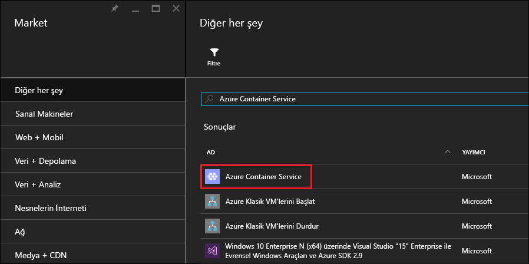
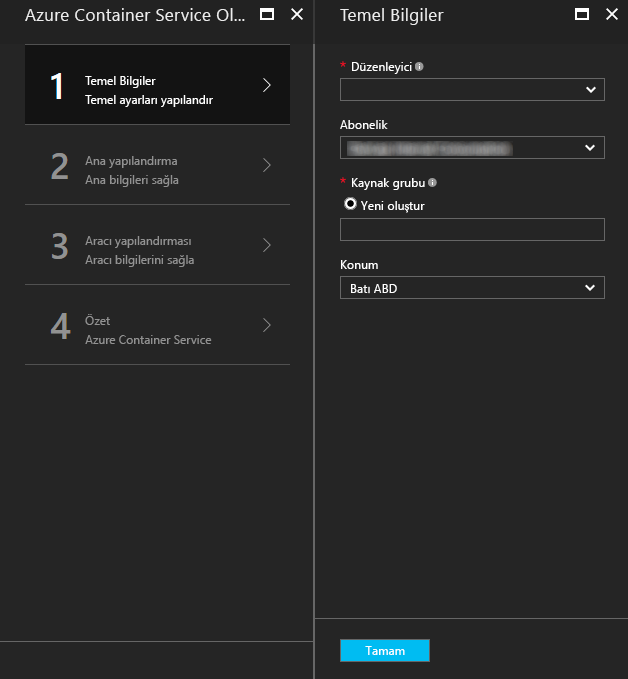
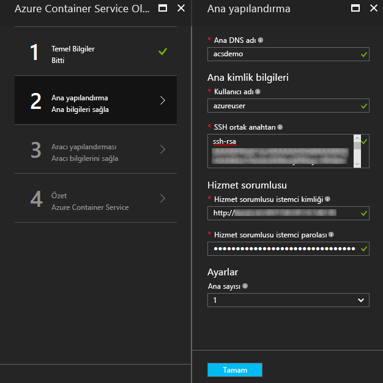
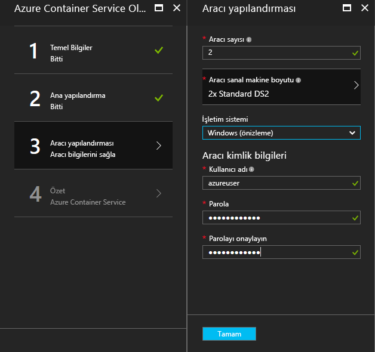
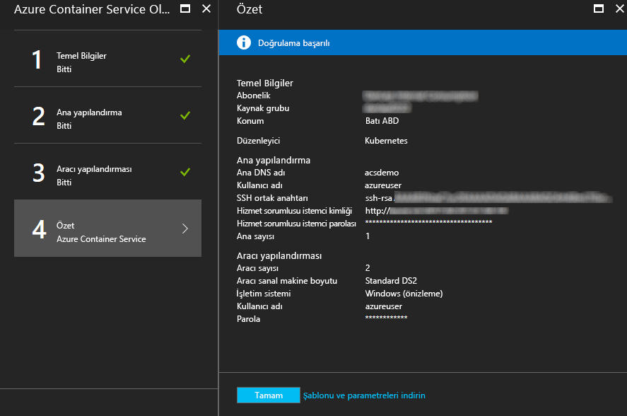
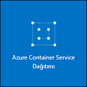

# <a name="deploy-a-docker-container-hosting-solution-using-hello-azure-portal"></a><span data-ttu-id="7d092-104">Barındırma çözümünüzü Hello Azure portal kullanarak bir Docker kapsayıcısı dağıtma</span><span class="sxs-lookup"><span data-stu-id="7d092-104">Deploy a Docker container hosting solution using hello Azure portal</span></span>


<span data-ttu-id="7d092-105">Azure Kapsayıcı Hizmeti popüler açık kaynak kapsayıcı kümeleme ve düzenleme çözümlerinin hızlı dağıtımını sağlar.</span><span class="sxs-lookup"><span data-stu-id="7d092-105">Azure Container Service provides rapid deployment of popular open-source container clustering and orchestration solutions.</span></span> <span data-ttu-id="7d092-106">Bu belge, hello Azure portal veya bir Azure Resource Manager Hızlı Başlangıç şablonu kullanarak Azure kapsayıcı hizmeti kümesi dağıtmayı adım anlatılmaktadır.</span><span class="sxs-lookup"><span data-stu-id="7d092-106">This document walks you through deploying an Azure Container Service cluster by using hello Azure portal or an Azure Resource Manager quickstart template.</span></span> 

<span data-ttu-id="7d092-107">Hello kullanarak Azure kapsayıcı hizmeti kümesi dağıtabilirsiniz [Azure CLI 2.0](container-service-create-acs-cluster-cli.md) veya Azure kapsayıcı hizmeti API'leri hello.</span><span class="sxs-lookup"><span data-stu-id="7d092-107">You can also deploy an Azure Container Service cluster by using hello [Azure CLI 2.0](container-service-create-acs-cluster-cli.md) or hello Azure Container Service APIs.</span></span>

<span data-ttu-id="7d092-108">Arka plan bilgileri için bkz. [Azure Container Service'e giriş](../container-service-intro.md).</span><span class="sxs-lookup"><span data-stu-id="7d092-108">For background, see [Azure Container Service introduction](../container-service-intro.md).</span></span>


## <a name="prerequisites"></a><span data-ttu-id="7d092-109">Ön koşullar</span><span class="sxs-lookup"><span data-stu-id="7d092-109">Prerequisites</span></span>

* <span data-ttu-id="7d092-110">**Azure aboneliği**: Aboneliğiniz yoksa [ücretsiz deneme](http://azure.microsoft.com/pricing/free-trial/?WT.mc_id=AA4C1C935) sürümüne kaydolun.</span><span class="sxs-lookup"><span data-stu-id="7d092-110">**Azure subscription**: If you don't have one, sign up for a [free trial](http://azure.microsoft.com/pricing/free-trial/?WT.mc_id=AA4C1C935).</span></span> <span data-ttu-id="7d092-111">Daha büyük bir küme için, kullandıkça öde veya diğer satın alma seçeneklerini göz önünde bulundurun.</span><span class="sxs-lookup"><span data-stu-id="7d092-111">For a larger cluster, consider a pay-as-you go subscription or other purchase options.</span></span>

    > [!NOTE]
    > <span data-ttu-id="7d092-112">Azure abonelik kullanımınızı ve [kaynak kotalarını](../../azure-subscription-service-limits.md), çekirdek kotaları gibi dağıttığınız hello küme hello boyutunu sınırlandırabilirsiniz.</span><span class="sxs-lookup"><span data-stu-id="7d092-112">Your Azure subscription usage and [resource quotas](../../azure-subscription-service-limits.md), such as cores quotas, can limit hello size of hello cluster you deploy.</span></span> <span data-ttu-id="7d092-113">toorequest kota artışı, açık bir [çevrimiçi müşteri destek isteği](../../azure-supportability/how-to-create-azure-support-request.md) herhangi bir ücret alınmaz.</span><span class="sxs-lookup"><span data-stu-id="7d092-113">toorequest a quota increase, open an [online customer support request](../../azure-supportability/how-to-create-azure-support-request.md) at no charge.</span></span>
    >

* <span data-ttu-id="7d092-114">**SSH RSA ortak anahtar**: hello portalı veya hello Azure hızlı başlangıç şablonlarını biri dağıtırken tooprovide hello ortak anahtar Azure kapsayıcı hizmeti sanal makinelere karşı kimlik doğrulaması için gereksinim duyduğunuz.</span><span class="sxs-lookup"><span data-stu-id="7d092-114">**SSH RSA public key**: When deploying through hello portal or one of hello Azure quickstart templates, you need tooprovide hello public key for authentication against Azure Container Service virtual machines.</span></span> <span data-ttu-id="7d092-115">toocreate güvenli Kabuk (SSH) RSA anahtarları bkz hello [OS X ve Linux](../../virtual-machines/linux/mac-create-ssh-keys.md) veya [Windows](../../virtual-machines/linux/ssh-from-windows.md) Kılavuzu.</span><span class="sxs-lookup"><span data-stu-id="7d092-115">toocreate Secure Shell (SSH) RSA keys, see hello [OS X and Linux](../../virtual-machines/linux/mac-create-ssh-keys.md) or [Windows](../../virtual-machines/linux/ssh-from-windows.md) guidance.</span></span> 

* <span data-ttu-id="7d092-116">**Hizmet asıl istemci Kimliğini ve parolasını** (yalnızca Kubernetes): daha fazla bilgi ve yönergeler toocreate için bir Azure Active Directory hizmet asıl, bkz: [hello hizmet sorumlusu Kubernetes kümesi için hakkında](../kubernetes/container-service-kubernetes-service-principal.md).</span><span class="sxs-lookup"><span data-stu-id="7d092-116">**Service principal client ID and secret** (Kubernetes only): For more information and guidance toocreate an Azure Active Directory service principal, see [About hello service principal for a Kubernetes cluster](../kubernetes/container-service-kubernetes-service-principal.md).</span></span>


## <a name="create-a-cluster-by-using-hello-azure-portal"></a><span data-ttu-id="7d092-117">Hello Azure portal kullanarak bir küme oluşturma</span><span class="sxs-lookup"><span data-stu-id="7d092-117">Create a cluster by using hello Azure portal</span></span>
1. <span data-ttu-id="7d092-118">Oturum açma toohello Azure portal seçin **yeni**ve arama için Azure Marketi hello **Azure kapsayıcı hizmeti**.</span><span class="sxs-lookup"><span data-stu-id="7d092-118">Sign in toohello Azure portal, select **New**, and search hello Azure Marketplace for **Azure Container Service**.</span></span>

      <br />

2. <span data-ttu-id="7d092-120">**Azure Container Service**'e ve ardından **Oluştur**'a tıklayın.</span><span class="sxs-lookup"><span data-stu-id="7d092-120">Click **Azure Container Service**, and click **Create**.</span></span>

3. <span data-ttu-id="7d092-121">Merhaba üzerinde **Temelleri** dikey penceresinde, aşağıdaki bilgilerle hello girin:</span><span class="sxs-lookup"><span data-stu-id="7d092-121">On hello **Basics** blade, enter hello following information:</span></span>

    * <span data-ttu-id="7d092-122">**Orchestrator**: hello kapsayıcı orchestrators toodeploy hello kümede birini seçin.</span><span class="sxs-lookup"><span data-stu-id="7d092-122">**Orchestrator**: Select one of hello container orchestrators toodeploy on hello cluster.</span></span>
        * <span data-ttu-id="7d092-123">**DC/OS**: DC/OS kümesi dağıtır.</span><span class="sxs-lookup"><span data-stu-id="7d092-123">**DC/OS**: Deploys a DC/OS cluster.</span></span>
        * <span data-ttu-id="7d092-124">**Swarm** Docker Swarm kümesi dağıtır.</span><span class="sxs-lookup"><span data-stu-id="7d092-124">**Swarm**: Deploys a Docker Swarm cluster.</span></span>
        * <span data-ttu-id="7d092-125">**Kubernetes**: Bir Kubernetes kümesi dağıtır.</span><span class="sxs-lookup"><span data-stu-id="7d092-125">**Kubernetes**: Deploys a Kubernetes cluster.</span></span>
    * <span data-ttu-id="7d092-126">**Abonelik**: Bir Azure aboneliği seçin.</span><span class="sxs-lookup"><span data-stu-id="7d092-126">**Subscription**: Select an Azure subscription.</span></span>
    * <span data-ttu-id="7d092-127">**Kaynak grubu**: hello hello dağıtım için yeni bir kaynak grubu adını girin.</span><span class="sxs-lookup"><span data-stu-id="7d092-127">**Resource group**: Enter hello name of a new resource group for hello deployment.</span></span>
    * <span data-ttu-id="7d092-128">**Konum**: hello Azure kapsayıcı hizmeti dağıtımı için bir Azure bölgesi seçin.</span><span class="sxs-lookup"><span data-stu-id="7d092-128">**Location**: Select an Azure region for hello Azure Container Service deployment.</span></span> <span data-ttu-id="7d092-129">Kullanım durumu için bkz. [Bölgelere göre kullanılabilir ürünler](https://azure.microsoft.com/regions/services/).</span><span class="sxs-lookup"><span data-stu-id="7d092-129">For availability, check [Products available by region](https://azure.microsoft.com/regions/services/).</span></span>
    
      <br />
    
    <span data-ttu-id="7d092-131">Tıklatın **Tamam** hazır tooproceed olduğunuzda.</span><span class="sxs-lookup"><span data-stu-id="7d092-131">Click **OK** when you're ready tooproceed.</span></span>

4. <span data-ttu-id="7d092-132">Merhaba üzerinde **ana yapılandırma** dikey penceresinde hello Linux ana düğüm veya düğümler (bazı ayarları olan belirli tooeach orchestrator) hello kümedeki ayarlarını aşağıdaki hello girin:</span><span class="sxs-lookup"><span data-stu-id="7d092-132">On hello **Master configuration** blade, enter hello following settings for hello Linux master node or nodes in hello cluster (some settings are specific tooeach orchestrator):</span></span>

    * <span data-ttu-id="7d092-133">**Ana DNS adı**: hello kullanılacak önek toocreate benzersiz bir hello ana etki alanı adı (FQDN) tam.</span><span class="sxs-lookup"><span data-stu-id="7d092-133">**Master DNS name**: hello prefix used toocreate a unique fully qualified domain name (FQDN) for hello master.</span></span> <span data-ttu-id="7d092-134">Ana FQDN'sidir hello biçiminde hello *önek*Yönetim*konumu*. cloudapp.azure.com.</span><span class="sxs-lookup"><span data-stu-id="7d092-134">hello master FQDN is of hello form *prefix*mgmt.*location*.cloudapp.azure.com.</span></span>
    * <span data-ttu-id="7d092-135">**Kullanıcı adı**: hello hello Linux sanal makineleri hello kümedeki her bir hesap için kullanıcı adı.</span><span class="sxs-lookup"><span data-stu-id="7d092-135">**User name**: hello user name for an account on each of hello Linux virtual machines in hello cluster.</span></span>
    * <span data-ttu-id="7d092-136">**SSH RSA ortak anahtar**: hello ortak anahtar toobe hello Linux sanal makinelere karşı kimlik doğrulaması için kullanılan ekleyin.</span><span class="sxs-lookup"><span data-stu-id="7d092-136">**SSH RSA public key**: Add hello public key toobe used for authentication against hello Linux virtual machines.</span></span> <span data-ttu-id="7d092-137">Bu anahtar hiçbir satır sonları içerir ve hello içerir önemlidir `ssh-rsa` öneki.</span><span class="sxs-lookup"><span data-stu-id="7d092-137">It is important that this key contains no line breaks, and it includes hello `ssh-rsa` prefix.</span></span> <span data-ttu-id="7d092-138">Merhaba `username@domain` sonek isteğe bağlıdır.</span><span class="sxs-lookup"><span data-stu-id="7d092-138">hello `username@domain` postfix is optional.</span></span> <span data-ttu-id="7d092-139">Merhaba anahtar hello aşağıdaki gibi görünmelidir: **ssh-rsa AAAAB3Nz... <>...... UcyupgH azureuser@linuxvm** .</span><span class="sxs-lookup"><span data-stu-id="7d092-139">hello key should look something like hello following: **ssh-rsa AAAAB3Nz...<...>...UcyupgH azureuser@linuxvm**.</span></span> 
    * <span data-ttu-id="7d092-140">**Hizmet sorumlusu**: Merhaba Kubernetes orchestrator seçtiyseniz, Azure Active Directory girin **hizmet asıl istemci kimliği** (Merhaba AppID olarak da adlandırılır) ve **hizmet asıl gizli** (parola).</span><span class="sxs-lookup"><span data-stu-id="7d092-140">**Service principal**: If you selected hello Kubernetes orchestrator, enter an Azure Active Directory **Service principal client ID** (also called hello appId) and **Service principal client secret** (password).</span></span> <span data-ttu-id="7d092-141">Daha fazla bilgi için bkz: [hello hizmet sorumlusu Kubernetes kümesi için hakkında](../kubernetes/container-service-kubernetes-service-principal.md).</span><span class="sxs-lookup"><span data-stu-id="7d092-141">For more information, see [About hello service principal for a Kubernetes cluster](../kubernetes/container-service-kubernetes-service-principal.md).</span></span>
    * <span data-ttu-id="7d092-142">**Ana sayısı**: Merhaba hello kümedeki ana sunucu sayısı.</span><span class="sxs-lookup"><span data-stu-id="7d092-142">**Master count**: hello number of masters in hello cluster.</span></span>
    * <span data-ttu-id="7d092-143">**VM tanılama**: bazı orchestrators için VM tanılama hello katmanlardaki etkinleştirebilirsiniz.</span><span class="sxs-lookup"><span data-stu-id="7d092-143">**VM diagnostics**: For some orchestrators, you can enable VM diagnostics on hello masters.</span></span>

      <br />

    <span data-ttu-id="7d092-145">Tıklatın **Tamam** hazır tooproceed olduğunuzda.</span><span class="sxs-lookup"><span data-stu-id="7d092-145">Click **OK** when you're ready tooproceed.</span></span>

5. <span data-ttu-id="7d092-146">Merhaba üzerinde **Aracısı yapılandırması** dikey penceresinde, aşağıdaki bilgilerle hello girin:</span><span class="sxs-lookup"><span data-stu-id="7d092-146">On hello **Agent configuration** blade, enter hello following information:</span></span>

    * <span data-ttu-id="7d092-147">**Aracı sayısı**: Docker Swarm ve Kubernetes için bu değer hello ilk hello aracı ölçek grubundaki aracıların sayısıdır.</span><span class="sxs-lookup"><span data-stu-id="7d092-147">**Agent count**: For Docker Swarm and Kubernetes, this value is hello initial number of agents in hello agent scale set.</span></span> <span data-ttu-id="7d092-148">DC/OS için bu hello ilk özel ölçek kümesindeki aracıları sayısıdır.</span><span class="sxs-lookup"><span data-stu-id="7d092-148">For DC/OS, it is hello initial number of agents in a private scale set.</span></span> <span data-ttu-id="7d092-149">Ayrıca, DC/OS için önceden belirlenen sayıda aracı içeren bir ortak ölçek kümesi oluşturulur.</span><span class="sxs-lookup"><span data-stu-id="7d092-149">Additionally, a public scale set is created for DC/OS, which contains a predetermined number of agents.</span></span> <span data-ttu-id="7d092-150">Merhaba bu ortak ölçek grubundaki aracıların sayısı hello kümedeki ana sunucu hello sayısı tarafından belirlenir: bir Yöneticisi için bir ortak aracı ve üç ya da beş yöneticileri için iki ortak aracıları.</span><span class="sxs-lookup"><span data-stu-id="7d092-150">hello number of agents in this public scale set is determined by hello number of masters in hello cluster: one public agent for one master, and two public agents for three or five masters.</span></span>
    * <span data-ttu-id="7d092-151">**Aracı sanal makine boyutu**: Merhaba hello Aracısı sanal makinelerin boyutu.</span><span class="sxs-lookup"><span data-stu-id="7d092-151">**Agent virtual machine size**: hello size of hello agent virtual machines.</span></span>
    * <span data-ttu-id="7d092-152">**İşletim sistemi**: Bu ayar yalnızca hello Kubernetes orchestrator seçtiyseniz, şu anda kullanılabilir değil.</span><span class="sxs-lookup"><span data-stu-id="7d092-152">**Operating system**: This setting is currently available only if you selected hello Kubernetes orchestrator.</span></span> <span data-ttu-id="7d092-153">Bir Linux dağıtım veya bir Windows Server işletim sistemi toorun hello aracılar üzerinde seçin.</span><span class="sxs-lookup"><span data-stu-id="7d092-153">Choose either a Linux distribution or a Windows Server operating system toorun on hello agents.</span></span> <span data-ttu-id="7d092-154">Bu ayar, kümenizin kapsayıcı uygulamalarında Linux mu yoksa Windows mu çalıştırabileceğini belirler.</span><span class="sxs-lookup"><span data-stu-id="7d092-154">This setting determines whether your cluster can run Linux or Windows container apps.</span></span> 

        > [!NOTE]
        > <span data-ttu-id="7d092-155">Windows kapsayıcı desteği Kubernetes kümeleri için önizleme sürümündedir.</span><span class="sxs-lookup"><span data-stu-id="7d092-155">Windows container support is in preview for Kubernetes clusters.</span></span> <span data-ttu-id="7d092-156">DC/OS ve Swarm kümelerinde Azure Container Service şu an için yalnızca Linux aracıları desteklemektedir.</span><span class="sxs-lookup"><span data-stu-id="7d092-156">On DC/OS and Swarm clusters, only Linux agents are currently supported in Azure Container Service.</span></span>

    * <span data-ttu-id="7d092-157">**Aracı kimlik bilgilerini**: hello Windows işletim sistemi seçtiyseniz, bir yönetici girin **kullanıcı adı** ve **parola** hello Aracısı VM'ler için.</span><span class="sxs-lookup"><span data-stu-id="7d092-157">**Agent credentials**: If you selected hello Windows operating system, enter an administrator **User name** and **Password** for hello agent VMs.</span></span> 

      <br />

    <span data-ttu-id="7d092-159">Tıklatın **Tamam** hazır tooproceed olduğunuzda.</span><span class="sxs-lookup"><span data-stu-id="7d092-159">Click **OK** when you're ready tooproceed.</span></span>

6. <span data-ttu-id="7d092-160">Hizmet doğrulama tamamlandıktan sonra **Tamam**'a tıklayın.</span><span class="sxs-lookup"><span data-stu-id="7d092-160">After service validation finishes, click **OK**.</span></span>

      <br />

7. <span data-ttu-id="7d092-162">Merhaba koşullarını gözden geçirin.</span><span class="sxs-lookup"><span data-stu-id="7d092-162">Review hello terms.</span></span> <span data-ttu-id="7d092-163">toostart hello dağıtım işlemi, tıklatın **oluşturma**.</span><span class="sxs-lookup"><span data-stu-id="7d092-163">toostart hello deployment process, click **Create**.</span></span>

    <span data-ttu-id="7d092-164">Toopin hello dağıtım toohello Azure portal tercih ettiyseniz hello dağıtım durumunu görebilirsiniz.</span><span class="sxs-lookup"><span data-stu-id="7d092-164">If you've elected toopin hello deployment toohello Azure portal, you can see hello deployment status.</span></span>

      <br />

<span data-ttu-id="7d092-166">Merhaba dağıtım birkaç dakika toocomplete alır.</span><span class="sxs-lookup"><span data-stu-id="7d092-166">hello deployment takes several minutes toocomplete.</span></span> <span data-ttu-id="7d092-167">Ardından, hello Azure kapsayıcı hizmeti kümesi kullanım için hazırdır.</span><span class="sxs-lookup"><span data-stu-id="7d092-167">Then, hello Azure Container Service cluster is ready for use.</span></span>


## <a name="create-a-cluster-by-using-a-quickstart-template"></a><span data-ttu-id="7d092-168">Hızlı başlangıç şablonu kullanarak küme oluşturma</span><span class="sxs-lookup"><span data-stu-id="7d092-168">Create a cluster by using a quickstart template</span></span>
<span data-ttu-id="7d092-169">Azure hızlı başlangıç, kullanılabilir toodeploy Azure kapsayıcı hizmeti kümesinde şablonlarıdır.</span><span class="sxs-lookup"><span data-stu-id="7d092-169">Azure quickstart templates are available toodeploy a cluster in Azure Container Service.</span></span> <span data-ttu-id="7d092-170">Merhaba, hızlı başlangıç şablonlarını değiştirilmiş tooinclude ek veya Gelişmiş Azure yapılandırma olabilir sağlanan.</span><span class="sxs-lookup"><span data-stu-id="7d092-170">hello provided quickstart templates can be modified tooinclude additional or advanced Azure configuration.</span></span> <span data-ttu-id="7d092-171">toocreate bir Azure Hızlı Başlangıç şablonu kullanarak bir Azure kapsayıcı hizmeti kümesi, bir Azure aboneliği gerekir.</span><span class="sxs-lookup"><span data-stu-id="7d092-171">toocreate an Azure Container Service cluster by using an Azure quickstart template, you need an Azure subscription.</span></span> <span data-ttu-id="7d092-172">Bir aboneliğiniz yoksa [ücretsiz deneme](http://azure.microsoft.com/pricing/free-trial/?WT.mc_id=AA4C1C935) sürümüne kaydolun.</span><span class="sxs-lookup"><span data-stu-id="7d092-172">If you don't have one, then sign up for a [free trial](http://azure.microsoft.com/pricing/free-trial/?WT.mc_id=AA4C1C935).</span></span> 

<span data-ttu-id="7d092-173">Bu adımları toodeploy bir şablonu kullanarak bir küme izleyin ve Azure CLI 2.0 hello (bkz [yükleme ve kurulum yönergeleri](/cli/azure/install-az-cli2)).</span><span class="sxs-lookup"><span data-stu-id="7d092-173">Follow these steps toodeploy a cluster using a template and hello Azure CLI 2.0 (see [installation and setup instructions](/cli/azure/install-az-cli2)).</span></span>

> [!NOTE] 
> <span data-ttu-id="7d092-174">Bir Windows sisteminde değilseniz, Azure PowerShell kullanarak şablon benzer adımları toodeploy kullanabilirsiniz.</span><span class="sxs-lookup"><span data-stu-id="7d092-174">If you're on a Windows system, you can use similar steps toodeploy a template using Azure PowerShell.</span></span> <span data-ttu-id="7d092-175">Bu bölümün sonraki kısımlarında verilen adımlara bakın.</span><span class="sxs-lookup"><span data-stu-id="7d092-175">See steps later in this section.</span></span> <span data-ttu-id="7d092-176">Ayrıca, bir şablonu hello aracılığıyla dağıtabilirsiniz [portal](../../azure-resource-manager/resource-group-template-deploy-portal.md) veya diğer yöntemleri.</span><span class="sxs-lookup"><span data-stu-id="7d092-176">You can also deploy a template through hello [portal](../../azure-resource-manager/resource-group-template-deploy-portal.md) or other methods.</span></span>

1. <span data-ttu-id="7d092-177">toodeploy bir DC/OS, Docker Swarm veya Kubernetes kümesi seçin hello kullanılabilir hızlı başlangıç şablonlarından birini Github'dan.</span><span class="sxs-lookup"><span data-stu-id="7d092-177">toodeploy a DC/OS, Docker Swarm, or Kubernetes cluster, select one of hello available quickstart templates from GitHub.</span></span> <span data-ttu-id="7d092-178">Kısmi bir liste görüntülenir.</span><span class="sxs-lookup"><span data-stu-id="7d092-178">A partial list follows.</span></span> <span data-ttu-id="7d092-179">Merhaba DC/OS ve Swarm şablonları olan hello hello varsayılan orchestrator seçimi dışında aynı.</span><span class="sxs-lookup"><span data-stu-id="7d092-179">hello DC/OS and Swarm templates are hello same, except for hello default orchestrator selection.</span></span>

    * [<span data-ttu-id="7d092-180">DC/OS şablonu</span><span class="sxs-lookup"><span data-stu-id="7d092-180">DC/OS template</span></span>](https://github.com/Azure/azure-quickstart-templates/tree/master/101-acs-dcos)
    * [<span data-ttu-id="7d092-181">Swarm şablonu</span><span class="sxs-lookup"><span data-stu-id="7d092-181">Swarm template</span></span>](https://github.com/Azure/azure-quickstart-templates/tree/master/101-acs-swarm)
    * [<span data-ttu-id="7d092-182">Kubernetes şablonu</span><span class="sxs-lookup"><span data-stu-id="7d092-182">Kubernetes template</span></span>](https://github.com/Azure/azure-quickstart-templates/tree/master/101-acs-kubernetes)

2. <span data-ttu-id="7d092-183">Tooyour Azure hesabı oturum (`az login`) ve bu hello Azure CLI bağlı tooyour Azure aboneliği olduğundan emin olun.</span><span class="sxs-lookup"><span data-stu-id="7d092-183">Log in tooyour Azure account (`az login`), and make sure that hello Azure CLI is connected tooyour Azure subscription.</span></span> <span data-ttu-id="7d092-184">Komutu aşağıdaki hello kullanarak hello varsayılan abonelik görebilirsiniz:</span><span class="sxs-lookup"><span data-stu-id="7d092-184">You can see hello default subscription by using hello following command:</span></span>

    ```azurecli
    az account show
    ```
    
    <span data-ttu-id="7d092-185">Birden fazla abonelik ve gerek tooset farklı varsayılan bir abonelik varsa, çalıştırmanız `az account set --subscription` ve hello abonelik kimliği veya adı belirtin.</span><span class="sxs-lookup"><span data-stu-id="7d092-185">If you have more than one subscription and need tooset a different default subscription, run `az account set --subscription` and specify hello subscription ID or name.</span></span>

3. <span data-ttu-id="7d092-186">En iyi uygulama, yeni bir kaynak grubu hello dağıtım için kullanın.</span><span class="sxs-lookup"><span data-stu-id="7d092-186">As a best practice, use a new resource group for hello deployment.</span></span> <span data-ttu-id="7d092-187">toocreate bir kaynak grubu kullanmak hello `az group create` komutu, bir kaynak grubu adı ve konum belirtin:</span><span class="sxs-lookup"><span data-stu-id="7d092-187">toocreate a resource group, use hello `az group create` command specify a resource group name and location:</span></span> 

    ```azurecli
    az group create --name "RESOURCE_GROUP" --location "LOCATION"
    ```

4. <span data-ttu-id="7d092-188">Bir JSON dosyası içeren hello gerekli şablon parametreleri oluşturun.</span><span class="sxs-lookup"><span data-stu-id="7d092-188">Create a JSON file containing hello required template parameters.</span></span> <span data-ttu-id="7d092-189">Adlı indirme hello parametreler dosyası `azuredeploy.parameters.json` hello Azure kapsayıcı hizmeti şablonu eşlik `azuredeploy.json` github'da.</span><span class="sxs-lookup"><span data-stu-id="7d092-189">Download hello parameters file named `azuredeploy.parameters.json` that accompanies hello Azure Container Service template `azuredeploy.json` in GitHub.</span></span> <span data-ttu-id="7d092-190">Kümeniz için gerekli parametre değerlerini girin.</span><span class="sxs-lookup"><span data-stu-id="7d092-190">Enter required parameter values for your cluster.</span></span> 

    <span data-ttu-id="7d092-191">Örneğin, toouse hello [DC/OS şablonu](https://github.com/Azure/azure-quickstart-templates/tree/master/101-acs-dcos), parametre için değerler `dnsNamePrefix` ve `sshRSAPublicKey`.</span><span class="sxs-lookup"><span data-stu-id="7d092-191">For example, toouse hello [DC/OS template](https://github.com/Azure/azure-quickstart-templates/tree/master/101-acs-dcos), supply parameter values for `dnsNamePrefix` and `sshRSAPublicKey`.</span></span> <span data-ttu-id="7d092-192">Merhaba açıklamalarına bakın `azuredeploy.json` ve diğer parametreler için Seçenekler.</span><span class="sxs-lookup"><span data-stu-id="7d092-192">See hello descriptions in `azuredeploy.json` and options for other parameters.</span></span>  
 

5. <span data-ttu-id="7d092-193">Komut, aşağıdaki hello ile Merhaba dağıtım parametreler dosyası geçirerek bir kapsayıcı hizmeti kümesi oluşturma yeri:</span><span class="sxs-lookup"><span data-stu-id="7d092-193">Create a Container Service cluster by passing hello deployment parameters file with hello following command, where:</span></span>

    * <span data-ttu-id="7d092-194">**RESOURCE_GROUP** hello hello önceki adımda oluşturduğunuz hello kaynak grubunun adı.</span><span class="sxs-lookup"><span data-stu-id="7d092-194">**RESOURCE_GROUP** is hello name of hello resource group that you created in hello previous step.</span></span>
    * <span data-ttu-id="7d092-195">**DEPLOYMENT_NAME** toohello dağıtım size bir ad (isteğe bağlı).</span><span class="sxs-lookup"><span data-stu-id="7d092-195">**DEPLOYMENT_NAME** (optional) is a name you give toohello deployment.</span></span>
    * <span data-ttu-id="7d092-196">**Template_urı** hello hello dağıtım dosyasının konumudur `azuredeploy.json`.</span><span class="sxs-lookup"><span data-stu-id="7d092-196">**TEMPLATE_URI** is hello location of hello deployment file `azuredeploy.json`.</span></span> <span data-ttu-id="7d092-197">Bu URI hello Raw dosyasını bir işaretçi toohello GitHub kullanıcı arabirimini değil olmalıdır.</span><span class="sxs-lookup"><span data-stu-id="7d092-197">This URI must be hello Raw file, not a pointer toohello GitHub UI.</span></span> <span data-ttu-id="7d092-198">toofind bu URI, select hello `azuredeploy.json` dosya Github'da öğesini tıklatıp hello **Raw** düğmesi.</span><span class="sxs-lookup"><span data-stu-id="7d092-198">toofind this URI, select hello `azuredeploy.json` file in GitHub, and click hello **Raw** button.</span></span>  

    ```azurecli
    az group deployment create -g RESOURCE_GROUP -n DEPLOYMENT_NAME --template-uri TEMPLATE_URI --parameters @azuredeploy.parameters.json
    ```

    <span data-ttu-id="7d092-199">Merhaba komut satırındaki JSON biçimli dize olarak parametreleri de sağlayabilirsiniz.</span><span class="sxs-lookup"><span data-stu-id="7d092-199">You can also provide parameters as a JSON-formatted string on hello command line.</span></span> <span data-ttu-id="7d092-200">Komut benzer toohello aşağıdakileri kullanın:</span><span class="sxs-lookup"><span data-stu-id="7d092-200">Use a command similar toohello following:</span></span>

    ```azurecli
    az group deployment create -g RESOURCE_GROUP -n DEPLOYMENT_NAME --template-uri TEMPLATE_URI --parameters "{ \"param1\": {\"value1\"} … }"
    ```

    > [!NOTE]
    > <span data-ttu-id="7d092-201">Merhaba dağıtım birkaç dakika toocomplete alır.</span><span class="sxs-lookup"><span data-stu-id="7d092-201">hello deployment takes several minutes toocomplete.</span></span>
    > 

### <a name="equivalent-powershell-commands"></a><span data-ttu-id="7d092-202">Eşdeğer PowerShell komutları</span><span class="sxs-lookup"><span data-stu-id="7d092-202">Equivalent PowerShell commands</span></span>
<span data-ttu-id="7d092-203">Azure Container Service küme şablonu dağıtmak için PowerShell de kullanabilirsiniz.</span><span class="sxs-lookup"><span data-stu-id="7d092-203">You can also deploy an Azure Container Service cluster template with PowerShell.</span></span> <span data-ttu-id="7d092-204">Bu belge hello sürümü 1.0 temel [Azure PowerShell Modülü](https://azure.microsoft.com/blog/azps-1-0/).</span><span class="sxs-lookup"><span data-stu-id="7d092-204">This document is based on hello version 1.0 [Azure PowerShell module](https://azure.microsoft.com/blog/azps-1-0/).</span></span>

1. <span data-ttu-id="7d092-205">toodeploy bir DC/OS, Docker Swarm veya Kubernetes kümesi seçin hello kullanılabilir hızlı başlangıç şablonlarından birini Github'dan.</span><span class="sxs-lookup"><span data-stu-id="7d092-205">toodeploy a DC/OS, Docker Swarm, or Kubernetes cluster, select one of hello available quickstart templates from GitHub.</span></span> <span data-ttu-id="7d092-206">Kısmi bir liste görüntülenir.</span><span class="sxs-lookup"><span data-stu-id="7d092-206">A partial list follows.</span></span> <span data-ttu-id="7d092-207">Merhaba DC/OS ve Swarm şablonları olan Merhaba, aynı hello varsayılan orchestrator seçimi hello özel durumla unutmayın.</span><span class="sxs-lookup"><span data-stu-id="7d092-207">Note that hello DC/OS and Swarm templates are hello same, with hello exception of hello default orchestrator selection.</span></span>

    * [<span data-ttu-id="7d092-208">DC/OS şablonu</span><span class="sxs-lookup"><span data-stu-id="7d092-208">DC/OS template</span></span>](https://github.com/Azure/azure-quickstart-templates/tree/master/101-acs-dcos)
    * [<span data-ttu-id="7d092-209">Swarm şablonu</span><span class="sxs-lookup"><span data-stu-id="7d092-209">Swarm template</span></span>](https://github.com/Azure/azure-quickstart-templates/tree/master/101-acs-swarm)
    * [<span data-ttu-id="7d092-210">Kubernetes şablonu</span><span class="sxs-lookup"><span data-stu-id="7d092-210">Kubernetes template</span></span>](https://github.com/Azure/azure-quickstart-templates/tree/master/101-acs-kubernetes)

2. <span data-ttu-id="7d092-211">Azure aboneliğinizde küme oluşturmadan önce PowerShell oturumunuzun tooAzure içinde imzalanmış doğrulayın.</span><span class="sxs-lookup"><span data-stu-id="7d092-211">Before creating a cluster in your Azure subscription, verify that your PowerShell session has been signed in tooAzure.</span></span> <span data-ttu-id="7d092-212">Bu hello ile yapabileceğiniz `Get-AzureRMSubscription` komutu:</span><span class="sxs-lookup"><span data-stu-id="7d092-212">You can do this with hello `Get-AzureRMSubscription` command:</span></span>

    ```powershell
    Get-AzureRmSubscription
    ```

3. <span data-ttu-id="7d092-213">TooAzure toosign gerekirse hello kullanın `Login-AzureRMAccount` komutu:</span><span class="sxs-lookup"><span data-stu-id="7d092-213">If you need toosign in tooAzure, use hello `Login-AzureRMAccount` command:</span></span>

    ```powershell
    Login-AzureRmAccount
    ```

4. <span data-ttu-id="7d092-214">En iyi uygulama, yeni bir kaynak grubu hello dağıtım için kullanın.</span><span class="sxs-lookup"><span data-stu-id="7d092-214">As a best practice, use a new resource group for hello deployment.</span></span> <span data-ttu-id="7d092-215">toocreate bir kaynak grubu kullanmak hello `New-AzureRmResourceGroup` komut ve kaynak grubu adını ve hedef bölgesini belirtin:</span><span class="sxs-lookup"><span data-stu-id="7d092-215">toocreate a resource group, use hello `New-AzureRmResourceGroup` command, and specify a resource group name and destination region:</span></span>

    ```powershell
    New-AzureRmResourceGroup -Name GROUP_NAME -Location REGION
    ```

5. <span data-ttu-id="7d092-216">Bir kaynak grubu oluşturduktan sonra komutu aşağıdaki hello ile kümenizi oluşturabilirsiniz.</span><span class="sxs-lookup"><span data-stu-id="7d092-216">After you create a resource group, you can create your cluster with hello following command.</span></span> <span data-ttu-id="7d092-217">Merhaba hello URI'sini istenen şablon hello ile belirtilen `-TemplateUri` parametresi.</span><span class="sxs-lookup"><span data-stu-id="7d092-217">hello URI of hello desired template is specified with hello `-TemplateUri` parameter.</span></span> <span data-ttu-id="7d092-218">Bu komutu çalıştırdığınızda, PowerShell sizden dağıtım parametre değerlerini ister.</span><span class="sxs-lookup"><span data-stu-id="7d092-218">When you run this command, PowerShell prompts you for deployment parameter values.</span></span>

    ```powershell
    New-AzureRmResourceGroupDeployment -Name DEPLOYMENT_NAME -ResourceGroupName RESOURCE_GROUP_NAME -TemplateUri TEMPLATE_URI
    ```

#### <a name="provide-template-parameters"></a><span data-ttu-id="7d092-219">Şablon parametrelerini belirtin</span><span class="sxs-lookup"><span data-stu-id="7d092-219">Provide template parameters</span></span>
<span data-ttu-id="7d092-220">PowerShell ile bilginiz varsa, eksi işareti (-) yazarak ve ardından hello SEKME tuşuna basarak bir cmdlet için kullanılabilir parametrelerde hello aracılığıyla gezinebilirsiniz bildirin.</span><span class="sxs-lookup"><span data-stu-id="7d092-220">If you're familiar with PowerShell, you know that you can cycle through hello available parameters for a cmdlet by typing a minus sign (-) and then pressing hello TAB key.</span></span> <span data-ttu-id="7d092-221">Bu işlev şablonunuzda tanımladığınız parametreler için de geçerlidir.</span><span class="sxs-lookup"><span data-stu-id="7d092-221">This same functionality also works with parameters that you define in your template.</span></span> <span data-ttu-id="7d092-222">Merhaba şablon adını yazmanızın hemen ardından hello cmdlet hello şablonu getirir, hello parametreleri ayrıştırır ve hello şablon parametreleri toohello komutu dinamik olarak ekler.</span><span class="sxs-lookup"><span data-stu-id="7d092-222">As soon as you type hello template name, hello cmdlet fetches hello template, parses hello parameters, and adds hello template parameters toohello command dynamically.</span></span> <span data-ttu-id="7d092-223">Bu, kolay toospecify hello şablon parametre değerlerini kolaylaştırır.</span><span class="sxs-lookup"><span data-stu-id="7d092-223">This makes it easy toospecify hello template parameter values.</span></span> <span data-ttu-id="7d092-224">Ve PowerShell gerekli parametre değerini unutursanız, hello değeri ister.</span><span class="sxs-lookup"><span data-stu-id="7d092-224">And, if you forget a required parameter value, PowerShell prompts you for hello value.</span></span>

<span data-ttu-id="7d092-225">Burada, parametreleri içeren hello tam komut verilmiştir.</span><span class="sxs-lookup"><span data-stu-id="7d092-225">Here is hello full command, with parameters included.</span></span> <span data-ttu-id="7d092-226">Merhaba hello kaynakların adları için kendi değerlerinizi sağlar.</span><span class="sxs-lookup"><span data-stu-id="7d092-226">Provide your own values for hello names of hello resources.</span></span>

```powershell
New-AzureRmResourceGroupDeployment -ResourceGroupName RESOURCE_GROUP_NAME-TemplateURI TEMPLATE_URI -adminuser value1 -adminpassword value2 ....
```

## <a name="next-steps"></a><span data-ttu-id="7d092-227">Sonraki adımlar</span><span class="sxs-lookup"><span data-stu-id="7d092-227">Next steps</span></span>
<span data-ttu-id="7d092-228">Artık çalışan bir kümeniz olduğuna göre, bağlantı ve yönetim ayrıntıları için aşağıdaki belgelere bakın:</span><span class="sxs-lookup"><span data-stu-id="7d092-228">Now that you have a functioning cluster, see these documents for connection and management details:</span></span>

* [<span data-ttu-id="7d092-229">Tooan Azure kapsayıcı hizmeti kümesine bağlanma</span><span class="sxs-lookup"><span data-stu-id="7d092-229">Connect tooan Azure Container Service cluster</span></span>](../container-service-connect.md)
* [<span data-ttu-id="7d092-230">Azure Container Service ve DC/OS ile çalışma</span><span class="sxs-lookup"><span data-stu-id="7d092-230">Work with Azure Container Service and DC/OS</span></span>](container-service-mesos-marathon-rest.md)
* [<span data-ttu-id="7d092-231">Azure Container Service ve Docker Swarm ile çalışma</span><span class="sxs-lookup"><span data-stu-id="7d092-231">Work with Azure Container Service and Docker Swarm</span></span>](container-service-docker-swarm.md)
* [<span data-ttu-id="7d092-232">Azure Container Service ve Kubernetes ile çalışma</span><span class="sxs-lookup"><span data-stu-id="7d092-232">Work with Azure Container Service and Kubernetes</span></span>](../kubernetes/container-service-kubernetes-walkthrough.md)
