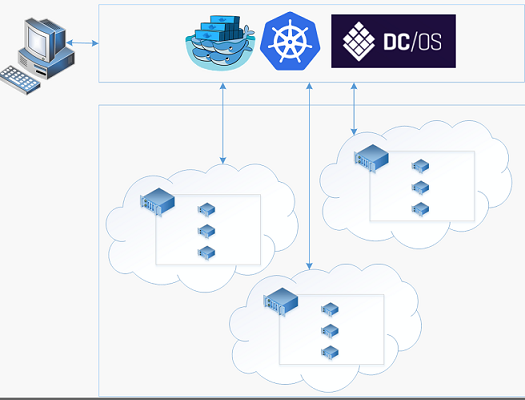
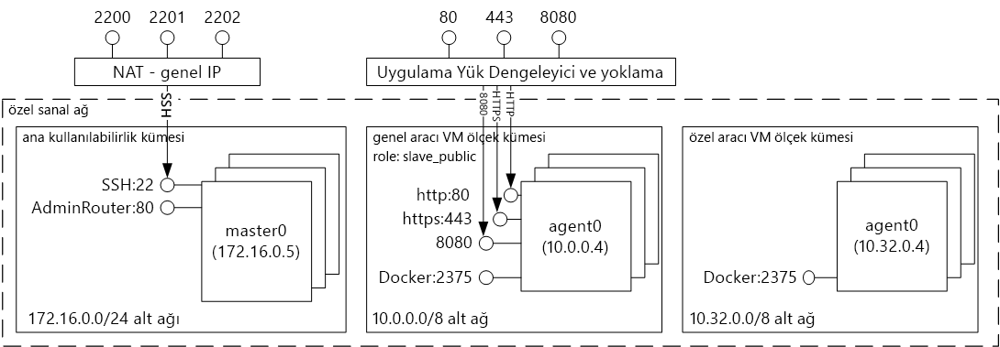
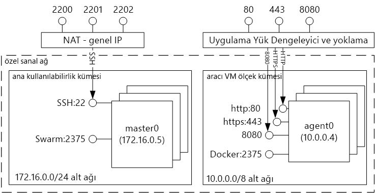

# Giriş tooDocker kapsayıcı çözümleri ile Azure kapsayıcı hizmeti barındırmaIntroduction tooDocker container hosting solutions with Azure Container Service 
Azure kapsayıcı hizmeti onu sizin için toocreate basitleştirir, yapılandırabilir ve küme sanal makinelerin kapsayıcılı önceden yapılandırılmış toorun uygulamaları yönetebilirsiniz.Azure Container Service makes it simpler for you toocreate, configure, and manage a cluster of virtual machines that are preconfigured toorun containerized applications. Bu hizmet, popüler açık kaynak planlama ve düzenleme araçlarının iyileştirilmiş yapılandırmalarını kullanır.It uses an optimized configuration of popular open-source scheduling and orchestration tools. Bu, toouse varolan yeteneklerinizi sağlar veya topluluk uzmanlık toodeploy büyük ve artan gövde çizme ve Microsoft Azure üzerinde kapsayıcı tabanlı uygulamalar yönetin.This enables you toouse your existing skills, or draw upon a large and growing body of community expertise, toodeploy and manage container-based applications on Microsoft Azure.

Azure kapsayıcı hizmeti, uygulama kapsayıcıları tümüyle taşınabilir hello Docker kapsayıcısı biçimi tooensure yararlanır.Azure Container Service leverages hello Docker container format tooensure that your application containers are fully portable. Böylece, bu uygulamaları toothousands kapsayıcıların veya hatta on binlerce ölçeklendirebilirsiniz seçiminizi Marathon ve DC/OS, Docker Swarm veya Kubernetes de destekler.It also supports your choice of Marathon and DC/OS, Docker Swarm, or Kubernetes so that you can scale these applications toothousands of containers, or even tens of thousands.

Azure kapsayıcı hizmeti kullanarak, Azure, kurumsal düzeyde özelliklerini hala taşınabilirlik adresindeki hello düzenleme katmanları dahil olmak üzere uygulama taşınabilirliği--korurken yararlanabilirsiniz.By using Azure Container Service, you can take advantage of the enterprise-grade features of Azure, while still maintaining application portability--including portability at hello orchestration layers.

## Azure Container Service’i kullanmaUsing Azure Container Service
Amacımız Azure kapsayıcı hizmeti ile tooprovide bir kapsayıcı barındırma ortamı açık kaynaklı araçları ve bugün müşterilerimizin arasında popüler teknolojileri kullanmaktır.Our goal with Azure Container Service is tooprovide a container hosting environment by using open-source tools and technologies that are popular among our customers today. toothis son biz hello standart API uç noktaları için seçilen orchestrator (DC/OS, Docker Swarm veya Kubernetes) kullanıma sunar.toothis end, we expose hello standard API endpoints for your chosen orchestrator (DC/OS, Docker Swarm, or Kubernetes). Bu uç noktalar kullanarak toothose uç noktaları Konuşmayı yeteneğine sahip herhangi bir yazılım yararlanabilirsiniz.By using these endpoints, you can leverage any software that is capable of talking toothose endpoints. Örneğin, hello Docker Swarm uç hello durumda toouse hello Docker komut satırı arabirimi (CLI) seçebilirsiniz.For example, in hello case of hello Docker Swarm endpoint, you might choose toouse hello Docker command-line interface (CLI). DC/OS için hello DCOS CLI seçebilirsiniz.For DC/OS, you might choose hello DCOS CLI. Kubernetes için `kubectl` seçeneğini belirleyebilirsiniz.For Kubernetes, you might choose `kubectl`.

## Azure Container Service’i kullanarak Docker kümesi oluşturmaCreating a Docker cluster by using Azure Container Service
Azure kapsayıcı hizmeti kullanarak toobegin hello Portalı aracılığıyla Azure kapsayıcı hizmeti kümesini dağıtma (arama hello Market için **Azure kapsayıcı hizmeti**), bir Azure Resource Manager şablonunu kullanarak ([Docker Swarm](https://github.com/Azure/azure-quickstart-templates/tree/master/101-acs-swarm), [DC/OS](https://github.com/Azure/azure-quickstart-templates/tree/master/101-acs-dcos), veya [Kubernetes](https://github.com/Azure/azure-quickstart-templates/tree/master/101-acs-kubernetes)), veya hello ile [Azure CLI 2.0](container-service-create-acs-cluster-cli.md).toobegin using Azure Container Service, you deploy an Azure Container Service cluster via hello portal (search hello Marketplace for **Azure Container Service**), by using an Azure Resource Manager template ([Docker Swarm](https://github.com/Azure/azure-quickstart-templates/tree/master/101-acs-swarm), [DC/OS](https://github.com/Azure/azure-quickstart-templates/tree/master/101-acs-dcos), or [Kubernetes](https://github.com/Azure/azure-quickstart-templates/tree/master/101-acs-kubernetes)), or with hello [Azure CLI 2.0](container-service-create-acs-cluster-cli.md). Merhaba, hızlı başlangıç şablonlarını değiştirilmiş tooinclude ek veya Gelişmiş Azure yapılandırma olabilir sağlanan.hello provided quickstart templates can be modified tooinclude additional or advanced Azure configuration. Daha fazla bilgi edinmek için bkz. [Azure Container Service kümesi dağıtma](container-service-deployment.md).For more information, see [Deploy an Azure Container Service cluster](container-service-deployment.md).

## Uygulama dağıtmaDeploying an application
Azure Container Service’te düzenleme için Docker Swarm, DC/OS veya Kubernetes seçenekleri sunulmaktadır.Azure Container Service provides a choice of Docker Swarm, DC/OS, or Kubernetes for orchestration. Uygulamanızı nasıl dağıtacağınız, düzenleme seçiminize göre değişiklik gösterir.How you deploy your application depends on your choice of orchestrator.

### DC/OS kullanmaUsing DC/OS
DC/OS hello Apache Mesos dağıtılmış sistemlerin çekirdeğini temel alan dağıtılmış bir işletim sistemi ' dir.DC/OS is a distributed operating system based on hello Apache Mesos distributed systems kernel. Apache Mesos Apache Software Foundation hello yerleştirilebilir ve bazı hello listeler [büyük adlarında BT](http://mesos.apache.org/documentation/latest/powered-by-mesos/) kullanıcılar ve katkıda bulunanlar.Apache Mesos is housed at hello Apache Software Foundation and lists some of hello [biggest names in IT](http://mesos.apache.org/documentation/latest/powered-by-mesos/) as users and contributors.

DC/OS ve Apache Mesos, etkileyici bir özellik kümesine sahiptir:DC/OS and Apache Mesos include an impressive feature set:

* Kanıtlanmış ölçeklenebilirlikProven scalability
* Apache ZooKeeper kullanan hataya dayanıklı kopyalanmış ana ve alt bileşenlerFault-tolerant replicated master and slaves using Apache ZooKeeper
* Docker biçimli kapsayıcılar için destekSupport for Docker-formatted containers
* Linux kapsayıcılarla görevler arasında yerel yalıtımNative isolation between tasks with Linux containers
* Çok kaynaklı planlama (bellek, CPU, disk ve bağlantı noktaları)Multiresource scheduling (memory, CPU, disk, and ports)
* Yeni paralel uygulamalar geliştirmek için Java, Python ve C++ API’leriJava, Python, and C++ APIs for developing new parallel applications
* Küme durumunu görüntülemek için web arabirimiA web UI for viewing cluster state

Varsayılan olarak, DC/OS Azure kapsayıcı hizmeti üzerinde çalışan iş yükleri zamanlamak için hello Marathon orchestration platform içerir.By default, DC/OS running on Azure Container Service includes hello Marathon orchestration platform for scheduling workloads. Ancak, DC/OS ACS dağıtımını hello ile Merhaba Mesosphere Universe tooyour hizmet eklenebilir hizmetleri içerir.However, included with hello DC/OS deployment of ACS is hello Mesosphere Universe of services that can be added tooyour service. Merhaba Universe Hizmetleri'nde Spark, Hadoop, Cassandra ve daha fazlasını içerir.Services in hello Universe include Spark, Hadoop, Cassandra, and much more.

#### Marathon’u kullanmaUsing Marathon
Marathon küme çapında Init ve denetim Sistem Hizmetleri cgroups--veya, Azure kapsayıcı hizmeti, Docker biçimli kapsayıcıları hello durumda olur.Marathon is a cluster-wide init and control system for services in cgroups--or, in hello case of Azure Container Service, Docker-formatted containers. Marathon’un sunduğu web arabirimini kullanarak uygulamalarınızı dağıtabilirsiniz.Marathon provides a web UI from which you can deploy your applications. Buna `http://DNS_PREFIX.REGION.cloudapp.azure.com` gibi bir URL’den erişebilirsiniz. Buradaki DNS\_PREFIX ve REGION, dağıtım sırasında tanımlanır.You can access this at a URL that looks something like `http://DNS_PREFIX.REGION.cloudapp.azure.com` where DNS\_PREFIX and REGION are both defined at deployment time. Elbette, kendi DNS adınızı da kullanabilirsiniz.Of course, you can also provide your own DNS name. Merhaba Marathon web kullanıcı arabirimini kullanarak bir kapsayıcı çalıştırma hakkında daha fazla bilgi için bkz: [DC/OS hello Marathon web kullanıcı Arabirimi aracılığıyla kapsayıcı Yönetimi](container-service-mesos-marathon-ui.md).For more information on running a container using hello Marathon web UI, see [DC/OS container management through hello Marathon web UI](container-service-mesos-marathon-ui.md).

Merhaba REST API'leri Marathon ile iletişim kurmak için de kullanabilirsiniz.You can also use hello REST APIs for communicating with Marathon. Her araç ile kullanılabilen çeşitli istemci kitaplıkları vardır.There are a number of client libraries that are available for each tool. Bunlar çeşitli dillerde--kapsar ve doğal olarak, herhangi bir dilde hello HTTP protokolünü kullanabilirsiniz.They cover a variety of languages--and, of course, you can use hello HTTP protocol in any language. Ayrıca birçok popüler DevOps aracı, Marathon desteği sunmaktadır.In addition, many popular DevOps tools provide support for Marathon. Bu sayede Azure Container Service kümesiyle çalışırken operasyon ekibiniz üst düzey esnekliğe sahip olur.This provides maximum flexibility for your operations team when you are working with an Azure Container Service cluster. Merhaba Marathon REST API kullanarak bir kapsayıcı çalıştırma hakkında daha fazla bilgi için bkz: [DC/OS hello Marathon REST API'si aracılığıyla kapsayıcı Yönetimi](container-service-mesos-marathon-rest.md).For more information on running a container by using hello Marathon REST API, see [DC/OS container management through hello Marathon REST API](container-service-mesos-marathon-rest.md).

### Docker Swarm’u kullanmaUsing Docker Swarm
Docker Swarm, Docker için yerel kümeleme imkanı sunar.Docker Swarm provides native clustering for Docker. Docker Swarm işlevlerini yaptığından standart Docker API Merhaba, Azure kapsayıcı hizmeti üzerinde Swarm tootransparently ölçek toomultiple konakları zaten Docker daemon ile iletişim kurar herhangi bir aracı kullanabilirsiniz.Because Docker Swarm serves hello standard Docker API, any tool that already communicates with a Docker daemon can use Swarm tootransparently scale toomultiple hosts on Azure Container Service.

[!INCLUDE [container-service-swarm-mode-note](../../../includes/container-service-swarm-mode-note.md)]

Bir Swarm kümesine kapsayıcıları yönetmek için desteklenen araçları arasında ancak hello şu şekilde, sınırlı değildir:Supported tools for managing containers on a Swarm cluster include, but are not limited to, hello following:

* DokkuDokku
* Docker CLI ve Docker ComposeDocker CLI and Docker Compose
* KraneKrane
* JenkinsJenkins

### Kubernetes kullanmaUsing Kubernetes
Kubernetes, popüler ve açık kaynaklı bir üretim düzeyinde kapsayıcı düzenleme aracıdır.Kubernetes is a popular open-source, production-grade container orchestrator tool. Kubernetes, kapsayıcılı uygulamaların dağıtımını, ölçeklendirmesini ve yönetimini otomatikleştirir.Kubernetes automates deployment, scaling, and management of containerized applications. Merhaba açık kaynak topluluğu tarafından yönetilir ve bir açık kaynak çözümüdür olduğundan, sorunsuz bir şekilde Azure kapsayıcı hizmeti üzerinde çalışır ve Azure kapsayıcı hizmeti ölçekte kullanılan toodeploy kapsayıcıları olabilir.Because it is an open-source solution and is driven by hello open-source community, it runs seamlessly on Azure Container Service and can be used toodeploy containers at scale on Azure Container Service.

Aşağıdaki zengin özelliklere sahiptir:It has a rich set of features including:
* Yatay ölçeklemeHorizontal scaling
* Hizmet bulma ve yük dengelemeService discovery and load balancing
* Gizli bilgiler ve yapılandırma yönetimiSecrets and configuration management
* API tabanlı otomatik piyasaya çıkarma ve geri alma işlemleriAPI-based automated rollouts and rollbacks
* Kendi kendini iyileştirmeSelf-healing

## VideolarVideos
Azure Container Service’i kullanmaya başlama (101):Getting started with Azure Container Service (101):  

> [!VIDEO https://channel9.msdn.com/Shows/Azure-Friday/Azure-Container-Service-101/player]
>
>

Yapı uygulamaları kullanarak hello Azure kapsayıcı hizmeti (Build 2016)Building Applications Using hello Azure Container Service (Build 2016)

> [!VIDEO https://channel9.msdn.com/Events/Build/2016/B822/player]
>
>

## Sonraki adımlarNext steps

Hello kullanarak bir kapsayıcı hizmeti kümesini dağıtma [portal](container-service-deployment.md) veya [Azure CLI 2.0](container-service-create-acs-cluster-cli.md).Deploy a container service cluster using hello [portal](container-service-deployment.md) or [Azure CLI 2.0](container-service-create-acs-cluster-cli.md).
