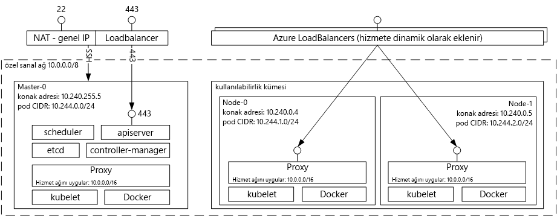

# Giriş tooDocker kapsayıcı çözümleri ile Azure kapsayıcı hizmeti barındırma 
Azure kapsayıcı hizmeti onu sizin için toocreate basitleştirir, yapılandırabilir ve küme sanal makinelerin kapsayıcılı önceden yapılandırılmış toorun uygulamaları yönetebilirsiniz. Bu hizmet, popüler açık kaynak planlama ve düzenleme araçlarının iyileştirilmiş yapılandırmalarını kullanır. Bu, toouse varolan yeteneklerinizi sağlar veya topluluk uzmanlık toodeploy büyük ve artan gövde çizme ve Microsoft Azure üzerinde kapsayıcı tabanlı uygulamalar yönetin.

Azure kapsayıcı hizmeti, uygulama kapsayıcıları tümüyle taşınabilir hello Docker kapsayıcısı biçimi tooensure yararlanır. Böylece, bu uygulamaları toothousands kapsayıcıların veya hatta on binlerce ölçeklendirebilirsiniz seçiminizi Marathon ve DC/OS, Docker Swarm veya Kubernetes de destekler.

Azure kapsayıcı hizmeti kullanarak, Azure, kurumsal düzeyde özelliklerini hala taşınabilirlik adresindeki hello düzenleme katmanları dahil olmak üzere uygulama taşınabilirliği--korurken yararlanabilirsiniz.

## Azure Container Service’i kullanma
Amacımız Azure kapsayıcı hizmeti ile tooprovide bir kapsayıcı barındırma ortamı açık kaynaklı araçları ve bugün müşterilerimizin arasında popüler teknolojileri kullanmaktır. toothis son biz hello standart API uç noktaları için seçilen orchestrator (DC/OS, Docker Swarm veya Kubernetes) kullanıma sunar. Bu uç noktalar kullanarak toothose uç noktaları Konuşmayı yeteneğine sahip herhangi bir yazılım yararlanabilirsiniz. Örneğin, hello Docker Swarm uç hello durumda toouse hello Docker komut satırı arabirimi (CLI) seçebilirsiniz. DC/OS için hello DCOS CLI seçebilirsiniz. Kubernetes için `kubectl` seçeneğini belirleyebilirsiniz.

## Azure Container Service’i kullanarak Docker kümesi oluşturma
Azure kapsayıcı hizmeti kullanarak toobegin hello Portalı aracılığıyla Azure kapsayıcı hizmeti kümesini dağıtma (arama hello Market için **Azure kapsayıcı hizmeti**), bir Azure Resource Manager şablonunu kullanarak ([Docker Swarm](https://github.com/Azure/azure-quickstart-templates/tree/master/101-acs-swarm), [DC/OS](https://github.com/Azure/azure-quickstart-templates/tree/master/101-acs-dcos), veya [Kubernetes](https://github.com/Azure/azure-quickstart-templates/tree/master/101-acs-kubernetes)), veya hello ile [Azure CLI 2.0](container-service-create-acs-cluster-cli.md). Merhaba, hızlı başlangıç şablonlarını değiştirilmiş tooinclude ek veya Gelişmiş Azure yapılandırma olabilir sağlanan. Daha fazla bilgi edinmek için bkz. [Azure Container Service kümesi dağıtma](container-service-deployment.md).

## Uygulama dağıtma
Azure Container Service’te düzenleme için Docker Swarm, DC/OS veya Kubernetes seçenekleri sunulmaktadır. Uygulamanızı nasıl dağıtacağınız, düzenleme seçiminize göre değişiklik gösterir.

### DC/OS kullanma
DC/OS hello Apache Mesos dağıtılmış sistemlerin çekirdeğini temel alan dağıtılmış bir işletim sistemi ' dir. Apache Mesos Apache Software Foundation hello yerleştirilebilir ve bazı hello listeler [büyük adlarında BT](http://mesos.apache.org/documentation/latest/powered-by-mesos/) kullanıcılar ve katkıda bulunanlar.

DC/OS ve Apache Mesos, etkileyici bir özellik kümesine sahiptir:

* Kanıtlanmış ölçeklenebilirlik
* Apache ZooKeeper kullanan hataya dayanıklı kopyalanmış ana ve alt bileşenler
* Docker biçimli kapsayıcılar için destek
* Linux kapsayıcılarla görevler arasında yerel yalıtım
* Çok kaynaklı planlama (bellek, CPU, disk ve bağlantı noktaları)
* Yeni paralel uygulamalar geliştirmek için Java, Python ve C++ API’leri
* Küme durumunu görüntülemek için web arabirimi

Varsayılan olarak, DC/OS Azure kapsayıcı hizmeti üzerinde çalışan iş yükleri zamanlamak için hello Marathon orchestration platform içerir. Ancak, DC/OS ACS dağıtımını hello ile Merhaba Mesosphere Universe tooyour hizmet eklenebilir hizmetleri içerir. Merhaba Universe Hizmetleri'nde Spark, Hadoop, Cassandra ve daha fazlasını içerir.

#### Marathon’u kullanma
Marathon küme çapında Init ve denetim Sistem Hizmetleri cgroups--veya, Azure kapsayıcı hizmeti, Docker biçimli kapsayıcıları hello durumda olur. Marathon’un sunduğu web arabirimini kullanarak uygulamalarınızı dağıtabilirsiniz. Buna `http://DNS_PREFIX.REGION.cloudapp.azure.com` gibi bir URL’den erişebilirsiniz. Buradaki DNS\_PREFIX ve REGION, dağıtım sırasında tanımlanır. Elbette, kendi DNS adınızı da kullanabilirsiniz. Merhaba Marathon web kullanıcı arabirimini kullanarak bir kapsayıcı çalıştırma hakkında daha fazla bilgi için bkz: [DC/OS hello Marathon web kullanıcı Arabirimi aracılığıyla kapsayıcı Yönetimi](container-service-mesos-marathon-ui.md).

Merhaba REST API'leri Marathon ile iletişim kurmak için de kullanabilirsiniz. Her araç ile kullanılabilen çeşitli istemci kitaplıkları vardır. Bunlar çeşitli dillerde--kapsar ve doğal olarak, herhangi bir dilde hello HTTP protokolünü kullanabilirsiniz. Ayrıca birçok popüler DevOps aracı, Marathon desteği sunmaktadır. Bu sayede Azure Container Service kümesiyle çalışırken operasyon ekibiniz üst düzey esnekliğe sahip olur. Merhaba Marathon REST API kullanarak bir kapsayıcı çalıştırma hakkında daha fazla bilgi için bkz: [DC/OS hello Marathon REST API'si aracılığıyla kapsayıcı Yönetimi](container-service-mesos-marathon-rest.md).

### Docker Swarm’u kullanma
Docker Swarm, Docker için yerel kümeleme imkanı sunar. Docker Swarm işlevlerini yaptığından standart Docker API Merhaba, Azure kapsayıcı hizmeti üzerinde Swarm tootransparently ölçek toomultiple konakları zaten Docker daemon ile iletişim kurar herhangi bir aracı kullanabilirsiniz.

[!INCLUDE [container-service-swarm-mode-note](../../../includes/container-service-swarm-mode-note.md)]

Bir Swarm kümesine kapsayıcıları yönetmek için desteklenen araçları arasında ancak hello şu şekilde, sınırlı değildir:

* Dokku
* Docker CLI ve Docker Compose
* Krane
* Jenkins

### Kubernetes kullanma
Kubernetes, popüler ve açık kaynaklı bir üretim düzeyinde kapsayıcı düzenleme aracıdır. Kubernetes, kapsayıcılı uygulamaların dağıtımını, ölçeklendirmesini ve yönetimini otomatikleştirir. Merhaba açık kaynak topluluğu tarafından yönetilir ve bir açık kaynak çözümüdür olduğundan, sorunsuz bir şekilde Azure kapsayıcı hizmeti üzerinde çalışır ve Azure kapsayıcı hizmeti ölçekte kullanılan toodeploy kapsayıcıları olabilir.

Aşağıdaki zengin özelliklere sahiptir:
* Yatay ölçekleme
* Hizmet bulma ve yük dengeleme
* Gizli bilgiler ve yapılandırma yönetimi
* API tabanlı otomatik piyasaya çıkarma ve geri alma işlemleri
* Kendi kendini iyileştirme

## Videolar
Azure Container Service’i kullanmaya başlama (101):  

> [!VIDEO https://channel9.msdn.com/Shows/Azure-Friday/Azure-Container-Service-101/player]
>
>

Yapı uygulamaları kullanarak hello Azure kapsayıcı hizmeti (Build 2016)

> [!VIDEO https://channel9.msdn.com/Events/Build/2016/B822/player]
>
>

## Sonraki adımlar

Hello kullanarak bir kapsayıcı hizmeti kümesini dağıtma [portal](container-service-deployment.md) veya [Azure CLI 2.0](container-service-create-acs-cluster-cli.md).
