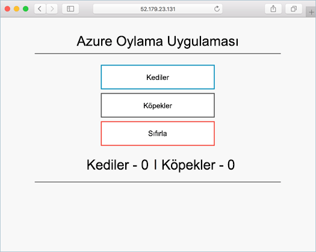

# <a name="deploy-docker-swarm-cluster"></a>Docker Swarm kümesi dağıtma

Bu Hızlı Başlangıç, Docker Swarm kümesi hello Azure CLI kullanarak dağıtılır. Web ön uç ve bir Redis örneği oluşan çok kapsayıcı uygulama sonra dağıtılan ve hello kümede çalıştırın. Tamamlandığında, Merhaba uygulaması üzerinden erişilebilen Internet hello.

Azure aboneliğiniz yoksa başlamadan önce [ücretsiz bir hesap](https://azure.microsoft.com/free/?WT.mc_id=A261C142F) oluşturun.

Bu hızlı başlangıç hello Azure CLI Sürüm 2.0.4 çalıştırdığınız gerektirir veya sonraki bir sürümü. Çalıştırma `az --version` toofind hello sürümü. Tooinstall veya yükseltme gerekirse bkz [Azure CLI 2.0 yükleme]( /cli/azure/install-azure-cli).

## <a name="create-a-resource-group"></a>Kaynak grubu oluşturma

Bir kaynak grubu ile Merhaba oluşturmak [az grubu oluşturma](/cli/azure/group#create) komutu. Azure kaynak grubu, Azure kaynaklarının dağıtıldığı ve yönetildiği mantıksal bir gruptur.

Merhaba aşağıdaki örnekte oluşturur adlı bir kaynak grubu *myResourceGroup* hello içinde *westus* konumu.

```azurecli-interactive
az group create --name myResourceGroup --location westus
```

Çıktı:

```json
{
  "id": "/subscriptions/00000000-0000-0000-0000-000000000000/resourceGroups/myResourceGroup",
  "location": "westcentralus",
  "managedBy": null,
  "name": "myResourceGroup",
  "properties": {
    "provisioningState": "Succeeded"
  },
  "tags": null
}
```

## <a name="create-docker-swarm-cluster"></a>Docker Swarm kümesi oluşturma

Docker Swarm kümesi Azure kapsayıcı hizmeti ile Merhaba oluşturma [az acs oluşturmak](/cli/azure/acs#create) komutu. 

Merhaba aşağıdaki örnek adlı bir küme oluşturur *mySwarmCluster* ile bir Linux ana düğümü ve üç Linux Aracısı düğümleri.

```azurecli-interactive
az acs create --name mySwarmCluster --orchestrator-type Swarm --resource-group myResourceGroup --generate-ssh-keys
```

Birkaç dakika sonra hello komut tamamlandıktan ve biçimlendirilmiş json hello kümesi hakkında bilgi verir.

## <a name="connect-toohello-cluster"></a>Toohello kümesine bağlanın

Bu hızlı başlangıç hello Docker Swarm ana ve hello Docker aracı havuzu başlangıç IP adresi gerekiyor. Çalışma hello şu iki IP adresi tooreturn komutu.


```bash
az network public-ip list --resource-group myResourceGroup --query '[*].{Name:name,IPAddress:ipAddress}' -o table
```

Çıktı:

```bash
Name                                                                 IPAddress
-------------------------------------------------------------------  -------------
swarmm-agent-ip-myswarmcluster-myresourcegroup-d5b9d4agent-66066781  52.179.23.131
swarmm-master-ip-myswarmcluster-myresourcegroup-d5b9d4mgmt-66066781  52.141.37.199
```

Bir SSH tünel toohello Swarm şablonu oluşturun. Değiştir `IPAddress` hello Swarm yöneticisinin hello IP adresine sahip.

```bash
ssh -p 2200 -fNL 2375:localhost:2375 azureuser@IPAddress
```

Set hello `DOCKER_HOST` ortam değişkeni. Bu işlem, toospecify hello hello ana bilgisayar adını gerek kalmadan hello Docker Swarm karşı toorun docker komutları sağlar.

```bash
export DOCKER_HOST=:2375
```

Merhaba Docker Swarm hazır toorun Docker hizmetlerini sunulmuştur.


## <a name="run-hello-application"></a>Merhaba uygulamayı çalıştırın

Adlı bir dosya oluşturun `docker-compose.yaml` ve kopyalama hello aşağıdaki içerik içine.

```yaml
version: '3'
services:
  azure-vote-back:
    image: redis
    container_name: azure-vote-back
    ports:
        - "6379:6379"

  azure-vote-front:
    image: microsoft/azure-vote-front:redis-v1
    container_name: azure-vote-front
    environment:
      REDIS: azure-vote-back
    ports:
        - "80:80"
```

Komut toocreate hello Azure oy hizmeti aşağıdaki hello çalıştırın.

```bash
docker-compose up -d
```

Çıktı:

```bash
Creating network "user_default" with hello default driver
Pulling azure-vote-front (microsoft/azure-vote-front:redis-v1)...
swarm-agent-EE873B23000005: Pulling microsoft/azure-vote-front:redis-v1...
swarm-agent-EE873B23000004: Pulling microsoft/azure-vote-front:redis-v1... : downloaded
Pulling azure-vote-back (redis:latest)...
swarm-agent-EE873B23000004: Pulling redis:latest... : downloaded
Creating azure-vote-front ... 
Creating azure-vote-back ... 
Creating azure-vote-front
Creating azure-vote-back ...
```

## <a name="test-hello-application"></a>Merhaba uygulamayı test etme

Merhaba Swarm aracı havuzu tootest Merhaba Azure oylama uygulaması çıkışı toohello IP adresine göz atın.



## <a name="delete-cluster"></a>Kümeyi silme
Merhaba küme artık gerekli olmadığında hello kullanabilirsiniz [az grubu Sil](/cli/azure/group#delete) tooremove hello kaynak grubu, kapsayıcı hizmeti ve ilgili tüm kaynakları komutu.

```azurecli-interactive
az group delete --name myResourceGroup --yes --no-wait
```

## <a name="get-hello-code"></a>Merhaba kod alın

Bu Hızlı Başlangıç, önceden oluşturulmuş kapsayıcı görüntüleri kullanılan toocreate Docker hizmet olmuştur. uygulama kodu, Dockerfile, Hello ilgili ve oluşturma dosya Github'da bulunmaktadır.

[https://github.com/Azure-Samples/azure-voting-app-redis](https://github.com/Azure-Samples/azure-voting-app-redis.git)

## <a name="next-steps"></a>Sonraki adımlar

Bu Hızlı Başlangıç, Docker Swarm kümesi dağıtılan ve çok kapsayıcı uygulama tooit dağıtılır.

Docker sıcak Visual Studio Team Services ile tümleştirme hakkında toolearn toohello CI/CD Docker Swarm ve VSTS ile devam edin.

> [!div class="nextstepaction"]
> [Docker Swarm ve VSTS ile CI/CD](./container-service-docker-swarm-setup-ci-cd.md)