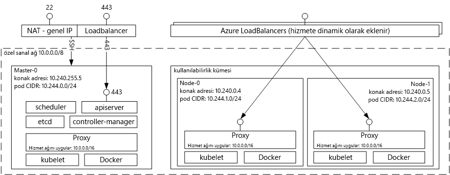

# Giriş tooAzure Kubernetes için kapsayıcı hizmeti
Azure kapsayıcı hizmeti Kubernetes için basit toocreate kolaylaştırır, yapılandırabilir ve küme sanal makinelerin kapsayıcılı önceden yapılandırılmış toorun uygulamaları yönetebilirsiniz. Bu, toouse varolan yeteneklerinizi sağlar veya topluluk uzmanlık toodeploy büyük ve artan gövde çizme ve Microsoft Azure üzerinde kapsayıcı tabanlı uygulamalar yönetin.

Azure kapsayıcı hizmeti kullanarak, hello Azure, kurumsal düzeyde özelliklerini hala Kubernetes aracılığıyla uygulama taşınabilirliği korurken yararlanmak ve Docker görüntü biçimi hello.

## Kubernetes için Azure Container Service’i Kullanma
Amacımız Azure kapsayıcı hizmeti ile tooprovide bir kapsayıcı barındırma ortamı açık kaynaklı araçları ve bugün müşterilerimizin arasında popüler teknolojileri kullanmaktır. toothis son biz hello standart Kubernetes API uç noktalarını kullanıma sunar. Bu standart uç noktaları kullanarak tooa Kubernetes küme Konuşmayı yeteneğine sahip herhangi bir yazılım yararlanabilirsiniz. Örneğin [kubectl](https://kubernetes.io/docs/user-guide/kubectl-overview/), [helm](https://helm.sh/) veya [draft](https://github.com/Azure/draft) arasından seçim yapabilirsiniz.

## Azure Container Service kullanan bir Kubernetes kümesi oluşturma
Azure kapsayıcı hizmeti kullanarak toobegin hello ile Azure kapsayıcı hizmeti kümesini dağıtma [Azure CLI 2.0](container-service-kubernetes-walkthrough.md) veya hello Portalı aracılığıyla (arama hello Market için **Azure kapsayıcı hizmeti**). Hello Azure Resource Manager şablonları hakkında daha fazla denetime gereksinim duyan İleri düzey bir kullanıcı varsa, hello açık kaynak kullanabilirsiniz [acs altyapısı](https://github.com/Azure/acs-engine) proje toobuild kendi özel Kubernetes küme ve hello dağıtma `az` CLI.

### Kubernetes kullanma
Kubernetes, kapsayıcılı uygulamaların dağıtımını, ölçeklendirmesini ve yönetimini otomatikleştirir. Aşağıdaki zengin özelliklere sahiptir:
* Otomatik bin paketleme
* Kendi kendini iyileştirme
* Yatay ölçekleme
* Hizmet bulma ve yük dengeleme
* Otomatik piyasaya çıkarma ve geri alma işlemleri
* Gizli dizi ve yapılandırma yönetimi
* Depolama düzenleme
* Toplu iş yürütme

Azure Container Service aracılığıyla dağıtılan Kubernetes mimari diyagramı:

## Videolar

Azure Container Services'daki Kubernetes Desteği (Azure Friday, Ocak 2017):

> [!VIDEO https://channel9.msdn.com/Shows/Azure-Friday/Kubernetes-Support-in-Azure-Container-Services/player]
>
>

Kubernetes’te Uygulama Geliştirme ve Dağıtma Araçları (Azure OpenDev, Haziran 2017):

> [!VIDEO https://channel9.msdn.com/Events/AzureOpenDev/June2017/Tools-for-Developing-and-Deploying-Applications-on-Kubernetes/player]
>
>

## Sonraki adımlar

Merhaba keşfedin [Kubernetes Quickstart](container-service-kubernetes-walkthrough.md) Azure kapsayıcı hizmeti bugün keşfetme toobegin.
