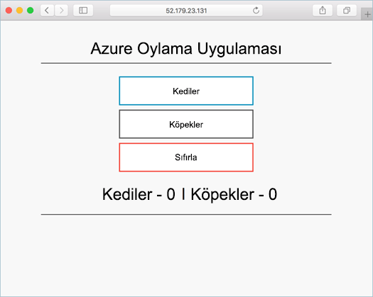

# <a name="run-applications-in-kubernetes"></a>Kubernetes çalışma uygulamaları

Bu öğreticide yedi dördünü kısım, örnek bir uygulama Kubernetes kümesine dağıtılır. Tamamlanan adımları içerir:

> [!div class="checklist"]
> * Kubernetes bildirim dosyaları indirme
> * Kubernetes Çalıştırma uygulaması
> * Uygulamayı test etme

Sonraki öğreticilerde, bu uygulama, güncelleştirilmiş, ölçeklenir ve Kubernetes küme izlemek için Operations Management Suite yapılandırılır.

Bu öğretici Kubernetes kavramlar, Kubernetes bakın hakkında ayrıntılı bilgi için temel bir anlayış varsayar [Kubernetes belgelerine](https://kubernetes.io/docs/home/).

## <a name="before-you-begin"></a>Başlamadan önce

Önceki öğreticileri, bir uygulama bir kapsayıcı görüntüsüne paketlenmiş ve bu görüntüyü Azure kapsayıcı kayıt defterine karşıya Kubernetes küme oluşturuldu. Bu adımları yapmadıysanız ve izlemek istediğiniz, geri dönüp [Öğreticisi 1 – Oluştur kapsayıcı görüntüleri](./container-service-tutorial-kubernetes-prepare-app.md). 

En azından, Bu öğretici Kubernetes kümesi gerektirir.

## <a name="get-manifest-file"></a>Bildirim dosyası al

Bu öğretici için [Kubernetes nesneleri](https://kubernetes.io/docs/concepts/overview/working-with-objects/kubernetes-objects/) Kubernetes bildirimi kullanılarak dağıtılır. Kubernetes bildirim Kubernetes nesne dağıtım ve yapılandırma yönergeleri içeren bir YAML veya JSON biçimli dosyasıdır.

Bu öğretici için uygulama bildirim dosyasının önceki öğreticide kopyalandı Azure oy uygulama depodaki kullanılabilir. Zaten yapmadıysanız, aşağıdaki komutla depoyu kopyalama: 

```bash
git clone https://github.com/Azure-Samples/azure-voting-app-redis.git
```

Bildirim dosyası kopyalanan depoyu şu dizinde bulunur.

```bash
/azure-voting-app-redis/kubernetes-manifests/azure-vote-all-in-one-redis.yml
```

## <a name="update-manifest-file"></a>Güncelleştirme bildirim dosyası

Azure kapsayıcı kayıt defteri kapsayıcı görüntüleri depolamak için kullanıyorsanız, bildirim ACR loginServer adıyla güncelleştirilmesi gerekiyor.

ACR oturum açma sunucu adıyla alma [az acr listesi](/cli/azure/acr#list) komutu.

```azurecli-interactive
az acr list --resource-group myResourceGroup --query "[].{acrLoginServer:loginServer}" --output table
```

Örnek bildirimi bir havuz adı ile önceden oluşturulmuş *microsoft*. Dosyayı ile herhangi bir metin düzenleyicisinde açın ve değiştirme *microsoft* ACR örneğinizi oturum açma sunucu adı değeri.

```yaml
containers:
- name: azure-vote-front
  image: microsoft/azure-vote-front:redis-v1
```

## <a name="deploy-application"></a>Uygulama dağıtma

Uygulamayı çalıştırmak için [kubectl create](https://kubernetes.io/docs/user-guide/kubectl/v1.6/#create) komutunu kullanın. Bu komut, bildirim dosyası ayrıştırır ve tanımlanmış Kubernetes nesneleri oluşturma.

```azurecli-interactive
kubectl create -f ./azure-voting-app-redis/kubernetes-manifests/azure-vote-all-in-one-redis.yml
```

Çıktı:

```bash
deployment "azure-vote-back" created
service "azure-vote-back" created
deployment "azure-vote-front" created
service "azure-vote-front" created
```

## <a name="test-application"></a>Uygulamayı test etme

A [Kubernetes hizmet](https://kubernetes.io/docs/concepts/services-networking/service/) hangi uygulamanın Internet'e gösterir oluşturulur. Bu işlem birkaç dakika sürebilir. 

İlerleme durumunu izlemek için [kubectl get service](https://review.docs.microsoft.com/en-us/azure/container-service/container-service-kubernetes-walkthrough?branch=pr-en-us-17681) komutunu `--watch` bağımsız değişkeniyle birlikte kullanın.

```azurecli-interactive
kubectl get service azure-vote-front --watch
```

Başlangıçta, **dış IP** için *azure oy ön* hizmeti görünür olarak *bekleyen*. EXTERNAL-IP adresi *pending* durumundan *IP address* değerine değiştiğinde kubectl izleme işlemini durdurmak için `CTRL-C` komutunu kullanın.

```bash
NAME               CLUSTER-IP    EXTERNAL-IP   PORT(S)        AGE
azure-vote-front   10.0.42.158   <pending>     80:31873/TCP   1m
azure-vote-front   10.0.42.158   52.179.23.131 80:31873/TCP   2m
```

Uygulama görmek için dış IP adresine göz atın.



## <a name="next-steps"></a>Sonraki adımlar

Bu öğreticide, Azure oy uygulama için bir Azure kapsayıcı hizmeti Kubernetes kümesi dağıtıldı. Tamamlanan görevler aşağıdakileri içerir:  

> [!div class="checklist"]
> * Kubernetes bildirim dosyaları indirme
> * İçinde Kubernetes uygulamayı çalıştırın
> * Uygulamayı test

Kubernetes uygulama ve Kubernetes altyapının ölçeklendirme hakkında bilgi edinmek için sonraki öğretici ilerleyin. 

> [!div class="nextstepaction"]
> [Ölçek Kubernetes uygulama ve altyapı](./container-service-tutorial-kubernetes-scale.md)