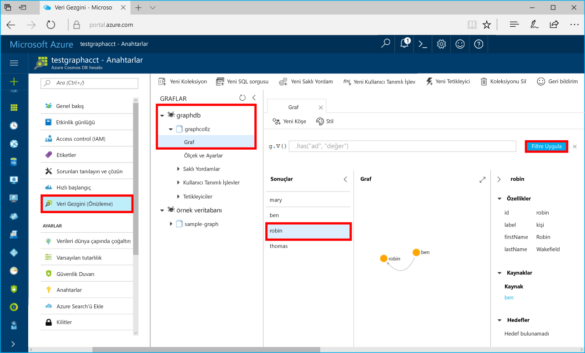

# <a name="azure-cosmos-db-build-a-net-application-using-hello-graph-api"></a><span data-ttu-id="d10ab-103">Azure Cosmos DB: hello grafik API'sini kullanarak bir .NET uygulaması oluşturma</span><span class="sxs-lookup"><span data-stu-id="d10ab-103">Azure Cosmos DB: Build a .NET application using hello Graph API</span></span>

<span data-ttu-id="d10ab-104">Azure Cosmos DB, Microsoft'un genel olarak dağıtılmış çok modelli veritabanı hizmetidir.</span><span class="sxs-lookup"><span data-stu-id="d10ab-104">Azure Cosmos DB is Microsoft’s globally distributed multi-model database service.</span></span> <span data-ttu-id="d10ab-105">Hızlı bir şekilde oluşturmak ve belge, anahtar/değer ve grafik veritabanları, her biri hello genel dağıtım ve yatay ölçek özelliklerini Azure Cosmos DB'nin hello çekirdek yararlı sorgulayabilirsiniz.</span><span class="sxs-lookup"><span data-stu-id="d10ab-105">You can quickly create and query document, key/value, and graph databases, all of which benefit from hello global distribution and horizontal scale capabilities at hello core of Azure Cosmos DB.</span></span> 

<span data-ttu-id="d10ab-106">Bu hızlı başlangıç nasıl toocreate bir Azure Cosmos DB hesap, veritabanı ve grafik (kapsayıcı) kullanarak Azure portalında hello gösterir.</span><span class="sxs-lookup"><span data-stu-id="d10ab-106">This quick start demonstrates how toocreate an Azure Cosmos DB account, database, and graph (container) using hello Azure portal.</span></span> <span data-ttu-id="d10ab-107">Ardından derlemeyi ve çalıştırmayı hello üzerinde oluşturulmuş bir konsol uygulaması [grafik API'si](graph-sdk-dotnet.md) (Önizleme).</span><span class="sxs-lookup"><span data-stu-id="d10ab-107">You then build and run a console app built on hello [Graph API](graph-sdk-dotnet.md) (preview).</span></span>  

## <a name="prerequisites"></a><span data-ttu-id="d10ab-108">Ön koşullar</span><span class="sxs-lookup"><span data-stu-id="d10ab-108">Prerequisites</span></span>

<span data-ttu-id="d10ab-109">Visual Studio yüklü 2017 zaten sahip değilseniz, indirin ve hello kullan **ücretsiz** [Visual Studio 2017 Community Edition](https://www.visualstudio.com/downloads/).</span><span class="sxs-lookup"><span data-stu-id="d10ab-109">If you don’t already have Visual Studio 2017 installed, you can download and use hello **free** [Visual Studio 2017 Community Edition](https://www.visualstudio.com/downloads/).</span></span> <span data-ttu-id="d10ab-110">Etkinleştirdiğinizden emin olun **Azure geliştirme** hello Visual Studio Kurulumu sırasında.</span><span class="sxs-lookup"><span data-stu-id="d10ab-110">Make sure that you enable **Azure development** during hello Visual Studio setup.</span></span>

[!INCLUDE [quickstarts-free-trial-note](../../includes/quickstarts-free-trial-note.md)]

## <a name="create-a-database-account"></a><span data-ttu-id="d10ab-111">Veritabanı hesabı oluşturma</span><span class="sxs-lookup"><span data-stu-id="d10ab-111">Create a database account</span></span>

[!INCLUDE [cosmos-db-create-dbaccount-graph](../../includes/cosmos-db-create-dbaccount-graph.md)]

## <a name="add-a-graph"></a><span data-ttu-id="d10ab-112">Grafik ekleme</span><span class="sxs-lookup"><span data-stu-id="d10ab-112">Add a graph</span></span>

[!INCLUDE [cosmos-db-create-graph](../../includes/cosmos-db-create-graph.md)]

## <a name="clone-hello-sample-application"></a><span data-ttu-id="d10ab-113">Merhaba örnek uygulaması kopyalama</span><span class="sxs-lookup"><span data-stu-id="d10ab-113">Clone hello sample application</span></span>

<span data-ttu-id="d10ab-114">Artık şimdi kopya grafik API'si uygulama github'dan hello bağlantı dizesini ayarlamak ve çalıştırın.</span><span class="sxs-lookup"><span data-stu-id="d10ab-114">Now let's clone a Graph API app from github, set hello connection string, and run it.</span></span> <span data-ttu-id="d10ab-115">Ne kadar kolay toowork verilerle program aracılığıyla olduğunu görürsünüz.</span><span class="sxs-lookup"><span data-stu-id="d10ab-115">You'll see how easy it is toowork with data programmatically.</span></span> 

1. <span data-ttu-id="d10ab-116">Git bash gibi bir git terminal penceresi açın ve `cd` tooa çalışma dizini.</span><span class="sxs-lookup"><span data-stu-id="d10ab-116">Open a git terminal window, such as git bash, and `cd` tooa working directory.</span></span>  

2. <span data-ttu-id="d10ab-117">Çalışma hello aşağıdaki tooclone hello örnek depo komutu.</span><span class="sxs-lookup"><span data-stu-id="d10ab-117">Run hello following command tooclone hello sample repository.</span></span> 

    ```bash
    git clone https://github.com/Azure-Samples/azure-cosmos-db-graph-dotnet-getting-started.git
    ```

3. <span data-ttu-id="d10ab-118">Ardından Visual Studio ve açık hello çözüm dosyasını açın.</span><span class="sxs-lookup"><span data-stu-id="d10ab-118">Then open Visual Studio and open hello solution file.</span></span> 

## <a name="review-hello-code"></a><span data-ttu-id="d10ab-119">Merhaba kod gözden geçirme</span><span class="sxs-lookup"><span data-stu-id="d10ab-119">Review hello code</span></span>

<span data-ttu-id="d10ab-120">Neler olduğuna dair hello uygulamada hızlı bir gözden geçirme olalım.</span><span class="sxs-lookup"><span data-stu-id="d10ab-120">Let's make a quick review of what's happening in hello app.</span></span> <span data-ttu-id="d10ab-121">Bu kod satırları hello Azure Cosmos DB kaynakları oluşturun, açık hello Program.cs dosyasının ve bulabilirsiniz.</span><span class="sxs-lookup"><span data-stu-id="d10ab-121">Open hello Program.cs file and you'll find that these lines of code create hello Azure Cosmos DB resources.</span></span> 

* <span data-ttu-id="d10ab-122">Merhaba DocumentClient başlatılır.</span><span class="sxs-lookup"><span data-stu-id="d10ab-122">hello DocumentClient is initialized.</span></span> <span data-ttu-id="d10ab-123">Merhaba önizlemede hello Azure Cosmos DB istemcide bir grafik uzantısı API eklediğimiz.</span><span class="sxs-lookup"><span data-stu-id="d10ab-123">In hello preview, we added a graph extension API on hello Azure Cosmos DB client.</span></span> <span data-ttu-id="d10ab-124">Hello Azure Cosmos DB istemci ve kaynakları ayrılmış bir tek başına grafik istemci üzerinde çalışıyoruz.</span><span class="sxs-lookup"><span data-stu-id="d10ab-124">We are working on a standalone graph client decoupled from hello Azure Cosmos DB client and resources.</span></span>

    ```csharp
    using (DocumentClient client = new DocumentClient(
        new Uri(endpoint),
        authKey,
        new ConnectionPolicy { ConnectionMode = ConnectionMode.Direct, ConnectionProtocol = Protocol.Tcp }))
    ```

* <span data-ttu-id="d10ab-125">Yeni bir veritabanı oluşturulur.</span><span class="sxs-lookup"><span data-stu-id="d10ab-125">A new database is created.</span></span>

    ```csharp
    Database database = await client.CreateDatabaseIfNotExistsAsync(new Database { Id = "graphdb" });
    ```

* <span data-ttu-id="d10ab-126">Yeni bir grafik oluşturulur.</span><span class="sxs-lookup"><span data-stu-id="d10ab-126">A new graph is created.</span></span>

    ```csharp
    DocumentCollection graph = await client.CreateDocumentCollectionIfNotExistsAsync(
        UriFactory.CreateDatabaseUri("graphdb"),
        new DocumentCollection { Id = "graph" },
        new RequestOptions { OfferThroughput = 1000 });
    ```
* <span data-ttu-id="d10ab-127">Bir dizi Gremlin adımı hello kullanarak yürütülme `CreateGremlinQuery` yöntemi.</span><span class="sxs-lookup"><span data-stu-id="d10ab-127">A series of Gremlin steps are executed using hello `CreateGremlinQuery` method.</span></span>

    ```csharp
    // hello CreateGremlinQuery method extensions allow you tooexecute Gremlin queries and iterate
    // results asychronously
    IDocumentQuery<dynamic> query = client.CreateGremlinQuery<dynamic>(graph, "g.V().count()");
    while (query.HasMoreResults)
    {
        foreach (dynamic result in await query.ExecuteNextAsync())
        {
            Console.WriteLine($"\t {JsonConvert.SerializeObject(result)}");
        }
    }

    ```

## <a name="update-your-connection-string"></a><span data-ttu-id="d10ab-128">Bağlantı dizenizi güncelleştirme</span><span class="sxs-lookup"><span data-stu-id="d10ab-128">Update your connection string</span></span>

<span data-ttu-id="d10ab-129">Şimdi Azure portal tooget toohello bağlantı dizesi bilgilerinizi geri dönün ve hello uygulamaya kopyalayın.</span><span class="sxs-lookup"><span data-stu-id="d10ab-129">Now go back toohello Azure portal tooget your connection string information and copy it into hello app.</span></span>

1. <span data-ttu-id="d10ab-130">Visual Studio 2017 içinde hello App.config dosyasını açın.</span><span class="sxs-lookup"><span data-stu-id="d10ab-130">In Visual Studio 2017, open hello App.config file.</span></span> 

2. <span data-ttu-id="d10ab-131">Hello Azure Cosmos DB hesabınızdaki Azure portal'ı tıklatın **anahtarları** sol gezinti hello içinde.</span><span class="sxs-lookup"><span data-stu-id="d10ab-131">In hello Azure portal, in your Azure Cosmos DB account, click **Keys** in hello left navigation.</span></span> 

    

3. <span data-ttu-id="d10ab-133">Kopyalama, **URI** değer hello portalından ve hale hello App.config hello uç nokta anahtar değeri. Ekran görüntüsü toocopy hello değeri önceki hello gösterildiği gibi hello Kopyala düğmesini kullanabilirsiniz.</span><span class="sxs-lookup"><span data-stu-id="d10ab-133">Copy your **URI** value from hello portal and make it hello value of hello Endpoint key in App.config. You can use hello copy button as shown in hello preceding screenshot toocopy hello value.</span></span>

    `<add key="Endpoint" value="https://FILLME.documents.azure.com:443" />`

4. <span data-ttu-id="d10ab-134">Kopyalama, **birincil anahtar** değer hello portalından ve hale hello App.Config'de hello AuthKey anahtarının değerini sonra yaptığınız değişiklikleri kaydedin.</span><span class="sxs-lookup"><span data-stu-id="d10ab-134">Copy your **PRIMARY KEY** value from hello portal, and make it hello value of hello AuthKey key in App.config, then save your changes.</span></span> 

    `<add key="AuthKey" value="FILLME" />`

<span data-ttu-id="d10ab-135">Uygulamanızı şimdi güncelleştirdikten toocommunicate Azure Cosmos DB ile gerekli tüm hello bilgilerine sahip.</span><span class="sxs-lookup"><span data-stu-id="d10ab-135">You've now updated your app with all hello info it needs toocommunicate with Azure Cosmos DB.</span></span> 

## <a name="run-hello-console-app"></a><span data-ttu-id="d10ab-136">Merhaba konsol uygulamasını çalıştırın</span><span class="sxs-lookup"><span data-stu-id="d10ab-136">Run hello console app</span></span>

1. <span data-ttu-id="d10ab-137">Visual Studio'da hello üzerinde sağ **GraphGetStarted** proje **Çözüm Gezgini** ve ardından **NuGet paketlerini Yönet**.</span><span class="sxs-lookup"><span data-stu-id="d10ab-137">In Visual Studio, right-click on hello **GraphGetStarted** project in **Solution Explorer** and then click **Manage NuGet Packages**.</span></span> 

2. <span data-ttu-id="d10ab-138">Merhaba NuGet içinde **Gözat** kutusuna *Microsoft.Azure.Graphs* ve hello denetleyin **içeren yayın öncesi** kutusu.</span><span class="sxs-lookup"><span data-stu-id="d10ab-138">In hello NuGet **Browse** box, type *Microsoft.Azure.Graphs* and check hello **Includes prerelease** box.</span></span> 

3. <span data-ttu-id="d10ab-139">Merhaba sonuçlarından hello yüklemek **Microsoft.Azure.Graphs** kitaplığı.</span><span class="sxs-lookup"><span data-stu-id="d10ab-139">From hello results, install hello **Microsoft.Azure.Graphs** library.</span></span> <span data-ttu-id="d10ab-140">Bu, hello Azure Cosmos DB grafik uzantısı kitaplık paketi ve tüm bağımlılıkları yükler.</span><span class="sxs-lookup"><span data-stu-id="d10ab-140">This installs hello Azure Cosmos DB graph extension library package and all dependencies.</span></span>

    <span data-ttu-id="d10ab-141">Değişiklikleri toohello çözümü gözden geçirme hakkında bir ileti alırsanız tıklatın **Tamam**.</span><span class="sxs-lookup"><span data-stu-id="d10ab-141">If you get a message about reviewing changes toohello solution, click **OK**.</span></span> <span data-ttu-id="d10ab-142">Lisans kabulü hakkında bir ileti alırsanız **Kabul ediyorum**'a tıklayın.</span><span class="sxs-lookup"><span data-stu-id="d10ab-142">If you get a message about license acceptance, click **I accept**.</span></span>

4. <span data-ttu-id="d10ab-143">CTRL + F5'e tıklayın toorun Merhaba uygulaması.</span><span class="sxs-lookup"><span data-stu-id="d10ab-143">Click CTRL + F5 toorun hello application.</span></span>

   <span data-ttu-id="d10ab-144">Merhaba konsol penceresinde hello köşeleri ve toohello grafik eklenmekte olan kenarları görüntüler.</span><span class="sxs-lookup"><span data-stu-id="d10ab-144">hello console window displays hello vertexes and edges being added toohello graph.</span></span> <span data-ttu-id="d10ab-145">Merhaba betik tamamlandığında, ENTER tuşuna iki kez tooclose hello konsol penceresi.</span><span class="sxs-lookup"><span data-stu-id="d10ab-145">When hello script completes, press ENTER twice tooclose hello console window.</span></span> 

## <a name="browse-using-hello-data-explorer"></a><span data-ttu-id="d10ab-146">Merhaba Veri Gezgini'ni kullanarak Gözat</span><span class="sxs-lookup"><span data-stu-id="d10ab-146">Browse using hello Data Explorer</span></span>

<span data-ttu-id="d10ab-147">Şimdi tooData Explorer hello Azure portal, geri dönün ve da göz atın ve yeni grafik verileri sorgulayabilirsiniz.</span><span class="sxs-lookup"><span data-stu-id="d10ab-147">You can now go back tooData Explorer in hello Azure portal and browse and query your new graph data.</span></span>

1. <span data-ttu-id="d10ab-148">Veri Gezgini'nde hello yeni veritabanı hello grafikleri bölmesinde görüntülenir.</span><span class="sxs-lookup"><span data-stu-id="d10ab-148">In Data Explorer, hello new database appears in hello Graphs pane.</span></span> <span data-ttu-id="d10ab-149">**graphdb**, **graphcollz** öğelerini genişletip **Grafik** öğesine tıklayın.</span><span class="sxs-lookup"><span data-stu-id="d10ab-149">Expand **graphdb**, **graphcollz**, and then click **Graph**.</span></span>

2. <span data-ttu-id="d10ab-150">Merhaba tıklatın **Filtre Uygula** düğmesini toouse hello varsayılan sorgu tooview hello Grafikteki tüm hello verticies.</span><span class="sxs-lookup"><span data-stu-id="d10ab-150">Click hello **Apply Filter** button toouse hello default query tooview all hello verticies in hello graph.</span></span> <span data-ttu-id="d10ab-151">Merhaba örnek uygulama tarafından oluşturulan hello veri hello grafikleri bölmesinde görüntülenir.</span><span class="sxs-lookup"><span data-stu-id="d10ab-151">hello data generated by hello sample app is displayed in hello Graphs pane.</span></span>

    <span data-ttu-id="d10ab-152">Merhaba grafik ve bu moddan yakınlaştırabilirsiniz, hello grafik görüntü alanını genişletin, ek verticies ekleyin ve verticies hello üzerinde yüzeyini görüntülemek taşıma.</span><span class="sxs-lookup"><span data-stu-id="d10ab-152">You can zoom in and out of hello graph, you can expand hello graph display space, add additional verticies, and move verticies on hello display surface.</span></span>

    

## <a name="review-slas-in-hello-azure-portal"></a><span data-ttu-id="d10ab-154">Gözden geçirme SLA'hello Azure portalı</span><span class="sxs-lookup"><span data-stu-id="d10ab-154">Review SLAs in hello Azure portal</span></span>

[!INCLUDE [cosmosdb-tutorial-review-slas](../../includes/cosmos-db-tutorial-review-slas.md)]

## <a name="clean-up-resources"></a><span data-ttu-id="d10ab-155">Kaynakları temizleme</span><span class="sxs-lookup"><span data-stu-id="d10ab-155">Clean up resources</span></span>

<span data-ttu-id="d10ab-156">Toocontinue toouse bu uygulamayı değil kullanacaksanız, bu hızlı başlangıç tarafından hello Azure portalında aşağıdaki adımları hello ile oluşturulan tüm kaynakları silin:</span><span class="sxs-lookup"><span data-stu-id="d10ab-156">If you're not going toocontinue toouse this app, delete all resources created by this quickstart in hello Azure portal with hello following steps:</span></span> 

1. <span data-ttu-id="d10ab-157">Merhaba sol taraftaki menüden hello Azure portal'ın, **kaynak grupları** ve ardından oluşturduğunuz hello kaynak hello adına tıklayın.</span><span class="sxs-lookup"><span data-stu-id="d10ab-157">From hello left-hand menu in hello Azure portal, click **Resource groups** and then click hello name of hello resource you created.</span></span> 
2. <span data-ttu-id="d10ab-158">Kaynak grubu sayfanızda tıklatın **silmek**hello metin kutusuna hello kaynak toodelete hello adını yazın ve ardından **silmek**.</span><span class="sxs-lookup"><span data-stu-id="d10ab-158">On your resource group page, click **Delete**, type hello name of hello resource toodelete in hello text box, and then click **Delete**.</span></span>

## <a name="next-steps"></a><span data-ttu-id="d10ab-159">Sonraki adımlar</span><span class="sxs-lookup"><span data-stu-id="d10ab-159">Next steps</span></span>

<span data-ttu-id="d10ab-160">Bu hızlı başlangıç toocreate bir Azure Cosmos DB hesap hello Veri Gezgini'ni kullanarak bir grafik oluşturma ve bir uygulama çalıştırmasına öğrendiniz.</span><span class="sxs-lookup"><span data-stu-id="d10ab-160">In this quickstart, you've learned how toocreate an Azure Cosmos DB account, create a graph using hello Data Explorer, and run an app.</span></span> <span data-ttu-id="d10ab-161">Artık daha karmaşık sorgular oluşturabilir ve Gremlin kullanarak güçlü grafik geçişi mantığını kullanabilirsiniz.</span><span class="sxs-lookup"><span data-stu-id="d10ab-161">You can now build more complex queries and implement powerful graph traversal logic using Gremlin.</span></span> 

> [!div class="nextstepaction"]
> [<span data-ttu-id="d10ab-162">Gremlin kullanarak sorgulama</span><span class="sxs-lookup"><span data-stu-id="d10ab-162">Query using Gremlin</span></span>](tutorial-query-graph.md)

