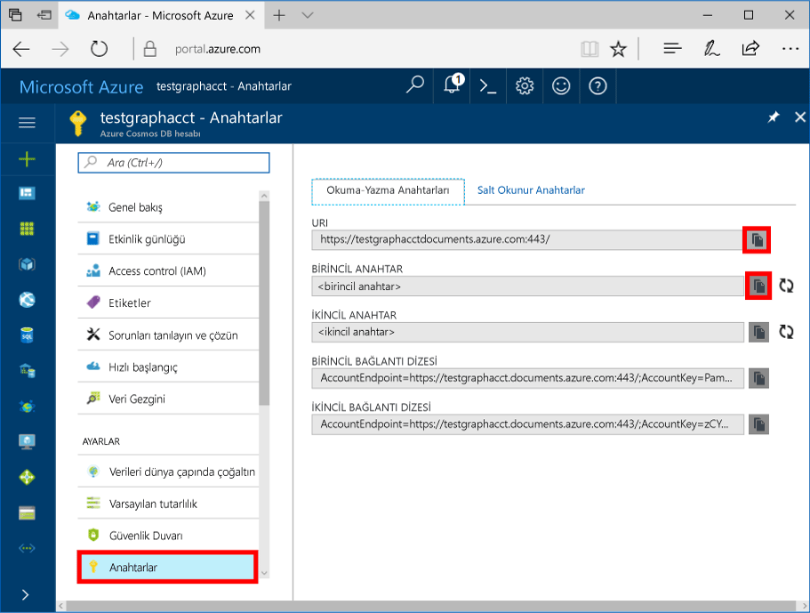

# <a name="azure-cosmos-db-create-query-and-traverse-a-graph-in-hello-gremlin-console"></a>Azure Cosmos DB: oluşturma, sorgu ve bir grafik hello Gremlin konsolunda geçiş

Azure Cosmos DB, Microsoft'un genel olarak dağıtılmış çok modelli veritabanı hizmetidir. Hızlı bir şekilde oluşturmak ve belge, anahtar/değer ve grafik veritabanları, her biri hello genel dağıtım ve yatay ölçek özelliklerini Azure Cosmos DB'nin hello çekirdek yararlı sorgulayabilirsiniz. 

Bu hızlı başlangıç Azure portal'ı ve ardından kullanımı hello toocreate bir Azure Cosmos DB hesap, veritabanı ve grafik (kapsayıcı) kullanarak nasıl hello gösteren [Gremlin konsol](https://tinkerpop.apache.org/docs/current/reference/#gremlin-console) gelen [Apache TinkerPop](http://tinkerpop.apache.org) toowork ile Grafik API'si (Önizleme) verileri. Bu öğreticide oluşturun ve köşeleri sorgu ve köşe özelliği güncelleniyor kenarlar köşeleri sorgu, hello grafik çapraz geçiş ve bir köşe bırakın.


Merhaba Gremlin Groovy/Java tabanlı ve Linux, Mac ve Windows çalıştıran konsoludur. Hello karşıdan [Apache TinkerPop site](https://www.apache.org/dyn/closer.lua/tinkerpop/3.2.5/apache-tinkerpop-gremlin-console-3.2.5-bin.zip).

## <a name="prerequisites"></a>Ön koşullar

Bu Hızlı Başlangıç için toohave bir Azure aboneliği toocreate Azure Cosmos DB hesabı gerekir.

[!INCLUDE [quickstarts-free-trial-note](../../includes/quickstarts-free-trial-note.md)]

Tooinstall hello etmeniz [Gremlin konsol](http://tinkerpop.apache.org/). 3.2.5 veya daha yüksek bir sürüm kullanın.

## <a name="create-a-database-account"></a>Veritabanı hesabı oluşturma

[!INCLUDE [cosmos-db-create-dbaccount-graph](../../includes/cosmos-db-create-dbaccount-graph.md)]

## <a name="add-a-graph"></a>Grafik ekleme

[!INCLUDE [cosmos-db-create-graph](../../includes/cosmos-db-create-graph.md)]

## <a id="ConnectAppService"></a>Tooyour app service bağlanma
1. Merhaba Gremlin Konsolu'nu başlatmadan önce oluşturun veya hello apache-tinkerpop-gremlin-console-3.2.5/conf dizinindeki hello uzaktan secure.yaml yapılandırma dosyasını değiştirin.
2. *ana bilgisayar*, *bağlantı noktası*, *kullanıcı adı*, *parola*, *bağlantı havuzu* ve *serileştirici* değerlerini girin:

    Ayar|Önerilen değer|Açıklama
    ---|---|---
    hosts|[***.graphs.azure.com]|Aşağıdaki ekran görüntüsüne bakın. Merhaba Gremlin URI değeri hello hello sondaki ile köşeli ayraçlar içinde Azure Portalı'nın hello genel bakış sayfasında budur: 443 / kaldırıldı.<br><br>Bu değer ayrıca hello anahtarları sekmesinden, https:// kaldırma belgeleri toographs değiştirme ve hello sondaki kaldırma hello URI değeri kullanılarak alınabilir: 443 /.
    port|443|Too443 ayarlayın.
    kullanıcı adı|*Kullanıcı adınız*|Merhaba hello formunun kaynak `/dbs/<db>/colls/<coll>` nerede `<db>` veritabanı adınız ve `<coll>` koleksiyon adı.
    password|*Birincil anahtarınız*| Aşağıdaki ikinci ekran görüntüsüne bakın. Merhaba anahtarları sayfasından hello hello birincil anahtar kutusunda Azure portal alabilir, birincil anahtar budur. Merhaba Kopyala düğmesini hello sol tarafında hello kutusu toocopy hello değerini kullanın.
    connectionPool|{enableSsl: true}|SSL için bağlantı havuzu ayarınız.
    serializer|{ className: org.apache.tinkerpop.gremlin.<br>driver.ser.GraphSONMessageSerializerV1d0,<br> config: { serializeResultToString: true }}|Toothis değeri ayarlayın ve silmek `\n` hello değerinde yapıştırılırken satır sonlarında.

    Merhaba Hello konakları değerini kopyalayın **Gremlin URI** başlangıç değerinden **genel bakış** sayfa: 

    Merhaba Hello parola değerini kopyalayın **birincil anahtar** hello gelen **anahtarları** sayfa: 


3. Terminalinizde Çalıştır `bin/gremlin.bat` veya `bin/gremlin.sh` toostart hello [Gremlin konsol](http://tinkerpop.apache.org/docs/3.2.5/tutorials/getting-started/).
4. Terminalinizde Çalıştır `:remote connect tinkerpop.server conf/remote-secure.yaml` tooconnect tooyour uygulama hizmeti.

    > [!TIP]
    > Merhaba hata alırsanız `No appenders could be found for logger` 2. adımda açıklandığı gibi hello uzaktan secure.yaml dosyasındaki hello seri hale getirici değer güncelleştirilmiş emin olun. 

Harika! Biz hello Kurulumu tamamladığımıza göre bazı Konsolu komutları çalıştıran başlayalım.

Basit bir count() komutunu deneyelim. Merhaba konsoluna hello isteminde Hello aşağıdakileri yazın:
```
:> g.V().count()
```

> [!TIP]
> Bildirim hello `:>` hello önündeki `g.V().count()` metin? 
>
> Bu hello komuta tootype ihtiyacınız bir parçasıdır. Merhaba Gremlin konsolu, Azure Cosmos DB ile kullanıldığında önemlidir.  
>
> Bu atlama `:>` önek bildirir hello konsol tooexecute hello komutu yerel olarak genellikle bir bellek içi grafik karşı.
> Bu kullanarak `:>` hello konsol tooexecute uzak komutu bu durumda Cosmos DB karşı söyler (ya da hello localhost öykünücü veya bir > Azure örneği).


## <a name="create-vertices-and-edges"></a>Köşe ve kenar oluşturma

İlk olarak *Thomas*, *Mary Kay*, *Robin*, *Ben* ve *Jack* için beş kişi köşesi ekleyelim.

Giriş (Thomas):

```
:> g.addV('person').property('firstName', 'Thomas').property('lastName', 'Andersen').property('age', 44).property('userid', 1)
```

Çıktı:

```
==>[id:796cdccc-2acd-4e58-a324-91d6f6f5ed6d,label:person,type:vertex,properties:[firstName:[[id:f02a749f-b67c-4016-850e-910242d68953,value:Thomas]],lastName:[[id:f5fa3126-8818-4fda-88b0-9bb55145ce5c,value:Andersen]],age:[[id:f6390f9c-e563-433e-acbf-25627628016e,value:44]],userid:[[id:796cdccc-2acd-4e58-a324-91d6f6f5ed6d|userid,value:1]]]]
```
Giriş (Mary Kay):

```
:> g.addV('person').property('firstName', 'Mary Kay').property('lastName', 'Andersen').property('age', 39).property('userid', 2)

```

Çıktı:

```
==>[id:0ac9be25-a476-4a30-8da8-e79f0119ea5e,label:person,type:vertex,properties:[firstName:[[id:ea0604f8-14ee-4513-a48a-1734a1f28dc0,value:Mary Kay]],lastName:[[id:86d3bba5-fd60-4856-9396-c195ef7d7f4b,value:Andersen]],age:[[id:bc81b78d-30c4-4e03-8f40-50f72eb5f6da,value:39]],userid:[[id:0ac9be25-a476-4a30-8da8-e79f0119ea5e|userid,value:2]]]]

```

Giriş (Robin):

```
:> g.addV('person').property('firstName', 'Robin').property('lastName', 'Wakefield').property('userid', 3)
```

Çıktı:

```
==>[id:8dc14d6a-8683-4a54-8d74-7eef1fb43a3e,label:person,type:vertex,properties:[firstName:[[id:ec65f078-7a43-4cbe-bc06-e50f2640dc4e,value:Robin]],lastName:[[id:a3937d07-0e88-45d3-a442-26fcdfb042ce,value:Wakefield]],userid:[[id:8dc14d6a-8683-4a54-8d74-7eef1fb43a3e|userid,value:3]]]]
```

Giriş (Ben):

```
:> g.addV('person').property('firstName', 'Ben').property('lastName', 'Miller').property('userid', 4)

```

Çıktı:

```
==>[id:ee86b670-4d24-4966-9a39-30529284b66f,label:person,type:vertex,properties:[firstName:[[id:a632469b-30fc-4157-840c-b80260871e9a,value:Ben]],lastName:[[id:4a08d307-0719-47c6-84ae-1b0b06630928,value:Miller]],userid:[[id:ee86b670-4d24-4966-9a39-30529284b66f|userid,value:4]]]]
```

Giriş (Jack):

```
:> g.addV('person').property('firstName', 'Jack').property('lastName', 'Connor').property('userid', 5)
```

Çıktı:

```
==>[id:4c835f2a-ea5b-43bb-9b6b-215488ad8469,label:person,type:vertex,properties:[firstName:[[id:4250824e-4b72-417f-af98-8034aa15559f,value:Jack]],lastName:[[id:44c1d5e1-a831-480a-bf94-5167d133549e,value:Connor]],userid:[[id:4c835f2a-ea5b-43bb-9b6b-215488ad8469|userid,value:5]]]]
```


Ardından, kişilerimiz arasındaki ilişkiler için kenarlar ekleyelim.

Giriş (Thomas -> Mary Kay):

```
:> g.V().hasLabel('person').has('firstName', 'Thomas').addE('knows').to(g.V().hasLabel('person').has('firstName', 'Mary Kay'))
```

Çıktı:

```
==>[id:c12bf9fb-96a1-4cb7-a3f8-431e196e702f,label:knows,type:edge,inVLabel:person,outVLabel:person,inV:0d1fa428-780c-49a5-bd3a-a68d96391d5c,outV:1ce821c6-aa3d-4170-a0b7-d14d2a4d18c3]
```

Giriş (Thomas -> Robin):

```
:> g.V().hasLabel('person').has('firstName', 'Thomas').addE('knows').to(g.V().hasLabel('person').has('firstName', 'Robin'))
```

Çıktı:

```
==>[id:58319bdd-1d3e-4f17-a106-0ddf18719d15,label:knows,type:edge,inVLabel:person,outVLabel:person,inV:3e324073-ccfc-4ae1-8675-d450858ca116,outV:1ce821c6-aa3d-4170-a0b7-d14d2a4d18c3]
```

Giriş (Robin -> Ben):

```
:> g.V().hasLabel('person').has('firstName', 'Robin').addE('knows').to(g.V().hasLabel('person').has('firstName', 'Ben'))
```

Çıktı:

```
==>[id:889c4d3c-549e-4d35-bc21-a3d1bfa11e00,label:knows,type:edge,inVLabel:person,outVLabel:person,inV:40fd641d-546e-412a-abcc-58fe53891aab,outV:3e324073-ccfc-4ae1-8675-d450858ca116]
```

## <a name="update-a-vertex"></a>Köşe güncelleştirme

Şimdi hello güncelleştirme *Thomas* köşe yeni yaşını ile *45*.

Giriş:
```
:> g.V().hasLabel('person').has('firstName', 'Thomas').property('age', 45)
```
Çıktı:

```
==>[id:ae36f938-210e-445a-92df-519f2b64c8ec,label:person,type:vertex,properties:[firstName:[[id:872090b6-6a77-456a-9a55-a59141d4ebc2,value:Thomas]],lastName:[[id:7ee7a39a-a414-4127-89b4-870bc4ef99f3,value:Andersen]],age:[[id:a2a75d5a-ae70-4095-806d-a35abcbfe71d,value:45]]]]
```

## <a name="query-your-graph"></a>Grafiğinizi sorgulama

Şimdi de grafiğinize karşı çeşitli sorgular çalıştıralım.

İlk olarak, bir sorgu kişilerle eski 40 yıldan daha eski bir filtre tooreturn yalnızca deneyelim.

Giriş (filtre sorgusu):

```
:> g.V().hasLabel('person').has('age', gt(40))
```

Çıktı:

```
==>[id:ae36f938-210e-445a-92df-519f2b64c8ec,label:person,type:vertex,properties:[firstName:[[id:872090b6-6a77-456a-9a55-a59141d4ebc2,value:Thomas]],lastName:[[id:7ee7a39a-a414-4127-89b4-870bc4ef99f3,value:Andersen]],age:[[id:a2a75d5a-ae70-4095-806d-a35abcbfe71d,value:45]]]]
```

Daha sonra şirketinizdeki eski 40 yıldan daha eski hello kişiler için hello ad proje.

Giriş (filtre + planlama sorgusu):

```
:> g.V().hasLabel('person').has('age', gt(40)).values('firstName')
```

Çıktı:

```
==>Thomas
```

## <a name="traverse-your-graph"></a>Grafiğinizi çapraz geçirme

Şimdi hello grafik tooreturn çapraz tüm Thomas'ın arkadaş.

Giriş (Thomas’ın arkadaşları):

```
:> g.V().hasLabel('person').has('firstName', 'Thomas').outE('knows').inV().hasLabel('person')
```

Çıktı: 

```
==>[id:f04bc00b-cb56-46c4-a3bb-a5870c42f7ff,label:person,type:vertex,properties:[firstName:[[id:14feedec-b070-444e-b544-62be15c7167c,value:Mary Kay]],lastName:[[id:107ab421-7208-45d4-b969-bbc54481992a,value:Andersen]],age:[[id:4b08d6e4-58f5-45df-8e69-6b790b692e0a,value:39]]]]
==>[id:91605c63-4988-4b60-9a30-5144719ae326,label:person,type:vertex,properties:[firstName:[[id:f760e0e6-652a-481a-92b0-1767d9bf372e,value:Robin]],lastName:[[id:352a4caa-bad6-47e3-a7dc-90ff342cf870,value:Wakefield]]]]
```

Ardından, şimdi hello sonraki katmanı köşeleri, alın. Hello grafik tooreturn Thomas'ın arkadaş tüm hello arkadaş çapraz geçiş yapamaz.

Giriş (Thomas’ın arkadaşlarının arkadaşları):

```
:> g.V().hasLabel('person').has('firstName', 'Thomas').outE('knows').inV().hasLabel('person').outE('knows').inV().hasLabel('person')
```
Çıktı:

```
==>[id:a801a0cb-ee85-44ee-a502-271685ef212e,label:person,type:vertex,properties:[firstName:[[id:b9489902-d29a-4673-8c09-c2b3fe7f8b94,value:Ben]],lastName:[[id:e084f933-9a4b-4dbc-8273-f0171265cf1d,value:Miller]]]]
```

## <a name="drop-a-vertex"></a>Köşe bırakma

Şimdi şimdi bir köşe hello grafik veritabanından silin.

Giriş (Jack köşesini bırakın):

```
:> g.V().hasLabel('person').has('firstName', 'Jack').drop()
```

## <a name="clear-your-graph"></a>Grafiğinizi temizleme

Son olarak, tüm köşeleri ve kenarları hello veritabanı şimdi temizleyin.

Giriş:

```
:> g.E().drop()
:> g.V().drop()
```

Tebrikler! Bu Azure Cosmos DB: Grafik API’si öğreticisini tamamladınız!

## <a name="review-slas-in-hello-azure-portal"></a>Gözden geçirme SLA'hello Azure portalı

[!INCLUDE [cosmosdb-tutorial-review-slas](../../includes/cosmos-db-tutorial-review-slas.md)]

## <a name="clean-up-resources"></a>Kaynakları temizleme

Toocontinue toouse bu uygulamayı değil kullanacaksanız, bu hızlı başlangıç tarafından hello Azure portalında aşağıdaki adımları hello ile oluşturulan tüm kaynakları silin:  

1. Merhaba sol taraftaki menüden hello Azure portal'ın, **kaynak grupları** ve ardından oluşturduğunuz hello kaynak hello adına tıklayın. 
2. Kaynak grubu sayfanızda tıklatın **silmek**hello metin kutusuna hello kaynak toodelete hello adını yazın ve ardından **silmek**.

## <a name="next-steps"></a>Sonraki adımlar

Bu hızlı başlangıç nasıl toocreate bir Azure Cosmos DB hesap hello Veri Gezgini'ni kullanarak bir grafik oluşturmak, köşe ve kenarları oluşturun ve hello Gremlin konsolunu kullanarak, grafik çapraz öğrendiniz. Artık daha karmaşık sorgular oluşturabilir ve Gremlin kullanarak güçlü grafik geçişi mantığını kullanabilirsiniz. 

> [!div class="nextstepaction"]
> [Gremlin kullanarak sorgulama](tutorial-query-graph.md)
