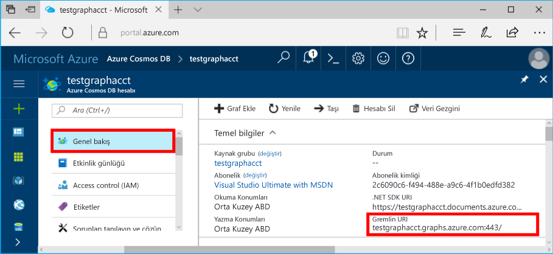
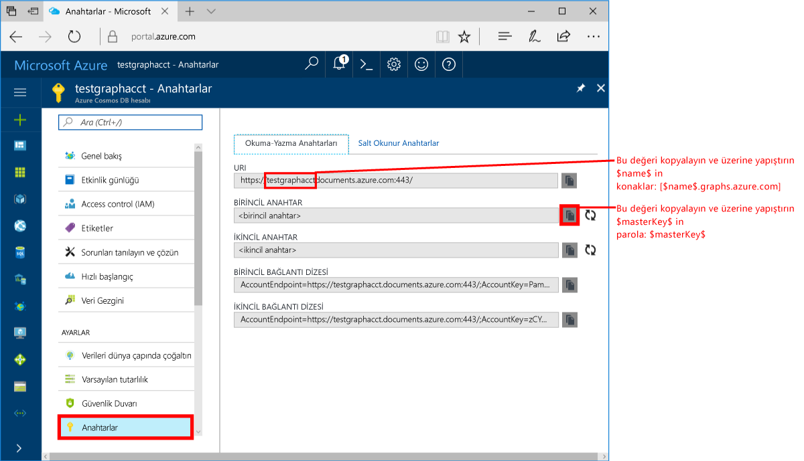
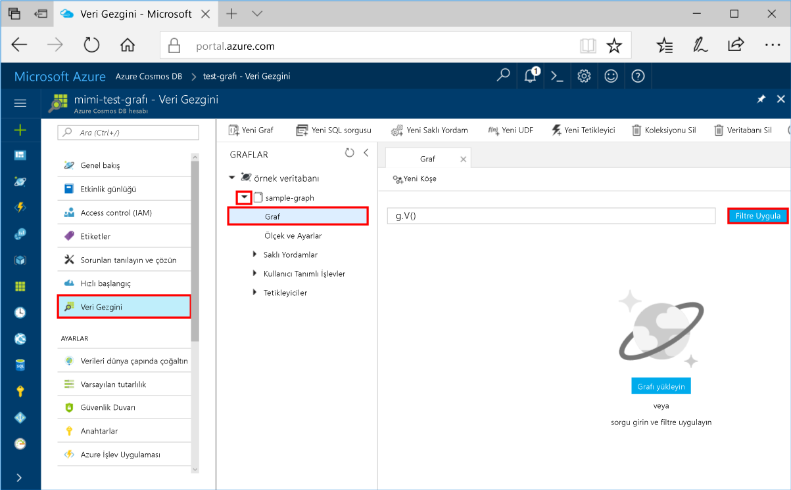
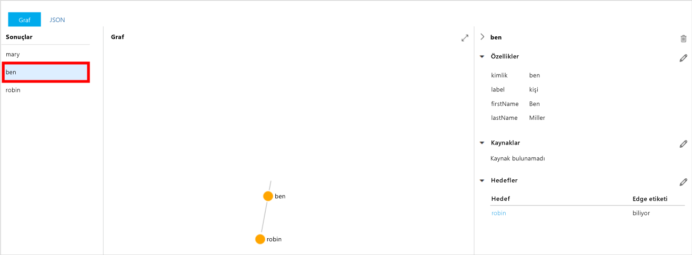
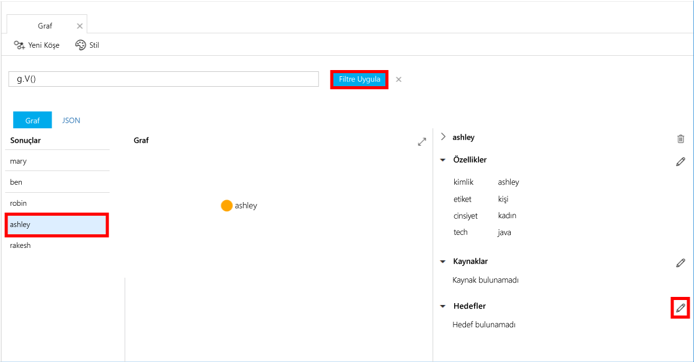
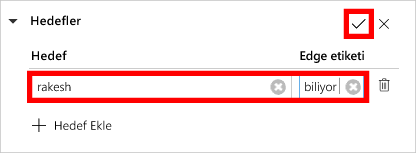
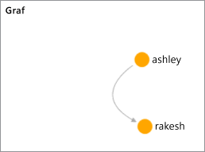

# <a name="azure-cosmos-db-create-a-graph-database-using-java-and-hello-azure-portal"></a><span data-ttu-id="d1046-103">Azure Cosmos DB: Java kullanarak bir grafik veritabanı oluşturmak ve Azure portal hello</span><span class="sxs-lookup"><span data-stu-id="d1046-103">Azure Cosmos DB: Create a graph database using Java and hello Azure portal</span></span>

<span data-ttu-id="d1046-104">Azure Cosmos DB, Microsoft'un genel olarak dağıtılmış çok modelli veritabanı hizmetidir.</span><span class="sxs-lookup"><span data-stu-id="d1046-104">Azure Cosmos DB is Microsoft’s globally distributed multi-model database service.</span></span> <span data-ttu-id="d1046-105">Hızlı bir şekilde oluşturmak ve belge, anahtar/değer ve grafik veritabanları, her biri hello genel dağıtım ve yatay ölçek özelliklerini Azure Cosmos DB'nin hello çekirdek yararlı sorgulayabilirsiniz.</span><span class="sxs-lookup"><span data-stu-id="d1046-105">You can quickly create and query document, key/value, and graph databases, all of which benefit from hello global distribution and horizontal scale capabilities at hello core of Azure Cosmos DB.</span></span> 

<span data-ttu-id="d1046-106">Bu hızlı başlangıç bir grafik oluşturur Azure Cosmos DB hello Azure portal araçları veritabanını kullanma.</span><span class="sxs-lookup"><span data-stu-id="d1046-106">This quickstart creates a graph database using hello Azure portal tools for Azure Cosmos DB.</span></span> <span data-ttu-id="d1046-107">Bu hızlı başlangıç ayrıca tooquickly hello OSS kullanarak bir grafik veritabanını kullanarak bir Java konsol uygulaması oluşturma nasıl gösterilmektedir [Gremlin Java](https://mvnrepository.com/artifact/org.apache.tinkerpop/gremlin-driver) sürücü.</span><span class="sxs-lookup"><span data-stu-id="d1046-107">This quickstart also shows you how tooquickly create a Java console app using a graph database using hello OSS [Gremlin Java](https://mvnrepository.com/artifact/org.apache.tinkerpop/gremlin-driver) driver.</span></span> <span data-ttu-id="d1046-108">Bu hızlı başlangıç içinde Hello yönergeler Java çalıştırabilen tüm işletim sisteminde izlenebilir.</span><span class="sxs-lookup"><span data-stu-id="d1046-108">hello instructions in this quickstart can be followed on any operating system that is capable of running Java.</span></span> <span data-ttu-id="d1046-109">Bu hızlı başlangıç oluşturma ve grafik kaynaklarında hello UI veya program aracılığıyla, tercihinize hangisi değiştirme ile familiarizes.</span><span class="sxs-lookup"><span data-stu-id="d1046-109">This quickstart familiarizes you with creating and modifying graph resources in either hello UI or programmatically, whichever is your preference.</span></span> 

## <a name="prerequisites"></a><span data-ttu-id="d1046-110">Ön koşullar</span><span class="sxs-lookup"><span data-stu-id="d1046-110">Prerequisites</span></span>

* [<span data-ttu-id="d1046-111">Java Development Kit (JDK) 1.7+</span><span class="sxs-lookup"><span data-stu-id="d1046-111">Java Development Kit (JDK) 1.7+</span></span>](http://www.oracle.com/technetwork/java/javase/downloads/jdk8-downloads-2133151.html)
    * <span data-ttu-id="d1046-112">Ubuntu üzerinde çalıştırmak `apt-get install default-jdk` tooinstall hello JDK.</span><span class="sxs-lookup"><span data-stu-id="d1046-112">On Ubuntu, run `apt-get install default-jdk` tooinstall hello JDK.</span></span>
    * <span data-ttu-id="d1046-113">Emin tooset hello JAVA_HOME ortam değişkeni toopoint toohello klasörü hello JDK'ın yüklendiği olabilir.</span><span class="sxs-lookup"><span data-stu-id="d1046-113">Be sure tooset hello JAVA_HOME environment variable toopoint toohello folder where hello JDK is installed.</span></span>
* <span data-ttu-id="d1046-114">Bir [Maven](http://maven.apache.org/) ikili arşivi [indirin](http://maven.apache.org/download.cgi) ve [yükleyin](http://maven.apache.org/install.html)</span><span class="sxs-lookup"><span data-stu-id="d1046-114">[Download](http://maven.apache.org/download.cgi) and [install](http://maven.apache.org/install.html) a [Maven](http://maven.apache.org/) binary archive</span></span>
    * <span data-ttu-id="d1046-115">Ubuntu üzerinde çalıştırdığınız `apt-get install maven` tooinstall Maven.</span><span class="sxs-lookup"><span data-stu-id="d1046-115">On Ubuntu, you can run `apt-get install maven` tooinstall Maven.</span></span>
* [<span data-ttu-id="d1046-116">Git</span><span class="sxs-lookup"><span data-stu-id="d1046-116">Git</span></span>](https://www.git-scm.com/)
    * <span data-ttu-id="d1046-117">Ubuntu üzerinde çalıştırdığınız `sudo apt-get install git` tooinstall Git.</span><span class="sxs-lookup"><span data-stu-id="d1046-117">On Ubuntu, you can run `sudo apt-get install git` tooinstall Git.</span></span>

[!INCLUDE [quickstarts-free-trial-note](../../includes/quickstarts-free-trial-note.md)]

## <a name="create-a-database-account"></a><span data-ttu-id="d1046-118">Veritabanı hesabı oluşturma</span><span class="sxs-lookup"><span data-stu-id="d1046-118">Create a database account</span></span>

<span data-ttu-id="d1046-119">Bir grafik veritabanı oluşturabilmeniz için önce toocreate Azure Cosmos DB ile Gremlin (grafiği) veritabanı hesabı gerekir.</span><span class="sxs-lookup"><span data-stu-id="d1046-119">Before you can create a graph database, you need toocreate a Gremlin (Graph) database account with Azure Cosmos DB.</span></span>

[!INCLUDE [cosmos-db-create-dbaccount-graph](../../includes/cosmos-db-create-dbaccount-graph.md)]

## <a name="add-a-graph"></a><span data-ttu-id="d1046-120">Grafik ekleme</span><span class="sxs-lookup"><span data-stu-id="d1046-120">Add a graph</span></span>

<span data-ttu-id="d1046-121">Artık hello Azure portal toocreate bir grafik veritabanı hello Veri Gezgini aracını kullanabilirsiniz.</span><span class="sxs-lookup"><span data-stu-id="d1046-121">You can now use hello Data Explorer tool in hello Azure portal toocreate a graph database.</span></span> 

1. <span data-ttu-id="d1046-122">Merhaba hello sol gezinti menüsünde, Azure portal'ı tıklatın **Veri Gezgini (Önizleme)**.</span><span class="sxs-lookup"><span data-stu-id="d1046-122">In hello Azure portal, in hello left navigation menu, click **Data Explorer (Preview)**.</span></span> 
2. <span data-ttu-id="d1046-123">Merhaba, **Veri Gezgini (Önizleme)** dikey penceresinde tıklatın **yeni bir grafik**, aşağıdaki bilgilerle hello kullanarak hello sayfasında doldurun:</span><span class="sxs-lookup"><span data-stu-id="d1046-123">In hello **Data Explorer (Preview)** blade, click **New Graph**, then fill in hello page using hello following information:</span></span>

    

    <span data-ttu-id="d1046-125">Ayar</span><span class="sxs-lookup"><span data-stu-id="d1046-125">Setting</span></span>|<span data-ttu-id="d1046-126">Önerilen değer</span><span class="sxs-lookup"><span data-stu-id="d1046-126">Suggested value</span></span>|<span data-ttu-id="d1046-127">Açıklama</span><span class="sxs-lookup"><span data-stu-id="d1046-127">Description</span></span>
    ---|---|---
    <span data-ttu-id="d1046-128">Veritabanı Kimliği</span><span class="sxs-lookup"><span data-stu-id="d1046-128">Database ID</span></span>|<span data-ttu-id="d1046-129">sample-database</span><span class="sxs-lookup"><span data-stu-id="d1046-129">sample-database</span></span>|<span data-ttu-id="d1046-130">Yeni veritabanı Hello kimliği.</span><span class="sxs-lookup"><span data-stu-id="d1046-130">hello ID for your new database.</span></span> <span data-ttu-id="d1046-131">Veritabanı adı 1 ile 255 karakter arasında olmalı, `/ \ # ?` içermemeli ve boşlukla bitmemelidir.</span><span class="sxs-lookup"><span data-stu-id="d1046-131">Database names must be between 1 and 255 characters, and cannot contain `/ \ # ?` or a trailing space.</span></span>
    <span data-ttu-id="d1046-132">Grafik Kimliği</span><span class="sxs-lookup"><span data-stu-id="d1046-132">Graph ID</span></span>|<span data-ttu-id="d1046-133">sample-graph</span><span class="sxs-lookup"><span data-stu-id="d1046-133">sample-graph</span></span>|<span data-ttu-id="d1046-134">Merhaba kimliği, yeni bir grafik.</span><span class="sxs-lookup"><span data-stu-id="d1046-134">hello ID for your new graph.</span></span> <span data-ttu-id="d1046-135">Grafik adlara sahip hello veritabanı kimlikleri aynı karakter gereksinimleri.</span><span class="sxs-lookup"><span data-stu-id="d1046-135">Graph names have hello same character requirements as database ids.</span></span>
    <span data-ttu-id="d1046-136">Depolama Kapasitesi</span><span class="sxs-lookup"><span data-stu-id="d1046-136">Storage Capacity</span></span>| <span data-ttu-id="d1046-137">10 GB</span><span class="sxs-lookup"><span data-stu-id="d1046-137">10 GB</span></span>|<span data-ttu-id="d1046-138">Merhaba varsayılan değeri bırakın.</span><span class="sxs-lookup"><span data-stu-id="d1046-138">Leave hello default value.</span></span> <span data-ttu-id="d1046-139">Merhaba depolama kapasitesi hello veritabanının budur.</span><span class="sxs-lookup"><span data-stu-id="d1046-139">This is hello storage capacity of hello database.</span></span>
    <span data-ttu-id="d1046-140">Aktarım hızı</span><span class="sxs-lookup"><span data-stu-id="d1046-140">Throughput</span></span>|<span data-ttu-id="d1046-141">400 RU</span><span class="sxs-lookup"><span data-stu-id="d1046-141">400 RUs</span></span>|<span data-ttu-id="d1046-142">Merhaba varsayılan değeri bırakın.</span><span class="sxs-lookup"><span data-stu-id="d1046-142">Leave hello default value.</span></span> <span data-ttu-id="d1046-143">Tooreduce gecikme istiyorsanız hello verimlilik daha sonra ölçeklendirebilirsiniz.</span><span class="sxs-lookup"><span data-stu-id="d1046-143">You can scale up hello throughput later if you want tooreduce latency.</span></span>
    <span data-ttu-id="d1046-144">Bölüm anahtarı</span><span class="sxs-lookup"><span data-stu-id="d1046-144">Partition key</span></span>|<span data-ttu-id="d1046-145">Boş bırakın</span><span class="sxs-lookup"><span data-stu-id="d1046-145">Leave blank</span></span>|<span data-ttu-id="d1046-146">Bu hızlı başlangıç Hello amaçla hello bölüm anahtarı boş bırakın.</span><span class="sxs-lookup"><span data-stu-id="d1046-146">For hello purpose of this quickstart, leave hello partition key blank.</span></span>

3. <span data-ttu-id="d1046-147">Merhaba form doldurulur sonra tıklayın **Tamam**.</span><span class="sxs-lookup"><span data-stu-id="d1046-147">Once hello form is filled out, click **OK**.</span></span>

## <a name="clone-hello-sample-application"></a><span data-ttu-id="d1046-148">Merhaba örnek uygulaması kopyalama</span><span class="sxs-lookup"><span data-stu-id="d1046-148">Clone hello sample application</span></span>

<span data-ttu-id="d1046-149">Şimdi şimdi kopyalama bir grafik uygulaması github'dan hello bağlantı dizesini ayarlamak ve çalıştırın.</span><span class="sxs-lookup"><span data-stu-id="d1046-149">Now let's clone a graph app from github, set hello connection string, and run it.</span></span> <span data-ttu-id="d1046-150">Ne kadar kolay toowork verilerle program aracılığıyla olduğunu görürsünüz.</span><span class="sxs-lookup"><span data-stu-id="d1046-150">You see how easy it is toowork with data programmatically.</span></span> 

1. <span data-ttu-id="d1046-151">Git bash gibi bir git terminal penceresi açın ve `cd` tooa çalışma dizini.</span><span class="sxs-lookup"><span data-stu-id="d1046-151">Open a git terminal window, such as git bash, and `cd` tooa working directory.</span></span>  

2. <span data-ttu-id="d1046-152">Çalışma hello aşağıdaki tooclone hello örnek depo komutu.</span><span class="sxs-lookup"><span data-stu-id="d1046-152">Run hello following command tooclone hello sample repository.</span></span> 

    ```bash
    git clone https://github.com/Azure-Samples/azure-cosmos-db-graph-java-getting-started.git
    ```

## <a name="review-hello-code"></a><span data-ttu-id="d1046-153">Merhaba kod gözden geçirme</span><span class="sxs-lookup"><span data-stu-id="d1046-153">Review hello code</span></span>

<span data-ttu-id="d1046-154">Neler olduğuna dair hello uygulamada hızlı bir gözden geçirme olalım.</span><span class="sxs-lookup"><span data-stu-id="d1046-154">Let's make a quick review of what's happening in hello app.</span></span> <span data-ttu-id="d1046-155">Açık hello `Program.java` dosya hello \src\GetStarted klasöründen ve bu kod satırları bulur.</span><span class="sxs-lookup"><span data-stu-id="d1046-155">Open hello `Program.java` file from hello \src\GetStarted folder and find these lines of code.</span></span> 

* <span data-ttu-id="d1046-156">Merhaba Gremlin `Client` hello yapılandırmadan başlatılmış `src/remote.yaml`.</span><span class="sxs-lookup"><span data-stu-id="d1046-156">hello Gremlin `Client` is initialized from hello configuration in `src/remote.yaml`.</span></span>

    ```java
    cluster = Cluster.build(new File("src/remote.yaml")).create();
    ...
    client = cluster.connect();
    ```

* <span data-ttu-id="d1046-157">Bir dizi Gremlin adımı hello kullanarak yürütülme `client.submit` yöntemi.</span><span class="sxs-lookup"><span data-stu-id="d1046-157">A series of Gremlin steps are executed using hello `client.submit` method.</span></span>

    ```java
    ResultSet results = client.submit(gremlin);

    CompletableFuture<List<Result>> completableFutureResults = results.all();
    List<Result> resultList = completableFutureResults.get();

    for (Result result : resultList) {
        System.out.println(result.toString());
    }
    ```

## <a name="update-your-connection-string"></a><span data-ttu-id="d1046-158">Bağlantı dizenizi güncelleştirme</span><span class="sxs-lookup"><span data-stu-id="d1046-158">Update your connection string</span></span>

1. <span data-ttu-id="d1046-159">Açık hello src/remote.yaml dosyası.</span><span class="sxs-lookup"><span data-stu-id="d1046-159">Open hello src/remote.yaml file.</span></span> 

3. <span data-ttu-id="d1046-160">Doldurun, *ana*, *kullanıcıadı*, ve *parola* hello src/remote.yaml dosyasındaki değerleri.</span><span class="sxs-lookup"><span data-stu-id="d1046-160">Fill in your *hosts*, *username*, and *password* values in hello src/remote.yaml file.</span></span> <span data-ttu-id="d1046-161">Merhaba rest hello ayarlarının değiştirilen toobe gerek yoktur.</span><span class="sxs-lookup"><span data-stu-id="d1046-161">hello rest of hello settings do not need toobe changed.</span></span>

    <span data-ttu-id="d1046-162">Ayar</span><span class="sxs-lookup"><span data-stu-id="d1046-162">Setting</span></span>|<span data-ttu-id="d1046-163">Önerilen değer</span><span class="sxs-lookup"><span data-stu-id="d1046-163">Suggested value</span></span>|<span data-ttu-id="d1046-164">Açıklama</span><span class="sxs-lookup"><span data-stu-id="d1046-164">Description</span></span>
    ---|---|---
    <span data-ttu-id="d1046-165">Ana bilgisayarlar</span><span class="sxs-lookup"><span data-stu-id="d1046-165">Hosts</span></span>|<span data-ttu-id="d1046-166">[***.graphs.azure.com]</span><span class="sxs-lookup"><span data-stu-id="d1046-166">[***.graphs.azure.com]</span></span>|<span data-ttu-id="d1046-167">Bu tablodan sonraki hello ekran görüntüsüne bakın.</span><span class="sxs-lookup"><span data-stu-id="d1046-167">See hello screenshot following this table.</span></span> <span data-ttu-id="d1046-168">Bu değer hello Gremlin URI hello hello sondaki ile köşeli ayraçlar içinde Azure Portalı'nın hello genel bakış sayfasında değerdir: 443 / kaldırıldı.</span><span class="sxs-lookup"><span data-stu-id="d1046-168">This value is hello Gremlin URI value on hello Overview page of hello Azure portal, in square brackets, with hello trailing :443/ removed.</span></span><br><br><span data-ttu-id="d1046-169">Bu değer ayrıca hello anahtarları sekmesinden, https:// kaldırma belgeleri toographs değiştirme ve hello sondaki kaldırma hello URI değeri kullanılarak alınabilir: 443 /.</span><span class="sxs-lookup"><span data-stu-id="d1046-169">This value can also be retrieved from hello Keys tab, using hello URI value by removing https://, changing documents toographs, and removing hello trailing :443/.</span></span>
    <span data-ttu-id="d1046-170">Kullanıcı adı</span><span class="sxs-lookup"><span data-stu-id="d1046-170">Username</span></span>|<span data-ttu-id="d1046-171">/dbs/sample-database/colls/sample-graph</span><span class="sxs-lookup"><span data-stu-id="d1046-171">/dbs/sample-database/colls/sample-graph</span></span>|<span data-ttu-id="d1046-172">Merhaba hello formunun kaynak `/dbs/<db>/colls/<coll>` nerede `<db>` varolan veritabanı adınız ve `<coll>` varolan koleksiyon adı.</span><span class="sxs-lookup"><span data-stu-id="d1046-172">hello resource of hello form `/dbs/<db>/colls/<coll>` where `<db>` is your existing database name and `<coll>` is your existing collection name.</span></span>
    <span data-ttu-id="d1046-173">Parola</span><span class="sxs-lookup"><span data-stu-id="d1046-173">Password</span></span>|<span data-ttu-id="d1046-174">*Birincil ana anahtarınız*</span><span class="sxs-lookup"><span data-stu-id="d1046-174">*Your primary master key*</span></span>|<span data-ttu-id="d1046-175">Bu tablodan sonraki hello ikinci ekran görüntüsüne bakın.</span><span class="sxs-lookup"><span data-stu-id="d1046-175">See hello second screenshot following this table.</span></span> <span data-ttu-id="d1046-176">Bu değer, hello hello birincil anahtar kutusunda Azure portal hello anahtarları sayfasından alabilirsiniz, birincil anahtar olur.</span><span class="sxs-lookup"><span data-stu-id="d1046-176">This value is your primary key, which you can retrieve from hello Keys page of hello Azure portal, in hello Primary Key box.</span></span> <span data-ttu-id="d1046-177">Merhaba kutusunun sağ tarafında üzerinde hello Hello Kopyala düğmesini kullanarak hello değerini kopyalayın.</span><span class="sxs-lookup"><span data-stu-id="d1046-177">Copy hello value using hello copy button on hello right side of hello box.</span></span>

    <span data-ttu-id="d1046-178">Merhaba Hello konakları değerini kopyalayın **Gremlin URI** başlangıç değerinden **genel bakış** sayfası.</span><span class="sxs-lookup"><span data-stu-id="d1046-178">For hello Hosts value, copy hello **Gremlin URI** value from hello **Overview** page.</span></span> <span data-ttu-id="d1046-179">Boşsa, hello yönergeler hello konakları hello anahtarlar dikey penceresinden hello Gremlin URI oluşturma hakkında daha fazla tablo önceki hello satırda bakın.</span><span class="sxs-lookup"><span data-stu-id="d1046-179">If it's empty, see hello instructions in hello Hosts row in hello preceding table about creating hello Gremlin URI from hello Keys blade.</span></span>
<span data-ttu-id="d1046-180"></span><span class="sxs-lookup"><span data-stu-id="d1046-180"></span></span>

    <span data-ttu-id="d1046-181">Merhaba Hello parola değerini kopyalayın **birincil anahtar** hello gelen **anahtarları** dikey: </span><span class="sxs-lookup"><span data-stu-id="d1046-181">For hello Password value, copy hello **Primary key** from hello **Keys** blade: </span></span>

## <a name="run-hello-console-app"></a><span data-ttu-id="d1046-182">Merhaba konsol uygulamasını çalıştırın</span><span class="sxs-lookup"><span data-stu-id="d1046-182">Run hello console app</span></span>

1. <span data-ttu-id="d1046-183">Penceresinde hello git terminal `cd` toohello azure-cosmos-db-graph-java-getting-started klasör.</span><span class="sxs-lookup"><span data-stu-id="d1046-183">In hello git terminal window, `cd` toohello azure-cosmos-db-graph-java-getting-started folder.</span></span>

2. <span data-ttu-id="d1046-184">Merhaba git terminal penceresinde yazın `mvn package` tooinstall hello Java paketleri gereklidir.</span><span class="sxs-lookup"><span data-stu-id="d1046-184">In hello git terminal window, type `mvn package` tooinstall hello required Java packages.</span></span>

3. <span data-ttu-id="d1046-185">Merhaba git terminal penceresinde çalıştırın `mvn exec:java -D exec.mainClass=GetStarted.Program` içinde Java uygulamanız terminal penceresi toostart hello.</span><span class="sxs-lookup"><span data-stu-id="d1046-185">In hello git terminal window, run `mvn exec:java -D exec.mainClass=GetStarted.Program` in hello terminal window toostart your Java application.</span></span>

<span data-ttu-id="d1046-186">Merhaba terminal penceresi toohello grafik eklenmekte olan hello Köşeleri görüntüler.</span><span class="sxs-lookup"><span data-stu-id="d1046-186">hello terminal window displays hello vertices being added toohello graph.</span></span> <span data-ttu-id="d1046-187">Merhaba program işlemi tamamlandıktan sonra geri toohello Azure portal, Internet tarayıcınızda geçin.</span><span class="sxs-lookup"><span data-stu-id="d1046-187">Once hello program completes, switch back toohello Azure portal in your internet browser.</span></span> 

<a id="add-sample-data"></a>
## <a name="review-and-add-sample-data"></a><span data-ttu-id="d1046-188">Örnek verileri inceleme ve ekleme</span><span class="sxs-lookup"><span data-stu-id="d1046-188">Review and add sample data</span></span>

<span data-ttu-id="d1046-189">Şimdi tooData Explorer geri dönün ve hello köşeleri toohello grafik eklenir ve ek veri noktaları ekleme bakın.</span><span class="sxs-lookup"><span data-stu-id="d1046-189">You can now go back tooData Explorer and see hello vertices added toohello graph, and add additional data points.</span></span>

1. <span data-ttu-id="d1046-190">Veri Gezgini'nde hello genişletin **örnek veritabanı**/**örnek grafik**, tıklatın **grafik**ve ardından **Filtre Uygula**.</span><span class="sxs-lookup"><span data-stu-id="d1046-190">In Data Explorer, expand hello **sample-database**/**sample-graph**, click **Graph**, and then click **Apply Filter**.</span></span> 

   

2. <span data-ttu-id="d1046-192">Merhaba, **sonuçları** listesinde, hello yeni kullanıcılar eklenen toohello grafik dikkat edin.</span><span class="sxs-lookup"><span data-stu-id="d1046-192">In hello **Results** list, notice hello new users added toohello graph.</span></span> <span data-ttu-id="d1046-193">Seçin **ben** ve kendisine toorobin bağlandı dikkat edin.</span><span class="sxs-lookup"><span data-stu-id="d1046-193">Select **ben** and notice that he's connected toorobin.</span></span> <span data-ttu-id="d1046-194">Merhaba köşeleri hello graph Explorer'a üzerinde hareket ettirin, yakınlaştırma ve uzaklaştırma ve hello grafik explorer yüzeyine hello boyutunu genişletin.</span><span class="sxs-lookup"><span data-stu-id="d1046-194">You can move hello vertices around on hello graph explorer, zoom in and out, and expand hello size of hello graph explorer surface.</span></span> 

   

3. <span data-ttu-id="d1046-196">Merhaba Veri Gezgini'ni kullanarak, birkaç, yeni kullanıcılar toohello grafik ekleyelim.</span><span class="sxs-lookup"><span data-stu-id="d1046-196">Let's add a few new users toohello graph using hello Data Explorer.</span></span> <span data-ttu-id="d1046-197">Merhaba tıklatın **yeni köşe** düğmesini tooadd veri tooyour grafiği.</span><span class="sxs-lookup"><span data-stu-id="d1046-197">Click hello **New Vertex** button tooadd data tooyour graph.</span></span>

   

4. <span data-ttu-id="d1046-199">Bir etiketi girin *kişi* aşağıdaki anahtarları ve toocreate hello ilk köşe hello grafikteki değerleri hello girin.</span><span class="sxs-lookup"><span data-stu-id="d1046-199">Enter a label of *person* then enter hello following keys and values toocreate hello first vertex in hello graph.</span></span> <span data-ttu-id="d1046-200">Grafikteki her kişi için benzersiz özellikler oluşturabileceğinizi görürsünüz.</span><span class="sxs-lookup"><span data-stu-id="d1046-200">Notice that you can create unique properties for each person in your graph.</span></span> <span data-ttu-id="d1046-201">Yalnızca hello kimliği anahtar gereklidir.</span><span class="sxs-lookup"><span data-stu-id="d1046-201">Only hello id key is required.</span></span>

    <span data-ttu-id="d1046-202">anahtar</span><span class="sxs-lookup"><span data-stu-id="d1046-202">key</span></span>|<span data-ttu-id="d1046-203">değer</span><span class="sxs-lookup"><span data-stu-id="d1046-203">value</span></span>|<span data-ttu-id="d1046-204">Notlar</span><span class="sxs-lookup"><span data-stu-id="d1046-204">Notes</span></span>
    ----|----|----
    <span data-ttu-id="d1046-205">id</span><span class="sxs-lookup"><span data-stu-id="d1046-205">id</span></span>|<span data-ttu-id="d1046-206">ashley</span><span class="sxs-lookup"><span data-stu-id="d1046-206">ashley</span></span>|<span data-ttu-id="d1046-207">Merhaba hello köşe için benzersiz tanımlayıcı.</span><span class="sxs-lookup"><span data-stu-id="d1046-207">hello unique identifier for hello vertex.</span></span> <span data-ttu-id="d1046-208">Kimlik belirtmezseniz, bir kimlik otomatik olarak oluşturulur.</span><span class="sxs-lookup"><span data-stu-id="d1046-208">If you don't specify an id, one is generated for you.</span></span>
    <span data-ttu-id="d1046-209">cinsiyet</span><span class="sxs-lookup"><span data-stu-id="d1046-209">gender</span></span>|<span data-ttu-id="d1046-210">kadın</span><span class="sxs-lookup"><span data-stu-id="d1046-210">female</span></span>| 
    <span data-ttu-id="d1046-211">teknoloji</span><span class="sxs-lookup"><span data-stu-id="d1046-211">tech</span></span> | <span data-ttu-id="d1046-212">java</span><span class="sxs-lookup"><span data-stu-id="d1046-212">java</span></span> | 

    > [!NOTE]
    > <span data-ttu-id="d1046-213">Bu hızlı başlangıçta bölümlenmemiş bir koleksiyon oluşturacağız.</span><span class="sxs-lookup"><span data-stu-id="d1046-213">In this quickstart we create a non-partitioned collection.</span></span> <span data-ttu-id="d1046-214">Merhaba koleksiyonu oluşturma sırasında bir bölüm anahtarı belirterek bölümlendirilmiş bir koleksiyon oluşturursanız, ancak, ardından tooinclude hello bölüm anahtarı bir anahtar olarak her yeni köşe gerekir.</span><span class="sxs-lookup"><span data-stu-id="d1046-214">However, if you create a partitioned collection by specifying a partition key during hello collection creation, then you need tooinclude hello partition key as a key in each new vertex.</span></span> 

5. <span data-ttu-id="d1046-215">**Tamam** düğmesine tıklayın.</span><span class="sxs-lookup"><span data-stu-id="d1046-215">Click **OK**.</span></span> <span data-ttu-id="d1046-216">Ekran toosee tooexpand gerekebilir **Tamam** hello ekranın hello üzerinde.</span><span class="sxs-lookup"><span data-stu-id="d1046-216">You may need tooexpand your screen toosee **OK** on hello bottom of hello screen.</span></span>

6. <span data-ttu-id="d1046-217">Tekrar **Yeni Köşe**’ye tıklayın ve ek yeni kullanıcıyı ekleyin.</span><span class="sxs-lookup"><span data-stu-id="d1046-217">Click **New Vertex** again and add an additional new user.</span></span> <span data-ttu-id="d1046-218">Bir etiketi girin *kişi* hello aşağıdaki enter anahtarları ve değerleri:</span><span class="sxs-lookup"><span data-stu-id="d1046-218">Enter a label of *person* then enter hello following keys and values:</span></span>

    <span data-ttu-id="d1046-219">anahtar</span><span class="sxs-lookup"><span data-stu-id="d1046-219">key</span></span>|<span data-ttu-id="d1046-220">değer</span><span class="sxs-lookup"><span data-stu-id="d1046-220">value</span></span>|<span data-ttu-id="d1046-221">Notlar</span><span class="sxs-lookup"><span data-stu-id="d1046-221">Notes</span></span>
    ----|----|----
    <span data-ttu-id="d1046-222">id</span><span class="sxs-lookup"><span data-stu-id="d1046-222">id</span></span>|<span data-ttu-id="d1046-223">rakesh</span><span class="sxs-lookup"><span data-stu-id="d1046-223">rakesh</span></span>|<span data-ttu-id="d1046-224">Merhaba hello köşe için benzersiz tanımlayıcı.</span><span class="sxs-lookup"><span data-stu-id="d1046-224">hello unique identifier for hello vertex.</span></span> <span data-ttu-id="d1046-225">Kimlik belirtmezseniz, bir kimlik otomatik olarak oluşturulur.</span><span class="sxs-lookup"><span data-stu-id="d1046-225">If you don't specify an id, one is generated for you.</span></span>
    <span data-ttu-id="d1046-226">cinsiyet</span><span class="sxs-lookup"><span data-stu-id="d1046-226">gender</span></span>|<span data-ttu-id="d1046-227">erkek</span><span class="sxs-lookup"><span data-stu-id="d1046-227">male</span></span>| 
    <span data-ttu-id="d1046-228">okul</span><span class="sxs-lookup"><span data-stu-id="d1046-228">school</span></span>|<span data-ttu-id="d1046-229">MIT</span><span class="sxs-lookup"><span data-stu-id="d1046-229">MIT</span></span>| 

7. <span data-ttu-id="d1046-230">**Tamam** düğmesine tıklayın.</span><span class="sxs-lookup"><span data-stu-id="d1046-230">Click **OK**.</span></span> 

8. <span data-ttu-id="d1046-231">Tıklatın **Filtre Uygula** hello varsayılan ile `g.V()` Filtresi.</span><span class="sxs-lookup"><span data-stu-id="d1046-231">Click **Apply Filter** with hello default `g.V()` filter.</span></span> <span data-ttu-id="d1046-232">Tüm hello kullanıcıların artık Göster hello **sonuçları** listesi.</span><span class="sxs-lookup"><span data-stu-id="d1046-232">All of hello users now show in hello **Results** list.</span></span> <span data-ttu-id="d1046-233">Daha fazla veri ekleme gibi filtreler toolimit sonuçlarınızı kullanabilirsiniz.</span><span class="sxs-lookup"><span data-stu-id="d1046-233">As you add more data, you can use filters toolimit your results.</span></span> <span data-ttu-id="d1046-234">Varsayılan olarak, Veri Gezgini kullanır `g.V()` tooretrieve bu tooa farklı bir grafik, ancak tüm tepe değiştirebilirsiniz [grafik sorgu](tutorial-query-graph.md), gibi `g.V().count()`, tooreturn JSON biçiminde hello grafik tüm hello tepe sayısı.</span><span class="sxs-lookup"><span data-stu-id="d1046-234">By default, Data Explorer uses `g.V()` tooretrieve all vertices in a graph, but you can change that tooa different [graph query](tutorial-query-graph.md), such as `g.V().count()`, tooreturn a count of all hello vertices in hello graph in JSON format.</span></span>

9. <span data-ttu-id="d1046-235">Artık rakesh ve ashley arasında bağlantı kurabiliriz.</span><span class="sxs-lookup"><span data-stu-id="d1046-235">Now we can connect rakesh and ashley.</span></span> <span data-ttu-id="d1046-236">Olun **ashley** hello seçili **sonuçları** listesinde, İleri'yi hello Düzenle düğmesi çok tıklatın**hedefleri** alt sağ tarafında.</span><span class="sxs-lookup"><span data-stu-id="d1046-236">Ensure **ashley** in selected in hello **Results** list, then click hello edit button next too**Targets** on lower right side.</span></span> <span data-ttu-id="d1046-237">Pencere toosee hello toowiden gerekebilir **özellikleri** alanı.</span><span class="sxs-lookup"><span data-stu-id="d1046-237">You may need toowiden your window toosee hello **Properties** area.</span></span>

   

10. <span data-ttu-id="d1046-239">Merhaba, **hedef** kutusuna yazın *rakesh*ve hello **kenar etiket** kutusuna yazın *bilir*ve ardından hello onay kutusuna tıklayın.</span><span class="sxs-lookup"><span data-stu-id="d1046-239">In hello **Target** box type *rakesh*, and in hello **Edge label** box type *knows*, and then click hello check box.</span></span>

   

11. <span data-ttu-id="d1046-241">Şimdi seçin **rakesh** hello sonuçları listesi ve ashley ve rakesh bağlı olup olmadığını bakın.</span><span class="sxs-lookup"><span data-stu-id="d1046-241">Now select **rakesh** from hello results list and see that ashley and rakesh are connected.</span></span> 

   

    <span data-ttu-id="d1046-243">Ayrıca Veri Gezgini toocreate saklı yordamlar, UDF'ler ve Tetikleyicileri tooperform sunucu tarafı iş mantığı da kullanabilirsiniz ölçek işleme olarak.</span><span class="sxs-lookup"><span data-stu-id="d1046-243">You can also use Data Explorer toocreate stored procedures, UDFs, and triggers tooperform server-side business logic as well as scale throughput.</span></span> <span data-ttu-id="d1046-244">Veri Gezgini tüm hello yerleşik programlı veri erişim hello API'leri kullanılabilir gösterir, ancak tooyour verileri hello Azure portalında kolay erişim sağlar.</span><span class="sxs-lookup"><span data-stu-id="d1046-244">Data Explorer exposes all of hello built-in programmatic data access available in hello APIs, but provides easy access tooyour data in hello Azure portal.</span></span>


## <a name="review-slas-in-hello-azure-portal"></a><span data-ttu-id="d1046-245">Gözden geçirme SLA'hello Azure portalı</span><span class="sxs-lookup"><span data-stu-id="d1046-245">Review SLAs in hello Azure portal</span></span>

[!INCLUDE [cosmosdb-tutorial-review-slas](../../includes/cosmos-db-tutorial-review-slas.md)]

## <a name="clean-up-resources"></a><span data-ttu-id="d1046-246">Kaynakları temizleme</span><span class="sxs-lookup"><span data-stu-id="d1046-246">Clean up resources</span></span>

<span data-ttu-id="d1046-247">Toocontinue toouse bu uygulamayı değil kullanacaksanız, bu hızlı başlangıç tarafından hello Azure portalında aşağıdaki adımları hello ile oluşturulan tüm kaynakları silin:</span><span class="sxs-lookup"><span data-stu-id="d1046-247">If you're not going toocontinue toouse this app, delete all resources created by this quickstart in hello Azure portal with hello following steps:</span></span> 

1. <span data-ttu-id="d1046-248">Merhaba sol taraftaki menüden hello Azure portal'ın, **kaynak grupları** ve ardından oluşturduğunuz hello kaynak hello adına tıklayın.</span><span class="sxs-lookup"><span data-stu-id="d1046-248">From hello left-hand menu in hello Azure portal, click **Resource groups** and then click hello name of hello resource you created.</span></span> 
2. <span data-ttu-id="d1046-249">Kaynak grubu sayfanızda tıklatın **silmek**hello metin kutusuna hello kaynak toodelete hello adını yazın ve ardından **silmek**.</span><span class="sxs-lookup"><span data-stu-id="d1046-249">On your resource group page, click **Delete**, type hello name of hello resource toodelete in hello text box, and then click **Delete**.</span></span>

## <a name="next-steps"></a><span data-ttu-id="d1046-250">Sonraki adımlar</span><span class="sxs-lookup"><span data-stu-id="d1046-250">Next steps</span></span>

<span data-ttu-id="d1046-251">Bu hızlı başlangıç toocreate bir Azure Cosmos DB hesap hello Veri Gezgini'ni kullanarak bir grafik oluşturma ve bir uygulama çalıştırmasına öğrendiniz.</span><span class="sxs-lookup"><span data-stu-id="d1046-251">In this quickstart, you've learned how toocreate an Azure Cosmos DB account, create a graph using hello Data Explorer, and run an app.</span></span> <span data-ttu-id="d1046-252">Artık daha karmaşık sorgular oluşturabilir ve Gremlin kullanarak güçlü grafik geçişi mantığını kullanabilirsiniz.</span><span class="sxs-lookup"><span data-stu-id="d1046-252">You can now build more complex queries and implement powerful graph traversal logic using Gremlin.</span></span> 

> [!div class="nextstepaction"]
> [<span data-ttu-id="d1046-253">Gremlin kullanarak sorgulama</span><span class="sxs-lookup"><span data-stu-id="d1046-253">Query using Gremlin</span></span>](tutorial-query-graph.md)

