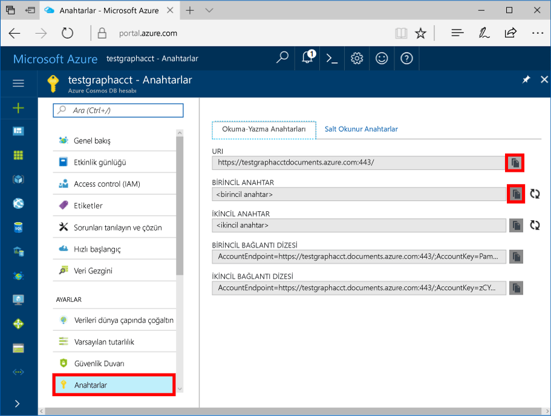

# <a name="azure-cosmos-db-build-a-nodejs-application-by-using-graph-api"></a><span data-ttu-id="d3437-103">Azure Cosmos DB: Grafik API'sini kullanarak bir Node.js uygulaması oluşturma</span><span class="sxs-lookup"><span data-stu-id="d3437-103">Azure Cosmos DB: Build a Node.js application by using Graph API</span></span>

<span data-ttu-id="d3437-104">Azure Cosmos DB hello Genel dağıtılmış birden çok model veritabanı Microsoft'tan hizmetidir.</span><span class="sxs-lookup"><span data-stu-id="d3437-104">Azure Cosmos DB is hello globally distributed multi-model database service from Microsoft.</span></span> <span data-ttu-id="d3437-105">Hızlı bir şekilde oluşturmak ve belge, anahtar/değer ve grafik veritabanları, her biri hello genel dağıtım ve yatay ölçek özelliklerini Azure Cosmos DB'nin hello çekirdek yararlı sorgulayabilirsiniz.</span><span class="sxs-lookup"><span data-stu-id="d3437-105">You can quickly create and query document, key/value, and graph databases, all of which benefit from hello global distribution and horizontal scale capabilities at hello core of Azure Cosmos DB.</span></span> 

<span data-ttu-id="d3437-106">Bu hızlı başlangıç makalede nasıl toocreate bir Azure Cosmos DB hesap grafik API'si (Önizleme), veritabanı ve grafik hello Azure portal kullanarak gösterilmektedir.</span><span class="sxs-lookup"><span data-stu-id="d3437-106">This quick-start article demonstrates how toocreate an Azure Cosmos DB account for Graph API (preview), database, and graph by using hello Azure portal.</span></span> <span data-ttu-id="d3437-107">Ardından derleme ve hello açık kaynaklı kullanarak bir konsol uygulaması çalıştırma [Gremlin Node.js](https://www.npmjs.com/package/gremlin-secure) sürücü.</span><span class="sxs-lookup"><span data-stu-id="d3437-107">You then build and run a console app by using hello open-source [Gremlin Node.js](https://www.npmjs.com/package/gremlin-secure) driver.</span></span>  

> [!NOTE]
> <span data-ttu-id="d3437-108">Merhaba npm modülünü `gremlin-secure` değiştirilmiş bir sürümüdür `gremlin` modülüyle SSL ve Azure Cosmos DB ile bağlanmak için gereken SASL desteği.</span><span class="sxs-lookup"><span data-stu-id="d3437-108">hello npm module `gremlin-secure` is a modified version of `gremlin` module, with support for SSL and SASL required for connecting with Azure Cosmos DB.</span></span> <span data-ttu-id="d3437-109">Kaynak kodu [GitHub](https://github.com/CosmosDB/gremlin-javascript)’dan edinilebilir.</span><span class="sxs-lookup"><span data-stu-id="d3437-109">Source code is available on [GitHub](https://github.com/CosmosDB/gremlin-javascript).</span></span>
>

## <a name="prerequisites"></a><span data-ttu-id="d3437-110">Ön koşullar</span><span class="sxs-lookup"><span data-stu-id="d3437-110">Prerequisites</span></span>

<span data-ttu-id="d3437-111">Bu örneği çalıştırmadan önce aşağıdaki önkoşullar hello sahip olmanız gerekir:</span><span class="sxs-lookup"><span data-stu-id="d3437-111">Before you can run this sample, you must have hello following prerequisites:</span></span>
* <span data-ttu-id="d3437-112">[Node.js](https://nodejs.org/en/) v0.10.29 sürümü veya sonraki bir sürüm</span><span class="sxs-lookup"><span data-stu-id="d3437-112">[Node.js](https://nodejs.org/en/) version v0.10.29 or later</span></span>
* [<span data-ttu-id="d3437-113">Git</span><span class="sxs-lookup"><span data-stu-id="d3437-113">Git</span></span>](http://git-scm.com/)

[!INCLUDE [quickstarts-free-trial-note](../../includes/quickstarts-free-trial-note.md)]

## <a name="create-a-database-account"></a><span data-ttu-id="d3437-114">Veritabanı hesabı oluşturma</span><span class="sxs-lookup"><span data-stu-id="d3437-114">Create a database account</span></span>

[!INCLUDE [cosmos-db-create-dbaccount-graph](../../includes/cosmos-db-create-dbaccount-graph.md)]

## <a name="add-a-graph"></a><span data-ttu-id="d3437-115">Grafik ekleme</span><span class="sxs-lookup"><span data-stu-id="d3437-115">Add a graph</span></span>

[!INCLUDE [cosmos-db-create-graph](../../includes/cosmos-db-create-graph.md)]

## <a name="clone-hello-sample-application"></a><span data-ttu-id="d3437-116">Merhaba örnek uygulaması kopyalama</span><span class="sxs-lookup"><span data-stu-id="d3437-116">Clone hello sample application</span></span>

<span data-ttu-id="d3437-117">Artık şimdi kopya grafik API'si uygulama github'dan hello bağlantı dizesini ayarlamak ve çalıştırın.</span><span class="sxs-lookup"><span data-stu-id="d3437-117">Now let's clone a Graph API app from GitHub, set hello connection string, and run it.</span></span> <span data-ttu-id="d3437-118">Ne kadar kolay toowork verilerle program aracılığıyla olduğunu görürsünüz.</span><span class="sxs-lookup"><span data-stu-id="d3437-118">You'll see how easy it is toowork with data programmatically.</span></span> 

1. <span data-ttu-id="d3437-119">Git Bash gibi bir Git terminal penceresi açın ve değiştirme (aracılığıyla `cd` komutu) tooa çalışma dizini.</span><span class="sxs-lookup"><span data-stu-id="d3437-119">Open a Git terminal window, such as Git Bash, and change (via `cd` command) tooa working directory.</span></span>  

2. <span data-ttu-id="d3437-120">Çalışma hello aşağıdaki tooclone hello örnek depo komutu.</span><span class="sxs-lookup"><span data-stu-id="d3437-120">Run hello following command tooclone hello sample repository.</span></span> 

    ```bash
    git clone https://github.com/Azure-Samples/azure-cosmos-db-graph-nodejs-getting-started.git
    ```

3. <span data-ttu-id="d3437-121">Visual Studio'da Hello çözüm dosyasını açın.</span><span class="sxs-lookup"><span data-stu-id="d3437-121">Open hello solution file in Visual Studio.</span></span> 

## <a name="review-hello-code"></a><span data-ttu-id="d3437-122">Merhaba kod gözden geçirme</span><span class="sxs-lookup"><span data-stu-id="d3437-122">Review hello code</span></span>

<span data-ttu-id="d3437-123">Neler olduğuna dair hello uygulamada hızlı bir gözden geçirme olalım.</span><span class="sxs-lookup"><span data-stu-id="d3437-123">Let's make a quick review of what's happening in hello app.</span></span> <span data-ttu-id="d3437-124">Açık hello `app.js` dosyasını ve kod satırı aşağıdaki hello bulabilirsiniz.</span><span class="sxs-lookup"><span data-stu-id="d3437-124">Open hello `app.js` file, and you'll find hello following lines of code.</span></span> 

* <span data-ttu-id="d3437-125">Merhaba Gremlin istemci oluşturulur.</span><span class="sxs-lookup"><span data-stu-id="d3437-125">hello Gremlin client is created.</span></span>

    ```nodejs
    const client = Gremlin.createClient(
        443, 
        config.endpoint, 
        { 
            "session": false, 
            "ssl": true, 
            "user": `/dbs/${config.database}/colls/${config.collection}`,
            "password": config.primaryKey
        });
    ```

  <span data-ttu-id="d3437-126">Merhaba tümünü bağlantılardır `config.js`, hangi biz bölümden hello düzenleyin.</span><span class="sxs-lookup"><span data-stu-id="d3437-126">hello configurations are all in `config.js`, which we edit in hello following section.</span></span>

* <span data-ttu-id="d3437-127">Bir dizi Gremlin adımı ile Merhaba yürütülme `client.execute` yöntemi.</span><span class="sxs-lookup"><span data-stu-id="d3437-127">A series of Gremlin steps are executed with hello `client.execute` method.</span></span>

    ```nodejs
    console.log('Running Count'); 
    client.execute("g.V().count()", { }, (err, results) => {
        if (err) return console.error(err);
        console.log(JSON.stringify(results));
        console.log();
    });
    ```

## <a name="update-your-connection-string"></a><span data-ttu-id="d3437-128">Bağlantı dizenizi güncelleştirme</span><span class="sxs-lookup"><span data-stu-id="d3437-128">Update your connection string</span></span>

1. <span data-ttu-id="d3437-129">Açık hello config.js dosyası.</span><span class="sxs-lookup"><span data-stu-id="d3437-129">Open hello config.js file.</span></span> 

2. <span data-ttu-id="d3437-130">Config.js içinde hello config.endpoint hello anahtarla doldurun **Gremlin URI** başlangıç değerinden **genel bakış** hello Azure portal sayfası.</span><span class="sxs-lookup"><span data-stu-id="d3437-130">In config.js, fill in hello config.endpoint key with hello **Gremlin URI** value from hello **Overview** page of hello Azure portal.</span></span> 

    `config.endpoint = "GRAPHENDPOINT";`

    

   <span data-ttu-id="d3437-132">Merhaba, **Gremlin URI** değer boşsa, hello hello değeri oluşturabilir **anahtarları** hello kullanarak hello portal sayfasında **URI** https:// kaldırma ve değiştirme değeri belgeleri toographs.</span><span class="sxs-lookup"><span data-stu-id="d3437-132">If hello **Gremlin URI** value is blank, you can generate hello value from hello **Keys** page in hello portal, using hello **URI** value, removing https://, and changing documents toographs.</span></span>

   <span data-ttu-id="d3437-133">Merhaba Gremlin uç noktası olmalıdır hello protokolü/bağlantı noktası numarası olmadan yalnızca hello ana bilgisayar adı gibi `mygraphdb.graphs.azure.com` (değil `https://mygraphdb.graphs.azure.com` veya `mygraphdb.graphs.azure.com:433`).</span><span class="sxs-lookup"><span data-stu-id="d3437-133">hello Gremlin endpoint must be only hello host name without hello protocol/port number, like `mygraphdb.graphs.azure.com` (not `https://mygraphdb.graphs.azure.com` or `mygraphdb.graphs.azure.com:433`).</span></span>

3. <span data-ttu-id="d3437-134">Config.js içinde hello config.primaryKey hello değeri doldurun **birincil anahtar** başlangıç değerinden **anahtarları** hello Azure portal sayfası.</span><span class="sxs-lookup"><span data-stu-id="d3437-134">In config.js, fill in hello config.primaryKey value in with hello **Primary Key** value from hello **Keys** page of hello Azure portal.</span></span> 

    `config.primaryKey = "PRIMARYKEY";`

   

4. <span data-ttu-id="d3437-136">Merhaba veritabanı adı ve hello değeri config.database ve config.collection grafik (kapsayıcı) adını girin.</span><span class="sxs-lookup"><span data-stu-id="d3437-136">Enter hello database name, and graph (container) name for hello value of config.database and config.collection.</span></span> 

<span data-ttu-id="d3437-137">Aşağıda, tamamlanan config.js dosyanızın nasıl görüneceğine ilişkin bir örnek bulabilirsiniz:</span><span class="sxs-lookup"><span data-stu-id="d3437-137">Here is an example of what your completed config.js file should look like:</span></span>

```nodejs
var config = {}

// Note that this must not have HTTPS or hello port number
config.endpoint = "testgraphacct.graphs.azure.com";
config.primaryKey = "Pams6e7LEUS7LJ2Qk0fjZf3eGo65JdMWHmyn65i52w8ozPX2oxY3iP0yu05t9v1WymAHNcMwPIqNAEv3XDFsEg==";
config.database = "graphdb"
config.collection = "Persons"

module.exports = config;
```

## <a name="run-hello-console-app"></a><span data-ttu-id="d3437-138">Merhaba konsol uygulamasını çalıştırın</span><span class="sxs-lookup"><span data-stu-id="d3437-138">Run hello console app</span></span>

1. <span data-ttu-id="d3437-139">Bir terminal penceresi açın ve değiştirme (aracılığıyla `cd` komutu) toohello yükleme dizini hello projeye dahil hello package.json dosyası için.</span><span class="sxs-lookup"><span data-stu-id="d3437-139">Open a terminal window and change (via `cd` command) toohello installation directory for hello package.json file that's included in hello project.</span></span>  

2. <span data-ttu-id="d3437-140">Çalıştırma `npm install` tooinstall hello npm modülleri dahil olmak üzere, gerekli `gremlin-secure`.</span><span class="sxs-lookup"><span data-stu-id="d3437-140">Run `npm install` tooinstall hello required npm modules, including `gremlin-secure`.</span></span>

3. <span data-ttu-id="d3437-141">Çalıştırma `node app.js` terminal toostart içinde düğüm uygulamanızı.</span><span class="sxs-lookup"><span data-stu-id="d3437-141">Run `node app.js` in a terminal toostart your node application.</span></span>

## <a name="browse-with-data-explorer"></a><span data-ttu-id="d3437-142">Veri Gezgini ile Göz Ama</span><span class="sxs-lookup"><span data-stu-id="d3437-142">Browse with Data Explorer</span></span>

<span data-ttu-id="d3437-143">Şimdi tooData Explorer hello Azure portal tooview içinde geri dönün, sorgu değiştirin ve yeni grafik verilerinizle çalışır.</span><span class="sxs-lookup"><span data-stu-id="d3437-143">You can now go back tooData Explorer in hello Azure portal tooview, query, modify, and work with your new graph data.</span></span>

<span data-ttu-id="d3437-144">Veri Gezgini'nde hello yeni veritabanı hello görünür **grafikleri** bölmesi.</span><span class="sxs-lookup"><span data-stu-id="d3437-144">In Data Explorer, hello new database appears in hello **Graphs** pane.</span></span> <span data-ttu-id="d3437-145">Hello koleksiyon tarafından izlenen hello veritabanını genişletin, sonra tıklatın **grafik**.</span><span class="sxs-lookup"><span data-stu-id="d3437-145">Expand hello database, followed by hello collection, then click **Graph**.</span></span>

<span data-ttu-id="d3437-146">Merhaba örnek uygulama tarafından oluşturulan hello veri hello içinde hello sonraki bölmesinde görüntülenir **grafik** sekmesine tıkladığınızda **Filtre Uygula**.</span><span class="sxs-lookup"><span data-stu-id="d3437-146">hello data generated by hello sample app is displayed in hello next pane within hello **Graph** tab when you click **Apply Filter**.</span></span>

<span data-ttu-id="d3437-147">Tamamlanıyor deneyin `g.V()` ile `.has('firstName', 'Thomas')` tootest hello filtre.</span><span class="sxs-lookup"><span data-stu-id="d3437-147">Try completing `g.V()` with `.has('firstName', 'Thomas')` tootest hello filter.</span></span> <span data-ttu-id="d3437-148">Merhaba değeri büyük küçük harfe duyarlı olduğunu unutmayın.</span><span class="sxs-lookup"><span data-stu-id="d3437-148">Do note that hello value is case sensitive.</span></span>

## <a name="review-slas-in-hello-azure-portal"></a><span data-ttu-id="d3437-149">Gözden geçirme SLA'hello Azure portalı</span><span class="sxs-lookup"><span data-stu-id="d3437-149">Review SLAs in hello Azure portal</span></span>

[!INCLUDE [cosmosdb-tutorial-review-slas](../../includes/cosmos-db-tutorial-review-slas.md)]

## <a name="clean-up-your-resources"></a><span data-ttu-id="d3437-150">Kaynaklarınızı temizleme</span><span class="sxs-lookup"><span data-stu-id="d3437-150">Clean up your resources</span></span>

<span data-ttu-id="d3437-151">Bu uygulamayı kullanarak toocontinue düşünmüyorsanız hello aşağıdakileri yaparak bu makalede oluşturulan tüm kaynakları silin:</span><span class="sxs-lookup"><span data-stu-id="d3437-151">If you do not plan toocontinue using this app, delete all resources that you created in this article by doing hello following:</span></span> 

1. <span data-ttu-id="d3437-152">Merhaba hello sol gezinti menüsünde, Azure portal'ı tıklatın **kaynak grupları**ve ardından oluşturduğunuz hello kaynak hello adına tıklayın.</span><span class="sxs-lookup"><span data-stu-id="d3437-152">In hello Azure portal, on hello left navigation menu, click **Resource groups**, and then click hello name of hello resource that you created.</span></span> 
2. <span data-ttu-id="d3437-153">Kaynak grubu sayfanızda tıklatın **silmek**, silinen hello kaynak toobe hello adını yazın ve ardından **silmek**.</span><span class="sxs-lookup"><span data-stu-id="d3437-153">On your resource group page, click **Delete**, type hello name of hello resource toobe deleted, and then click **Delete**.</span></span>

## <a name="next-steps"></a><span data-ttu-id="d3437-154">Sonraki adımlar</span><span class="sxs-lookup"><span data-stu-id="d3437-154">Next steps</span></span>

<span data-ttu-id="d3437-155">Bu makalede, bir Azure Cosmos DB hesap toocreate Veri Gezgini'ni kullanarak bir grafik oluşturma ve bir uygulama çalıştırmasına öğrendiniz.</span><span class="sxs-lookup"><span data-stu-id="d3437-155">In this article, you've learned how toocreate an Azure Cosmos DB account, create a graph by using Data Explorer, and run an app.</span></span> <span data-ttu-id="d3437-156">Artık daha karmaşık sorgular oluşturabilir ve Gremlin kullanarak güçlü grafik geçişi mantığını kullanabilirsiniz.</span><span class="sxs-lookup"><span data-stu-id="d3437-156">You can now build more complex queries and implement powerful graph traversal logic by using Gremlin.</span></span> 

> [!div class="nextstepaction"]
> [<span data-ttu-id="d3437-157">Gremlin kullanarak sorgulama</span><span class="sxs-lookup"><span data-stu-id="d3437-157">Query using Gremlin</span></span>](tutorial-query-graph.md)
