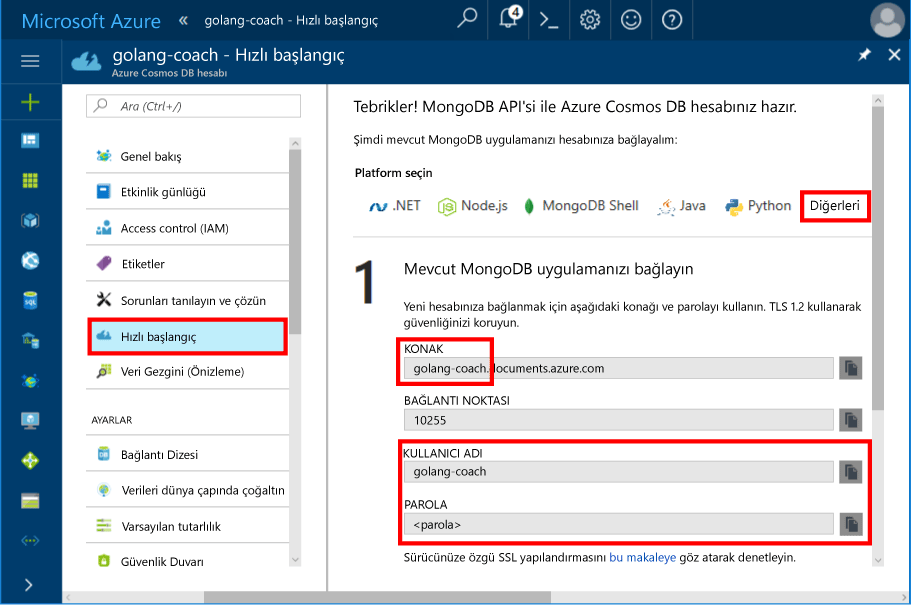
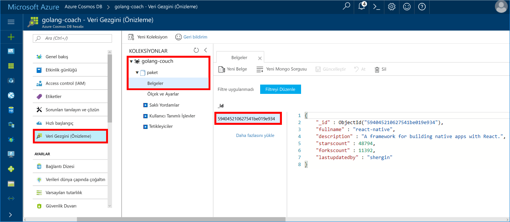

# <a name="azure-cosmos-db-build-a-mongodb-api-console-app-with-golang-and-hello-azure-portal"></a>Azure Cosmos DB: Golang ile MongoDB API konsol uygulaması oluşturma ve Azure portal hello

Azure Cosmos DB, Microsoft'un genel olarak dağıtılmış çok modelli veritabanı hizmetidir. Hızlı bir şekilde oluşturmak ve belge, anahtar/değer ve grafik veritabanları, her biri hello genel dağıtım ve yatay ölçek özelliklerini Azure Cosmos DB'nin hello çekirdek yararlı sorgulayabilirsiniz.

Bu hızlı başlangıç gösteren nasıl varolan toouse [MongoDB](https://docs.microsoft.com/en-us/azure/cosmos-db/mongodb-introduction) yazılmış uygulama [Golang](https://golang.org/) ve MongoDB istemci bağlantılarını destekleyen tooyour Azure Cosmos DB veritabanına bağlanın.

Diğer bir deyişle, Golang uygulamanız yalnızca MongoDB API'lerini kullanarak tooa veritabanına bağlanma olduğunu bilir. Saydam veri hello toohello uygulama Azure Cosmos DB içinde depolanır.

## <a name="prerequisites"></a>Ön koşullar

- Azure aboneliği. Azure aboneliğiniz yoksa başlamadan önce [ücretsiz bir hesap](https://azure.microsoft.com/free) oluşturun.
- [Git](https://golang.org/dl/) ve hello temel bilgiye [Git](https://golang.org/) dili.
- Bir IDE: Jetbrains tarafından sağlanan [Gogland](https://www.jetbrains.com/go/), Microsoft tarafından sağlanan [Visual Studio Code](https://code.visualstudio.com/) veya [Atom](https://atom.io/). Bu öğreticide Goglang’i kullanıyorum.

<a id="create-account"></a>
## <a name="create-a-database-account"></a>Veritabanı hesabı oluşturma

[!INCLUDE [cosmos-db-create-dbaccount](../../includes/cosmos-db-create-dbaccount-mongodb.md)]

## <a name="clone-hello-sample-application"></a>Merhaba örnek uygulaması kopyalama

Merhaba örnek uygulaması kopyalama ve gerekli hello paketlerini yükleyin.

1. Varsayılan olarak C:\Go\ olan hello GOROOT\src klasörünün içindeki CosmosDBSample adlı bir klasör oluşturun.
2. Git terminal penceresi git bash tooclone hello örnek deposu gibi hello CosmosDBSample klasörüne kullanarak komutu aşağıdaki hello çalıştırın. 

    ```bash
    git clone https://github.com/Azure-Samples/azure-cosmos-db-mongodb-golang-getting-started.git
    ```
3.  Çalışma hello aşağıdaki tooget hello mgo paket komutu. 

    ```
    go get gopkg.in/mgo.v2
    ```

Merhaba [mgo](http://labix.org/mgo) sürücüsü (olarak belirgin *mango*) olan bir [MongoDB](http://www.mongodb.org/) hello için sürücü [Git dil](http://golang.org/) zengin bir uygular ve test Standart Git deyimleri aşağıdaki çok basit bir API altında özellik seçimi.

<a id="connection-string"></a>

## <a name="update-your-connection-string"></a>Bağlantı dizenizi güncelleştirme

Şimdi Azure portal tooget toohello bağlantı dizesi bilgilerinizi geri dönün ve hello uygulamaya kopyalayın.

1. Tıklatın **Hızlı Başlangıç** sol gezinti menüsü hello ve ardından **diğer** tooview hello bağlantı dizesi bilgilerini hello Git uygulama tarafından gerekli.

2. Goglang, hello GOROOT\CosmosDBSample dizininde hello main.go dosyasını açın ve hello ekran aşağıdaki gösterildiği gibi hello bağlantı dizesi bilgileri hello Azure portal kullanarak kod satırı aşağıdaki hello güncelleştirin. 

    Merhaba veritabanı adıdır hello hello öneki **konak** hello Azure portal bağlantı dizesi bölmesinde değeri. Merhaba resimde gösterilen hello hesabı için golang Çalıştırıcı hello veritabanı adı değil.

    ```go
    Database: "hello prefix of hello Host value in hello Azure portal",
    Username: "hello Username in hello Azure portal",
    Password: "hello Password in hello Azure portal",
    ```

    

3. Merhaba main.go dosyasını kaydedin.

## <a name="review-hello-code"></a>Merhaba kod gözden geçirme

Neler olduğuna dair hello main.go dosyasında hızlı bir gözden geçirme olalım. 

### <a name="connecting-hello-go-app-tooazure-cosmos-db"></a>Merhaba Git uygulama tooAzure Cosmos DB bağlanma

Azure Cosmos DB hello SSL etkin MongoDB destekler. tooconnect tooan SSL etkin MongoDB, gereksinim duyduğunuz toodefine hello **DialServer** işlevi [mgo. DialInfo](http://gopkg.in/mgo.v2#DialInfo)ve yapın hello kullan [tls. *Arama* ](http://golang.org/pkg/crypto/tls#Dial) işlev tooperform hello bağlantı.

Golang kod parçacığını aşağıdaki hello hello Git uygulama Azure Cosmos DB MongoDB API'si ile bağlanır. Merhaba *DialInfo* sınıf, MongoDB kümesi ile bir oturumu için seçenekleri içerir.

```go
// DialInfo holds options for establishing a session with a MongoDB cluster.
dialInfo := &mgo.DialInfo{
    Addrs:    []string{"golang-couch.documents.azure.com:10255"}, // Get HOST + PORT
    Timeout:  60 * time.Second,
    Database: "database", // It can be anything
    Username: "username", // Username
    Password: "Azure database connect password from Azure Portal", // PASSWORD
    DialServer: func(addr *mgo.ServerAddr) (net.Conn, error) {
        return tls.Dial("tcp", addr.String(), &tls.Config{})
    },
}

// Create a session which maintains a pool of socket connections
// tooour Azure Cosmos DB MongoDB database.
session, err := mgo.DialWithInfo(dialInfo)

if err != nil {
    fmt.Printf("Can't connect toomongo, go error %v\n", err)
    os.Exit(1)
}

defer session.Close()

// SetSafe changes hello session safety mode.
// If hello safe parameter is nil, hello session is put in unsafe mode, 
// and writes become fire-and-forget,
// without error checking. hello unsafe mode is faster since operations won't hold on waiting for a confirmation.
// 
session.SetSafe(&mgo.Safe{})
```

Merhaba **mgo. Dial()** yöntemi, hiçbir SSL bağlantısı olduğunda kullanılır. Bir SSL bağlantısı için hello **mgo. DialWithInfo()** yöntemi gereklidir.

Merhaba örneği **DialWIthInfo {}** kullanılan toocreate hello oturum nesnesi bir nesnedir. Merhaba oturum kurulduktan sonra aşağıdaki kod parçacığını hello kullanarak hello koleksiyonuna erişebilirsiniz:

```go
collection := session.DB(“database”).C(“package”)
```

<a id="create-document"></a>

### <a name="create-a-document"></a>Belge oluşturma

```go
// Model
type Package struct {
    Id bson.ObjectId  `bson:"_id,omitempty"`
    FullName      string
    Description   string
    StarsCount    int
    ForksCount    int
    LastUpdatedBy string
}

// insert Document in collection
err = collection.Insert(&Package{
    FullName:"react",
    Description:"A framework for building native apps with React.",
    ForksCount: 11392,
    StarsCount:48794,
    LastUpdatedBy:"shergin",

})

if err != nil {
    log.Fatal("Problem inserting data: ", err)
    return
}
```

### <a name="query-or-read-a-document"></a>Bir belgeyi sorgulama veya okuma

Azure Cosmos DB, her bir koleksiyonda depolanan JSON belgeleri için zengin sorguların gerçekleştirilmesini destekler. Merhaba aşağıdaki örnek kod koleksiyonunuzda hello belgeleri karşı çalıştırabileceğiniz bir sorguyu gösterir.

```go
// Get a Document from hello collection
result := Package{}
err = collection.Find(bson.M{"fullname": "react"}).One(&result)
if err != nil {
    log.Fatal("Error finding record: ", err)
    return
}

fmt.Println("Description:", result.Description)
```


### <a name="update-a-document"></a>Bir belgeyi güncelleştirme

```go
// Update a document
updateQuery := bson.M{"_id": result.Id}
change := bson.M{"$set": bson.M{"fullname": "react-native"}}
err = collection.Update(updateQuery, change)
if err != nil {
    log.Fatal("Error updating record: ", err)
    return
}
```

### <a name="delete-a-document"></a>Bir belgeyi silme

Azure Cosmos DB, JSON belgelerini silmeyi destekler.

```go
// Delete a document
query := bson.M{"_id": result.Id}
err = collection.Remove(query)
if err != nil {
   log.Fatal("Error deleting record: ", err)
   return
}
```
    
## <a name="run-hello-app"></a>Merhaba uygulamayı çalıştırma

1. Goglang içinde GOPATH emin olun (altında kullanılabilir **dosya**, **ayarları**, **Git**, **GOPATH**) hangi hello hello konumda içerir gopkg, USERPROFILE\go olduğu varsayılan olarak yüklendi. 
2. Merhaba belge çalışan hello uygulamasının adını görebilmeniz için hello belge, satırları 91-96 Sil hello satırları açıklama.
3. Goglang’de **Çalıştır**’a ve ardından **'Main.go’yu derle ve çalıştır'ı çalıştır**’a tıklayın.

    Merhaba uygulama tamamlandıktan ve oluşturulan hello belge hello açıklamasını görüntüler [bir belge oluşturmak](#create-document).
    
    ```
    Description: A framework for building native apps with React.
    
    Process finished with exit code 0
    ```

    
    
## <a name="review-your-document-in-data-explorer"></a>Veri Gezgini’nde belgenizi gözden geçirin

Azure portal toosee toohello Veri Gezgini belgenize dönün.

1. Tıklatın **Veri Gezgini (Önizleme)** hello sol gezinti menüsünde genişletin **golang Çalıştırıcı**, **paket**ve ardından **belgeleri**. Merhaba, **belgeleri** sekmesini ve ardından hello \_kimliği toodisplay hello belge hello sağ bölmedeki. 

    
    
2. Daha sonra iş hello belge satır içi ve tıklatın **güncelleştirme** toosave onu. Merhaba belge silin veya yeni belgeler veya sorgular oluşturun.

## <a name="review-slas-in-hello-azure-portal"></a>Gözden geçirme SLA'hello Azure portalı

[!INCLUDE [cosmosdb-tutorial-review-slas](../../includes/cosmos-db-tutorial-review-slas.md)]

## <a name="clean-up-resources"></a>Kaynakları temizleme

Toocontinue toouse bu uygulamayı değil kullanacaksanız, bu hızlı başlangıç tarafından hello Azure portalında aşağıdaki adımları hello ile oluşturulan tüm kaynakları silin:

1. Merhaba sol taraftaki menüden hello Azure portal'ın, **kaynak grupları** ve ardından oluşturduğunuz hello kaynak hello adına tıklayın. 
2. Kaynak grubu sayfanızda tıklatın **silmek**hello metin kutusuna hello kaynak toodelete hello adını yazın ve ardından **silmek**.

## <a name="next-steps"></a>Sonraki adımlar

Bu hızlı başlangıç nasıl toocreate Azure Cosmos DB hesabınız ve Golang uygulamasını kullanarak çalışma MongoDB için API hello öğrendiniz. Artık ek verileri tooyour Cosmos DB hesap içeri aktarabilirsiniz. 

> [!div class="nextstepaction"]
> [Merhaba MongoDB API Azure Cosmos Veritabanına veri alma](mongodb-migrate.md)
