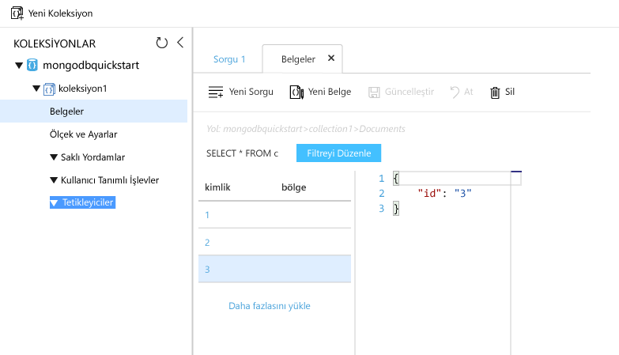

# <a name="azure-cosmos-db-migrate-an-existing-nodejs-mongodb-web-app"></a>Azure Cosmos DB: Var olan bir Node.js MongoDB web uygulamasını geçirme 

Azure Cosmos DB, Microsoft'un genel olarak dağıtılmış çok modelli veritabanı hizmetidir. Hızlı bir şekilde oluşturmak ve belge, anahtar/değer ve grafik veritabanları, her biri hello genel dağıtım ve yatay ölçek özelliklerini Azure Cosmos DB'nin hello çekirdek yararlı sorgulayabilirsiniz. 

Bu hızlı başlangıç gösteren nasıl varolan toouse [MongoDB](mongodb-introduction.md) Node.js içinde yazılmış uygulama ve MongoDB istemci bağlantılarını destekleyen tooyour Azure Cosmos DB veritabanına bağlanın. Diğer bir deyişle, Node.js uygulamanızı yalnızca MongoDB API'lerini kullanarak tooa veritabanına bağlanma olduğunu bilir. Saydam veri hello toohello uygulama Azure Cosmos DB içinde depolanır.

İşiniz bittiğinde, [Azure Cosmos DB](https://azure.microsoft.com/services/cosmos-db/) üzerinde çalışan bir MEAN uygulamanız (MongoDB, Express, AngularJS ve Node.js) olacaktır. 


[!INCLUDE [cloud-shell-try-it](../../includes/cloud-shell-try-it.md)]

Tooinstall seçin ve hello CLI yerel olarak kullanırsanız, bu konuda hello Azure CLI Sürüm 2.0 veya üstü çalıştığını gerektirir. Çalıştırma `az --version` toofind hello sürümü. Tooinstall veya yükseltme gerekirse bkz [Azure CLI 2.0 yükleme]( /cli/azure/install-azure-cli). 

## <a name="prerequisites"></a>Ön koşullar 
Ayrıca tooAzure CLI, gereksinim duyduğunuz [Node.js](https://nodejs.org/) ve [Git](http://www.git-scm.com/downloads) toorun yerel olarak yüklenmiş `npm` ve `git` komutları.

Node.js çalıştırma bilgisine sahip olmanız gerekir. Bu hızlı başlangıç hedeflenen toohelp değil, genel Node.js uygulamaları geliştirme ile.

## <a name="clone-hello-sample-application"></a>Merhaba örnek uygulaması kopyalama

Git bash gibi bir git terminal penceresi açın ve `cd` tooa çalışma dizini.  

Aşağıdaki komutları tooclone hello örnek depo hello çalıştırın. Bu örnek depo hello varsayılan içerir [MEAN.js](http://meanjs.org/) uygulama. 

```bash
git clone https://github.com/prashanthmadi/mean
```

## <a name="run-hello-application"></a>Merhaba uygulamayı çalıştırın

Merhaba gerekli paketleri yüklemek ve hello uygulamasını başlatın.

```bash
cd mean
npm install
npm start
```

## <a name="log-in-tooazure"></a>İçinde tooAzure oturum

Yüklü bir Azure CLI kullanıyorsanız, tooyour hello Azure aboneliğinizle oturumu [az oturum açma](/cli/azure/#login) komut ve hello ekrandaki yönergeleri izleyin. Hello Azure bulut Kabuk kullanıyorsanız bu adımı atlayabilirsiniz.

```azurecli
az login 
``` 
   
## <a name="add-hello-azure-cosmos-db-module"></a>Hello Azure Cosmos DB Modül Ekle

Yüklü bir Azure CLI kullanıyorsanız, toosee hello denetleyin `cosmosdb` bileşeni zaten yüklüyse hello çalıştırarak `az` komutu. Varsa `cosmosdb` olan hello temel komutların listesi, toohello sonraki komutu devam. Hello Azure bulut Kabuk kullanıyorsanız bu adımı atlayabilirsiniz.

Varsa `cosmosdb` hello temel komutların listesi, yeniden değil [Azure CLI 2.0]( /cli/azure/install-azure-cli).

## <a name="create-a-resource-group"></a>Kaynak grubu oluşturma

Oluşturma bir [kaynak grubu](../azure-resource-manager/resource-group-overview.md) hello ile [az grubu oluşturma](/cli/azure/group#create). Azure kaynak grubu; web uygulamaları, veritabanları ve depolama hesapları gibi Azure kaynaklarının dağıtıldığı ve yönetildiği bir mantıksal kapsayıcıdır. 

Merhaba aşağıdaki örnekte bir kaynak grubu hello Batı Avrupa bölgede oluşturur. Merhaba kaynak grubu için benzersiz bir ad seçin.

Azure bulut Kabuk kullanıyorsanız **deneyin**hello ekrandaki yönergeleri toologin izleyin, sonra hello komutu hello komut istemi kopyalayın.

```azurecli-interactive
az group create --name myResourceGroup --location "West Europe"
```

## <a name="create-an-azure-cosmos-db-account"></a>Azure Cosmos DB hesabı oluşturma

Merhaba ile bir Azure Cosmos DB oluşturursunuz [az cosmosdb oluşturma](/cli/azure/cosmosdb#create) komutu.

Hello hello gördüğünüz kendi benzersiz Azure Cosmos DB hesap adı Lütfen yerine komutu, aşağıdaki `<cosmosdb-name>` yer tutucu. Bu benzersiz bir ad Azure Cosmos DB uç noktanızı bir parçası olarak kullanılacak (`https://<cosmosdb-name>.documents.azure.com/`), hello adı toobe benzersiz Azure içindeki tüm Azure Cosmos DB hesaplar arasında olmalıdır. 

```azurecli-interactive
az cosmosdb create --name <cosmosdb-name> --resource-group myResourceGroup --kind MongoDB
```

Merhaba `--kind MongoDB` parametresi MongoDB istemci bağlantıları sağlar.

Hello Azure Cosmos DB hesabı oluşturulduğunda, hello Azure CLI örnek aşağıdaki bilgileri benzer toohello gösterir. 

> [!NOTE]
> Bu örnek, JSON hello varsayılan değer olan hello Azure CLI çıktı biçimi kullanır. başka bir çıkış toouse biçimlendirmek için bkz: [çıktı biçimi Azure CLI 2.0 komutlar için](https://docs.microsoft.com/cli/azure/format-output-azure-cli).

```json
{
  "databaseAccountOfferType": "Standard",
  "documentEndpoint": "https://<cosmosdb-name>.documents.azure.com:443/",
  "id": "/subscriptions/00000000-0000-0000-0000-000000000000/resourceGroups/myResourceGroup/providers/Microsoft.Document
DB/databaseAccounts/<cosmosdb-name>",
  "kind": "MongoDB",
  "location": "West Europe",
  "name": "<cosmosdb-name>",
  "readLocations": [
    {
      "documentEndpoint": "https://<cosmosdb-name>-westeurope.documents.azure.com:443/",
      "failoverPriority": 0,
      "id": "<cosmosdb-name>-westeurope",
      "locationName": "West Europe",
      "provisioningState": "Succeeded"
    }
  ],
  "resourceGroup": "myResourceGroup",
  "type": "Microsoft.DocumentDB/databaseAccounts",
  "writeLocations": [
    {
      "documentEndpoint": "https://<cosmosdb-name>-westeurope.documents.azure.com:443/",
      "failoverPriority": 0,
      "id": "<cosmosdb-name>-westeurope",
      "locationName": "West Europe",
      "provisioningState": "Succeeded"
    }
  ]
} 
```

## <a name="connect-your-nodejs-application-toohello-database"></a>Node.js uygulaması toohello veritabanına bağlanın

Bu adımda, MongoDB bağlantı dizesi kullanarak oluşturduğunuz MEAN.js örnek uygulama tooan Azure Cosmos DB veritabanınız bağlayın. 

<a name="devconfig"></a>
## <a name="configure-hello-connection-string-in-your-nodejs-application"></a>Node.js uygulamanızda Hello bağlantı dizesini yapılandırma

MEAN.js deponuzda `config/env/local-development.js` dosyasını açın.

Bu dosyanın Merhaba içeriğine koddan hello ile değiştirin. Tooalso Değiştir hello iki emin olun `<cosmosdb-name>` Azure Cosmos DB hesap adınızı yer tutucularını.

```javascript
'use strict';

module.exports = {
  db: {
    uri: 'mongodb://<cosmosdb-name>:<primary_master_key>@<cosmosdb-name>.documents.azure.com:10255/mean-dev?ssl=true&sslverifycertificate=false'
  }
};
```

## <a name="retrieve-hello-key"></a>Başlangıç anahtarı alma

Sipariş tooconnect tooan Azure Cosmos DB veritabanı'nda hello veritabanı anahtarı gerekir. Kullanım hello [az cosmosdb listesi anahtarlar](/cli/azure/cosmosdb#list-keys) komutu tooretrieve hello birincil anahtar.

```azurecli-interactive
az cosmosdb list-keys --name <cosmosdb-name> --resource-group myResourceGroup --query "primaryMasterKey"
```

Hello Azure CLI bilgi benzer toohello aşağıdaki örneğine çıkarır. 

```json
"RUayjYjixJDWG5xTqIiXjC..."
```

Merhaba değerini kopyalayın `primaryMasterKey`. Bu hello Yapıştır `<primary_master_key>` içinde `local-development.js`.

Yaptığınız değişiklikleri kaydedin.

### <a name="run-hello-application-again"></a>Merhaba uygulamayı yeniden çalıştırın.

`npm start` komutunu yeniden çalıştırın. 

```bash
npm start
```

Konsol iletisi şimdi bu hello geliştirme ortamı çalışır durumda söyleyecektir. 

Çok gidin`http://localhost:3000` bir tarayıcıda. Tıklatın **kaydolun** hello üst menü ve try toocreate içinde iki kullanıcılar kukla. 

Merhaba MEAN.js örnek uygulamanın kullanıcı verilerini hello veritabanında depolar. Başarılı ve Azure Cosmos DB bağlantınızın çalıştığından sonra MEAN.js hello oturum açtığında kullanıcı, otomatik olarak oluşturmuştur. istiyorsanız. 


## <a name="view-data-in-data-explorer"></a>Veri Gezgini’nde verileri görüntüleme

Bir Azure Cosmos DB tarafından depolanan verileri kullanılabilir tooview, sorgu ve çalıştırma iş mantığı hello Azure portal açıktır.

tooview, sorgu ve iş hello önceki adımda, oturum açma toohello oluşturduğunuz hello kullanıcı verileriyle [Azure portal](https://portal.azure.com) web tarayıcınızda.

Azure Cosmos DB Hello üst arama kutusuna yazın. Cosmos DB hesabı dikey penceresi açıldığında Cosmos DB hesabınızı seçin. Sol gezinti hello veri Explorer'ı tıklatın. Koleksiyonunuz hello Koleksiyonlar bölmesinde genişletin ve ardından hello koleksiyon, sorgu hello veri hello belgeleri görüntülemek ve hatta oluşturabilir ve saklı yordamlar, tetikleyiciler ve UDF'lerin çalıştırın. 




## <a name="deploy-hello-nodejs-application-tooazure"></a>Merhaba Node.js uygulaması tooAzure dağıtma

Bu adımda, MongoDB bağlı Node.js uygulaması tooAzure Cosmos DB dağıtın.

Daha önce değiştirilen hello yapılandırma dosyasının hello geliştirme ortamı için olduğunu fark etmiş olabilirsiniz (`/config/env/local-development.js`). Uygulama tooApp hizmet dağıttığınızda, varsayılan olarak hello üretim ortamında çalıştırılır. Şimdi, toomake hello ihtiyacınız aynı toohello ilgili yapılandırma dosyasını değiştirin.

MEAN.js deponuzda `config/env/production.js` dosyasını açın.

Merhaba, `db` nesne, hello değerini `uri` aşağıdaki örneğine hello olarak göster. Emin tooreplace hello yer tutucu olarak önce olmalıdır.

```javascript
'mongodb://<cosmosdb-name>:<primary_master_key>@<cosmosdb-name>.documents.azure.com:10255/mean?ssl=true&sslverifycertificate=false',
```

> [!NOTE] 
> Merhaba `ssl=true` seçeneği önemlidir çünkü [Azure Cosmos DB SSL gerekir](connect-mongodb-account.md#connection-string-requirements). 
>
>

Hello terminal, tüm değişikliklerinizi Git içine uygulayın. Her iki komutları toorun kopyalayabilirsiniz birlikte bunları.

```bash
git add .
git commit -m "configured MongoDB connection string"
```
## <a name="clean-up-resources"></a>Kaynakları temizleme

Toocontinue toouse bu uygulamayı değil kullanacaksanız, bu hızlı başlangıç tarafından hello Azure portalında aşağıdaki adımları hello ile oluşturulan tüm kaynakları silin:

1. Merhaba sol taraftaki menüden hello Azure portal'ın, **kaynak grupları** ve ardından oluşturduğunuz hello kaynak hello adına tıklayın. 
2. Kaynak grubu sayfanızda tıklatın **silmek**hello metin kutusuna hello kaynak toodelete hello adını yazın ve ardından **silmek**.

## <a name="next-steps"></a>Sonraki adımlar

Bu Hızlı Başlangıç, öğrendiğinize nasıl toocreate bir Azure Cosmos DB hesap ve hello Veri Gezgini'ni kullanarak bir MongoDB koleksiyonu oluşturun. Şimdi, MongoDB veri tooAzure Cosmos DB geçirebilirsiniz.  

> [!div class="nextstepaction"]
> [Azure Cosmos DB’ye MongoDB verileri aktarma](mongodb-migrate.md)
