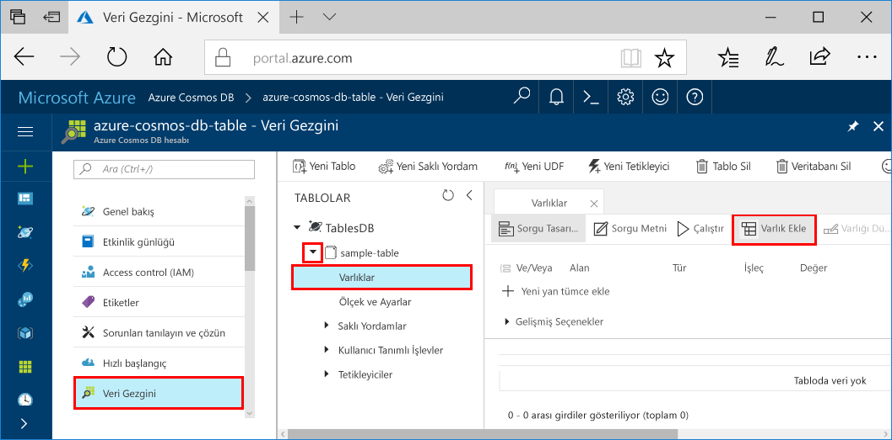

# <a name="azure-cosmos-db-build-a-net-application-using-the-table-api"></a><span data-ttu-id="94d73-103">Azure Cosmos DB: Tablo API'sini kullanarak bir .NET uygulaması derleme</span><span class="sxs-lookup"><span data-stu-id="94d73-103">Azure Cosmos DB: Build a .NET application using the Table API</span></span>

<span data-ttu-id="94d73-104">Azure Cosmos DB, Microsoft'un genel olarak dağıtılmış çok modelli veritabanı hizmetidir.</span><span class="sxs-lookup"><span data-stu-id="94d73-104">Azure Cosmos DB is Microsoft’s globally distributed multi-model database service.</span></span> <span data-ttu-id="94d73-105">Bu hizmetle belge, anahtar/değer ve grafik veritabanlarını kolayca oluşturup sorgulayabilir ve tüm bunları yaparken Azure Cosmos DB'nin genel dağıtım ve yatay ölçeklendirme özelliklerinden faydalanabilirsiniz.</span><span class="sxs-lookup"><span data-stu-id="94d73-105">You can quickly create and query document, key/value, and graph databases, all of which benefit from the global distribution and horizontal scale capabilities at the core of Azure Cosmos DB.</span></span> 

<span data-ttu-id="94d73-106">Bu hızlı başlangıç belgesinde Azure portalı kullanarak bir Azure Cosmos DB hesabını oluşturma ve bu hesap içinde tablo oluşturma işlemi anlatılmıştır.</span><span class="sxs-lookup"><span data-stu-id="94d73-106">This quick start demonstrates how to create an Azure Cosmos DB account, and create a table within that account using the Azure portal.</span></span> <span data-ttu-id="94d73-107">Varlıkları eklemek, güncelleştirmek ve silmek için kod yazabilecek ve NuGet'in yeni [Windows Azure Storage Premium Table](https://aka.ms/premiumtablenuget) (önizleme) paketini kullanarak bazı sorguları çalıştırabileceksiniz.</span><span class="sxs-lookup"><span data-stu-id="94d73-107">You'll then write code to insert, update, and delete entities, and run some queries using the new [Windows Azure Storage Premium Table](https://aka.ms/premiumtablenuget) (preview) package from NuGet.</span></span> <span data-ttu-id="94d73-108">Bu kitaplık genel [Windows Azure Depolama SDK'sı](https://www.nuget.org/packages/WindowsAzure.Storage) ile aynı sınıf ve yöntem imzalarına sahip olmasının yanı sıra [Tablo API'sini](table-introduction.md) (önizleme) kullanarak Azure Cosmos DB hesaplarına da bağlanabilir.</span><span class="sxs-lookup"><span data-stu-id="94d73-108">This library has the same classes and method signatures as the public [Windows Azure Storage SDK](https://www.nuget.org/packages/WindowsAzure.Storage), but also has the ability to connect to Azure Cosmos DB accounts using the [Table API](table-introduction.md) (preview).</span></span> 

## <a name="prerequisites"></a><span data-ttu-id="94d73-109">Ön koşullar</span><span class="sxs-lookup"><span data-stu-id="94d73-109">Prerequisites</span></span>

<span data-ttu-id="94d73-110">Henüz Visual Studio 2017’yi yüklemediyseniz, **ücretsiz** [Visual Studio 2017 Community Edition](https://www.visualstudio.com/downloads/)’ı indirip kullanabilirsiniz.</span><span class="sxs-lookup"><span data-stu-id="94d73-110">If you don’t already have Visual Studio 2017 installed, you can download and use the **free** [Visual Studio 2017 Community Edition](https://www.visualstudio.com/downloads/).</span></span> <span data-ttu-id="94d73-111">Visual Studio kurulumu sırasında **Azure dağıtımını** etkinleştirdiğinizden emin olun.</span><span class="sxs-lookup"><span data-stu-id="94d73-111">Make sure that you enable **Azure development** during the Visual Studio setup.</span></span>

[!INCLUDE [quickstarts-free-trial-note](../../includes/quickstarts-free-trial-note.md)]

## <a name="create-a-database-account"></a><span data-ttu-id="94d73-112">Veritabanı hesabı oluşturma</span><span class="sxs-lookup"><span data-stu-id="94d73-112">Create a database account</span></span>

[!INCLUDE [cosmos-db-create-dbaccount-table](../../includes/cosmos-db-create-dbaccount-table.md)]

## <a name="add-a-table"></a><span data-ttu-id="94d73-113">Tablo ekleme</span><span class="sxs-lookup"><span data-stu-id="94d73-113">Add a table</span></span>

[!INCLUDE [cosmos-db-create-table](../../includes/cosmos-db-create-table.md)]

## <a name="add-sample-data"></a><span data-ttu-id="94d73-114">Örnek verileri ekleme</span><span class="sxs-lookup"><span data-stu-id="94d73-114">Add sample data</span></span>

<span data-ttu-id="94d73-115">Artık Veri Gezgini'ni (Önizleme) kullanarak yeni tablonuza veri ekleyebilirsiniz.</span><span class="sxs-lookup"><span data-stu-id="94d73-115">You can now add data to your new table using Data Explorer (Preview).</span></span>

1. <span data-ttu-id="94d73-116">Veri Gezgini'nde **sample-table** seçeneğini genişletin, **Varlıklar**'a ve ardından **Varlık Ekle**'ye tıklayın.</span><span class="sxs-lookup"><span data-stu-id="94d73-116">In Data Explorer, expand **sample-table**, click **Entities**, and then click **Add Entity**.</span></span>

   
2. <span data-ttu-id="94d73-118">Şimdi PartitionKey değer kutusu ile RowKey değer kutusuna verileri ekleyin ve **Varlık Ekle**’ye tıklayın.</span><span class="sxs-lookup"><span data-stu-id="94d73-118">Now add data to the PartitionKey value box and RowKey value box, and click **Add Entity**.</span></span>

   
  
    <span data-ttu-id="94d73-120">Artık tablonuza daha fazla varlık ekleyebilir, varlıklarınızı düzenleyebilir veya Veri Gezgini’nde verilerinizi sorgulayabilirsiniz.</span><span class="sxs-lookup"><span data-stu-id="94d73-120">You can now add more entities to your table, edit your entities, or query your data in Data Explorer.</span></span> <span data-ttu-id="94d73-121">Veri Gezgini ayrıca aktarım hızınızı ölçeklendirebileceğiniz ve tablonuza depolanmış yordamlar, kullanıcı tarafından tanımlanmış işlevler ve tetikleyiciler ekleyebileceğiniz yerdir.</span><span class="sxs-lookup"><span data-stu-id="94d73-121">Data Explorer is also where you can scale your throughput and add stored procedures, user defined functions, and triggers to your table.</span></span>

## <a name="clone-the-sample-application"></a><span data-ttu-id="94d73-122">Örnek uygulamayı kopyalama</span><span class="sxs-lookup"><span data-stu-id="94d73-122">Clone the sample application</span></span>

<span data-ttu-id="94d73-123">Şimdi GitHub'dan bir Tablo uygulaması kopyalayalım, bağlantı dizesini ayarlayalım ve uygulamayı çalıştıralım.</span><span class="sxs-lookup"><span data-stu-id="94d73-123">Now let's clone a Table app from github, set the connection string, and run it.</span></span> <span data-ttu-id="94d73-124">Verilerle programlı bir şekilde çalışmanın ne kadar kolay olduğunu göreceksiniz.</span><span class="sxs-lookup"><span data-stu-id="94d73-124">You'll see how easy it is to work with data programmatically.</span></span> 

1. <span data-ttu-id="94d73-125">Git bash gibi bir git terminal penceresi açın ve `cd` ile çalışma dizinine gidin.</span><span class="sxs-lookup"><span data-stu-id="94d73-125">Open a git terminal window, such as git bash, and `cd` to a working directory.</span></span>  

2. <span data-ttu-id="94d73-126">Örnek depoyu kopyalamak için aşağıdaki komutu çalıştırın.</span><span class="sxs-lookup"><span data-stu-id="94d73-126">Run the following command to clone the sample repository.</span></span> 

    ```bash
    git clone https://github.com/Azure-Samples/azure-cosmos-db-table-dotnet-getting-started.git
    ```

3. <span data-ttu-id="94d73-127">Ardından çözüm dosyasını Visual Studio'da açın.</span><span class="sxs-lookup"><span data-stu-id="94d73-127">Then open the solution file in Visual Studio.</span></span> 

## <a name="review-the-code"></a><span data-ttu-id="94d73-128">Kodu gözden geçirin</span><span class="sxs-lookup"><span data-stu-id="94d73-128">Review the code</span></span>

<span data-ttu-id="94d73-129">Uygulamada gerçekleşen işlemleri hızlıca gözden geçirelim.</span><span class="sxs-lookup"><span data-stu-id="94d73-129">Let's make a quick review of what's happening in the app.</span></span> <span data-ttu-id="94d73-130">Program.cs dosyasını açtığınızda Azure Cosmos DB kaynaklarını bu kod satırlarının oluşturduğunu göreceksiniz.</span><span class="sxs-lookup"><span data-stu-id="94d73-130">Open the Program.cs file and you'll find that these lines of code create the Azure Cosmos DB resources.</span></span> 

* <span data-ttu-id="94d73-131">CloudTableClient başlatılır.</span><span class="sxs-lookup"><span data-stu-id="94d73-131">The CloudTableClient is initialized.</span></span>

    ```csharp
    CloudStorageAccount storageAccount = CloudStorageAccount.Parse(connectionString); 
    CloudTableClient tableClient = storageAccount.CreateCloudTableClient();
    ```

* <span data-ttu-id="94d73-132">Henüz yoksa yeni bir tablo oluşturulur.</span><span class="sxs-lookup"><span data-stu-id="94d73-132">A new table is created if it does not exist.</span></span>

    ```csharp
    CloudTable table = tableClient.GetTableReference("people");
    table.CreateIfNotExists();
    ```

* <span data-ttu-id="94d73-133">Yeni bir Tablo kapsayıcısı oluşturulur.</span><span class="sxs-lookup"><span data-stu-id="94d73-133">A new Table container is created.</span></span> <span data-ttu-id="94d73-134">Bu kodun normal Azure Tablo depolama SDK'sına çok benzer olduğunu fark edeceksiniz.</span><span class="sxs-lookup"><span data-stu-id="94d73-134">You will notice this code very similar to regular Azure Table storage SDK.</span></span> 

    ```csharp
    CustomerEntity item = new CustomerEntity()
                {
                    PartitionKey = Guid.NewGuid().ToString(),
                    RowKey = Guid.NewGuid().ToString(),
                    Email = $"{GetRandomString(6)}@contoso.com",
                    PhoneNumber = "425-555-0102",
                    Bio = GetRandomString(1000)
                };
    ```

## <a name="update-your-connection-string"></a><span data-ttu-id="94d73-135">Bağlantı dizenizi güncelleştirme</span><span class="sxs-lookup"><span data-stu-id="94d73-135">Update your connection string</span></span>

<span data-ttu-id="94d73-136">Şimdi bağlantı dizesi bilgilerini güncelleştireceğiz. Böylece uygulamanız Azure Cosmos DB ile iletişim kurabilecek.</span><span class="sxs-lookup"><span data-stu-id="94d73-136">Now we'll update the connection string information so your app can talk to Azure Cosmos DB.</span></span> 

1. <span data-ttu-id="94d73-137">Visual Studio'da app.config dosyasını açın.</span><span class="sxs-lookup"><span data-stu-id="94d73-137">In Visual Studio, open the app.config file.</span></span> 

2. <span data-ttu-id="94d73-138">[Azure portalının](http://portal.azure.com/) solunda bulunan Azure Cosmos DB gezinti menüsünde **Bağlantı Dizesi**'ne tıklayın.</span><span class="sxs-lookup"><span data-stu-id="94d73-138">In the [Azure portal](http://portal.azure.com/), in the Azure Cosmos DB left navigation menu, click **Connection String**.</span></span> <span data-ttu-id="94d73-139">Ardından yeni bölmede bağlantı dizesine ilişkin Kopyala düğmesine tıklayın.</span><span class="sxs-lookup"><span data-stu-id="94d73-139">Then in the new pane click the copy button for the connection string.</span></span> 

    

3. <span data-ttu-id="94d73-141">Değeri app.config dosyasına PremiumStorageConnectionString değeri olarak yapıştırın.</span><span class="sxs-lookup"><span data-stu-id="94d73-141">Paste the value into the app.config file as the value of the PremiumStorageConnectionString.</span></span> 

    `<add key="PremiumStorageConnectionString" 
        value="DefaultEndpointsProtocol=https;AccountName=MYSTORAGEACCOUNT;AccountKey=AUTHKEY;TableEndpoint=https://COSMOSDB.documents.azure.com" />`    

    <span data-ttu-id="94d73-142">StandardStorageConnectionString değerini olduğu gibi bırakabilirsiniz.</span><span class="sxs-lookup"><span data-stu-id="94d73-142">You can leave the StandardStorageConnectionString as is.</span></span>

<span data-ttu-id="94d73-143">Bu adımlarla uygulamanıza Azure Cosmos DB ile iletişim kurması için gereken tüm bilgileri eklemiş oldunuz.</span><span class="sxs-lookup"><span data-stu-id="94d73-143">You've now updated your app with all the info it needs to communicate with Azure Cosmos DB.</span></span> 

## <a name="run-the-web-app"></a><span data-ttu-id="94d73-144">Web uygulamasını çalıştırma</span><span class="sxs-lookup"><span data-stu-id="94d73-144">Run the web app</span></span>

1. <span data-ttu-id="94d73-145">Visual Studio'da **Çözüm Gezgini**'ndeki **PremiumTableGetStarted** projesine sağ tıklayın ve ardından **NuGet Paketlerini Yönet**'e tıklayın.</span><span class="sxs-lookup"><span data-stu-id="94d73-145">In Visual Studio, right-click on the **PremiumTableGetStarted** project in **Solution Explorer** and then click **Manage NuGet Packages**.</span></span> 

2. <span data-ttu-id="94d73-146">NuGet'teki **Gözat** kutusuna *WindowsAzure.Storage PremiumTable* yazın.</span><span class="sxs-lookup"><span data-stu-id="94d73-146">In the NuGet **Browse** box, type *WindowsAzure.Storage-PremiumTable*.</span></span>

3. <span data-ttu-id="94d73-147">**Ön sürümü dahil et** kutusunu işaretleyin.</span><span class="sxs-lookup"><span data-stu-id="94d73-147">Check the **Include prerelease** box.</span></span> 

4. <span data-ttu-id="94d73-148">Sonuçlar arasında yer alan **WindowsAzure.Storage-PremiumTable** kitaplığını yükleyin.</span><span class="sxs-lookup"><span data-stu-id="94d73-148">From the results, install the **WindowsAzure.Storage-PremiumTable** library.</span></span> <span data-ttu-id="94d73-149">Bunu yaptığınızda Azure Cosmos DB Tablo API paketinin önizlemesi ve tüm bağımlılıklar yüklenir.</span><span class="sxs-lookup"><span data-stu-id="94d73-149">This installs the preview Azure Cosmos DB Table API package as well as all dependencies.</span></span> <span data-ttu-id="94d73-150">Bu paketin Azure Tablo depolaması tarafından kullanılan Windows Azure Depolama paketinden farklı bir NuGet paketi olduğunu unutmayın.</span><span class="sxs-lookup"><span data-stu-id="94d73-150">Note that this is a different NuGet package than the Windows Azure Storage package used by Azure Table storage.</span></span> 

5. <span data-ttu-id="94d73-151">Uygulamayı çalıştırmak için CTRL+F5 tuşlarına basın.</span><span class="sxs-lookup"><span data-stu-id="94d73-151">Click CTRL + F5 to run the application.</span></span>

    <span data-ttu-id="94d73-152">Konsol penceresi; eklenen, alınan, sorgulanan, değiştirilen ve tablodan silinen verileri görüntüler.</span><span class="sxs-lookup"><span data-stu-id="94d73-152">The console window displays the data being added, retrieved, queried, replaced and deleted from the table.</span></span> <span data-ttu-id="94d73-153">Betik tamamlandığında herhangi bir tuşa basarak konsol penceresini kapatın.</span><span class="sxs-lookup"><span data-stu-id="94d73-153">When the script completes, press any key to close the console window.</span></span> 
    
    

6. <span data-ttu-id="94d73-155">Yeni varlıkları Veri Gezgini'nde görmek istiyorsanız için program.cs'de 188-208 numaralı satırları açıklama satırı yapmanız (silinmemeleri için) ve örneği tekrar çalıştırmanız yeterlidir.</span><span class="sxs-lookup"><span data-stu-id="94d73-155">If you want to see the new entities in Data Explorer, just comment out lines 188-208 in program.cs so they aren't deleted, then run the sample again.</span></span> 

    <span data-ttu-id="94d73-156">Şimdi Veri Gezgini'ne geri dönüp **Yenile** düğmesine tıklayın, **people** tablosunu genişletin ve **Varlıklar**'a tıklayın. Artık yeni verilerle çalışabilirsiniz.</span><span class="sxs-lookup"><span data-stu-id="94d73-156">You can now go back to Data Explorer, click **Refresh**, expand the **people** table and click **Entities**, and then work with this new data.</span></span> 

    

## <a name="review-slas-in-the-azure-portal"></a><span data-ttu-id="94d73-158">Azure portalında SLA'ları gözden geçirme</span><span class="sxs-lookup"><span data-stu-id="94d73-158">Review SLAs in the Azure portal</span></span>

[!INCLUDE [cosmosdb-tutorial-review-slas](../../includes/cosmos-db-tutorial-review-slas.md)]

## <a name="clean-up-resources"></a><span data-ttu-id="94d73-159">Kaynakları temizleme</span><span class="sxs-lookup"><span data-stu-id="94d73-159">Clean up resources</span></span>

<span data-ttu-id="94d73-160">Bu uygulamayı kullanmaya devam etmeyecekseniz aşağıdaki adımları kullanarak Azure portalında bu hızlı başlangıç tarafından oluşturulan tüm kaynakları silin:</span><span class="sxs-lookup"><span data-stu-id="94d73-160">If you're not going to continue to use this app, delete all resources created by this quickstart in the Azure portal with the following steps:</span></span> 

1. <span data-ttu-id="94d73-161">Azure portalında sol taraftaki menüden, **Kaynak grupları**'na ve ardından oluşturduğunuz kaynağın adına tıklayın.</span><span class="sxs-lookup"><span data-stu-id="94d73-161">From the left-hand menu in the Azure portal, click **Resource groups** and then click the name of the resource you created.</span></span> 
2. <span data-ttu-id="94d73-162">Kaynak grubu sayfanızda, **Sil**'e tıklayın, metin kutusuna silinecek kaynağın adını yazın ve ardından **Sil**'e tıklayın.</span><span class="sxs-lookup"><span data-stu-id="94d73-162">On your resource group page, click **Delete**, type the name of the resource to delete in the text box, and then click **Delete**.</span></span>

## <a name="next-steps"></a><span data-ttu-id="94d73-163">Sonraki adımlar</span><span class="sxs-lookup"><span data-stu-id="94d73-163">Next steps</span></span>

<span data-ttu-id="94d73-164">Bu hızlı başlangıçta Azure Cosmos DB hesabı oluşturmayı, Veri Gezgini'ni kullanarak tablo oluşturmayı ve bir uygulamayı çalıştırmayı öğrendiniz.</span><span class="sxs-lookup"><span data-stu-id="94d73-164">In this quickstart, you've learned how to create an Azure Cosmos DB account, create a table using the Data Explorer, and run an app.</span></span>  <span data-ttu-id="94d73-165">Şimdi Tablo API'sini kullanarak verilerinizi sorgulayabilirsiniz.</span><span class="sxs-lookup"><span data-stu-id="94d73-165">Now you can query your data using the Table API.</span></span>  

> [!div class="nextstepaction"]
> [<span data-ttu-id="94d73-166">Tablo API’si kullanarak sorgulama</span><span class="sxs-lookup"><span data-stu-id="94d73-166">Query using the Table API</span></span>](tutorial-query-table.md)

