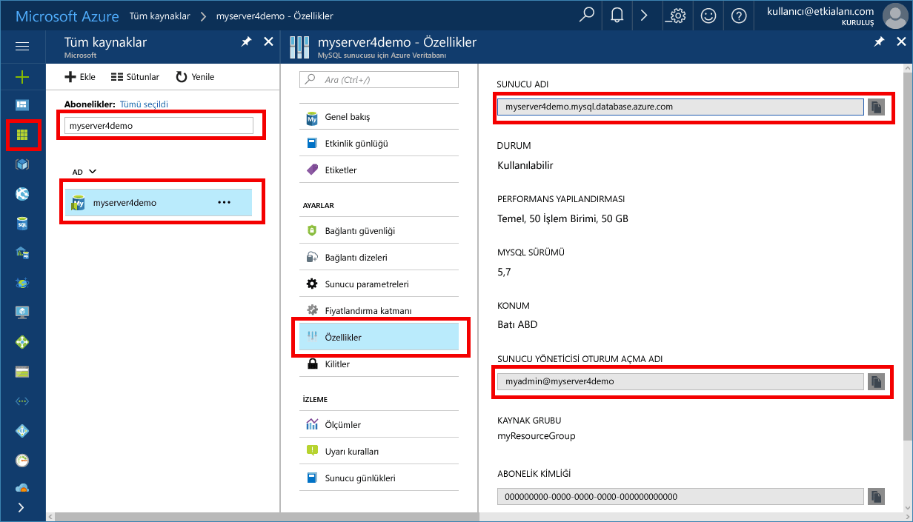

# <a name="migrate-your-mysql-database-by-using-import-and-export"></a><span data-ttu-id="5d0c8-103">İçeri aktarma kullanarak MySQL veritabanınızı geçirin ve dışarı aktarma</span><span class="sxs-lookup"><span data-stu-id="5d0c8-103">Migrate your MySQL database by using import and export</span></span>
<span data-ttu-id="5d0c8-104">Bu makalede, iki ortak yaklaşımlar açıklanmaktadır içeri aktarma ve verileri MySQL çalışma ekranı kullanarak MySQL sunucusu için bir Azure veritabanı dışarı aktarma.</span><span class="sxs-lookup"><span data-stu-id="5d0c8-104">This article explains two common approaches to importing and exporting data to an Azure Database for MySQL server by using MySQL Workbench.</span></span> 

## <a name="before-you-begin"></a><span data-ttu-id="5d0c8-105">Başlamadan önce</span><span class="sxs-lookup"><span data-stu-id="5d0c8-105">Before you begin</span></span>
<span data-ttu-id="5d0c8-106">Nasıl yapılır bu kılavuzu adım için gerekir:</span><span class="sxs-lookup"><span data-stu-id="5d0c8-106">To step through this how-to guide, you need:</span></span>
- <span data-ttu-id="5d0c8-107">MySQL sunucusu için izleyerek, Azure veritabanı [Azure portalını kullanarak MySQL sunucusu için bir Azure veritabanı oluşturma](quickstart-create-mysql-server-database-using-azure-portal.md).</span><span class="sxs-lookup"><span data-stu-id="5d0c8-107">An Azure Database for MySQL server, by following [Create an Azure Database for MySQL server using Azure portal](quickstart-create-mysql-server-database-using-azure-portal.md).</span></span>
- <span data-ttu-id="5d0c8-108">MySQL çalışma ekranı [indirilen](https://dev.mysql.com/downloads/workbench/), veya içeri ve dışarı aktarmak için başka bir MySQL araç.</span><span class="sxs-lookup"><span data-stu-id="5d0c8-108">MySQL Workbench [downloaded](https://dev.mysql.com/downloads/workbench/), or another MySQL tool to import and export.</span></span>

## <a name="use-common-tools"></a><span data-ttu-id="5d0c8-109">Ortak araçlarını kullanma</span><span class="sxs-lookup"><span data-stu-id="5d0c8-109">Use common tools</span></span>
<span data-ttu-id="5d0c8-110">Uzaktan bağlanmak ve almak veya MySQL için Azure veritabanına veri vermek için MySQL çalışma ekranı, kurbağa veya Navicat gibi ortak araçlarını kullanın.</span><span class="sxs-lookup"><span data-stu-id="5d0c8-110">Use common tools such as MySQL Workbench, Toad, or Navicat to remotely connect and import or export data into Azure Database for MySQL.</span></span> 

<span data-ttu-id="5d0c8-111">MySQL için Azure veritabanına bağlanmak için bir Internet bağlantısı olan istemci makinenizde gibi araçlar kullanın.</span><span class="sxs-lookup"><span data-stu-id="5d0c8-111">Use such tools on your client machine with an Internet connection to connect to Azure Database for MySQL.</span></span> <span data-ttu-id="5d0c8-112">Bir SSL şifreli bağlantı açıklandığı gibi en iyi güvenlik uygulamalarını kullanın [yapılandırma SSL bağlantısı MySQL için Azure veritabanında](concepts-ssl-connection-security.md).</span><span class="sxs-lookup"><span data-stu-id="5d0c8-112">Use an SSL-encrypted connection for best security practices, as described in [Configure SSL connectivity in Azure Database for MySQL](concepts-ssl-connection-security.md).</span></span>

<span data-ttu-id="5d0c8-113">Alma taşıyın ve herhangi bir özel bulut konuma Azure veritabanı için MySQL geçirilirken dışarı aktarma dosyaları gerekmez.</span><span class="sxs-lookup"><span data-stu-id="5d0c8-113">You do not need to move your import and export files to any special cloud location when migrating to Azure Database for MySQL.</span></span> 

## <a name="create-a-database-on-the-azure-database-for-mysql-server"></a><span data-ttu-id="5d0c8-114">MySQL sunucusu için Azure veritabanı bir veritabanı oluşturun</span><span class="sxs-lookup"><span data-stu-id="5d0c8-114">Create a database on the Azure Database for MySQL server</span></span>
<span data-ttu-id="5d0c8-115">Verileri geçirmek istediğiniz MySQL sunucusu için Azure veritabanı üzerinde boş bir veritabanı oluşturun.</span><span class="sxs-lookup"><span data-stu-id="5d0c8-115">Create an empty database on the Azure Database for MySQL server where you want to migrate the data.</span></span> <span data-ttu-id="5d0c8-116">Veritabanını oluşturmak için MySQL çalışma ekranı, kurbağa veya Navicat gibi bir araç kullanın.</span><span class="sxs-lookup"><span data-stu-id="5d0c8-116">Use a tool such as MySQL Workbench, Toad, or Navicat to create the database.</span></span> <span data-ttu-id="5d0c8-117">Veritabanı Dökümü alınan verileri içeren veritabanı ile aynı ada sahip olabilir veya farklı bir adla bir veritabanı oluşturabilirsiniz.</span><span class="sxs-lookup"><span data-stu-id="5d0c8-117">The database can have the same name as the database that contains the dumped data, or you can create a database with a different name.</span></span>

<span data-ttu-id="5d0c8-118">Bağlantı için bağlantı bilgilerini bulmak **özellikleri** Azure veritabanı için MySQL bölmesinde.</span><span class="sxs-lookup"><span data-stu-id="5d0c8-118">To get connected, locate the connection information on the **Properties** pane in Azure Database for MySQL.</span></span>



<span data-ttu-id="5d0c8-120">Bağlantı bilgilerini MySQL çalışma ekranına ekleyin.</span><span class="sxs-lookup"><span data-stu-id="5d0c8-120">Add the connection information to MySQL Workbench.</span></span>


## <a name="determine-when-to-use-import-and-export-techniques-instead-of-a-dump-and-restore"></a><span data-ttu-id="5d0c8-122">İçe aktarma işlemi kullanın ve teknikleri bir döküm yerine vermek ve geri yüklemek ne zaman belirleme</span><span class="sxs-lookup"><span data-stu-id="5d0c8-122">Determine when to use import and export techniques instead of a dump and restore</span></span>
<span data-ttu-id="5d0c8-123">MySQL araçlarını almak ve veritabanları aşağıdaki senaryolarda Azure MySQL veritabanına vermek için kullanın.</span><span class="sxs-lookup"><span data-stu-id="5d0c8-123">Use MySQL tools to import and export databases into Azure MySQL Database in the following scenarios.</span></span> <span data-ttu-id="5d0c8-124">Diğer senaryolarda kullanımından yararlanabilir [dökümü ve geri yükleme](concepts-migrate-dump-restore.md) yerine yaklaşımını.</span><span class="sxs-lookup"><span data-stu-id="5d0c8-124">In other scenarios, you might benefit from using the [dump and restore](concepts-migrate-dump-restore.md) approach instead.</span></span> 

- <span data-ttu-id="5d0c8-125">Varolan bir MySQL veritabanından Azure MySQL veritabanına aktarmak için birkaç tablo seçmeli olarak seçmeniz gerektiğinde, içe aktarma işlemi kullanın ve teknik dışarı aktarmak en iyisidir.</span><span class="sxs-lookup"><span data-stu-id="5d0c8-125">When you need to selectively choose a few tables to import from an existing MySQL database into Azure MySQL Database, it's best to use the import and export technique.</span></span>  <span data-ttu-id="5d0c8-126">Bunu yaparak, zaman ve kaynak kaydetmek için geçiş gereksiz tüm tablolardan atlayabilirsiniz.</span><span class="sxs-lookup"><span data-stu-id="5d0c8-126">By doing so, you can omit any unneeded tables from the migration to save time and resources.</span></span> <span data-ttu-id="5d0c8-127">Örneğin, `--include-tables` veya `--exclude-tables` anahtarı ile [mysqlpump](https://dev.mysql.com/doc/refman/5.7/en/mysqlpump.html#option_mysqlpump_include-tables) ve `--tables` anahtarı ile [mysqldump](https://dev.mysql.com/doc/refman/5.7/en/mysqldump.html#option_mysqldump_tables).</span><span class="sxs-lookup"><span data-stu-id="5d0c8-127">For example, use the `--include-tables` or `--exclude-tables` switch with [mysqlpump](https://dev.mysql.com/doc/refman/5.7/en/mysqlpump.html#option_mysqlpump_include-tables) and the `--tables` switch with [mysqldump](https://dev.mysql.com/doc/refman/5.7/en/mysqldump.html#option_mysqldump_tables).</span></span>
- <span data-ttu-id="5d0c8-128">Açıkça tablolar dışındaki veritabanı nesnelerini taşırken bunları oluşturun.</span><span class="sxs-lookup"><span data-stu-id="5d0c8-128">When you're moving the database objects other than tables, explicitly create those.</span></span> <span data-ttu-id="5d0c8-129">Kısıtlamalar (birincil anahtar, yabancı anahtar, dizinler), görünümleri, işlevleri, yordamlar, tetikleyiciler ve geçirmek istediğiniz herhangi bir veritabanı nesnesini içerir.</span><span class="sxs-lookup"><span data-stu-id="5d0c8-129">Include constraints (primary key, foreign key, indexes), views, functions, procedures, triggers, and any other database objects that you want to migrate.</span></span>
- <span data-ttu-id="5d0c8-130">Bir MySQL veritabanı dışında dış veri kaynaklarından veri geçişini, düz dosyalarını oluşturmak ve bunları kullanarak içeri [mysqlimport](https://dev.mysql.com/doc/refman/5.7/en/mysqlimport.html).</span><span class="sxs-lookup"><span data-stu-id="5d0c8-130">When you're migrating data from external data sources other than a MySQL database, create flat files and import them by using [mysqlimport](https://dev.mysql.com/doc/refman/5.7/en/mysqlimport.html).</span></span>

<span data-ttu-id="5d0c8-131">Azure veritabanına veri MySQL için yüklemekte olduğunuz zaman veritabanındaki tüm tabloların InnoDB depolama altyapısı kullandığınızdan emin olun.</span><span class="sxs-lookup"><span data-stu-id="5d0c8-131">Make sure that all tables in the database use the InnoDB storage engine when you're loading data into Azure Database for MySQL.</span></span> <span data-ttu-id="5d0c8-132">Azure veritabanı için MySQL yalnızca InnoDB depolama altyapısı destekler, bu nedenle alternatif depolama altyapılarını desteklemiyor.</span><span class="sxs-lookup"><span data-stu-id="5d0c8-132">Azure Database for MySQL supports only the InnoDB storage engine, so it doesn't support alternative storage engines.</span></span> <span data-ttu-id="5d0c8-133">Alternatif depolama altyapılarını tablolarınızı ihtiyacınız varsa bunları Azure veritabanı geçiş işleminden önce InnoDB altyapısı biçimi için MySQL kullanmak için dönüştürmek emin olun.</span><span class="sxs-lookup"><span data-stu-id="5d0c8-133">If your tables require alternative storage engines, be sure to convert them to use the InnoDB engine format before the migration to Azure Database for MySQL.</span></span> 

<span data-ttu-id="5d0c8-134">MyISAM altyapısını kullanan bir WordPress veya web uygulaması varsa, örneğin, ilk tabloları InnoDB tablolara veri geçirerek dönüştürün.</span><span class="sxs-lookup"><span data-stu-id="5d0c8-134">For example, if you have a WordPress or web app that uses the MyISAM engine, first convert the tables by migrating the data into InnoDB tables.</span></span> <span data-ttu-id="5d0c8-135">Ardından Azure veritabanı için MySQL geri yükleyin.</span><span class="sxs-lookup"><span data-stu-id="5d0c8-135">Then restore to Azure Database for MySQL.</span></span> <span data-ttu-id="5d0c8-136">Yan tümcesini kullanın `ENGINE=INNODB` tablo oluşturma için altyapısı ayarlayın ve ardından geçişten önce uyumlu tabloya veri aktarmak için.</span><span class="sxs-lookup"><span data-stu-id="5d0c8-136">Use the clause `ENGINE=INNODB` to set the engine for creating a table, and then transfer the data into the compatible table before the migration.</span></span> 

   ```sql
   INSERT INTO innodb_table SELECT * FROM myisam_table ORDER BY primary_key_columns
   ```

## <a name="performance-recommendations-for-import-and-export"></a><span data-ttu-id="5d0c8-137">İçeri ve dışarı aktarma için performans önerileri</span><span class="sxs-lookup"><span data-stu-id="5d0c8-137">Performance recommendations for import and export</span></span>
-   <span data-ttu-id="5d0c8-138">Kümelenmiş dizinler ve birincil anahtarlar veri yüklemeden önce oluşturun.</span><span class="sxs-lookup"><span data-stu-id="5d0c8-138">Create clustered indexes and primary keys before loading data.</span></span> <span data-ttu-id="5d0c8-139">Birincil anahtar sırayla veri yükleyin.</span><span class="sxs-lookup"><span data-stu-id="5d0c8-139">Load data in primary key order.</span></span> 
-   <span data-ttu-id="5d0c8-140">Gecikme veri kadar sonra ikincil dizinlerin oluşturulmasını yüklenir.</span><span class="sxs-lookup"><span data-stu-id="5d0c8-140">Delay creation of secondary indexes until after data is loaded.</span></span> <span data-ttu-id="5d0c8-141">Tüm İkincil dizinler yüklemeden sonra oluşturun.</span><span class="sxs-lookup"><span data-stu-id="5d0c8-141">Create all secondary indexes after loading.</span></span> 
-   <span data-ttu-id="5d0c8-142">Yüklemeden önce yabancı anahtar kısıtlamaları devre dışı bırakın.</span><span class="sxs-lookup"><span data-stu-id="5d0c8-142">Disable foreign key constraints before loading.</span></span> <span data-ttu-id="5d0c8-143">Yabancı anahtar denetimleri devre dışı bırakma önemli ölçüde performans artışı sağlar.</span><span class="sxs-lookup"><span data-stu-id="5d0c8-143">Disabling foreign key checks provides significant performance gains.</span></span> <span data-ttu-id="5d0c8-144">Kısıtlamaları etkinleştirin ve tutarlılığını sağlamak için yükleme işleminden sonra verileri doğrulayın.</span><span class="sxs-lookup"><span data-stu-id="5d0c8-144">Enable the constraints and verify the data after the load to ensure referential integrity.</span></span>
-   <span data-ttu-id="5d0c8-145">Paralel veri yükleyin.</span><span class="sxs-lookup"><span data-stu-id="5d0c8-145">Load data in parallel.</span></span> <span data-ttu-id="5d0c8-146">Kaynak sınırına neden, ve kaynakları Azure portalında kullanılabilir ölçümleri kullanarak izlemek çok fazla paralellik kaçının.</span><span class="sxs-lookup"><span data-stu-id="5d0c8-146">Avoid too much parallelism that would cause you to hit a resource limit, and monitor resources by using the metrics available in the Azure portal.</span></span> 
-   <span data-ttu-id="5d0c8-147">Uygun olduğunda bölümlenmiş tabloları kullanın.</span><span class="sxs-lookup"><span data-stu-id="5d0c8-147">Use partitioned tables when appropriate.</span></span>

## <a name="import-and-export-by-using-mysql-workbench"></a><span data-ttu-id="5d0c8-148">İçeri ve dışarı aktarma MySQL çalışma ekranı kullanarak</span><span class="sxs-lookup"><span data-stu-id="5d0c8-148">Import and export by using MySQL Workbench</span></span>
<span data-ttu-id="5d0c8-149">MySQL çalışma ekranı verileri içeri ve dışarı aktarmak iki yolu vardır.</span><span class="sxs-lookup"><span data-stu-id="5d0c8-149">There are two ways to export and import data in MySQL Workbench.</span></span> <span data-ttu-id="5d0c8-150">Her farklı bir amaca hizmet eder.</span><span class="sxs-lookup"><span data-stu-id="5d0c8-150">Each serves a different purpose.</span></span> 

### <a name="table-data-export-and-import-wizards-from-the-object-browsers-context-menu"></a><span data-ttu-id="5d0c8-151">Tablo verisi nesne tarayıcının bağlam menüsünden sihirbazları alma ve verme</span><span class="sxs-lookup"><span data-stu-id="5d0c8-151">Table data export and import wizards from the object browser's context menu</span></span>


<span data-ttu-id="5d0c8-153">Tablo verisi için sihirbazları alma desteği ve CSV ve JSON dosyaları kullanılarak verme işlemleri.</span><span class="sxs-lookup"><span data-stu-id="5d0c8-153">The wizards for table data support import and export operations by using CSV and JSON files.</span></span> <span data-ttu-id="5d0c8-154">Ayırıcılar, sütun seçimi ve kodlama seçimi gibi çeşitli yapılandırma seçenekleri içerirler.</span><span class="sxs-lookup"><span data-stu-id="5d0c8-154">They include several configuration options, such as separators, column selection, and encoding selection.</span></span> <span data-ttu-id="5d0c8-155">Yerel veya uzaktan bağlı MySQL sunucuları karşı her bir sihirbazın gerçekleştirebilirsiniz.</span><span class="sxs-lookup"><span data-stu-id="5d0c8-155">You can perform each wizard against local or remotely connected MySQL servers.</span></span> <span data-ttu-id="5d0c8-156">Alma eylemi tablo, sütun ve tür eşlemesi içerir.</span><span class="sxs-lookup"><span data-stu-id="5d0c8-156">The import action includes table, column, and type mapping.</span></span> 

<span data-ttu-id="5d0c8-157">Bir tablo sağ tıklayarak, bu sihirbazlar nesne tarayıcının bağlam menüsünden erişebilirsiniz.</span><span class="sxs-lookup"><span data-stu-id="5d0c8-157">You can access these wizards from the object browser's context menu by right-clicking a table.</span></span> <span data-ttu-id="5d0c8-158">Ya da seçin **tablo verileri dışarı Aktarma Sihirbazı** veya **tablo veri içeri aktarma Sihirbazı'nı**.</span><span class="sxs-lookup"><span data-stu-id="5d0c8-158">Then choose either **Table Data Export Wizard** or **Table Data Import Wizard**.</span></span> 

#### <a name="table-data-export-wizard"></a><span data-ttu-id="5d0c8-159">Tablo verileri dışarı Aktarma Sihirbazı</span><span class="sxs-lookup"><span data-stu-id="5d0c8-159">Table Data Export Wizard</span></span>
<span data-ttu-id="5d0c8-160">Aşağıdaki örnek tablo bir CSV dosyasına dışarı aktarır:</span><span class="sxs-lookup"><span data-stu-id="5d0c8-160">The following example exports the table to a CSV file:</span></span> 
1. <span data-ttu-id="5d0c8-161">Dışa aktarılacak veritabanı tablosunun sağ tıklayın.</span><span class="sxs-lookup"><span data-stu-id="5d0c8-161">Right-click the table of the database to be exported.</span></span> 
2. <span data-ttu-id="5d0c8-162">Seçin **tablo verileri dışarı Aktarma Sihirbazı'nı**.</span><span class="sxs-lookup"><span data-stu-id="5d0c8-162">Select **Table Data Export Wizard**.</span></span> <span data-ttu-id="5d0c8-163">Verilmesi, satır uzaklığı (varsa) ve (varsa) Say sütunları seçin.</span><span class="sxs-lookup"><span data-stu-id="5d0c8-163">Select the columns to be exported, row offset (if any), and count (if any).</span></span> 
3. <span data-ttu-id="5d0c8-164">Üzerinde **seçin verileri dışarı aktarma** sayfasında, **sonraki**.</span><span class="sxs-lookup"><span data-stu-id="5d0c8-164">On the **Select data for export** page, click **Next**.</span></span> <span data-ttu-id="5d0c8-165">Dosya yolunu seçin, CSV veya JSON dosya türü.</span><span class="sxs-lookup"><span data-stu-id="5d0c8-165">Select the file path, CSV, or JSON file type.</span></span> <span data-ttu-id="5d0c8-166">Ayrıca satır ayırıcı dizeler ve alan ayırıcı kapsayan yöntemi seçin.</span><span class="sxs-lookup"><span data-stu-id="5d0c8-166">Also select the line separator, method of enclosing strings, and field separator.</span></span> 
4. <span data-ttu-id="5d0c8-167">Üzerinde **Select çıkış dosyasının konumu** sayfasında, **sonraki**.</span><span class="sxs-lookup"><span data-stu-id="5d0c8-167">On the **Select output file location** page, click **Next**.</span></span> 
5. <span data-ttu-id="5d0c8-168">Üzerinde **dışarı veri** sayfasında, **sonraki**.</span><span class="sxs-lookup"><span data-stu-id="5d0c8-168">On the **Export data** page, click **Next**.</span></span>

#### <a name="table-data-import-wizard"></a><span data-ttu-id="5d0c8-169">Tablo verileri İçeri Aktarma Sihirbazı</span><span class="sxs-lookup"><span data-stu-id="5d0c8-169">Table Data Import Wizard</span></span>
<span data-ttu-id="5d0c8-170">Aşağıdaki örnek tablo bir CSV dosyasından içeri aktarır:</span><span class="sxs-lookup"><span data-stu-id="5d0c8-170">The following example imports the table from a CSV file:</span></span>
1. <span data-ttu-id="5d0c8-171">İçeri aktarılacak veritabanı tablosunun sağ tıklayın.</span><span class="sxs-lookup"><span data-stu-id="5d0c8-171">Right-click the table of the database to be imported.</span></span> 
2. <span data-ttu-id="5d0c8-172">Göz atın ve alınması ve ardından CSV dosyası seçmeniz **sonraki**.</span><span class="sxs-lookup"><span data-stu-id="5d0c8-172">Browse to and select the CSV file to be imported, and then click **Next**.</span></span> 
3. <span data-ttu-id="5d0c8-173">(Yeni veya var olan), hedef tablo seçin ve seçin veya temizleyin **içe aktarma işleminden önce Truncate table** onay kutusu.</span><span class="sxs-lookup"><span data-stu-id="5d0c8-173">Select the destination table (new or existing), and select or clear the **Truncate table before import** check box.</span></span> <span data-ttu-id="5d0c8-174">**İleri**’ye tıklayın.</span><span class="sxs-lookup"><span data-stu-id="5d0c8-174">Click **Next**.</span></span>
4. <span data-ttu-id="5d0c8-175">Select kodlama ve içe aktarılması ve ardından sütunları **sonraki**.</span><span class="sxs-lookup"><span data-stu-id="5d0c8-175">Select encoding and the columns to be imported, and then click **Next**.</span></span> 
5. <span data-ttu-id="5d0c8-176">Üzerinde **veri içeri aktarma** sayfasında, **sonraki**.</span><span class="sxs-lookup"><span data-stu-id="5d0c8-176">On the **Import data** page, click **Next**.</span></span> <span data-ttu-id="5d0c8-177">Sihirbaz, buna göre verileri içeri aktarır.</span><span class="sxs-lookup"><span data-stu-id="5d0c8-177">The wizard imports the data accordingly.</span></span>

### <a name="sql-data-export-and-import-wizards-from-the-navigator-pane"></a><span data-ttu-id="5d0c8-178">SQL veri Gezgini bölmesinden sihirbazları alma ve verme</span><span class="sxs-lookup"><span data-stu-id="5d0c8-178">SQL data export and import wizards from the Navigator pane</span></span>
<span data-ttu-id="5d0c8-179">MySQL çalışma ekranından oluşturulan veya mysqldump komuttan üretilen SQL içeri veya dışarı aktarmak için bir Sihirbazı'nı kullanın.</span><span class="sxs-lookup"><span data-stu-id="5d0c8-179">Use a wizard to export or import SQL generated from MySQL Workbench or generated from the mysqldump command.</span></span> <span data-ttu-id="5d0c8-180">Bu sihirbaz erişim **Gezgini** bölmesinde veya seçerek **Server** ana menüden.</span><span class="sxs-lookup"><span data-stu-id="5d0c8-180">Access these wizards from the **Navigator** pane or by selecting **Server** from the main menu.</span></span> <span data-ttu-id="5d0c8-181">Ardından **verilerini dışa aktarma** veya **veri alma**.</span><span class="sxs-lookup"><span data-stu-id="5d0c8-181">Then select **Data Export** or **Data Import**.</span></span> 

#### <a name="data-export"></a><span data-ttu-id="5d0c8-182">Verileri dışarı aktarma</span><span class="sxs-lookup"><span data-stu-id="5d0c8-182">Data Export</span></span>


<span data-ttu-id="5d0c8-184">Kullanabileceğiniz **verilerini dışa aktarma** sekmesini MySQL verilerinizi vermek için.</span><span class="sxs-lookup"><span data-stu-id="5d0c8-184">You can use the **Data Export** tab to export your MySQL data.</span></span> 
1. <span data-ttu-id="5d0c8-185">Dışarı aktarma, isteğe bağlı olarak her şemadan belirli şema nesneleri/tabloları seçin ve dışa aktarma oluşturmak istediğiniz her şema seçin.</span><span class="sxs-lookup"><span data-stu-id="5d0c8-185">Select each schema that you want to export, optionally choose specific schema objects/tables from each schema, and generate the export.</span></span> <span data-ttu-id="5d0c8-186">Yapılandırma seçenekleri proje klasörünü veya kendi içinde bulunan SQL dosyasına dışa aktarma dahil, saklı yordamları ve olayları dökümü veya tablo verileri atlayabilirsiniz.</span><span class="sxs-lookup"><span data-stu-id="5d0c8-186">Configuration options include export to a project folder or self-contained SQL file, dump stored routines and events, or skip table data.</span></span> 
 
   <span data-ttu-id="5d0c8-187">Alternatif olarak, kullanın **bir sonuç kümesi verme** belirli bir sonuç CSV, JSON, HTML ve XML gibi başka bir biçime SQL düzenleyicisinde kümesi vermek için.</span><span class="sxs-lookup"><span data-stu-id="5d0c8-187">Alternatively, use **Export a Result Set** to export a specific result set in the SQL editor to another format, such as CSV, JSON, HTML, and XML.</span></span> 
3. <span data-ttu-id="5d0c8-188">Dışarı aktarmak için veritabanı nesneleri seçin ve ilgili seçenekleri yapılandırın.</span><span class="sxs-lookup"><span data-stu-id="5d0c8-188">Select the database objects to export, and configure the related options.</span></span>
4. <span data-ttu-id="5d0c8-189">Tıklatın **yenileme** geçerli nesnelerini yüklenemiyor.</span><span class="sxs-lookup"><span data-stu-id="5d0c8-189">Click **Refresh** to load the current objects.</span></span>
5. <span data-ttu-id="5d0c8-190">İsteğe bağlı olarak, açık **Gelişmiş Seçenekler** dışa aktarma işlemi iyileştirmek için sekmesi.</span><span class="sxs-lookup"><span data-stu-id="5d0c8-190">Optionally, open the **Advanced Options** tab to refine the export operation.</span></span> <span data-ttu-id="5d0c8-191">Örneğin, tablo kilitleri, kullanım Değiştir INSERT deyimleri ve teklif tanımlayıcıları backtick karakterlerle yerine ekleyin.</span><span class="sxs-lookup"><span data-stu-id="5d0c8-191">For example, add table locks, use replace instead of insert statements, and quote identifiers with backtick characters.</span></span>
6. <span data-ttu-id="5d0c8-192">Tıklatın **Başlat verme** dışarı aktarma işlemini başlatmak için.</span><span class="sxs-lookup"><span data-stu-id="5d0c8-192">Click **Start Export** to begin the export process.</span></span>


#### <a name="data-import"></a><span data-ttu-id="5d0c8-193">Veri alma</span><span class="sxs-lookup"><span data-stu-id="5d0c8-193">Data Import</span></span>


<span data-ttu-id="5d0c8-195">Kullanabileceğiniz **veri alma** içeri aktarın veya geri yüklemek için sekmesinde verilen verileri veri dışarı aktarma işlemi ya da mysqldump komutu.</span><span class="sxs-lookup"><span data-stu-id="5d0c8-195">You can use the **Data Import** tab to import or restore exported data from the data export operation or from the mysqldump command.</span></span> 
1. <span data-ttu-id="5d0c8-196">Proje klasörünü veya kendi içinde bulunan SQL dosyasını seçin, içeri aktarabilir veya seçmek için şema seçin **yeni** yeni bir şema tanımlamak için.</span><span class="sxs-lookup"><span data-stu-id="5d0c8-196">Choose the project folder or self-contained SQL file, choose the schema to import into, or choose **New** to define a new schema.</span></span> 
2. <span data-ttu-id="5d0c8-197">Tıklatın **Başlat alma** içeri aktarma işlemini başlatmak için.</span><span class="sxs-lookup"><span data-stu-id="5d0c8-197">Click **Start Import** to begin the import process.</span></span>

## <a name="next-steps"></a><span data-ttu-id="5d0c8-198">Sonraki adımlar</span><span class="sxs-lookup"><span data-stu-id="5d0c8-198">Next steps</span></span>
<span data-ttu-id="5d0c8-199">Başka bir geçiş yaklaşım okuma [dökümü ve geri yükleme, Azure veritabanı'nda MySQL için MySQL veritabanı kullanarak geçiş](concepts-migrate-dump-restore.md).</span><span class="sxs-lookup"><span data-stu-id="5d0c8-199">As another migration approach, read [Migrate your MySQL database using dump and restore in Azure Database for MySQL](concepts-migrate-dump-restore.md).</span></span> 
