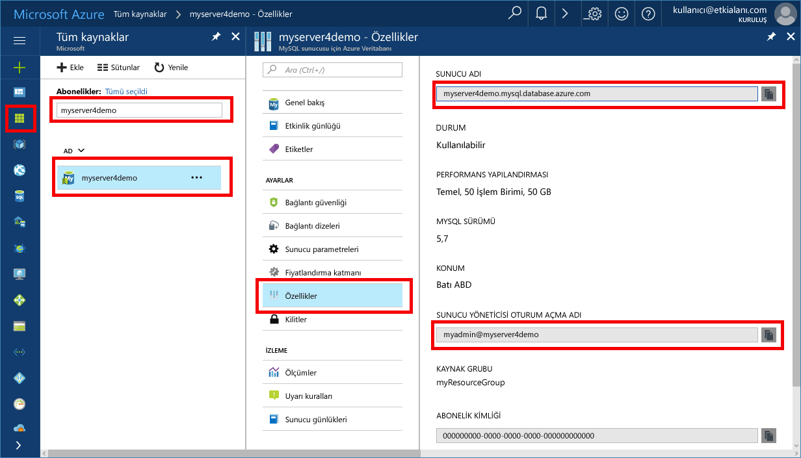

# <a name="azure-database-for-mysql-use-net-c-tooconnect-and-query-data"></a><span data-ttu-id="27585-103">Azure veritabanı için MySQL: kullanım .NET (C#) tooconnect ve sorgu verileri</span><span class="sxs-lookup"><span data-stu-id="27585-103">Azure Database for MySQL: Use .NET (C#) tooconnect and query data</span></span>
<span data-ttu-id="27585-104">Bu hızlı başlangıç gösteren Azure tooconnect tooan veritabanı nasıl bir C# uygulaması kullanarak MySQL için.</span><span class="sxs-lookup"><span data-stu-id="27585-104">This quickstart demonstrates how tooconnect tooan Azure Database for MySQL using a C# application.</span></span> <span data-ttu-id="27585-105">Nasıl toouse SQL deyimleri tooquery, Ekle, Güncelleştir ve hello veritabanında bulunan verileri silme gösterir.</span><span class="sxs-lookup"><span data-stu-id="27585-105">It shows how toouse SQL statements tooquery, insert, update, and delete data in hello database.</span></span> <span data-ttu-id="27585-106">Merhaba bu makaledeki adımları kullanarak C# geliştirme ile tanıdık olduğunuz ve Azure veritabanı için MySQL ile yeni tooworking olduğunu varsayalım.</span><span class="sxs-lookup"><span data-stu-id="27585-106">hello steps in this article assume that you are familiar with developing using C#, and that you are new tooworking with Azure Database for MySQL.</span></span>

## <a name="prerequisites"></a><span data-ttu-id="27585-107">Ön koşullar</span><span class="sxs-lookup"><span data-stu-id="27585-107">Prerequisites</span></span>
<span data-ttu-id="27585-108">Bu hızlı başlangıç Bu kılavuzlara birini başlangıç noktası olarak oluşturulan hello kaynakları kullanır:</span><span class="sxs-lookup"><span data-stu-id="27585-108">This quickstart uses hello resources created in either of these guides as a starting point:</span></span>
- [<span data-ttu-id="27585-109">Azure portalını kullanarak MySQL için Azure Veritabanı sunucusu oluşturma</span><span class="sxs-lookup"><span data-stu-id="27585-109">Create an Azure Database for MySQL server using Azure portal</span></span>](./quickstart-create-mysql-server-database-using-azure-portal.md)
- [<span data-ttu-id="27585-110">Azure CLI kullanarak MySQL için Azure Veritabanı sunucusu oluşturma</span><span class="sxs-lookup"><span data-stu-id="27585-110">Create an Azure Database for MySQL server using Azure CLI</span></span>](./quickstart-create-mysql-server-database-using-azure-cli.md)

<span data-ttu-id="27585-111">Şunları da yapmanız gerekir:</span><span class="sxs-lookup"><span data-stu-id="27585-111">You also need to:</span></span>
- <span data-ttu-id="27585-112">[.NET](https://www.microsoft.com/net/download) yükleyin.</span><span class="sxs-lookup"><span data-stu-id="27585-112">Install [.NET](https://www.microsoft.com/net/download).</span></span> <span data-ttu-id="27585-113">(Windows, Ubuntu Linux veya macOS) platformunuz için özel olarak bağlı hello makale tooinstall .NET Hello adımları izleyin.</span><span class="sxs-lookup"><span data-stu-id="27585-113">Follow hello steps in hello linked article tooinstall .NET specifically for your platform (Windows, Ubuntu Linux, or macOS).</span></span> 
- <span data-ttu-id="27585-114">[Visual Studio](https://www.visualstudio.com/downloads/)’yu yükleyin.</span><span class="sxs-lookup"><span data-stu-id="27585-114">Install [Visual Studio](https://www.visualstudio.com/downloads/).</span></span>
- <span data-ttu-id="27585-115">[MySQL için ODBC Sürücüsü](https://dev.mysql.com/downloads/connector/odbc/)’nü yükleyin.</span><span class="sxs-lookup"><span data-stu-id="27585-115">Install [ODBC Driver for MySQL](https://dev.mysql.com/downloads/connector/odbc/).</span></span>

## <a name="get-connection-information"></a><span data-ttu-id="27585-116">Bağlantı bilgilerini alma</span><span class="sxs-lookup"><span data-stu-id="27585-116">Get connection information</span></span>
<span data-ttu-id="27585-117">Merhaba bağlantı gerekli bilgileri tooconnect toohello Azure veritabanı için MySQL alın.</span><span class="sxs-lookup"><span data-stu-id="27585-117">Get hello connection information needed tooconnect toohello Azure Database for MySQL.</span></span> <span data-ttu-id="27585-118">Tam sunucu adını ve oturum açma kimlik bilgileri hello gerekir.</span><span class="sxs-lookup"><span data-stu-id="27585-118">You need hello fully qualified server name and login credentials.</span></span>

1. <span data-ttu-id="27585-119">İçinde toohello oturum [Azure portal](https://portal.azure.com/).</span><span class="sxs-lookup"><span data-stu-id="27585-119">Log in toohello [Azure portal](https://portal.azure.com/).</span></span>
2. <span data-ttu-id="27585-120">Merhaba sol taraftaki menüden Azure portalında, **tüm kaynakları** ve oluşturduğunuz, gibi hello sunucu araması **myserver4demo**.</span><span class="sxs-lookup"><span data-stu-id="27585-120">From hello left-hand menu in Azure portal, click **All resources** and search for hello server you have created, such as **myserver4demo**.</span></span>
3. <span data-ttu-id="27585-121">Merhaba sunucu adına tıklayın.</span><span class="sxs-lookup"><span data-stu-id="27585-121">Click hello server name.</span></span>
4. <span data-ttu-id="27585-122">Select hello sunucunun **özellikleri** sayfası.</span><span class="sxs-lookup"><span data-stu-id="27585-122">Select hello server's **Properties** page.</span></span> <span data-ttu-id="27585-123">Merhaba Not **sunucu adı** ve **sunucu yönetici oturum açma adı**.</span><span class="sxs-lookup"><span data-stu-id="27585-123">Make a note of hello **Server name** and **Server admin login name**.</span></span>
 <span data-ttu-id="27585-124"></span><span class="sxs-lookup"><span data-stu-id="27585-124"></span></span>
5. <span data-ttu-id="27585-125">Sunucu oturum açma bilgilerinizi unutursanız, toohello gidin **genel bakış** tooview hello sunucu yönetici oturum açma adı sayfasında ve gerekirse sıfırlamak hello parola.</span><span class="sxs-lookup"><span data-stu-id="27585-125">If you forget your server login information, navigate toohello **Overview** page tooview hello Server admin login name and, if necessary, reset hello password.</span></span>

## <a name="connect-create-table-and-insert-data"></a><span data-ttu-id="27585-126">Bağlanma, tablo oluşturma ve veri ekleme</span><span class="sxs-lookup"><span data-stu-id="27585-126">Connect, create table, and insert data</span></span>
<span data-ttu-id="27585-127">Kullanım hello aşağıdakileri tooconnect kod ve verileri hello kullanarak yük **CREATE TABLE** ve **INSERT INTO** SQL deyimlerini.</span><span class="sxs-lookup"><span data-stu-id="27585-127">Use hello following code tooconnect and load hello data using **CREATE TABLE** and  **INSERT INTO** SQL statements.</span></span> <span data-ttu-id="27585-128">Merhaba kodu kullanan ODBC sınıfı yöntemiyle [Open()](https://msdn.microsoft.com/en-us/library/system.data.odbc.odbcconnection.open(v=vs.110).aspx) tooestablish bağlantı tooMySQL.</span><span class="sxs-lookup"><span data-stu-id="27585-128">hello code uses ODBC class with method [Open()](https://msdn.microsoft.com/en-us/library/system.data.odbc.odbcconnection.open(v=vs.110).aspx) tooestablish a connection tooMySQL.</span></span> <span data-ttu-id="27585-129">Merhaba kod yöntemi kullanıyorsa [CreateCommand()](https://msdn.microsoft.com/en-us/library/system.data.odbc.odbcconnection.createcommand(v=vs.110).aspx)hello CommandText özelliği ayarlar ve yöntemini çağırır [ExecuteNonQuery()](https://msdn.microsoft.com/en-us/library/system.data.odbc.odbccommand.executenonquery(v=vs.110).aspx) toorun hello veritabanı komutları.</span><span class="sxs-lookup"><span data-stu-id="27585-129">Then hello code uses method [CreateCommand()](https://msdn.microsoft.com/en-us/library/system.data.odbc.odbcconnection.createcommand(v=vs.110).aspx), sets hello CommandText property, and calls method [ExecuteNonQuery()](https://msdn.microsoft.com/en-us/library/system.data.odbc.odbccommand.executenonquery(v=vs.110).aspx) toorun hello database commands.</span></span> 

<span data-ttu-id="27585-130">Merhaba konak, DBName, kullanıcı ve parola parametrelerini hello sunucu ve veritabanı oluşturduğunuzda belirttiğiniz hello değerlerle değiştirin.</span><span class="sxs-lookup"><span data-stu-id="27585-130">Replace hello Host, DBName, User, and Password parameters with hello values that you specified when you created hello server and database.</span></span> 

```csharp
using System;
using System.Collections.Generic;
using System.Linq;
using System.Text;
using System.Threading.Tasks;
using MySql.Data;
using System.Data.Odbc;

namespace driver
{
    class MySQLCreate
    {
        static void Main(string[] args)
        {
            var conn = new OdbcConnection("DRIVER={MySQL ODBC 5.3 unicode Driver}; Server=myserver4demo.mysql.database.azure.com; Port=3306;" +
            " Database=quickstartdb; Uid=myadmin@myserver4demo; Pwd=server_admin_password; sslverify=0; Option=3;MULTI_STATEMENTS=1");

            Console.Out.WriteLine("Opening connection");
            conn.Open();

            var command = conn.CreateCommand();
            command.CommandText = "DROP TABLE IF EXISTS inventory;";
            command.ExecuteNonQuery();
            Console.Out.WriteLine("Finished dropping table (if existed)");

            command.CommandText = "CREATE TABLE inventory (id serial PRIMARY KEY, name VARCHAR(50), quantity INTEGER);";
            command.ExecuteNonQuery();
            Console.Out.WriteLine("Finished creating table");

            command.CommandText =
                String.Format(
                    @"INSERT INTO inventory (name, quantity) VALUES ({0}, {1});
                    INSERT INTO inventory (name, quantity) VALUES ({2}, {3});
                    INSERT INTO inventory (name, quantity) VALUES ({4}, {5});",
                    "\'banana\'", 150,
                    "\'orange\'", 154,
                    "\'apple\'", 100
                    );

            int nRows = command.ExecuteNonQuery();
            Console.Out.WriteLine(String.Format("Number of rows inserted={0}", nRows));

            Console.Out.WriteLine("Closing connection");
            conn.Close();

            Console.WriteLine("Press RETURN tooexit");
            Console.ReadLine();
        }

    }
}

```

## <a name="read-data"></a><span data-ttu-id="27585-131">Verileri okuma</span><span class="sxs-lookup"><span data-stu-id="27585-131">Read data</span></span>

<span data-ttu-id="27585-132">Kullanım hello aşağıdaki tooconnect kod ve hello kullanarak verileri okuyun bir **seçin** SQL deyimi.</span><span class="sxs-lookup"><span data-stu-id="27585-132">Use hello following code tooconnect and read hello data using a **SELECT** SQL statement.</span></span> <span data-ttu-id="27585-133">Merhaba kodu kullanan ODBC sınıfı yöntemiyle [Open()](https://msdn.microsoft.com/en-us/library/system.data.odbc.odbcconnection.open(v=vs.110).aspx) tooestablish bağlantı tooMySQL.</span><span class="sxs-lookup"><span data-stu-id="27585-133">hello code uses ODBC class with method [Open()](https://msdn.microsoft.com/en-us/library/system.data.odbc.odbcconnection.open(v=vs.110).aspx) tooestablish a connection tooMySQL.</span></span> <span data-ttu-id="27585-134">Merhaba kod yöntemi kullanıyorsa [CreateCommand()](https://msdn.microsoft.com/en-us/library/system.data.odbc.odbcconnection.createcommand(v=vs.110).aspx) ve yöntemi [ExecuteReader()](https://msdn.microsoft.com/en-us/library/system.data.odbc.odbccommand.executereader(v=vs.110).aspx) toorun hello veritabanı komutları.</span><span class="sxs-lookup"><span data-stu-id="27585-134">Then hello code uses method [CreateCommand()](https://msdn.microsoft.com/en-us/library/system.data.odbc.odbcconnection.createcommand(v=vs.110).aspx) and method [ExecuteReader()](https://msdn.microsoft.com/en-us/library/system.data.odbc.odbccommand.executereader(v=vs.110).aspx) toorun hello database commands.</span></span> <span data-ttu-id="27585-135">Kod kullanan'sonraki hello [Read()](https://msdn.microsoft.com/en-us/library/system.data.odbc.odbcdatareader.read(v=vs.110).aspx) hello sonuçlarında tooadvance toohello kaydeder.</span><span class="sxs-lookup"><span data-stu-id="27585-135">Next hello code uses [Read()](https://msdn.microsoft.com/en-us/library/system.data.odbc.odbcdatareader.read(v=vs.110).aspx) tooadvance toohello records in hello results.</span></span> <span data-ttu-id="27585-136">Daha sonra hello kod hello kaydında Getınt32 ve GetString tooparse hello değerleri kullanır.</span><span class="sxs-lookup"><span data-stu-id="27585-136">Then hello code uses GetInt32 and GetString tooparse hello values in hello record.</span></span>

<span data-ttu-id="27585-137">Merhaba konak, DBName, kullanıcı ve parola parametrelerini hello sunucu ve veritabanı oluşturduğunuzda belirttiğiniz hello değerlerle değiştirin.</span><span class="sxs-lookup"><span data-stu-id="27585-137">Replace hello Host, DBName, User, and Password parameters with hello values that you specified when you created hello server and database.</span></span> 

```csharp
using System;
using System.Collections.Generic;
using System.Linq;
using System.Text;
using System.Threading.Tasks;
using MySql.Data;
using System.Data.Odbc;


namespace driver
{
    class MySQLRead
    {

        static void Main(string[] args)
        {
            var conn = new OdbcConnection("DRIVER={MySQL ODBC 5.3 unicode Driver}; Server=myserver4demo.mysql.database.azure.com; Port=3306;" +
            " Database=quickstartdb; Uid=myadmin@myserver4demo; Pwd=server_admin_password; sslverify=0; Option=3;MULTI_STATEMENTS=1");

            Console.Out.WriteLine("Opening connection");
            conn.Open();

            var command = conn.CreateCommand();
            command.CommandText = "SELECT * FROM inventory;";

            var reader = command.ExecuteReader();
            while (reader.Read())
            {
                Console.WriteLine(
                    string.Format(
                        "Reading from table=({0}, {1}, {2})",
                        reader.GetInt32(0).ToString(),
                        reader.GetString(1),
                        reader.GetInt32(2).ToString()
                        )
                    );
            }

            Console.Out.WriteLine("Closing connection");
            conn.Close();

            Console.WriteLine("Press RETURN tooexit");
            Console.ReadLine();
        }
    }
}


```

## <a name="update-data"></a><span data-ttu-id="27585-138">Verileri güncelleştirme</span><span class="sxs-lookup"><span data-stu-id="27585-138">Update data</span></span>
<span data-ttu-id="27585-139">Kullanım hello aşağıdaki tooconnect kod ve hello kullanarak verileri okuyun bir **güncelleştirme** SQL deyimi.</span><span class="sxs-lookup"><span data-stu-id="27585-139">Use hello following code tooconnect and read hello data using a **UPDATE** SQL statement.</span></span> <span data-ttu-id="27585-140">Merhaba kodu kullanan ODBC sınıfı yöntemiyle [Open()](https://msdn.microsoft.com/en-us/library/system.data.odbc.odbcconnection.open(v=vs.110).aspx) tooestablish bağlantı tooMySQL.</span><span class="sxs-lookup"><span data-stu-id="27585-140">hello code uses ODBC class with method [Open()](https://msdn.microsoft.com/en-us/library/system.data.odbc.odbcconnection.open(v=vs.110).aspx) tooestablish a connection tooMySQL.</span></span> <span data-ttu-id="27585-141">Merhaba kod yöntemi kullanıyorsa [CreateCommand()](https://msdn.microsoft.com/en-us/library/system.data.odbc.odbcconnection.createcommand(v=vs.110).aspx)hello CommandText özelliği ayarlar ve yöntemini çağırır [ExecuteNonQuery()](https://msdn.microsoft.com/en-us/library/system.data.odbc.odbccommand.executenonquery(v=vs.110).aspx) toorun hello veritabanı komutları.</span><span class="sxs-lookup"><span data-stu-id="27585-141">Then hello code uses method [CreateCommand()](https://msdn.microsoft.com/en-us/library/system.data.odbc.odbcconnection.createcommand(v=vs.110).aspx), sets hello CommandText property, and calls method [ExecuteNonQuery()](https://msdn.microsoft.com/en-us/library/system.data.odbc.odbccommand.executenonquery(v=vs.110).aspx) toorun hello database commands.</span></span>

<span data-ttu-id="27585-142">Merhaba konak, DBName, kullanıcı ve parola parametrelerini hello sunucu ve veritabanı oluşturduğunuzda belirttiğiniz hello değerlerle değiştirin.</span><span class="sxs-lookup"><span data-stu-id="27585-142">Replace hello Host, DBName, User, and Password parameters with hello values that you specified when you created hello server and database.</span></span> 

```csharp
using System;
using System.Collections.Generic;
using System.Linq;
using System.Text;
using System.Threading.Tasks;
using System.Data.Odbc;

namespace driver
{
    class MySQLUpdate
    {
        static void Main(string[] args)
        {
            var conn = new OdbcConnection("DRIVER={MySQL ODBC 5.3 unicode Driver}; Server=myserver4demo.mysql.database.azure.com; Port=3306;" +
            " Database=quickstartdb; Uid=myadmin@myserver4demo; Pwd=server_admin_password; sslverify=0; Option=3;MULTI_STATEMENTS=1");

            Console.Out.WriteLine("Opening connection");
            conn.Open();

            var command = conn.CreateCommand();
            command.CommandText =
            String.Format("UPDATE inventory SET quantity = {0} WHERE name = {1};",
                200,
                "\'banana\'"
                );

            int nRows = command.ExecuteNonQuery();
            Console.Out.WriteLine(String.Format("Number of rows updated={0}", nRows));

            Console.Out.WriteLine("Closing connection");
            conn.Close();

            Console.WriteLine("Press RETURN tooexit");
            Console.ReadLine();
        }
    }
}


```


## <a name="delete-data"></a><span data-ttu-id="27585-143">Verileri silme</span><span class="sxs-lookup"><span data-stu-id="27585-143">Delete data</span></span>
<span data-ttu-id="27585-144">Kullanım hello aşağıdaki tooconnect kod ve hello kullanarak verileri silme bir **silmek** SQL deyimi.</span><span class="sxs-lookup"><span data-stu-id="27585-144">Use hello following code tooconnect and delete hello data using a **DELETE** SQL statement.</span></span> 

<span data-ttu-id="27585-145">Merhaba kodu kullanan ODBC sınıfı yöntemiyle [Open()](https://msdn.microsoft.com/en-us/library/system.data.odbc.odbcconnection.open(v=vs.110).aspx) tooestablish bağlantı tooMySQL.</span><span class="sxs-lookup"><span data-stu-id="27585-145">hello code uses ODBC class with method [Open()](https://msdn.microsoft.com/en-us/library/system.data.odbc.odbcconnection.open(v=vs.110).aspx) tooestablish a connection tooMySQL.</span></span> <span data-ttu-id="27585-146">Merhaba kod yöntemi kullanıyorsa [CreateCommand()](https://msdn.microsoft.com/en-us/library/system.data.odbc.odbcconnection.createcommand(v=vs.110).aspx)hello CommandText özelliği ayarlar ve yöntemini çağırır [ExecuteNonQuery()](https://msdn.microsoft.com/en-us/library/system.data.odbc.odbccommand.executenonquery(v=vs.110).aspx) toorun hello veritabanı komutları.</span><span class="sxs-lookup"><span data-stu-id="27585-146">Then hello code uses method [CreateCommand()](https://msdn.microsoft.com/en-us/library/system.data.odbc.odbcconnection.createcommand(v=vs.110).aspx), sets hello CommandText property, and calls method [ExecuteNonQuery()](https://msdn.microsoft.com/en-us/library/system.data.odbc.odbccommand.executenonquery(v=vs.110).aspx) toorun hello database commands.</span></span>

<span data-ttu-id="27585-147">Merhaba konak, DBName, kullanıcı ve parola parametrelerini hello sunucu ve veritabanı oluşturduğunuzda belirttiğiniz hello değerlerle değiştirin.</span><span class="sxs-lookup"><span data-stu-id="27585-147">Replace hello Host, DBName, User, and Password parameters with hello values that you specified when you created hello server and database.</span></span> 

```csharp
using System;
using System.Collections.Generic;
using System.Linq;
using System.Text;
using System.Threading.Tasks;
using System.Data.Odbc;

namespace driver
{
    class MySQLDelete
    {
        static void Main(string[] args)
        {
            var conn = new OdbcConnection("DRIVER={MySQL ODBC 5.3 unicode Driver}; Server=myserver4demo.mysql.database.azure.com; Port=3306;" +
            " Database=quickstartdb; Uid=myadmin@myserver4demo; Pwd=server_admin_password; sslverify=0; Option=3;MULTI_STATEMENTS=1");

            Console.Out.WriteLine("Opening connection");
            conn.Open();

            var command = conn.CreateCommand();
            command.CommandText =
                String.Format("DELETE FROM inventory WHERE name = {0};",
                    "\'orange\'");
            int nRows = command.ExecuteNonQuery();
            Console.Out.WriteLine(String.Format("Number of rows deleted={0}", nRows));

            Console.Out.WriteLine("Closing connection");
            conn.Close();

            Console.WriteLine("Press RETURN tooexit");
            Console.ReadLine();
        }
    }
}

```

## <a name="next-steps"></a><span data-ttu-id="27585-148">Sonraki adımlar</span><span class="sxs-lookup"><span data-stu-id="27585-148">Next steps</span></span>
> [!div class="nextstepaction"]
> [<span data-ttu-id="27585-149">MySQL veritabanı tooAzure veritabanı için MySQL döküm ve geri yükleme kullanarak geçirme</span><span class="sxs-lookup"><span data-stu-id="27585-149">Migrate your MySQL database tooAzure Database for MySQL using dump and restore</span></span>](concepts-migrate-dump-restore.md)
