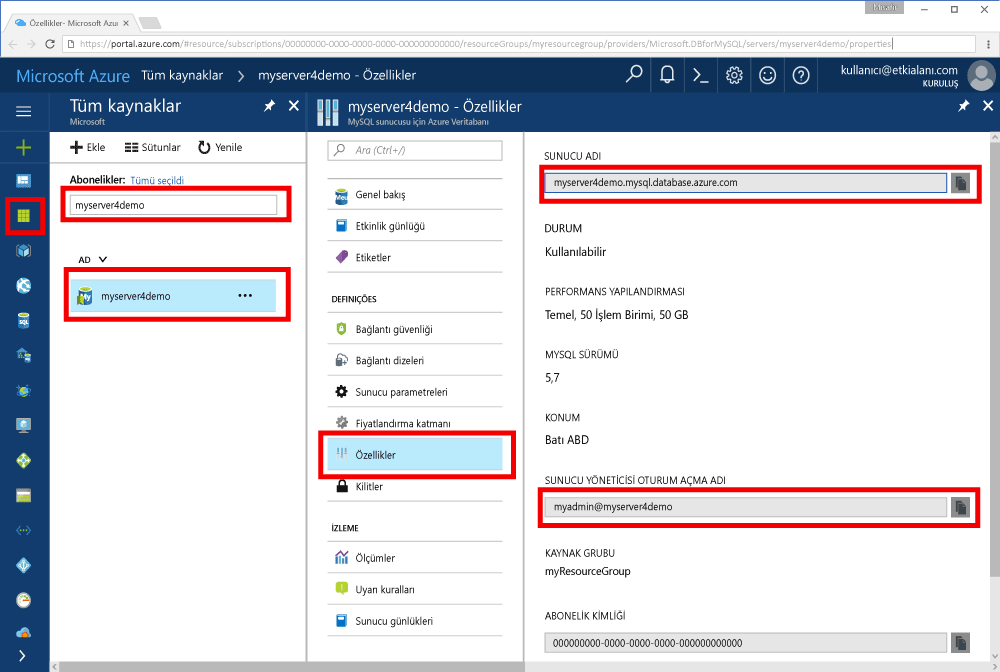

# <a name="azure-database-for-mysql-use-go-language-tooconnect-and-query-data"></a>Azure veritabanı için MySQL: dil tooconnect ve sorgu veri kullanımı gidin
Bu hızlı başlangıç gösterir nasıl MySQL kullanma tooconnect tooan Azure veritabanı kod yazılmış Merhaba [Git](https://golang.org/) macOS platformları Windows, Ubuntu Linux ve Apple dili. Nasıl toouse SQL deyimleri tooquery, Ekle, Güncelleştir ve hello veritabanında bulunan verileri silme gösterir. Bu makale, Azure veritabanı için MySQL ile yeni tooworking olan ancak bu, Git, kullanarak geliştirme ile bildiğinizi varsayar.

## <a name="prerequisites"></a>Ön koşullar
Bu hızlı başlangıç Bu kılavuzlara birini başlangıç noktası olarak oluşturulan hello kaynakları kullanır:
- [Azure portalını kullanarak MySQL için Azure Veritabanı sunucusu oluşturma](./quickstart-create-mysql-server-database-using-azure-portal.md)
- [Azure CLI kullanarak MySQL için Azure Veritabanı sunucusu oluşturma](./quickstart-create-mysql-server-database-using-azure-cli.md)

## <a name="install-go-and-mysql-connector"></a>Go ve MySQL bağlayıcısını yükleme
Yükleme [Git](https://golang.org/doc/install) ve hello [MySQL için Git-sql-sürücü](https://github.com/go-sql-driver/mysql#installation) kendi makinede. Platformunuz bağlı olarak hello adımları izleyin:

### <a name="windows"></a>Windows
1. [Karşıdan](https://golang.org/dl/) ve Microsoft toohello göre Windows için Git yükleme [yükleme yönergeleri](https://golang.org/doc/install).
2. Merhaba Başlat menüsünden Hello komut istemi başlatın.
3. Projeniz için şöyle bir klasör oluşturun. `mkdir  %USERPROFILE%\go\src\mysqlgo`.
4. Dizin hello proje klasörüne gibi değiştirmek `cd %USERPROFILE%\go\src\mysqlgo`.
5. Merhaba ortam değişkeni GOPATH toopoint toohello kaynak kod dizini için ayarlayın. `set GOPATH=%USERPROFILE%\go`.
6. Merhaba yüklemek [mysql için Git-sql-sürücü](https://github.com/go-sql-driver/mysql#installation) hello çalıştırarak `go get github.com/go-sql-driver/mysql` komutu.

   Özet olarak, Git yüklemeniz ve ardından hello komut isteminde şu komutları çalıştırın:
   ```cmd
   mkdir  %USERPROFILE%\go\src\mysqlgo
   cd %USERPROFILE%\go\src\mysqlgo
   set GOPATH=%USERPROFILE%\go
   go get github.com/go-sql-driver/mysql
   ```

### <a name="linux-ubuntu"></a>Linux (Ubuntu)
1. Merhaba Bash kabuğunda başlatın. 
2. `sudo apt-get install golang-go` komutunu çalıştırarak Go'yu yükleyin.
3. Giriş dizininizde projeniz için `mkdir -p ~/go/src/mysqlgo/` gibi bir klasör oluşturun.
4. Dizin hello klasörüne gibi değiştirmek `cd ~/go/src/mysqlgo/`.
5. Kümesi hello GOPATH ortam değişkeni toopoint tooa geçerli bir kaynak dizini, geçerli ev gibi dizinin klasörüne gidin. Merhaba bash kabuğunda çalıştırmak `export GOPATH=~/go` tooadd hello hello geçerli kabuk oturumu için GOPATH hello gibi dizin gidin.
6. Merhaba yüklemek [mysql için Git-sql-sürücü](https://github.com/go-sql-driver/mysql#installation) hello çalıştırarak `go get github.com/go-sql-driver/mysql` komutu.

   Özetle, şu bash komutlarını çalıştırın:
   ```bash
   sudo apt-get install golang-go
   mkdir -p ~/go/src/mysqlgo/
   cd ~/go/src/mysqlgo/
   export GOPATH=~/go/
   go get github.com/go-sql-driver/mysql
   ```

### <a name="apple-macos"></a>Apple macOS
1. İndirme ve yükleme toohello göre Git [yükleme yönergeleri](https://golang.org/doc/install) platformunuz eşleşen. 
2. Merhaba Bash kabuğunda başlatın. 
3. Giriş dizininizde projeniz için `mkdir -p ~/go/src/mysqlgo/` gibi bir klasör oluşturun.
4. Dizin hello klasörüne gibi değiştirmek `cd ~/go/src/mysqlgo/`.
5. Kümesi hello GOPATH ortam değişkeni toopoint tooa geçerli bir kaynak dizini, geçerli ev gibi dizinin klasörüne gidin. Merhaba bash kabuğunda çalıştırmak `export GOPATH=~/go` tooadd hello hello geçerli kabuk oturumu için GOPATH hello gibi dizin gidin.
6. Merhaba yüklemek [mysql için Git-sql-sürücü](https://github.com/go-sql-driver/mysql#installation) hello çalıştırarak `go get github.com/go-sql-driver/mysql` komutu.

   Özetle, Go’yu yükleyin ve ardından şu bash komutlarını çalıştırın:
   ```bash
   mkdir -p ~/go/src/mysqlgo/
   cd ~/go/src/mysqlgo/
   export GOPATH=~/go/
   go get github.com/go-sql-driver/mysql
   ```

## <a name="get-connection-information"></a>Bağlantı bilgilerini alma
Merhaba bağlantı gerekli bilgileri tooconnect toohello Azure veritabanı için MySQL alın. Tam sunucu adını ve oturum açma kimlik bilgileri hello gerekir.

1. İçinde toohello oturum [Azure portal](https://portal.azure.com/).
2. Merhaba sol taraftaki menüden Azure portalında, **tüm kaynakları** ve aramak için creased, gibi hello sunucu **myserver4demo**.
3. Merhaba sunucu adına tıklatarak **myserver4demo**.
4. Select hello sunucunun **özellikleri** sayfası. Merhaba Not **sunucu adı** ve **sunucu yönetici oturum açma adı**.
 
5. Sunucu oturum açma bilgilerinizi unutursanız, toohello gidin **genel bakış** tooview hello sunucu yönetici oturum açma adı sayfasında ve gerekirse sıfırlamak hello parola.
   

## <a name="build-and-run-go-code"></a>Go kodunu derleme ve çalıştırma 
1. toowrite Golang kodu, Microsoft Windows, Not Defteri gibi bir basit bir metin düzenleyicisi kullanabilirsiniz [VI](http://manpages.ubuntu.com/manpages/xenial/man1/nvi.1.html#contenttoc5) veya [Nano](https://www.nano-editor.org/) Ubuntu ya da macOS TextEdit. Daha zengin bir Tümleşik Geliştirme Ortamı (IDE) tercih ediyorsanız [Atom](https://atom.io/), Jetbrains [Gogland](https://www.jetbrains.com/go/) veya Microsoft [Visual Studio Code](https://code.visualstudio.com/) kullanmayı deneyebilirsiniz.
2. Merhaba hello bölümlere Git koddan metin dosyasına yapıştırın ve proje klasörünüzdeki dosya uzantısına sahip saklamalısınız \*Windows yolu gibi .go `%USERPROFILE%\go\src\mysqlgo\createtable.go` ya da Linux yolu `~/go/src/mysqlgo/createtable.go`.
3. Merhaba bulun `HOST`, `DATABASE`, `USER`, ve `PASSWORD` sabitleri hello kod ve kendi değerlerle değiştirin hello örnek değerler. 
4. Merhaba komut istemi başlatın veya kabuk bash. Dizini değiştirerek proje klasörünüze geçin. Örneğin; Windows’da `cd %USERPROFILE%\go\src\mysqlgo\`. Linux'ta `cd ~/go/src/mysqlgo/`.  Belirtilen hello IDE düzenleyicileri bazıları, hata ayıklama ve çalışma zamanı yeteneklerini Kabuk komutları gerek kalmadan sunar.
5. Merhaba komutu yazarak Hello kodu çalıştırma `go run createtable.go` toocompile hello uygulama ve çalıştırın. 
6. Alternatif olarak, toobuild hello kodu yerel bir uygulamaya `go build createtable.go`, ardından başlatma `createtable.exe` toorun Merhaba uygulaması.

## <a name="connect-create-table-and-insert-data"></a>Bağlanma, tablo oluşturma ve veri ekleme
Kullanım hello aşağıdaki kod tooconnect toohello sunucu, bir tablo oluşturun ve verileri hello kullanarak yük bir **Ekle** SQL deyimi. 

Merhaba kod üç paketlerini içeri aktarır: hello [sql paketi](https://golang.org/pkg/database/sql/), hello [gidin sql sürücüsü mysql için](https://github.com/go-sql-driver/mysql#installation) sürücü toocommunicate hello Azure veritabanı için MySQL ve hello olarak [fmt paket](https://golang.org/pkg/fmt/)yazdırılan giriş ve çıkış hello komut satırında için.

Merhaba kod yöntemi çağırır [sql. Open()](http://go-database-sql.org/accessing.html) tooconnect tooAzure veritabanı için MySQL ve denetimleri hello bağlantı yöntemini kullanarak [db. Ping()](https://golang.org/pkg/database/sql/#DB.Ping). A [veritabanı işleci](https://golang.org/pkg/database/sql/#DB) boyunca, hello bağlantı havuzu hello veritabanı sunucusu için bulunduran kullanılır. Merhaba kod çağrıları hello [Exec()](https://golang.org/pkg/database/sql/#DB.Exec) yöntemi birkaç kez toorun birkaç DDL komutları. Merhaba kodu da hello kullanan [Prepare()](http://go-database-sql.org/prepared.html) ve Exec() toorun hazırlanan farklı parametrelerle deyimleri tooinsert üç satır. Bir hata oluştu ve tooexit Panik her zaman bir özel checkError() kullanılan toocheck yöntemidir.

Hello yerine `host`, `database`, `user`, ve `password` sabitleri kendi değerlere sahip. 

```Go
package main

import (
    "database/sql"
    "fmt"

    _ "github.com/go-sql-driver/mysql"
)

const (
    host     = "myserver4demo.mysql.database.azure.com"
    database = "quickstartdb"
    user     = "myadmin@myserver4demo"
    password = "yourpassword"
)

func checkError(err error) {
    if err != nil {
        panic(err)
    }
}

func main() {

    // Initialize connection string.
    var connectionString = fmt.Sprintf("%s:%s@tcp(%s:3306)/%s?allowNativePasswords=true", user, password, host, database)

    // Initialize connection object.
    db, err := sql.Open("mysql", connectionString)
    checkError(err)
    defer db.Close()

    err = db.Ping()
    checkError(err)
    fmt.Println("Successfully created connection toodatabase.")

    // Drop previous table of same name if one exists.
    _, err = db.Exec("DROP TABLE IF EXISTS inventory;")
    checkError(err)
    fmt.Println("Finished dropping table (if existed).")

    // Create table.
    _, err = db.Exec("CREATE TABLE inventory (id serial PRIMARY KEY, name VARCHAR(50), quantity INTEGER);")
    checkError(err)
    fmt.Println("Finished creating table.")

    // Insert some data into table.
    sqlStatement, err := db.Prepare("INSERT INTO inventory (name, quantity) VALUES (?, ?);")
    res, err := sqlStatement.Exec("banana", 150)
    checkError(err)
    rowCount, err := res.RowsAffected()
    fmt.Printf("Inserted %d row(s) of data.\n", rowCount)

    res, err = sqlStatement.Exec("orange", 154)
    checkError(err)
    rowCount, err = res.RowsAffected()
    fmt.Printf("Inserted %d row(s) of data.\n", rowCount)

    res, err = sqlStatement.Exec("apple", 100)
    checkError(err)
    rowCount, err = res.RowsAffected()
    fmt.Printf("Inserted %d row(s) of data.\n", rowCount)
    fmt.Println("Done.")
}

```

## <a name="read-data"></a>Verileri okuma
Kullanım hello aşağıdaki tooconnect kod ve hello kullanarak verileri okuyun bir **seçin** SQL deyimi. 

Merhaba kod üç paketlerini içeri aktarır: hello [sql paketi](https://golang.org/pkg/database/sql/), hello [gidin sql sürücüsü mysql için](https://github.com/go-sql-driver/mysql#installation) sürücü toocommunicate hello Azure veritabanı için MySQL ve hello olarak [fmt paket](https://golang.org/pkg/fmt/)yazdırılan giriş ve çıkış hello komut satırında için.

Merhaba kod yöntemi çağırır [sql. Open()](http://go-database-sql.org/accessing.html) tooconnect tooAzure veritabanı için MySQL ve denetimleri hello bağlantı yöntemini kullanarak [db. Ping()](https://golang.org/pkg/database/sql/#DB.Ping). A [veritabanı işleci](https://golang.org/pkg/database/sql/#DB) boyunca, hello bağlantı havuzu hello veritabanı sunucusu için bulunduran kullanılır. Merhaba kod çağrıları hello [Query()](https://golang.org/pkg/database/sql/#DB.Query) yöntemi toorun hello select komutu. Çalıştıktan sonra [Next()](https://golang.org/pkg/database/sql/#Rows.Next) hello sonuç kümesi aracılığıyla tooiterate ve [Scan()](https://golang.org/pkg/database/sql/#Rows.Scan) tooparse hello sütun değerleri, değişkenlere hello değeri kaydetme. Bir hata oluştu ve tooexit Panik her zaman bir özel checkError() kullanılan toocheck yöntemidir.

Hello yerine `host`, `database`, `user`, ve `password` sabitleri kendi değerlere sahip. 

```Go
package main

import (
    "database/sql"
    "fmt"

    _ "github.com/go-sql-driver/mysql"
)

const (
    host     = "myserver4demo.mysql.database.azure.com"
    database = "quickstartdb"
    user     = "myadmin@myserver4demo"
    password = "yourpassword"
)

func checkError(err error) {
    if err != nil {
        panic(err)
    }
}

func main() {

    // Initialize connection string.
    var connectionString = fmt.Sprintf("%s:%s@tcp(%s:3306)/%s?allowNativePasswords=true", user, password, host, database)

    // Initialize connection object.
    db, err := sql.Open("mysql", connectionString)
    checkError(err)
    defer db.Close()

    err = db.Ping()
    checkError(err)
    fmt.Println("Successfully created connection toodatabase.")

    // Variables for printing column data when scanned.
    var (
        id       int
        name     string
        quantity int
    )

    // Read some data from hello table.
    rows, err := db.Query("SELECT id, name, quantity from inventory;")
    checkError(err)
    defer rows.Close()
    fmt.Println("Reading data:")
    for rows.Next() {
        err := rows.Scan(&id, &name, &quantity)
        checkError(err)
        fmt.Printf("Data row = (%d, %s, %d)\n", id, name, quantity)
    }
    err = rows.Err()
    checkError(err)
    fmt.Println("Done.")
}
```

## <a name="update-data"></a>Verileri güncelleştirme
Kullanım hello aşağıdaki tooconnect kod ve hello kullanarak veri güncelleştirme bir **güncelleştirme** SQL deyimi. 

Merhaba kod üç paketlerini içeri aktarır: hello [sql paketi](https://golang.org/pkg/database/sql/), hello [gidin sql sürücüsü mysql için](https://github.com/go-sql-driver/mysql#installation) sürücü toocommunicate hello Azure veritabanı için MySQL ve hello olarak [fmt paket](https://golang.org/pkg/fmt/)yazdırılan giriş ve çıkış hello komut satırında için.

Merhaba kod yöntemi çağırır [sql. Open()](http://go-database-sql.org/accessing.html) tooconnect tooAzure veritabanı için MySQL ve denetimleri hello bağlantı yöntemini kullanarak [db. Ping()](https://golang.org/pkg/database/sql/#DB.Ping). A [veritabanı işleci](https://golang.org/pkg/database/sql/#DB) boyunca, hello bağlantı havuzu hello veritabanı sunucusu için bulunduran kullanılır. Merhaba kod çağrıları hello [Exec()](https://golang.org/pkg/database/sql/#DB.Exec) yöntemi toorun hello güncelleştirme komutu. Bir hata oluştu ve tooexit Panik her zaman bir özel checkError() kullanılan toocheck yöntemidir.

Hello yerine `host`, `database`, `user`, ve `password` sabitleri kendi değerlere sahip. 

```Go
package main

import (
    "database/sql"
    "fmt"

    _ "github.com/go-sql-driver/mysql"
)

const (
    host     = "myserver4demo.mysql.database.azure.com"
    database = "quickstartdb"
    user     = "myadmin@myserver4demo"
    password = "yourpassword"
)

func checkError(err error) {
    if err != nil {
        panic(err)
    }
}

func main() {

    // Initialize connection string.
    var connectionString = fmt.Sprintf("%s:%s@tcp(%s:3306)/%s?allowNativePasswords=true", user, password, host, database)

    // Initialize connection object.
    db, err := sql.Open("mysql", connectionString)
    checkError(err)
    defer db.Close()

    err = db.Ping()
    checkError(err)
    fmt.Println("Successfully created connection toodatabase.")

    // Modify some data in table.
    rows, err := db.Exec("UPDATE inventory SET quantity = ? WHERE name = ?", 200, "banana")
    checkError(err)
    rowCount, err := rows.RowsAffected()
    fmt.Printf("Deleted %d row(s) of data.\n", rowCount)
    fmt.Println("Done.")
}
```

## <a name="delete-data"></a>Verileri silme
Kullanım hello aşağıdaki tooconnect kod ve verileri kullanarak kaldırma bir **silmek** SQL deyimi. 

Merhaba kod üç paketlerini içeri aktarır: hello [sql paketi](https://golang.org/pkg/database/sql/), hello [gidin sql sürücüsü mysql için](https://github.com/go-sql-driver/mysql#installation) sürücü toocommunicate hello Azure veritabanı için MySQL ve hello olarak [fmt paket](https://golang.org/pkg/fmt/)yazdırılan giriş ve çıkış hello komut satırında için.

Merhaba kod yöntemi çağırır [sql. Open()](http://go-database-sql.org/accessing.html) tooconnect tooAzure veritabanı için MySQL ve denetimleri hello bağlantı yöntemini kullanarak [db. Ping()](https://golang.org/pkg/database/sql/#DB.Ping). A [veritabanı işleci](https://golang.org/pkg/database/sql/#DB) boyunca, hello bağlantı havuzu hello veritabanı sunucusu için bulunduran kullanılır. Merhaba kod çağrıları hello [Exec()](https://golang.org/pkg/database/sql/#DB.Exec) yöntemi toorun hello Sil komutu. Bir hata oluştu ve tooexit Panik her zaman bir özel checkError() kullanılan toocheck yöntemidir.

Hello yerine `host`, `database`, `user`, ve `password` sabitleri kendi değerlere sahip. 

```Go
package main

import (
    "database/sql"
    "fmt"
    _ "github.com/go-sql-driver/mysql"
)

const (
    host     = "myserver4demo.mysql.database.azure.com"
    database = "quickstartdb"
    user     = "myadmin@myserver4demo"
    password = "yourpassword"
)

func checkError(err error) {
    if err != nil {
        panic(err)
    }
}

func main() {

    // Initialize connection string.
    var connectionString = fmt.Sprintf("%s:%s@tcp(%s:3306)/%s?allowNativePasswords=true", user, password, host, database)

    // Initialize connection object.
    db, err := sql.Open("mysql", connectionString)
    checkError(err)
    defer db.Close()

    err = db.Ping()
    checkError(err)
    fmt.Println("Successfully created connection toodatabase.")

    // Modify some data in table.
    rows, err := db.Exec("DELETE FROM inventory WHERE name = ?", "orange")
    checkError(err)
    rowCount, err := rows.RowsAffected()
    fmt.Printf("Deleted %d row(s) of data.\n", rowCount)
    fmt.Println("Done.")
}
```

## <a name="next-steps"></a>Sonraki adımlar
> [!div class="nextstepaction"]
> [Dışarı Aktarma ve İçeri Aktarma seçeneğini kullanarak veritabanınızı geçirme](./concepts-migrate-import-export.md)
