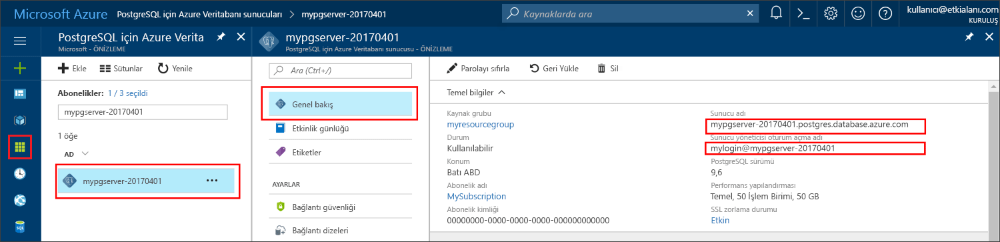

# <a name="azure-database-for-postgresql-use-go-language-tooconnect-and-query-data"></a>Azure veritabanı PostgreSQL için: dil tooconnect ve sorgu veri kullanımı gidin
Bu hızlı başlangıç gösteren nasıl PostgreSQL kullanma tooconnect tooan Azure veritabanı kod yazılmış Merhaba [Git](https://golang.org/) dili (golang). Nasıl toouse SQL deyimleri tooquery, Ekle, Güncelleştir ve hello veritabanında bulunan verileri silme gösterir. Bu makale, yeni tooworking PostgreSQL için Azure veritabanıyla olan ancak bu, Git, kullanarak geliştirme ile bildiğinizi varsayar.

## <a name="prerequisites"></a>Ön koşullar
Bu hızlı başlangıç Bu kılavuzlara birini başlangıç noktası olarak oluşturulan hello kaynakları kullanır:
- [DB Oluşturma - Portal](quickstart-create-server-database-portal.md)
- [DB Oluşturma - Azure CLI](quickstart-create-server-database-azure-cli.md)

## <a name="install-go-and-pq-connector"></a>Go ve pq bağlayıcısını yükleme
Yükleme [Git](https://golang.org/doc/install) ve hello [saf Git Postgres sürücüsü (pq)](https://github.com/lib/pq) kendi makinede. Platformunuz bağlı olarak hello adımları izleyin:

### <a name="windows"></a>Windows
1. [Karşıdan](https://golang.org/dl/) ve Microsoft toohello göre Windows için Git yükleme [yükleme yönergeleri](https://golang.org/doc/install).
2. Merhaba Başlat menüsünden Hello komut istemi başlatın.
3. Projeniz için şöyle bir klasör oluşturun. `mkdir  %USERPROFILE%\go\src\postgresqlgo`.
4. Dizin hello proje klasörüne gibi değiştirmek `cd %USERPROFILE%\go\src\postgresqlgo`.
5. Merhaba ortam değişkeni GOPATH toopoint toohello kaynak kod dizini için ayarlayın. `set GOPATH=%USERPROFILE%\go`.
6. Merhaba yüklemek [saf Git Postgres sürücüsü (pq)](https://github.com/lib/pq) hello çalıştırarak `go get github.com/lib/pq` komutu.

   Özet olarak, Git yüklemeniz ve ardından hello komut isteminde şu komutları çalıştırın:
   ```cmd
   mkdir  %USERPROFILE%\go\src\postgresqlgo
   cd %USERPROFILE%\go\src\postgresqlgo
   set GOPATH=%USERPROFILE%\go
   go get github.com/lib/pq
   ```

### <a name="linux-ubuntu"></a>Linux (Ubuntu)
1. Merhaba Bash kabuğunda başlatın. 
2. `sudo apt-get install golang-go` komutunu çalıştırarak Go'yu yükleyin.
3. Giriş dizininizde projeniz için `mkdir -p ~/go/src/postgresqlgo/` gibi bir klasör oluşturun.
4. Dizin hello klasörüne gibi değiştirmek `cd ~/go/src/postgresqlgo/`.
5. Kümesi hello GOPATH ortam değişkeni toopoint tooa geçerli bir kaynak dizini, geçerli ev gibi dizinin klasörüne gidin. Merhaba bash kabuğunda çalıştırmak `export GOPATH=~/go` tooadd hello hello geçerli kabuk oturumu için GOPATH hello gibi dizin gidin.
6. Merhaba yüklemek [saf Git Postgres sürücüsü (pq)](https://github.com/lib/pq) hello çalıştırarak `go get github.com/lib/pq` komutu.

   Özetle, şu bash komutlarını çalıştırın:
   ```bash
   sudo apt-get install golang-go
   mkdir -p ~/go/src/postgresqlgo/
   cd ~/go/src/postgresqlgo/
   export GOPATH=~/go/
   go get github.com/lib/pq
   ```

### <a name="apple-macos"></a>Apple macOS
1. İndirme ve yükleme toohello göre Git [yükleme yönergeleri](https://golang.org/doc/install) platformunuz eşleşen. 
2. Merhaba Bash kabuğunda başlatın. 
3. Giriş dizininizde projeniz için `mkdir -p ~/go/src/postgresqlgo/` gibi bir klasör oluşturun.
4. Dizin hello klasörüne gibi değiştirmek `cd ~/go/src/postgresqlgo/`.
5. Kümesi hello GOPATH ortam değişkeni toopoint tooa geçerli bir kaynak dizini, geçerli ev gibi dizinin klasörüne gidin. Merhaba bash kabuğunda çalıştırmak `export GOPATH=~/go` tooadd hello hello geçerli kabuk oturumu için GOPATH hello gibi dizin gidin.
6. Merhaba yüklemek [saf Git Postgres sürücüsü (pq)](https://github.com/lib/pq) hello çalıştırarak `go get github.com/lib/pq` komutu.

   Özetle, Go’yu yükleyin ve ardından şu bash komutlarını çalıştırın:
   ```bash
   mkdir -p ~/go/src/postgresqlgo/
   cd ~/go/src/postgresqlgo/
   export GOPATH=~/go/
   go get github.com/lib/pq
   ```

## <a name="get-connection-information"></a>Bağlantı bilgilerini alma
Merhaba bağlantı gerekli bilgileri tooconnect toohello Azure veritabanı için PostgreSQL alın. Tam sunucu adını ve oturum açma kimlik bilgileri hello gerekir.

1. İçinde toohello oturum [Azure portal](https://portal.azure.com/).
2. Merhaba sol taraftaki menüden Azure portalında, **tüm kaynakları** ve oluşturduğunuz, gibi hello sunucu araması **mypgserver 20170401**.
3. Merhaba sunucu adına tıklatarak **mypgserver 20170401**.
4. Select hello sunucunun **genel bakış** sayfası. Merhaba Not **sunucu adı** ve **sunucu yönetici oturum açma adı**.
 
5. Sunucu oturum açma bilgilerinizi unutursanız, toohello gidin **genel bakış** sayfası ve görünüm hello sunucu yönetici oturum açma adı. Gerekirse, hello parola sıfırlama.

## <a name="build-and-run-go-code"></a>Go kodunu derleme ve çalıştırma 
1. toowrite Golang kodu, Microsoft Windows, Not Defteri gibi bir basit bir metin düzenleyicisi kullanabilirsiniz [VI](http://manpages.ubuntu.com/manpages/xenial/man1/nvi.1.html#contenttoc5) veya [Nano](https://www.nano-editor.org/) Ubuntu ya da macOS TextEdit. Daha zengin bir Tümleşik Geliştirme Ortamı (IDE) tercih ediyorsanız [Atom](https://atom.io/), Jetbrains [Gogland](https://www.jetbrains.com/go/) veya Microsoft [Visual Studio Code](https://code.visualstudio.com/) kullanmayı deneyebilirsiniz.
2. Merhaba Golang kodu hello bölümlerden metin dosyasına yapıştırın ve proje klasörünüzdeki dosya uzantısına sahip saklamalısınız \*Windows yolu gibi .go `%USERPROFILE%\go\src\postgresqlgo\createtable.go` ya da Linux yolu `~/go/src/postgresqlgo/createtable.go`.
3. Merhaba bulun `HOST`, `DATABASE`, `USER`, ve `PASSWORD` sabitleri hello kod ve kendi değerlerle değiştirin hello örnek değerler.  
4. Merhaba komut istemi başlatın veya kabuk bash. Dizini değiştirerek proje klasörünüze geçin. Örneğin; Windows’da `cd %USERPROFILE%\go\src\postgresqlgo\`. Linux'ta `cd ~/go/src/postgresqlgo/`. Belirtilen hello IDE ortamları bazıları, hata ayıklama ve çalışma zamanı yeteneklerini Kabuk komutları gerek kalmadan sunar.
5. Merhaba komutu yazarak Hello kodu çalıştırma `go run createtable.go` toocompile hello uygulama ve çalıştırın. 
6. Alternatif olarak, toobuild hello kodu yerel bir uygulamaya `go build createtable.go`, ardından başlatma `createtable.exe` toorun Merhaba uygulaması.

## <a name="connect-and-create-a-table"></a>Bağlanma ve tablo oluşturma
Kullanım hello aşağıdakileri tooconnect kod ve kullanarak bir tablo oluşturmak **CREATE TABLE** SQL deyimi, arkasından **INSERT INTO** SQL deyimleri tooadd satırları hello tabloya.

Merhaba kod üç paketlerini içeri aktarır: Merhaba [sql paketi](https://golang.org/pkg/database/sql/), hello [pq paket](http://godoc.org/github.com/lib/pq) sürücü toocommunicate hello Postgres sunucu ve hello olarak [fmt paket](https://golang.org/pkg/fmt/) yazdırılması için Giriş ve çıkış hello komut satırında.

Merhaba kod yöntemi çağırır [sql. Open()](http://godoc.org/github.com/lib/pq#Open) tooconnect tooAzure PostgreSQL ve denetimleri hello bağlantı yöntemini kullanarak veritabanı [db. Ping()](https://golang.org/pkg/database/sql/#DB.Ping). A [veritabanı işleci](https://golang.org/pkg/database/sql/#DB) boyunca, hello bağlantı havuzu hello veritabanı sunucusu için bulunduran kullanılır. Merhaba kod çağrıları hello [Exec()](https://golang.org/pkg/database/sql/#DB.Exec) yöntemi birkaç kez toorun birkaç SQL komutları. Her bir hata oluştu, özel checkError() yöntemi toocheck ve zaman bir hata oluşursa tooexit Panik.

Hello yerine `HOST`, `DATABASE`, `USER`, ve `PASSWORD` kendi değerlerinizi parametrelerle. 

```go
package main

import (
    "database/sql"
    "fmt"
    _ "github.com/lib/pq"
)

const (
    // Initialize connection constants.
    HOST     = "mypgserver-20170401.postgres.database.azure.com"
    DATABASE = "mypgsqldb"
    USER     = "mylogin@mypgserver-20170401"
    PASSWORD = "<server_admin_password>"
)

func checkError(err error) {
    if err != nil {
        panic(err)
    }
}

func main() {
    // Initialize connection string.
    var connectionString string = fmt.Sprintf("host=%s user=%s password=%s dbname=%s sslmode=require", HOST, USER, PASSWORD, DATABASE)

    // Initialize connection object.
    db, err := sql.Open("postgres", connectionString)
    checkError(err)

    err = db.Ping()
    checkError(err)
    fmt.Println("Successfully created connection toodatabase")

    // Drop previous table of same name if one exists.
    _, err = db.Exec("DROP TABLE IF EXISTS inventory;")
    checkError(err)
    fmt.Println("Finished dropping table (if existed)")

    // Create table.
    _, err = db.Exec("CREATE TABLE inventory (id serial PRIMARY KEY, name VARCHAR(50), quantity INTEGER);")
    checkError(err)
    fmt.Println("Finished creating table")

    // Insert some data into table.
    sql_statement := "INSERT INTO inventory (name, quantity) VALUES ($1, $2);"
    _, err = db.Exec(sql_statement, "banana", 150)
    checkError(err)
    _, err = db.Exec(sql_statement, "orange", 154)
    checkError(err)
    _, err = db.Exec(sql_statement, "apple", 100)
    checkError(err)
    fmt.Println("Inserted 3 rows of data")
}
```

## <a name="read-data"></a>Verileri okuma
Kullanım hello aşağıdaki tooconnect kod ve hello kullanarak verileri okuyun bir **seçin** SQL deyimi. 

Merhaba kod üç paketlerini içeri aktarır: Merhaba [sql paketi](https://golang.org/pkg/database/sql/), hello [pq paket](http://godoc.org/github.com/lib/pq) sürücü toocommunicate hello Postgres sunucu ve hello olarak [fmt paket](https://golang.org/pkg/fmt/) yazdırılması için Giriş ve çıkış hello komut satırında.

Merhaba kod yöntemi çağırır [sql. Open()](http://godoc.org/github.com/lib/pq#Open) tooconnect tooAzure PostgreSQL ve denetimleri hello bağlantı yöntemini kullanarak veritabanı [db. Ping()](https://golang.org/pkg/database/sql/#DB.Ping). A [veritabanı işleci](https://golang.org/pkg/database/sql/#DB) boyunca, hello bağlantı havuzu hello veritabanı sunucusu için bulunduran kullanılır. Merhaba seçme sorgusu yöntemi çağrılarak çalıştırılır [db. Query()](https://golang.org/pkg/database/sql/#DB.Query), ve hello elde edilen satırları türünde bir değişken tutulur [satırları](https://golang.org/pkg/database/sql/#Rows). Merhaba kod okur hello sütun veri değerlerini hello geçerli satırda yöntemini kullanarak [satır. Scan()](https://golang.org/pkg/database/sql/#Rows.Scan) ve döngüleri hello yineleyici kullanarak hello satırlarda üzerinden [satır. Next()](https://golang.org/pkg/database/sql/#Rows.Next) kadar daha fazla satır yok. Her satırın sütun yazdırılan toohello konsol çıkışı değerlerdir. Her bir hata oluştu, özel checkError() yöntemi toocheck ve zaman bir hata oluşursa tooexit Panik.

Hello yerine `HOST`, `DATABASE`, `USER`, ve `PASSWORD` kendi değerlerinizi parametrelerle. 

```go
package main

import (
    "database/sql"
    "fmt"
    _ "github.com/lib/pq"
)

const (
    // Initialize connection constants.
    HOST     = "mypgserver-20170401.postgres.database.azure.com"
    DATABASE = "mypgsqldb"
    USER     = "mylogin@mypgserver-20170401"
    PASSWORD = "<server_admin_password>"
)

func checkError(err error) {
    if err != nil {
        panic(err)
    }
}

func main() {

    // Initialize connection string.
    var connectionString string = fmt.Sprintf("host=%s user=%s password=%s dbname=%s sslmode=require", HOST, USER, PASSWORD, DATABASE)

    // Initialize connection object.
    db, err := sql.Open("postgres", connectionString)
    checkError(err)

    err = db.Ping()
    checkError(err)
    fmt.Println("Successfully created connection toodatabase")

    // Read rows from table.
    var id int
    var name string
    var quantity int

    sql_statement := "SELECT * from inventory;"
    rows, err := db.Query(sql_statement)
    checkError(err)

    for rows.Next() {
        switch err := rows.Scan(&id, &name, &quantity); err {
        case sql.ErrNoRows:
            fmt.Println("No rows were returned")
        case nil:
            fmt.Printf("Data row = (%d, %s, %d)\n", id, name, quantity)
        default:
            checkError(err)
        }
    }
}
```

## <a name="update-data"></a>Verileri güncelleştirme
Kullanım hello aşağıdaki tooconnect kod ve hello kullanarak veri güncelleştirme bir **güncelleştirme** SQL deyimi.

Merhaba kod üç paketlerini içeri aktarır: Merhaba [sql paketi](https://golang.org/pkg/database/sql/), hello [pq paket](http://godoc.org/github.com/lib/pq) sürücü toocommunicate hello Postgres sunucu ve hello olarak [fmt paket](https://golang.org/pkg/fmt/) yazdırılması için Giriş ve çıkış hello komut satırında.

Merhaba kod yöntemi çağırır [sql. Open()](http://godoc.org/github.com/lib/pq#Open) tooconnect tooAzure PostgreSQL ve denetimleri hello bağlantı yöntemini kullanarak veritabanı [db. Ping()](https://golang.org/pkg/database/sql/#DB.Ping). A [veritabanı işleci](https://golang.org/pkg/database/sql/#DB) boyunca, hello bağlantı havuzu hello veritabanı sunucusu için bulunduran kullanılır. Merhaba kod çağrıları hello [Exec()](https://golang.org/pkg/database/sql/#DB.Exec) yöntemi toorun hello hello tablosunu güncelleştirir SQL deyimi. Bir hata oluştu ve tooexit bir hata yoksa, Panik özel checkError() yöntemi toocheck ortaya çıkar.

Hello yerine `HOST`, `DATABASE`, `USER`, ve `PASSWORD` kendi değerlerinizi parametrelerle. 
```go
package main

import (
  "database/sql"
  _ "github.com/lib/pq"
  "fmt"
)

const (
    // Initialize connection constants.
    HOST     = "mypgserver-20170401.postgres.database.azure.com"
    DATABASE = "mypgsqldb"
    USER     = "mylogin@mypgserver-20170401"
    PASSWORD = "<server_admin_password>"
)

func checkError(err error) {
    if err != nil {
        panic(err)
    }
}

func main() {
    
    // Initialize connection string.
    var connectionString string = 
        fmt.Sprintf("host=%s user=%s password=%s dbname=%s sslmode=require", HOST, USER, PASSWORD, DATABASE)

    // Initialize connection object.
    db, err := sql.Open("postgres", connectionString)
    checkError(err)

    err = db.Ping()
    checkError(err)
    fmt.Println("Successfully created connection toodatabase")

    // Modify some data in table.
    sql_statement := "UPDATE inventory SET quantity = $2 WHERE name = $1;"
    _, err = db.Exec(sql_statement, "banana", 200)
    checkError(err)
    fmt.Println("Updated 1 row of data")
}
```

## <a name="delete-data"></a>Verileri silme
Kullanım hello aşağıdaki tooconnect kod ve hello kullanarak verileri okuyun bir **silmek** SQL deyimi. 

Merhaba kod üç paketlerini içeri aktarır: Merhaba [sql paketi](https://golang.org/pkg/database/sql/), hello [pq paket](http://godoc.org/github.com/lib/pq) sürücü toocommunicate hello Postgres sunucu ve hello olarak [fmt paket](https://golang.org/pkg/fmt/) yazdırılması için Giriş ve çıkış hello komut satırında.

Merhaba kod yöntemi çağırır [sql. Open()](http://godoc.org/github.com/lib/pq#Open) tooconnect tooAzure PostgreSQL ve denetimleri hello bağlantı yöntemini kullanarak veritabanı [db. Ping()](https://golang.org/pkg/database/sql/#DB.Ping). A [veritabanı işleci](https://golang.org/pkg/database/sql/#DB) boyunca, hello bağlantı havuzu hello veritabanı sunucusu için bulunduran kullanılır. Merhaba kod çağrıları hello [Exec()](https://golang.org/pkg/database/sql/#DB.Exec) yöntemi toorun hello hello tablosunu güncelleştirir SQL deyimi. Bir hata oluştu ve tooexit bir hata yoksa, Panik özel checkError() yöntemi toocheck ortaya çıkar.

Hello yerine `HOST`, `DATABASE`, `USER`, ve `PASSWORD` kendi değerlerinizi parametrelerle. 
```go
package main

import (
  "database/sql"
  _ "github.com/lib/pq"
  "fmt"
)

const (
    // Initialize connection constants.
    HOST     = "mypgserver-20170401.postgres.database.azure.com"
    DATABASE = "mypgsqldb"
    USER     = "mylogin@mypgserver-20170401"
    PASSWORD = "<server_admin_password>"
)

func checkError(err error) {
    if err != nil {
        panic(err)
    }
}

func main() {
    
    // Initialize connection string.
    var connectionString string = 
        fmt.Sprintf("host=%s user=%s password=%s dbname=%s sslmode=require", HOST, USER, PASSWORD, DATABASE)

    // Initialize connection object.
    db, err := sql.Open("postgres", connectionString)
    checkError(err)

    err = db.Ping()
    checkError(err)
    fmt.Println("Successfully created connection toodatabase")

    // Delete some data from table.
    sql_statement := "DELETE FROM inventory WHERE name = $1;"
    _, err = db.Exec(sql_statement, "orange")
    checkError(err)
    fmt.Println("Deleted 1 row of data")
}
```

## <a name="next-steps"></a>Sonraki adımlar
> [!div class="nextstepaction"]
> [Dışarı Aktarma ve İçeri Aktarma seçeneğini kullanarak veritabanınızı geçirme](./howto-migrate-using-export-and-import.md)
