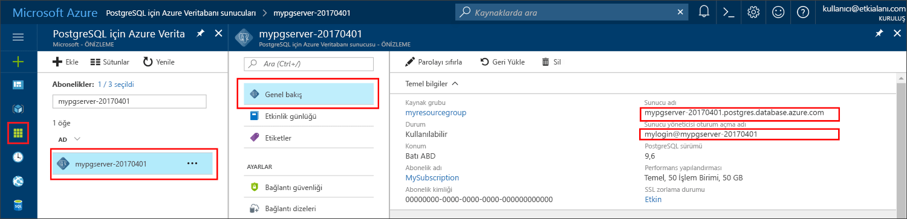

# <a name="azure-database-for-postgresql-use-python-tooconnect-and-query-data"></a>Azure veritabanı PostgreSQL için: kullanım Python tooconnect ve sorgu verileri
Bu hızlı başlangıç gösteren nasıl toouse [Python](https://python.org) tooconnect tooan Azure veritabanı PostgreSQL için. Ayrıca nasıl toouse SQL deyimleri tooquery, ekleme, güncelleştirme ve hello veritabanındaki verileri silmek macOS, Ubuntu Linux ve Windows platformları gösterir. Bu makalede Hello adımlarda Python kullanarak geliştirme ile bilgi sahibiyseniz ve yeni tooworking Azure veritabanı PostgreSQL için sahip olduğunuz varsayılmaktadır.

## <a name="prerequisites"></a>Ön koşullar
Bu hızlı başlangıç Bu kılavuzlara birini başlangıç noktası olarak oluşturulan hello kaynakları kullanır:
- [DB Oluşturma - Portal](quickstart-create-server-database-portal.md)
- [DB oluşturma - CLI](quickstart-create-server-database-azure-cli.md)

Şunları da yapmanız gerekir:
- [Python](https://www.python.org/downloads/)'ı yükleme
- [pip](https://pip.pypa.io/en/stable/installing/) paketi yüklü ([python.org](https://python.org) adresinden indirilen Python 2 >=2.7.9 veya Python 3 >=3.4 ikili dosyalarıyla çalışıyorsanız pip zaten yüklüdür).

## <a name="install-hello-python-connection-libraries-for-postgresql"></a>Merhaba Python bağlantı kitaplıkları için PostgreSQL yükleme
Merhaba yüklemek [psycopg2](http://initd.org/psycopg/docs/install.html) paketi olarak tooconnect ve sorgu hello veritabanını etkinleştirir. psycopg2 olan [Pypı kullanılabilir](https://pypi.python.org/pypi/psycopg2/) hello biçiminde [Tekerlek](http://pythonwheels.com/) hello en yaygın platformları (Linux, OSX, Windows) paketleri. Kullanım PIP tooget hello ikili tüm hello bağımlılıklar dahil olmak üzere hello modülünün sürümünü yükleyin.

1. Kendi bilgisayarınızda bir komut satırı arabirimi başlatın:
    - Linux üzerinde hello Bash kabuğunda başlatın.
    - MacOS üzerinde hello Terminal başlatın.
    - Windows hello Başlat menüsü gelen hello komut istemi başlatın.
2. Bir komutu çalıştırarak PIP hello en son sürümünü kullandığınızdan emin olun:
    ```cmd
    pip install -U pip
    ```

3. Komut tooinstall hello psycopg2 paketi aşağıdaki hello çalıştırın:
    ```cmd
    pip install psycopg2
    ```

## <a name="get-connection-information"></a>Bağlantı bilgilerini alma
Merhaba bağlantı gerekli bilgileri tooconnect toohello Azure veritabanı için PostgreSQL alın. Tam sunucu adını ve oturum açma kimlik bilgileri hello gerekir.

1. İçinde toohello oturum [Azure portal](https://portal.azure.com/).
2. Merhaba sol taraftaki menüden Azure portalında, **tüm kaynakları** arayın ve **mypgserver 20170401** (yeni oluşturduğunuz hello sunucusu).
3. Merhaba sunucu adına tıklatarak **mypgserver 20170401**.
4. Select hello sunucunun **genel bakış** sayfasında ve ardından hello Not **sunucu adı** ve **sunucu yönetici oturum açma adı**.
 
5. Sunucu oturum açma bilgilerinizi unutursanız, toohello gidin **genel bakış** tooview hello sunucu yönetici oturum açma adı sayfasında ve gerekirse sıfırlamak hello parola.

## <a name="how-toorun-python-code"></a>Nasıl toorun Python kodu
Bu konu, her biri belirli bir işlevi gerçekleştiren toplam dört kod örneği içerir. Merhaba aşağıdaki yönergeleri nasıl toocreate bir metin dosyasına bir kod bloğu Ekle ve böylece daha sonra çalıştırabileceğiniz hello dosyasını kaydedin gösterir. Emin toocreate dört ayrı dosyalar, her kod bloğu için bir tane olabilir.

- Sık kullandığınız metin düzenleyicisini kullanarak yeni bir dosya oluşturun.
- Kopyalayın ve bir hello kod örnekleri bölümleri hello metin dosyasına aşağıdaki hello yapıştırın. Hello yerine **konak**, **dbname**, **kullanıcı**, ve **parola** hello değerleri hello oluşturduğunuzda belirtilen parametrelerle Sunucu ve veritabanı.
- Merhaba dosyayı proje klasörünüze (örneğin postgres.py) hello .py uzantısıyla kaydedin. Merhaba Windows işletim sistemi çalıştırıyorsanız, emin tooselect UTF-8 hello Dosya kaydedilirken kodlaması olabilir. 
- Merhaba komut istemi veya Bash Kabuk başlatın ve hello dizin tooyour proje klasörü, örneğin değiştirmek `cd postgres`.
-  toorun hello kodu, türü hello ardından hello dosya adını, örneğin Python komut `Python postgres.py`.

> [!NOTE]
> Python sürüm 3 başlayarak, hello hatayı görebilirsiniz `SyntaxError: Missing parentheses in call too'print'` kod blokları aşağıdaki hello çalışırken. Bu durumda, her çağrı toohello komutu yerine `print "string"` parantez, gibi kullanılarak bir işlev çağrısı ile `print("string")`.

## <a name="connect-create-table-and-insert-data"></a>Bağlanma, tablo oluşturma ve veri ekleme
Kullanım hello aşağıdakileri tooconnect kod ve verileri hello kullanarak yük [psycopg2.connect](http://initd.org/psycopg/docs/connection.html) ile işlev **Ekle** SQL deyimi. Merhaba [cursor.execute](http://initd.org/psycopg/docs/cursor.html#execute) PostgreSQL veritabanında kullanılan tooexecute hello SQL sorgu işlevdir. Merhaba konak, dbname, kullanıcı ve parola parametrelerini hello sunucu ve veritabanı oluşturduğunuzda belirttiğiniz hello değerlerle değiştirin.

```Python
import psycopg2

# Update connection string information obtained from hello portal
host = "mypgserver-20170401.postgres.database.azure.com"
user = "mylogin@mypgserver-20170401"
dbname = "mypgsqldb"
password = "<server_admin_password>"
sslmode = "require"

# Construct connection string
conn_string = "host={0} user={1} dbname={2} password={3} sslmode={4}".format(host, user, dbname, password, sslmode)
conn = psycopg2.connect(conn_string) 
print "Connection established"

cursor = conn.cursor()

# Drop previous table of same name if one exists
cursor.execute("DROP TABLE IF EXISTS inventory;")
print "Finished dropping table (if existed)"

# Create table
cursor.execute("CREATE TABLE inventory (id serial PRIMARY KEY, name VARCHAR(50), quantity INTEGER);")
print "Finished creating table"

# Insert some data into table
cursor.execute("INSERT INTO inventory (name, quantity) VALUES (%s, %s);", ("banana", 150))
cursor.execute("INSERT INTO inventory (name, quantity) VALUES (%s, %s);", ("orange", 154))
cursor.execute("INSERT INTO inventory (name, quantity) VALUES (%s, %s);", ("apple", 100))
print "Inserted 3 rows of data"

# Cleanup
conn.commit()
cursor.close()
conn.close()
```

Merhaba çıktı aşağıdaki gibi görünür Hello kodu başarıyla çalıştıktan sonra:


## <a name="read-data"></a>Verileri okuma
Kullanım hello aşağıdaki kod kullanılarak eklenen tooread hello veri [cursor.execute](http://initd.org/psycopg/docs/cursor.html#execute) ile işlev **seçin** SQL deyimi. Bu işlev bir sorgu kabul eder ve bir sonuç kümesi getirir yinelendiğinde üzerinden hello kullanımı ile [cursor.fetchall()](http://initd.org/psycopg/docs/cursor.html#cursor.fetchall). Merhaba konak, dbname, kullanıcı ve parola parametrelerini hello sunucu ve veritabanı oluşturduğunuzda belirttiğiniz hello değerlerle değiştirin.

```Python
import psycopg2

# Update connection string information obtained from hello portal
host = "mypgserver-20170401.postgres.database.azure.com"
user = "mylogin@mypgserver-20170401"
dbname = "mypgsqldb"
password = "<server_admin_password>"
sslmode = "require"

# Construct connection string
conn_string = "host={0} user={1} dbname={2} password={3} sslmode={4}".format(host, user, dbname, password, sslmode)
conn = psycopg2.connect(conn_string) 
print "Connection established"

cursor = conn.cursor()

# Fetch all rows from table
cursor.execute("SELECT * FROM inventory;")
rows = cursor.fetchall()

# Print all rows
for row in rows:
    print "Data row = (%s, %s, %s)" %(str(row[0]), str(row[1]), str(row[2]))

# Cleanup
conn.commit()
cursor.close()
conn.close()
```

## <a name="update-data"></a>Verileri güncelleştirme
Kullanım hello aşağıdaki kod kullanarak, daha önce eklediğiniz tooupdate hello stok satır [cursor.execute](http://initd.org/psycopg/docs/cursor.html#execute) ile işlev **güncelleştirme** SQL deyimi. Merhaba konak, dbname, kullanıcı ve parola parametrelerini hello sunucu ve veritabanı oluşturduğunuzda belirttiğiniz hello değerlerle değiştirin.

```Python
import psycopg2

# Update connection string information obtained from hello portal
host = "mypgserver-20170401.postgres.database.azure.com"
user = "mylogin@mypgserver-20170401"
dbname = "mypgsqldb"
password = "<server_admin_password>"
sslmode = "require"

# Construct connection string
conn_string = "host={0} user={1} dbname={2} password={3} sslmode={4}".format(host, user, dbname, password, sslmode)
conn = psycopg2.connect(conn_string) 
print "Connection established"

cursor = conn.cursor()

# Update a data row in hello table
cursor.execute("UPDATE inventory SET quantity = %s WHERE name = %s;", (200, "banana"))
print "Updated 1 row of data"

# Cleanup
conn.commit()
cursor.close()
conn.close()
```

## <a name="delete-data"></a>Verileri silme
Kullanım hello aşağıdaki kod toodelete kullanarak, daha önce eklediğiniz bir envanter öğesini [cursor.execute](http://initd.org/psycopg/docs/cursor.html#execute) ile işlev **silmek** SQL deyimi. Merhaba konak, dbname, kullanıcı ve parola parametrelerini hello sunucu ve veritabanı oluşturduğunuzda belirttiğiniz hello değerlerle değiştirin.

```Python
import psycopg2

# Update connection string information obtained from hello portal
host = "mypgserver-20170401.postgres.database.azure.com"
user = "mylogin@mypgserver-20170401"
dbname = "mypgsqldb"
password = "<server_admin_password>"
sslmode = "require"

# Construct connection string
conn_string = "host={0} user={1} dbname={2} password={3} sslmode={4}".format(host, user, dbname, password, sslmode)
conn = psycopg2.connect(conn_string) 
print "Connection established"

cursor = conn.cursor()

# Delete data row from table
cursor.execute("DELETE FROM inventory WHERE name = %s;", ("orange",))
print "Deleted 1 row of data"

# Cleanup
conn.commit()
cursor.close()
conn.close()
```

## <a name="next-steps"></a>Sonraki adımlar
> [!div class="nextstepaction"]
> [Dışarı Aktarma ve İçeri Aktarma seçeneğini kullanarak veritabanınızı geçirme](./howto-migrate-using-export-and-import.md)
