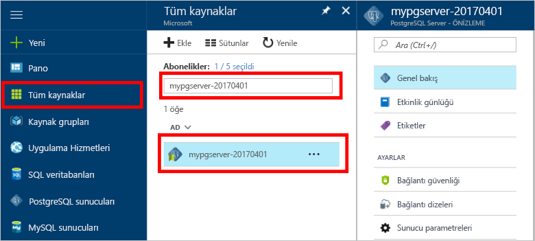

# Azure portal tooBackup ve geri yükleme PostgreSQL kullanmak için bir sunucu Azure veritabanında nasıl helloHow tooBackup and Restore a server in Azure Database for PostgreSQL using hello Azure portal

## Yedekleme otomatik olarak gerçekleşirBackup happens Automatically
Azure veritabanı için PostgreSQL kullanırken, hello veritabanı hizmeti hello hizmet yedeğini her 5 dakikada bir otomatik olarak yapar.When using Azure Database for PostgreSQL, hello database service automatically makes a backup of hello service every 5 minutes. 

Temel katman ve 35 gün kullanırken Hello yedeklemeler 7 gün boyunca kullanılabilir standart katmanı kullanırken.hello backups are available for 7 days when using Basic Tier, and 35 days when using Standard Tier. Daha fazla bilgi için bkz: [PostgreSQL hizmet katmanları için Azure veritabanı](concepts-service-tiers.md)For more information, see [Azure Database for PostgreSQL service tiers](concepts-service-tiers.md)

Bu otomatik yedekleme özelliğini kullanarak, hello server ve tüm veritabanlarının bir yeni sunucu tooan önceki zaman içinde nokta geri yükleyebilirsiniz.Using this automatic backup feature you may restore hello server and all its databases into a new server tooan earlier point-in-time.

## Hello Azure portalına geri yüklemeRestore in hello Azure portal
Azure veritabanı PostgreSQL için saat ve yeni bir kopyasını tooa hello sunucusunun toorestore hello sunucusu geri tooa noktası sağlar.Azure Database for PostgreSQL allows you toorestore hello server back tooa point in time and into tooa new copy of hello server. Bu yeni sunucu toorecover verilerinizi kullanabilirsiniz.You can use this new server toorecover your data. 

Örneğin, bir tablo yanlışlıkla olduysa bugün öğlen bırakılan, toohello zaman öğlen hemen önce geri ve tablo ve bu kopyasını hello sunucu verilerinden eksik hello alın.For example, if a table was accidentally dropped at noon today, you could restore toohello time just before noon and retrieve hello missing table and data from that new copy of hello server.

Merhaba aşağıdaki adımları hello örnek sunucu tooa sürede geri yükleme noktası:hello following steps restore hello sample server tooa point in time:
1. Merhaba içine oturum [Azure portalı](https://portal.azure.com/)Sign into hello [Azure portal](https://portal.azure.com/)
2. Azure veritabanınız PostgreSQL sunucu için bulun.Locate your Azure Database for PostgreSQL server. Hello Azure portal'ı tıklatın **tüm kaynakları** hello sol menüsünden ve hello adı yazın gibi **mypgserver 20170401**, varolan sunucunuz için toosearch.In hello Azure portal, click **All Resources** from hello left-hand menu and type in hello name, such as **mypgserver-20170401**, toosearch for your existing server. Merhaba arama sonucunda listelenen hello sunucu adına tıklayın.Click hello server name listed in hello search result. Merhaba **genel bakış** sayfası sunucunuz açar ve ek yapılandırma seçeneklerini sağlar.hello **Overview** page for your server opens and provides options for further configuration.

   

3. Hello sunucu genel bakış dikey penceresinde Hello üstte tıklatın **geri** hello araç.On hello top of hello server overview blade, click **Restore** on hello toolbar. Merhaba geri yükleme dikey pencere açılır.hello Restore blade opens.

   

4. Merhaba geri yükleme formu hello gerekli bilgilerle doldurun:Fill out hello Restore form with hello required information:

   
  - **Geri yükleme noktası**: bir noktası hello sunucu değiştirilmeden önce oluşan zaman seçin**Restore point**: Select a point-in-time that occurs before hello server was changed
  - **Hedef sunucu**: toorestore için istediğiniz yeni bir sunucu adı sağlayın**Target server**: Provide a new server name you want toorestore to
  - **Konum**: hello bölge seçemezsiniz, varsayılan olarak hello kaynak sunucu ile aynı.**Location**: You cannot select hello region, by default it is same as hello source server
  - **Fiyatlandırma katmanı**: bir sunucu geri yüklerken bu değer değiştirilemez.**Pricing tier**: You cannot change this value when restoring a server. Merhaba kaynak sunucu ile aynı.It is same as hello source server. 

5. Tıklatın **Tamam** toorestore hello sunucu toorestore tooa bir noktaya.Click **OK** toorestore hello server toorestore tooa point in time. 

6. Merhaba geri yükleme tamamlandıktan sonra verilerin beklenen şekilde geri tooverify hello oluşturulan yeni bir sunucu hello bulun.Once hello restore finishes, locate hello new server that is created tooverify hello data was restored as expected.

## Sonraki adımlarNext steps
- [Azure veritabanı PostgreSQL için için bağlantı kitaplıklarıConnection libraries for Azure Database for PostgreSQL](concepts-connection-libraries.md)
