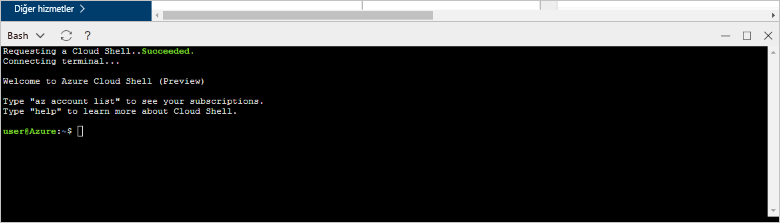

# <a name="create-an-azure-database-for-postgresql-in-hello-azure-portal"></a><span data-ttu-id="d4f1b-103">Bir Azure veritabanı için PostgreSQL hello Azure portal oluşturun.</span><span class="sxs-lookup"><span data-stu-id="d4f1b-103">Create an Azure Database for PostgreSQL in hello Azure portal</span></span>

<span data-ttu-id="d4f1b-104">Azure veritabanı PostgreSQL için toorun sağlayan yönetilen bir hizmettir, yönetmek ve yüksek oranda kullanılabilir PostgreSQL veritabanları hello bulutta ölçeklendirin.</span><span class="sxs-lookup"><span data-stu-id="d4f1b-104">Azure Database for PostgreSQL is a managed service that enables you toorun, manage, and scale highly available PostgreSQL databases in hello cloud.</span></span> <span data-ttu-id="d4f1b-105">Bu hızlı başlangıç toocreate Azure nasıl veritabanı PostgreSQL sunucusu yaklaşık beş dakika içinde hello Azure portal kullanarak gösterir.</span><span class="sxs-lookup"><span data-stu-id="d4f1b-105">This quickstart shows you how toocreate an Azure Database for PostgreSQL server using hello Azure portal in about five minutes.</span></span>

<span data-ttu-id="d4f1b-106">Azure aboneliğiniz yoksa başlamadan önce [ücretsiz](https://azure.microsoft.com/free/) bir hesap oluşturun.</span><span class="sxs-lookup"><span data-stu-id="d4f1b-106">If you don't have an Azure subscription, create a [free](https://azure.microsoft.com/free/) account before you begin.</span></span>

## <a name="log-in-toohello-azure-portal"></a><span data-ttu-id="d4f1b-107">Toohello Azure portalında oturum açın</span><span class="sxs-lookup"><span data-stu-id="d4f1b-107">Log in toohello Azure portal</span></span>
<span data-ttu-id="d4f1b-108">Web tarayıcınızı açın ve toohello gidin [Microsoft Azure portal](https://portal.azure.com/).</span><span class="sxs-lookup"><span data-stu-id="d4f1b-108">Open your web browser, and navigate toohello [Microsoft Azure portal](https://portal.azure.com/).</span></span> <span data-ttu-id="d4f1b-109">Kimlik bilgileri toosign toohello Portalı'nda girin.</span><span class="sxs-lookup"><span data-stu-id="d4f1b-109">Enter your credentials toosign in toohello portal.</span></span> <span data-ttu-id="d4f1b-110">Hizmet panonuz Hello varsayılan görünümüdür.</span><span class="sxs-lookup"><span data-stu-id="d4f1b-110">hello default view is your service dashboard.</span></span>

## <a name="create-an-azure-database-for-postgresql"></a><span data-ttu-id="d4f1b-111">PostgreSQL için Azure Veritabanı oluşturma</span><span class="sxs-lookup"><span data-stu-id="d4f1b-111">Create an Azure Database for PostgreSQL</span></span>

<span data-ttu-id="d4f1b-112">PostgreSQL için Azure Veritabanı sunucusu, tanımlı bir dizi [işlem ve depolama kaynağı](./concepts-compute-unit-and-storage.md) ile oluşturulur.</span><span class="sxs-lookup"><span data-stu-id="d4f1b-112">An Azure Database for PostgreSQL server is created with a defined set of [compute and storage resources](./concepts-compute-unit-and-storage.md).</span></span> <span data-ttu-id="d4f1b-113">Merhaba server içinde oluşturulur bir [Azure kaynak grubu](../azure-resource-manager/resource-group-overview.md).</span><span class="sxs-lookup"><span data-stu-id="d4f1b-113">hello server is created within an [Azure resource group](../azure-resource-manager/resource-group-overview.md).</span></span>

<span data-ttu-id="d4f1b-114">Bu adımları toocreate PostgreSQL sunucu için bir Azure veritabanı izleyin:</span><span class="sxs-lookup"><span data-stu-id="d4f1b-114">Follow these steps toocreate an Azure Database for PostgreSQL server:</span></span>
1.  <span data-ttu-id="d4f1b-115">Merhaba tıklatın **yeni** hello sol üst köşesinin hello Azure portalı üzerinde bulunan düğmesini (+).</span><span class="sxs-lookup"><span data-stu-id="d4f1b-115">Click hello **New** button (+) found on hello upper left-hand corner of hello Azure portal.</span></span>
2.  <span data-ttu-id="d4f1b-116">Seçin **veritabanları** hello gelen **yeni** sayfasında ve seçin **Azure veritabanı PostgreSQL için** hello gelen **veritabanları** sayfası.</span><span class="sxs-lookup"><span data-stu-id="d4f1b-116">Select **Databases** from hello **New** page, and select **Azure Database for PostgreSQL** from hello **Databases** page.</span></span>
 <span data-ttu-id="d4f1b-117"></span><span class="sxs-lookup"><span data-stu-id="d4f1b-117"></span></span>

3.  <span data-ttu-id="d4f1b-118">Yeni Sunucu ayrıntıları form Hello görüntü önceki hello üzerinde gösterildiği gibi bilgileri, aşağıdaki hello ile doldurmak:</span><span class="sxs-lookup"><span data-stu-id="d4f1b-118">Fill out hello new server details form with hello following information, as shown on hello preceding image:</span></span>

    <span data-ttu-id="d4f1b-119">Ayar</span><span class="sxs-lookup"><span data-stu-id="d4f1b-119">Setting</span></span>|<span data-ttu-id="d4f1b-120">Önerilen değer</span><span class="sxs-lookup"><span data-stu-id="d4f1b-120">Suggested value</span></span>|<span data-ttu-id="d4f1b-121">Açıklama</span><span class="sxs-lookup"><span data-stu-id="d4f1b-121">Description</span></span>
    ---|---|---
    <span data-ttu-id="d4f1b-122">Sunucu adı</span><span class="sxs-lookup"><span data-stu-id="d4f1b-122">Server name</span></span> |<span data-ttu-id="d4f1b-123">*mypgserver-20170401*</span><span class="sxs-lookup"><span data-stu-id="d4f1b-123">*mypgserver-20170401*</span></span>|<span data-ttu-id="d4f1b-124">Azure veritabanınızı PostgreSQL sunucusuna tanıtan benzersiz bir ad seçin.</span><span class="sxs-lookup"><span data-stu-id="d4f1b-124">Choose a unique name that identifies your Azure Database for PostgreSQL server.</span></span> <span data-ttu-id="d4f1b-125">Merhaba etki alanı adı *postgres.database.azure.com* eklenmiş toohello sunucu adı için uygulamalar tooconnect sağlar.</span><span class="sxs-lookup"><span data-stu-id="d4f1b-125">hello domain name *postgres.database.azure.com* is appended toohello server name you provide for applications tooconnect to.</span></span> <span data-ttu-id="d4f1b-126">Merhaba sunucu adı yalnızca küçük harf, sayı ve hello tire (-) karakterini içerebilir ve 3-63 karakter içermelidir.</span><span class="sxs-lookup"><span data-stu-id="d4f1b-126">hello server name can contain only lowercase letters, numbers, and hello hyphen (-) character, and it must contain from 3 through 63 characters.</span></span>
    <span data-ttu-id="d4f1b-127">Abonelik</span><span class="sxs-lookup"><span data-stu-id="d4f1b-127">Subscription</span></span>|<span data-ttu-id="d4f1b-128">*Aboneliğiniz*</span><span class="sxs-lookup"><span data-stu-id="d4f1b-128">*Your subscription*</span></span>|<span data-ttu-id="d4f1b-129">Merhaba toouse sunucunuz için istediğiniz Azure aboneliği.</span><span class="sxs-lookup"><span data-stu-id="d4f1b-129">hello Azure subscription that you want toouse for your server.</span></span> <span data-ttu-id="d4f1b-130">Birden çok aboneliğiniz varsa, hangi hello kaynak için faturalandırılır hello uygun abonelik seçin.</span><span class="sxs-lookup"><span data-stu-id="d4f1b-130">If you have multiple subscriptions, choose hello appropriate subscription in which hello resource is billed for.</span></span>
    <span data-ttu-id="d4f1b-131">Kaynak Grubu</span><span class="sxs-lookup"><span data-stu-id="d4f1b-131">Resource Group</span></span>|<span data-ttu-id="d4f1b-132">*myresourcegroup*</span><span class="sxs-lookup"><span data-stu-id="d4f1b-132">*myresourcegroup*</span></span>| <span data-ttu-id="d4f1b-133">Yeni bir kaynak grubu adı oluşturabilir veya mevcut bir aboneliğinizi kullanabilirsiniz.</span><span class="sxs-lookup"><span data-stu-id="d4f1b-133">You may make a new resource group name, or use an existing one from your subscription.</span></span>
    <span data-ttu-id="d4f1b-134">Sunucu yöneticisi oturum açma</span><span class="sxs-lookup"><span data-stu-id="d4f1b-134">Server admin login</span></span> |<span data-ttu-id="d4f1b-135">*mylogin*</span><span class="sxs-lookup"><span data-stu-id="d4f1b-135">*mylogin*</span></span>| <span data-ttu-id="d4f1b-136">Kendi oturum açma hesabı toouse toohello sunucusu bağlanırken olun.</span><span class="sxs-lookup"><span data-stu-id="d4f1b-136">Make your own login account toouse when connecting toohello server.</span></span> <span data-ttu-id="d4f1b-137">Hello Yöneticisi oturum açma adı 'azure_superuser', 'azure_pg_admin', 'admin', 'Yönetici', 'root', 'Konuk' veya 'genel' olamaz ve 'pg_' ile başlayamaz.</span><span class="sxs-lookup"><span data-stu-id="d4f1b-137">hello admin login name cannot be 'azure_superuser', 'azure_pg_admin', 'admin', 'administrator', 'root', 'guest', or 'public', and cannot start with 'pg_'.</span></span>
    <span data-ttu-id="d4f1b-138">Parola</span><span class="sxs-lookup"><span data-stu-id="d4f1b-138">Password</span></span> |<span data-ttu-id="d4f1b-139">*Tercih ettiğiniz*</span><span class="sxs-lookup"><span data-stu-id="d4f1b-139">*Your choice*</span></span> | <span data-ttu-id="d4f1b-140">Merhaba server yönetici hesabı için yeni bir parola oluşturun.</span><span class="sxs-lookup"><span data-stu-id="d4f1b-140">Create a new password for hello server admin account.</span></span> <span data-ttu-id="d4f1b-141">8 too128 karakterler içermelidir.</span><span class="sxs-lookup"><span data-stu-id="d4f1b-141">Must contain from 8 too128 characters.</span></span> <span data-ttu-id="d4f1b-142">Parolanız kategorileri aşağıdaki hello üçünden karakterler içermelidir – İngilizce büyük harfler, küçük harfler, sayılar (0-9) ve alfasayısal olmayan karakterler (!, $, #, %, vs.).</span><span class="sxs-lookup"><span data-stu-id="d4f1b-142">Your password must contain characters from three of hello following categories – English uppercase letters, English lowercase letters, numbers (0-9), and non-alphanumeric characters (!, $, #, %, etc.).</span></span>
    <span data-ttu-id="d4f1b-143">Konum</span><span class="sxs-lookup"><span data-stu-id="d4f1b-143">Location</span></span>|<span data-ttu-id="d4f1b-144">*Merhaba bölgeye en yakın tooyour kullanıcılar*</span><span class="sxs-lookup"><span data-stu-id="d4f1b-144">*hello region closest tooyour users*</span></span>| <span data-ttu-id="d4f1b-145">En yakın tooyour kullanıcıları hello konumu seçin.</span><span class="sxs-lookup"><span data-stu-id="d4f1b-145">Choose hello location that's closest tooyour users.</span></span>
    <span data-ttu-id="d4f1b-146">PostgreSQL Sürümü</span><span class="sxs-lookup"><span data-stu-id="d4f1b-146">PostgreSQL Version</span></span>|<span data-ttu-id="d4f1b-147">*Merhaba en son sürümünü seçin*</span><span class="sxs-lookup"><span data-stu-id="d4f1b-147">*Choose hello latest version*</span></span>| <span data-ttu-id="d4f1b-148">Belirli gereksinimlere sahip sürece hello en son sürümünü seçin.</span><span class="sxs-lookup"><span data-stu-id="d4f1b-148">Choose hello latest version unless you have specific requirements.</span></span>
    <span data-ttu-id="d4f1b-149">Fiyatlandırma Katmanı</span><span class="sxs-lookup"><span data-stu-id="d4f1b-149">Pricing Tier</span></span> | <span data-ttu-id="d4f1b-150">**Temel**, **50 İşlem Birimi** **50 GB**</span><span class="sxs-lookup"><span data-stu-id="d4f1b-150">**Basic**, **50 Compute Units** **50 GB**</span></span> | <span data-ttu-id="d4f1b-151">Tıklatın **fiyatlandırma katmanı** toospecify hello hizmeti katmanını ve performans düzeyini yeni veritabanı.</span><span class="sxs-lookup"><span data-stu-id="d4f1b-151">Click **Pricing tier** toospecify hello service tier and performance level for your new database.</span></span> <span data-ttu-id="d4f1b-152">Temel katman hello üstünde hello sekmesini seçin.</span><span class="sxs-lookup"><span data-stu-id="d4f1b-152">Choose Basic tier in hello tab at hello top.</span></span> <span data-ttu-id="d4f1b-153">Merhaba işlem birimleri kaydırıcı tooadjust hello değeri toohello sol ucunun Hello tıklatın az Bu Hızlı Başlangıç için kullanılabilir.</span><span class="sxs-lookup"><span data-stu-id="d4f1b-153">Click hello left end of hello Compute Units slider tooadjust hello value toohello least amount available for this quickstart.</span></span> <span data-ttu-id="d4f1b-154">Tıklatın **Tamam** toosave hello fiyatlandırma katmanı seçimi.</span><span class="sxs-lookup"><span data-stu-id="d4f1b-154">Click **Ok** toosave hello pricing tier selection.</span></span> <span data-ttu-id="d4f1b-155">Aşağıdaki ekran görüntüsü hello bakın.</span><span class="sxs-lookup"><span data-stu-id="d4f1b-155">See hello following screenshot.</span></span>
    | <span data-ttu-id="d4f1b-156">PIN toodashboard</span><span class="sxs-lookup"><span data-stu-id="d4f1b-156">Pin toodashboard</span></span> | <span data-ttu-id="d4f1b-157">İşaretli</span><span class="sxs-lookup"><span data-stu-id="d4f1b-157">Check</span></span> | <span data-ttu-id="d4f1b-158">Merhaba denetleyin **PIN toodashboard** seçeneği tooallow kolay izleme sunucunuzun hello ön panosu sayfasında Azure portalı.</span><span class="sxs-lookup"><span data-stu-id="d4f1b-158">Check hello **Pin toodashboard** option tooallow easy tracking of your server on hello front dashboard page of your Azure portal.</span></span>

  > [!IMPORTANT]
  > <span data-ttu-id="d4f1b-159">Burada belirttiğiniz Hello Sunucu Yöneticisi oturum açma ve parola toohello Server'daki gerekli toolog ve veritabanlarını Bu hızlı başlangıç devamındaki kümesidir.</span><span class="sxs-lookup"><span data-stu-id="d4f1b-159">hello server admin login and password that you specify here are required toolog in toohello server and its databases later in this quick start.</span></span> <span data-ttu-id="d4f1b-160">Bu bilgileri daha sonra kullanmak üzere aklınızda tutun veya kaydedin.</span><span class="sxs-lookup"><span data-stu-id="d4f1b-160">Remember or record this information for later use.</span></span>

    

4.  <span data-ttu-id="d4f1b-162">Tıklatın **oluşturma** tooprovision hello sunucu.</span><span class="sxs-lookup"><span data-stu-id="d4f1b-162">Click **Create** tooprovision hello server.</span></span> <span data-ttu-id="d4f1b-163">Sağlama too20 dakika yukarı birkaç dakika en fazla sürer.</span><span class="sxs-lookup"><span data-stu-id="d4f1b-163">Provisioning takes a few minutes, up too20 minutes maximum.</span></span>

5.  <span data-ttu-id="d4f1b-164">Merhaba araç çubuğundan, **bildirimleri** toomonitor hello dağıtım işlemi.</span><span class="sxs-lookup"><span data-stu-id="d4f1b-164">On hello toolbar, click **Notifications** toomonitor hello deployment process.</span></span>
 <span data-ttu-id="d4f1b-165"></span><span class="sxs-lookup"><span data-stu-id="d4f1b-165"></span></span>
   
  <span data-ttu-id="d4f1b-166">Varsayılan olarak, **postgres** veritabanı sunucunuz altında oluşturulur.</span><span class="sxs-lookup"><span data-stu-id="d4f1b-166">By default, **postgres** database gets created under your server.</span></span> <span data-ttu-id="d4f1b-167">Merhaba [postgres](https://www.postgresql.org/docs/9.6/static/app-initdb.html) veritabanıdır varsayılan bir veritabanı kullanıcılar, yardımcı programlar ve üçüncü taraf uygulamalar tarafından kullanılmak üzere anlamına gelir.</span><span class="sxs-lookup"><span data-stu-id="d4f1b-167">hello [postgres](https://www.postgresql.org/docs/9.6/static/app-initdb.html) database is a default database meant for use by users, utilities, and third-party applications.</span></span> 

## <a name="configure-a-server-level-firewall-rule"></a><span data-ttu-id="d4f1b-168">Sunucu düzeyinde güvenlik duvarı kuralı oluşturma</span><span class="sxs-lookup"><span data-stu-id="d4f1b-168">Configure a server-level firewall rule</span></span>

<span data-ttu-id="d4f1b-169">Hello Azure veritabanı PostgreSQL hizmeti için bir güvenlik duvarı hello sunucu düzeyinde oluşturur.</span><span class="sxs-lookup"><span data-stu-id="d4f1b-169">hello Azure Database for PostgreSQL service creates a firewall at hello server-level.</span></span> <span data-ttu-id="d4f1b-170">Bu Güvenlik Duvarı'nı bir güvenlik duvarı kuralı tooopen hello Güvenlik Duvarı'nı belirli IP adresleri için yapılandırılmadığı sürece dış uygulamaları ve Araçları'nın toohello sunucusu ve hello sunucudaki tüm veritabanları bağlanmasını önler.</span><span class="sxs-lookup"><span data-stu-id="d4f1b-170">This firewall prevents external applications and tools from connecting toohello server and any databases on hello server, unless a firewall rule is created tooopen hello firewall for specific IP addresses.</span></span> 

1.  <span data-ttu-id="d4f1b-171">Merhaba dağıtım tamamlandıktan sonra sunucunuzun bulun.</span><span class="sxs-lookup"><span data-stu-id="d4f1b-171">Locate your server after hello deployment completes.</span></span> <span data-ttu-id="d4f1b-172">Gerekirse arama yapabilirsiniz.</span><span class="sxs-lookup"><span data-stu-id="d4f1b-172">If needed, you can search for it.</span></span> <span data-ttu-id="d4f1b-173">Örneğin, **tüm kaynakları** hello sol menüsünden ve hello sunucu adı yazın (Merhaba örneği gibi *mypgserver 20170401*) toosearch yeni oluşturulan sunucunuz için.</span><span class="sxs-lookup"><span data-stu-id="d4f1b-173">For example, click **All Resources** from hello left-hand menu and type in hello server name (such as hello example *mypgserver-20170401*) toosearch for your newly created server.</span></span> <span data-ttu-id="d4f1b-174">Merhaba arama sonucunda listelenen sunucunuzun adını tıklatın.</span><span class="sxs-lookup"><span data-stu-id="d4f1b-174">Click on your server name listed in hello search result.</span></span> <span data-ttu-id="d4f1b-175">Merhaba **genel bakış** sayfası sunucunuz açar ve ek yapılandırma seçeneklerini sağlar.</span><span class="sxs-lookup"><span data-stu-id="d4f1b-175">hello **Overview** page for your server opens and provides options for further configuration.</span></span>
 
    

2.  <span data-ttu-id="d4f1b-177">Merhaba sunucusu sayfasında, seçin **bağlantı güvenliği**.</span><span class="sxs-lookup"><span data-stu-id="d4f1b-177">On hello server page, select **Connection security**.</span></span> 
    <span data-ttu-id="d4f1b-178"></span><span class="sxs-lookup"><span data-stu-id="d4f1b-178"></span></span>

3.  <span data-ttu-id="d4f1b-179">Merhaba altında **güvenlik duvarı kuralları** hello hello boş bir metin kutusunda başlığını tıklatın **kural adı** sütun toobegin hello güvenlik duvarı kuralı oluşturma.</span><span class="sxs-lookup"><span data-stu-id="d4f1b-179">Under hello **Firewall rules** heading, click in hello blank text box in hello **Rule Name** column toobegin creating hello firewall rule.</span></span> 

    <span data-ttu-id="d4f1b-180">Bu Hızlı Başlangıç için şimdi tüm IP adresleri hello Server'a hello metin kutusunda her sütun değerleri aşağıdaki hello ile doldurarak izin ver:</span><span class="sxs-lookup"><span data-stu-id="d4f1b-180">For this quick start, let's allow all IP addresses into hello server by filling in hello text box in each column with hello following values:</span></span>

    <span data-ttu-id="d4f1b-181">Kural Adı</span><span class="sxs-lookup"><span data-stu-id="d4f1b-181">Rule Name</span></span> | <span data-ttu-id="d4f1b-182">Başlangıç IP’si</span><span class="sxs-lookup"><span data-stu-id="d4f1b-182">Start IP</span></span> | <span data-ttu-id="d4f1b-183">Bitiş IP’si</span><span class="sxs-lookup"><span data-stu-id="d4f1b-183">End IP</span></span> 
    ---|---|---
    <span data-ttu-id="d4f1b-184">AllowAllIps</span><span class="sxs-lookup"><span data-stu-id="d4f1b-184">AllowAllIps</span></span> |  <span data-ttu-id="d4f1b-185">0.0.0.0</span><span class="sxs-lookup"><span data-stu-id="d4f1b-185">0.0.0.0</span></span> | <span data-ttu-id="d4f1b-186">255.255.255.255</span><span class="sxs-lookup"><span data-stu-id="d4f1b-186">255.255.255.255</span></span>

4. <span data-ttu-id="d4f1b-187">Merhaba üst araç hello bağlantı güvenliği sayfası üzerinde tıklatın **kaydetmek**.</span><span class="sxs-lookup"><span data-stu-id="d4f1b-187">On hello upper toolbar of hello Connection security page, click **Save**.</span></span> <span data-ttu-id="d4f1b-188">Birkaç dakika sonra ve bağlantı güvenliği güncelleştirme başarıyla devam etmeden önce tamamlandığını gösteren bildirim hello bildirim bekleyin.</span><span class="sxs-lookup"><span data-stu-id="d4f1b-188">Wait for a few moments and notice hello notification showing that updating connection security has finished successfully before continuing.</span></span>

    > [!NOTE]
    > <span data-ttu-id="d4f1b-189">PostgreSQL sunucusu bağlantıları tooyour Azure veritabanı 5432 bağlantı noktası üzerinden iletişim kurar.</span><span class="sxs-lookup"><span data-stu-id="d4f1b-189">Connections tooyour Azure Database for PostgreSQL server communicate over port 5432.</span></span> <span data-ttu-id="d4f1b-190">Bir şirket ağından gelen tooconnect çalışıyorsanız, bağlantı noktası 5432 üzerinden giden trafik, ağınızın güvenlik duvarı tarafından izin verilmiyor.</span><span class="sxs-lookup"><span data-stu-id="d4f1b-190">If you are trying tooconnect from within a corporate network, outbound traffic over port 5432 may not be allowed by your network's firewall.</span></span> <span data-ttu-id="d4f1b-191">BT departmanınız 5432 bir bağlantı noktası açar sürece bu durumda, mümkün tooconnect tooyour sunucu olmaz.</span><span class="sxs-lookup"><span data-stu-id="d4f1b-191">If so, you will not be able tooconnect tooyour server unless your IT department opens port 5432.</span></span>
    >

## <a name="get-hello-connection-information"></a><span data-ttu-id="d4f1b-192">Merhaba bağlantı bilgilerini alma</span><span class="sxs-lookup"><span data-stu-id="d4f1b-192">Get hello connection information</span></span>

<span data-ttu-id="d4f1b-193">PostgreSQL sunucusu için Azure Veritabanımızı oluşturduğumuzda, **postgres** adlı varsayılan veritabanı da oluşturulur.</span><span class="sxs-lookup"><span data-stu-id="d4f1b-193">When we created our Azure Database for PostgreSQL server, a default database named **postgres** gets created.</span></span> <span data-ttu-id="d4f1b-194">tooconnect tooyour veritabanı sunucusu, tooremember hello tam sunucu adı ve yönetici oturum açma kimlik bilgileri gerekir.</span><span class="sxs-lookup"><span data-stu-id="d4f1b-194">tooconnect tooyour database server, you need tooremember hello full server name and admin login credentials.</span></span> <span data-ttu-id="d4f1b-195">Bu değerleri hello hızlı başlangıç makaledeki daha önce not ettiğiniz.</span><span class="sxs-lookup"><span data-stu-id="d4f1b-195">You may have noted those values earlier in hello quick start article.</span></span> <span data-ttu-id="d4f1b-196">Yaptığınız olmayan olasılığına hello Azure portal hello sunucu genel bakış sayfasında hello sunucu adını ve oturum açma bilgileri kolayca bulabilirsiniz.</span><span class="sxs-lookup"><span data-stu-id="d4f1b-196">In case you did not, you can easily find hello server name and login information from hello server Overview page in hello Azure portal.</span></span>

1. <span data-ttu-id="d4f1b-197">Sunucunuzun **Genel Bakış** sayfasını açın.</span><span class="sxs-lookup"><span data-stu-id="d4f1b-197">Open your server's **Overview** page.</span></span> <span data-ttu-id="d4f1b-198">Merhaba Not **sunucu adı** ve **sunucu yönetici oturum açma adı**.</span><span class="sxs-lookup"><span data-stu-id="d4f1b-198">Make a note of hello **Server name** and **Server admin login name**.</span></span>
    <span data-ttu-id="d4f1b-199">İmleç her bir alan getirin ve toohello sağ hello metnin hello Kopyala simgesi görünür.</span><span class="sxs-lookup"><span data-stu-id="d4f1b-199">Hover your cursor over each field, and hello copy icon appears toohello right of hello text.</span></span> <span data-ttu-id="d4f1b-200">Gerekli toocopy hello değerleri olarak Hello Kopyala simgesine tıklayın.</span><span class="sxs-lookup"><span data-stu-id="d4f1b-200">Click hello copy icon as needed toocopy hello values.</span></span>

 

## <a name="connect-toopostgresql-database-using-psql-in-cloud-shell"></a><span data-ttu-id="d4f1b-202">Bulut Kabuğu'nda psql kullanarak tooPostgreSQL veritabanına bağlan</span><span class="sxs-lookup"><span data-stu-id="d4f1b-202">Connect tooPostgreSQL database using psql in Cloud Shell</span></span>

<span data-ttu-id="d4f1b-203">Bazı uygulamaları tooconnect tooyour Azure veritabanı PostgreSQL sunucusu için kullanabilirsiniz.</span><span class="sxs-lookup"><span data-stu-id="d4f1b-203">There are a number of applications you can use tooconnect tooyour Azure Database for PostgreSQL server.</span></span> <span data-ttu-id="d4f1b-204">İlk hello psql komut satırı yardımcı programını tooillustrate nasıl kullanalım tooconnect toohello sunucu.</span><span class="sxs-lookup"><span data-stu-id="d4f1b-204">Let's first use hello psql command-line utility tooillustrate how tooconnect toohello server.</span></span>  <span data-ttu-id="d4f1b-205">Bir web tarayıcısı kullanabilirsiniz ve hello Azure bulut hello burada açıklandığı gibi Kabuk ek yazılım tooinstall gerekir.</span><span class="sxs-lookup"><span data-stu-id="d4f1b-205">You can use a web browser and hello Azure Cloud Shell as described here without hello need tooinstall any additional software.</span></span> <span data-ttu-id="d4f1b-206">Merhaba psql yardımcı programını yerel olarak kendi makinede yüklü varsa, buradan da bağlanabilirsiniz.</span><span class="sxs-lookup"><span data-stu-id="d4f1b-206">If you have hello psql utility installed locally on your own machine, you can connect from there as well.</span></span>

1. <span data-ttu-id="d4f1b-207">Hello terminal simgesi hello üst gezinti bölmesindeki aracılığıyla Hello Azure bulut Kabuğu'nu başlatın.</span><span class="sxs-lookup"><span data-stu-id="d4f1b-207">Launch hello Azure Cloud Shell via hello terminal icon on hello top navigation pane.</span></span>

   

2. <span data-ttu-id="d4f1b-209">Hello Azure bulut Kabuk tootype bash Kabuk komutları etkinleştirme tarayıcınızda açar.</span><span class="sxs-lookup"><span data-stu-id="d4f1b-209">hello Azure Cloud Shell opens in your browser, enabling you tootype bash shell commands.</span></span>

   

3. <span data-ttu-id="d4f1b-211">Hello bulut Kabuk isteminde hello yeşil isteminde hello psql komut satırı yazarak Azure veritabanınızda PostgreSQL sunucusu için tooa veritabanına bağlanın.</span><span class="sxs-lookup"><span data-stu-id="d4f1b-211">At hello Cloud Shell prompt, connect tooa database in your Azure Database for PostgreSQL server by typing hello psql command line at hello green prompt.</span></span>

    <span data-ttu-id="d4f1b-212">Merhaba aşağıdaki hello PostgreSQL sunucusu için kullanılan tooconnect tooan Azure veritabanı biçimidir [psql](https://www.postgresql.org/docs/9.6/static/app-psql.html) yardımcı programı:</span><span class="sxs-lookup"><span data-stu-id="d4f1b-212">hello following format is used tooconnect tooan Azure Database for PostgreSQL server with hello [psql](https://www.postgresql.org/docs/9.6/static/app-psql.html) utility:</span></span>
    ```bash
    psql --host=<yourserver> --port=<port> --username=<server admin login> --dbname=<database name>
    ```

    <span data-ttu-id="d4f1b-213">Örneğin, komutu aşağıdaki hello tooan örnek sunucu bağlanır:</span><span class="sxs-lookup"><span data-stu-id="d4f1b-213">For example, hello following command connects tooan example server:</span></span>

    ```bash
    psql --host=mypgserver-20170401.postgres.database.azure.com --port=5432 --username=mylogin@mypgserver-20170401 --dbname=postgres
    ```

    <span data-ttu-id="d4f1b-214">psql parametresi</span><span class="sxs-lookup"><span data-stu-id="d4f1b-214">psql parameter</span></span> |<span data-ttu-id="d4f1b-215">Önerilen değer</span><span class="sxs-lookup"><span data-stu-id="d4f1b-215">Suggested value</span></span>|<span data-ttu-id="d4f1b-216">Açıklama</span><span class="sxs-lookup"><span data-stu-id="d4f1b-216">Description</span></span>
    ---|---|---
    <span data-ttu-id="d4f1b-217">--host</span><span class="sxs-lookup"><span data-stu-id="d4f1b-217">--host</span></span> | <span data-ttu-id="d4f1b-218">*sunucu adı*</span><span class="sxs-lookup"><span data-stu-id="d4f1b-218">*server name*</span></span> | <span data-ttu-id="d4f1b-219">Hello Azure veritabanı PostgreSQL için daha önce oluşturduğunuz zaman, kullanılan hello sunucu adı değeri belirtin.</span><span class="sxs-lookup"><span data-stu-id="d4f1b-219">Specify hello server name value that was used when you created hello Azure Database for PostgreSQL earlier.</span></span> <span data-ttu-id="d4f1b-220">Gösterilen örnek sunucumuz: mypgserver-20170401.postgres.database.azure.com. Merhaba tam etki alanı adını kullan (\*. postgres.database.azure.com) hello örnekte gösterildiği gibi.</span><span class="sxs-lookup"><span data-stu-id="d4f1b-220">Our example server shown is mypgserver-20170401.postgres.database.azure.com. Use hello fully qualified domain name (\*.postgres.database.azure.com) as shown in hello example.</span></span> <span data-ttu-id="d4f1b-221">Sunucu adınız anımsamıyorsanız hello önceki bölümde tooget hello bağlantı bilgilerini hello adımları izleyin.</span><span class="sxs-lookup"><span data-stu-id="d4f1b-221">Follow hello steps in hello previous section tooget hello connection information if you do not remember your server name.</span></span> 
    <span data-ttu-id="d4f1b-222">--port</span><span class="sxs-lookup"><span data-stu-id="d4f1b-222">--port</span></span> | <span data-ttu-id="d4f1b-223">**5432**</span><span class="sxs-lookup"><span data-stu-id="d4f1b-223">**5432**</span></span> | <span data-ttu-id="d4f1b-224">Her zaman bağlantı noktası tooAzure veritabanı için PostgreSQL bağlanırken 5432 kullanın.</span><span class="sxs-lookup"><span data-stu-id="d4f1b-224">Always use port 5432 when connecting tooAzure Database for PostgreSQL.</span></span> 
    <span data-ttu-id="d4f1b-225">--username</span><span class="sxs-lookup"><span data-stu-id="d4f1b-225">--username</span></span> | <span data-ttu-id="d4f1b-226">*sunucu yöneticisi oturum açma adı*</span><span class="sxs-lookup"><span data-stu-id="d4f1b-226">*server admin login name*</span></span> |<span data-ttu-id="d4f1b-227">İçinde hello sunucu yönetici oturum açma kullanıcı hello Azure veritabanı PostgreSQL için daha önce oluşturduğunuz zaman sağlanan yazın.</span><span class="sxs-lookup"><span data-stu-id="d4f1b-227">Type in hello  server admin login username supplied when you created hello Azure Database for PostgreSQL earlier.</span></span> <span data-ttu-id="d4f1b-228">Merhaba kullanıcıadı anımsamıyorsanız hello önceki bölümde tooget hello bağlantı bilgilerini hello adımları izleyin.</span><span class="sxs-lookup"><span data-stu-id="d4f1b-228">Follow hello steps in hello previous section tooget hello connection information if you do not remember hello username.</span></span>  <span data-ttu-id="d4f1b-229">Merhaba biçimi  *username@servername* .</span><span class="sxs-lookup"><span data-stu-id="d4f1b-229">hello format is *username@servername*.</span></span>
    <span data-ttu-id="d4f1b-230">--dbname</span><span class="sxs-lookup"><span data-stu-id="d4f1b-230">--dbname</span></span> | <span data-ttu-id="d4f1b-231">**postgres**</span><span class="sxs-lookup"><span data-stu-id="d4f1b-231">**postgres**</span></span> | <span data-ttu-id="d4f1b-232">Merhaba varsayılan sistem tarafından oluşturulan veritabanı adını kullan *postgres* hello ilk bağlantı için.</span><span class="sxs-lookup"><span data-stu-id="d4f1b-232">Use hello default system generated database name *postgres* for hello first connection.</span></span> <span data-ttu-id="d4f1b-233">Daha sonra kendi veritabanınızı oluşturun.</span><span class="sxs-lookup"><span data-stu-id="d4f1b-233">Later you create your own database.</span></span>

    <span data-ttu-id="d4f1b-234">Kendi parametre değerleri ile çalışan hello psql komutu sonra istendiğinde tootype hello server yönetici parolası olan.</span><span class="sxs-lookup"><span data-stu-id="d4f1b-234">After running hello psql command, with your own parameter values, you are prompted tootype hello server admin password.</span></span> <span data-ttu-id="d4f1b-235">Bu parola olduğu hello aynı hello sunucu oluştururken sağladığınız.</span><span class="sxs-lookup"><span data-stu-id="d4f1b-235">This password is hello same that you provided when you created hello server.</span></span> 

    <span data-ttu-id="d4f1b-236">psql parametresi</span><span class="sxs-lookup"><span data-stu-id="d4f1b-236">psql parameter</span></span> |<span data-ttu-id="d4f1b-237">Önerilen değer</span><span class="sxs-lookup"><span data-stu-id="d4f1b-237">Suggested value</span></span>|<span data-ttu-id="d4f1b-238">Açıklama</span><span class="sxs-lookup"><span data-stu-id="d4f1b-238">Description</span></span>
    ---|---|---
    <span data-ttu-id="d4f1b-239">password</span><span class="sxs-lookup"><span data-stu-id="d4f1b-239">password</span></span> | <span data-ttu-id="d4f1b-240">*yönetici parolanız*</span><span class="sxs-lookup"><span data-stu-id="d4f1b-240">*your admin password*</span></span> | <span data-ttu-id="d4f1b-241">Karakter hello bash üzerinde komut istemi gösterilmez yazılan parola Merhaba, unutmayın.</span><span class="sxs-lookup"><span data-stu-id="d4f1b-241">Note, hello typed password characters are not shown on hello bash prompt.</span></span> <span data-ttu-id="d4f1b-242">Tüm hello karakter tooauthenticate yazmış bağlanmak sonra enter tuşuna basın.</span><span class="sxs-lookup"><span data-stu-id="d4f1b-242">Press enter after you have typed all hello characters tooauthenticate and connect.</span></span>

    <span data-ttu-id="d4f1b-243">Bağlandıktan sonra hello psql yardımcı programı sql komutlarını girildiği postgres istemini görüntüler.</span><span class="sxs-lookup"><span data-stu-id="d4f1b-243">Once connected, hello psql utility displays a postgres prompt where you type sql commands.</span></span> <span data-ttu-id="d4f1b-244">Merhaba psql hello Azure bulut Kabuk içinde hello Azure veritabanı PostgreSQL server sürümü için sürümünden farklı bir sürüm olabileceğinden hello ilk bağlantı çıktıda bir uyarı görüntülenebilir.</span><span class="sxs-lookup"><span data-stu-id="d4f1b-244">In hello initial connection output, a warning may be displayed since hello psql in hello Azure Cloud Shell may be a different  version than hello Azure Database for PostgreSQL server version.</span></span> 
    
    <span data-ttu-id="d4f1b-245">Örnek psql çıktısı:</span><span class="sxs-lookup"><span data-stu-id="d4f1b-245">Example psql output:</span></span>
    ```bash
    psql (9.5.7, server 9.6.2)
    WARNING: psql major version 9.5, server major version 9.6.
        Some psql features might not work.
    SSL connection (protocol: TLSv1.2, cipher: ECDHE-RSA-AES256-SHA384, bits: 256, compression: off)
    Type "help" for help.
   
    postgres=> 
    ```

    > [!TIP]
    > <span data-ttu-id="d4f1b-246">Merhaba güvenlik duvarı değilse hello aşağıdaki hata oluşuyor tooallow hello IP adresini hello Azure bulut Kabuk yapılandırılmış:</span><span class="sxs-lookup"><span data-stu-id="d4f1b-246">If hello firewall is not configured tooallow hello IP address of hello Azure Cloud Shell, hello following error occurs:</span></span>
    > 
    > <span data-ttu-id="d4f1b-247">"psql: FATAL:  "138.91.195.82" konağı, "mylogin" kullanıcısı, "postgres" veritabanı için pg_hba.conf girdisi yok, FATAL üzerinde SSL:  SSL bağlantısı gerekiyor.</span><span class="sxs-lookup"><span data-stu-id="d4f1b-247">"psql: FATAL:  no pg_hba.conf entry for host "138.91.195.82", user "mylogin", database "postgres", SSL on FATAL:  SSL connection is required.</span></span> <span data-ttu-id="d4f1b-248">Lütfen SSL seçeneklerini belirtin ve yeniden deneyin.</span><span class="sxs-lookup"><span data-stu-id="d4f1b-248">Please specify SSL options and retry.</span></span>
    > 
    > <span data-ttu-id="d4f1b-249">tooresolve hello hata yapma emin hello sunucu yapılandırması eşleşme hello adımları hello *bir sunucu düzeyinde güvenlik duvarı kuralı yapılandırın* hello makalenin bölümüne.</span><span class="sxs-lookup"><span data-stu-id="d4f1b-249">tooresolve hello error, make sure hello server configuration matches hello steps in hello *Configure a server-level firewall rule* section of hello article.</span></span>

4.  <span data-ttu-id="d4f1b-250">Boş bir veritabanı hello aşağıdaki komutu yazarak, hello komut istemi oluşturun:</span><span class="sxs-lookup"><span data-stu-id="d4f1b-250">Create a blank database at hello prompt by typing hello following command:</span></span>
    ```bash
    CREATE DATABASE mypgsqldb;
    ```
    <span data-ttu-id="d4f1b-251">Merhaba komutu birkaç dakika sonra toocomplete sürebilir.</span><span class="sxs-lookup"><span data-stu-id="d4f1b-251">hello command may take a few moments toocomplete.</span></span> 

5.  <span data-ttu-id="d4f1b-252">Merhaba istemine komut tooswitch bağlantı toohello yeni oluşturulan veritabanı aşağıdaki hello yürütme **mypgsqldb**.</span><span class="sxs-lookup"><span data-stu-id="d4f1b-252">At hello prompt, execute hello following command tooswitch connection toohello newly created database **mypgsqldb**.</span></span>
    ```bash
    \c mypgsqldb
    ```

6.  <span data-ttu-id="d4f1b-253">\Q yazın ve ENTER tooquit psql tuşuna basın.</span><span class="sxs-lookup"><span data-stu-id="d4f1b-253">Type \q and then press ENTER tooquit psql.</span></span> <span data-ttu-id="d4f1b-254">Tamamladıktan sonra hello Azure bulut Kabuk kapatabilirsiniz.</span><span class="sxs-lookup"><span data-stu-id="d4f1b-254">You can close hello Azure Cloud Shell after you are done.</span></span>

<span data-ttu-id="d4f1b-255">Şimdi toohello Azure veritabanı için PostgreSQL bağlı sahip ve boş kullanıcı veritabanı oluşturuldu.</span><span class="sxs-lookup"><span data-stu-id="d4f1b-255">Now you have connected toohello Azure Database for PostgreSQL and created a blank user database.</span></span> <span data-ttu-id="d4f1b-256">Başka bir ortak pgAdmin aracıyla toohello sonraki bölümde tooconnect devam edin.</span><span class="sxs-lookup"><span data-stu-id="d4f1b-256">Continue toohello next section tooconnect using another common tool, pgAdmin.</span></span>

## <a name="connect-toopostgresql-database-using-pgadmin"></a><span data-ttu-id="d4f1b-257">PgAdmin kullanarak tooPostgreSQL veritabanına bağlan</span><span class="sxs-lookup"><span data-stu-id="d4f1b-257">Connect tooPostgreSQL database using pgAdmin</span></span>

<span data-ttu-id="d4f1b-258">Merhaba GUI aracını kullanarak tooconnect tooAzure PostgreSQL server _pgAdmin_</span><span class="sxs-lookup"><span data-stu-id="d4f1b-258">tooconnect tooAzure PostgreSQL server using hello GUI tool _pgAdmin_</span></span>
1.  <span data-ttu-id="d4f1b-259">Merhaba başlatma _pgAdmin_ istemci bilgisayarınızda uygulama.</span><span class="sxs-lookup"><span data-stu-id="d4f1b-259">Launch hello _pgAdmin_ application on your client computer.</span></span> <span data-ttu-id="d4f1b-260">_pgAdmin_’i http://www.pgadmin.org/ adresinden yükleyebilirsiniz.</span><span class="sxs-lookup"><span data-stu-id="d4f1b-260">You can install _pgAdmin_ from http://www.pgadmin.org/.</span></span>
2.  <span data-ttu-id="d4f1b-261">Merhaba tıklatın **yeni sunucu Ekle** hello simgesinden **hızlı bağlantılar** hello merkezi bir bölümünde hello Pano sayfası.</span><span class="sxs-lookup"><span data-stu-id="d4f1b-261">Click hello **Add New Server** icon from hello **Quick Links** section in hello center of hello Dashboard page.</span></span>
3.  <span data-ttu-id="d4f1b-262">Merhaba, **Create - Server** iletişim kutusu **genel** sekmesinde, hello sunucu için benzersiz bir kolay ad girin **Azure PostgreSQL sunucusu**.</span><span class="sxs-lookup"><span data-stu-id="d4f1b-262">In hello **Create - Server** dialog box **General** tab, enter a unique friendly Name for hello server, such as **Azure PostgreSQL Server**.</span></span>
<span data-ttu-id="d4f1b-263"></span><span class="sxs-lookup"><span data-stu-id="d4f1b-263"></span></span>
4.  <span data-ttu-id="d4f1b-264">Merhaba, **Create - Server** iletişim kutusu, **bağlantı** sekmesinde hello ayarları belirtildiği şekilde kullanın ve'ı tıklatın **kaydetmek**.</span><span class="sxs-lookup"><span data-stu-id="d4f1b-264">In hello **Create - Server** dialog box, **Connection** tab, use hello settings as specified and click **Save**.</span></span>
   <span data-ttu-id="d4f1b-265"></span><span class="sxs-lookup"><span data-stu-id="d4f1b-265"></span></span>

    <span data-ttu-id="d4f1b-266">pgAdmin parametresi</span><span class="sxs-lookup"><span data-stu-id="d4f1b-266">pgAdmin parameter</span></span> |<span data-ttu-id="d4f1b-267">Önerilen değer</span><span class="sxs-lookup"><span data-stu-id="d4f1b-267">Suggested value</span></span>|<span data-ttu-id="d4f1b-268">Açıklama</span><span class="sxs-lookup"><span data-stu-id="d4f1b-268">Description</span></span>
    ---|---|---
    <span data-ttu-id="d4f1b-269">Konak Adı/Adresi</span><span class="sxs-lookup"><span data-stu-id="d4f1b-269">Host Name/Address</span></span> | <span data-ttu-id="d4f1b-270">*sunucu adı*</span><span class="sxs-lookup"><span data-stu-id="d4f1b-270">*server name*</span></span> | <span data-ttu-id="d4f1b-271">Hello Azure veritabanı PostgreSQL için daha önce oluşturduğunuz zaman, kullanılan hello sunucu adı değeri belirtin.</span><span class="sxs-lookup"><span data-stu-id="d4f1b-271">Specify hello server name value that was used when you created hello Azure Database for PostgreSQL earlier.</span></span> <span data-ttu-id="d4f1b-272">Gösterilen örnek sunucumuz: mypgserver-20170401.postgres.database.azure.com. Merhaba tam etki alanı adını kullan (\*. postgres.database.azure.com) hello örnekte gösterildiği gibi.</span><span class="sxs-lookup"><span data-stu-id="d4f1b-272">Our example server shown is mypgserver-20170401.postgres.database.azure.com. Use hello fully qualified domain name (\*.postgres.database.azure.com) as shown in hello example.</span></span> <span data-ttu-id="d4f1b-273">Sunucu adınız anımsamıyorsanız hello önceki bölümde tooget hello bağlantı bilgilerini hello adımları izleyin.</span><span class="sxs-lookup"><span data-stu-id="d4f1b-273">Follow hello steps in hello previous section tooget hello connection information if you do not remember your server name.</span></span> 
    <span data-ttu-id="d4f1b-274">Bağlantı noktası</span><span class="sxs-lookup"><span data-stu-id="d4f1b-274">Port</span></span> | <span data-ttu-id="d4f1b-275">**5432**</span><span class="sxs-lookup"><span data-stu-id="d4f1b-275">**5432**</span></span> | <span data-ttu-id="d4f1b-276">Her zaman bağlantı noktası tooAzure veritabanı için PostgreSQL bağlanırken 5432 kullanın.</span><span class="sxs-lookup"><span data-stu-id="d4f1b-276">Always use port 5432 when connecting tooAzure Database for PostgreSQL.</span></span>  
    <span data-ttu-id="d4f1b-277">Bakım Veritabanı</span><span class="sxs-lookup"><span data-stu-id="d4f1b-277">Maintenance Database</span></span> | <span data-ttu-id="d4f1b-278">**postgres**</span><span class="sxs-lookup"><span data-stu-id="d4f1b-278">**postgres**</span></span> | <span data-ttu-id="d4f1b-279">Merhaba varsayılan sistem tarafından oluşturulan veritabanı adını kullan *postgres*.</span><span class="sxs-lookup"><span data-stu-id="d4f1b-279">Use hello default system generated database name *postgres*.</span></span>
    <span data-ttu-id="d4f1b-280">User Name</span><span class="sxs-lookup"><span data-stu-id="d4f1b-280">User Name</span></span> | <span data-ttu-id="d4f1b-281">*sunucu yöneticisi oturum açma adı*</span><span class="sxs-lookup"><span data-stu-id="d4f1b-281">*server admin login name*</span></span> | <span data-ttu-id="d4f1b-282">İçinde hello sunucu yönetici oturum açma kullanıcı hello Azure veritabanı PostgreSQL için daha önce oluşturduğunuz zaman sağlanan yazın.</span><span class="sxs-lookup"><span data-stu-id="d4f1b-282">Type in hello server admin login username supplied when you created hello Azure Database for PostgreSQL earlier.</span></span> <span data-ttu-id="d4f1b-283">Merhaba kullanıcıadı anımsamıyorsanız hello önceki bölümde tooget hello bağlantı bilgilerini hello adımları izleyin.</span><span class="sxs-lookup"><span data-stu-id="d4f1b-283">Follow hello steps in hello previous section tooget hello connection information if you do not remember hello username.</span></span> <span data-ttu-id="d4f1b-284">Merhaba biçimi  *username@servername* .</span><span class="sxs-lookup"><span data-stu-id="d4f1b-284">hello format is *username@servername*.</span></span>
    <span data-ttu-id="d4f1b-285">Parola</span><span class="sxs-lookup"><span data-stu-id="d4f1b-285">Password</span></span> | <span data-ttu-id="d4f1b-286">*yönetici parolanız*</span><span class="sxs-lookup"><span data-stu-id="d4f1b-286">*your admin password*</span></span> |  <span data-ttu-id="d4f1b-287">Merhaba parola seçtiğiniz zaman hello sunucusu bu quickstart daha önce oluşturulan.</span><span class="sxs-lookup"><span data-stu-id="d4f1b-287">hello password you chose when you created hello server earlier in this quickstart.</span></span>
    <span data-ttu-id="d4f1b-288">Rol</span><span class="sxs-lookup"><span data-stu-id="d4f1b-288">Role</span></span> | <span data-ttu-id="d4f1b-289">*boş bırakın*</span><span class="sxs-lookup"><span data-stu-id="d4f1b-289">*leave blank*</span></span> | <span data-ttu-id="d4f1b-290">Hayır tooprovide bir rolü bu noktada adı.</span><span class="sxs-lookup"><span data-stu-id="d4f1b-290">No need tooprovide a role name at this point.</span></span> <span data-ttu-id="d4f1b-291">Merhaba alanı boş bırakın.</span><span class="sxs-lookup"><span data-stu-id="d4f1b-291">Leave hello field blank.</span></span>
    <span data-ttu-id="d4f1b-292">SSL Modu</span><span class="sxs-lookup"><span data-stu-id="d4f1b-292">SSL Mode</span></span> | <span data-ttu-id="d4f1b-293">Gerektirme</span><span class="sxs-lookup"><span data-stu-id="d4f1b-293">Require</span></span> | <span data-ttu-id="d4f1b-294">Tüm Azure PostgreSQL sunucuları, varsayılan olarak SSL’yi zorunla tutma seçeneği AÇIK konumundayken oluşturulur.</span><span class="sxs-lookup"><span data-stu-id="d4f1b-294">By default, all Azure PostgreSQL servers are created with SSL enforcing turned ON.</span></span> <span data-ttu-id="d4f1b-295">SSL zorlama, devre dışı tooturn ayrıntıları görmek [zorlamayı SSL](./concepts-ssl-connection-security.md).</span><span class="sxs-lookup"><span data-stu-id="d4f1b-295">tooturn OFF SSL enforcing, see details in [Enforcing SSL](./concepts-ssl-connection-security.md).</span></span>
    
5.  <span data-ttu-id="d4f1b-296">**Kaydet** düğmesine tıklayın.</span><span class="sxs-lookup"><span data-stu-id="d4f1b-296">Click **Save**.</span></span>
6.  <span data-ttu-id="d4f1b-297">Merhaba tarayıcı sol hello bölmesinde **sunucuları** düğümü.</span><span class="sxs-lookup"><span data-stu-id="d4f1b-297">In hello Browser left pane, expand hello **Servers** node.</span></span> <span data-ttu-id="d4f1b-298">Sunucunuz, örneğin tercih **Azure PostgreSQL sunucusu** ve tooconnect tooit'ı tıklatın.</span><span class="sxs-lookup"><span data-stu-id="d4f1b-298">Choose your server, for example **Azure PostgreSQL Server** and click tooconnect tooit.</span></span>
7. <span data-ttu-id="d4f1b-299">Merhaba sunucu düğümünü genişletin ve ardından **veritabanları** altındaki.</span><span class="sxs-lookup"><span data-stu-id="d4f1b-299">Expand hello server node, and then expand **Databases** under it.</span></span> <span data-ttu-id="d4f1b-300">Merhaba varolan içermelidir *postgres* veritabanı ve herhangi bir yeni oluşturulan kullanıcı veritabanı gibi *mypgsqldb*, hello önceki bölümde oluşturduğumuz.</span><span class="sxs-lookup"><span data-stu-id="d4f1b-300">hello list should include your existing *postgres* database, and any newly created user database, such as *mypgsqldb*, that we created in hello previous section.</span></span> <span data-ttu-id="d4f1b-301">PostgreSQL için Azure Veritabanı ile sunucu başına birden çok veritabanı oluşturabildiğinize dikkat edin.</span><span class="sxs-lookup"><span data-stu-id="d4f1b-301">Notice that you may create multiple databases per server with Azure Database for PostgreSQL.</span></span>
8. <span data-ttu-id="d4f1b-302">Sağ **veritabanları**, hello seçin **oluşturma** menüsüne ve ardından **veritabanı**.</span><span class="sxs-lookup"><span data-stu-id="d4f1b-302">Right-click on **Databases**, choose hello **Create** menu, and click **Database**.</span></span>
9.  <span data-ttu-id="d4f1b-303">Hello tercih ettiğiniz bir veritabanı adı yazın **veritabanı** gibi alan *mypgsqldb* hello örnekte gösterilen.</span><span class="sxs-lookup"><span data-stu-id="d4f1b-303">Type a database name of your choice in hello **Database** field, such as *mypgsqldb* shown in hello example.</span></span> 
10. <span data-ttu-id="d4f1b-304">Select hello **sahibi** hello açılan kutusundan hello veritabanı için.</span><span class="sxs-lookup"><span data-stu-id="d4f1b-304">Select hello **Owner** for hello database from hello drop-down box.</span></span> <span data-ttu-id="d4f1b-305">Sunucu yöneticisi oturum açma adınızı (örneğimizdeki *mylogin* gibi) seçin.</span><span class="sxs-lookup"><span data-stu-id="d4f1b-305">Choose your server admin login name, such as our example *mylogin*.</span></span>
10. <span data-ttu-id="d4f1b-306">Tıklatın **kaydetmek** toocreate yeni bir boş veritabanı.</span><span class="sxs-lookup"><span data-stu-id="d4f1b-306">Click **Save** toocreate a new blank database.</span></span>
11. <span data-ttu-id="d4f1b-307">Merhaba, **tarayıcı** bölmesinde, sunucu adının altında hello veritabanları listesinde oluşturduğunuz hello veritabanını bakın.</span><span class="sxs-lookup"><span data-stu-id="d4f1b-307">In hello **Browser** pane, see hello database you created in hello list of Databases under your server name.</span></span>
 <span data-ttu-id="d4f1b-308"></span><span class="sxs-lookup"><span data-stu-id="d4f1b-308"></span></span>


## <a name="clean-up-resources"></a><span data-ttu-id="d4f1b-309">Kaynakları temizleme</span><span class="sxs-lookup"><span data-stu-id="d4f1b-309">Clean up resources</span></span>
<span data-ttu-id="d4f1b-310">Temiz hello hızlı başlangıcı oluşturduğunuz hello kaynakları silerek hello [Azure kaynak grubu](../azure-resource-manager/resource-group-overview.md)hello kaynak grubundaki tüm hello kaynakları içerir veya varsa hello bir sunucu kaynağı silerek tookeep hello istiyor olduğu gibi diğer kaynaklar.</span><span class="sxs-lookup"><span data-stu-id="d4f1b-310">Clean up hello resources you created in hello quickstart either by deleting hello [Azure resource group](../azure-resource-manager/resource-group-overview.md), which includes all hello resources in hello resource group, or by deleting hello one server resource if you want tookeep hello other resources intact.</span></span>

> [!TIP]
> <span data-ttu-id="d4f1b-311">Bu koleksiyondaki diğer hızlı başlangıçlar, bu hızlı başlangıcı temel alır.</span><span class="sxs-lookup"><span data-stu-id="d4f1b-311">Other quickstarts in this collection build upon this quick start.</span></span> <span data-ttu-id="d4f1b-312">Sonraki ile toowork toocontinue planlıyorsanız bu quickstart oluşturulan kaynakları quickstarts, değil temizleme hello.</span><span class="sxs-lookup"><span data-stu-id="d4f1b-312">If you plan toocontinue on toowork with subsequent quickstarts, do not clean up hello resources created in this quickstart.</span></span> <span data-ttu-id="d4f1b-313">Toocontinue düşünmüyorsanız bu hızlı başlangıcı hello Azure portal tarafından oluşturulan adımları toodelete kaynakları aşağıdaki hello kullanın.</span><span class="sxs-lookup"><span data-stu-id="d4f1b-313">If you do not plan toocontinue, use hello following steps toodelete resources created by this quickstart in hello Azure portal.</span></span>

<span data-ttu-id="d4f1b-314">Yeni oluşturulan hello server dahil olmak üzere toodelete hello tüm kaynak grubu:</span><span class="sxs-lookup"><span data-stu-id="d4f1b-314">toodelete hello entire resource group including hello newly created server:</span></span>
1.  <span data-ttu-id="d4f1b-315">Kaynak grubunuzun hello Azure portalı bulun.</span><span class="sxs-lookup"><span data-stu-id="d4f1b-315">Locate your resource group in hello Azure portal.</span></span> <span data-ttu-id="d4f1b-316">Merhaba sol taraftaki menüden hello Azure portal'ın, **kaynak grupları** ve hello örneğimizde gibi kaynak grubunuzun adını ardından **myresourcegroup**.</span><span class="sxs-lookup"><span data-stu-id="d4f1b-316">From hello left-hand menu in hello Azure portal, click **Resource groups** and then click hello name of your resource group, such as our example **myresourcegroup**.</span></span>
2.  <span data-ttu-id="d4f1b-317">Kaynak grubunuzun sayfasında **Sil**’e tıklayın.</span><span class="sxs-lookup"><span data-stu-id="d4f1b-317">On your resource group page, click **Delete**.</span></span> <span data-ttu-id="d4f1b-318">Ardından türü hello kaynak grubunuzun adını, Örneğimizdeki gibi **myresourcegroup**, buna hello metin kutusu tooconfirm silme ve ardından **silmek**.</span><span class="sxs-lookup"><span data-stu-id="d4f1b-318">Then type hello name of your resource group, such as our example **myresourcegroup**, in hello text box tooconfirm deletion, and then click **Delete**.</span></span>

<span data-ttu-id="d4f1b-319">Veya bunun yerine, toodelete hello sunucu yeni oluşturulan:</span><span class="sxs-lookup"><span data-stu-id="d4f1b-319">Or instead, toodelete hello newly created server:</span></span>
1.  <span data-ttu-id="d4f1b-320">Açık yoksa sunucunuz hello Azure portalı bulun.</span><span class="sxs-lookup"><span data-stu-id="d4f1b-320">Locate your server in hello Azure portal, if you do not have it open.</span></span> <span data-ttu-id="d4f1b-321">Merhaba sol taraftaki menüden Azure portalında, **tüm kaynakları**ve oluşturduğunuz hello sunucusu için arama yapın.</span><span class="sxs-lookup"><span data-stu-id="d4f1b-321">From hello left-hand menu in Azure portal, click **All resources**, and then search for hello server you created.</span></span>
2.  <span data-ttu-id="d4f1b-322">Merhaba üzerinde **genel bakış** hello sayfasında, **silmek** hello üst bölmesindeki düğmesi.</span><span class="sxs-lookup"><span data-stu-id="d4f1b-322">On hello **Overview** page, click hello **Delete** button on hello top pane.</span></span>
<span data-ttu-id="d4f1b-323"></span><span class="sxs-lookup"><span data-stu-id="d4f1b-323"></span></span>
3.  <span data-ttu-id="d4f1b-324">Toodelete istediğiniz ve etkilenen altındaki hello veritabanlarını Göster hello sunucu adını doğrulayın.</span><span class="sxs-lookup"><span data-stu-id="d4f1b-324">Confirm hello server name you want toodelete, and show hello databases under it that are affected.</span></span> <span data-ttu-id="d4f1b-325">Bizim örneğimizde gibi hello metin kutusuna sunucunuzun adını yazın **mypgserver 20170401**ve ardından **silmek**.</span><span class="sxs-lookup"><span data-stu-id="d4f1b-325">Type your server name in hello text box, such as our example **mypgserver-20170401**, and then click **Delete**.</span></span>

## <a name="next-steps"></a><span data-ttu-id="d4f1b-326">Sonraki adımlar</span><span class="sxs-lookup"><span data-stu-id="d4f1b-326">Next steps</span></span>
> [!div class="nextstepaction"]
> [<span data-ttu-id="d4f1b-327">Dışarı Aktarma ve İçeri Aktarma seçeneğini kullanarak veritabanınızı geçirme</span><span class="sxs-lookup"><span data-stu-id="d4f1b-327">Migrate your database using Export and Import</span></span>](./howto-migrate-using-export-and-import.md)
