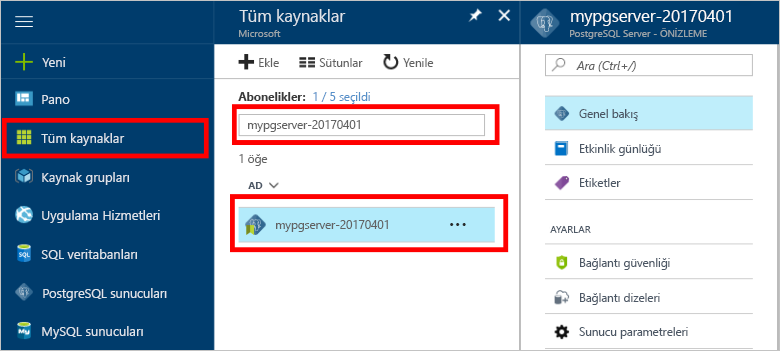

# <a name="create-an-azure-database-for-postgresql-in-hello-azure-portal"></a>Bir Azure veritabanı için PostgreSQL hello Azure portal oluşturun.

Azure veritabanı PostgreSQL için toorun sağlayan yönetilen bir hizmettir, yönetmek ve yüksek oranda kullanılabilir PostgreSQL veritabanları hello bulutta ölçeklendirin. Bu hızlı başlangıç toocreate Azure nasıl veritabanı PostgreSQL sunucusu yaklaşık beş dakika içinde hello Azure portal kullanarak gösterir.

Azure aboneliğiniz yoksa başlamadan önce [ücretsiz](https://azure.microsoft.com/free/) bir hesap oluşturun.

## <a name="log-in-toohello-azure-portal"></a>Toohello Azure portalında oturum açın
Web tarayıcınızı açın ve toohello gidin [Microsoft Azure portal](https://portal.azure.com/). Kimlik bilgileri toosign toohello Portalı'nda girin. Hizmet panonuz Hello varsayılan görünümüdür.

## <a name="create-an-azure-database-for-postgresql"></a>PostgreSQL için Azure Veritabanı oluşturma

PostgreSQL için Azure Veritabanı sunucusu, tanımlı bir dizi [işlem ve depolama kaynağı](./concepts-compute-unit-and-storage.md) ile oluşturulur. Merhaba server içinde oluşturulur bir [Azure kaynak grubu](../azure-resource-manager/resource-group-overview.md).

Bu adımları toocreate PostgreSQL sunucu için bir Azure veritabanı izleyin:
1.  Merhaba tıklatın **yeni** hello sol üst köşesinin hello Azure portalı üzerinde bulunan düğmesini (+).
2.  Seçin **veritabanları** hello gelen **yeni** sayfasında ve seçin **Azure veritabanı PostgreSQL için** hello gelen **veritabanları** sayfası.
 

3.  Yeni Sunucu ayrıntıları form Hello görüntü önceki hello üzerinde gösterildiği gibi bilgileri, aşağıdaki hello ile doldurmak:

    Ayar|Önerilen değer|Açıklama
    ---|---|---
    Sunucu adı |*mypgserver-20170401*|Azure veritabanınızı PostgreSQL sunucusuna tanıtan benzersiz bir ad seçin. Merhaba etki alanı adı *postgres.database.azure.com* eklenmiş toohello sunucu adı için uygulamalar tooconnect sağlar. Merhaba sunucu adı yalnızca küçük harf, sayı ve hello tire (-) karakterini içerebilir ve 3-63 karakter içermelidir.
    Abonelik|*Aboneliğiniz*|Merhaba toouse sunucunuz için istediğiniz Azure aboneliği. Birden çok aboneliğiniz varsa, hangi hello kaynak için faturalandırılır hello uygun abonelik seçin.
    Kaynak Grubu|*myresourcegroup*| Yeni bir kaynak grubu adı oluşturabilir veya mevcut bir aboneliğinizi kullanabilirsiniz.
    Sunucu yöneticisi oturum açma |*mylogin*| Kendi oturum açma hesabı toouse toohello sunucusu bağlanırken olun. Hello Yöneticisi oturum açma adı 'azure_superuser', 'azure_pg_admin', 'admin', 'Yönetici', 'root', 'Konuk' veya 'genel' olamaz ve 'pg_' ile başlayamaz.
    Parola |*Tercih ettiğiniz* | Merhaba server yönetici hesabı için yeni bir parola oluşturun. 8 too128 karakterler içermelidir. Parolanız kategorileri aşağıdaki hello üçünden karakterler içermelidir – İngilizce büyük harfler, küçük harfler, sayılar (0-9) ve alfasayısal olmayan karakterler (!, $, #, %, vs.).
    Konum|*Merhaba bölgeye en yakın tooyour kullanıcılar*| En yakın tooyour kullanıcıları hello konumu seçin.
    PostgreSQL Sürümü|*Merhaba en son sürümünü seçin*| Belirli gereksinimlere sahip sürece hello en son sürümünü seçin.
    Fiyatlandırma Katmanı | **Temel**, **50 İşlem Birimi** **50 GB** | Tıklatın **fiyatlandırma katmanı** toospecify hello hizmeti katmanını ve performans düzeyini yeni veritabanı. Temel katman hello üstünde hello sekmesini seçin. Merhaba işlem birimleri kaydırıcı tooadjust hello değeri toohello sol ucunun Hello tıklatın az Bu Hızlı Başlangıç için kullanılabilir. Tıklatın **Tamam** toosave hello fiyatlandırma katmanı seçimi. Aşağıdaki ekran görüntüsü hello bakın.
    | PIN toodashboard | İşaretli | Merhaba denetleyin **PIN toodashboard** seçeneği tooallow kolay izleme sunucunuzun hello ön panosu sayfasında Azure portalı.

  > [!IMPORTANT]
  > Burada belirttiğiniz Hello Sunucu Yöneticisi oturum açma ve parola toohello Server'daki gerekli toolog ve veritabanlarını Bu hızlı başlangıç devamındaki kümesidir. Bu bilgileri daha sonra kullanmak üzere aklınızda tutun veya kaydedin.

    

4.  Tıklatın **oluşturma** tooprovision hello sunucu. Sağlama too20 dakika yukarı birkaç dakika en fazla sürer.

5.  Merhaba araç çubuğundan, **bildirimleri** toomonitor hello dağıtım işlemi.
 
   
  Varsayılan olarak, **postgres** veritabanı sunucunuz altında oluşturulur. Merhaba [postgres](https://www.postgresql.org/docs/9.6/static/app-initdb.html) veritabanıdır varsayılan bir veritabanı kullanıcılar, yardımcı programlar ve üçüncü taraf uygulamalar tarafından kullanılmak üzere anlamına gelir. 

## <a name="configure-a-server-level-firewall-rule"></a>Sunucu düzeyinde güvenlik duvarı kuralı oluşturma

Hello Azure veritabanı PostgreSQL hizmeti için bir güvenlik duvarı hello sunucu düzeyinde oluşturur. Bu Güvenlik Duvarı'nı bir güvenlik duvarı kuralı tooopen hello Güvenlik Duvarı'nı belirli IP adresleri için yapılandırılmadığı sürece dış uygulamaları ve Araçları'nın toohello sunucusu ve hello sunucudaki tüm veritabanları bağlanmasını önler. 

1.  Merhaba dağıtım tamamlandıktan sonra sunucunuzun bulun. Gerekirse arama yapabilirsiniz. Örneğin, **tüm kaynakları** hello sol menüsünden ve hello sunucu adı yazın (Merhaba örneği gibi *mypgserver 20170401*) toosearch yeni oluşturulan sunucunuz için. Merhaba arama sonucunda listelenen sunucunuzun adını tıklatın. Merhaba **genel bakış** sayfası sunucunuz açar ve ek yapılandırma seçeneklerini sağlar.
 
    

2.  Merhaba sunucusu sayfasında, seçin **bağlantı güvenliği**. 
    

3.  Merhaba altında **güvenlik duvarı kuralları** hello hello boş bir metin kutusunda başlığını tıklatın **kural adı** sütun toobegin hello güvenlik duvarı kuralı oluşturma. 

    Bu Hızlı Başlangıç için şimdi tüm IP adresleri hello Server'a hello metin kutusunda her sütun değerleri aşağıdaki hello ile doldurarak izin ver:

    Kural Adı | Başlangıç IP’si | Bitiş IP’si 
    ---|---|---
    AllowAllIps |  0.0.0.0 | 255.255.255.255

4. Merhaba üst araç hello bağlantı güvenliği sayfası üzerinde tıklatın **kaydetmek**. Birkaç dakika sonra ve bağlantı güvenliği güncelleştirme başarıyla devam etmeden önce tamamlandığını gösteren bildirim hello bildirim bekleyin.

    > [!NOTE]
    > PostgreSQL sunucusu bağlantıları tooyour Azure veritabanı 5432 bağlantı noktası üzerinden iletişim kurar. Bir şirket ağından gelen tooconnect çalışıyorsanız, bağlantı noktası 5432 üzerinden giden trafik, ağınızın güvenlik duvarı tarafından izin verilmiyor. BT departmanınız 5432 bir bağlantı noktası açar sürece bu durumda, mümkün tooconnect tooyour sunucu olmaz.
    >

## <a name="get-hello-connection-information"></a>Merhaba bağlantı bilgilerini alma

PostgreSQL sunucusu için Azure Veritabanımızı oluşturduğumuzda, **postgres** adlı varsayılan veritabanı da oluşturulur. tooconnect tooyour veritabanı sunucusu, tooremember hello tam sunucu adı ve yönetici oturum açma kimlik bilgileri gerekir. Bu değerleri hello hızlı başlangıç makaledeki daha önce not ettiğiniz. Yaptığınız olmayan olasılığına hello Azure portal hello sunucu genel bakış sayfasında hello sunucu adını ve oturum açma bilgileri kolayca bulabilirsiniz.

1. Sunucunuzun **Genel Bakış** sayfasını açın. Merhaba Not **sunucu adı** ve **sunucu yönetici oturum açma adı**.
    İmleç her bir alan getirin ve toohello sağ hello metnin hello Kopyala simgesi görünür. Gerekli toocopy hello değerleri olarak Hello Kopyala simgesine tıklayın.

 

## <a name="connect-toopostgresql-database-using-psql-in-cloud-shell"></a>Bulut Kabuğu'nda psql kullanarak tooPostgreSQL veritabanına bağlan

Bazı uygulamaları tooconnect tooyour Azure veritabanı PostgreSQL sunucusu için kullanabilirsiniz. İlk hello psql komut satırı yardımcı programını tooillustrate nasıl kullanalım tooconnect toohello sunucu.  Bir web tarayıcısı kullanabilirsiniz ve hello Azure bulut hello burada açıklandığı gibi Kabuk ek yazılım tooinstall gerekir. Merhaba psql yardımcı programını yerel olarak kendi makinede yüklü varsa, buradan da bağlanabilirsiniz.

1. Hello terminal simgesi hello üst gezinti bölmesindeki aracılığıyla Hello Azure bulut Kabuğu'nu başlatın.

   

2. Hello Azure bulut Kabuk tootype bash Kabuk komutları etkinleştirme tarayıcınızda açar.

   

3. Hello bulut Kabuk isteminde hello yeşil isteminde hello psql komut satırı yazarak Azure veritabanınızda PostgreSQL sunucusu için tooa veritabanına bağlanın.

    Merhaba aşağıdaki hello PostgreSQL sunucusu için kullanılan tooconnect tooan Azure veritabanı biçimidir [psql](https://www.postgresql.org/docs/9.6/static/app-psql.html) yardımcı programı:
    ```bash
    psql --host=<yourserver> --port=<port> --username=<server admin login> --dbname=<database name>
    ```

    Örneğin, komutu aşağıdaki hello tooan örnek sunucu bağlanır:

    ```bash
    psql --host=mypgserver-20170401.postgres.database.azure.com --port=5432 --username=mylogin@mypgserver-20170401 --dbname=postgres
    ```

    psql parametresi |Önerilen değer|Açıklama
    ---|---|---
    --host | *sunucu adı* | Hello Azure veritabanı PostgreSQL için daha önce oluşturduğunuz zaman, kullanılan hello sunucu adı değeri belirtin. Gösterilen örnek sunucumuz: mypgserver-20170401.postgres.database.azure.com. Merhaba tam etki alanı adını kullan (\*. postgres.database.azure.com) hello örnekte gösterildiği gibi. Sunucu adınız anımsamıyorsanız hello önceki bölümde tooget hello bağlantı bilgilerini hello adımları izleyin. 
    --port | **5432** | Her zaman bağlantı noktası tooAzure veritabanı için PostgreSQL bağlanırken 5432 kullanın. 
    --username | *sunucu yöneticisi oturum açma adı* |İçinde hello sunucu yönetici oturum açma kullanıcı hello Azure veritabanı PostgreSQL için daha önce oluşturduğunuz zaman sağlanan yazın. Merhaba kullanıcıadı anımsamıyorsanız hello önceki bölümde tooget hello bağlantı bilgilerini hello adımları izleyin.  Merhaba biçimi  *username@servername* .
    --dbname | **postgres** | Merhaba varsayılan sistem tarafından oluşturulan veritabanı adını kullan *postgres* hello ilk bağlantı için. Daha sonra kendi veritabanınızı oluşturun.

    Kendi parametre değerleri ile çalışan hello psql komutu sonra istendiğinde tootype hello server yönetici parolası olan. Bu parola olduğu hello aynı hello sunucu oluştururken sağladığınız. 

    psql parametresi |Önerilen değer|Açıklama
    ---|---|---
    password | *yönetici parolanız* | Karakter hello bash üzerinde komut istemi gösterilmez yazılan parola Merhaba, unutmayın. Tüm hello karakter tooauthenticate yazmış bağlanmak sonra enter tuşuna basın.

    Bağlandıktan sonra hello psql yardımcı programı sql komutlarını girildiği postgres istemini görüntüler. Merhaba psql hello Azure bulut Kabuk içinde hello Azure veritabanı PostgreSQL server sürümü için sürümünden farklı bir sürüm olabileceğinden hello ilk bağlantı çıktıda bir uyarı görüntülenebilir. 
    
    Örnek psql çıktısı:
    ```bash
    psql (9.5.7, server 9.6.2)
    WARNING: psql major version 9.5, server major version 9.6.
        Some psql features might not work.
    SSL connection (protocol: TLSv1.2, cipher: ECDHE-RSA-AES256-SHA384, bits: 256, compression: off)
    Type "help" for help.
   
    postgres=> 
    ```

    > [!TIP]
    > Merhaba güvenlik duvarı değilse hello aşağıdaki hata oluşuyor tooallow hello IP adresini hello Azure bulut Kabuk yapılandırılmış:
    > 
    > "psql: FATAL:  "138.91.195.82" konağı, "mylogin" kullanıcısı, "postgres" veritabanı için pg_hba.conf girdisi yok, FATAL üzerinde SSL:  SSL bağlantısı gerekiyor. Lütfen SSL seçeneklerini belirtin ve yeniden deneyin.
    > 
    > tooresolve hello hata yapma emin hello sunucu yapılandırması eşleşme hello adımları hello *bir sunucu düzeyinde güvenlik duvarı kuralı yapılandırın* hello makalenin bölümüne.

4.  Boş bir veritabanı hello aşağıdaki komutu yazarak, hello komut istemi oluşturun:
    ```bash
    CREATE DATABASE mypgsqldb;
    ```
    Merhaba komutu birkaç dakika sonra toocomplete sürebilir. 

5.  Merhaba istemine komut tooswitch bağlantı toohello yeni oluşturulan veritabanı aşağıdaki hello yürütme **mypgsqldb**.
    ```bash
    \c mypgsqldb
    ```

6.  \Q yazın ve ENTER tooquit psql tuşuna basın. Tamamladıktan sonra hello Azure bulut Kabuk kapatabilirsiniz.

Şimdi toohello Azure veritabanı için PostgreSQL bağlı sahip ve boş kullanıcı veritabanı oluşturuldu. Başka bir ortak pgAdmin aracıyla toohello sonraki bölümde tooconnect devam edin.

## <a name="connect-toopostgresql-database-using-pgadmin"></a>PgAdmin kullanarak tooPostgreSQL veritabanına bağlan

Merhaba GUI aracını kullanarak tooconnect tooAzure PostgreSQL server _pgAdmin_
1.  Merhaba başlatma _pgAdmin_ istemci bilgisayarınızda uygulama. _pgAdmin_’i http://www.pgadmin.org/ adresinden yükleyebilirsiniz.
2.  Merhaba tıklatın **yeni sunucu Ekle** hello simgesinden **hızlı bağlantılar** hello merkezi bir bölümünde hello Pano sayfası.
3.  Merhaba, **Create - Server** iletişim kutusu **genel** sekmesinde, hello sunucu için benzersiz bir kolay ad girin **Azure PostgreSQL sunucusu**.

4.  Merhaba, **Create - Server** iletişim kutusu, **bağlantı** sekmesinde hello ayarları belirtildiği şekilde kullanın ve'ı tıklatın **kaydetmek**.
   

    pgAdmin parametresi |Önerilen değer|Açıklama
    ---|---|---
    Konak Adı/Adresi | *sunucu adı* | Hello Azure veritabanı PostgreSQL için daha önce oluşturduğunuz zaman, kullanılan hello sunucu adı değeri belirtin. Gösterilen örnek sunucumuz: mypgserver-20170401.postgres.database.azure.com. Merhaba tam etki alanı adını kullan (\*. postgres.database.azure.com) hello örnekte gösterildiği gibi. Sunucu adınız anımsamıyorsanız hello önceki bölümde tooget hello bağlantı bilgilerini hello adımları izleyin. 
    Bağlantı noktası | **5432** | Her zaman bağlantı noktası tooAzure veritabanı için PostgreSQL bağlanırken 5432 kullanın.  
    Bakım Veritabanı | **postgres** | Merhaba varsayılan sistem tarafından oluşturulan veritabanı adını kullan *postgres*.
    User Name | *sunucu yöneticisi oturum açma adı* | İçinde hello sunucu yönetici oturum açma kullanıcı hello Azure veritabanı PostgreSQL için daha önce oluşturduğunuz zaman sağlanan yazın. Merhaba kullanıcıadı anımsamıyorsanız hello önceki bölümde tooget hello bağlantı bilgilerini hello adımları izleyin. Merhaba biçimi  *username@servername* .
    Parola | *yönetici parolanız* |  Merhaba parola seçtiğiniz zaman hello sunucusu bu quickstart daha önce oluşturulan.
    Rol | *boş bırakın* | Hayır tooprovide bir rolü bu noktada adı. Merhaba alanı boş bırakın.
    SSL Modu | Gerektirme | Tüm Azure PostgreSQL sunucuları, varsayılan olarak SSL’yi zorunla tutma seçeneği AÇIK konumundayken oluşturulur. SSL zorlama, devre dışı tooturn ayrıntıları görmek [zorlamayı SSL](./concepts-ssl-connection-security.md).
    
5.  **Kaydet** düğmesine tıklayın.
6.  Merhaba tarayıcı sol hello bölmesinde **sunucuları** düğümü. Sunucunuz, örneğin tercih **Azure PostgreSQL sunucusu** ve tooconnect tooit'ı tıklatın.
7. Merhaba sunucu düğümünü genişletin ve ardından **veritabanları** altındaki. Merhaba varolan içermelidir *postgres* veritabanı ve herhangi bir yeni oluşturulan kullanıcı veritabanı gibi *mypgsqldb*, hello önceki bölümde oluşturduğumuz. PostgreSQL için Azure Veritabanı ile sunucu başına birden çok veritabanı oluşturabildiğinize dikkat edin.
8. Sağ **veritabanları**, hello seçin **oluşturma** menüsüne ve ardından **veritabanı**.
9.  Hello tercih ettiğiniz bir veritabanı adı yazın **veritabanı** gibi alan *mypgsqldb* hello örnekte gösterilen. 
10. Select hello **sahibi** hello açılan kutusundan hello veritabanı için. Sunucu yöneticisi oturum açma adınızı (örneğimizdeki *mylogin* gibi) seçin.
10. Tıklatın **kaydetmek** toocreate yeni bir boş veritabanı.
11. Merhaba, **tarayıcı** bölmesinde, sunucu adının altında hello veritabanları listesinde oluşturduğunuz hello veritabanını bakın.
 


## <a name="clean-up-resources"></a>Kaynakları temizleme
Temiz hello hızlı başlangıcı oluşturduğunuz hello kaynakları silerek hello [Azure kaynak grubu](../azure-resource-manager/resource-group-overview.md)hello kaynak grubundaki tüm hello kaynakları içerir veya varsa hello bir sunucu kaynağı silerek tookeep hello istiyor olduğu gibi diğer kaynaklar.

> [!TIP]
> Bu koleksiyondaki diğer hızlı başlangıçlar, bu hızlı başlangıcı temel alır. Sonraki ile toowork toocontinue planlıyorsanız bu quickstart oluşturulan kaynakları quickstarts, değil temizleme hello. Toocontinue düşünmüyorsanız bu hızlı başlangıcı hello Azure portal tarafından oluşturulan adımları toodelete kaynakları aşağıdaki hello kullanın.

Yeni oluşturulan hello server dahil olmak üzere toodelete hello tüm kaynak grubu:
1.  Kaynak grubunuzun hello Azure portalı bulun. Merhaba sol taraftaki menüden hello Azure portal'ın, **kaynak grupları** ve hello örneğimizde gibi kaynak grubunuzun adını ardından **myresourcegroup**.
2.  Kaynak grubunuzun sayfasında **Sil**’e tıklayın. Ardından türü hello kaynak grubunuzun adını, Örneğimizdeki gibi **myresourcegroup**, buna hello metin kutusu tooconfirm silme ve ardından **silmek**.

Veya bunun yerine, toodelete hello sunucu yeni oluşturulan:
1.  Açık yoksa sunucunuz hello Azure portalı bulun. Merhaba sol taraftaki menüden Azure portalında, **tüm kaynakları**ve oluşturduğunuz hello sunucusu için arama yapın.
2.  Merhaba üzerinde **genel bakış** hello sayfasında, **silmek** hello üst bölmesindeki düğmesi.

3.  Toodelete istediğiniz ve etkilenen altındaki hello veritabanlarını Göster hello sunucu adını doğrulayın. Bizim örneğimizde gibi hello metin kutusuna sunucunuzun adını yazın **mypgserver 20170401**ve ardından **silmek**.

## <a name="next-steps"></a>Sonraki adımlar
> [!div class="nextstepaction"]
> [Dışarı Aktarma ve İçeri Aktarma seçeneğini kullanarak veritabanınızı geçirme](./howto-migrate-using-export-and-import.md)
