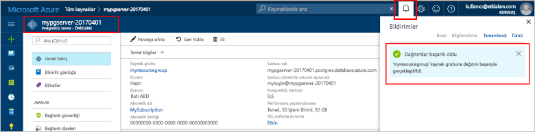

# <a name="design-your-first-azure-database-for-postgresql-using-hello-azure-portal"></a>İlk Azure veritabanınızı hello Azure portal kullanarak PostgreSQL için tasarlama

Azure veritabanı PostgreSQL için toorun sağlayan yönetilen bir hizmettir, yönetmek ve yüksek oranda kullanılabilir PostgreSQL veritabanları hello bulutta ölçeklendirin. Hello Azure portal kullanarak kolayca sunucunuzu yönetin ve bir veritabanı tasarlayın.

Bu öğreticide, Azure portal toolearn hello nasıl kullanmak için:
> [!div class="checklist"]
> * PostgreSQL için Azure Veritabanı oluşturma
> * Merhaba sunucu Güvenlik Duvarı'nı yapılandırma
> * Kullanım [ **psql** ](https://www.postgresql.org/docs/9.6/static/app-psql.html) yardımcı programı toocreate bir veritabanı
> * Örnek verileri yükleme
> * Verileri sorgulama
> * Verileri güncelleştirme
> * Verileri geri yükleme

## <a name="prerequisites"></a>Ön koşullar
Azure aboneliğiniz yoksa başlamadan önce [ücretsiz](https://azure.microsoft.com/free/) bir hesap oluşturun.

## <a name="log-in-toohello-azure-portal"></a>Toohello Azure portalında oturum açın
İçinde toohello oturum [Azure portal](https://portal.azure.com).

## <a name="create-an-azure-database-for-postgresql"></a>PostgreSQL için Azure Veritabanı oluşturma

PostgreSQL için Azure Veritabanı sunucusu, tanımlı bir dizi [işlem ve depolama kaynağı](./concepts-compute-unit-and-storage.md) ile oluşturulur. Merhaba server içinde oluşturulur bir [Azure kaynak grubu](../azure-resource-manager/resource-group-overview.md).

Bu adımları toocreate PostgreSQL sunucu için bir Azure veritabanı izleyin:
1.  Merhaba tıklatın **+ yeni** düğmesi hello sol üst köşesinin hello Azure portalı üzerinde bulunamadı.
2.  Seçin **veritabanları** hello gelen **yeni** sayfasında ve seçin **Azure veritabanı PostgreSQL için** hello gelen **veritabanları** sayfası.
 

3.  Yeni Sunucu ayrıntıları form Hello görüntü önceki hello üzerinde gösterildiği gibi bilgileri, aşağıdaki hello ile doldurmak:
    - Sunucu adı: **mypgserver 20170401** (bir sunucunun adını tooDNS adını eşler, böylece gerekli toobe genel benzersiz ise) 
    - Abonelik: birden çok aboneliğiniz varsa, hello kaynak yok veya için fatura hello uygun abonelik seçin.
    - Kaynak grubu: **myresourcegroup**
    - Tercih ettiğiniz sunucu yöneticisi oturum açma adı ve parolası
    - Konum
    - PostgreSQL Sürümü

  > [!IMPORTANT]
  > Burada belirttiğiniz Hello Sunucu Yöneticisi oturum açma ve parola toohello Server'daki gerekli toolog ve veritabanlarını Bu hızlı başlangıç devamındaki kümesidir. Bu bilgileri daha sonra kullanmak üzere aklınızda tutun veya kaydedin.

4.  Tıklatın **fiyatlandırma katmanı** toospecify hello hizmeti katmanını ve performans düzeyini yeni veritabanı. Bu hızlı başlangıç için **Temel** Katman’ı, **50 İşlem Birimini** ve dahili depolamanın **50 GB**’sini seçin.
 
5.  **Tamam**’a tıklayın.
6.  Tıklatın **oluşturma** tooprovision hello sunucu. Sağlama birkaç dakika sürer.

  > [!TIP]
  > Merhaba denetleyin **PIN toodashboard** seçeneği tooallow kolay izlenmesini dağıtımlarınızı.

7.  Merhaba araç çubuğundan, **bildirimleri** toomonitor hello dağıtım işlemi.
 
   
  Varsayılan olarak, **postgres** veritabanı sunucunuz altında oluşturulur. Merhaba [postgres](https://www.postgresql.org/docs/9.6/static/app-initdb.html) veritabanıdır varsayılan bir veritabanı kullanıcılar, yardımcı programlar ve üçüncü taraf uygulamalar tarafından kullanılmak üzere anlamına gelir. 

## <a name="configure-a-server-level-firewall-rule"></a>Sunucu düzeyinde güvenlik duvarı kuralı oluşturma

Hello Azure veritabanı PostgreSQL hizmeti için bir güvenlik duvarı hello sunucu düzeyinde oluşturur. Bu güvenlik duvarı, bir güvenlik duvarı kuralı tooopen hello Güvenlik Duvarı'nı belirli IP adresleri için yapılandırılmadığı sürece toohello sunucusu ve hello sunucudaki tüm veritabanları bağlanmasını harici uygulamalar ve Araçlar önler. 

1.  Merhaba dağıtım tamamlandıktan sonra **tüm kaynakları** hello sol menüsünden ve hello adı yazın **mypgserver 20170401** toosearch yeni oluşturulan sunucunuz için. Merhaba arama sonucunda listelenen hello sunucu adına tıklayın. Merhaba **genel bakış** sayfası sunucunuz açar ve ek yapılandırma seçeneklerini sağlar.
 
 

2.  Merhaba server dikey penceresinde, seçin **bağlantı güvenliği**. 
3.  Merhaba metin kutusu altında tıklatın **kural adı** ve yeni bir güvenlik duvarı kuralı toowhitelist hello IP aralığı bağlantı ekleyin. Şimdi bu öğreticide, yazarak tüm IP'ler izin **kural adı AllowAllIps =**, **başlangıç IP 0.0.0.0 =** ve **bitiş IP 255.255.255.255 =** ve ardından **Kaydet** . Bir IP aralığı toobe mümkün tooconnect ağınızdan kapsayan bir güvenlik duvarı kuralı ayarlayabilirsiniz.
 
 

4.  Tıklatın **kaydetmek** ve hello ardından **X** tooclose hello **bağlantıları güvenlik** sayfası.

  > [!NOTE]
  > Azure PostgreSQL sunucusu, 5432 bağlantı noktası üzerinden iletişim kurar. Bir şirket ağından gelen tooconnect çalışıyorsanız, bağlantı noktası 5432 üzerinden giden trafik, ağınızın güvenlik duvarı tarafından izin verilmiyor. Öyleyse, BT departmanınızın 5432 bir bağlantı noktası açar sürece mümkün tooconnect tooyour Azure SQL veritabanı sunucusu olmaz.
  >


## <a name="get-hello-connection-information"></a>Merhaba bağlantı bilgilerini alma

Bizim Azure veritabanı PostgreSQL sunucu için oluşturduğumuz, varsayılan hello **postgres** veritabanı da oluşturuldu. tooconnect tooyour veritabanı sunucusu, tooprovide ana bilgisayar bilgileri ve erişim kimlik bilgileri gerekir.

1. Merhaba sol taraftaki menüden Azure portalında, **tüm kaynakları** ve yeni oluşturduğunuz hello sunucu araması **mypgserver 20170401**.

  

3. Merhaba sunucu adına tıklatarak **mypgserver 20170401**.
4. Select hello sunucunun **genel bakış** sayfası. Merhaba Not **sunucu adı** ve **sunucu yönetici oturum açma adı**.

 


## <a name="connect-toopostgresql-database-using-psql-in-cloud-shell"></a>Bulut Kabuğu'nda psql kullanarak tooPostgreSQL veritabanına bağlan

Şimdi hello psql komut satırı yardımcı programını tooconnect toohello Azure veritabanı PostgreSQL sunucusu için kullanalım. 
1. Hello terminal simgesi hello üst gezinti bölmesindeki aracılığıyla Hello Azure bulut Kabuğu'nu başlatın.

   

2. Hello Azure bulut Kabuk tootype bash komutları etkinleştirme tarayıcınızda açar.

   

3. Merhaba bulut Kabuk isteminde tooyour Azure veritabanı PostgreSQL sunucusu hello psql komutları kullanarak bağlanın. Merhaba aşağıdaki hello PostgreSQL sunucusu için kullanılan tooconnect tooan Azure veritabanı biçimidir [psql](https://www.postgresql.org/docs/9.6/static/app-psql.html) yardımcı programı:
   ```bash
   psql --host=<myserver> --port=<port> --username=<server admin login> --dbname=<database name>
   ```

   Örneğin, komutu aşağıdaki hello adlı toohello varsayılan veritabanı bağlayan **postgres** PostgreSQL sunucunuzda **mypgserver 20170401.postgres.database.azure.com** erişim kimlik bilgileri kullanılarak. İstendiğinde sunucu yönetici parolanızı girin.

   ```bash
   psql --host=mypgserver-20170401.postgres.database.azure.com --port=5432 --username=mylogin@mypgserver-20170401 --dbname=postgres
   ```

## <a name="create-a-new-database"></a>Yeni veritabanı oluştur
Bağlı toohello sunucu olduğunuzda hello isteminde boş bir veritabanı oluşturun.
```bash
CREATE DATABASE mypgsqldb;
```

Merhaba istemine komut tooswitch bağlantı toohello yeni oluşturulan veritabanı aşağıdaki hello yürütme **mypgsqldb**.
```bash
\c mypgsqldb
```
## <a name="create-tables-in-hello-database"></a>Merhaba veritabanında tabloları oluşturma
Nasıl tooconnect toohello Azure veritabanı PostgreSQL için biz nasıl gidebilirsiniz bildiğinize göre toocomplete temel bazı görevler.

İlk olarak, size bir tablo oluşturun ve bazı verilerle yükleyin. Envanter bilgilerini izleyen bir tablo oluşturalım.
```sql
CREATE TABLE inventory (
    id serial PRIMARY KEY, 
    name VARCHAR(50), 
    quantity INTEGER
);
```

Yeni Tablo hello tabvles listesinde şimdi yazarak oluşturulan hello görebilirsiniz:
```sql
\dt
```

## <a name="load-data-into-hello-tables"></a>Merhaba tablolara veri yükleme
Bir tablo sahibiz, biz bazı veri içine ekleyebilirsiniz. Hello açık komut istemi penceresinde, sorgu tooinsert aşağıdaki hello bazı satırlar alt kümesini çalıştırın.
```sql
INSERT INTO inventory (id, name, quantity) VALUES (1, 'banana', 150); 
INSERT INTO inventory (id, name, quantity) VALUES (2, 'orange', 154);
```

Şimdi örnek verilerin daha önce oluşturduğunuz hello tabloya iki satır var.

## <a name="query-and-update-hello-data-in-hello-tables"></a>Sorgulamak ve hello hello tablolarındaki verileri güncelleyin
Sorgu tooretrieve bilgisinden hello veritabanı tablosundan hello yürütün. 
```sql
SELECT * FROM inventory;
```

Merhaba tablolardaki hello verileri da güncelleştirebilirsiniz
```sql
UPDATE inventory SET quantity = 200 WHERE name = 'banana';
```

veri aldığınızda hello satır buna göre güncelleştirilir.
```sql
SELECT * FROM inventory;
```

## <a name="restore-data-tooa-previous-point-in-time"></a>Zaman içinde veri tooa önceki noktası geri
Bu tablo yanlışlıkla silinmiş düşünün. Bu durum, kolayca kurtaramazsınız şeydir. Azure veritabanı PostgreSQL için toogo geri tooany zaman noktası (hello too7 gün (Temel) en son yukarı ve 35 gün (standart)) verir ve bu zaman içinde nokta tooa yeni sunucu geri yükleyin. Bu yeni sunucu toorecover silinmiş verilerinizi kullanabilirsiniz. Merhaba Hello tablo eklenmeden önce aşağıdaki adımları geri yükleme hello örnek sunucu tooa noktası.

1.  Azure veritabanı PostgreSQL sayfası sunucunuz için Hello üzerinde tıklatın **geri** hello araç. Merhaba **geri** sayfası açılır.
  
2.  Merhaba dolgu **geri** form hello gerekli bilgilerle:

  
  - **Geri yükleme noktası**: bir noktası hello sunucu değiştirilmeden önce oluşan zaman seçin
  - **Hedef sunucu**: toorestore için istediğiniz yeni bir sunucu adı sağlayın
  - **Konum**: hello bölge seçemezsiniz, varsayılan olarak hello kaynak sunucu ile aynı.
  - **Fiyatlandırma katmanı**: bir sunucu geri yüklerken bu değer değiştirilemez. Merhaba kaynak sunucu ile aynı. 
3.  Tıklatın **Tamam** toorestore hello sunucu çok[tooa noktası zaman geri](./howto-restore-server-portal.md) hello tabloların silinmişse önce. Sunucu tooa farklı bir noktaya geri yükleme zamanında oluşturur yinelenen yeni bir sunucu hello özgün sunucusu olarak hello bir noktada, belirttiğiniz gibi hello saklama süresi içinde olmasını sağlanan, [hizmet katmanı](./concepts-service-tiers.md).

## <a name="next-steps"></a>Sonraki Adımlar
Bu öğreticide, toouse nasıl hello Azure portalı ve diğer yardımcı programları öğrenilen:
> [!div class="checklist"]
> * PostgreSQL için Azure Veritabanı oluşturma
> * Merhaba sunucu Güvenlik Duvarı'nı yapılandırma
> * Kullanım [ **psql** ](https://www.postgresql.org/docs/9.6/static/app-psql.html) yardımcı programı toocreate bir veritabanı
> * Örnek verileri yükleme
> * Verileri sorgulama
> * Verileri güncelleştirme
> * Verileri geri yükleme

Ardından, bilgi toouse Azure CLI toodo benzer görevleri, Bu öğretici nasıl gözden geçirin: [PostgreSQL için Azure CLI kullanarak ilk Azure veritabanınızı tasarlama](tutorial-design-database-using-azure-cli.md)
