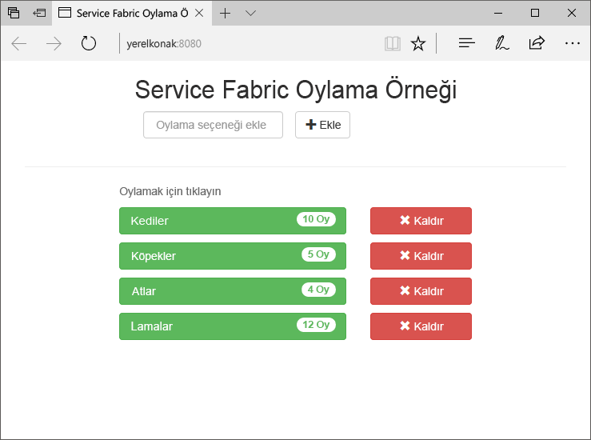
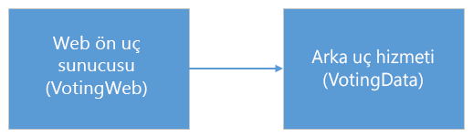
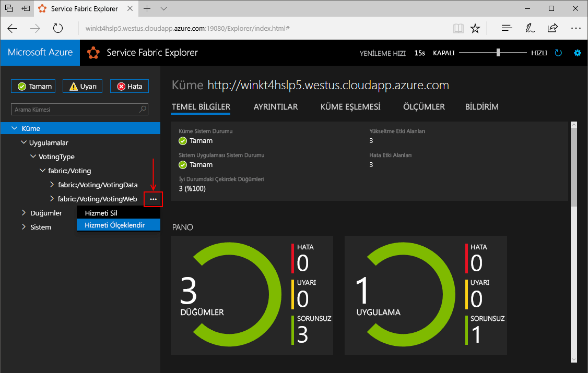
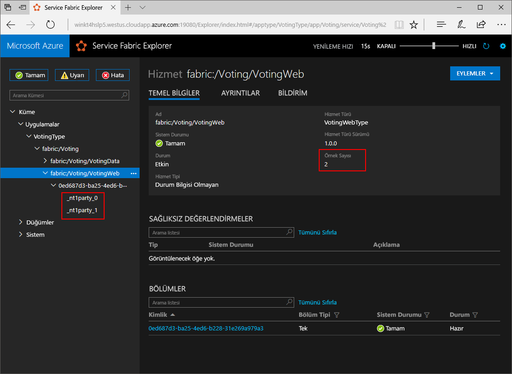
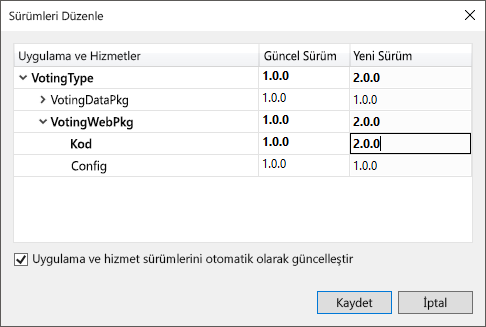
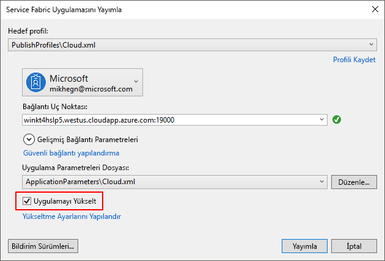
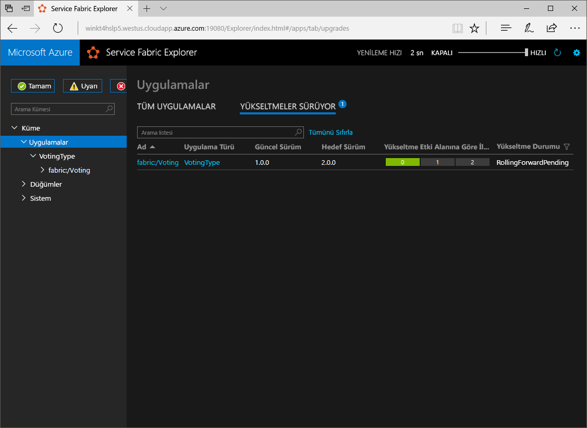

# <a name="create-a-net-service-fabric-application-in-azure"></a>.NET Service Fabric uygulaması oluşturma
Azure Service Fabric; ölçeklenebilir ve güvenilir mikro hizmetleri ve kapsayıcıları dağıtmayı ve yönetmeyi sağlayan bir dağıtılmış sistemler platformudur. 

Bu hızlı başlangıç gösterir nasıl toodeploy, ilk .NET uygulama tooService doku. İşlemi tamamladığınızda, oylama bir durum bilgisi olan bir arka uç hizmetinde hello kümedeki Oylama sonuçlarını kaydettiği ön uç bir ASP.NET Core web uygulamasıyla sahip.



Bu uygulama hakkında bilgi edineceksiniz kullanarak nasıl yapılır:
> [!div class="checklist"]
> * .NET ve Service Fabric kullanarak uygulama oluşturma
> * Bir web ön uç ASP.NET core kullanın
> * Durum bilgisi olan hizmet uygulama verilerini depolamak
> * Uygulamanızı yerel olarak hata ayıklama
> * Azure'da Hello uygulama tooa kümesi dağıtma
> * Birden çok düğüm arasında genişleme Merhaba uygulaması
> * Uygulama yükseltme gerçekleştirme

## <a name="prerequisites"></a>Ön koşullar
toocomplete Bu hızlı başlangıç:
1. [Visual Studio 2017 yükleme](https://www.visualstudio.com/) hello ile **Azure geliştirme** ve **ASP.NET ve web geliştirme** iş yükleri.
2. [Git'i yükleyin](https://git-scm.com/)
3. [Merhaba Microsoft Azure Service Fabric SDK yükleme](http://www.microsoft.com/web/handlers/webpi.ashx?command=getinstallerredirect&appid=MicrosoftAzure-ServiceFabric-CoreSDK)
4. Komut tooenable Visual Studio toodeploy toohello yerel Service Fabric kümesi aşağıdaki hello çalıştırın:
    ```powershell
    Set-ExecutionPolicy -ExecutionPolicy Unrestricted -Force -Scope CurrentUser
    ```

## <a name="download-hello-sample"></a>Merhaba örnek indirme
Bir komut penceresinde komut tooclone hello örnek uygulama havuzu tooyour yerel makine aşağıdaki hello çalıştırın.
```
git clone https://github.com/Azure-Samples/service-fabric-dotnet-quickstart
```

## <a name="run-hello-application-locally"></a>Merhaba uygulama yerel olarak çalıştırma
Başlat menüsü hello Hello Visual Studio simgesini sağ tıklatın ve seçin **yönetici olarak çalıştır**. Sipariş tooattach hello hata ayıklayıcı tooyour Hizmetleri'nde, yönetici olarak Visual Studio toorun gerekir.

Açık hello **Voting.sln** kopyaladığınız hello depodan Visual Studio çözümü.

toodeploy Merhaba uygulaması, basın **F5**.

> [!NOTE]
> Merhaba ilk kez çalıştırma ve hello uygulama, Visual Studio dağıtmak hata ayıklama için yerel bir küme oluşturur. Bu işlem biraz zaman alabilir. Merhaba küme oluşturma durumunu hello Visual Studio çıktı penceresinde görüntülenir.

Merhaba dağıtım tamamlandığında, bir tarayıcı başlatmak ve bu sayfayı açın: `http://localhost:8080` -hello web Merhaba uygulaması ön uç.


Şimdi, oylama seçenekleri kümesi ekleyin ve oy almaya başlayın. Merhaba uygulaması çalıştıran ve ayrı bir veritabanı için hello gerek kalmadan, Service Fabric kümesindeki tüm verileri depolar.

## <a name="walk-through-hello-voting-sample-application"></a>Örnek uygulama oylama hello yol
Uygulama oylama hello iki hizmetinden oluşur:
- Web ön uç hizmeti (VotingWeb) - bir ASP.NET Core web hello web sayfası hizmet ön uç hizmeti ve düzenlemenizi sağlayan web API'leri toocommunicate hello arka uç hizmeti ile.
- Arka uç hizmetine (VotingData)-disk üzerinde bir API toostore hello oy sonuçları güvenilir sözlükte çıkarır kalıcı bir ASP.NET Core web hizmeti.



Olaylar, aşağıdaki hello uygulama hello oy oluşur:
1. JavaScript hello oy isteği toohello web API hello web ön uç hizmetinde bir HTTP PUT İsteği gönderir.

2. Merhaba web ön uç hizmeti proxy toolocate kullanır ve bir HTTP PUT İsteği toohello arka uç hizmeti iletin.

3. Merhaba arka uç hizmeti hello gelen isteği alır ve depolar hello hello kümede çoğaltılmış toomultiple düğüm alır ve diskte kalıcı bir güvenilir bir sözlük sonucunda güncelleştirilir. Hiçbir veritabanı gerektiği şekilde tüm hello uygulamanın veri hello kümesinde depolanır.

## <a name="debug-in-visual-studio"></a>Visual Studio'da hata ayıklama
Visual Studio uygulamasında hata ayıklama sırasında yerel bir Service Fabric geliştirme küme kullanıyor. Hata ayıklama deneyimini tooyour senaryonuz hello seçeneği tooadjust var. Bu uygulamada, veri arka uç hizmetimizi güvenilir sözlüğünü kullanarak depolarız. Merhaba hata ayıklayıcıyı durdurduğunuzda visual Studio hello uygulama varsayılan başına kaldırır. Merhaba arka ucun neden hello veri Hello uygulamasını kaldırma hizmet tooalso kaldırılır. hata ayıklama oturumları arasında toopersist hello veri hello değiştirebilirsiniz **uygulama hata ayıklama modu** hello bir özellik olarak **oylama** Visual Studio projesi.

toolook nedir hello kod, aşağıdaki adımları tam hello olur:
1. Açık hello **VotesController.cs** dosya ve hello web API'nin bir kesme noktası belirleyerek **Put** yöntemi (satır 47) - hello Visual Studio'da Çözüm Gezgini'nde hello dosyasında arayabilirsiniz.

2. Açık hello **VoteDataController.cs** dosya ve bu web API'nin bir kesme noktası belirleyerek **Put** yöntemi (satır 50).

3. Toohello tarayıcı geri dönün ve oylama seçeneği tıklatın veya yeni bir oylama seçeneği ekleyin. Merhaba hello web ön uç 's API denetleyicisi içinde ilk kesme noktası isabet.
    - Burada hello JavaScript hello tarayıcıda hello ön uç hizmetinde bir istek toohello web API denetleyicisi gönderir budur.
    
    

    - Biz arka uç hizmetimizi hello URL toohello ReverseProxy ilk oluşturmak **(1)**.
    - Biz hello HTTP PUT İsteği toohello ReverseProxy Gönder sonra **(2)**.
    - Son olarak hello hello yanıt hello arka uç hizmetine toohello istemciden döndürürüz **(3)**.

4. Tuşuna **F5** toocontinue
    - Artık hello arka uç hizmetinde hello kesme noktası bulunur.
    
    

    - Hello yönteminin ilk satırında hello **(1)** hello kullanıyoruz `StateManager` tooget veya adlı güvenilir bir sözlük ekleme `counts`.
    - Kullanarak bu işlem, güvenilir bir sözlükteki değerlerle tüm etkileşimleri gerektiren deyimi **(2)** bu işlem oluşturur.
    - Merhaba işlemde sonra hello hello seçeneğine oy verdiğiniz için hello ilgili anahtarın değerini güncelleştiriyoruz ve yürütme işlemi hello **(3)**. Merhaba yürüttükten sonra yöntemi döndürür, veri hello sözlükte güncelleştirilir ve hello kümedeki tooother düğümler çoğaltılan hello. Merhaba veriler artık güvenli bir şekilde hello kümesinde depolanır ve hello arka uç hizmetine kullanılabilir hello veri yaşamaya tooother düğümler başarısız olabilir.
5. Tuşuna **F5** toocontinue

hata ayıklama oturumunun, basın toostop hello **Shift + F5**.

## <a name="deploy-hello-application-tooazure"></a>Merhaba uygulama tooAzure dağıtma
toodeploy hello uygulama tooa küme azure'da kendi küme ya da kullanım taraf küme toocreate ya da seçebilirsiniz.

Parti kümeleri Azure üzerinde barındırılan ve burada herkes uygulamaları dağıtabilir ve hello platform hakkında bilgi edinin hello Service Fabric ekibi tarafından çalıştırılan ücretsiz, sınırlı süre Service Fabric kümeleri ' dir. tooget erişim tooa taraf küme [hello yönergeleri izleyerek](http://aka.ms/tryservicefabric). 

Kendi kümenizi oluşturma hakkında daha fazla bilgi için bkz. [Azure'da ilk Service Fabric kümenizi oluşturma](service-fabric-get-started-azure-cluster.md).

> [!Note]
> Merhaba web ön uç 8080 bağlantı noktasından gelen trafiği için yapılandırılmış toolisten hizmetidir. Kümenizde bu bağlantı noktasının açık olduğundan emin olun. Merhaba taraf küme kullanıyorsanız, bu bağlantı noktasının açık olduğundan.
>

### <a name="deploy-hello-application-using-visual-studio"></a>Visual Studio kullanarak hello uygulama dağıtma
Merhaba uygulama hazır, Visual Studio'dan doğrudan tooa küme dağıtabilirsiniz.

1. Sağ **oylama** içinde Çözüm Gezgini hello ve seçin **Yayımla**. Merhaba Yayımla iletişim kutusu görüntülenir.

    

2. Merhaba hello kümede hello bağlantı uç noktasının türünde **bağlantı uç noktasının** alanına gelin ve **Yayımla**. Merhaba taraf küme kaydolduğunuzda hello bağlantı uç noktasının hello tarayıcıda sağlanır. -Örneğin, `winh1x87d1d.westus.cloudapp.azure.com:19000`.

3. Bir tarayıcı hello küme adresi - Örneğin, açıp `http://winh1x87d1d.westus.cloudapp.azure.com`. Azure'da hello kümede çalışan hello uygulama görmelisiniz.


## <a name="scale-applications-and-services-in-a-cluster"></a>Bir kümedeki uygulamaları ve hizmetleri ölçeklendirme
Service Fabric hizmetleri arasında bir küme tooaccommodate hello yük hello services üzerinde bir değişiklik için kolayca genişletilebilir. Bir hizmet hello hello kümede çalışan örneği sayısı değiştirerek ölçeklendirin. Hizmetlerinizin ölçeklendirme birkaç yolu vardır, betikleri veya komutları PowerShell veya Service Fabric CLI (sfctl) kullanabilirsiniz. Bu örnekte, Service Fabric Explorer kullanıyoruz.

Service Fabric Explorer tüm Service Fabric kümelerinde çalışır ve toohello kümeleri HTTP yönetim bağlantı noktası (19080), örneğin, göz atarak bir tarayıcıdan erişilebilir `http://winh1x87d1d.westus.cloudapp.azure.com:19080`.

tooscale hello web ön uç hizmeti, adımları hello:

1. Kümenizde Service Fabric Explorer'ı açın. Örneğin: `http://winh1x87d1d.westus.cloudapp.azure.com:19080`.
2. Merhaba üç nokta (üç nokta) sonraki toohello'ı tıklatın **fabric: / oylama/VotingWeb** düğümü treeview hello ve seçin **ölçek hizmet**.

    

    Şimdi tooscale hello hello web ön uç hizmeti örneklerinin sayısını seçebilirsiniz.

3. Merhaba numarasını da değiştirmeniz**2** tıklatıp **ölçek hizmet**.
4. Tıklatın hello üzerinde **fabric: / oylama/VotingWeb** düğümünde hello ağaç görünümü ve (bir GUID ile temsil edilen) hello bölüm düğümünü genişletin.

    

    Şimdi iki örneği hello hizmeti var ve hello ağaç görünümünde hello örneklerinde Çalıştır hangi düğümlerin görmek görebilirsiniz.

Bu basit yönetim görevi tarafından biz hello kaynaklar bizim için ön uç hizmeti tooprocess kullanıcı yükü iki katına. Birden çok örneğini çalıştırın güvenilir bir hizmet toohave gerekmez önemli toounderstand olur. Bir hizmet başarısız olursa, Service Fabric hello kümesinde yeni bir hizmet örneği çalıştıran emin olur.

## <a name="perform-a-rolling-application-upgrade"></a>Uygulama yükseltme gerçekleştirme
Yeni güncelleştirmeler tooyour Uygulama dağıtırken, Service Fabric hello güncelleştirmeyi güvenli bir yolla yapar. Çalışırken hataları gerçekleşeceğini yanı sıra otomatik geri alma yükseltirken kapalı kalma süresi sağlar.

tooupgrade Merhaba uygulama, aşağıdaki hello:

1. Açık hello **Index.cshtml** dosyasını Visual Studio'da - hello Visual Studio'da Çözüm Gezgini'nde hello dosyasında arayabilirsiniz.
2. Örneğin bazı metin - ekleyerek Hello başlık hello sayfasında değiştirin.
    ```html
        <div class="col-xs-8 col-xs-offset-2 text-center">
            <h2>Service Fabric Voting Sample v2</h2>
        </div>
    ```
3. Merhaba dosyasını kaydedin.
4. Sağ **oylama** içinde Çözüm Gezgini hello ve seçin **Yayımla**. Merhaba Yayımla iletişim kutusu görüntülenir.
5. Merhaba tıklatın **bildirim sürüm** düğmesini toochange hello sürümü hello hizmet ve uygulama.
6. Değişiklik hello hello sürümü **kod** öğesinin altında **VotingWebPkg** çok "2.0.0" Örneğin ve tıklatın **kaydetmek**.

    
7. Merhaba, **Service Fabric uygulaması yayımlama** iletişim kutusu, onay hello yükseltme hello uygulama onay kutusunu ve tıklatın **Yayımla**.

    
8. Tarayıcınızı açın ve örneğin, bağlantı noktası 19080 - toohello küme adresi Gözat `http://winh1x87d1d.westus.cloudapp.azure.com:19080`.
9. Tıklatın hello üzerinde **uygulamaları** hello ağaç görünümünde düğümünü ve ardından **yükseltme devam eden** hello sağ taraftaki bölmede. Her etki alanı sonraki devam etmeden önce toohello sağlıklı olduğundan emin olmanızı nasıl hello yükseltme hello yükseltme etki alanlarında ilerlerken, kümede yapar bakın.
    

    Service Fabric yükseltmelerinin hello hizmet hello kümedeki her düğümde yükselttikten sonra iki dakika bekleyerek güvenli hale getirir. Merhaba tüm güncelleştirme tootake yaklaşık sekiz dakika bekler.

10. Merhaba yükseltme çalışırken hello uygulamayı kullanmaya devam edebilirsiniz. İki örneği hello kümede çalışan hello hizmeti olduğundan, diğerleri hello eski sürümü hala alabilir ancak bazı isteklerinizi Merhaba uygulaması yükseltilmiş sürümünü alabilirsiniz.

## <a name="next-steps"></a>Sonraki adımlar
Bu hızlı başlangıçta şunları öğrendiniz:

> [!div class="checklist"]
> * .NET ve Service Fabric kullanarak uygulama oluşturma
> * Bir web ön uç ASP.NET core kullanın
> * Durum bilgisi olan hizmet uygulama verilerini depolamak
> * Uygulamanızı yerel olarak hata ayıklama
> * Azure'da Hello uygulama tooa kümesi dağıtma
> * Birden çok düğüm arasında genişleme Merhaba uygulaması
> * Uygulama yükseltme gerçekleştirme

Service Fabric ve .NET hakkında daha fazla toolearn Bu öğretici göz alın:
> [!div class="nextstepaction"]
> [Service Fabric üzerinde .NET uygulaması](service-fabric-tutorial-create-dotnet-app.md)