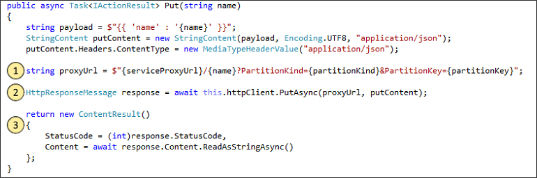

# <a name="create-a-net-service-fabric-application-in-azure"></a><span data-ttu-id="aba62-103">.NET Service Fabric uygulaması oluşturma</span><span class="sxs-lookup"><span data-stu-id="aba62-103">Create a .NET Service Fabric application in Azure</span></span>
<span data-ttu-id="aba62-104">Azure Service Fabric; ölçeklenebilir ve güvenilir mikro hizmetleri ve kapsayıcıları dağıtmayı ve yönetmeyi sağlayan bir dağıtılmış sistemler platformudur.</span><span class="sxs-lookup"><span data-stu-id="aba62-104">Azure Service Fabric is a distributed systems platform for deploying and managing scalable and reliable microservices and containers.</span></span> 

<span data-ttu-id="aba62-105">Bu hızlı başlangıç ilk .NET uygulamanızı Service Fabric dağıtmak gösterilmektedir.</span><span class="sxs-lookup"><span data-stu-id="aba62-105">This quickstart shows how to deploy your first .NET application to Service Fabric.</span></span> <span data-ttu-id="aba62-106">İşlemi tamamladığınızda, oylama bir durum bilgisi olan bir arka uç hizmetinde kümedeki Oylama sonuçlarını kaydettiği ön uç bir ASP.NET Core web uygulamasıyla sahip.</span><span class="sxs-lookup"><span data-stu-id="aba62-106">When you're finished, you have a voting application with an ASP.NET Core web front-end that saves voting results in a stateful back-end service in the cluster.</span></span>


<span data-ttu-id="aba62-108">Bu uygulama hakkında bilgi edineceksiniz kullanarak nasıl yapılır:</span><span class="sxs-lookup"><span data-stu-id="aba62-108">Using this application you learn how to:</span></span>
> [!div class="checklist"]
> * <span data-ttu-id="aba62-109">.NET ve Service Fabric kullanarak uygulama oluşturma</span><span class="sxs-lookup"><span data-stu-id="aba62-109">Create an application using .NET and Service Fabric</span></span>
> * <span data-ttu-id="aba62-110">Bir web ön uç ASP.NET core kullanın</span><span class="sxs-lookup"><span data-stu-id="aba62-110">Use ASP.NET core as a web front-end</span></span>
> * <span data-ttu-id="aba62-111">Durum bilgisi olan hizmet uygulama verilerini depolamak</span><span class="sxs-lookup"><span data-stu-id="aba62-111">Store application data in a stateful service</span></span>
> * <span data-ttu-id="aba62-112">Uygulamanızı yerel olarak hata ayıklama</span><span class="sxs-lookup"><span data-stu-id="aba62-112">Debug your application locally</span></span>
> * <span data-ttu-id="aba62-113">Bir kümede Azure uygulamayı dağıtmak</span><span class="sxs-lookup"><span data-stu-id="aba62-113">Deploy the application to a cluster in Azure</span></span>
> * <span data-ttu-id="aba62-114">Genişleme uygulama birden çok düğüm arasında</span><span class="sxs-lookup"><span data-stu-id="aba62-114">Scale-out the application across multiple nodes</span></span>
> * <span data-ttu-id="aba62-115">Uygulama yükseltme gerçekleştirme</span><span class="sxs-lookup"><span data-stu-id="aba62-115">Perform a rolling application upgrade</span></span>

## <a name="prerequisites"></a><span data-ttu-id="aba62-116">Ön koşullar</span><span class="sxs-lookup"><span data-stu-id="aba62-116">Prerequisites</span></span>
<span data-ttu-id="aba62-117">Bu hızlı başlangıcı tamamlamak için:</span><span class="sxs-lookup"><span data-stu-id="aba62-117">To complete this quickstart:</span></span>
1. <span data-ttu-id="aba62-118">[Visual Studio 2017 yükleme](https://www.visualstudio.com/) ile **Azure geliştirme** ve **ASP.NET ve web geliştirme** iş yükleri.</span><span class="sxs-lookup"><span data-stu-id="aba62-118">[Install Visual Studio 2017](https://www.visualstudio.com/) with the **Azure development** and **ASP.NET and web development** workloads.</span></span>
2. [<span data-ttu-id="aba62-119">Git'i yükleyin</span><span class="sxs-lookup"><span data-stu-id="aba62-119">Install Git</span></span>](https://git-scm.com/)
3. [<span data-ttu-id="aba62-120">Microsoft Azure Service Fabric SDK yükleme</span><span class="sxs-lookup"><span data-stu-id="aba62-120">Install the Microsoft Azure Service Fabric SDK</span></span>](http://www.microsoft.com/web/handlers/webpi.ashx?command=getinstallerredirect&appid=MicrosoftAzure-ServiceFabric-CoreSDK)
4. <span data-ttu-id="aba62-121">Yerel Service Fabric kümesi dağıtmak Visual Studio etkinleştirmek için aşağıdaki komutu çalıştırın:</span><span class="sxs-lookup"><span data-stu-id="aba62-121">Run the following command to enable Visual Studio to deploy to the local Service Fabric cluster:</span></span>
    ```powershell
    Set-ExecutionPolicy -ExecutionPolicy Unrestricted -Force -Scope CurrentUser
    ```

## <a name="download-the-sample"></a><span data-ttu-id="aba62-122">Örneği indirme</span><span class="sxs-lookup"><span data-stu-id="aba62-122">Download the sample</span></span>
<span data-ttu-id="aba62-123">Bir komut penceresinde örnek uygulama depoyu yerel makinenize kopyalamak için aşağıdaki komutu çalıştırın.</span><span class="sxs-lookup"><span data-stu-id="aba62-123">In a command window, run the following command to clone the sample app repository to your local machine.</span></span>
```
git clone https://github.com/Azure-Samples/service-fabric-dotnet-quickstart
```

## <a name="run-the-application-locally"></a><span data-ttu-id="aba62-124">Uygulamayı yerel olarak çalıştırma</span><span class="sxs-lookup"><span data-stu-id="aba62-124">Run the application locally</span></span>
<span data-ttu-id="aba62-125">Başlat menüsü Visual Studio simgesini sağ tıklatın ve seçin **yönetici olarak çalıştır**.</span><span class="sxs-lookup"><span data-stu-id="aba62-125">Right-click the Visual Studio icon in the Start Menu and choose **Run as administrator**.</span></span> <span data-ttu-id="aba62-126">Hata ayıklayıcı hizmetlerinize iliştirmek için Visual Studio'yu yönetici olarak çalıştırmanız gerekir.</span><span class="sxs-lookup"><span data-stu-id="aba62-126">In order to attach the debugger to your services, you need to run Visual Studio as administrator.</span></span>

<span data-ttu-id="aba62-127">Açık **Voting.sln** kopyaladığınız deponun Visual Studio çözümü.</span><span class="sxs-lookup"><span data-stu-id="aba62-127">Open the **Voting.sln** Visual Studio solution from the repository you cloned.</span></span>

<span data-ttu-id="aba62-128">Uygulamayı dağıtmak için basın **F5**.</span><span class="sxs-lookup"><span data-stu-id="aba62-128">To deploy the application, press **F5**.</span></span>

> [!NOTE]
> <span data-ttu-id="aba62-129">İlk kez çalıştırın ve uygulama dağıtma, Visual Studio hata ayıklama için yerel bir küme oluşturur.</span><span class="sxs-lookup"><span data-stu-id="aba62-129">The first time you run and deploy the application, Visual Studio creates a local cluster for debugging.</span></span> <span data-ttu-id="aba62-130">Bu işlem biraz zaman alabilir.</span><span class="sxs-lookup"><span data-stu-id="aba62-130">This operation may take some time.</span></span> <span data-ttu-id="aba62-131">Küme oluşturma durumu, Visual Studio çıkış penceresinde görüntülenir.</span><span class="sxs-lookup"><span data-stu-id="aba62-131">The cluster creation status is displayed in the Visual Studio output window.</span></span>

<span data-ttu-id="aba62-132">Dağıtım tamamlandığında, bir tarayıcı başlatmak ve bu sayfayı açın: `http://localhost:8080` -uygulamanın ön uç web.</span><span class="sxs-lookup"><span data-stu-id="aba62-132">When the deployment is complete, launch a browser and open this page: `http://localhost:8080` - the web front-end of the application.</span></span>


<span data-ttu-id="aba62-134">Şimdi, oylama seçenekleri kümesi ekleyin ve oy almaya başlayın.</span><span class="sxs-lookup"><span data-stu-id="aba62-134">You can now add a set of voting options, and start taking votes.</span></span> <span data-ttu-id="aba62-135">Uygulamayı çalışır ve ayrı bir veritabanı gerek kalmadan, Service Fabric kümesindeki tüm verileri depolar.</span><span class="sxs-lookup"><span data-stu-id="aba62-135">The application runs and stores all data in your Service Fabric cluster, without the need for a separate database.</span></span>

## <a name="walk-through-the-voting-sample-application"></a><span data-ttu-id="aba62-136">Yol üzerinden oylama örnek uygulama</span><span class="sxs-lookup"><span data-stu-id="aba62-136">Walk through the voting sample application</span></span>
<span data-ttu-id="aba62-137">Oylama uygulaması iki hizmetinden oluşur:</span><span class="sxs-lookup"><span data-stu-id="aba62-137">The voting application consists of two services:</span></span>
- <span data-ttu-id="aba62-138">Web ön uç hizmeti (VotingWeb) - bir ASP.NET Core web web sayfası hizmet ön uç hizmeti ve düzenlemenizi sağlayan web arka uç hizmeti ile iletişim için API'ler.</span><span class="sxs-lookup"><span data-stu-id="aba62-138">Web front-end service (VotingWeb)- An ASP.NET Core web front-end service, which serves the web page and exposes web APIs to communicate with the backend service.</span></span>
- <span data-ttu-id="aba62-139">Arka uç hizmetine (VotingData)-oy sonuçları güvenilir sözlükte depolamak için bir API sunar bir ASP.NET Core web hizmeti kalıcı disk üzerinde.</span><span class="sxs-lookup"><span data-stu-id="aba62-139">Back-end service (VotingData)- An ASP.NET Core web service, which exposes an API to store the vote results in a reliable dictionary persisted on disk.</span></span>


<span data-ttu-id="aba62-141">Aşağıdaki olaylar, uygulamada oy oluşur:</span><span class="sxs-lookup"><span data-stu-id="aba62-141">When you vote in the application the following events occur:</span></span>
1. <span data-ttu-id="aba62-142">JavaScript oy isteği için web ön uç hizmeti web API'si bir HTTP PUT İsteği gönderir.</span><span class="sxs-lookup"><span data-stu-id="aba62-142">A JavaScript sends the vote request to the web API in the web front-end service as an HTTP PUT request.</span></span>

2. <span data-ttu-id="aba62-143">Web ön uç hizmeti bulun ve bir HTTP PUT İsteği arka uç hizmetine iletmek için bir proxy kullanır.</span><span class="sxs-lookup"><span data-stu-id="aba62-143">The web front-end service uses a proxy to locate and forward an HTTP PUT request to the back-end service.</span></span>

3. <span data-ttu-id="aba62-144">Arka uç hizmetine gelen isteği alır ve güncelleştirilmiş sonuç kümesi içinde birden çok düğüm çoğaltılan alır ve diskte kalıcı bir güvenilir bir sözlük depolar.</span><span class="sxs-lookup"><span data-stu-id="aba62-144">The back-end service takes the incoming request, and stores the updated result in a reliable dictionary, which gets replicated to multiple nodes within the cluster and persisted on disk.</span></span> <span data-ttu-id="aba62-145">Hiçbir veritabanı gerektiği şekilde uygulamanın tüm veri kümesinde depolanır.</span><span class="sxs-lookup"><span data-stu-id="aba62-145">All the application's data is stored in the cluster, so no database is needed.</span></span>

## <a name="debug-in-visual-studio"></a><span data-ttu-id="aba62-146">Visual Studio'da hata ayıklama</span><span class="sxs-lookup"><span data-stu-id="aba62-146">Debug in Visual Studio</span></span>
<span data-ttu-id="aba62-147">Visual Studio uygulamasında hata ayıklama sırasında yerel bir Service Fabric geliştirme küme kullanıyor.</span><span class="sxs-lookup"><span data-stu-id="aba62-147">When debugging application in Visual Studio, you are using a local Service Fabric development cluster.</span></span> <span data-ttu-id="aba62-148">Hata ayıklama deneyiminizi senaryonuz için ayarlamak için seçeneğiniz vardır.</span><span class="sxs-lookup"><span data-stu-id="aba62-148">You have the option to adjust your debugging experience to your scenario.</span></span> <span data-ttu-id="aba62-149">Bu uygulamada, veri arka uç hizmetimizi güvenilir sözlüğünü kullanarak depolarız.</span><span class="sxs-lookup"><span data-stu-id="aba62-149">In this application, we store data in our back-end service, using a reliable dictionary.</span></span> <span data-ttu-id="aba62-150">Hata ayıklayıcıyı durdurduğunuzda visual Studio uygulama varsayılan başına kaldırır.</span><span class="sxs-lookup"><span data-stu-id="aba62-150">Visual Studio removes the application per default when you stop the debugger.</span></span> <span data-ttu-id="aba62-151">Uygulama kaldırma verileri de kaldırılacak arka uç hizmetinde neden olur.</span><span class="sxs-lookup"><span data-stu-id="aba62-151">Removing the application causes the data in the back-end service to also be removed.</span></span> <span data-ttu-id="aba62-152">Hata ayıklama oturumları arasında veri kalıcı hale getirmek için değiştirebileceğiniz **uygulama hata ayıklama modu** bir özellik olarak **oylama** Visual Studio projesi.</span><span class="sxs-lookup"><span data-stu-id="aba62-152">To persist the data between debugging sessions, you can change the **Application Debug Mode** as a property on the **Voting** project in Visual Studio.</span></span>

<span data-ttu-id="aba62-153">Kod içinde neler aramak için aşağıdaki adımları tamamlayın:</span><span class="sxs-lookup"><span data-stu-id="aba62-153">To look at what happens in the code, complete the following steps:</span></span>
1. <span data-ttu-id="aba62-154">Açık **VotesController.cs** dosya ve web API'ın bir kesme noktası belirleyerek **Put** yöntemi (satır 47) - Visual Studio'daki Çözüm Gezgini'nde dosyayı arayabilirsiniz.</span><span class="sxs-lookup"><span data-stu-id="aba62-154">Open the **VotesController.cs** file and set a breakpoint in the web API's **Put** method (line 47) - You can search for the file in the Solution Explorer in Visual Studio.</span></span>

2. <span data-ttu-id="aba62-155">Açık **VoteDataController.cs** dosya ve bu web API'nin bir kesme noktası belirleyerek **Put** yöntemi (satır 50).</span><span class="sxs-lookup"><span data-stu-id="aba62-155">Open the **VoteDataController.cs** file and set a breakpoint in this web API's **Put** method (line 50).</span></span>

3. <span data-ttu-id="aba62-156">Tarayıcıya geri dönün ve oylama seçeneği tıklatın veya yeni bir oylama seçeneği ekleyin.</span><span class="sxs-lookup"><span data-stu-id="aba62-156">Go back to the browser and click a voting option or add a new voting option.</span></span> <span data-ttu-id="aba62-157">Web ön uç 's API denetleyicisi içinde ilk kesme noktası isabet.</span><span class="sxs-lookup"><span data-stu-id="aba62-157">You hit the first breakpoint in the web front-end's api controller.</span></span>
    - <span data-ttu-id="aba62-158">Burada tarayıcısında JavaScript bir isteği ön uç hizmeti olan web API denetleyicisi gönderir budur.</span><span class="sxs-lookup"><span data-stu-id="aba62-158">This is where the JavaScript in the browser sends a request to the web API controller in the front-end service.</span></span>
    
    

    - <span data-ttu-id="aba62-160">İlk biz ReverseProxy URL'si için arka uç hizmetimizi oluşturmak **(1)**.</span><span class="sxs-lookup"><span data-stu-id="aba62-160">First we construct the URL to the ReverseProxy for our back-end service **(1)**.</span></span>
    - <span data-ttu-id="aba62-161">Biz PUT HTTP isteği için ReverseProxy Gönder sonra **(2)**.</span><span class="sxs-lookup"><span data-stu-id="aba62-161">Then we send the HTTP PUT Request to the ReverseProxy **(2)**.</span></span>
    - <span data-ttu-id="aba62-162">Son olarak yanıt arka uç hizmetinden istemciye döndürürüz **(3)**.</span><span class="sxs-lookup"><span data-stu-id="aba62-162">Finally the we return the response from the back-end service to the client **(3)**.</span></span>

4. <span data-ttu-id="aba62-163">Tuşuna **F5** devam etmek için</span><span class="sxs-lookup"><span data-stu-id="aba62-163">Press **F5** to continue</span></span>
    - <span data-ttu-id="aba62-164">Artık arka uç hizmetinde kesme noktasında bulunur.</span><span class="sxs-lookup"><span data-stu-id="aba62-164">You are now at the break point in the back-end service.</span></span>
    
    

    - <span data-ttu-id="aba62-166">Yönteminin ilk satırında **(1)** kullanıyoruz `StateManager` almak veya adlı güvenilir sözlüğü eklemek için `counts`.</span><span class="sxs-lookup"><span data-stu-id="aba62-166">In the first line in the method **(1)** we are using the `StateManager` to get or add a reliable dictionary called `counts`.</span></span>
    - <span data-ttu-id="aba62-167">Kullanarak bu işlem, güvenilir bir sözlükteki değerlerle tüm etkileşimleri gerektiren deyimi **(2)** bu işlem oluşturur.</span><span class="sxs-lookup"><span data-stu-id="aba62-167">All interactions with values in a reliable dictionary require a transaction, this using statement **(2)** creates that transaction.</span></span>
    - <span data-ttu-id="aba62-168">İşlemde biz sonra oylama seçeneği için ilgili anahtar değerini güncelleştirin ve işlemi tamamlar **(3)**.</span><span class="sxs-lookup"><span data-stu-id="aba62-168">In the transaction, we then update the value of the relevant key for the voting option and commits the operation **(3)**.</span></span> <span data-ttu-id="aba62-169">Yürütme yöntemi döndürür, veri sözlüğünde güncelleştirilmiş ve kümedeki diğer düğümlere çoğaltılan sonra.</span><span class="sxs-lookup"><span data-stu-id="aba62-169">Once the commit method returns, the data is updated in the dictionary and replicated to other nodes in the cluster.</span></span> <span data-ttu-id="aba62-170">Veri şimdi güvenle kümede depolanır ve arka uç hizmeti üzerinden kullanılabilir veri yaşamaya diğer düğümlere başarısız olabilir.</span><span class="sxs-lookup"><span data-stu-id="aba62-170">The data is now safely stored in the cluster, and the back-end service can fail over to other nodes, still having the data available.</span></span>
5. <span data-ttu-id="aba62-171">Tuşuna **F5** devam etmek için</span><span class="sxs-lookup"><span data-stu-id="aba62-171">Press **F5** to continue</span></span>

<span data-ttu-id="aba62-172">Hata ayıklama oturumu durdurmak için basın **Shift + F5**.</span><span class="sxs-lookup"><span data-stu-id="aba62-172">To stop the debugging session, press **Shift+F5**.</span></span>

## <a name="deploy-the-application-to-azure"></a><span data-ttu-id="aba62-173">Uygulamayı Azure’a dağıtma</span><span class="sxs-lookup"><span data-stu-id="aba62-173">Deploy the application to Azure</span></span>
<span data-ttu-id="aba62-174">Bir kümede Azure uygulamayı dağıtmak için ya da kendi küme oluşturun veya bir taraf kümesi kullanmayı seçebilirsiniz.</span><span class="sxs-lookup"><span data-stu-id="aba62-174">To deploy the application to a cluster in Azure, you can either choose to create your own cluster, or use a Party Cluster.</span></span>

<span data-ttu-id="aba62-175">Grup kümeleri, Azure üzerinde barındırılan ve Service Fabric ekibi tarafından sunulan ücretsiz, sınırlı süreli Service Fabric kümeleridir. Bu kümelerde herkes uygulama dağıtabilir ve platform hakkında bilgi edinebilir.</span><span class="sxs-lookup"><span data-stu-id="aba62-175">Party clusters are free, limited-time Service Fabric clusters hosted on Azure and run by the Service Fabric team where anyone can deploy applications and learn about the platform.</span></span> <span data-ttu-id="aba62-176">Bir Grup Kümesine erişmek için [yönergeleri takip edin](http://aka.ms/tryservicefabric).</span><span class="sxs-lookup"><span data-stu-id="aba62-176">To get access to a Party Cluster, [follow the instructions](http://aka.ms/tryservicefabric).</span></span> 

<span data-ttu-id="aba62-177">Kendi kümenizi oluşturma hakkında daha fazla bilgi için bkz. [Azure'da ilk Service Fabric kümenizi oluşturma](service-fabric-get-started-azure-cluster.md).</span><span class="sxs-lookup"><span data-stu-id="aba62-177">For information about creating your own cluster, see [Create your first Service Fabric cluster on Azure](service-fabric-get-started-azure-cluster.md).</span></span>

> [!Note]
> <span data-ttu-id="aba62-178">Web ön uç hizmeti 8080 bağlantı noktasından gelen trafiği dinleyecek şekilde yapılandırılır.</span><span class="sxs-lookup"><span data-stu-id="aba62-178">The web front-end service is configured to listen on port 8080 for incoming traffic.</span></span> <span data-ttu-id="aba62-179">Kümenizde bu bağlantı noktasının açık olduğundan emin olun.</span><span class="sxs-lookup"><span data-stu-id="aba62-179">Make sure that port is open in your cluster.</span></span> <span data-ttu-id="aba62-180">Taraf küme kullanıyorsanız, bu bağlantı noktasının açık olduğundan.</span><span class="sxs-lookup"><span data-stu-id="aba62-180">If you are using the Party Cluster, this port is open.</span></span>
>

### <a name="deploy-the-application-using-visual-studio"></a><span data-ttu-id="aba62-181">Visual Studio kullanarak uygulamayı dağıtın</span><span class="sxs-lookup"><span data-stu-id="aba62-181">Deploy the application using Visual Studio</span></span>
<span data-ttu-id="aba62-182">Uygulama hazır olduğuna göre, doğrudan Visual Studio'dan bir kümeye dağıtabilirsiniz.</span><span class="sxs-lookup"><span data-stu-id="aba62-182">Now that the application is ready, you can deploy it to a cluster directly from Visual Studio.</span></span>

1. <span data-ttu-id="aba62-183">Sağ **oylama** Çözüm Gezgini'nde ve **Yayımla**.</span><span class="sxs-lookup"><span data-stu-id="aba62-183">Right-click **Voting** in the Solution Explorer and choose **Publish**.</span></span> <span data-ttu-id="aba62-184">Yayımla iletişim kutusu görüntülenir.</span><span class="sxs-lookup"><span data-stu-id="aba62-184">The Publish dialog appears.</span></span>

    

2. <span data-ttu-id="aba62-186">Kümenin Bağlantı Uç Noktasını **Bağlantı Uç Noktası** alanına girin ve **Yayımla**’ya tıklayın.</span><span class="sxs-lookup"><span data-stu-id="aba62-186">Type in the Connection Endpoint of the cluster in the **Connection Endpoint** field and click **Publish**.</span></span> <span data-ttu-id="aba62-187">Taraf küme için kaydolduğunuzda bağlantı uç noktasının tarayıcıda sağlanır.</span><span class="sxs-lookup"><span data-stu-id="aba62-187">When signing up for the Party Cluster, the Connection Endpoint is provided in the browser.</span></span> <span data-ttu-id="aba62-188">-Örneğin, `winh1x87d1d.westus.cloudapp.azure.com:19000`.</span><span class="sxs-lookup"><span data-stu-id="aba62-188">- for example, `winh1x87d1d.westus.cloudapp.azure.com:19000`.</span></span>

3. <span data-ttu-id="aba62-189">Bir tarayıcı küme adresi - Örneğin, açıp `http://winh1x87d1d.westus.cloudapp.azure.com`.</span><span class="sxs-lookup"><span data-stu-id="aba62-189">Open a browser and type in the cluster address - for example, `http://winh1x87d1d.westus.cloudapp.azure.com`.</span></span> <span data-ttu-id="aba62-190">Artık Azure kümede çalışan uygulama görmeniz gerekir.</span><span class="sxs-lookup"><span data-stu-id="aba62-190">You should now see the application running in the cluster in Azure.</span></span>


## <a name="scale-applications-and-services-in-a-cluster"></a><span data-ttu-id="aba62-192">Bir kümedeki uygulamaları ve hizmetleri ölçeklendirme</span><span class="sxs-lookup"><span data-stu-id="aba62-192">Scale applications and services in a cluster</span></span>
<span data-ttu-id="aba62-193">Service Fabric Hizmetleri, bir değişiklik Hizmetleri üzerindeki yükü için uygun hale getirmek için bir küme içinde kolayca genişletilebilir.</span><span class="sxs-lookup"><span data-stu-id="aba62-193">Service Fabric services can easily be scaled across a cluster to accommodate for a change in the load on the services.</span></span> <span data-ttu-id="aba62-194">Kümede çalıştırılan örnek sayısını değiştirerek bir hizmeti ölçeklendirebilirsiniz.</span><span class="sxs-lookup"><span data-stu-id="aba62-194">You scale a service by changing the number of instances running in the cluster.</span></span> <span data-ttu-id="aba62-195">Hizmetlerinizin ölçeklendirme birkaç yolu vardır, betikleri veya komutları PowerShell veya Service Fabric CLI (sfctl) kullanabilirsiniz.</span><span class="sxs-lookup"><span data-stu-id="aba62-195">You have multiple ways of scaling your services, you can use scripts or commands from PowerShell or Service Fabric CLI (sfctl).</span></span> <span data-ttu-id="aba62-196">Bu örnekte, Service Fabric Explorer kullanıyoruz.</span><span class="sxs-lookup"><span data-stu-id="aba62-196">In this example, we are using Service Fabric Explorer.</span></span>

<span data-ttu-id="aba62-197">Service Fabric Explorer tüm Service Fabric kümelerinde çalışır ve kümeleri HTTP yönetim bağlantı noktası (19080), örneğin, göz atarak bir tarayıcıdan erişilebilir `http://winh1x87d1d.westus.cloudapp.azure.com:19080`.</span><span class="sxs-lookup"><span data-stu-id="aba62-197">Service Fabric Explorer runs in all Service Fabric clusters and can be accessed from a browser, by browsing to the clusters HTTP management port (19080), for example, `http://winh1x87d1d.westus.cloudapp.azure.com:19080`.</span></span>

<span data-ttu-id="aba62-198">Web ön uç hizmetini ölçeklendirmek için aşağıdaki adımları gerçekleştirin:</span><span class="sxs-lookup"><span data-stu-id="aba62-198">To scale the web front-end service, do the following steps:</span></span>

1. <span data-ttu-id="aba62-199">Kümenizde Service Fabric Explorer'ı açın. Örneğin: `http://winh1x87d1d.westus.cloudapp.azure.com:19080`.</span><span class="sxs-lookup"><span data-stu-id="aba62-199">Open Service Fabric Explorer in your cluster - for example,`http://winh1x87d1d.westus.cloudapp.azure.com:19080`.</span></span>
2. <span data-ttu-id="aba62-200">Yanındaki üç nokta (üç nokta) tıklayın **fabric: / oylama/VotingWeb** treeview düğümüne ve **ölçek hizmet**.</span><span class="sxs-lookup"><span data-stu-id="aba62-200">Click on the ellipsis (three dots) next to the **fabric:/Voting/VotingWeb** node in the treeview and choose **Scale Service**.</span></span>

    

    <span data-ttu-id="aba62-202">Şimdi web ön uç hizmetindeki örnek sayısını ölçeklendirebilirsiniz.</span><span class="sxs-lookup"><span data-stu-id="aba62-202">You can now choose to scale the number of instances of the web front-end service.</span></span>

3. <span data-ttu-id="aba62-203">Rakamı **2** olarak değiştirin ve **Hizmeti Ölçeklendir**'e tıklayın.</span><span class="sxs-lookup"><span data-stu-id="aba62-203">Change the number to **2** and click **Scale Service**.</span></span>
4. <span data-ttu-id="aba62-204">Tıklayın **fabric: / oylama/VotingWeb** ağaç görünümünde düğümünü ve (bir GUID ile temsil edilen) bölüm düğümünü genişletin.</span><span class="sxs-lookup"><span data-stu-id="aba62-204">Click on the **fabric:/Voting/VotingWeb** node in the tree-view and expand the partition node (represented by a GUID).</span></span>

    

    <span data-ttu-id="aba62-206">Artık, hizmet iki örneklerine sahip ve örnekleri çalıştıracağınız hangi düğümlerin gördüğünüz ağaç görünümünde de görebilirsiniz.</span><span class="sxs-lookup"><span data-stu-id="aba62-206">You can now see that the service has two instances, and in the tree view you see which nodes the instances run on.</span></span>

<span data-ttu-id="aba62-207">Bu basit yönetim görevi sayesinde ön uç hizmetinizde kullanıcı yükünü işleyecek kaynak sayısını iki katına çıkarmış olduk.</span><span class="sxs-lookup"><span data-stu-id="aba62-207">By this simple management task, we doubled the resources available for our front-end service to process user load.</span></span> <span data-ttu-id="aba62-208">Bir hizmetin güvenilir bir şekilde çalışması için birden fazla örneğe ihtiyaç duymadığını anlamanız önemlidir.</span><span class="sxs-lookup"><span data-stu-id="aba62-208">It's important to understand that you do not need multiple instances of a service to have it run reliably.</span></span> <span data-ttu-id="aba62-209">Bir hizmet başarısız olursa Service Fabric kümede yeni bir hizmet örneği çalışmasını sağlar.</span><span class="sxs-lookup"><span data-stu-id="aba62-209">If a service fails, Service Fabric makes sure a new service instance runs in the cluster.</span></span>

## <a name="perform-a-rolling-application-upgrade"></a><span data-ttu-id="aba62-210">Uygulama yükseltme gerçekleştirme</span><span class="sxs-lookup"><span data-stu-id="aba62-210">Perform a rolling application upgrade</span></span>
<span data-ttu-id="aba62-211">Service Fabric yeni güncelleştirmeleri uygulamanızı dağıtırken güncelleştirmeyi güvenli bir yolla yapar.</span><span class="sxs-lookup"><span data-stu-id="aba62-211">When deploying new updates to your application, Service Fabric rolls out the update in a safe way.</span></span> <span data-ttu-id="aba62-212">Çalışırken hataları gerçekleşeceğini yanı sıra otomatik geri alma yükseltirken kapalı kalma süresi sağlar.</span><span class="sxs-lookup"><span data-stu-id="aba62-212">Rolling upgrades gives you no downtime while upgrading as well as automated rollback should errors occur.</span></span>

<span data-ttu-id="aba62-213">Uygulama yükseltmek için aşağıdakileri yapın:</span><span class="sxs-lookup"><span data-stu-id="aba62-213">To upgrade the application, do the following:</span></span>

1. <span data-ttu-id="aba62-214">Açık **Index.cshtml** dosyasını Visual Studio'da - Visual Studio'daki Çözüm Gezgini'nde dosyası için arama yapabilirsiniz.</span><span class="sxs-lookup"><span data-stu-id="aba62-214">Open the **Index.cshtml** file in Visual Studio - You can search for the file in the Solution Explorer in Visual Studio.</span></span>
2. <span data-ttu-id="aba62-215">Sayfanın başlığı, örneğin bazı metin - ekleyerek değiştirin.</span><span class="sxs-lookup"><span data-stu-id="aba62-215">Change the heading on the page by adding some text - for example.</span></span>
    ```html
        <div class="col-xs-8 col-xs-offset-2 text-center">
            <h2>Service Fabric Voting Sample v2</h2>
        </div>
    ```
3. <span data-ttu-id="aba62-216">Dosyayı kaydedin.</span><span class="sxs-lookup"><span data-stu-id="aba62-216">Save the file.</span></span>
4. <span data-ttu-id="aba62-217">Sağ **oylama** Çözüm Gezgini'nde ve **Yayımla**.</span><span class="sxs-lookup"><span data-stu-id="aba62-217">Right-click **Voting** in the Solution Explorer and choose **Publish**.</span></span> <span data-ttu-id="aba62-218">Yayımla iletişim kutusu görüntülenir.</span><span class="sxs-lookup"><span data-stu-id="aba62-218">The Publish dialog appears.</span></span>
5. <span data-ttu-id="aba62-219">' I tıklatın **bildirim sürüm** düğmesi hizmet ve uygulama sürümü değiştirin.</span><span class="sxs-lookup"><span data-stu-id="aba62-219">Click the **Manifest Version** button to change the version of the service and application.</span></span>
6. <span data-ttu-id="aba62-220">Sürümünü değiştirmek **kod** öğesinin altında **VotingWebPkg** "2.0.0" Örneğin ve tıklatın için **kaydetmek**.</span><span class="sxs-lookup"><span data-stu-id="aba62-220">Change the version of the **Code** element under **VotingWebPkg** to "2.0.0", for example, and click **Save**.</span></span>

    
7. <span data-ttu-id="aba62-222">İçinde **Service Fabric uygulaması yayımlama** iletişim kutusu, onay yükseltme uygulama onay kutusunu ve tıklatın **Yayımla**.</span><span class="sxs-lookup"><span data-stu-id="aba62-222">In the **Publish Service Fabric Application** dialog, check the Upgrade the Application checkbox, and click **Publish**.</span></span>

    
8. <span data-ttu-id="aba62-224">Tarayıcınızı açın ve Gözat küme adresine bağlantı noktası 19080 - Örneğin, `http://winh1x87d1d.westus.cloudapp.azure.com:19080`.</span><span class="sxs-lookup"><span data-stu-id="aba62-224">Open your browser and browse to the cluster address on port 19080 - for example, `http://winh1x87d1d.westus.cloudapp.azure.com:19080`.</span></span>
9. <span data-ttu-id="aba62-225">Tıklayın **uygulamaları** ağaç görünümünde düğümünü ve ardından **yükseltme devam eden** sağ taraftaki bölmeden.</span><span class="sxs-lookup"><span data-stu-id="aba62-225">Click on the **Applications** node in the tree view, and then **Upgrades in Progress** in the right-hand pane.</span></span> <span data-ttu-id="aba62-226">Her etki alanı sonraki geçmeden önce sağlıklı olduğundan emin olmanızı nasıl yükseltme kümenizdeki, yükseltme etki alanlarında ilerlerken yapar bakın.</span><span class="sxs-lookup"><span data-stu-id="aba62-226">You see how the upgrade rolls through the upgrade domains in your cluster, making sure each domain is healthy before proceeding to the next.</span></span>
    <span data-ttu-id="aba62-227"></span><span class="sxs-lookup"><span data-stu-id="aba62-227"></span></span>

    <span data-ttu-id="aba62-228">Service Fabric yükseltmelerinin hizmeti kümedeki her düğümde yükselttikten sonra iki dakika bekleyerek güvenli hale getirir.</span><span class="sxs-lookup"><span data-stu-id="aba62-228">Service Fabric makes upgrades safe by waiting two minutes after upgrading the service on each node in the cluster.</span></span> <span data-ttu-id="aba62-229">Tüm güncelleştirme yaklaşık sekiz dakika bekler.</span><span class="sxs-lookup"><span data-stu-id="aba62-229">Expect the entire update to take approximately eight minutes.</span></span>

10. <span data-ttu-id="aba62-230">Yükseltme çalışırken, uygulamayı kullanmaya devam edebilirsiniz.</span><span class="sxs-lookup"><span data-stu-id="aba62-230">While the upgrade is running, you can still use the application.</span></span> <span data-ttu-id="aba62-231">Kümede çalışan hizmetin iki örneğini bulunduğundan, diğerleri hala eski sürümü alabilir ancak bazı isteklerinizi uygulama yükseltilmiş sürümünü alabilirsiniz.</span><span class="sxs-lookup"><span data-stu-id="aba62-231">Because you have two instances of the service running in the cluster, some of your requests may get an upgraded version of the application, while others may still get the old version.</span></span>

## <a name="next-steps"></a><span data-ttu-id="aba62-232">Sonraki adımlar</span><span class="sxs-lookup"><span data-stu-id="aba62-232">Next steps</span></span>
<span data-ttu-id="aba62-233">Bu hızlı başlangıçta şunları öğrendiniz:</span><span class="sxs-lookup"><span data-stu-id="aba62-233">In this quickstart, you learned how to:</span></span>

> [!div class="checklist"]
> * <span data-ttu-id="aba62-234">.NET ve Service Fabric kullanarak uygulama oluşturma</span><span class="sxs-lookup"><span data-stu-id="aba62-234">Create an application using .NET and Service Fabric</span></span>
> * <span data-ttu-id="aba62-235">Bir web ön uç ASP.NET core kullanın</span><span class="sxs-lookup"><span data-stu-id="aba62-235">Use ASP.NET core as a web front-end</span></span>
> * <span data-ttu-id="aba62-236">Durum bilgisi olan hizmet uygulama verilerini depolamak</span><span class="sxs-lookup"><span data-stu-id="aba62-236">Store application data in a stateful service</span></span>
> * <span data-ttu-id="aba62-237">Uygulamanızı yerel olarak hata ayıklama</span><span class="sxs-lookup"><span data-stu-id="aba62-237">Debug your application locally</span></span>
> * <span data-ttu-id="aba62-238">Bir kümede Azure uygulamayı dağıtmak</span><span class="sxs-lookup"><span data-stu-id="aba62-238">Deploy the application to a cluster in Azure</span></span>
> * <span data-ttu-id="aba62-239">Genişleme uygulama birden çok düğüm arasında</span><span class="sxs-lookup"><span data-stu-id="aba62-239">Scale-out the application across multiple nodes</span></span>
> * <span data-ttu-id="aba62-240">Uygulama yükseltme gerçekleştirme</span><span class="sxs-lookup"><span data-stu-id="aba62-240">Perform a rolling application upgrade</span></span>

<span data-ttu-id="aba62-241">Service Fabric ve .NET hakkında daha fazla bilgi için Bu öğretici göz atın:</span><span class="sxs-lookup"><span data-stu-id="aba62-241">To learn more about Service Fabric and .NET, take a look at this tutorial:</span></span>
> [!div class="nextstepaction"]
> [<span data-ttu-id="aba62-242">Service Fabric üzerinde .NET uygulaması</span><span class="sxs-lookup"><span data-stu-id="aba62-242">.NET application on Service Fabric</span></span>](service-fabric-tutorial-create-dotnet-app.md)