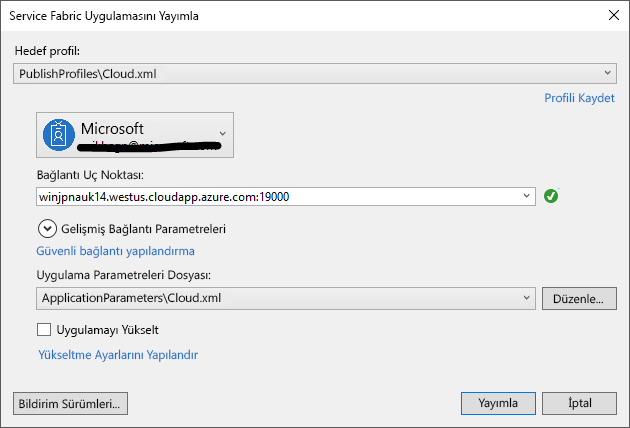

# <a name="deploy-an-application-tooa-party-cluster-in-azure"></a><span data-ttu-id="86173-103">Bir uygulama tooa Azure taraf kümeye dağıtma</span><span class="sxs-lookup"><span data-stu-id="86173-103">Deploy an application tooa Party Cluster in Azure</span></span>
<span data-ttu-id="86173-104">Bu öğretici iki serinin bir parçasıdır ve nasıl gösterir toodeploy Azure Service Fabric uygulaması tooa Azure taraf kümede.</span><span class="sxs-lookup"><span data-stu-id="86173-104">This tutorial is part two of a series and shows you how toodeploy an Azure Service Fabric application tooa Party Cluster in Azure.</span></span>

<span data-ttu-id="86173-105">Bölümünde hello öğretici dizisinin iki bilgi nasıl yapılır:</span><span class="sxs-lookup"><span data-stu-id="86173-105">In part two of hello tutorial series, you learn how to:</span></span>
> [!div class="checklist"]
> * <span data-ttu-id="86173-106">Visual Studio kullanarak bir uygulama tooa uzak bir kümeyi dağıtma</span><span class="sxs-lookup"><span data-stu-id="86173-106">Deploy an application tooa remote cluster using Visual Studio</span></span>
> * <span data-ttu-id="86173-107">Bir uygulama Service Fabric Explorer kullanarak kümeden kaldırma</span><span class="sxs-lookup"><span data-stu-id="86173-107">Remove an application from a cluster using Service Fabric Explorer</span></span>

<span data-ttu-id="86173-108">Bu öğretici serisinde öğrenin nasıl yapılır:</span><span class="sxs-lookup"><span data-stu-id="86173-108">In this tutorial series you learn how to:</span></span>
> [!div class="checklist"]
> * [<span data-ttu-id="86173-109">Bir .NET Service Fabric uygulaması oluşturma</span><span class="sxs-lookup"><span data-stu-id="86173-109">Build a .NET Service Fabric application</span></span>](service-fabric-tutorial-create-dotnet-app.md)
> * <span data-ttu-id="86173-110">Merhaba uygulama tooa uzak kümesi dağıtma</span><span class="sxs-lookup"><span data-stu-id="86173-110">Deploy hello application tooa remote cluster</span></span>
> * [<span data-ttu-id="86173-111">CI/CD Visual Studio Team Services kullanarak yapılandırma</span><span class="sxs-lookup"><span data-stu-id="86173-111">Configure CI/CD using Visual Studio Team Services</span></span>](service-fabric-tutorial-deploy-app-with-cicd-vsts.md)

## <a name="prerequisites"></a><span data-ttu-id="86173-112">Ön koşullar</span><span class="sxs-lookup"><span data-stu-id="86173-112">Prerequisites</span></span>
<span data-ttu-id="86173-113">Bu öğreticiye başlamadan önce:</span><span class="sxs-lookup"><span data-stu-id="86173-113">Before you begin this tutorial:</span></span>
- <span data-ttu-id="86173-114">Bir Azure aboneliğiniz yoksa, oluşturma bir [ücretsiz bir hesap](https://azure.microsoft.com/free/?WT.mc_id=A261C142F)</span><span class="sxs-lookup"><span data-stu-id="86173-114">If you don't have an Azure subscription, create a [free account](https://azure.microsoft.com/free/?WT.mc_id=A261C142F)</span></span>
- <span data-ttu-id="86173-115">[Visual Studio 2017 yükleme](https://www.visualstudio.com/) hello yükleyip **Azure geliştirme** ve **ASP.NET ve web geliştirme** iş yükleri.</span><span class="sxs-lookup"><span data-stu-id="86173-115">[Install Visual Studio 2017](https://www.visualstudio.com/) and install hello **Azure development** and **ASP.NET and web development** workloads.</span></span>
- [<span data-ttu-id="86173-116">Merhaba Service Fabric SDK yükleme</span><span class="sxs-lookup"><span data-stu-id="86173-116">Install hello Service Fabric SDK</span></span>](service-fabric-get-started.md)

## <a name="download-hello-voting-sample-application"></a><span data-ttu-id="86173-117">Merhaba oylama örnek uygulamayı indirin</span><span class="sxs-lookup"><span data-stu-id="86173-117">Download hello Voting sample application</span></span>
<span data-ttu-id="86173-118">Merhaba oylama örnek uygulaması oluşturacağınız değil, [Bu öğretici seri birini Kısım](service-fabric-tutorial-create-dotnet-app.md), yükleyebilirsiniz.</span><span class="sxs-lookup"><span data-stu-id="86173-118">If you did not build hello Voting sample application in [part one of this tutorial series](service-fabric-tutorial-create-dotnet-app.md), you can download it.</span></span> <span data-ttu-id="86173-119">Bir komut penceresinde komut tooclone hello örnek uygulama havuzu tooyour yerel makine aşağıdaki hello çalıştırın.</span><span class="sxs-lookup"><span data-stu-id="86173-119">In a command window, run hello following command tooclone hello sample app repository tooyour local machine.</span></span>

```
git clone https://github.com/Azure-Samples/service-fabric-dotnet-quickstart
```

## <a name="set-up-a-party-cluster"></a><span data-ttu-id="86173-120">Taraf küme ayarlama</span><span class="sxs-lookup"><span data-stu-id="86173-120">Set up a Party Cluster</span></span>
<span data-ttu-id="86173-121">Parti kümeleri Azure üzerinde barındırılan ve burada herkes uygulamaları dağıtabilir ve hello platform hakkında bilgi edinin hello Service Fabric ekibi tarafından çalıştırılan ücretsiz, sınırlı süre Service Fabric kümeleri ' dir.</span><span class="sxs-lookup"><span data-stu-id="86173-121">Party clusters are free, limited-time Service Fabric clusters hosted on Azure and run by hello Service Fabric team where anyone can deploy applications and learn about hello platform.</span></span> <span data-ttu-id="86173-122">Ücretsiz!</span><span class="sxs-lookup"><span data-stu-id="86173-122">For free!</span></span>

<span data-ttu-id="86173-123">tooget erişim tooa taraf küme toothis site göz atın: http://aka.ms/tryservicefabric ve izleme hello yönergeleri tooget erişim tooa küme.</span><span class="sxs-lookup"><span data-stu-id="86173-123">tooget access tooa Party Cluster, browse toothis site: http://aka.ms/tryservicefabric and follow hello instructions tooget access tooa cluster.</span></span> <span data-ttu-id="86173-124">Bir Facebook veya GitHub hesabı tooget erişim tooa taraf küme gerekir.</span><span class="sxs-lookup"><span data-stu-id="86173-124">You need a Facebook or GitHub account tooget access tooa Party Cluster.</span></span>

> [!NOTE]
> <span data-ttu-id="86173-125">Parti kümeleri sağlanmaz, bu nedenle uygulamalarınız ve bunları put herhangi bir veri görünür tooothers olabilir.</span><span class="sxs-lookup"><span data-stu-id="86173-125">Party clusters are not secured, so your applications and any data you put in them may be visible tooothers.</span></span> <span data-ttu-id="86173-126">Başkalarının istemiyorsanız herhangi bir şey dağıtmazsınız toosee.</span><span class="sxs-lookup"><span data-stu-id="86173-126">Don't deploy anything you don't want others toosee.</span></span> <span data-ttu-id="86173-127">Tüm hello Ayrıntılar için kullanım koşullarını üzerinden tooread emin olun.</span><span class="sxs-lookup"><span data-stu-id="86173-127">Be sure tooread over our Terms of Use for all hello details.</span></span>

## <a name="configure-hello-listening-port"></a><span data-ttu-id="86173-128">Merhaba dinleme bağlantı noktasını yapılandırın</span><span class="sxs-lookup"><span data-stu-id="86173-128">Configure hello listening port</span></span>
<span data-ttu-id="86173-129">Merhaba VotingWeb ön uç hizmeti oluşturulduğunda, Visual Studio hello hizmet toolisten için bir bağlantı noktası üzerinde rastgele seçer.</span><span class="sxs-lookup"><span data-stu-id="86173-129">When hello VotingWeb front-end service is created, Visual Studio randomly selects a port for hello service toolisten on.</span></span>  <span data-ttu-id="86173-130">Merhaba VotingWeb hizmet hello bu uygulama için ön uç görevi görür ve dış trafiği kabul eder, sağlandığından sabit bu hizmet tooa bağlayabilir ve bağlantı noktası iyi biliyor.</span><span class="sxs-lookup"><span data-stu-id="86173-130">hello VotingWeb service acts as hello front-end for this application and accepts external traffic, so let's bind that service tooa fixed and well-know port.</span></span> <span data-ttu-id="86173-131">Çözüm Gezgini'nde açık *VotingWeb/PackageRoot/ServiceManifest.xml*.</span><span class="sxs-lookup"><span data-stu-id="86173-131">In Solution Explorer, open  *VotingWeb/PackageRoot/ServiceManifest.xml*.</span></span>  <span data-ttu-id="86173-132">Hello bulur **Endpoint** hello kaynağında **kaynakları** bölümünde ve hello değiştirme **bağlantı noktası** değeri too80.</span><span class="sxs-lookup"><span data-stu-id="86173-132">Find hello **Endpoint** resource in hello **Resources** section and change hello **Port** value too80.</span></span>

```xml
<Resources>
    <Endpoints>
      <!-- This endpoint is used by hello communication listener tooobtain hello port on which too
           listen. Please note that if your service is partitioned, this port is shared with 
           replicas of different partitions that are placed in your code. -->
      <Endpoint Protocol="http" Name="ServiceEndpoint" Type="Input" Port="80" />
    </Endpoints>
  </Resources>
```

<span data-ttu-id="86173-133">'F5' kullanarak hata ayıklama işlemi yaparken bir web tarayıcısı toohello doğru bağlantı noktası açar. Ayrıca hello uygulama URL'si özelliği değeri hello oylama projesinde güncelleştirin.</span><span class="sxs-lookup"><span data-stu-id="86173-133">Also update hello Application URL property value in hello Voting project so a web browser opens toohello correct port when you debug using 'F5'.</span></span>  <span data-ttu-id="86173-134">Çözüm Gezgini'nde hello seçin **oylama** proje ve güncelleştirme hello **uygulama URL'si** özelliği.</span><span class="sxs-lookup"><span data-stu-id="86173-134">In Solution Explorer, select hello **Voting** project and update hello **Application URL** property.</span></span>


## <a name="deploy-hello-app-toohello-azure"></a><span data-ttu-id="86173-136">Merhaba uygulama toohello Azure dağıtma</span><span class="sxs-lookup"><span data-stu-id="86173-136">Deploy hello app toohello Azure</span></span>
<span data-ttu-id="86173-137">Merhaba uygulama hazır, toohello taraf küme Visual Studio'dan doğrudan dağıtabilirsiniz.</span><span class="sxs-lookup"><span data-stu-id="86173-137">Now that hello application is ready, you can deploy it toohello Party Cluster direct from Visual Studio.</span></span>

1. <span data-ttu-id="86173-138">Sağ **oylama** içinde Çözüm Gezgini hello ve seçin **Yayımla**.</span><span class="sxs-lookup"><span data-stu-id="86173-138">Right-click **Voting** in hello Solution Explorer and choose **Publish**.</span></span>

    

2. <span data-ttu-id="86173-140">Merhaba hello taraf küme hello bağlantı uç noktasının türünde **bağlantı uç noktasının** alanına gelin ve **Yayımla**.</span><span class="sxs-lookup"><span data-stu-id="86173-140">Type in hello Connection Endpoint of hello Party Cluster in hello **Connection Endpoint** field and click **Publish**.</span></span>

    <span data-ttu-id="86173-141">Merhaba yayımladıktan sonra sahip bitirdiğinizde, mümkün toosend bir istek toohello uygulaması bir tarayıcı aracılığıyla olmalıdır.</span><span class="sxs-lookup"><span data-stu-id="86173-141">Once hello publish has finished, you should be able toosend a request toohello application via a browser.</span></span>

3. <span data-ttu-id="86173-142">Açık tarayıcı ve hello küme adresini (Merhaba bağlantı uç noktası başlangıç bağlantı noktası bilgilerini - örneğin, win1kw5649s.westus.cloudapp.azure.com olmadan) yazın tercih ettiğiniz.</span><span class="sxs-lookup"><span data-stu-id="86173-142">Open you preferred browser and type in hello cluster address (hello connection endpoint without hello port information - for example, win1kw5649s.westus.cloudapp.azure.com).</span></span>

    <span data-ttu-id="86173-143">Merhaba uygulamayı yerel olarak çalıştırırken gördüğünüz gibi aynı sonucu hello görmelisiniz.</span><span class="sxs-lookup"><span data-stu-id="86173-143">You should now see hello same result as you saw when running hello application locally.</span></span>

    

## <a name="remove-hello-application-from-a-cluster-using-service-fabric-explorer"></a><span data-ttu-id="86173-145">Merhaba uygulaması Service Fabric Explorer kullanarak kümeden kaldırma</span><span class="sxs-lookup"><span data-stu-id="86173-145">Remove hello application from a cluster using Service Fabric Explorer</span></span>
<span data-ttu-id="86173-146">Service Fabric Explorer bir grafik kullanıcı arabirimi tooexplore olduğundan ve bir Service Fabric kümesi uygulamalarda yönetin.</span><span class="sxs-lookup"><span data-stu-id="86173-146">Service Fabric Explorer is a graphical user interface tooexplore and manage applications in a Service Fabric cluster.</span></span>

<span data-ttu-id="86173-147">Merhaba uygulamadan hello taraf küme tooremove:</span><span class="sxs-lookup"><span data-stu-id="86173-147">tooremove hello application from hello Party Cluster:</span></span>

1. <span data-ttu-id="86173-148">Toohello hello taraf küme kaydolma sayfası tarafından sağlanan hello bağlantıyı kullanarak Service Fabric Explorer gidin.</span><span class="sxs-lookup"><span data-stu-id="86173-148">Browse toohello Service Fabric Explorer, using hello link provided by hello Party Cluster sign-up page.</span></span> <span data-ttu-id="86173-149">Örneğin, http://win1kw5649s.westus.cloudapp.azure.com:19080/Explorer/index.html.</span><span class="sxs-lookup"><span data-stu-id="86173-149">For example, http://win1kw5649s.westus.cloudapp.azure.com:19080/Explorer/index.html.</span></span>

2. <span data-ttu-id="86173-150">Service Fabric Explorer'da toohello gidin **fabric://Voting** hello sol taraftaki hello treeview düğümüne.</span><span class="sxs-lookup"><span data-stu-id="86173-150">In Service Fabric Explorer, navigate toohello **fabric://Voting** node in hello treeview on hello left-hand side.</span></span>

3. <span data-ttu-id="86173-151">Merhaba tıklatın **eylem** hello sağ düğmesini **Essentials** bölmesinde ve seçin **uygulama Sil**.</span><span class="sxs-lookup"><span data-stu-id="86173-151">Click hello **Action** button in hello right-hand **Essentials** pane, and choose **Delete Application**.</span></span> <span data-ttu-id="86173-152">Merhaba kümede çalışan uygulamamız hello örneğini kaldıran silme hello uygulama örneği onaylayın.</span><span class="sxs-lookup"><span data-stu-id="86173-152">Confirm deleting hello application instance, which removes hello instance of our application running in hello cluster.</span></span>


## <a name="remove-hello-application-type-from-a-cluster-using-service-fabric-explorer"></a><span data-ttu-id="86173-154">Merhaba uygulama türü Service Fabric Explorer kullanarak kümeden kaldırma</span><span class="sxs-lookup"><span data-stu-id="86173-154">Remove hello application type from a cluster using Service Fabric Explorer</span></span>
<span data-ttu-id="86173-155">Uygulamalar, toohave birden çok örnekleri ve hello küme içinde çalışan hello uygulama sürümlerini sağlayan bir Service Fabric kümesi uygulama türü olarak dağıtılır.</span><span class="sxs-lookup"><span data-stu-id="86173-155">Applications are deployed as application types in a Service Fabric cluster, which enables you toohave multiple instances and versions of hello application running within hello cluster.</span></span> <span data-ttu-id="86173-156">Uygulamamız örneğini çalıştıran hello kaldırdıktan sonra biz hello türü, toocomplete hello temizleme hello dağıtımının da kaldırabilirsiniz.</span><span class="sxs-lookup"><span data-stu-id="86173-156">After having removed hello running instance of our application, we can also remove hello type, toocomplete hello cleanup of hello deployment.</span></span>

<span data-ttu-id="86173-157">Service Fabric hello uygulama modelleri hakkında daha fazla bilgi için bkz: [Service Fabric uygulamada Model](service-fabric-application-model.md).</span><span class="sxs-lookup"><span data-stu-id="86173-157">For more information about hello application model in Service Fabric, see [Model an application in Service Fabric](service-fabric-application-model.md).</span></span>

1. <span data-ttu-id="86173-158">Toohello gidin **VotingType** hello treeview düğümüne.</span><span class="sxs-lookup"><span data-stu-id="86173-158">Navigate toohello **VotingType** node in hello treeview.</span></span>

2. <span data-ttu-id="86173-159">Merhaba tıklatın **eylem** hello sağ düğmesini **Essentials** bölmesinde ve seçin **sağlamayı kaldırma türü**.</span><span class="sxs-lookup"><span data-stu-id="86173-159">Click hello **Action** button in hello right-hand **Essentials** pane, and choose **Unprovision Type**.</span></span> <span data-ttu-id="86173-160">Sağlama geri alınıyor hello uygulama türü onaylayın.</span><span class="sxs-lookup"><span data-stu-id="86173-160">Confirm unprovisioning hello application type.</span></span>


<span data-ttu-id="86173-162">Merhaba öğreticiyi sonlandırır.</span><span class="sxs-lookup"><span data-stu-id="86173-162">This concludes hello tutorial.</span></span>

## <a name="next-steps"></a><span data-ttu-id="86173-163">Sonraki adımlar</span><span class="sxs-lookup"><span data-stu-id="86173-163">Next steps</span></span>
<span data-ttu-id="86173-164">Bu öğreticide, şunların nasıl yapıldığını öğrendiniz:</span><span class="sxs-lookup"><span data-stu-id="86173-164">In this tutorial, you learned how to:</span></span>

> [!div class="checklist"]
> * <span data-ttu-id="86173-165">Visual Studio kullanarak bir uygulama tooa uzak bir kümeyi dağıtma</span><span class="sxs-lookup"><span data-stu-id="86173-165">Deploy an application tooa remote cluster using Visual Studio</span></span>
> * <span data-ttu-id="86173-166">Bir uygulama Service Fabric Explorer kullanarak kümeden kaldırma</span><span class="sxs-lookup"><span data-stu-id="86173-166">Remove an application from a cluster using Service Fabric Explorer</span></span>

<span data-ttu-id="86173-167">Gelişmiş toohello sonraki öğretici:</span><span class="sxs-lookup"><span data-stu-id="86173-167">Advance toohello next tutorial:</span></span>
> [!div class="nextstepaction"]
> [<span data-ttu-id="86173-168">Visual Studio Team Services kullanarak sürekli tümleştirme kurup</span><span class="sxs-lookup"><span data-stu-id="86173-168">Set up continuous integration using Visual Studio Team Services</span></span>](service-fabric-tutorial-deploy-app-with-cicd-vsts.md)