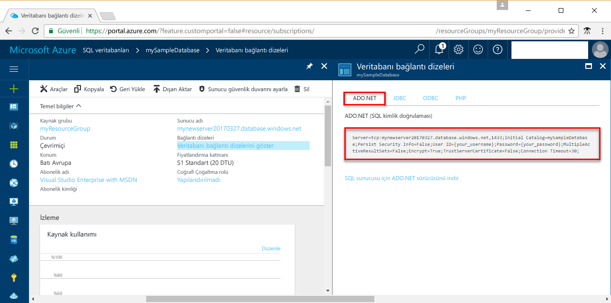

# <a name="use-net-c-with-visual-studio-tooconnect-and-query-an-azure-sql-database"></a>.NET (C#) ile Visual Studio tooconnect kullanın ve Azure SQL veritabanını sorgulama

Bu hızlı başlangıç Öğreticisi gösteren nasıl toouse hello [.NET framework](https://www.microsoft.com/net/) toocreate C# programı ile Visual Studio tooconnect tooan Azure SQL veritabanı ve Transact-SQL deyimleri tooquery verileri kullanın.

## <a name="prerequisites"></a>Ön koşullar

toocomplete Bu hızlı başlangıç Öğreticisi, hello aşağıdaki sahip olduğunuzdan emin olun:

- Bir Azure SQL veritabanı. Bu hızlı başlangıç Bu hızlı başlangıçlar birinde oluşturulan hello kaynakları kullanır: 

   - [DB Oluşturma - Portal](sql-database-get-started-portal.md)
   - [DB oluşturma - CLI](sql-database-get-started-cli.md)
   - [DB Oluşturma - PowerShell](sql-database-get-started-powershell.md)

- A [sunucu düzeyinde güvenlik duvarı kuralı](sql-database-get-started-portal.md#create-a-server-level-firewall-rule) hello için genel IP adresi hello bilgisayarın bu hızlı başlangıç öğreticisi için kullanın.
- [Visual Studio Community 2017, Visual Studio Professional 2017 veya Visual Studio Enterprise 2017](https://www.visualstudio.com/downloads/) yüklemesi.

## <a name="sql-server-connection-information"></a>SQL Server bağlantı bilgileri

Merhaba bağlantı gerekli bilgileri tooconnect toohello Azure SQL veritabanı alın. Merhaba tam sunucu adını, veritabanı adının ve oturum açma bilgilerini hello sonraki yordamlarda gerekir.

1. İçinde toohello oturum [Azure portal](https://portal.azure.com/).
2. Seçin **SQL veritabanları** hello sol taraftaki menüden veritabanınızda hello tıklatıp **SQL veritabanları** sayfası. 
3. Merhaba üzerinde **genel bakış** gözden geçirme hello veritabanınız için sayfa hello görüntü aşağıdaki gösterildiği gibi sunucu adı tam olarak nitelenmiş. Merhaba sunucu adı toobring hello yukarı üzerine getirin **tıklatın toocopy** seçeneği. 

    

4. Azure SQL veritabanı sunucusu oturum açma bilgilerinizi unutursanız, toohello SQL veritabanı sunucusu sayfa tooview hello sunucu yönetici adı gidin. Gerekirse, hello parolayı sıfırlayabilirsiniz.

5. **Veritabanı bağlantı dizelerini göster**’e tıklayın.

6. Gözden geçirme hello tam **ADO.NET** bağlantı dizesi.

    

> [!IMPORTANT]
> Bu öğreticiyi gerçekleştirme hello bilgisayarın hello ortak IP adresi için yerinde bir güvenlik duvarı kuralı olması gerekir. Farklı bir bilgisayarda olan veya farklı bir ortak IP adresi varsa, oluşturma bir [sunucu düzeyinde güvenlik duvarı kuralı kullanarak hello Azure portal](sql-database-get-started-portal.md#create-a-server-level-firewall-rule). 
>
  
## <a name="create-a-new-visual-studio-project"></a>Yeni Visual Studio projesi oluşturma

1. Visual Studio'da **Dosya**, **Yeni**, **Proje**’yi seçin. 
2. Merhaba, **yeni proje** iletişim kutusunda ve genişletin **Visual C#**.
3. Seçin **konsol uygulaması** ve girin *sqltest* hello proje adı.
4. Tıklatın **Tamam** toocreate ve açık hello Visual Studio'da yeni proje
4. Çözüm Gezgini'nde, **sqltest**'e sağ tıklayın ve **NuGet Paketlerini Yönet**'e tıklayın. 
5. Merhaba üzerinde **Gözat**, arama ```System.Data.SqlClient``` ve, ne zaman bulunamadı, onu seçin.
6. Merhaba, **System.Data.SqlClient** sayfasında, **yükleme**.
7. Merhaba yükleme tamamlandığında, hello değişiklikleri gözden geçirin ve ardından **Tamam** tooclose hello **Önizleme** penceresi. 
8. **Lisans Kabulü** penceresi gösterilirse **Kabul Ediyorum**’a tıklayın.

## <a name="insert-code-tooquery-sql-database"></a>Kod tooquery SQL veritabanı Ekle
1. Çok geçiş (veya gerekirse açın) **Program.cs**

2. Merhaba Değiştir **Program.cs** aşağıdaki kod ve sunucu, veritabanı, kullanıcı ve parola için uygun değerleri hello ekleme hello ile.

```csharp
using System;
using System.Data.SqlClient;
using System.Text;

namespace sqltest
{
    class Program
    {
        static void Main(string[] args)
        {
            try 
            { 
                SqlConnectionStringBuilder builder = new SqlConnectionStringBuilder();
                builder.DataSource = "your_server.database.windows.net"; 
                builder.UserID = "your_user";            
                builder.Password = "your_password";     
                builder.InitialCatalog = "your_database";

                using (SqlConnection connection = new SqlConnection(builder.ConnectionString))
                {
                    Console.WriteLine("\nQuery data example:");
                    Console.WriteLine("=========================================\n");
                    
                    connection.Open();       
                    StringBuilder sb = new StringBuilder();
                    sb.Append("SELECT TOP 20 pc.Name as CategoryName, p.name as ProductName ");
                    sb.Append("FROM [SalesLT].[ProductCategory] pc ");
                    sb.Append("JOIN [SalesLT].[Product] p ");
                    sb.Append("ON pc.productcategoryid = p.productcategoryid;");
                    String sql = sb.ToString();

                    using (SqlCommand command = new SqlCommand(sql, connection))
                    {
                        using (SqlDataReader reader = command.ExecuteReader())
                        {
                            while (reader.Read())
                            {
                                Console.WriteLine("{0} {1}", reader.GetString(0), reader.GetString(1));
                            }
                        }
                    }                    
                }
            }
            catch (SqlException e)
            {
                Console.WriteLine(e.ToString());
            }
            Console.ReadLine();
        }
    }
}
```

## <a name="run-hello-code"></a>Merhaba kodu çalıştırma

1. Tuşuna **F5** toorun Merhaba uygulaması.
2. Merhaba üst 20 satır döndürülür ve hello uygulama penceresini kapatın doğrulayın.

## <a name="next-steps"></a>Sonraki adımlar

- Nasıl çok öğrenin[bağlanma ve .NET core kullanarak Azure SQL veritabanını sorgulama](sql-database-connect-query-dotnet-core.md) Linux/Windows/macOS üzerinde.  
- Hakkında bilgi edinin [Windows/Linux/macOS hello komut satırını kullanarak .NET Çekirdeğinde ile çalışmaya başlama](/dotnet/core/tutorials/using-with-xplat-cli).
- Nasıl çok öğrenin[SSMS kullanarak ilk Azure SQL veritabanınızı tasarım](sql-database-design-first-database.md) veya [.NET kullanarak ilk Azure SQL veritabanınızı tasarım](sql-database-design-first-database-csharp.md).
- .NET hakkında daha fazla bilgi edinmek için [.NET belgelerine](https://docs.microsoft.com/dotnet/) bakın.
