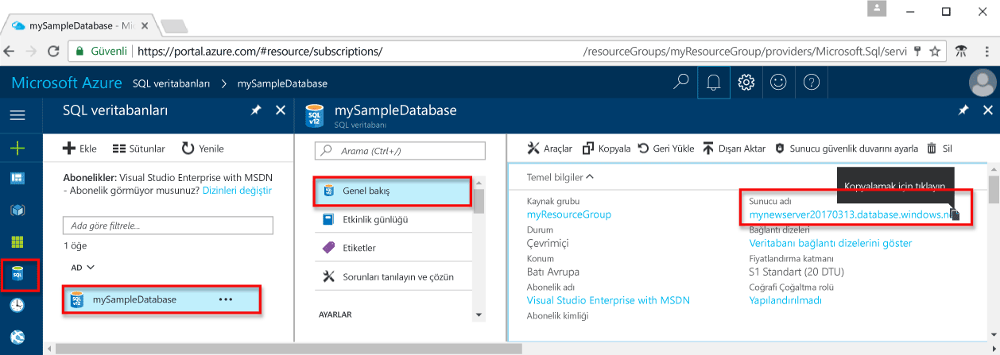

# <a name="azure-sql-database-use-sql-server-management-studio-tooconnect-and-query-data"></a>Azure SQL veritabanı: SQL Server Management Studio'yu kullanın tooconnect ve sorgu verileri

[SQL Server Management Studio](https://msdn.microsoft.com/library/ms174173.aspx) (SSMS) olan herhangi bir SQL altyapı veritabanı Windows için Microsoft SQL Server tooSQL yönetme için tümleşik bir ortam. Bu hızlı başlangıç nasıl toouse SSMS tooconnect tooan Azure SQL veritabanı ve kullanım Transact-SQL deyimleri tooquery, Ekle, Güncelleştir ve hello veritabanında bulunan verileri silme gösterir. 

## <a name="prerequisites"></a>Ön koşullar

Bu hızlı başlangıç Bu hızlı başlangıçlar birinde oluşturulan başlangıç noktası hello kaynaklarını kullanır:

- [DB Oluşturma - Portal](sql-database-get-started-portal.md)
- [DB oluşturma - CLI](sql-database-get-started-cli.md)
- [DB Oluşturma - PowerShell](sql-database-get-started-powershell.md)

Başlamadan önce hello en yeni sürümünü yüklediğinizden emin olun [SSMS](https://msdn.microsoft.com/library/mt238290.aspx). 

## <a name="sql-server-connection-information"></a>SQL Server bağlantı bilgileri

Merhaba bağlantı gerekli bilgileri tooconnect toohello Azure SQL veritabanı alın. Merhaba tam sunucu adını, veritabanı adının ve oturum açma bilgilerini hello sonraki yordamlarda gerekir.

1. İçinde toohello oturum [Azure portal](https://portal.azure.com/).
2. Seçin **SQL veritabanları** hello sol taraftaki menüden veritabanınızda hello tıklatıp **SQL veritabanları** sayfası. 
3. Merhaba üzerinde **genel bakış** sayfasında veritabanınız için hello resimde gösterildiği gibi hello tam sunucu adını gözden geçirin. Merhaba sunucu adı toobring hello yukarı üzerine getirin **tıklatın toocopy** seçeneği.

    

4. Merhaba oturum açma bilgilerini Azure SQL veritabanı sunucunuz için unuttuysanız, toohello SQL veritabanı sunucusu sayfa tooview hello sunucu yönetici adı gidin ve gerekiyorsa, sıfırlama, hello parola. 

## <a name="connect-tooyour-database"></a>Tooyour veritabanına bağlanın

SQL Server Management Studio tooestablish bağlantı tooyour Azure SQL veritabanı sunucusu kullanın. 

> [!IMPORTANT]
> Azure SQL Veritabanı mantıksal sunucusu 1433 numaralı bağlantı noktasında dinler. Tooconnect tooan Azure SQL Database mantıksal sunucudan kurumsal bir güvenlik duvarı içinde çalışıyorsanız, toosuccessfully bağlanmak için bu bağlantı noktası hello Kurumsal Güvenlik Duvarı'nda açık olması gerekir.
>

1. SQL Server Management Studio’yu açın.

2. Merhaba, **tooServer bağlanmak** iletişim kutusunda, aşağıdaki bilgilerle hello girin:

   | Ayar       | Önerilen değer | Açıklama | 
   | ------------ | ------------------ | ------------------------------------------------- | 
   | **Sunucu türü** | Veritabanı altyapısı | Bu değer gereklidir. |
   | **Sunucu adı** | Merhaba tam sunucu adı | Merhaba adı şöyle olmalıdır: **mynewserver20170313.database.windows.net**. |
   | **Kimlik doğrulaması** | SQL Server Kimlik Doğrulaması | SQL kimlik doğrulaması biz Bu öğreticide yapılandırdığınız hello yalnızca kimlik doğrulaması türüdür. |
   | **Oturum açma** | Merhaba server yönetici hesabı | Bu hello sunucu oluşturduğunuzda, belirttiğiniz hello hesabıdır. |
   | **Parola** | Sunucu yönetici hesabınız için Hello parola | Bu hello sunucu oluşturduğunuzda, belirttiğiniz hello paroladır. |

     

3. Tıklatın **seçenekleri** hello içinde **tooserver bağlanmak** iletişim kutusu. Merhaba, **toodatabase bağlanmak** bölümünde, girin **mySampleDatabase** tooconnect toothis veritabanı.

     

4. **Bağlan**'a tıklayın. SSMS Hello Nesne Gezgini penceresi açılır. 

     

5. Nesne Gezgini'nde genişletin **veritabanları** genişletin ve ardından **mySampleDatabase** hello örnek veritabanındaki tooview hello nesneleri.

## <a name="query-data"></a>Verileri sorgulama

Kullanım hello aşağıdaki kod tooquery hello ilk 20 ürünleri için hello kullanarak kategoriye göre [seçin](https://msdn.microsoft.com/library/ms189499.aspx) Transact-SQL deyimi.

1. Nesne Gezgini’nde **mySampleDatabase** öğesine sağ tıklayıp **Yeni Sorgu**’ya tıklayın. Boş sorgu penceresi bağlı tooyour veritabanını başka bir deyişle açar.
2. Merhaba sorgu penceresinde, sorgu aşağıdaki hello girin:

   ```sql
   SELECT pc.Name as CategoryName, p.name as ProductName
   FROM [SalesLT].[ProductCategory] pc
   JOIN [SalesLT].[Product] p
   ON pc.productcategoryid = p.productcategoryid;
   ```

3. Merhaba araç çubuğundan, **yürütme** hello ürün ve ProductCategory tablolarındaki tooretrieve verileri.

    

## <a name="insert-data"></a>Veri ekleme

Kullanım hello aşağıdaki hello SalesLT.Product tabloya hello kullanarak yeni bir ürün tooinsert kod [Ekle](https://msdn.microsoft.com/library/ms174335.aspx) Transact-SQL deyimi.

1. Merhaba sorgu penceresinde hello önceki sorgu sorgu aşağıdaki hello ile değiştirin:

   ```sql
   INSERT INTO [SalesLT].[Product]
           ( [Name]
           , [ProductNumber]
           , [Color]
           , [ProductCategoryID]
           , [StandardCost]
           , [ListPrice]
           , [SellStartDate]
           )
     VALUES
           ('myNewProduct'
           ,123456789
           ,'NewColor'
           ,1
           ,100
           ,100
           ,GETDATE() );
   ```

2. Merhaba araç çubuğundan, **yürütme** tooinsert hello ürün tablosunda yeni bir satır.

    

## <a name="update-data"></a>Verileri güncelleştirme

Kullanım hello aşağıdaki kod tooupdate hello yeni ürün hello kullanarak daha önce eklediğiniz [güncelleştirme](https://msdn.microsoft.com/library/ms177523.aspx) Transact-SQL deyimi.

1. Merhaba sorgu penceresinde hello önceki sorgu sorgu aşağıdaki hello ile değiştirin:

   ```sql
   UPDATE [SalesLT].[Product]
   SET [ListPrice] = 125
   WHERE Name = 'myNewProduct';
   ```

2. Merhaba araç çubuğundan, **yürütme** hello ürün tablosundaki tooupdate hello belirtilen satır.

    

## <a name="delete-data"></a>Verileri silme

Kullanım hello aşağıdaki kod toodelete hello yeni ürün hello kullanarak daha önce eklediğiniz [silmek](https://msdn.microsoft.com/library/ms189835.aspx) Transact-SQL deyimi.

1. Merhaba sorgu penceresinde hello önceki sorgu sorgu aşağıdaki hello ile değiştirin:

   ```sql
   DELETE FROM [SalesLT].[Product]
   WHERE Name = 'myNewProduct';
   ```

2. Merhaba araç çubuğundan, **yürütme** hello ürün tablosundaki toodelete hello belirtilen satır.

    

## <a name="next-steps"></a>Sonraki adımlar

- sunucular ve veritabanları Transact-SQL ile oluşturma ve yönetme hakkında toolearn bkz [Azure SQL veritabanı sunucuları ve veritabanları hakkında daha fazla bilgi](sql-database-servers-databases.md).
- SSMS hakkında bilgi için bkz. [SQL Server Management Studio'yu Kullanma](https://msdn.microsoft.com/library/ms174173.aspx).
- bkz: tooconnect ve Visual Studio Code kullanarak sorgu [bağlanma ve sorgu Visual Studio Code ile](sql-database-connect-query-vscode.md).
- bkz: tooconnect ve .NET kullanarak sorgu [bağlanma ve sorgu .NET ile](sql-database-connect-query-dotnet.md).
- bkz: tooconnect ve PHP, kullanarak sorgu [Connect ve PHP sorguyla](sql-database-connect-query-php.md).
- bkz: tooconnect ve Node.js kullanarak sorgu [Connect ve Node.js sorguyla](sql-database-connect-query-nodejs.md).
- bkz: tooconnect ve Java kullanarak sorgu [Connect ve Java sorguyla](sql-database-connect-query-java.md).
- bkz: tooconnect ve Python kullanarak sorgu [Connect ve Python sorguyla](sql-database-connect-query-python.md).
- bkz: tooconnect ve Ruby, kullanarak sorgu [Connect ve Ruby sorguyla](sql-database-connect-query-ruby.md).
