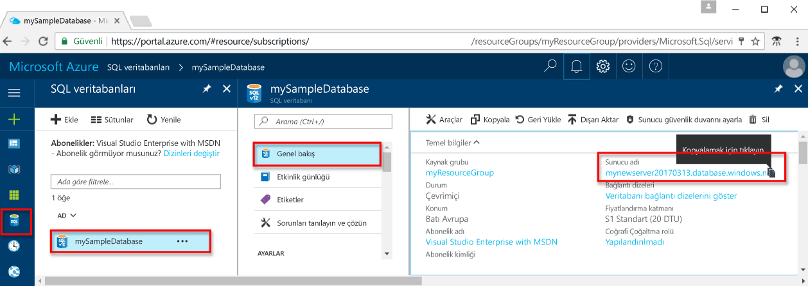
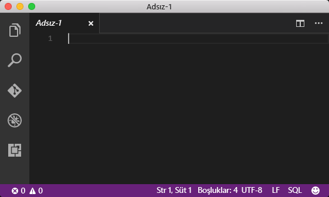
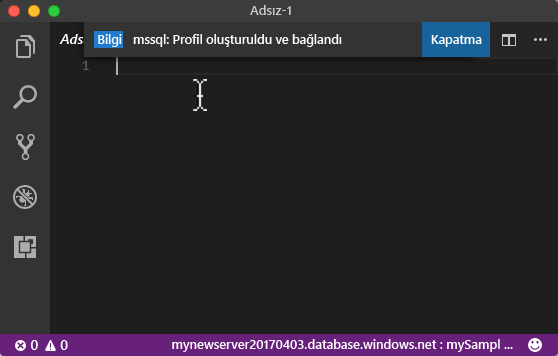
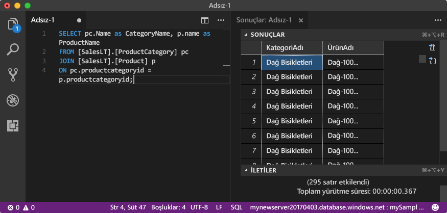

# <a name="azure-sql-database-use-visual-studio-code-tooconnect-and-query-data"></a><span data-ttu-id="b2adf-105">Azure SQL Database: Kullanım Visual Studio Code tooconnect ve sorgu verileri</span><span class="sxs-lookup"><span data-stu-id="b2adf-105">Azure SQL Database: Use Visual Studio Code tooconnect and query data</span></span>

<span data-ttu-id="b2adf-106">[Visual Studio Code](https://code.visualstudio.com/docs) Linux, macOS, grafik bir kod düzenleyicisidir ve uzantılar da dahil olmak üzere destekleyen bir Windows hello [mssql uzantısı](https://aka.ms/mssql-marketplace) Microsoft SQL Server, Azure SQL Database ve SQL Data Warehouse sorgulamak için.</span><span class="sxs-lookup"><span data-stu-id="b2adf-106">[Visual Studio Code](https://code.visualstudio.com/docs) is a graphical code editor for Linux, macOS, and Windows that supports extensions, including hello [mssql extension](https://aka.ms/mssql-marketplace) for querying Microsoft SQL Server, Azure SQL Database, and SQL Data Warehouse.</span></span> <span data-ttu-id="b2adf-107">Bu hızlı başlangıç nasıl toouse Visual Studio Code tooconnect tooan Azure SQL veritabanı ve kullanım Transact-SQL deyimleri tooquery, Ekle, Güncelleştir ve hello veritabanında bulunan verileri silme gösterir.</span><span class="sxs-lookup"><span data-stu-id="b2adf-107">This quick start demonstrates how toouse Visual Studio Code tooconnect tooan Azure SQL database, and then use Transact-SQL statements tooquery, insert, update, and delete data in hello database.</span></span>

## <a name="prerequisites"></a><span data-ttu-id="b2adf-108">Ön koşullar</span><span class="sxs-lookup"><span data-stu-id="b2adf-108">Prerequisites</span></span>

<span data-ttu-id="b2adf-109">Bu hızlı başlangıç Bu hızlı başlangıçlar birinde oluşturulan başlangıç noktası hello kaynaklarını kullanır:</span><span class="sxs-lookup"><span data-stu-id="b2adf-109">This quick start uses as its starting point hello resources created in one of these quick starts:</span></span>

- [<span data-ttu-id="b2adf-110">DB Oluşturma - Portal</span><span class="sxs-lookup"><span data-stu-id="b2adf-110">Create DB - Portal</span></span>](sql-database-get-started-portal.md)
- [<span data-ttu-id="b2adf-111">DB oluşturma - CLI</span><span class="sxs-lookup"><span data-stu-id="b2adf-111">Create DB - CLI</span></span>](sql-database-get-started-cli.md)
- [<span data-ttu-id="b2adf-112">DB Oluşturma - PowerShell</span><span class="sxs-lookup"><span data-stu-id="b2adf-112">Create DB - PowerShell</span></span>](sql-database-get-started-powershell.md)

<span data-ttu-id="b2adf-113">Başlamadan önce hello en yeni sürümünü yüklediğinizden emin olun [Visual Studio Code](https://code.visualstudio.com/Download) ve yüklenen hello [mssql uzantısı](https://aka.ms/mssql-marketplace).</span><span class="sxs-lookup"><span data-stu-id="b2adf-113">Before you start, make sure you have installed hello newest version of [Visual Studio Code](https://code.visualstudio.com/Download) and loaded hello [mssql extension](https://aka.ms/mssql-marketplace).</span></span> <span data-ttu-id="b2adf-114">Merhaba mssql uzantısı için yükleme yönergeleri için bkz [yükleme VS Code](https://docs.microsoft.com/sql/linux/sql-server-linux-develop-use-vscode#install-vs-code) ve [Visual Studio Code mssql](https://marketplace.visualstudio.com/items?itemName=ms-mssql.mssql).</span><span class="sxs-lookup"><span data-stu-id="b2adf-114">For installation guidance for hello mssql extension, see [Install VS Code](https://docs.microsoft.com/sql/linux/sql-server-linux-develop-use-vscode#install-vs-code) and see [mssql for Visual Studio Code](https://marketplace.visualstudio.com/items?itemName=ms-mssql.mssql).</span></span> 

## <a name="configure-vs-code"></a><span data-ttu-id="b2adf-115">VS Code'u yapılandırma</span><span class="sxs-lookup"><span data-stu-id="b2adf-115">Configure VS Code</span></span> 

### <a name="mac-os"></a><span data-ttu-id="b2adf-116">**Mac OS**</span><span class="sxs-lookup"><span data-stu-id="b2adf-116">**Mac OS**</span></span>
<span data-ttu-id="b2adf-117">MacOS için tooinstall DotNet çekirdek bu mssql uzantı kullanan bir ön koşul olan OpenSSL gerekir.</span><span class="sxs-lookup"><span data-stu-id="b2adf-117">For macOS, you need tooinstall OpenSSL which is a prerequiste for DotNet Core that mssql extention uses.</span></span> <span data-ttu-id="b2adf-118">Terminalinizde açın ve aşağıdaki komutları tooinstall hello girin **brew** ve **OpenSSL**.</span><span class="sxs-lookup"><span data-stu-id="b2adf-118">Open your terminal and enter hello following commands tooinstall **brew** and **OpenSSL**.</span></span> 

```bash
ruby -e "$(curl -fsSL https://raw.githubusercontent.com/Homebrew/install/master/install)"
brew update
brew install openssl
mkdir -p /usr/local/lib
ln -s /usr/local/opt/openssl/lib/libcrypto.1.0.0.dylib /usr/local/lib/
ln -s /usr/local/opt/openssl/lib/libssl.1.0.0.dylib /usr/local/lib/
```

### <a name="linux-ubuntu"></a><span data-ttu-id="b2adf-119">**Linux (Ubuntu)**</span><span class="sxs-lookup"><span data-stu-id="b2adf-119">**Linux (Ubuntu)**</span></span>

<span data-ttu-id="b2adf-120">Hiçbir özel yapılandırma gerekmez.</span><span class="sxs-lookup"><span data-stu-id="b2adf-120">No special configuration needed.</span></span>

### <a name="windows"></a><span data-ttu-id="b2adf-121">**Windows**</span><span class="sxs-lookup"><span data-stu-id="b2adf-121">**Windows**</span></span>

<span data-ttu-id="b2adf-122">Hiçbir özel yapılandırma gerekmez.</span><span class="sxs-lookup"><span data-stu-id="b2adf-122">No special configuration needed.</span></span>

## <a name="sql-server-connection-information"></a><span data-ttu-id="b2adf-123">SQL Server bağlantı bilgileri</span><span class="sxs-lookup"><span data-stu-id="b2adf-123">SQL server connection information</span></span>

<span data-ttu-id="b2adf-124">Merhaba bağlantı gerekli bilgileri tooconnect toohello Azure SQL veritabanı alın.</span><span class="sxs-lookup"><span data-stu-id="b2adf-124">Get hello connection information needed tooconnect toohello Azure SQL database.</span></span> <span data-ttu-id="b2adf-125">Merhaba tam sunucu adını, veritabanı adının ve oturum açma bilgilerini hello sonraki yordamlarda gerekir.</span><span class="sxs-lookup"><span data-stu-id="b2adf-125">You will need hello fully qualified server name, database name, and login information in hello next procedures.</span></span>

1. <span data-ttu-id="b2adf-126">İçinde toohello oturum [Azure portal](https://portal.azure.com/).</span><span class="sxs-lookup"><span data-stu-id="b2adf-126">Log in toohello [Azure portal](https://portal.azure.com/).</span></span>
2. <span data-ttu-id="b2adf-127">Seçin **SQL veritabanları** hello sol taraftaki menüden veritabanınızda hello tıklatıp **SQL veritabanları** sayfası.</span><span class="sxs-lookup"><span data-stu-id="b2adf-127">Select **SQL Databases** from hello left-hand menu, and click your database on hello **SQL databases** page.</span></span> 
3. <span data-ttu-id="b2adf-128">Merhaba üzerinde **genel bakış** gözden geçirme hello veritabanınız için sayfa hello görüntü aşağıdaki gösterildiği gibi sunucu adı tam olarak nitelenmiş.</span><span class="sxs-lookup"><span data-stu-id="b2adf-128">On hello **Overview** page for your database, review hello fully qualified server name as shown in hello following image.</span></span> <span data-ttu-id="b2adf-129">Merhaba sunucu adı toobring hello yukarı üzerine getirin **tıklatın toocopy** seçeneği.</span><span class="sxs-lookup"><span data-stu-id="b2adf-129">You can hover over hello server name toobring up hello **Click toocopy** option.</span></span>

    

4. <span data-ttu-id="b2adf-131">Merhaba oturum açma bilgilerini Azure SQL veritabanı sunucunuz için unuttuysanız, toohello SQL veritabanı sunucusu sayfa tooview hello sunucu yönetici adı gidin ve gerekiyorsa, sıfırlama, hello parola.</span><span class="sxs-lookup"><span data-stu-id="b2adf-131">If you have forgotten hello login information for your Azure SQL Database server, navigate toohello SQL Database server page tooview hello server admin name and, if necessary, reset hello password.</span></span> 

## <a name="set-language-mode-toosql"></a><span data-ttu-id="b2adf-132">Set dil modu tooSQL</span><span class="sxs-lookup"><span data-stu-id="b2adf-132">Set language mode tooSQL</span></span>

<span data-ttu-id="b2adf-133">Kümesi hello dil modu olarak ayarlanmış çok**SQL** Visual Studio Code tooenable mssql komutları ve T-SQL IntelliSense.</span><span class="sxs-lookup"><span data-stu-id="b2adf-133">Set hello language mode is set too**SQL** in Visual Studio Code tooenable mssql commands and T-SQL IntelliSense.</span></span>

1. <span data-ttu-id="b2adf-134">Yeni bir Visual Studio Code penceresi açın.</span><span class="sxs-lookup"><span data-stu-id="b2adf-134">Open a new Visual Studio Code window.</span></span> 

2. <span data-ttu-id="b2adf-135">Tıklatın **düz metin** hello alt sağ köşesindeki hello durum çubuğu.</span><span class="sxs-lookup"><span data-stu-id="b2adf-135">Click **Plain Text** in hello lower right-hand corner of hello status bar.</span></span>
3. <span data-ttu-id="b2adf-136">Merhaba, **Select dil modu** açar açılır menü, türü **SQL**ve tuşuna basın **ENTER** tooset hello dil modu tooSQL.</span><span class="sxs-lookup"><span data-stu-id="b2adf-136">In hello **Select language mode** drop-down menu that opens, type **SQL**, and then press **ENTER** tooset hello language mode tooSQL.</span></span> 

   

## <a name="connect-tooyour-database"></a><span data-ttu-id="b2adf-138">Tooyour veritabanına bağlanın</span><span class="sxs-lookup"><span data-stu-id="b2adf-138">Connect tooyour database</span></span>

<span data-ttu-id="b2adf-139">Visual Studio Code tooestablish bağlantı tooyour Azure SQL veritabanı sunucusu kullanın.</span><span class="sxs-lookup"><span data-stu-id="b2adf-139">Use Visual Studio Code tooestablish a connection tooyour Azure SQL Database server.</span></span>

> [!IMPORTANT]
> <span data-ttu-id="b2adf-140">Devam etmeden önce sunucu, veritabanı ve oturum açma bilgilerinizin hazır olduğundan emin olun.</span><span class="sxs-lookup"><span data-stu-id="b2adf-140">Before continuing, make sure that you have your server, database, and login information ready.</span></span> <span data-ttu-id="b2adf-141">Visual Studio koddan odağınız değiştirirseniz hello bağlantı profili bilgileri girerek başladıktan sonra hello bağlantı profili oluşturma toorestart sahip.</span><span class="sxs-lookup"><span data-stu-id="b2adf-141">Once you begin entering hello connection profile information, if you change your focus from Visual Studio Code, you have toorestart creating hello connection profile.</span></span>
>

1. <span data-ttu-id="b2adf-142">VS Code'da basın **CTRL + SHIFT + P** (veya **F1**) tooopen hello komutu palet.</span><span class="sxs-lookup"><span data-stu-id="b2adf-142">In VS Code, press **CTRL+SHIFT+P** (or **F1**) tooopen hello Command Palette.</span></span>

2. <span data-ttu-id="b2adf-143">**sqlcon** yazıp **ENTER** tuşuna basın.</span><span class="sxs-lookup"><span data-stu-id="b2adf-143">Type **sqlcon** and press **ENTER**.</span></span>

3. <span data-ttu-id="b2adf-144">Tuşuna **ENTER** tooselect **bağlantı profili oluştur**.</span><span class="sxs-lookup"><span data-stu-id="b2adf-144">Press **ENTER** tooselect **Create Connection Profile**.</span></span> <span data-ttu-id="b2adf-145">Bu işlem, SQL Server örneğiniz için bir bağlantı profili oluşturur.</span><span class="sxs-lookup"><span data-stu-id="b2adf-145">This creates a connection profile for your SQL Server instance.</span></span>

4. <span data-ttu-id="b2adf-146">Merhaba yeni bağlantı profili için Hello istemleri toospecify hello bağlantı özelliklerini izleyin.</span><span class="sxs-lookup"><span data-stu-id="b2adf-146">Follow hello prompts toospecify hello connection properties for hello new connection profile.</span></span> <span data-ttu-id="b2adf-147">Her değer belirttikten sonra basın **ENTER** toocontinue.</span><span class="sxs-lookup"><span data-stu-id="b2adf-147">After specifying each value, press **ENTER** toocontinue.</span></span> 

   | <span data-ttu-id="b2adf-148">Ayar</span><span class="sxs-lookup"><span data-stu-id="b2adf-148">Setting</span></span>       | <span data-ttu-id="b2adf-149">Önerilen değer</span><span class="sxs-lookup"><span data-stu-id="b2adf-149">Suggested value</span></span> | <span data-ttu-id="b2adf-150">Açıklama</span><span class="sxs-lookup"><span data-stu-id="b2adf-150">Description</span></span> |
   | ------------ | ------------------ | ------------------------------------------------- | 
   | <span data-ttu-id="b2adf-151">**Sunucu adı</span><span class="sxs-lookup"><span data-stu-id="b2adf-151">**Server name</span></span> | <span data-ttu-id="b2adf-152">Merhaba tam sunucu adı</span><span class="sxs-lookup"><span data-stu-id="b2adf-152">hello fully qualified server name</span></span> | <span data-ttu-id="b2adf-153">Merhaba adı şöyle olmalıdır: **mynewserver20170313.database.windows.net**.</span><span class="sxs-lookup"><span data-stu-id="b2adf-153">hello name should be something like this: **mynewserver20170313.database.windows.net**.</span></span> |
   | <span data-ttu-id="b2adf-154">**Veritabanı adı**</span><span class="sxs-lookup"><span data-stu-id="b2adf-154">**Database name**</span></span> | <span data-ttu-id="b2adf-155">mySampleDatabase</span><span class="sxs-lookup"><span data-stu-id="b2adf-155">mySampleDatabase</span></span> | <span data-ttu-id="b2adf-156">Merhaba veritabanı toowhich tooconnect Hello adı.</span><span class="sxs-lookup"><span data-stu-id="b2adf-156">hello name of hello database toowhich tooconnect.</span></span> |
   | <span data-ttu-id="b2adf-157">**Kimlik doğrulaması**</span><span class="sxs-lookup"><span data-stu-id="b2adf-157">**Authentication**</span></span> | <span data-ttu-id="b2adf-158">SQL Oturum Açma</span><span class="sxs-lookup"><span data-stu-id="b2adf-158">SQL Login</span></span>| <span data-ttu-id="b2adf-159">SQL kimlik doğrulaması biz Bu öğreticide yapılandırdığınız hello yalnızca kimlik doğrulaması türüdür.</span><span class="sxs-lookup"><span data-stu-id="b2adf-159">SQL Authentication is hello only authentication type that we have configured in this tutorial.</span></span> |
   | <span data-ttu-id="b2adf-160">**Kullanıcı adı**</span><span class="sxs-lookup"><span data-stu-id="b2adf-160">**User name**</span></span> | <span data-ttu-id="b2adf-161">Merhaba server yönetici hesabı</span><span class="sxs-lookup"><span data-stu-id="b2adf-161">hello server admin account</span></span> | <span data-ttu-id="b2adf-162">Bu hello sunucu oluşturduğunuzda, belirttiğiniz hello hesabıdır.</span><span class="sxs-lookup"><span data-stu-id="b2adf-162">This is hello account that you specified when you created hello server.</span></span> |
   | <span data-ttu-id="b2adf-163">**Parola (SQL Oturum Açma)**</span><span class="sxs-lookup"><span data-stu-id="b2adf-163">**Password (SQL Login)**</span></span> | <span data-ttu-id="b2adf-164">Sunucu yönetici hesabınız için Hello parola</span><span class="sxs-lookup"><span data-stu-id="b2adf-164">hello password for your server admin account</span></span> | <span data-ttu-id="b2adf-165">Bu hello sunucu oluşturduğunuzda, belirttiğiniz hello paroladır.</span><span class="sxs-lookup"><span data-stu-id="b2adf-165">This is hello password that you specified when you created hello server.</span></span> |
   | <span data-ttu-id="b2adf-166">**Parola kaydedilsin mi?**</span><span class="sxs-lookup"><span data-stu-id="b2adf-166">**Save Password?**</span></span> | <span data-ttu-id="b2adf-167">Evet veya Hayır</span><span class="sxs-lookup"><span data-stu-id="b2adf-167">Yes or No</span></span> | <span data-ttu-id="b2adf-168">Her zaman tooenter hello parola istemiyorsanız Evet'i seçin.</span><span class="sxs-lookup"><span data-stu-id="b2adf-168">Select Yes if you do not want tooenter hello password each time.</span></span> |
   | <span data-ttu-id="b2adf-169">**Bu profil için bir ad girin**</span><span class="sxs-lookup"><span data-stu-id="b2adf-169">**Enter a name for this profile**</span></span> | <span data-ttu-id="b2adf-170">**mySampleDatabase** gibi bir profil adı</span><span class="sxs-lookup"><span data-stu-id="b2adf-170">A profile name, such as **mySampleDatabase**</span></span> | <span data-ttu-id="b2adf-171">Profil adını kaydetmek, sonraki oturum açma işlemlerinizde daha hızlı bağlantı kurmanızı sağlar.</span><span class="sxs-lookup"><span data-stu-id="b2adf-171">A saved profile name speeds your connection on subsequent logins.</span></span> | 

5. <span data-ttu-id="b2adf-172">Tuşuna hello **ESC** hello profili oluşturulur ve bağlı olduğunu bildiren anahtar tooclose hello bilgi iletisi.</span><span class="sxs-lookup"><span data-stu-id="b2adf-172">Press hello **ESC** key tooclose hello info message that informs you that hello profile is created and connected.</span></span>

6. <span data-ttu-id="b2adf-173">Merhaba Durum Çubuğu'nda bağlantınızı doğrulayın.</span><span class="sxs-lookup"><span data-stu-id="b2adf-173">Verify your connection in hello status bar.</span></span>

   

## <a name="query-data"></a><span data-ttu-id="b2adf-175">Verileri sorgulama</span><span class="sxs-lookup"><span data-stu-id="b2adf-175">Query data</span></span>

<span data-ttu-id="b2adf-176">Kullanım hello aşağıdaki kod tooquery hello ilk 20 ürünleri için hello kullanarak kategoriye göre [seçin](https://msdn.microsoft.com/library/ms189499.aspx) Transact-SQL deyimi.</span><span class="sxs-lookup"><span data-stu-id="b2adf-176">Use hello following code tooquery for hello top 20 products by category using hello [SELECT](https://msdn.microsoft.com/library/ms189499.aspx) Transact-SQL statement.</span></span>

1. <span data-ttu-id="b2adf-177">Merhaba, **Düzenleyicisi** penceresinde hello sorgu hello boş sorgu penceresinde aşağıdaki girin:</span><span class="sxs-lookup"><span data-stu-id="b2adf-177">In hello **Editor** window, enter hello following query in hello empty query window:</span></span>

   ```sql
   SELECT pc.Name as CategoryName, p.name as ProductName
   FROM [SalesLT].[ProductCategory] pc
   JOIN [SalesLT].[Product] p
   ON pc.productcategoryid = p.productcategoryid;
   ```

2. <span data-ttu-id="b2adf-178">Tuşuna **CTRL + SHIFT + E** hello ürün ve ProductCategory tablolarındaki tooretrieve verileri.</span><span class="sxs-lookup"><span data-stu-id="b2adf-178">Press **CTRL+SHIFT+E** tooretrieve data from hello Product and ProductCategory tables.</span></span>

    

## <a name="insert-data"></a><span data-ttu-id="b2adf-180">Veri ekleme</span><span class="sxs-lookup"><span data-stu-id="b2adf-180">Insert data</span></span>

<span data-ttu-id="b2adf-181">Kullanım hello aşağıdaki hello SalesLT.Product tabloya hello kullanarak yeni bir ürün tooinsert kod [Ekle](https://msdn.microsoft.com/library/ms174335.aspx) Transact-SQL deyimi.</span><span class="sxs-lookup"><span data-stu-id="b2adf-181">Use hello following code tooinsert a new product into hello SalesLT.Product table using hello [INSERT](https://msdn.microsoft.com/library/ms174335.aspx) Transact-SQL statement.</span></span>

1. <span data-ttu-id="b2adf-182">Merhaba, **Düzenleyicisi** penceresinde hello önceki sorguyu silmek ve sorgu aşağıdaki hello girin:</span><span class="sxs-lookup"><span data-stu-id="b2adf-182">In hello **Editor** window, delete hello previous query and enter hello following query:</span></span>

   ```sql
   INSERT INTO [SalesLT].[Product]
           ( [Name]
           , [ProductNumber]
           , [Color]
           , [ProductCategoryID]
           , [StandardCost]
           , [ListPrice]
           , [SellStartDate]
           )
     VALUES
           ('myNewProduct'
           ,123456789
           ,'NewColor'
           ,1
           ,100
           ,100
           ,GETDATE() );
   ```

2. <span data-ttu-id="b2adf-183">Tuşuna **CTRL + SHIFT + E** tooinsert hello ürün tablosunda yeni bir satır.</span><span class="sxs-lookup"><span data-stu-id="b2adf-183">Press **CTRL+SHIFT+E** tooinsert a new row in hello Product table.</span></span>

## <a name="update-data"></a><span data-ttu-id="b2adf-184">Verileri güncelleştirme</span><span class="sxs-lookup"><span data-stu-id="b2adf-184">Update data</span></span>

<span data-ttu-id="b2adf-185">Kullanım hello aşağıdaki kod tooupdate hello yeni ürün hello kullanarak daha önce eklediğiniz [güncelleştirme](https://msdn.microsoft.com/library/ms177523.aspx) Transact-SQL deyimi.</span><span class="sxs-lookup"><span data-stu-id="b2adf-185">Use hello following code tooupdate hello new product that you previously added using hello [UPDATE](https://msdn.microsoft.com/library/ms177523.aspx) Transact-SQL statement.</span></span>

1.  <span data-ttu-id="b2adf-186">Merhaba, **Düzenleyicisi** penceresinde hello önceki sorguyu silmek ve sorgu aşağıdaki hello girin:</span><span class="sxs-lookup"><span data-stu-id="b2adf-186">In hello **Editor** window, delete hello previous query and enter hello following query:</span></span>

   ```sql
   UPDATE [SalesLT].[Product]
   SET [ListPrice] = 125
   WHERE Name = 'myNewProduct';
   ```

2. <span data-ttu-id="b2adf-187">Tuşuna **CTRL + SHIFT + E** hello ürün tablosundaki tooupdate hello belirtilen satır.</span><span class="sxs-lookup"><span data-stu-id="b2adf-187">Press **CTRL+SHIFT+E** tooupdate hello specified row in hello Product table.</span></span>

## <a name="delete-data"></a><span data-ttu-id="b2adf-188">Verileri silme</span><span class="sxs-lookup"><span data-stu-id="b2adf-188">Delete data</span></span>

<span data-ttu-id="b2adf-189">Kullanım hello aşağıdaki kod toodelete hello yeni ürün hello kullanarak daha önce eklediğiniz [silmek](https://msdn.microsoft.com/library/ms189835.aspx) Transact-SQL deyimi.</span><span class="sxs-lookup"><span data-stu-id="b2adf-189">Use hello following code toodelete hello new product that you previously added using hello [DELETE](https://msdn.microsoft.com/library/ms189835.aspx) Transact-SQL statement.</span></span>

1. <span data-ttu-id="b2adf-190">Merhaba, **Düzenleyicisi** penceresinde hello önceki sorguyu silmek ve sorgu aşağıdaki hello girin:</span><span class="sxs-lookup"><span data-stu-id="b2adf-190">In hello **Editor** window, delete hello previous query and enter hello following query:</span></span>

   ```sql
   DELETE FROM [SalesLT].[Product]
   WHERE Name = 'myNewProduct';
   ```

2. <span data-ttu-id="b2adf-191">Tuşuna **CTRL + SHIFT + E** hello ürün tablosundaki toodelete hello belirtilen satır.</span><span class="sxs-lookup"><span data-stu-id="b2adf-191">Press **CTRL+SHIFT+E** toodelete hello specified row in hello Product table.</span></span>

## <a name="next-steps"></a><span data-ttu-id="b2adf-192">Sonraki adımlar</span><span class="sxs-lookup"><span data-stu-id="b2adf-192">Next steps</span></span>

- <span data-ttu-id="b2adf-193">bkz: tooconnect ve SQL Server Management Studio kullanarak sorgu [bağlanma ve sorgu SSMS ile](sql-database-connect-query-ssms.md).</span><span class="sxs-lookup"><span data-stu-id="b2adf-193">tooconnect and query using SQL Server Management Studio, see [Connect and query with SSMS](sql-database-connect-query-ssms.md).</span></span>
- <span data-ttu-id="b2adf-194">Visual Studio Code'u kullanmaya ilişkin MSDN dergisi makalesi için bkz. [MSSQL uzantısı blog gönderisinden yararlanarak veritabanı IDE'si oluşturma](https://msdn.microsoft.com/magazine/mt809115).</span><span class="sxs-lookup"><span data-stu-id="b2adf-194">For an MSDN magazine article on using Visual Studio Code, see [Create a database IDE with MSSQL extension blog post](https://msdn.microsoft.com/magazine/mt809115).</span></span>
