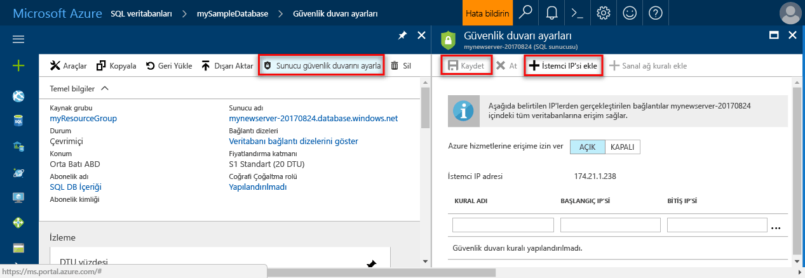

# <a name="design-your-first-azure-sql-database"></a><span data-ttu-id="a10b3-103">İlk Azure SQL veritabanınızı tasarlama</span><span class="sxs-lookup"><span data-stu-id="a10b3-103">Design your first Azure SQL database</span></span>

<span data-ttu-id="a10b3-104">Azure SQL veritabanı bir ilişkisel veritabanı-olarak-a (DBaaS) ("Azure") Microsoft Cloud hizmetidir.</span><span class="sxs-lookup"><span data-stu-id="a10b3-104">Azure SQL Database is a relational database-as-a service (DBaaS) in the Microsoft Cloud ("Azure").</span></span> <span data-ttu-id="a10b3-105">Bu öğreticide, Azure portalını kullanmayı öğrenin ve [SQL Server Management Studio](https://msdn.microsoft.com/library/ms174173.aspx) (SSMS) için:</span><span class="sxs-lookup"><span data-stu-id="a10b3-105">In this tutorial, you learn how to use the Azure portal and [SQL Server Management Studio](https://msdn.microsoft.com/library/ms174173.aspx) (SSMS) to:</span></span> 

> [!div class="checklist"]
> * <span data-ttu-id="a10b3-106">Azure portalında bir veritabanı oluşturun</span><span class="sxs-lookup"><span data-stu-id="a10b3-106">Create a database in the Azure portal</span></span>
> * <span data-ttu-id="a10b3-107">Azure portalında bir sunucu düzeyinde güvenlik duvarı kuralı ayarlayın</span><span class="sxs-lookup"><span data-stu-id="a10b3-107">Set up a server-level firewall rule in the Azure portal</span></span>
> * <span data-ttu-id="a10b3-108">Veritabanı SSMS ile bağlanma</span><span class="sxs-lookup"><span data-stu-id="a10b3-108">Connect to the database with SSMS</span></span>
> * <span data-ttu-id="a10b3-109">SSMS ile tabloları oluşturma</span><span class="sxs-lookup"><span data-stu-id="a10b3-109">Create tables with SSMS</span></span>
> * <span data-ttu-id="a10b3-110">Yığın BCP ile veri yükleme</span><span class="sxs-lookup"><span data-stu-id="a10b3-110">Bulk load data with BCP</span></span>
> * <span data-ttu-id="a10b3-111">SSMS ile bu verileri Sorgulama</span><span class="sxs-lookup"><span data-stu-id="a10b3-111">Query that data with SSMS</span></span>
> * <span data-ttu-id="a10b3-112">Veritabanını önceki bir geri [geri yükleme noktası](sql-database-recovery-using-backups.md#point-in-time-restore) Azure portalında</span><span class="sxs-lookup"><span data-stu-id="a10b3-112">Restore the database to a previous [point in time restore](sql-database-recovery-using-backups.md#point-in-time-restore) in the Azure portal</span></span>

<span data-ttu-id="a10b3-113">Bir Azure aboneliğiniz yoksa [ücretsiz bir hesap oluşturma](https://azure.microsoft.com/free/) başlamadan önce.</span><span class="sxs-lookup"><span data-stu-id="a10b3-113">If you don't have an Azure subscription, [create a free account](https://azure.microsoft.com/free/) before you begin.</span></span>

## <a name="prerequisites"></a><span data-ttu-id="a10b3-114">Ön koşullar</span><span class="sxs-lookup"><span data-stu-id="a10b3-114">Prerequisites</span></span>

<span data-ttu-id="a10b3-115">Bu öğreticiyi tamamlamak için yüklediğinizden emin olun:</span><span class="sxs-lookup"><span data-stu-id="a10b3-115">To complete this tutorial, make sure you have installed:</span></span>
- <span data-ttu-id="a10b3-116">En yeni sürümünü [SQL Server Management Studio](https://msdn.microsoft.com/library/ms174173.aspx) (SSMS).</span><span class="sxs-lookup"><span data-stu-id="a10b3-116">The newest version of [SQL Server Management Studio](https://msdn.microsoft.com/library/ms174173.aspx) (SSMS).</span></span>
- <span data-ttu-id="a10b3-117">En yeni sürümünü [BCP ve SQLCMD](https://www.microsoft.com/download/details.aspx?id=36433).</span><span class="sxs-lookup"><span data-stu-id="a10b3-117">The newest version of [BCP and SQLCMD](https://www.microsoft.com/download/details.aspx?id=36433).</span></span>

## <a name="log-in-to-the-azure-portal"></a><span data-ttu-id="a10b3-118">Azure portalında oturum açma</span><span class="sxs-lookup"><span data-stu-id="a10b3-118">Log in to the Azure portal</span></span>

<span data-ttu-id="a10b3-119">[Azure Portal](https://portal.azure.com/)’da oturum açın.</span><span class="sxs-lookup"><span data-stu-id="a10b3-119">Log in to the [Azure portal](https://portal.azure.com/).</span></span>

## <a name="create-a-blank-sql-database"></a><span data-ttu-id="a10b3-120">Boş bir SQL veritabanı oluşturma</span><span class="sxs-lookup"><span data-stu-id="a10b3-120">Create a blank SQL database</span></span>

<span data-ttu-id="a10b3-121">Azure SQL veritabanı bir dizi [işlem ve depolama kaynağı](sql-database-service-tiers.md) ile oluşturulur.</span><span class="sxs-lookup"><span data-stu-id="a10b3-121">An Azure SQL database is created with a defined set of [compute and storage resources](sql-database-service-tiers.md).</span></span> <span data-ttu-id="a10b3-122">Veritabanı bir [Azure kaynak grubu](../azure-resource-manager/resource-group-overview.md) ve bir [Azure SQL Veritabanı mantıksal sunucusu](sql-database-features.md) içinde oluşturulur.</span><span class="sxs-lookup"><span data-stu-id="a10b3-122">The database is created within an [Azure resource group](../azure-resource-manager/resource-group-overview.md) and in an [Azure SQL Database logical server](sql-database-features.md).</span></span> 

<span data-ttu-id="a10b3-123">Boş bir SQL veritabanı oluşturmak için aşağıdaki adımları izleyin.</span><span class="sxs-lookup"><span data-stu-id="a10b3-123">Follow these steps to create a blank SQL database.</span></span> 

1. <span data-ttu-id="a10b3-124">Azure portalının sol üst köşesinde bulunan **Yeni** düğmesine tıklayın.</span><span class="sxs-lookup"><span data-stu-id="a10b3-124">Click the **New** button found on the upper left-hand corner of the Azure portal.</span></span>

2. <span data-ttu-id="a10b3-125">**Yeni** penceresinden **Veritabanları**’nı seçin ve **Veritabanları** penceresinden **SQL Veritabanı**’nı seçin.</span><span class="sxs-lookup"><span data-stu-id="a10b3-125">Select **Databases** from the **New** page, and select **SQL Database** from the **Databases** page.</span></span> 

   

3. <span data-ttu-id="a10b3-127">SQL Veritabanı formunu, önceki görüntüde gösterildiği gibi aşağıdaki bilgilerle doldurun:</span><span class="sxs-lookup"><span data-stu-id="a10b3-127">Fill out the SQL Database form with the following information, as shown on the preceding image:</span></span>   

   | <span data-ttu-id="a10b3-128">Ayar</span><span class="sxs-lookup"><span data-stu-id="a10b3-128">Setting</span></span>       | <span data-ttu-id="a10b3-129">Önerilen değer</span><span class="sxs-lookup"><span data-stu-id="a10b3-129">Suggested value</span></span> | <span data-ttu-id="a10b3-130">Açıklama</span><span class="sxs-lookup"><span data-stu-id="a10b3-130">Description</span></span> | 
   | ------------ | ------------------ | ------------------------------------------------- | 
   | <span data-ttu-id="a10b3-131">**Veritabanı adı**</span><span class="sxs-lookup"><span data-stu-id="a10b3-131">**Database name**</span></span> | <span data-ttu-id="a10b3-132">mySampleDatabase</span><span class="sxs-lookup"><span data-stu-id="a10b3-132">mySampleDatabase</span></span> | <span data-ttu-id="a10b3-133">Geçerli veritabanı adları için bkz. [Veritabanı Tanımlayıcıları](https://docs.microsoft.com/sql/relational-databases/databases/database-identifiers).</span><span class="sxs-lookup"><span data-stu-id="a10b3-133">For valid database names, see [Database Identifiers](https://docs.microsoft.com/sql/relational-databases/databases/database-identifiers).</span></span> | 
   | <span data-ttu-id="a10b3-134">**Abonelik**</span><span class="sxs-lookup"><span data-stu-id="a10b3-134">**Subscription**</span></span> | <span data-ttu-id="a10b3-135">Aboneliğiniz</span><span class="sxs-lookup"><span data-stu-id="a10b3-135">Your subscription</span></span>  | <span data-ttu-id="a10b3-136">Abonelikleriniz hakkında daha ayrıntılı bilgi için bkz. [Abonelikler](https://account.windowsazure.com/Subscriptions).</span><span class="sxs-lookup"><span data-stu-id="a10b3-136">For details about your subscriptions, see [Subscriptions](https://account.windowsazure.com/Subscriptions).</span></span> |
   | <span data-ttu-id="a10b3-137">**Kaynak grubu**</span><span class="sxs-lookup"><span data-stu-id="a10b3-137">**Resource group**</span></span> | <span data-ttu-id="a10b3-138">myResourceGroup</span><span class="sxs-lookup"><span data-stu-id="a10b3-138">myResourceGroup</span></span> | <span data-ttu-id="a10b3-139">Geçerli kaynak grubu adları için bkz. [Adlandırma kuralları ve kısıtlamalar](https://docs.microsoft.com/azure/architecture/best-practices/naming-conventions).</span><span class="sxs-lookup"><span data-stu-id="a10b3-139">For valid resource group names, see [Naming rules and restrictions](https://docs.microsoft.com/azure/architecture/best-practices/naming-conventions).</span></span> |
   | <span data-ttu-id="a10b3-140">**Kaynak seçin**</span><span class="sxs-lookup"><span data-stu-id="a10b3-140">**Select source**</span></span> | <span data-ttu-id="a10b3-141">Boş veritabanı</span><span class="sxs-lookup"><span data-stu-id="a10b3-141">Blank database</span></span> | <span data-ttu-id="a10b3-142">Boş bir veritabanı oluşturulması gerektiğini belirtir.</span><span class="sxs-lookup"><span data-stu-id="a10b3-142">Specifies that a blank database should be created.</span></span> |

4. <span data-ttu-id="a10b3-143">Yeni veritabanınız için yeni bir sunucu oluşturup yapılandırmak üzere **Sunucu**’ya tıklayın.</span><span class="sxs-lookup"><span data-stu-id="a10b3-143">Click **Server** to create and configure a new server for your new database.</span></span> <span data-ttu-id="a10b3-144">Doldurmak **yeni sunucu form** aşağıdaki bilgilerle:</span><span class="sxs-lookup"><span data-stu-id="a10b3-144">Fill out the **New server form** with the following information:</span></span> 

   | <span data-ttu-id="a10b3-145">Ayar</span><span class="sxs-lookup"><span data-stu-id="a10b3-145">Setting</span></span>       | <span data-ttu-id="a10b3-146">Önerilen değer</span><span class="sxs-lookup"><span data-stu-id="a10b3-146">Suggested value</span></span> | <span data-ttu-id="a10b3-147">Açıklama</span><span class="sxs-lookup"><span data-stu-id="a10b3-147">Description</span></span> | 
   | ------------ | ------------------ | ------------------------------------------------- | 
   | <span data-ttu-id="a10b3-148">**Sunucu adı**</span><span class="sxs-lookup"><span data-stu-id="a10b3-148">**Server name**</span></span> | <span data-ttu-id="a10b3-149">Genel olarak benzersiz bir ad</span><span class="sxs-lookup"><span data-stu-id="a10b3-149">Any globally unique name</span></span> | <span data-ttu-id="a10b3-150">Geçerli sunucu adları için bkz. [Adlandırma kuralları ve kısıtlamalar](https://docs.microsoft.com/azure/architecture/best-practices/naming-conventions).</span><span class="sxs-lookup"><span data-stu-id="a10b3-150">For valid server names, see [Naming rules and restrictions](https://docs.microsoft.com/azure/architecture/best-practices/naming-conventions).</span></span> | 
   | <span data-ttu-id="a10b3-151">**Sunucu yöneticisi oturum açma bilgileri**</span><span class="sxs-lookup"><span data-stu-id="a10b3-151">**Server admin login**</span></span> | <span data-ttu-id="a10b3-152">Geçerli bir ad</span><span class="sxs-lookup"><span data-stu-id="a10b3-152">Any valid name</span></span> | <span data-ttu-id="a10b3-153">Geçerli oturum açma adları için bkz. [Veritabanı Tanımlayıcıları](https://docs.microsoft.com/sql/relational-databases/databases/database-identifiers).</span><span class="sxs-lookup"><span data-stu-id="a10b3-153">For valid login names, see [Database Identifiers](https://docs.microsoft.com/sql/relational-databases/databases/database-identifiers).</span></span>|
   | <span data-ttu-id="a10b3-154">**Parola**</span><span class="sxs-lookup"><span data-stu-id="a10b3-154">**Password**</span></span> | <span data-ttu-id="a10b3-155">Geçerli bir parola</span><span class="sxs-lookup"><span data-stu-id="a10b3-155">Any valid password</span></span> | <span data-ttu-id="a10b3-156">Parolanız en az 8 karakter olmalı ve aşağıdaki kategoriden üçünden karakterler içermelidir: büyük harf karakterler, küçük harfler, sayılar ve alfasayısal olmayan karakter.</span><span class="sxs-lookup"><span data-stu-id="a10b3-156">Your password must have at least 8 characters and must contain characters from three of the following categories: upper case characters, lower case characters, numbers, and non-alphanumeric characters.</span></span> |
   | <span data-ttu-id="a10b3-157">**Konum**</span><span class="sxs-lookup"><span data-stu-id="a10b3-157">**Location**</span></span> | <span data-ttu-id="a10b3-158">Geçerli bir konum</span><span class="sxs-lookup"><span data-stu-id="a10b3-158">Any valid location</span></span> | <span data-ttu-id="a10b3-159">Bölgeler hakkında bilgi için bkz. [Azure Bölgeleri](https://azure.microsoft.com/regions/).</span><span class="sxs-lookup"><span data-stu-id="a10b3-159">For information about regions, see [Azure Regions](https://azure.microsoft.com/regions/).</span></span> |

   

5. <span data-ttu-id="a10b3-161">**Seç**'e tıklayın.</span><span class="sxs-lookup"><span data-stu-id="a10b3-161">Click **Select**.</span></span>

6. <span data-ttu-id="a10b3-162">Yeni veritabanınıza ait hizmet katmanını ve performans düzeyini belirtmek için **Fiyatlandırma katmanı**’na tıklayın.</span><span class="sxs-lookup"><span data-stu-id="a10b3-162">Click **Pricing tier** to specify the service tier and performance level for your new database.</span></span> <span data-ttu-id="a10b3-163">Bu öğretici için seçin **20 Dtu'lar** ve **250** GB depolama alanı.</span><span class="sxs-lookup"><span data-stu-id="a10b3-163">For this tutorial, select **20 DTUs** and **250** GB of storage.</span></span>

   

7. <span data-ttu-id="a10b3-165">**Uygula**'ya tıklayın.</span><span class="sxs-lookup"><span data-stu-id="a10b3-165">Click **Apply**.</span></span>  

8. <span data-ttu-id="a10b3-166">Seçin bir **harmanlama** boş veritabanı için (Bu öğretici için varsayılan değeri kullanın).</span><span class="sxs-lookup"><span data-stu-id="a10b3-166">Select a **collation** for the blank database (for this tutorial, use the default value).</span></span> <span data-ttu-id="a10b3-167">Harmanlamaları hakkında daha fazla bilgi için bkz: [harmanlamaları](https://docs.microsoft.com/sql/t-sql/statements/collations)</span><span class="sxs-lookup"><span data-stu-id="a10b3-167">For more information about collations, see [Collations](https://docs.microsoft.com/sql/t-sql/statements/collations)</span></span>

9. <span data-ttu-id="a10b3-168">Veritabanını sağlamak için **Oluştur**’a tıklayın.</span><span class="sxs-lookup"><span data-stu-id="a10b3-168">Click **Create** to provision the database.</span></span> <span data-ttu-id="a10b3-169">Bir dakika ve bir tamamlamak için altı hakkında alır sağlama.</span><span class="sxs-lookup"><span data-stu-id="a10b3-169">Provisioning takes about a minute and a half to complete.</span></span> 

10. <span data-ttu-id="a10b3-170">Araç çubuğunda **Bildirimler**’e tıklayarak dağıtım işlemini izleyin.</span><span class="sxs-lookup"><span data-stu-id="a10b3-170">On the toolbar, click **Notifications** to monitor the deployment process.</span></span>

   

## <a name="create-a-server-level-firewall-rule"></a><span data-ttu-id="a10b3-172">Sunucu düzeyinde bir güvenlik duvarı kuralı oluşturma</span><span class="sxs-lookup"><span data-stu-id="a10b3-172">Create a server-level firewall rule</span></span>

<span data-ttu-id="a10b3-173">SQL Veritabanı hizmeti, güvenlik duvarını belirli IP adreslerine açmaya yönelik bir güvenlik duvarı kuralı oluşturulmadıkça, dış uygulama ve araçların sunucuya ya da sunucu üzerindeki herhangi bir veritabanına bağlanmasını engelleyen sunucu düzeyinde bir güvenlik duvarı kuralı oluşturur.</span><span class="sxs-lookup"><span data-stu-id="a10b3-173">The SQL Database service creates a firewall at the server-level that prevents external applications and tools from connecting to the server or any databases on the server unless a firewall rule is created to open the firewall for specific IP addresses.</span></span> <span data-ttu-id="a10b3-174">SQL Veritabanı güvenlik duvarı üzerinden yalnızca IP adresinize yönelik dış bağlantıları etkinleştirmek üzere istemcinizin IP adresi için bir [SQL Veritabanı sunucu düzeyi güvenlik duvarı kuralı](sql-database-firewall-configure.md) oluşturmak için bu adımları izleyin.</span><span class="sxs-lookup"><span data-stu-id="a10b3-174">Follow these steps to create a [SQL Database server-level firewall rule](sql-database-firewall-configure.md) for your client's IP address and enable external connectivity through the SQL Database firewall for your IP address only.</span></span> 

> [!NOTE]
> <span data-ttu-id="a10b3-175">SQL Veritabanı 1433 numaralı bağlantı noktası üzerinden iletişim kurar.</span><span class="sxs-lookup"><span data-stu-id="a10b3-175">SQL Database communicates over port 1433.</span></span> <span data-ttu-id="a10b3-176">Bir kurumsal ağ içerisinden bağlanmaya çalışıyorsanız, ağınızın güvenlik duvarı tarafından 1433 numaralı bağlantı noktası üzerinden giden trafiğe izin verilmiyor olabilir.</span><span class="sxs-lookup"><span data-stu-id="a10b3-176">If you are trying to connect from within a corporate network, outbound traffic over port 1433 may not be allowed by your network's firewall.</span></span> <span data-ttu-id="a10b3-177">Bu durumda BT departmanınız 1433 numaralı bağlantı noktasını açmadığı sürece Azure SQL Veritabanı sunucunuza bağlanamazsınız.</span><span class="sxs-lookup"><span data-stu-id="a10b3-177">If so, you cannot connect to your Azure SQL Database server unless your IT department opens port 1433.</span></span>
>

1. <span data-ttu-id="a10b3-178">Dağıtım tamamlandıktan sonra, soldaki menüden **SQL veritabanları**'na ve ardından **SQL veritabanları** sayfasında **mySampleDatabase** öğesine tıklayın.</span><span class="sxs-lookup"><span data-stu-id="a10b3-178">After the deployment completes, click **SQL databases** from the left-hand menu and then click **mySampleDatabase** on the **SQL databases** page.</span></span> <span data-ttu-id="a10b3-179">Veritabanınıza ilişkin genel bakış sayfası açılır ve tam sunucu adı (örneğin, **mynewserver20170313.database.windows.net**) görüntülenerek daha fazla yapılandırma seçeneği sunulur.</span><span class="sxs-lookup"><span data-stu-id="a10b3-179">The overview page for your database opens, showing you the fully qualified server name (such as **mynewserver20170313.database.windows.net**) and provides options for further configuration.</span></span> <span data-ttu-id="a10b3-180">Daha sonra kullanmak üzere bu tam sunucu adını kopyalayın.</span><span class="sxs-lookup"><span data-stu-id="a10b3-180">Copy this fully qualified server name for use later.</span></span>

   > [!IMPORTANT]
   > <span data-ttu-id="a10b3-181">Sonraki hızlı başlangıçlarda sunucunuza ve veritabanlarına bağlanmak için bu tam sunucu adı gerekir.</span><span class="sxs-lookup"><span data-stu-id="a10b3-181">You need this fully qualified server name to connect to your server and its databases in subsequent quick starts.</span></span>
   > 

    

2. <span data-ttu-id="a10b3-183">Önceki görüntüde gösterildiği gibi araç çubuğundaki **sunucu güvenlik duvarı ayarla** öğesine tıklayın.</span><span class="sxs-lookup"><span data-stu-id="a10b3-183">Click **Set server firewall** on the toolbar as shown in the previous image.</span></span> <span data-ttu-id="a10b3-184">SQL Veritabanı sunucusu için **Güvenlik duvarı ayarları** sayfası açılır.</span><span class="sxs-lookup"><span data-stu-id="a10b3-184">The **Firewall settings** page for the SQL Database server opens.</span></span> 

    


3. <span data-ttu-id="a10b3-186">Geçerli IP adresinizi yeni bir güvenlik duvarı kuralına eklemek için araç çubuğunda **İstemci IP’si Ekle** öğesine tıklayın.</span><span class="sxs-lookup"><span data-stu-id="a10b3-186">Click **Add client IP** on the toolbar to add your current IP address to a new firewall rule.</span></span> <span data-ttu-id="a10b3-187">Güvenlik duvarı kuralı, 1433 numaralı bağlantı noktasını tek bir IP adresi veya bir IP adresi aralığı için açabilir.</span><span class="sxs-lookup"><span data-stu-id="a10b3-187">A firewall rule can open port 1433 for a single IP address or a range of IP addresses.</span></span>

4. <span data-ttu-id="a10b3-188">**Kaydet** düğmesine tıklayın.</span><span class="sxs-lookup"><span data-stu-id="a10b3-188">Click **Save**.</span></span> <span data-ttu-id="a10b3-189">Geçerli IP adresiniz için mantıksal sunucuda 1433 numaralı bağlantı noktası açılarak sunucu düzeyinde güvenlik duvarı kuralı oluşturulur.</span><span class="sxs-lookup"><span data-stu-id="a10b3-189">A server-level firewall rule is created for your current IP address opening port 1433 on the logical server.</span></span>

    

4. <span data-ttu-id="a10b3-191">**Tamam**’a tıklayın ve sonra **Güvenlik duvarı ayarları** sayfasını kapatın.</span><span class="sxs-lookup"><span data-stu-id="a10b3-191">Click **OK** and then close the **Firewall settings** page.</span></span>

<span data-ttu-id="a10b3-192">Artık SQL Server Management Studio’yu veya seçtiğiniz başka bir aracı kullanarak, daha önce oluşturduğunuz sunucu yöneticisi hesabıyla bu IP adresinden SQL Veritabanı sunucusuna ve sunucuya ait veritabanlarına bağlanabilirsiniz.</span><span class="sxs-lookup"><span data-stu-id="a10b3-192">You can now connect to the SQL Database server and its databases using SQL Server Management Studio or another tool of your choice from this IP address using the server admin account created previously.</span></span>

> [!IMPORTANT]
> <span data-ttu-id="a10b3-193">Varsayılan olarak, SQL Veritabanı güvenlik duvarı üzerinden erişim tüm Azure hizmetleri için etkindir.</span><span class="sxs-lookup"><span data-stu-id="a10b3-193">By default, access through the SQL Database firewall is enabled for all Azure services.</span></span> <span data-ttu-id="a10b3-194">Tüm Azure hizmetleri için devre dışı bırakmak isterseniz bu sayfadaki **KAPALI** öğesine tıklayın.</span><span class="sxs-lookup"><span data-stu-id="a10b3-194">Click **OFF** on this page to disable for all Azure services.</span></span>

## <a name="sql-server-connection-information"></a><span data-ttu-id="a10b3-195">SQL Server bağlantı bilgileri</span><span class="sxs-lookup"><span data-stu-id="a10b3-195">SQL server connection information</span></span>

<span data-ttu-id="a10b3-196">Azure SQL Veritabanı sunucunuzun tam sunucu adını Azure portaldan alabilirsiniz.</span><span class="sxs-lookup"><span data-stu-id="a10b3-196">Get the fully qualified server name for your Azure SQL Database server in the Azure portal.</span></span> <span data-ttu-id="a10b3-197">SQL Server Management Studio kullanarak sunucunuza bağlanmak için tam sunucu adını kullanırsınız.</span><span class="sxs-lookup"><span data-stu-id="a10b3-197">You use the fully qualified server name to connect to your server using SQL Server Management Studio.</span></span>

1. <span data-ttu-id="a10b3-198">[Azure Portal](https://portal.azure.com/)’da oturum açın.</span><span class="sxs-lookup"><span data-stu-id="a10b3-198">Log in to the [Azure portal](https://portal.azure.com/).</span></span>
2. <span data-ttu-id="a10b3-199">Soldaki menüden **SQL Veritabanları**’nı seçin ve **SQL veritabanları** sayfasında veritabanınıza tıklayın.</span><span class="sxs-lookup"><span data-stu-id="a10b3-199">Select **SQL Databases** from the left-hand menu, and click your database on the **SQL databases** page.</span></span> 
3. <span data-ttu-id="a10b3-200">Veritabanınızın Azure portal sayfasındaki **Temel Bilgiler** bölmesinde, **Sunucu adını** bulup kopyalayın.</span><span class="sxs-lookup"><span data-stu-id="a10b3-200">In the **Essentials** pane in the Azure portal page for your database, locate and then copy the **Server name**.</span></span>

   

## <a name="connect-to-the-database-with-ssms"></a><span data-ttu-id="a10b3-202">Veritabanı SSMS ile bağlanma</span><span class="sxs-lookup"><span data-stu-id="a10b3-202">Connect to the database with SSMS</span></span>

<span data-ttu-id="a10b3-203">Kullanım [SQL Server Management Studio](https://docs.microsoft.com/sql/ssms/sql-server-management-studio-ssms) Azure SQL Database sunucunuza bağlantı kuramıyor.</span><span class="sxs-lookup"><span data-stu-id="a10b3-203">Use [SQL Server Management Studio](https://docs.microsoft.com/sql/ssms/sql-server-management-studio-ssms) to establish a connection to your Azure SQL Database server.</span></span>

1. <span data-ttu-id="a10b3-204">SQL Server Management Studio’yu açın.</span><span class="sxs-lookup"><span data-stu-id="a10b3-204">Open SQL Server Management Studio.</span></span>

2. <span data-ttu-id="a10b3-205">**Sunucuya Bağlan** iletişim kutusuna şu bilgileri girin:</span><span class="sxs-lookup"><span data-stu-id="a10b3-205">In the **Connect to Server** dialog box, enter the following information:</span></span>

   | <span data-ttu-id="a10b3-206">Ayar</span><span class="sxs-lookup"><span data-stu-id="a10b3-206">Setting</span></span>       | <span data-ttu-id="a10b3-207">Önerilen değer</span><span class="sxs-lookup"><span data-stu-id="a10b3-207">Suggested value</span></span> | <span data-ttu-id="a10b3-208">Açıklama</span><span class="sxs-lookup"><span data-stu-id="a10b3-208">Description</span></span> | 
   | ------------ | ------------------ | ------------------------------------------------- | 
   | <span data-ttu-id="a10b3-209">Sunucu türü</span><span class="sxs-lookup"><span data-stu-id="a10b3-209">Server type</span></span> | <span data-ttu-id="a10b3-210">Veritabanı altyapısı</span><span class="sxs-lookup"><span data-stu-id="a10b3-210">Database engine</span></span> | <span data-ttu-id="a10b3-211">Bu değer gereklidir</span><span class="sxs-lookup"><span data-stu-id="a10b3-211">This value is required</span></span> |
   | <span data-ttu-id="a10b3-212">Sunucu adı</span><span class="sxs-lookup"><span data-stu-id="a10b3-212">Server name</span></span> | <span data-ttu-id="a10b3-213">Tam sunucu adı</span><span class="sxs-lookup"><span data-stu-id="a10b3-213">The fully qualified server name</span></span> | <span data-ttu-id="a10b3-214">Ad şunun gibi olmalıdır: **mynewserver20170313.database.windows.net**.</span><span class="sxs-lookup"><span data-stu-id="a10b3-214">The name should be something like this: **mynewserver20170313.database.windows.net**.</span></span> |
   | <span data-ttu-id="a10b3-215">Kimlik Doğrulaması</span><span class="sxs-lookup"><span data-stu-id="a10b3-215">Authentication</span></span> | <span data-ttu-id="a10b3-216">SQL Server Kimlik Doğrulaması</span><span class="sxs-lookup"><span data-stu-id="a10b3-216">SQL Server Authentication</span></span> | <span data-ttu-id="a10b3-217">Bu öğreticide yapılandırdığımız tek kimlik doğrulaması türü SQL Kimlik Doğrulamasıdır.</span><span class="sxs-lookup"><span data-stu-id="a10b3-217">SQL Authentication is the only authentication type that we have configured in this tutorial.</span></span> |
   | <span data-ttu-id="a10b3-218">Oturum Aç</span><span class="sxs-lookup"><span data-stu-id="a10b3-218">Login</span></span> | <span data-ttu-id="a10b3-219">Sunucu yöneticisi hesabı</span><span class="sxs-lookup"><span data-stu-id="a10b3-219">The server admin account</span></span> | <span data-ttu-id="a10b3-220">Bu, sunucuyu oluştururken belirttiğiniz hesaptır.</span><span class="sxs-lookup"><span data-stu-id="a10b3-220">This is the account that you specified when you created the server.</span></span> |
   | <span data-ttu-id="a10b3-221">Parola</span><span class="sxs-lookup"><span data-stu-id="a10b3-221">Password</span></span> | <span data-ttu-id="a10b3-222">Sunucu yöneticisi hesabınızın parolası</span><span class="sxs-lookup"><span data-stu-id="a10b3-222">The password for your server admin account</span></span> | <span data-ttu-id="a10b3-223">Bu, sunucuyu oluştururken belirttiğiniz paroladır.</span><span class="sxs-lookup"><span data-stu-id="a10b3-223">This is the password that you specified when you created the server.</span></span> |

   

3. <span data-ttu-id="a10b3-225">**Sunucuya bağlan** iletişim kutusunda **Seçenekler**’e tıklayın.</span><span class="sxs-lookup"><span data-stu-id="a10b3-225">Click **Options** in the **Connect to server** dialog box.</span></span> <span data-ttu-id="a10b3-226">**Veritabanına bağlan** bölümünde bu veritabanına bağlanmak için **mySampleDatabase** yazın.</span><span class="sxs-lookup"><span data-stu-id="a10b3-226">In the **Connect to database** section, enter **mySampleDatabase** to connect to this database.</span></span>

     

4. <span data-ttu-id="a10b3-228">**Bağlan**'a tıklayın.</span><span class="sxs-lookup"><span data-stu-id="a10b3-228">Click **Connect**.</span></span> <span data-ttu-id="a10b3-229">SSMS’te Nesne Gezgini penceresi açılır.</span><span class="sxs-lookup"><span data-stu-id="a10b3-229">The Object Explorer window opens in SSMS.</span></span> 

5. <span data-ttu-id="a10b3-230">Nesne Gezgini’nde **Veritabanları**’nı ve ardından **mySampleDatabase** öğesini genişleterek nesneleri örnek veritabanında görüntüleyin.</span><span class="sxs-lookup"><span data-stu-id="a10b3-230">In Object Explorer, expand **Databases** and then expand **mySampleDatabase** to view the objects in the sample database.</span></span>

     

## <a name="create-tables-in-the-database"></a><span data-ttu-id="a10b3-232">Veritabanında tabloları oluşturma</span><span class="sxs-lookup"><span data-stu-id="a10b3-232">Create tables in the database</span></span> 

<span data-ttu-id="a10b3-233">Bir öğrenci yönetimi sistemi kullanarak üniversiteler için model dört tablolar ile bir veritabanı şeması oluşturma [Transact-SQL](https://docs.microsoft.com/sql/t-sql/language-reference):</span><span class="sxs-lookup"><span data-stu-id="a10b3-233">Create a database schema with four tables that model a student management system for universities using [Transact-SQL](https://docs.microsoft.com/sql/t-sql/language-reference):</span></span>

- <span data-ttu-id="a10b3-234">Kişi</span><span class="sxs-lookup"><span data-stu-id="a10b3-234">Person</span></span>
- <span data-ttu-id="a10b3-235">İndirmelere</span><span class="sxs-lookup"><span data-stu-id="a10b3-235">Course</span></span>
- <span data-ttu-id="a10b3-236">Öğrenci</span><span class="sxs-lookup"><span data-stu-id="a10b3-236">Student</span></span>
- <span data-ttu-id="a10b3-237">Bu model bir öğrenci yönetim sistemi üniversiteler için kredi</span><span class="sxs-lookup"><span data-stu-id="a10b3-237">Credit that model a student management system for universities</span></span>

<span data-ttu-id="a10b3-238">Aşağıdaki diyagramda bu tablolar birbirleriyle nasıl ilişkili olduğunu gösterir.</span><span class="sxs-lookup"><span data-stu-id="a10b3-238">The following diagram shows how these tables are related to each other.</span></span> <span data-ttu-id="a10b3-239">Bu tablolar bazıları diğer tablolardaki sütunlara başvuru.</span><span class="sxs-lookup"><span data-stu-id="a10b3-239">Some of these tables reference columns in other tables.</span></span> <span data-ttu-id="a10b3-240">Örneğin, Öğrenci tabloya başvuruyorsa **PersonId** sütunu **kişi** tablo.</span><span class="sxs-lookup"><span data-stu-id="a10b3-240">For example, the Student table references the **PersonId** column of the **Person** table.</span></span> <span data-ttu-id="a10b3-241">Bu öğretici tablolarda birbirleriyle nasıl ilişkili olduğunu anlamak için diyagram üzerinde çalışın.</span><span class="sxs-lookup"><span data-stu-id="a10b3-241">Study the diagram to understand how the tables in this tutorial are related to one another.</span></span> <span data-ttu-id="a10b3-242">Etkin veritabanı tabloları oluşturma ilişkin ayrıntılı bir bakış için bkz: [etkili veritabanı tabloları oluşturma](https://msdn.microsoft.com/library/cc505842.aspx).</span><span class="sxs-lookup"><span data-stu-id="a10b3-242">For an in-depth look at how to create effective database tables, see [Create effective database tables](https://msdn.microsoft.com/library/cc505842.aspx).</span></span> <span data-ttu-id="a10b3-243">Veri türleri seçme hakkında daha fazla bilgi için bkz: [veri türleri](https://docs.microsoft.com/sql/t-sql/data-types/data-types-transact-sql).</span><span class="sxs-lookup"><span data-stu-id="a10b3-243">For information about choosing data types, see [Data types](https://docs.microsoft.com/sql/t-sql/data-types/data-types-transact-sql).</span></span>

> [!NOTE]
> <span data-ttu-id="a10b3-244">De kullanabilirsiniz [Tablo Tasarımcısı'nda SQL Server Management Studio](https://msdn.microsoft.com/library/hh272695.aspx) oluşturma ve tabloları tasarlayın.</span><span class="sxs-lookup"><span data-stu-id="a10b3-244">You can also use the [table designer in SQL Server Management Studio](https://msdn.microsoft.com/library/hh272695.aspx) to create and design your tables.</span></span> 


1. <span data-ttu-id="a10b3-246">Nesne Gezgini’nde **mySampleDatabase** öğesine sağ tıklayıp **Yeni Sorgu**’ya tıklayın.</span><span class="sxs-lookup"><span data-stu-id="a10b3-246">In Object Explorer, right-click **mySampleDatabase** and click **New Query**.</span></span> <span data-ttu-id="a10b3-247">Veritabanınıza bağlı boş bir sorgu penceresi açılır.</span><span class="sxs-lookup"><span data-stu-id="a10b3-247">A blank query window opens that is connected to your database.</span></span>

2. <span data-ttu-id="a10b3-248">Sorgu penceresinde, dört tablonun veritabanınızda oluşturmak için aşağıdaki sorguyu çalıştırın:</span><span class="sxs-lookup"><span data-stu-id="a10b3-248">In the query window, execute the following query to create four tables in your database:</span></span> 

   ```sql 
   -- Create Person table

   CREATE TABLE Person
   (
   PersonId   INT IDENTITY PRIMARY KEY,
   FirstName   NVARCHAR(128) NOT NULL,
   MiddelInitial NVARCHAR(10),
   LastName   NVARCHAR(128) NOT NULL,
   DateOfBirth   DATE NOT NULL
   )
   
   -- Create Student table
 
   CREATE TABLE Student
   (
   StudentId INT IDENTITY PRIMARY KEY,
   PersonId  INT REFERENCES Person (PersonId),
   Email   NVARCHAR(256)
   )
   
   -- Create Course table
 
   CREATE TABLE Course
   (
   CourseId  INT IDENTITY PRIMARY KEY,
   Name   NVARCHAR(50) NOT NULL,
   Teacher   NVARCHAR(256) NOT NULL
   ) 

   -- Create Credit table
 
   CREATE TABLE Credit
   (
   StudentId   INT REFERENCES Student (StudentId),
   CourseId   INT REFERENCES Course (CourseId),
   Grade   DECIMAL(5,2) CHECK (Grade <= 100.00),
   Attempt   TINYINT,
   CONSTRAINT  [UQ_studentgrades] UNIQUE CLUSTERED
   (
   StudentId, CourseId, Grade, Attempt
   )
   )
   ```

   

3. <span data-ttu-id="a10b3-250">Oluşturduğunuz tabloları görmek için SQL Server Management Studio nesne Gezgini'nde 'tablolar' düğümünü genişletin.</span><span class="sxs-lookup"><span data-stu-id="a10b3-250">Expand the 'tables' node in the SQL Server Management Studio Object explorer to see the tables you created.</span></span>

   

## <a name="load-data-into-the-tables"></a><span data-ttu-id="a10b3-252">Veri tablolarına yükleme</span><span class="sxs-lookup"><span data-stu-id="a10b3-252">Load data into the tables</span></span>

1. <span data-ttu-id="a10b3-253">Adlı bir klasör oluşturun **SampleTableData** yüklemeleri klasörünüzdeki veritabanınız için örnek verileri saklamak için.</span><span class="sxs-lookup"><span data-stu-id="a10b3-253">Create a folder called **SampleTableData** in your Downloads folder to store sample data for your database.</span></span> 

2. <span data-ttu-id="a10b3-254">Aşağıdaki bağlantılar sağ tıklayın ve bunların içine Kaydet **SampleTableData** klasör.</span><span class="sxs-lookup"><span data-stu-id="a10b3-254">Right-click the following links and save them into the **SampleTableData** folder.</span></span> 

   - [<span data-ttu-id="a10b3-255">SampleCourseData</span><span class="sxs-lookup"><span data-stu-id="a10b3-255">SampleCourseData</span></span>](https://sqldbtutorial.blob.core.windows.net/tutorials/SampleCourseData)
   - [<span data-ttu-id="a10b3-256">SamplePersonData</span><span class="sxs-lookup"><span data-stu-id="a10b3-256">SamplePersonData</span></span>](https://sqldbtutorial.blob.core.windows.net/tutorials/SamplePersonData)
   - [<span data-ttu-id="a10b3-257">SampleStudentData</span><span class="sxs-lookup"><span data-stu-id="a10b3-257">SampleStudentData</span></span>](https://sqldbtutorial.blob.core.windows.net/tutorials/SampleStudentData)
   - [<span data-ttu-id="a10b3-258">SampleCreditData</span><span class="sxs-lookup"><span data-stu-id="a10b3-258">SampleCreditData</span></span>](https://sqldbtutorial.blob.core.windows.net/tutorials/SampleCreditData)

3. <span data-ttu-id="a10b3-259">Bir komut istemi penceresi açın ve SampleTableData klasöre gidin.</span><span class="sxs-lookup"><span data-stu-id="a10b3-259">Open a command prompt window and navigate to the SampleTableData folder.</span></span>

4. <span data-ttu-id="a10b3-260">Örnek veri değerlerini değiştirme tabloları eklemek için aşağıdaki komutları yürütün **ServerName**, **DatabaseName**, **kullanıcıadı**, ve  **Parola** ortamınız için değerlere sahip.</span><span class="sxs-lookup"><span data-stu-id="a10b3-260">Execute the following commands to insert sample data into the tables replacing the values for **ServerName**, **DatabaseName**, **UserName**, and **Password** with the values for your environment.</span></span>
  
   ```bcp
   bcp Course in SampleCourseData -S <ServerName>.database.windows.net -d <DatabaseName> -U <Username> -P <password> -q -c -t ","
   bcp Person in SamplePersonData -S <ServerName>.database.windows.net -d <DatabaseName> -U <Username> -P <password> -q -c -t ","
   bcp Student in SampleStudentData -S <ServerName>.database.windows.net -d <DatabaseName> -U <Username> -P <password> -q -c -t ","
   bcp Credit in SampleCreditData -S <ServerName>.database.windows.net -d <DatabaseName> -U <Username> -P <password> -q -c -t ","
   ```

<span data-ttu-id="a10b3-261">Ayrıca, daha önce oluşturduğunuz tablolara şimdi örnek veri yüklemiş olduğunuz.</span><span class="sxs-lookup"><span data-stu-id="a10b3-261">You have now loaded sample data into the tables you created earlier.</span></span>

## <a name="query-data"></a><span data-ttu-id="a10b3-262">Verileri sorgulama</span><span class="sxs-lookup"><span data-stu-id="a10b3-262">Query data</span></span>

<span data-ttu-id="a10b3-263">Veritabanı tablolarından bilgi almak için aşağıdaki sorguları yürütün.</span><span class="sxs-lookup"><span data-stu-id="a10b3-263">Execute the following queries to retrieve information from the database tables.</span></span> <span data-ttu-id="a10b3-264">Bkz: [SQL sorguları yazma](https://technet.microsoft.com/library/bb264565.aspx) SQL sorguları yazma hakkında daha fazla bilgi için.</span><span class="sxs-lookup"><span data-stu-id="a10b3-264">See [Writing SQL Queries](https://technet.microsoft.com/library/bb264565.aspx) to learn more about writing SQL queries.</span></span> <span data-ttu-id="a10b3-265">İlk sorguyu kendi sınıfında 75 %'den daha yüksek bir düzeyde olan ' tarafından Dominick Pope' öğrettin tüm Öğrenciler bulmak için dört tablonun tamamını birleştirir.</span><span class="sxs-lookup"><span data-stu-id="a10b3-265">The first query joins all four tables to find all the students taught by 'Dominick Pope' who have a grade higher than 75% in his class.</span></span> <span data-ttu-id="a10b3-266">İkinci sorguyu dört tablonun tamamını birleştirir ve 'Barış Coleman' herhangi bir zamanda kaydolduğu tüm kursları bulur.</span><span class="sxs-lookup"><span data-stu-id="a10b3-266">The second query joins all four tables and finds all courses in which 'Noe Coleman' has ever enrolled.</span></span>

1. <span data-ttu-id="a10b3-267">Bir SQL Server Management Studio sorgu penceresinde, aşağıdaki sorguyu çalıştırın:</span><span class="sxs-lookup"><span data-stu-id="a10b3-267">In a SQL Server Management Studio query window, execute the following query:</span></span>

   ```sql 
   -- Find the students taught by Dominick Pope who have a grade higher than 75%

   SELECT  person.FirstName,
   person.LastName,
   course.Name,
   credit.Grade
   FROM  Person AS person
   INNER JOIN Student AS student ON person.PersonId = student.PersonId
   INNER JOIN Credit AS credit ON student.StudentId = credit.StudentId
   INNER JOIN Course AS course ON credit.CourseId = course.courseId
   WHERE course.Teacher = 'Dominick Pope' 
   AND Grade > 75
   ```

2. <span data-ttu-id="a10b3-268">Bir SQL Server Management Studio sorgu penceresinde, sorguyu çalıştırın:</span><span class="sxs-lookup"><span data-stu-id="a10b3-268">In a SQL Server Management Studio query window, execute following query:</span></span>

   ```sql
   -- Find all the courses in which Noe Coleman has ever enrolled

   SELECT  course.Name,
   course.Teacher,
   credit.Grade
   FROM  Course AS course
   INNER JOIN Credit AS credit ON credit.CourseId = course.CourseId
   INNER JOIN Student AS student ON student.StudentId = credit.StudentId
   INNER JOIN Person AS person ON person.PersonId = student.PersonId
   WHERE person.FirstName = 'Noe'
   AND person.LastName = 'Coleman'
   ```

## <a name="restore-a-database-to-a-previous-point-in-time"></a><span data-ttu-id="a10b3-269">Bir veritabanını daha önceki bir noktaya geri yükleme</span><span class="sxs-lookup"><span data-stu-id="a10b3-269">Restore a database to a previous point in time</span></span>

<span data-ttu-id="a10b3-270">Yanlışlıkla bir tabloyu sildiniz düşünün.</span><span class="sxs-lookup"><span data-stu-id="a10b3-270">Imagine you have accidentally deleted a table.</span></span> <span data-ttu-id="a10b3-271">Bu, kolayca kurtaramazsınız şeydir.</span><span class="sxs-lookup"><span data-stu-id="a10b3-271">This is something you cannot easily recover from.</span></span> <span data-ttu-id="a10b3-272">Azure SQL veritabanı-35 gün son yukarı zamanda herhangi bir noktaya kadar geri dönün ve zaman yeni bir veritabanına geri yükleme bu noktası sağlar.</span><span class="sxs-lookup"><span data-stu-id="a10b3-272">Azure SQL Database allows you to go back to any point in time in the last up to 35 days and restore this point in time to a new database.</span></span> <span data-ttu-id="a10b3-273">Silinen verilerinizi kurtarmak için bu veritabanını kullanabilirsiniz.</span><span class="sxs-lookup"><span data-stu-id="a10b3-273">You can you this database to recover your deleted data.</span></span> <span data-ttu-id="a10b3-274">Tabloları eklenmeden önce aşağıdaki adımları örnek veritabanını bir noktaya geri yükleme.</span><span class="sxs-lookup"><span data-stu-id="a10b3-274">The following steps restore the sample database to a point before the tables were added.</span></span>

1. <span data-ttu-id="a10b3-275">Veritabanınız için SQL veritabanı sayfasında, tıklatın **geri** araç çubuğunda.</span><span class="sxs-lookup"><span data-stu-id="a10b3-275">On the SQL Database page for your database, click **Restore** on the toolbar.</span></span> <span data-ttu-id="a10b3-276">**Geri** sayfası açılır.</span><span class="sxs-lookup"><span data-stu-id="a10b3-276">The **Restore** page opens.</span></span>

   

2. <span data-ttu-id="a10b3-278">Doldurmak **geri** form gerekli bilgileri:</span><span class="sxs-lookup"><span data-stu-id="a10b3-278">Fill out the **Restore** form with the required information:</span></span>
    * <span data-ttu-id="a10b3-279">Veritabanı adı: Bir veritabanı adı sağlayın</span><span class="sxs-lookup"><span data-stu-id="a10b3-279">Database name: Provide a database name</span></span> 
    * <span data-ttu-id="a10b3-280">Noktası zamanında: Seçin **noktası zaman** geri yükleme formundaki sekmesi</span><span class="sxs-lookup"><span data-stu-id="a10b3-280">Point-in-time: Select the **Point-in-time** tab on the Restore form</span></span> 
    * <span data-ttu-id="a10b3-281">Geri yükleme noktası: veritabanı değiştirilmeden önce oluşan bir süre seçin</span><span class="sxs-lookup"><span data-stu-id="a10b3-281">Restore point: Select a time that occurs before the database was changed</span></span>
    * <span data-ttu-id="a10b3-282">Hedef sunucu: bir veritabanı geri yüklenirken bu değeri değiştirilemiyor</span><span class="sxs-lookup"><span data-stu-id="a10b3-282">Target server: You cannot change this value when restoring a database</span></span> 
    * <span data-ttu-id="a10b3-283">Esnek veritabanı havuzu: seçin **yok**</span><span class="sxs-lookup"><span data-stu-id="a10b3-283">Elastic database pool: Select **None**</span></span>  
    * <span data-ttu-id="a10b3-284">Fiyatlandırma katmanı: seçin **20 Dtu'lar** ve **250 GB** depolama.</span><span class="sxs-lookup"><span data-stu-id="a10b3-284">Pricing tier: Select **20 DTUs** and **250 GB** of storage.</span></span>

   

3. <span data-ttu-id="a10b3-286">Tıklatın **Tamam** veritabanına geri yükleme [zaman içinde bir noktaya geri](sql-database-recovery-using-backups.md#point-in-time-restore) tabloları eklenmeden önce.</span><span class="sxs-lookup"><span data-stu-id="a10b3-286">Click **OK** to restore the database to [restore to a point in time](sql-database-recovery-using-backups.md#point-in-time-restore) before the tables were added.</span></span> <span data-ttu-id="a10b3-287">Bir veritabanını zaman içinde farklı bir noktaya geri yükleme oluşturur yinelenen bir veritabanı noktası itibariyle özgün veritabanı ile aynı sunucuda, belirttiğiniz süre için saklama dönemi içinde olduğu sürece, [hizmet katmanı](sql-database-service-tiers.md).</span><span class="sxs-lookup"><span data-stu-id="a10b3-287">Restoring a database to a different point in time creates a duplicate database in the same server as the original database as of the point in time you specify, as long as it is within the retention period for your [service tier](sql-database-service-tiers.md).</span></span>

## <a name="next-steps"></a><span data-ttu-id="a10b3-288">Sonraki Adımlar</span><span class="sxs-lookup"><span data-stu-id="a10b3-288">Next Steps</span></span> 
<span data-ttu-id="a10b3-289">Bu öğreticide, temel veritabanı görevlerini gibi bir veritabanı ve tablo oluşturma hakkında bilgi edindiniz, yükleme ve verileri sorgulamak ve veritabanını zaman içinde daha önceki bir noktaya geri.</span><span class="sxs-lookup"><span data-stu-id="a10b3-289">In this tutorial, you learned basic database tasks such as create a database and tables, load and query data, and restore the database to a previous point in time.</span></span> <span data-ttu-id="a10b3-290">Size nasıl öğrenilen için:</span><span class="sxs-lookup"><span data-stu-id="a10b3-290">You learned how to:</span></span>
> [!div class="checklist"]
> * <span data-ttu-id="a10b3-291">Veritabanı oluşturma</span><span class="sxs-lookup"><span data-stu-id="a10b3-291">Create a database</span></span>
> * <span data-ttu-id="a10b3-292">Bir güvenlik duvarı kuralı ayarlamak</span><span class="sxs-lookup"><span data-stu-id="a10b3-292">Set up a firewall rule</span></span>
> * <span data-ttu-id="a10b3-293">Veritabanı ile bağlanmak [SQL Server Management Studio](https://msdn.microsoft.com/library/ms174173.aspx) (SSMS)</span><span class="sxs-lookup"><span data-stu-id="a10b3-293">Connect to the database with [SQL Server Management Studio](https://msdn.microsoft.com/library/ms174173.aspx) (SSMS)</span></span>
> * <span data-ttu-id="a10b3-294">Tabloları oluşturma</span><span class="sxs-lookup"><span data-stu-id="a10b3-294">Create tables</span></span>
> * <span data-ttu-id="a10b3-295">Yığın veri yükleme</span><span class="sxs-lookup"><span data-stu-id="a10b3-295">Bulk load data</span></span>
> * <span data-ttu-id="a10b3-296">Bu verileri Sorgulama</span><span class="sxs-lookup"><span data-stu-id="a10b3-296">Query that data</span></span>
> * <span data-ttu-id="a10b3-297">SQL veritabanı kullanarak zaman içinde daha önceki bir noktaya veritabanını geri [geri yükleme noktası](sql-database-recovery-using-backups.md#point-in-time-restore) özellikleri</span><span class="sxs-lookup"><span data-stu-id="a10b3-297">Restore the database to a previous point in time using SQL Database [point in time restore](sql-database-recovery-using-backups.md#point-in-time-restore) capabilities</span></span>

<span data-ttu-id="a10b3-298">Visual Studio ve C# kullanarak veritabanını tasarlama hakkında bilgi edinmek için sonraki öğretici ilerleyin.</span><span class="sxs-lookup"><span data-stu-id="a10b3-298">Advance to the next tutorial to learn about designing a database using Visual Studio and C#.</span></span>

> [!div class="nextstepaction"]
>[<span data-ttu-id="a10b3-299">Bir Azure SQL veritabanı tasarlama ve C# ve ADO.NET bağlantı</span><span class="sxs-lookup"><span data-stu-id="a10b3-299">Design an Azure SQL database and connect with C# and ADO.NET</span></span>](sql-database-design-first-database-csharp.md)
