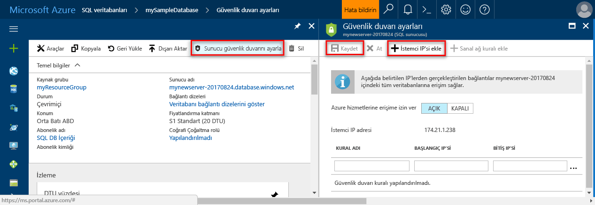

# <a name="azure-sql-database-server-level-and-database-level-firewall-rules"></a><span data-ttu-id="91682-104">Azure SQL veritabanı sunucusu ve veritabanı düzeyi güvenlik duvarı kuralları</span><span class="sxs-lookup"><span data-stu-id="91682-104">Azure SQL Database server-level and database-level firewall rules</span></span> 

<span data-ttu-id="91682-105">Microsoft Azure SQL Veritabanı, Azure ile diğer İnternet tabanlı uygulamalar için ilişkisel veritabanı hizmeti sunar.</span><span class="sxs-lookup"><span data-stu-id="91682-105">Microsoft Azure SQL Database provides a relational database service for Azure and other Internet-based applications.</span></span> <span data-ttu-id="91682-106">Güvenlik duvarları, verilerinizin korunmasına yardımcı olmak üzere, hangi bilgisayarların izinli olduğunu belirtmenize kadar veritabanı sunucunuza tüm erişimi engeller.</span><span class="sxs-lookup"><span data-stu-id="91682-106">To help protect your data, firewalls prevent all access to your database server until you specify which computers have permission.</span></span> <span data-ttu-id="91682-107">Güvenlik duvarı, her bir isteğin kaynak IP adresine göre veritabanlarına erişim verir.</span><span class="sxs-lookup"><span data-stu-id="91682-107">The firewall grants access to databases based on the originating IP address of each request.</span></span>

## <a name="overview"></a><span data-ttu-id="91682-108">Genel Bakış</span><span class="sxs-lookup"><span data-stu-id="91682-108">Overview</span></span>

<span data-ttu-id="91682-109">Başlangıçta, Azure SQL sunucunuza tüm Transact-SQL erişimleri güvenlik duvarı tarafından engellenir.</span><span class="sxs-lookup"><span data-stu-id="91682-109">Initially, all Transact-SQL access to your Azure SQL server is blocked by the firewall.</span></span> <span data-ttu-id="91682-110">Azure SQL server'ı kullanmaya başlamak için Azure SQL sunucunuza erişimi sağlayan bir veya daha fazla sunucu düzeyinde güvenlik duvarı kuralları belirtmeniz gerekir.</span><span class="sxs-lookup"><span data-stu-id="91682-110">To begin using your Azure SQL server, you must specify one or more server-level firewall rules that enable access to your Azure SQL server.</span></span> <span data-ttu-id="91682-111">İnternet’ten gelen hangi IP adresi aralıklarının izinli olduğuna ve Azure uygulamalarının Azure SQL sunucunuza bağlanmaya çalışıp çalışamayacaklarına ilişkin güvenlik duvarı kurallarını belirleyin.</span><span class="sxs-lookup"><span data-stu-id="91682-111">Use the firewall rules to specify which IP address ranges from the Internet are allowed, and whether Azure applications can attempt to connect to your Azure SQL server.</span></span>

<span data-ttu-id="91682-112">Azure SQL sunucunuzdaki veritabanlarından yalnızca birine seçmeli olarak erişim vermek için, gerekli veritabanına yönelik bir veritabanı düzeyinde kural oluşturmanız gerekir.</span><span class="sxs-lookup"><span data-stu-id="91682-112">To selectively grant access to just one of the databases in your Azure SQL server, you must create a database-level rule for the required database.</span></span> <span data-ttu-id="91682-113">Veritabanı güvenlik duvarı kuralı için, sunucu düzeyinde güvenlik duvarı kuralında belirtilen IP adres aralığının dışında olan bir IP adres aralığı belirtin ve istemci IP adresinin veritabanı düzeyindeki kuralda belirtilen aralığa denk geldiğinden emin olun.</span><span class="sxs-lookup"><span data-stu-id="91682-113">Specify an IP address range for the database firewall rule that is beyond the IP address range specified in the server-level firewall rule, and ensure that the IP address of the client falls in the range specified in the database-level rule.</span></span>

<span data-ttu-id="91682-114">İnternet’ten ve Azure’dan gelen bağlantı denemeleri, Azure SQL sunucunuza veya SQL Veritabanına ulaşmadan önce aşağıdaki diyagramda gösterildiği gibi ilk olarak güvenlik duvarından geçmelidir:</span><span class="sxs-lookup"><span data-stu-id="91682-114">Connection attempts from the Internet and Azure must first pass through the firewall before they can reach your Azure SQL server or SQL Database, as shown in the following diagram:</span></span>

   ![Güvenlik duvarı yapılandırmasını açıklayan diyagram.][1]

* <span data-ttu-id="91682-116">**Sunucu düzeyinde güvenlik duvarı kuralları:** Bu kurallar istemcilerin tüm Azure SQL sunucusuna, yani aynı mantıksal sunucu içindeki tüm veritabanlarına erişmesini sağlar.</span><span class="sxs-lookup"><span data-stu-id="91682-116">**Server-level firewall rules:** These rules enable clients to access your entire Azure SQL server, that is, all the databases within the same logical server.</span></span> <span data-ttu-id="91682-117">Bu kurallar **ana** veritabanına depolanır.</span><span class="sxs-lookup"><span data-stu-id="91682-117">These rules are stored in the **master** database.</span></span> <span data-ttu-id="91682-118">Sunucu düzeyinde güvenlik duvarı kuralları, portal ya da Transact-SQL deyimleri kullanılarak yapılandırılabilir.</span><span class="sxs-lookup"><span data-stu-id="91682-118">Server-level firewall rules can be configured by using the portal or by using Transact-SQL statements.</span></span> <span data-ttu-id="91682-119">Azure portalı veya PowerShell kullanarak sunucu düzeyinde güvenlik duvarı kuralları oluşturmak için abonelik sahibi veya abonelik katkıda bulunanı olmanız gerekir.</span><span class="sxs-lookup"><span data-stu-id="91682-119">To create server-level firewall rules using the Azure portal or PowerShell, you must be the subscription owner or a subscription contributor.</span></span> <span data-ttu-id="91682-120">Transact-SQL kullanarak sunucu düzeyinde güvenlik duvarı kuralı oluşturmak için SQL Veritabanı örneğine sunucu düzeyi asıl oturum açma bilgileriyle veya Azure Active Directory yöneticisi olarak bağlanmanız gerekir (başka bir deyişle, sunucu düzeyi güvenlik duvarı kuralının önce Azure düzeyi izinlere sahip bir kullanıcı tarafından oluşturulması gerekir).</span><span class="sxs-lookup"><span data-stu-id="91682-120">To create a server-level firewall rule using Transact-SQL, you must connect to the SQL Database instance as the server-level principal login or the Azure Active Directory administrator (which means that a server-level firewall rule must first be created by a user with Azure-level permissions).</span></span>
* <span data-ttu-id="91682-121">**Veritabanı düzeyi güvenlik duvarı kuralları:** aynı mantıksal sunucu içinde (güvenli) belirli veritabanlarına erişmek istemciler bu kuralları etkinleştirin.</span><span class="sxs-lookup"><span data-stu-id="91682-121">**Database-level firewall rules:** These rules enable clients to access certain (secure) databases within the same logical server.</span></span> <span data-ttu-id="91682-122">Her veritabanı için bu kurallar oluşturabilirsiniz (de dahil olmak üzere **ana** database0) ve tek tek veritabanlarında depolanır.</span><span class="sxs-lookup"><span data-stu-id="91682-122">You can create these rules for each database (including the **master** database0) and they are stored in the individual databases.</span></span> <span data-ttu-id="91682-123">İlk sunucu düzeyinde Güvenlik Duvarı'nı yapılandırdıktan sonra veritabanı düzeyinde güvenlik duvarı kuralları yalnızca Transact-SQL deyimi kullanarak yapılandırılmış ve yalnızca olabilir.</span><span class="sxs-lookup"><span data-stu-id="91682-123">Database-level firewall rules can only be configured by using Transact-SQL statements and only after you have configured the first server-level firewall.</span></span> <span data-ttu-id="91682-124">Veritabanı düzeyinde güvenlik kuralı için, sunucu düzeyinde güvenlik duvarı kuralında belirtilen aralığın dışındaki bir IP adresi aralığını belirtirseniz, yalnızca veritabanı düzeyi aralığındaki IP adreslerine sahip istemciler veritabanına erişebilir.</span><span class="sxs-lookup"><span data-stu-id="91682-124">If you specify an IP address range in the database-level firewall rule that is outside the range specified in the server-level firewall rule, only those clients that have IP addresses in the database-level range can access the database.</span></span> <span data-ttu-id="91682-125">Bir veritabanı için en fazla 128 veritabanı düzeyinde güvenlik duvarı kuralınız olabilir.</span><span class="sxs-lookup"><span data-stu-id="91682-125">You can have a maximum of 128 database-level firewall rules for a database.</span></span> <span data-ttu-id="91682-126">Ana ve kullanıcı veritabanları için veritabanı düzeyinde güvenlik duvarı kuralları yalnızca oluşturulur ve Transact-SQL yönetilir.</span><span class="sxs-lookup"><span data-stu-id="91682-126">Database-level firewall rules for master and user databases can only be created and managed through Transact-SQL.</span></span> <span data-ttu-id="91682-127">Makale ve bakın örnekte daha sonra bu veritabanı düzeyinde güvenlik duvarı kuralları yapılandırma hakkında daha fazla bilgi için bkz [sp_set_database_firewall_rule (Azure SQL veritabanları)](https://msdn.microsoft.com/library/dn270010.aspx).</span><span class="sxs-lookup"><span data-stu-id="91682-127">For more information on configuring database-level firewall rules, see the example later in this article and see [sp_set_database_firewall_rule (Azure SQL Databases)](https://msdn.microsoft.com/library/dn270010.aspx).</span></span>

<span data-ttu-id="91682-128">**Öneri:** Microsoft, güvenliği artırmak ve veritabanınızı daha taşınabilir hale getirmek açısından, mümkün olan durumlarda veritabanı düzeyinde güvenlik duvarı kurallarının kullanılmasını önerir.</span><span class="sxs-lookup"><span data-stu-id="91682-128">**Recommendation:** Microsoft recommends using database-level firewall rules whenever possible to enhance security and to make your database more portable.</span></span> <span data-ttu-id="91682-129">Aynı erişim gereksinimlerine sahip birçok veritabanınız varsa ve her veritabanını ayrı ayrı yapılandırmaya zaman harcamak istemiyorsanız sunucu düzeyinde güvenlik duvarı kurallarını yöneticiler için kullanabilirsiniz.</span><span class="sxs-lookup"><span data-stu-id="91682-129">Use server-level firewall rules for administrators and when you have many databases that have the same access requirements and you don't want to spend time configuring each database individually.</span></span>

> [!Note]
> <span data-ttu-id="91682-130">İş sürekliliği bağlamında taşınabilir veritabanları hakkında bilgi edinmek için bkz. [Olağanüstü durum kurtarma için kimlik doğrulama gereksinimleri](sql-database-geo-replication-security-config.md).</span><span class="sxs-lookup"><span data-stu-id="91682-130">For information about portable databases in the context of business continuity, see [Authentication requirements for disaster recovery](sql-database-geo-replication-security-config.md).</span></span>
>

### <a name="connecting-from-the-internet"></a><span data-ttu-id="91682-131">İnternet'ten bağlanma</span><span class="sxs-lookup"><span data-stu-id="91682-131">Connecting from the Internet</span></span>

<span data-ttu-id="91682-132">Bir bilgisayar İnternet'ten veritabanı sunucunuza bağlanmaya çalıştığında, güvenlik duvarı ilk olarak isteğin kaynak IP adresini, bağlantının istediği veritabanı için veritabanı düzeyi güvenlik duvarı kurallarına karşı denetler:</span><span class="sxs-lookup"><span data-stu-id="91682-132">When a computer attempts to connect to your database server from the Internet, the firewall first checks the originating IP address of the request against the database-level firewall rules, for the database that the connection is requesting:</span></span>

* <span data-ttu-id="91682-133">İsteğin IP adresi veritabanı düzeyinde güvenlik duvarı kurallarında belirtilen aralıklardan biri içindeyse, kuralı içeren SQL Veritabanı’na bağlantı izni verilir.</span><span class="sxs-lookup"><span data-stu-id="91682-133">If the IP address of the request is within one of the ranges specified in the database-level firewall rules, the connection is granted to the SQL Database that contains the rule.</span></span>
* <span data-ttu-id="91682-134">İsteğin IP adresi veritabanı düzeyinde güvenlik duvarı kuralında belirtilen aralıklardan biri içinde değilse, sunucu düzeyinde güvenlik duvarı kuralları denetlenir.</span><span class="sxs-lookup"><span data-stu-id="91682-134">If the IP address of the request is not within one of the ranges specified in the database-level firewall rule, the server-level firewall rules are checked.</span></span> <span data-ttu-id="91682-135">İstek IP adresi sunucu düzeyinde güvenlik duvarı kurallarında belirtilen aralıklardan biri içindeyse, bağlantı izni verilir.</span><span class="sxs-lookup"><span data-stu-id="91682-135">If the IP address of the request is within one of the ranges specified in the server-level firewall rules, the connection is granted.</span></span> <span data-ttu-id="91682-136">Sunucu düzeyinde güvenlik duvarı kuralları, Azure SQL server üzerindeki tüm SQL veritabanları için geçerlidir.</span><span class="sxs-lookup"><span data-stu-id="91682-136">Server-level firewall rules apply to all SQL databases on the Azure SQL server.</span></span>  
* <span data-ttu-id="91682-137">IP adresi isteğin herhangi bir veritabanı düzeyi veya sunucu düzeyinde güvenlik duvarı kuralları içinde belirtilen aralık içinde değil bağlantı isteği başarısız olur.</span><span class="sxs-lookup"><span data-stu-id="91682-137">If the IP address of the request is not within the ranges specified in any of the database-level or server-level firewall rules, the connection request fails.</span></span>

> [!NOTE]
> <span data-ttu-id="91682-138">Azure SQL Veritabanına yerel bilgisayarınızdan erişmek için, ağ ve yerel bilgisayarınız üzerindeki güvenlik duvarının TCP bağlantı noktası 1433 üzerinde giden iletişime izin verdiğinden emin olun.</span><span class="sxs-lookup"><span data-stu-id="91682-138">To access Azure SQL Database from your local computer, ensure the firewall on your network and local computer allows outgoing communication on TCP port 1433.</span></span>
> 

### <a name="connecting-from-azure"></a><span data-ttu-id="91682-139">Azure'dan bağlanma</span><span class="sxs-lookup"><span data-stu-id="91682-139">Connecting from Azure</span></span>
<span data-ttu-id="91682-140">Azure’daki uygulamaların Azure SQL sunucunuza bağlanmasına izin verebilmeniz için Azure bağlantılarının etkinleştirilmesi gerekir.</span><span class="sxs-lookup"><span data-stu-id="91682-140">To allow applications from Azure to connect to your Azure SQL server, Azure connections must be enabled.</span></span> <span data-ttu-id="91682-141">Azure’dan bir uygulama, veritabanı sunucunuza bağlanmayı denediğinizde güvenlik duvarı Azure bağlantılarına izin verildiğini doğrular.</span><span class="sxs-lookup"><span data-stu-id="91682-141">When an application from Azure attempts to connect to your database server, the firewall verifies that Azure connections are allowed.</span></span> <span data-ttu-id="91682-142">Başlangıç ve bitiş adresi 0.0.0.0’a eşit olan bir güvenlik duvarı ayarı, bu bağlantılara izin verildiğini gösterir.</span><span class="sxs-lookup"><span data-stu-id="91682-142">A firewall setting with starting and ending address equal to 0.0.0.0 indicates these connections are allowed.</span></span> <span data-ttu-id="91682-143">Bağlantı denemesine izin verilmezse, istek Azure SQL Veritabanı sunucusuna ulaşmaz.</span><span class="sxs-lookup"><span data-stu-id="91682-143">If the connection attempt is not allowed, the request does not reach the Azure SQL Database server.</span></span>

> [!IMPORTANT]
> <span data-ttu-id="91682-144">Bu seçenek, diğer müşterilerin aboneliklerinden gelen bağlantılar dahil Azure’dan tüm bağlantılara izin verecek şekilde güvenlik duvarınızı yapılandırır.</span><span class="sxs-lookup"><span data-stu-id="91682-144">This option configures the firewall to allow all connections from Azure including connections from the subscriptions of other customers.</span></span> <span data-ttu-id="91682-145">Bu seçeneği belirlerken, oturum açma ve kullanıcı izinlerinizin erişimi yalnızca yetkili kullanıcılarla sınırladığından emin olun.</span><span class="sxs-lookup"><span data-stu-id="91682-145">When selecting this option, make sure your login and user permissions limit access to only authorized users.</span></span>
> 

## <a name="creating-and-managing-firewall-rules"></a><span data-ttu-id="91682-146">Güvenlik duvarı kuralları oluşturmayı ve yönetmeyi</span><span class="sxs-lookup"><span data-stu-id="91682-146">Creating and managing firewall rules</span></span>
<span data-ttu-id="91682-147">İlk sunucu düzeyinde güvenlik duvarı ayarı kullanılarak oluşturulabilir [Azure portal](https://portal.azure.com/) veya program aracılığıyla kullanarak [Azure PowerShell](https://msdn.microsoft.com/library/azure/dn546724.aspx), [Azure CLI](/cli/azure/sql/server/firewall-rule#create), veya [ REST API](https://msdn.microsoft.com/library/azure/dn505712.aspx).</span><span class="sxs-lookup"><span data-stu-id="91682-147">The first server-level firewall setting can be created using the [Azure portal](https://portal.azure.com/) or programmatically using [Azure PowerShell](https://msdn.microsoft.com/library/azure/dn546724.aspx), [Azure CLI](/cli/azure/sql/server/firewall-rule#create), or the [REST API](https://msdn.microsoft.com/library/azure/dn505712.aspx).</span></span> <span data-ttu-id="91682-148">Sunucu düzeyinde sonraki güvenlik duvarı kuralları ise bu yöntemler kullanılarak ve Transact-SQL aracılığıyla oluşturulup yönetilebilir.</span><span class="sxs-lookup"><span data-stu-id="91682-148">Subsequent server-level firewall rules can be created and managed using these methods, and through Transact-SQL.</span></span> 

> [!IMPORTANT]
> <span data-ttu-id="91682-149">Veritabanı düzeyinde güvenlik duvarı kuralları yalnızca oluşturulabilir ve Transact-SQL kullanılarak yönetilebilir.</span><span class="sxs-lookup"><span data-stu-id="91682-149">Database-level firewall rules can only be created and managed using Transact-SQL.</span></span> 
>

<span data-ttu-id="91682-150">Performansı artırmak için sunucu düzeyinde güvenlik duvarı kuralları veritabanı düzeyinde geçici olarak önbelleğe alınır.</span><span class="sxs-lookup"><span data-stu-id="91682-150">To improve performance, server-level firewall rules are temporarily cached at the database level.</span></span> <span data-ttu-id="91682-151">Önbelleği yenilemek için bkz. [DBCC FLUSHAUTHCACHE](https://msdn.microsoft.com/library/mt627793.aspx).</span><span class="sxs-lookup"><span data-stu-id="91682-151">To refresh the cache, see [DBCC FLUSHAUTHCACHE](https://msdn.microsoft.com/library/mt627793.aspx).</span></span> 

> [!TIP]
> <span data-ttu-id="91682-152">Kullanabileceğiniz [SQL veritabanı denetimi](sql-database-auditing.md) sunucu ve veritabanı düzeyi güvenlik duvarı değişiklikleri denetlemek için.</span><span class="sxs-lookup"><span data-stu-id="91682-152">You can use [SQL Database Auditing](sql-database-auditing.md) to audit server-level and database-level firewall changes.</span></span>
>

### <a name="azure-portal"></a><span data-ttu-id="91682-153">Azure portalına</span><span class="sxs-lookup"><span data-stu-id="91682-153">Azure portal</span></span>

<span data-ttu-id="91682-154">Azure portalında bir sunucu düzeyinde güvenlik duvarı kuralı ayarlamak için ya da Genel Bakış sayfasına Azure SQL veritabanınızı veya genel bakış sayfası için Azure veritabanı mantıksal sunucunuz için gidebilirsiniz.</span><span class="sxs-lookup"><span data-stu-id="91682-154">To set a server-level firewall rule in the Azure portal, you can either go to the Overview page for your Azure SQL database or the Overview page for your Azure Database logical server.</span></span>

> [!TIP]
> <span data-ttu-id="91682-155">Bir öğretici için bkz: [Azure portalını kullanarak bir DB Oluştur](sql-database-get-started-portal.md).</span><span class="sxs-lookup"><span data-stu-id="91682-155">For a tutorial, see [Create a DB using the Azure portal](sql-database-get-started-portal.md).</span></span>
>

<span data-ttu-id="91682-156">**Veritabanı genel bakış sayfasında**</span><span class="sxs-lookup"><span data-stu-id="91682-156">**From database overview page**</span></span>

1. <span data-ttu-id="91682-157">Veritabanı genel bakış sayfasında sunucu düzeyinde güvenlik duvarı kuralı ayarlamak için tıklatın **ayarlayın sunucu Güvenlik Duvarı** aşağıdaki görüntüde gösterildiği gibi araç çubuğunda: **Güvenlik Duvarı ayarları** SQL veritabanı sunucusu için sayfası açılır.</span><span class="sxs-lookup"><span data-stu-id="91682-157">To set a server-level firewall rule from the database overview page, click **Set server firewall** on the toolbar as shown in the following image: The **Firewall settings** page for the SQL Database server opens.</span></span>

       

2. <span data-ttu-id="91682-159">Tıklatın **istemci IP'si Ekle** bilgisayarın IP adresi eklemek için araç çubuğundaki kullanmakta olduğunuz ve ardından **kaydetmek**.</span><span class="sxs-lookup"><span data-stu-id="91682-159">Click **Add client IP** on the toolbar to add the IP address of the computer you are currently using and then click **Save**.</span></span> <span data-ttu-id="91682-160">Geçerli IP adresiniz için bir sunucu düzeyi güvenlik duvarı kuralı oluşturulur.</span><span class="sxs-lookup"><span data-stu-id="91682-160">A server-level firewall rule is created for your current IP address.</span></span>

       

<span data-ttu-id="91682-162">**Server genel bakış sayfasında**</span><span class="sxs-lookup"><span data-stu-id="91682-162">**From server overview page**</span></span>

<span data-ttu-id="91682-163">Tam sunucu adını gösteren sunucunuz için genel bakış sayfasında açılır (gibi **mynewserver20170403.database.windows.net**) ve diğer yapılandırmalar için seçenekler sağlar.</span><span class="sxs-lookup"><span data-stu-id="91682-163">The overview page for your server opens, showing you the fully qualified server name (such as **mynewserver20170403.database.windows.net**) and provides options for further configuration.</span></span>

1. <span data-ttu-id="91682-164">Server genel bakış sayfasında sunucu düzeyi kural kümesi için tıklatın **Güvenlik Duvarı** aşağıdaki görüntüde gösterilen şekilde ayarlar altında sol menüde:</span><span class="sxs-lookup"><span data-stu-id="91682-164">To set a server-level rule from server overview page, click **Firewall** in the left-hand menu under Settings as showed in the following image:</span></span> 

     

2. <span data-ttu-id="91682-166">Tıklatın **istemci IP'si Ekle** bilgisayarın IP adresi eklemek için araç çubuğundaki kullanmakta olduğunuz ve ardından **kaydetmek**.</span><span class="sxs-lookup"><span data-stu-id="91682-166">Click **Add client IP** on the toolbar to add the IP address of the computer you are currently using and then click **Save**.</span></span> <span data-ttu-id="91682-167">Geçerli IP adresiniz için bir sunucu düzeyi güvenlik duvarı kuralı oluşturulur.</span><span class="sxs-lookup"><span data-stu-id="91682-167">A server-level firewall rule is created for your current IP address.</span></span>

     

### <a name="transact-sql"></a><span data-ttu-id="91682-169">Transact-SQL</span><span class="sxs-lookup"><span data-stu-id="91682-169">Transact-SQL</span></span>
| <span data-ttu-id="91682-170">Katalog Görünümü veya Saklı Yordam</span><span class="sxs-lookup"><span data-stu-id="91682-170">Catalog View or Stored Procedure</span></span> | <span data-ttu-id="91682-171">Düzey</span><span class="sxs-lookup"><span data-stu-id="91682-171">Level</span></span> | <span data-ttu-id="91682-172">Açıklama</span><span class="sxs-lookup"><span data-stu-id="91682-172">Description</span></span> |
| --- | --- | --- |
| [<span data-ttu-id="91682-173">sys.firewall_rules</span><span class="sxs-lookup"><span data-stu-id="91682-173">sys.firewall_rules</span></span>](https://msdn.microsoft.com/library/dn269980.aspx) |<span data-ttu-id="91682-174">Sunucu</span><span class="sxs-lookup"><span data-stu-id="91682-174">Server</span></span> |<span data-ttu-id="91682-175">Sunucu düzeyinde geçerli güvenlik duvarı kurallarını gösterir</span><span class="sxs-lookup"><span data-stu-id="91682-175">Displays the current server-level firewall rules</span></span> |
| [<span data-ttu-id="91682-176">sp_set_firewall_rule</span><span class="sxs-lookup"><span data-stu-id="91682-176">sp_set_firewall_rule</span></span>](https://msdn.microsoft.com/library/dn270017.aspx) |<span data-ttu-id="91682-177">Sunucu</span><span class="sxs-lookup"><span data-stu-id="91682-177">Server</span></span> |<span data-ttu-id="91682-178">Sunucu düzeyinde güvenlik duvarı kuralları oluşturur veya güncelleştirir</span><span class="sxs-lookup"><span data-stu-id="91682-178">Creates or updates server-level firewall rules</span></span> |
| [<span data-ttu-id="91682-179">sp_delete_firewall_rule</span><span class="sxs-lookup"><span data-stu-id="91682-179">sp_delete_firewall_rule</span></span>](https://msdn.microsoft.com/library/dn270024.aspx) |<span data-ttu-id="91682-180">Sunucu</span><span class="sxs-lookup"><span data-stu-id="91682-180">Server</span></span> |<span data-ttu-id="91682-181">Sunucu düzeyinde güvenlik duvarı kurallarını kaldırır</span><span class="sxs-lookup"><span data-stu-id="91682-181">Removes server-level firewall rules</span></span> |
| [<span data-ttu-id="91682-182">sys.database_firewall_rules</span><span class="sxs-lookup"><span data-stu-id="91682-182">sys.database_firewall_rules</span></span>](https://msdn.microsoft.com/library/dn269982.aspx) |<span data-ttu-id="91682-183">Database</span><span class="sxs-lookup"><span data-stu-id="91682-183">Database</span></span> |<span data-ttu-id="91682-184">Veritabanı düzeyinde geçerli güvenlik duvarı kurallarını gösterir</span><span class="sxs-lookup"><span data-stu-id="91682-184">Displays the current database-level firewall rules</span></span> |
| [<span data-ttu-id="91682-185">sp_set_database_firewall_rule</span><span class="sxs-lookup"><span data-stu-id="91682-185">sp_set_database_firewall_rule</span></span>](https://msdn.microsoft.com/library/dn270010.aspx) |<span data-ttu-id="91682-186">Database</span><span class="sxs-lookup"><span data-stu-id="91682-186">Database</span></span> |<span data-ttu-id="91682-187">Veritabanı düzeyinde güvenlik duvarı kuralları oluşturur veya güncelleştirir</span><span class="sxs-lookup"><span data-stu-id="91682-187">Creates or updates the database-level firewall rules</span></span> |
| [<span data-ttu-id="91682-188">sp_delete_database_firewall_rule</span><span class="sxs-lookup"><span data-stu-id="91682-188">sp_delete_database_firewall_rule</span></span>](https://msdn.microsoft.com/library/dn270030.aspx) |<span data-ttu-id="91682-189">Veritabanları</span><span class="sxs-lookup"><span data-stu-id="91682-189">Databases</span></span> |<span data-ttu-id="91682-190">Veritabanı düzeyinde güvenlik duvarı kurallarını kaldırır</span><span class="sxs-lookup"><span data-stu-id="91682-190">Removes database-level firewall rules</span></span> |


<span data-ttu-id="91682-191">Aşağıdaki örnekler varolan kuralları gözden geçirin, bir IP adresi aralığı Contoso sunucuda etkinleştirmek ve bir güvenlik duvarı kuralını siler:</span><span class="sxs-lookup"><span data-stu-id="91682-191">The following examples review the existing rules, enable a range of IP addresses on the server Contoso, and deletes a firewall rule:</span></span>
   
```sql
SELECT * FROM sys.firewall_rules ORDER BY name;
```
  
<span data-ttu-id="91682-192">Daha sonra bir güvenlik duvarı kuralı ekleyin.</span><span class="sxs-lookup"><span data-stu-id="91682-192">Next, add a firewall rule.</span></span>
   
```sql
EXECUTE sp_set_firewall_rule @name = N'ContosoFirewallRule',
   @start_ip_address = '192.168.1.1', @end_ip_address = '192.168.1.10'
```

<span data-ttu-id="91682-193">Sunucu düzeyindeki bir güvenlik duvarı kuralını silmek için sp_delete_firewall_rule saklı yordamını yürütün.</span><span class="sxs-lookup"><span data-stu-id="91682-193">To delete a server-level firewall rule, execute the sp_delete_firewall_rule stored procedure.</span></span> <span data-ttu-id="91682-194">Aşağıdaki örnek, ContosoFirewallRule adlı kuralını siler:</span><span class="sxs-lookup"><span data-stu-id="91682-194">The following example deletes the rule named ContosoFirewallRule:</span></span>
   
```sql
EXECUTE sp_delete_firewall_rule @name = N'ContosoFirewallRule'
```   

### <a name="azure-powershell"></a><span data-ttu-id="91682-195">Azure PowerShell</span><span class="sxs-lookup"><span data-stu-id="91682-195">Azure PowerShell</span></span>
| <span data-ttu-id="91682-196">Cmdlet</span><span class="sxs-lookup"><span data-stu-id="91682-196">Cmdlet</span></span> | <span data-ttu-id="91682-197">Düzey</span><span class="sxs-lookup"><span data-stu-id="91682-197">Level</span></span> | <span data-ttu-id="91682-198">Açıklama</span><span class="sxs-lookup"><span data-stu-id="91682-198">Description</span></span> |
| --- | --- | --- |
| [<span data-ttu-id="91682-199">Get-AzureSqlDatabaseServerFirewallRule</span><span class="sxs-lookup"><span data-stu-id="91682-199">Get-AzureSqlDatabaseServerFirewallRule</span></span>](https://msdn.microsoft.com/library/azure/dn546731.aspx) |<span data-ttu-id="91682-200">Sunucu</span><span class="sxs-lookup"><span data-stu-id="91682-200">Server</span></span> |<span data-ttu-id="91682-201">Sunucu düzeyinde geçerli güvenlik duvarı kurallarını döndürür</span><span class="sxs-lookup"><span data-stu-id="91682-201">Returns the current server-level firewall rules</span></span> |
| [<span data-ttu-id="91682-202">New-AzureSqlDatabaseServerFirewallRule</span><span class="sxs-lookup"><span data-stu-id="91682-202">New-AzureSqlDatabaseServerFirewallRule</span></span>](https://msdn.microsoft.com/library/azure/dn546724.aspx) |<span data-ttu-id="91682-203">Sunucu</span><span class="sxs-lookup"><span data-stu-id="91682-203">Server</span></span> |<span data-ttu-id="91682-204">Sunucu düzeyinde yeni bir güvenlik duvarı kuralı oluşturur</span><span class="sxs-lookup"><span data-stu-id="91682-204">Creates a new server-level firewall rule</span></span> |
| [<span data-ttu-id="91682-205">Set-AzureSqlDatabaseServerFirewallRule</span><span class="sxs-lookup"><span data-stu-id="91682-205">Set-AzureSqlDatabaseServerFirewallRule</span></span>](https://msdn.microsoft.com/library/azure/dn546739.aspx) |<span data-ttu-id="91682-206">Sunucu</span><span class="sxs-lookup"><span data-stu-id="91682-206">Server</span></span> |<span data-ttu-id="91682-207">Sunucu düzeyinde mevcut güvenlik duvarı kuralının özelliklerini güncelleştirir</span><span class="sxs-lookup"><span data-stu-id="91682-207">Updates the properties of an existing server-level firewall rule</span></span> |
| [<span data-ttu-id="91682-208">Remove-AzureSqlDatabaseServerFirewallRule</span><span class="sxs-lookup"><span data-stu-id="91682-208">Remove-AzureSqlDatabaseServerFirewallRule</span></span>](https://msdn.microsoft.com/library/azure/dn546727.aspx) |<span data-ttu-id="91682-209">Sunucu</span><span class="sxs-lookup"><span data-stu-id="91682-209">Server</span></span> |<span data-ttu-id="91682-210">Sunucu düzeyinde güvenlik duvarı kurallarını kaldırır</span><span class="sxs-lookup"><span data-stu-id="91682-210">Removes server-level firewall rules</span></span> |


<span data-ttu-id="91682-211">Aşağıdaki örnek PowerShell kullanarak bir sunucu düzeyinde güvenlik duvarı kuralı ayarlar:</span><span class="sxs-lookup"><span data-stu-id="91682-211">The following example sets a server-level firewall rule using PowerShell:</span></span>

```powershell
New-AzureRmSqlServerFirewallRule -ResourceGroupName "myResourceGroup" `
    -ServerName $servername `
    -FirewallRuleName "AllowSome" -StartIpAddress "0.0.0.0" -EndIpAddress "0.0.0.0"
```

> [!TIP]
> <span data-ttu-id="91682-212">PowerShell ilişkin örnekler için hızlı başlangıç bağlamında bkz [oluşturma DB - PowerShell](sql-database-get-started-powershell.md) ve [tek bir veritabanı oluşturabilirsiniz ve PowerShell kullanarak bir güvenlik duvarı kuralı yapılandırma](scripts/sql-database-create-and-configure-database-powershell.md)</span><span class="sxs-lookup"><span data-stu-id="91682-212">For PowerShell examples in the context of a quick start, see [Create DB - PowerShell](sql-database-get-started-powershell.md) and [Create a single database and configure a firewall rule using PowerShell](scripts/sql-database-create-and-configure-database-powershell.md)</span></span>
>

### <a name="azure-cli"></a><span data-ttu-id="91682-213">Azure CLI</span><span class="sxs-lookup"><span data-stu-id="91682-213">Azure CLI</span></span>
| <span data-ttu-id="91682-214">Cmdlet</span><span class="sxs-lookup"><span data-stu-id="91682-214">Cmdlet</span></span> | <span data-ttu-id="91682-215">Düzey</span><span class="sxs-lookup"><span data-stu-id="91682-215">Level</span></span> | <span data-ttu-id="91682-216">Açıklama</span><span class="sxs-lookup"><span data-stu-id="91682-216">Description</span></span> |
| --- | --- | --- |
| [<span data-ttu-id="91682-217">az sql server güvenlik duvarı oluşturma</span><span class="sxs-lookup"><span data-stu-id="91682-217">az sql server firewall create</span></span>](/cli/azure/sql/server/firewall-rule#create) | <span data-ttu-id="91682-218">Girilen IP adresi aralığından sunucusundaki tüm SQL veritabanlarına erişim sağlamak için bir güvenlik duvarı kuralı oluşturur.</span><span class="sxs-lookup"><span data-stu-id="91682-218">Creates a firewall rule to allow access to all SQL Databases on the server from the entered IP address range.</span></span>|
| [<span data-ttu-id="91682-219">az sql server güvenlik duvarı Sil</span><span class="sxs-lookup"><span data-stu-id="91682-219">az sql server firewall delete</span></span>](/cli/azure/sql/server/firewall-rule#delete)| <span data-ttu-id="91682-220">Bir güvenlik duvarı kuralını siler.</span><span class="sxs-lookup"><span data-stu-id="91682-220">Deletes a firewall rule.</span></span>|
| [<span data-ttu-id="91682-221">az sql server güvenlik duvarı listesi</span><span class="sxs-lookup"><span data-stu-id="91682-221">az sql server firewall list</span></span>](/cli/azure/sql/server/firewall-rule#list)| <span data-ttu-id="91682-222">Güvenlik duvarı kuralları listeler.</span><span class="sxs-lookup"><span data-stu-id="91682-222">Lists the firewall rules.</span></span>|
| [<span data-ttu-id="91682-223">az sql server güvenlik duvarı kuralı Göster</span><span class="sxs-lookup"><span data-stu-id="91682-223">az sql server firewall rule show</span></span>](/cli/azure/sql/server/firewall-rule#show)| <span data-ttu-id="91682-224">Bir güvenlik duvarı kuralı ayrıntılarını gösterir.</span><span class="sxs-lookup"><span data-stu-id="91682-224">Shows the details of a firewall rule.</span></span>|
| [<span data-ttu-id="91682-225">SQL server güvenlik duvarı kuralı güncelleştirmesi ax</span><span class="sxs-lookup"><span data-stu-id="91682-225">ax sql server firewall rule update</span></span>](/cli/azure/sql/server/firewall-rule#update)| <span data-ttu-id="91682-226">Bir güvenlik duvarı kuralı güncelleştirir.</span><span class="sxs-lookup"><span data-stu-id="91682-226">Updates a firewall rule.</span></span>

<span data-ttu-id="91682-227">Aşağıdaki örnek, Azure CLI kullanarak bir sunucu düzeyinde güvenlik duvarı kuralı ayarlar:</span><span class="sxs-lookup"><span data-stu-id="91682-227">The following example sets a server-level firewall rule using the Azure CLI:</span></span> 

```azurecli-interactive
az sql server firewall-rule create --resource-group myResourceGroup --server $servername \
    -n AllowYourIp --start-ip-address 0.0.0.0 --end-ip-address 0.0.0.0
```

> [!TIP]
> <span data-ttu-id="91682-228">Bir Azure CLI örneği hızlı bir başlangıç için bağlamında bkz [oluşturma Çiftazalanbakiye - Azure CLI](sql-database-get-started-cli.md) ve [tek bir veritabanı oluşturun ve Azure CLI kullanarak bir güvenlik duvarı kuralı yapılandırma](scripts/sql-database-create-and-configure-database-cli.md)</span><span class="sxs-lookup"><span data-stu-id="91682-228">For an Azure CLI example in the context of a quick start, see [Create DDB - Azure CLI](sql-database-get-started-cli.md) and [Create a single database and configure a firewall rule using the Azure CLI](scripts/sql-database-create-and-configure-database-cli.md)</span></span>
>

### <a name="rest-api"></a><span data-ttu-id="91682-229">REST API</span><span class="sxs-lookup"><span data-stu-id="91682-229">REST API</span></span>
| <span data-ttu-id="91682-230">API</span><span class="sxs-lookup"><span data-stu-id="91682-230">API</span></span> | <span data-ttu-id="91682-231">Düzey</span><span class="sxs-lookup"><span data-stu-id="91682-231">Level</span></span> | <span data-ttu-id="91682-232">Açıklama</span><span class="sxs-lookup"><span data-stu-id="91682-232">Description</span></span> |
| --- | --- | --- |
| [<span data-ttu-id="91682-233">Güvenlik Duvarı Kurallarını Listele</span><span class="sxs-lookup"><span data-stu-id="91682-233">List Firewall Rules</span></span>](https://msdn.microsoft.com/library/azure/dn505715.aspx) |<span data-ttu-id="91682-234">Sunucu</span><span class="sxs-lookup"><span data-stu-id="91682-234">Server</span></span> |<span data-ttu-id="91682-235">Sunucu düzeyinde geçerli güvenlik duvarı kurallarını gösterir</span><span class="sxs-lookup"><span data-stu-id="91682-235">Displays the current server-level firewall rules</span></span> |
| [<span data-ttu-id="91682-236">Güvenlik Duvarı Kuralı Oluştur</span><span class="sxs-lookup"><span data-stu-id="91682-236">Create Firewall Rule</span></span>](https://msdn.microsoft.com/library/azure/dn505712.aspx) |<span data-ttu-id="91682-237">Sunucu</span><span class="sxs-lookup"><span data-stu-id="91682-237">Server</span></span> |<span data-ttu-id="91682-238">Sunucu düzeyinde güvenlik duvarı kuralları oluşturur veya güncelleştirir</span><span class="sxs-lookup"><span data-stu-id="91682-238">Creates or updates server-level firewall rules</span></span> |
| [<span data-ttu-id="91682-239">Güvenlik Duvarı Kuralı Ayarla</span><span class="sxs-lookup"><span data-stu-id="91682-239">Set Firewall Rule</span></span>](https://msdn.microsoft.com/library/azure/dn505707.aspx) |<span data-ttu-id="91682-240">Sunucu</span><span class="sxs-lookup"><span data-stu-id="91682-240">Server</span></span> |<span data-ttu-id="91682-241">Sunucu düzeyinde mevcut güvenlik duvarı kuralının özelliklerini güncelleştirir</span><span class="sxs-lookup"><span data-stu-id="91682-241">Updates the properties of an existing server-level firewall rule</span></span> |
| [<span data-ttu-id="91682-242">Güvenlik Duvarı Kuralını Sil</span><span class="sxs-lookup"><span data-stu-id="91682-242">Delete Firewall Rule</span></span>](https://msdn.microsoft.com/library/azure/dn505706.aspx) |<span data-ttu-id="91682-243">Sunucu</span><span class="sxs-lookup"><span data-stu-id="91682-243">Server</span></span> |<span data-ttu-id="91682-244">Sunucu düzeyinde güvenlik duvarı kurallarını kaldırır</span><span class="sxs-lookup"><span data-stu-id="91682-244">Removes server-level firewall rules</span></span> |

## <a name="server-level-firewall-rule-versus-a-database-level-firewall-rule"></a><span data-ttu-id="91682-245">Sunucu düzeyinde güvenlik duvarı kuralı veritabanı düzeyinde güvenlik duvarı kuralı karşılaştırması</span><span class="sxs-lookup"><span data-stu-id="91682-245">Server-level firewall rule versus a database-level firewall rule</span></span>
<span data-ttu-id="91682-246">Q.</span><span class="sxs-lookup"><span data-stu-id="91682-246">Q.</span></span> <span data-ttu-id="91682-247">Bir veritabanının kullanıcıları başka bir veritabanından tamamen yalıtılmış olması gerekiyor mu?</span><span class="sxs-lookup"><span data-stu-id="91682-247">Should users of one database be fully isolated from another database?</span></span>   
  <span data-ttu-id="91682-248">Yanıt Evet ise, veritabanı düzeyinde güvenlik duvarı kurallarını kullanarak erişim izni.</span><span class="sxs-lookup"><span data-stu-id="91682-248">If yes, grant access using database-level firewall rules.</span></span> <span data-ttu-id="91682-249">Bu, savunma derinliğini azaltma, tüm veritabanları için güvenlik duvarı üzerinden erişime sunucu düzeyinde güvenlik duvarı kurallarını kullanarak önler.</span><span class="sxs-lookup"><span data-stu-id="91682-249">This avoids using server-level firewall rules, which permit access through the firewall to all databases, reducing the depth of your defenses.</span></span>   
 
<span data-ttu-id="91682-250">Q.</span><span class="sxs-lookup"><span data-stu-id="91682-250">Q.</span></span> <span data-ttu-id="91682-251">Kullanıcılar IP adresindeki ait tüm veritabanlarına erişim gerekiyor mu?</span><span class="sxs-lookup"><span data-stu-id="91682-251">Do users at the IP address’s need access to all databases?</span></span>   
  <span data-ttu-id="91682-252">Güvenlik duvarı kuralları yapılandırmalısınız sayısını azaltmak için sunucu düzeyinde güvenlik duvarı kurallarını kullanın.</span><span class="sxs-lookup"><span data-stu-id="91682-252">Use server-level firewall rules to reduce the number of times you must configure firewall rules.</span></span>   

<span data-ttu-id="91682-253">Q.</span><span class="sxs-lookup"><span data-stu-id="91682-253">Q.</span></span> <span data-ttu-id="91682-254">Kişi ya da güvenlik duvarı kuralları yalnızca yapılandırma takım Azure portalı, PowerShell veya REST API aracılığıyla erişimi var mı?</span><span class="sxs-lookup"><span data-stu-id="91682-254">Does the person or team configuring the firewall rules only have access through the Azure portal, PowerShell, or the REST API?</span></span>   
  <span data-ttu-id="91682-255">Sunucu düzeyinde güvenlik duvarı kuralları kullanmanız gerekir.</span><span class="sxs-lookup"><span data-stu-id="91682-255">You must use server-level firewall rules.</span></span> <span data-ttu-id="91682-256">Veritabanı düzeyinde güvenlik duvarı kuralları yalnızca Transact-SQL kullanılarak yapılandırılabilir.</span><span class="sxs-lookup"><span data-stu-id="91682-256">Database-level firewall rules can only be configured using Transact-SQL.</span></span>  

<span data-ttu-id="91682-257">Q.</span><span class="sxs-lookup"><span data-stu-id="91682-257">Q.</span></span> <span data-ttu-id="91682-258">Kişi veya takım veritabanı düzeyinde üst düzey iznine sahip yasaklanmış güvenlik duvarı kuralları yapılandırma?</span><span class="sxs-lookup"><span data-stu-id="91682-258">Is the person or team configuring the firewall rules prohibited from having high-level permission at the database level?</span></span>   
  <span data-ttu-id="91682-259">Sunucu düzeyinde güvenlik duvarı kurallarını kullanın.</span><span class="sxs-lookup"><span data-stu-id="91682-259">Use server-level firewall rules.</span></span> <span data-ttu-id="91682-260">Transact-SQL kullanarak veritabanı düzeyinde güvenlik duvarı kuralları yapılandırma en azından `CONTROL DATABASE` veritabanı düzeyinde izni.</span><span class="sxs-lookup"><span data-stu-id="91682-260">Configuring database-level firewall rules using Transact-SQL, requires at least `CONTROL DATABASE` permission at the database level.</span></span>  

<span data-ttu-id="91682-261">Q.</span><span class="sxs-lookup"><span data-stu-id="91682-261">Q.</span></span> <span data-ttu-id="91682-262">Merkezi olarak çoğu için güvenlik duvarı kurallarını yönetme kişi ya da yapılandırma veya güvenlik duvarı kuralları denetim takım olduğu (belki de 100s) veritabanlarının?</span><span class="sxs-lookup"><span data-stu-id="91682-262">Is the person or team configuring or auditing the firewall rules, centrally managing firewall rules for many (perhaps 100s) of databases?</span></span>   
  <span data-ttu-id="91682-263">Bu seçim, gereksinimleri ve ortam bağlıdır.</span><span class="sxs-lookup"><span data-stu-id="91682-263">This selection depends upon your needs and environment.</span></span> <span data-ttu-id="91682-264">Sunucu düzeyinde güvenlik duvarı kurallarını yapılandırmak daha kolay olabilir, ancak komut dosyası kuralları veritabanı düzeyinde yapılandırabilirsiniz.</span><span class="sxs-lookup"><span data-stu-id="91682-264">Server-level firewall rules might be easier to configure, but scripting can configure rules at the database-level.</span></span> <span data-ttu-id="91682-265">Ve sunucu düzeyinde güvenlik duvarı kuralları kullansanız bile, olmadığını görmek için veritabanı güvenlik duvarı kurallarını denetleme gerekebilir kullanıcılarla `CONTROL` izni veritabanında veritabanı düzeyinde güvenlik duvarı kuralları oluşturdunuz.</span><span class="sxs-lookup"><span data-stu-id="91682-265">And even if you use server-level firewall rules, you might need to audit the database-firewall rules, to see if users with `CONTROL` permission on the database have created database-level firewall rules.</span></span>   

<span data-ttu-id="91682-266">Q.</span><span class="sxs-lookup"><span data-stu-id="91682-266">Q.</span></span> <span data-ttu-id="91682-267">Her iki sunucu ve veritabanı düzeyi güvenlik duvarı kuralları bir karışımını kullanabilir miyim?</span><span class="sxs-lookup"><span data-stu-id="91682-267">Can I use a mix of both server-level and database-level firewall rules?</span></span>   
  <span data-ttu-id="91682-268">Evet.</span><span class="sxs-lookup"><span data-stu-id="91682-268">Yes.</span></span> <span data-ttu-id="91682-269">Yöneticiler gibi bazı kullanıcıların sunucu düzeyinde güvenlik duvarı kuralları gerekebilir.</span><span class="sxs-lookup"><span data-stu-id="91682-269">Some users, such as administrators might need server-level firewall rules.</span></span> <span data-ttu-id="91682-270">Kullanıcıların bir veritabanı uygulamasının gibi diğer kullanıcıların veritabanı düzeyinde güvenlik duvarı kuralları gerekebilir.</span><span class="sxs-lookup"><span data-stu-id="91682-270">Other users, such as users of a database application, might need database-level firewall rules.</span></span>   

## <a name="troubleshooting-the-database-firewall"></a><span data-ttu-id="91682-271">Veritabanı güvenlik duvarı sorunlarını giderme</span><span class="sxs-lookup"><span data-stu-id="91682-271">Troubleshooting the database firewall</span></span>
<span data-ttu-id="91682-272">Microsoft Azure SQL Veritabanı hizmetine erişim beklediğiniz gibi davranmadığında aşağıdaki noktaları göz önünde bulundurun:</span><span class="sxs-lookup"><span data-stu-id="91682-272">Consider the following points when access to the Microsoft Azure SQL Database service does not behave as you expect:</span></span>

* <span data-ttu-id="91682-273">**Yerel güvenlik duvarı yapılandırması:** Bilgisayarınızın Azure SQL Veritabanına erişebilmesi için bilgisayarınızda TCP bağlantı noktası 1433 için bir güvenlik duvarı özel durumu oluşturmanız gerekir.</span><span class="sxs-lookup"><span data-stu-id="91682-273">**Local firewall configuration:** Before your computer can access Azure SQL Database, you may need to create a firewall exception on your computer for TCP port 1433.</span></span> <span data-ttu-id="91682-274">Azure bulut limitleri içerisinde bağlantı oluşturuyorsanız başka bağlantı noktalarını da açmanız gerekebilir.</span><span class="sxs-lookup"><span data-stu-id="91682-274">If you are making connections inside the Azure cloud boundary, you may have to open additional ports.</span></span> <span data-ttu-id="91682-275">Daha fazla bilgi için bkz: **SQL Database: içinde vs dışındaki** bölümünü [ADO.NET 4.5 ve SQL veritabanı için 1433 dışındaki bağlantı noktaları](sql-database-develop-direct-route-ports-adonet-v12.md).</span><span class="sxs-lookup"><span data-stu-id="91682-275">For more information, see the **SQL Database: Outside vs inside** section of [Ports beyond 1433 for ADO.NET 4.5 and SQL Database](sql-database-develop-direct-route-ports-adonet-v12.md).</span></span>
* <span data-ttu-id="91682-276">**Ağ adresi çevirisi (NAT):** NAT nedeniyle, bilgisayarınızın Azure SQL Veritabanına bağlanmak için kullandığı IP adresi, bilgisayarınızın IP yapılandırma ayarlarında gösterilen IP adresinden farklı olabilir.</span><span class="sxs-lookup"><span data-stu-id="91682-276">**Network address translation (NAT):** Due to NAT, the IP address used by your computer to connect to Azure SQL Database may be different than the IP address shown in your computer IP configuration settings.</span></span> <span data-ttu-id="91682-277">Bilgisayarınızın Azure’a bağlanmak için kullandığı IP adresini görüntülemek üzere portalda oturum açın ve veritabanınızı barındıran sunucudaki **Yapılandır** sekmesine gidin.</span><span class="sxs-lookup"><span data-stu-id="91682-277">To view the IP address your computer is using to connect to Azure, log in to the portal and navigate to the **Configure** tab on the server that hosts your database.</span></span> <span data-ttu-id="91682-278">**İzin Verilen IP Adresleri** bölümü altında **Geçerli İstemci IP Adresi** gösterilir.</span><span class="sxs-lookup"><span data-stu-id="91682-278">Under the **Allowed IP Addresses** section, the **Current Client IP Address** is displayed.</span></span> <span data-ttu-id="91682-279">Bu bilgisayarın sunucuya erişmesine izin vermek için **İzin Verilen IP Adresleri** bölümünde **Ekle**’ye tıklayın.</span><span class="sxs-lookup"><span data-stu-id="91682-279">Click **Add** to the **Allowed IP Addresses** to allow this computer to access the server.</span></span>
* <span data-ttu-id="91682-280">**İzin verilenler listesindeki değişiklikler henüz uygulanmadı:** Azure SQL Veritabanı güvenlik duvarı yapılandırmasındaki değişikliklerin etkili olması beş dakikaya kadar sürebilir.</span><span class="sxs-lookup"><span data-stu-id="91682-280">**Changes to the allow list have not taken effect yet:** There may be as much as a five-minute delay for changes to the Azure SQL Database firewall configuration to take effect.</span></span>
* <span data-ttu-id="91682-281">**Kullanıcı adı yetkili değil veya yanlış parola kullanıldı:** Azure SQL Veritabanı sunucusunda bir kullanıcı adı yetkili değilse veya kullanılan parola yanlışsa, Azure SQL Veritabanı sunucusuyla bağlantı reddedilir.</span><span class="sxs-lookup"><span data-stu-id="91682-281">**The login is not authorized or an incorrect password was used:** If a login does not have permissions on the Azure SQL Database server or the password used is incorrect, the connection to the Azure SQL Database server is denied.</span></span> <span data-ttu-id="91682-282">Bir güvenlik duvarı ayarının oluşturulması yalnızca istemcilere sunucunuzla bağlantı kurmayı deneme fırsatı sunar; her istemci gerekli güvenlik kimlik bilgilerini belirtmek zorundadır.</span><span class="sxs-lookup"><span data-stu-id="91682-282">Creating a firewall setting only provides clients with an opportunity to attempt connecting to your server; each client must provide the necessary security credentials.</span></span> <span data-ttu-id="91682-283">Oturumları hazırlama hakkında daha fazla bilgi için bkz. Azure SQL Veritabanında Veritabanı, Oturum ve Kullanıcıları Yönetme.</span><span class="sxs-lookup"><span data-stu-id="91682-283">For more information about preparing logins, see Managing Databases, Logins, and Users in Azure SQL Database.</span></span>
* <span data-ttu-id="91682-284">**Dinamik IP adresi:** Dinamik IP adresiyle kurulmuş bir İnternet bağlantınız varsa ve güvenlik duvarını aşmakta sorun yaşıyorsanız aşağıdaki çözümlerden birini deneyebilirsiniz:</span><span class="sxs-lookup"><span data-stu-id="91682-284">**Dynamic IP address:** If you have an Internet connection with dynamic IP addressing and you are having trouble getting through the firewall, you could try one of the following solutions:</span></span>
  
  * <span data-ttu-id="91682-285">Azure SQL Veritabanı sunucusuna erişen istemci bilgisayarlarınıza atanmış IP adresi aralığını İnternet Servis Sağlayıcınıza (ISS) sorun ve IP adresi aralığını güvenlik duvarı kuralı olarak ekleyin.</span><span class="sxs-lookup"><span data-stu-id="91682-285">Ask your Internet Service Provider (ISP) for the IP address range assigned to your client computers that access the Azure SQL Database server, and then add the IP address range as a firewall rule.</span></span>
  * <span data-ttu-id="91682-286">İstemci bilgisayarlarınız için bunun yerine statik IP adresi alın ve IP adreslerini güvenlik duvarı kuralları olarak ekleyin.</span><span class="sxs-lookup"><span data-stu-id="91682-286">Get static IP addressing instead for your client computers, and then add the IP addresses as firewall rules.</span></span>

## <a name="next-steps"></a><span data-ttu-id="91682-287">Sonraki adımlar</span><span class="sxs-lookup"><span data-stu-id="91682-287">Next steps</span></span>

- <span data-ttu-id="91682-288">Hızlı bir başlangıç bir veritabanı ve sunucu düzeyinde güvenlik duvarı kuralı oluşturma hakkında bilgi için bkz: [bir Azure SQL veritabanı oluşturma](sql-database-get-started-portal.md).</span><span class="sxs-lookup"><span data-stu-id="91682-288">For a quick start on creating a database and a server-level firewall rule, see [Create an Azure SQL database](sql-database-get-started-portal.md).</span></span>
- <span data-ttu-id="91682-289">Açık kaynak veya üçüncü taraf uygulamalardan bir Azure SQL veritabanına bağlanma konusunda yardım için bkz. [SQL Veritabanına yönelik istemci hızlı başlatma kod örnekleri](https://msdn.microsoft.com/library/azure/ee336282.aspx).</span><span class="sxs-lookup"><span data-stu-id="91682-289">For help in connecting to an Azure SQL database from open source or third-party applications, see [Client quick-start code samples to SQL Database](https://msdn.microsoft.com/library/azure/ee336282.aspx).</span></span>
- <span data-ttu-id="91682-290">Açmak için gereken ek bağlantı noktaları hakkında daha fazla bilgi için bkz: **SQL veritabanı: içinde vs dışındaki** bölümünü [ADO.NET 4.5 ve SQL veritabanı için 1433 dışındaki bağlantı noktaları](sql-database-develop-direct-route-ports-adonet-v12.md)</span><span class="sxs-lookup"><span data-stu-id="91682-290">For information on additional ports that you may need to open, see the **SQL Database: Outside vs inside** section of [Ports beyond 1433 for ADO.NET 4.5 and SQL Database](sql-database-develop-direct-route-ports-adonet-v12.md)</span></span>
- <span data-ttu-id="91682-291">Azure SQL Database güvenliğine genel bakış için bkz: [veritabanınızın güvenliğini sağlama](sql-database-security-overview.md)</span><span class="sxs-lookup"><span data-stu-id="91682-291">For an overview of Azure SQL Database security, see [Securing your database](sql-database-security-overview.md)</span></span>

<!--Image references-->
[1]: ./media/sql-database-firewall-configure/sqldb-firewall-1.png
