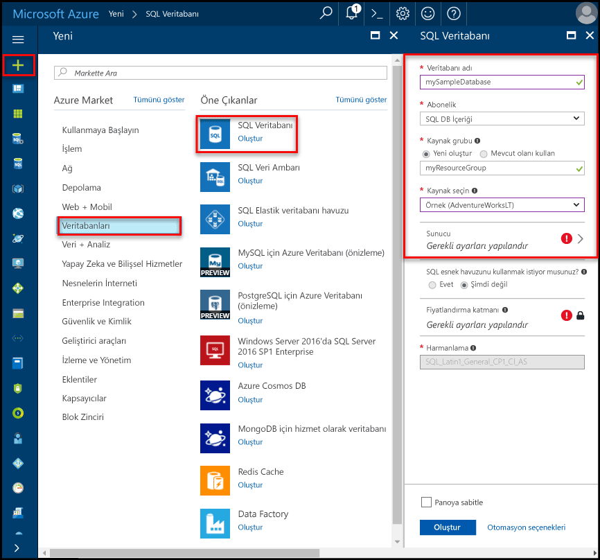
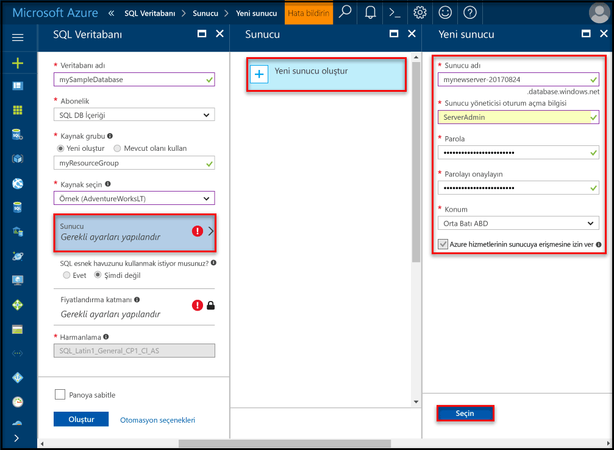
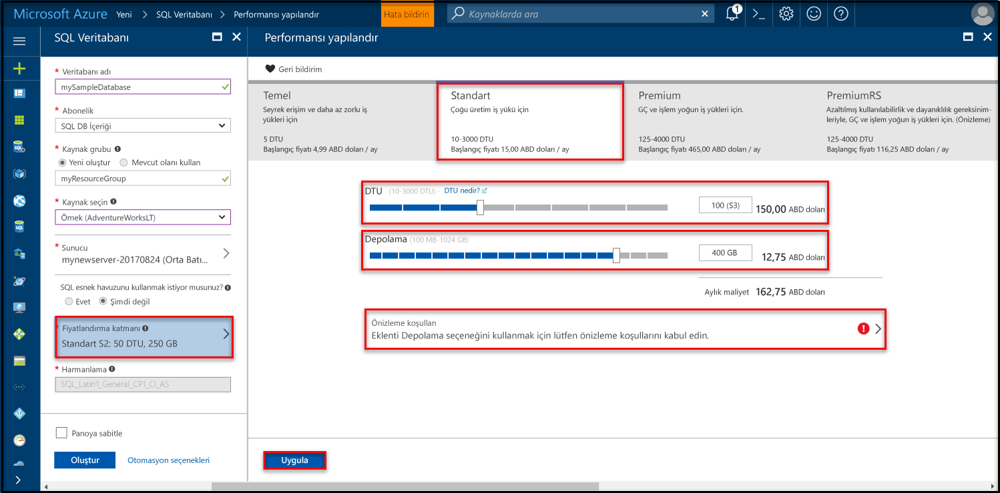

# <a name="create-an-azure-sql-database-in-hello-azure-portal"></a><span data-ttu-id="febcb-105">Hello Azure portalında bir Azure SQL veritabanı oluşturma</span><span class="sxs-lookup"><span data-stu-id="febcb-105">Create an Azure SQL database in hello Azure portal</span></span>

<span data-ttu-id="febcb-106">Bu hızlı başlangıç Öğreticisi nasıl toocreate bir SQL veritabanı Azure'da anlatılmaktadır.</span><span class="sxs-lookup"><span data-stu-id="febcb-106">This quick start tutorial walks through how toocreate a SQL database in Azure.</span></span> <span data-ttu-id="febcb-107">Azure SQL veritabanı bir "veritabanı olarak-hello bulutta toorun ve ölçek yüksek oranda kullanılabilir SQL Server veritabanları sağlayan sunan hizmet" dir.</span><span class="sxs-lookup"><span data-stu-id="febcb-107">Azure SQL Database is a “Database-as-a-Service” offering that enables you toorun and scale highly available SQL Server databases in hello cloud.</span></span> <span data-ttu-id="febcb-108">Bu hızlı başlangıç hello Azure portal kullanarak bir SQL veritabanı oluşturarak tooget nasıl başlatılacağını gösterir.</span><span class="sxs-lookup"><span data-stu-id="febcb-108">This quick start shows you how tooget started by creating a SQL database using hello Azure portal.</span></span>

<span data-ttu-id="febcb-109">Azure aboneliğiniz yoksa başlamadan önce [ücretsiz](https://azure.microsoft.com/free/) bir hesap oluşturun.</span><span class="sxs-lookup"><span data-stu-id="febcb-109">If you don't have an Azure subscription, create a [free](https://azure.microsoft.com/free/) account before you begin.</span></span>

## <a name="log-in-toohello-azure-portal"></a><span data-ttu-id="febcb-110">Toohello Azure portalında oturum açın</span><span class="sxs-lookup"><span data-stu-id="febcb-110">Log in toohello Azure portal</span></span>

<span data-ttu-id="febcb-111">İçinde toohello oturum [Azure portal](https://portal.azure.com/).</span><span class="sxs-lookup"><span data-stu-id="febcb-111">Log in toohello [Azure portal](https://portal.azure.com/).</span></span>

## <a name="create-a-sql-database"></a><span data-ttu-id="febcb-112">SQL veritabanı oluşturma</span><span class="sxs-lookup"><span data-stu-id="febcb-112">Create a SQL database</span></span>

<span data-ttu-id="febcb-113">Azure SQL veritabanı bir dizi [işlem ve depolama kaynağı](sql-database-service-tiers.md) ile oluşturulur.</span><span class="sxs-lookup"><span data-stu-id="febcb-113">An Azure SQL database is created with a defined set of [compute and storage resources](sql-database-service-tiers.md).</span></span> <span data-ttu-id="febcb-114">Merhaba veritabanı içinde oluşturulur bir [Azure kaynak grubu](../azure-resource-manager/resource-group-overview.md) ve bir [Azure SQL Database mantıksal sunucusu](sql-database-features.md).</span><span class="sxs-lookup"><span data-stu-id="febcb-114">hello database is created within an [Azure resource group](../azure-resource-manager/resource-group-overview.md) and in an [Azure SQL Database logical server](sql-database-features.md).</span></span> 

<span data-ttu-id="febcb-115">Bu adımları toocreate hello Adventure Works LT örnek verilerini içeren bir SQL veritabanı izleyin.</span><span class="sxs-lookup"><span data-stu-id="febcb-115">Follow these steps toocreate a SQL database containing hello Adventure Works LT sample data.</span></span> 

1. <span data-ttu-id="febcb-116">Merhaba tıklatın **yeni** düğmesi hello sol üst köşesinin hello Azure portalı üzerinde bulunamadı.</span><span class="sxs-lookup"><span data-stu-id="febcb-116">Click hello **New** button found on hello upper left-hand corner of hello Azure portal.</span></span>

2. <span data-ttu-id="febcb-117">Seçin **veritabanları** hello gelen **yeni** sayfasında ve seçin **SQL veritabanı** hello gelen **veritabanları** sayfası.</span><span class="sxs-lookup"><span data-stu-id="febcb-117">Select **Databases** from hello **New** page, and select **SQL Database** from hello **Databases** page.</span></span>

   

3. <span data-ttu-id="febcb-119">Hello SQL veritabanı formu görüntü önceki hello üzerinde gösterildiği gibi bilgileri, aşağıdaki hello ile doldurun:</span><span class="sxs-lookup"><span data-stu-id="febcb-119">Fill out hello SQL Database form with hello following information, as shown on hello preceding image:</span></span>   

   | <span data-ttu-id="febcb-120">Ayar</span><span class="sxs-lookup"><span data-stu-id="febcb-120">Setting</span></span>       | <span data-ttu-id="febcb-121">Önerilen değer</span><span class="sxs-lookup"><span data-stu-id="febcb-121">Suggested value</span></span> | <span data-ttu-id="febcb-122">Açıklama</span><span class="sxs-lookup"><span data-stu-id="febcb-122">Description</span></span> | 
   | ------------ | ------------------ | ------------------------------------------------- | 
   | <span data-ttu-id="febcb-123">**Veritabanı adı**</span><span class="sxs-lookup"><span data-stu-id="febcb-123">**Database name**</span></span> | <span data-ttu-id="febcb-124">mySampleDatabase</span><span class="sxs-lookup"><span data-stu-id="febcb-124">mySampleDatabase</span></span> | <span data-ttu-id="febcb-125">Geçerli veritabanı adları için bkz. [Veritabanı Tanımlayıcıları](https://docs.microsoft.com/en-us/sql/relational-databases/databases/database-identifiers).</span><span class="sxs-lookup"><span data-stu-id="febcb-125">For valid database names, see [Database Identifiers](https://docs.microsoft.com/en-us/sql/relational-databases/databases/database-identifiers).</span></span> | 
   | <span data-ttu-id="febcb-126">**Abonelik**</span><span class="sxs-lookup"><span data-stu-id="febcb-126">**Subscription**</span></span> | <span data-ttu-id="febcb-127">Aboneliğiniz</span><span class="sxs-lookup"><span data-stu-id="febcb-127">Your subscription</span></span>  | <span data-ttu-id="febcb-128">Abonelikleriniz hakkında daha ayrıntılı bilgi için bkz. [Abonelikler](https://account.windowsazure.com/Subscriptions).</span><span class="sxs-lookup"><span data-stu-id="febcb-128">For details about your subscriptions, see [Subscriptions](https://account.windowsazure.com/Subscriptions).</span></span> |
   | <span data-ttu-id="febcb-129">**Kaynak grubu**</span><span class="sxs-lookup"><span data-stu-id="febcb-129">**Resource group**</span></span>  | <span data-ttu-id="febcb-130">myResourceGroup</span><span class="sxs-lookup"><span data-stu-id="febcb-130">myResourceGroup</span></span> | <span data-ttu-id="febcb-131">Geçerli kaynak grubu adları için bkz. [Adlandırma kuralları ve kısıtlamalar](https://docs.microsoft.com/azure/architecture/best-practices/naming-conventions).</span><span class="sxs-lookup"><span data-stu-id="febcb-131">For valid resource group names, see [Naming rules and restrictions](https://docs.microsoft.com/azure/architecture/best-practices/naming-conventions).</span></span> |
   | <span data-ttu-id="febcb-132">**Kaynak**</span><span class="sxs-lookup"><span data-stu-id="febcb-132">**Source source**</span></span> | <span data-ttu-id="febcb-133">Örnek (AdventureWorksLT)</span><span class="sxs-lookup"><span data-stu-id="febcb-133">Sample (AdventureWorksLT)</span></span> | <span data-ttu-id="febcb-134">Merhaba AdventureWorksLT şeması ve verisi yeni veritabanınıza yükler</span><span class="sxs-lookup"><span data-stu-id="febcb-134">Loads hello AdventureWorksLT schema and data into your new database</span></span> |

   > [!IMPORTANT]
   > <span data-ttu-id="febcb-135">Bu hızlı başlangıç hello kalanı kullanıldığından, bu formda hello örnek veritabanını seçmeniz gerekir.</span><span class="sxs-lookup"><span data-stu-id="febcb-135">You must select hello sample database on this form because it is used in hello remainder of this quick start.</span></span>
   > 

4. <span data-ttu-id="febcb-136">Altında **Server**, tıklatın **gerekli ayarları Yapılandır** ve hello ile SQL server (mantıksal sunucu) form hello doldururken aşağıdaki bilgiler, görüntü aşağıdaki hello üzerinde gösterildiği gibi:</span><span class="sxs-lookup"><span data-stu-id="febcb-136">Under **Server**, click **Configure required settings** and fill out hello SQL server (logical server) form with hello following information, as shown on hello following image:</span></span>   

   | <span data-ttu-id="febcb-137">Ayar</span><span class="sxs-lookup"><span data-stu-id="febcb-137">Setting</span></span>       | <span data-ttu-id="febcb-138">Önerilen değer</span><span class="sxs-lookup"><span data-stu-id="febcb-138">Suggested value</span></span> | <span data-ttu-id="febcb-139">Açıklama</span><span class="sxs-lookup"><span data-stu-id="febcb-139">Description</span></span> | 
   | ------------ | ------------------ | ------------------------------------------------- | 
   | <span data-ttu-id="febcb-140">**Sunucu adı**</span><span class="sxs-lookup"><span data-stu-id="febcb-140">**Server name**</span></span> | <span data-ttu-id="febcb-141">Genel olarak benzersiz bir ad</span><span class="sxs-lookup"><span data-stu-id="febcb-141">Any globally unique name</span></span> | <span data-ttu-id="febcb-142">Geçerli sunucu adları için bkz. [Adlandırma kuralları ve kısıtlamalar](https://docs.microsoft.com/azure/architecture/best-practices/naming-conventions).</span><span class="sxs-lookup"><span data-stu-id="febcb-142">For valid server names, see [Naming rules and restrictions](https://docs.microsoft.com/azure/architecture/best-practices/naming-conventions).</span></span> | 
   | <span data-ttu-id="febcb-143">**Sunucu yöneticisi oturum açma bilgileri**</span><span class="sxs-lookup"><span data-stu-id="febcb-143">**Server admin login**</span></span> | <span data-ttu-id="febcb-144">Geçerli bir ad</span><span class="sxs-lookup"><span data-stu-id="febcb-144">Any valid name</span></span> | <span data-ttu-id="febcb-145">Geçerli oturum açma adları için bkz. [Veritabanı Tanımlayıcıları](https://docs.microsoft.com/en-us/sql/relational-databases/databases/database-identifiers).</span><span class="sxs-lookup"><span data-stu-id="febcb-145">For valid login names, see [Database Identifiers](https://docs.microsoft.com/en-us/sql/relational-databases/databases/database-identifiers).</span></span> |
   | <span data-ttu-id="febcb-146">**Parola**</span><span class="sxs-lookup"><span data-stu-id="febcb-146">**Password**</span></span> | <span data-ttu-id="febcb-147">Geçerli bir parola</span><span class="sxs-lookup"><span data-stu-id="febcb-147">Any valid password</span></span> | <span data-ttu-id="febcb-148">Parolanız en az 8 karakter olmalı ve kategorileri aşağıdaki hello üçünden karakterler içermelidir: büyük harf karakterler, küçük harfler, sayılar ve ve alfasayısal olmayan karakter.</span><span class="sxs-lookup"><span data-stu-id="febcb-148">Your password must have at least 8 characters and must contain characters from three of hello following categories: upper case characters, lower case characters, numbers, and and non-alphanumeric characters.</span></span> |
   | <span data-ttu-id="febcb-149">**Abonelik**</span><span class="sxs-lookup"><span data-stu-id="febcb-149">**Subscription**</span></span> | <span data-ttu-id="febcb-150">Aboneliğiniz</span><span class="sxs-lookup"><span data-stu-id="febcb-150">Your subscription</span></span> | <span data-ttu-id="febcb-151">Abonelikleriniz hakkında daha ayrıntılı bilgi için bkz. [Abonelikler](https://account.windowsazure.com/Subscriptions).</span><span class="sxs-lookup"><span data-stu-id="febcb-151">For details about your subscriptions, see [Subscriptions](https://account.windowsazure.com/Subscriptions).</span></span> |
   | <span data-ttu-id="febcb-152">**Kaynak grubu**</span><span class="sxs-lookup"><span data-stu-id="febcb-152">**Resource group**</span></span> | <span data-ttu-id="febcb-153">myResourceGroup</span><span class="sxs-lookup"><span data-stu-id="febcb-153">myResourceGroup</span></span> | <span data-ttu-id="febcb-154">Geçerli kaynak grubu adları için bkz. [Adlandırma kuralları ve kısıtlamalar](https://docs.microsoft.com/azure/architecture/best-practices/naming-conventions).</span><span class="sxs-lookup"><span data-stu-id="febcb-154">For valid resource group names, see [Naming rules and restrictions](https://docs.microsoft.com/azure/architecture/best-practices/naming-conventions).</span></span> |
   | <span data-ttu-id="febcb-155">**Konum**</span><span class="sxs-lookup"><span data-stu-id="febcb-155">**Location**</span></span> | <span data-ttu-id="febcb-156">Geçerli bir konum</span><span class="sxs-lookup"><span data-stu-id="febcb-156">Any valid location</span></span> | <span data-ttu-id="febcb-157">Bölgeler hakkında bilgi için bkz. [Azure Bölgeleri](https://azure.microsoft.com/regions/).</span><span class="sxs-lookup"><span data-stu-id="febcb-157">For information about regions, see [Azure Regions](https://azure.microsoft.com/regions/).</span></span> |

   > [!IMPORTANT]
   > <span data-ttu-id="febcb-158">Burada belirttiğiniz Hello Sunucu Yöneticisi oturum açma ve parola toohello Server'daki gerekli toolog ve veritabanlarını Bu hızlı başlangıç devamındaki kümesidir.</span><span class="sxs-lookup"><span data-stu-id="febcb-158">hello server admin login and password that you specify here are required toolog in toohello server and its databases later in this quick start.</span></span> <span data-ttu-id="febcb-159">Bu bilgileri daha sonra kullanmak üzere aklınızda tutun veya kaydedin.</span><span class="sxs-lookup"><span data-stu-id="febcb-159">Remember or record this information for later use.</span></span> 
   >  

   

5. <span data-ttu-id="febcb-161">Merhaba formu doldurduğunuzda tıklatın **seçin**.</span><span class="sxs-lookup"><span data-stu-id="febcb-161">When you have completed hello form, click **Select**.</span></span>

6. <span data-ttu-id="febcb-162">Tıklatın **fiyatlandırma katmanı** toospecify hello hizmeti katmanını ve performans düzeyini yeni veritabanı.</span><span class="sxs-lookup"><span data-stu-id="febcb-162">Click **Pricing tier** toospecify hello service tier and performance level for your new database.</span></span> <span data-ttu-id="febcb-163">Merhaba kaydırıcı tooselect kullanmak **20 Dtu'lar** ve **250** GB depolama alanı.</span><span class="sxs-lookup"><span data-stu-id="febcb-163">Use hello slider tooselect **20 DTUs** and **250** GB of storage.</span></span> <span data-ttu-id="febcb-164">DTU hakkında daha fazla bilgi için bkz. [DTU nedir?](sql-database-what-is-a-dtu.md).</span><span class="sxs-lookup"><span data-stu-id="febcb-164">For more information on DTUs, see [What is a DTU?](sql-database-what-is-a-dtu.md).</span></span>

   

7. <span data-ttu-id="febcb-166">Dtu'lar seçili hello miktarını sonra tıklatın **Uygula**.</span><span class="sxs-lookup"><span data-stu-id="febcb-166">After selected hello amount of DTUs, click **Apply**.</span></span>  

8. <span data-ttu-id="febcb-167">Merhaba SQL veritabanı formu tamamladığınıza göre tıklatın **oluşturma** tooprovision hello veritabanı.</span><span class="sxs-lookup"><span data-stu-id="febcb-167">Now that you have completed hello SQL Database form, click **Create** tooprovision hello database.</span></span> <span data-ttu-id="febcb-168">Sağlama birkaç dakika sürer.</span><span class="sxs-lookup"><span data-stu-id="febcb-168">Provisioning takes a few minutes.</span></span> 

9. <span data-ttu-id="febcb-169">Merhaba araç çubuğundan, **bildirimleri** toomonitor hello dağıtım işlemi.</span><span class="sxs-lookup"><span data-stu-id="febcb-169">On hello toolbar, click **Notifications** toomonitor hello deployment process.</span></span>

   

## <a name="create-a-server-level-firewall-rule"></a><span data-ttu-id="febcb-171">Sunucu düzeyinde bir güvenlik duvarı kuralı oluşturma</span><span class="sxs-lookup"><span data-stu-id="febcb-171">Create a server-level firewall rule</span></span>

<span data-ttu-id="febcb-172">Hello SQL veritabanı hizmetinin hello sunucusu düzeyinde-harici uygulamalar ve Araçlar tooopen hello Güvenlik Duvarı'nı belirli IP adresleri için bir güvenlik duvarı kuralı yapılandırılmadığı sürece toohello sunucu veya hello sunucudaki tüm veritabanları bağlanmasını engelleyen bir güvenlik duvarı oluşturur.</span><span class="sxs-lookup"><span data-stu-id="febcb-172">hello SQL Database service creates a firewall at hello server-level that prevents external applications and tools from connecting toohello server or any databases on hello server unless a firewall rule is created tooopen hello firewall for specific IP addresses.</span></span> <span data-ttu-id="febcb-173">Bu adımları toocreate izleyin bir [SQL veritabanı sunucu düzeyinde güvenlik duvarı kuralı](sql-database-firewall-configure.md) için istemcinin IP adresi ve IP adresiniz yalnızca hello SQL veritabanı güvenlik duvarı üzerinden dış bağlantısı etkinleştirin.</span><span class="sxs-lookup"><span data-stu-id="febcb-173">Follow these steps toocreate a [SQL Database server-level firewall rule](sql-database-firewall-configure.md) for your client's IP address and enable external connectivity through hello SQL Database firewall for your IP address only.</span></span> 

> [!NOTE]
> <span data-ttu-id="febcb-174">SQL Veritabanı 1433 numaralı bağlantı noktası üzerinden iletişim kurar.</span><span class="sxs-lookup"><span data-stu-id="febcb-174">SQL Database communicates over port 1433.</span></span> <span data-ttu-id="febcb-175">Bir şirket ağından gelen tooconnect çalışıyorsanız, bağlantı noktası 1433 üzerinden giden trafik, ağınızın güvenlik duvarı tarafından izin verilmiyor.</span><span class="sxs-lookup"><span data-stu-id="febcb-175">If you are trying tooconnect from within a corporate network, outbound traffic over port 1433 may not be allowed by your network's firewall.</span></span> <span data-ttu-id="febcb-176">BT departmanınız 1433 numaralı bağlantı noktasını açar sürece bu durumda, tooyour Azure SQL veritabanı sunucusuna bağlanamıyor.</span><span class="sxs-lookup"><span data-stu-id="febcb-176">If so, you cannot connect tooyour Azure SQL Database server unless your IT department opens port 1433.</span></span>
>

1. <span data-ttu-id="febcb-177">Merhaba dağıtım tamamlandıktan sonra **SQL veritabanları** hello sol menüsünden ve ardından **mySampleDatabase** hello üzerinde **SQL veritabanları** sayfası.</span><span class="sxs-lookup"><span data-stu-id="febcb-177">After hello deployment completes, click **SQL databases** from hello left-hand menu and then click **mySampleDatabase** on hello **SQL databases** page.</span></span> <span data-ttu-id="febcb-178">Merhaba hello tam olarak gösteren, veritabanı açılır genel bakış sayfasında tam sunucu adını (gibi **mynewserver20170313.database.windows.net**) ve diğer yapılandırmalar için seçenekler sağlar.</span><span class="sxs-lookup"><span data-stu-id="febcb-178">hello overview page for your database opens, showing you hello fully qualified server name (such as **mynewserver20170313.database.windows.net**) and provides options for further configuration.</span></span> <span data-ttu-id="febcb-179">Daha sonra kullanmak üzere bu tam sunucu adını kopyalayın.</span><span class="sxs-lookup"><span data-stu-id="febcb-179">Copy this fully qualified server name for use later.</span></span>

   > [!IMPORTANT]
   > <span data-ttu-id="febcb-180">Sonraki hızlı başlatır, veritabanlarını ve bu tam sunucu adı tooconnect tooyour sunucu gerekir.</span><span class="sxs-lookup"><span data-stu-id="febcb-180">You need this fully qualified server name tooconnect tooyour server and its databases in subsequent quick starts.</span></span>
   > 

    

2. <span data-ttu-id="febcb-182">Tıklatın **ayarlayın sunucu Güvenlik Duvarı** hello önceki görüntüde gösterildiği gibi hello araç.</span><span class="sxs-lookup"><span data-stu-id="febcb-182">Click **Set server firewall** on hello toolbar as shown in hello previous image.</span></span> <span data-ttu-id="febcb-183">Merhaba **Güvenlik Duvarı ayarları** hello SQL veritabanı sunucusu sayfasını açar.</span><span class="sxs-lookup"><span data-stu-id="febcb-183">hello **Firewall settings** page for hello SQL Database server opens.</span></span> 

    

3. <span data-ttu-id="febcb-185">Tıklatın **istemci IP'si Ekle** hello araç tooadd üzerinde geçerli IP adresi tooa yeni güvenlik duvarı kuralı.</span><span class="sxs-lookup"><span data-stu-id="febcb-185">Click **Add client IP** on hello toolbar tooadd your current IP address tooa new firewall rule.</span></span> <span data-ttu-id="febcb-186">Güvenlik duvarı kuralı, 1433 numaralı bağlantı noktasını tek bir IP adresi veya bir IP adresi aralığı için açabilir.</span><span class="sxs-lookup"><span data-stu-id="febcb-186">A firewall rule can open port 1433 for a single IP address or a range of IP addresses.</span></span>

4. <span data-ttu-id="febcb-187">**Kaydet** düğmesine tıklayın.</span><span class="sxs-lookup"><span data-stu-id="febcb-187">Click **Save**.</span></span> <span data-ttu-id="febcb-188">Geçerli IP adresiniz hello mantıksal sunucuda bağlantı noktası 1433'ü açmak için bir sunucu düzeyinde güvenlik duvarı kuralı oluşturulur.</span><span class="sxs-lookup"><span data-stu-id="febcb-188">A server-level firewall rule is created for your current IP address opening port 1433 on hello logical server.</span></span>

    

4. <span data-ttu-id="febcb-190">Tıklatın **Tamam** ve hello kapatın **Güvenlik Duvarı ayarları** sayfası.</span><span class="sxs-lookup"><span data-stu-id="febcb-190">Click **OK** and then close hello **Firewall settings** page.</span></span>

<span data-ttu-id="febcb-191">Şimdi toohello SQL veritabanı sunucusunu ve veritabanlarını SQL Server Management Studio veya bu IP adresinden daha önce oluşturulmuş hello server yönetici hesabı kullanarak tercih ettiğiniz başka bir araç kullanarak bağlanabilir.</span><span class="sxs-lookup"><span data-stu-id="febcb-191">You can now connect toohello SQL Database server and its databases using SQL Server Management Studio or another tool of your choice from this IP address using hello server admin account created previously.</span></span>

> [!IMPORTANT]
> <span data-ttu-id="febcb-192">Varsayılan olarak, tüm Azure hizmetlerini hello SQL veritabanı güvenlik duvarı üzerinden erişim etkin.</span><span class="sxs-lookup"><span data-stu-id="febcb-192">By default, access through hello SQL Database firewall is enabled for all Azure services.</span></span> <span data-ttu-id="febcb-193">Tıklatın **OFF** tüm Azure Hizmetleri için bu sayfayı toodisable üzerinde.</span><span class="sxs-lookup"><span data-stu-id="febcb-193">Click **OFF** on this page toodisable for all Azure services.</span></span>
>

## <a name="query-hello-sql-database"></a><span data-ttu-id="febcb-194">Sorgu hello SQL veritabanı</span><span class="sxs-lookup"><span data-stu-id="febcb-194">Query hello SQL database</span></span>

<span data-ttu-id="febcb-195">Azure'da bir örnek veritabanı oluşturduğunuza göre şimdi hello toohello veritabanı ve sorgu hello veri bağlanabilir Azure portal tooconfirm içinde hello yerleşik sorgu aracını kullanın.</span><span class="sxs-lookup"><span data-stu-id="febcb-195">Now that you have created a sample database in Azure, let’s use hello built-in query tool within hello Azure portal tooconfirm that you can connect toohello database and query hello data.</span></span> 

1. <span data-ttu-id="febcb-196">Merhaba SQL veritabanı sayfasında veritabanınız için tıklayın **Araçları** hello araç.</span><span class="sxs-lookup"><span data-stu-id="febcb-196">On hello SQL Database page for your database, click **Tools** on hello toolbar.</span></span> <span data-ttu-id="febcb-197">Merhaba **Araçları** sayfası açılır.</span><span class="sxs-lookup"><span data-stu-id="febcb-197">hello **Tools** page opens.</span></span>

    

2. <span data-ttu-id="febcb-199">Tıklatın **sorgu Düzenleyicisi'ni (Önizleme)**, hello tıklatın **Önizleme koşulları** onay kutusunu ve ardından **Tamam**.</span><span class="sxs-lookup"><span data-stu-id="febcb-199">Click **Query editor (preview)**, click hello **Preview terms** checkbox, and then click **OK**.</span></span> <span data-ttu-id="febcb-200">Merhaba sorgu Düzenleyicisi sayfası açılır.</span><span class="sxs-lookup"><span data-stu-id="febcb-200">hello Query editor page opens.</span></span>

3. <span data-ttu-id="febcb-201">Tıklatın **oturum açma** seçip, istendiğinde **SQL server kimlik doğrulaması** hello Sunucu Yöneticisi oturum açma ve ve daha önce oluşturduğunuz parolayı girin.</span><span class="sxs-lookup"><span data-stu-id="febcb-201">Click **Login** and then, when prompted, select **SQL server authentication** and then provide hello server admin login and password that you created earlier.</span></span>

    

4. <span data-ttu-id="febcb-203">Tıklatın **Tamam** toolog içinde.</span><span class="sxs-lookup"><span data-stu-id="febcb-203">Click **OK** toolog in.</span></span>

5. <span data-ttu-id="febcb-204">Doğrulandıktan sonra sorgu hello sorgu Düzenleyicisi'ni bölmesinde aşağıdaki hello yazın.</span><span class="sxs-lookup"><span data-stu-id="febcb-204">After you are authenticated, type hello following query in hello query editor pane.</span></span>

   ```sql
   SELECT TOP 20 pc.Name as CategoryName, p.name as ProductName
   FROM SalesLT.ProductCategory pc
   JOIN SalesLT.Product p
   ON pc.productcategoryid = p.productcategoryid;
   ```

6. <span data-ttu-id="febcb-205">Tıklatın **çalıştırmak** ve hello hello sorgu sonuçları gözden geçirin **sonuçları** bölmesi.</span><span class="sxs-lookup"><span data-stu-id="febcb-205">Click **Run** and then review hello query results in hello **Results** pane.</span></span>

   

7. <span data-ttu-id="febcb-207">Kapat hello **sorgu Düzenleyicisi'ni** sayfası ve hello **Araçları** sayfası.</span><span class="sxs-lookup"><span data-stu-id="febcb-207">Close hello **Query editor** page and hello **Tools** page.</span></span>

## <a name="clean-up-resources"></a><span data-ttu-id="febcb-208">Kaynakları temizleme</span><span class="sxs-lookup"><span data-stu-id="febcb-208">Clean up resources</span></span>

<span data-ttu-id="febcb-209">Başka bir hızlı başlangıç/öğretici için gerekmeyen bu kaynakları (bkz [sonraki adımlar](#next-steps)), bunları hello aşağıdakileri yaparak silin:</span><span class="sxs-lookup"><span data-stu-id="febcb-209">If you don't need these resources for another quickstart/tutorial (see [Next steps](#next-steps)), you can delete them by doing hello following:</span></span>


1. <span data-ttu-id="febcb-210">Merhaba sol taraftaki menüden hello Azure portal'ın, **kaynak grupları** ve ardından **myResourceGroup**.</span><span class="sxs-lookup"><span data-stu-id="febcb-210">From hello left-hand menu in hello Azure portal, click **Resource groups** and then click **myResourceGroup**.</span></span> 
2. <span data-ttu-id="febcb-211">Kaynak grubu sayfanızda tıklatın **silmek**, türü **myResourceGroup** hello metin kutusuna ve ardından **silmek**.</span><span class="sxs-lookup"><span data-stu-id="febcb-211">On your resource group page, click **Delete**, type **myResourceGroup** in hello text box, and then click **Delete**.</span></span>

## <a name="next-steps"></a><span data-ttu-id="febcb-212">Sonraki adımlar</span><span class="sxs-lookup"><span data-stu-id="febcb-212">Next steps</span></span>

<span data-ttu-id="febcb-213">Artık bir veritabanınız olduğuna göre, sık kullandığınız araçlarla bağlanabilir ve sorgulayabilirsiniz.</span><span class="sxs-lookup"><span data-stu-id="febcb-213">Now that you have a database, you can connect and query using your favorite tools.</span></span> <span data-ttu-id="febcb-214">Aşağıdan aracınızı seçerek daha fazla bilgi edinin:</span><span class="sxs-lookup"><span data-stu-id="febcb-214">Learn more by choosing your tool below:</span></span>

- [<span data-ttu-id="febcb-215">SQL Server Management Studio</span><span class="sxs-lookup"><span data-stu-id="febcb-215">SQL Server Management Studio</span></span>](sql-database-connect-query-ssms.md)
- [<span data-ttu-id="febcb-216">Visual Studio Code</span><span class="sxs-lookup"><span data-stu-id="febcb-216">Visual Studio Code</span></span>](sql-database-connect-query-vscode.md)
- [<span data-ttu-id="febcb-217">.NET</span><span class="sxs-lookup"><span data-stu-id="febcb-217">.NET</span></span>](sql-database-connect-query-dotnet.md)
- [<span data-ttu-id="febcb-218">PHP</span><span class="sxs-lookup"><span data-stu-id="febcb-218">PHP</span></span>](sql-database-connect-query-php.md)
- [<span data-ttu-id="febcb-219">Node.js</span><span class="sxs-lookup"><span data-stu-id="febcb-219">Node.js</span></span>](sql-database-connect-query-nodejs.md)
- [<span data-ttu-id="febcb-220">Java</span><span class="sxs-lookup"><span data-stu-id="febcb-220">Java</span></span>](sql-database-connect-query-java.md)
- [<span data-ttu-id="febcb-221">Python</span><span class="sxs-lookup"><span data-stu-id="febcb-221">Python</span></span>](sql-database-connect-query-python.md)
- [<span data-ttu-id="febcb-222">Ruby</span><span class="sxs-lookup"><span data-stu-id="febcb-222">Ruby</span></span>](sql-database-connect-query-ruby.md)
