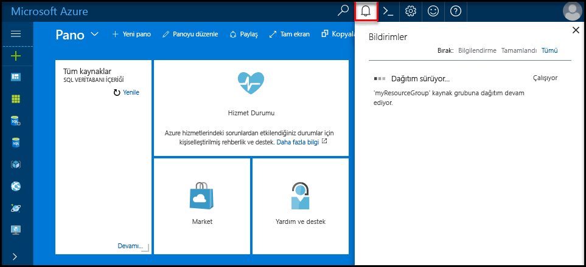

# <a name="create-an-azure-sql-database-in-hello-azure-portal"></a>Hello Azure portalında bir Azure SQL veritabanı oluşturma

Bu hızlı başlangıç Öğreticisi nasıl toocreate bir SQL veritabanı Azure'da anlatılmaktadır. Azure SQL veritabanı bir "veritabanı olarak-hello bulutta toorun ve ölçek yüksek oranda kullanılabilir SQL Server veritabanları sağlayan sunan hizmet" dir. Bu hızlı başlangıç hello Azure portal kullanarak bir SQL veritabanı oluşturarak tooget nasıl başlatılacağını gösterir.

Azure aboneliğiniz yoksa başlamadan önce [ücretsiz](https://azure.microsoft.com/free/) bir hesap oluşturun.

## <a name="log-in-toohello-azure-portal"></a>Toohello Azure portalında oturum açın

İçinde toohello oturum [Azure portal](https://portal.azure.com/).

## <a name="create-a-sql-database"></a>SQL veritabanı oluşturma

Azure SQL veritabanı bir dizi [işlem ve depolama kaynağı](sql-database-service-tiers.md) ile oluşturulur. Merhaba veritabanı içinde oluşturulur bir [Azure kaynak grubu](../azure-resource-manager/resource-group-overview.md) ve bir [Azure SQL Database mantıksal sunucusu](sql-database-features.md). 

Bu adımları toocreate hello Adventure Works LT örnek verilerini içeren bir SQL veritabanı izleyin. 

1. Merhaba tıklatın **yeni** düğmesi hello sol üst köşesinin hello Azure portalı üzerinde bulunamadı.

2. Seçin **veritabanları** hello gelen **yeni** sayfasında ve seçin **SQL veritabanı** hello gelen **veritabanları** sayfası.

   

3. Hello SQL veritabanı formu görüntü önceki hello üzerinde gösterildiği gibi bilgileri, aşağıdaki hello ile doldurun:   

   | Ayar       | Önerilen değer | Açıklama | 
   | ------------ | ------------------ | ------------------------------------------------- | 
   | **Veritabanı adı** | mySampleDatabase | Geçerli veritabanı adları için bkz. [Veritabanı Tanımlayıcıları](https://docs.microsoft.com/en-us/sql/relational-databases/databases/database-identifiers). | 
   | **Abonelik** | Aboneliğiniz  | Abonelikleriniz hakkında daha ayrıntılı bilgi için bkz. [Abonelikler](https://account.windowsazure.com/Subscriptions). |
   | **Kaynak grubu**  | myResourceGroup | Geçerli kaynak grubu adları için bkz. [Adlandırma kuralları ve kısıtlamalar](https://docs.microsoft.com/azure/architecture/best-practices/naming-conventions). |
   | **Kaynak** | Örnek (AdventureWorksLT) | Merhaba AdventureWorksLT şeması ve verisi yeni veritabanınıza yükler |

   > [!IMPORTANT]
   > Bu hızlı başlangıç hello kalanı kullanıldığından, bu formda hello örnek veritabanını seçmeniz gerekir.
   > 

4. Altında **Server**, tıklatın **gerekli ayarları Yapılandır** ve hello ile SQL server (mantıksal sunucu) form hello doldururken aşağıdaki bilgiler, görüntü aşağıdaki hello üzerinde gösterildiği gibi:   

   | Ayar       | Önerilen değer | Açıklama | 
   | ------------ | ------------------ | ------------------------------------------------- | 
   | **Sunucu adı** | Genel olarak benzersiz bir ad | Geçerli sunucu adları için bkz. [Adlandırma kuralları ve kısıtlamalar](https://docs.microsoft.com/azure/architecture/best-practices/naming-conventions). | 
   | **Sunucu yöneticisi oturum açma bilgileri** | Geçerli bir ad | Geçerli oturum açma adları için bkz. [Veritabanı Tanımlayıcıları](https://docs.microsoft.com/en-us/sql/relational-databases/databases/database-identifiers). |
   | **Parola** | Geçerli bir parola | Parolanız en az 8 karakter olmalı ve kategorileri aşağıdaki hello üçünden karakterler içermelidir: büyük harf karakterler, küçük harfler, sayılar ve ve alfasayısal olmayan karakter. |
   | **Abonelik** | Aboneliğiniz | Abonelikleriniz hakkında daha ayrıntılı bilgi için bkz. [Abonelikler](https://account.windowsazure.com/Subscriptions). |
   | **Kaynak grubu** | myResourceGroup | Geçerli kaynak grubu adları için bkz. [Adlandırma kuralları ve kısıtlamalar](https://docs.microsoft.com/azure/architecture/best-practices/naming-conventions). |
   | **Konum** | Geçerli bir konum | Bölgeler hakkında bilgi için bkz. [Azure Bölgeleri](https://azure.microsoft.com/regions/). |

   > [!IMPORTANT]
   > Burada belirttiğiniz Hello Sunucu Yöneticisi oturum açma ve parola toohello Server'daki gerekli toolog ve veritabanlarını Bu hızlı başlangıç devamındaki kümesidir. Bu bilgileri daha sonra kullanmak üzere aklınızda tutun veya kaydedin. 
   >  

   

5. Merhaba formu doldurduğunuzda tıklatın **seçin**.

6. Tıklatın **fiyatlandırma katmanı** toospecify hello hizmeti katmanını ve performans düzeyini yeni veritabanı. Merhaba kaydırıcı tooselect kullanmak **20 Dtu'lar** ve **250** GB depolama alanı. DTU hakkında daha fazla bilgi için bkz. [DTU nedir?](sql-database-what-is-a-dtu.md).

   

7. Dtu'lar seçili hello miktarını sonra tıklatın **Uygula**.  

8. Merhaba SQL veritabanı formu tamamladığınıza göre tıklatın **oluşturma** tooprovision hello veritabanı. Sağlama birkaç dakika sürer. 

9. Merhaba araç çubuğundan, **bildirimleri** toomonitor hello dağıtım işlemi.

   

## <a name="create-a-server-level-firewall-rule"></a>Sunucu düzeyinde bir güvenlik duvarı kuralı oluşturma

Hello SQL veritabanı hizmetinin hello sunucusu düzeyinde-harici uygulamalar ve Araçlar tooopen hello Güvenlik Duvarı'nı belirli IP adresleri için bir güvenlik duvarı kuralı yapılandırılmadığı sürece toohello sunucu veya hello sunucudaki tüm veritabanları bağlanmasını engelleyen bir güvenlik duvarı oluşturur. Bu adımları toocreate izleyin bir [SQL veritabanı sunucu düzeyinde güvenlik duvarı kuralı](sql-database-firewall-configure.md) için istemcinin IP adresi ve IP adresiniz yalnızca hello SQL veritabanı güvenlik duvarı üzerinden dış bağlantısı etkinleştirin. 

> [!NOTE]
> SQL Veritabanı 1433 numaralı bağlantı noktası üzerinden iletişim kurar. Bir şirket ağından gelen tooconnect çalışıyorsanız, bağlantı noktası 1433 üzerinden giden trafik, ağınızın güvenlik duvarı tarafından izin verilmiyor. BT departmanınız 1433 numaralı bağlantı noktasını açar sürece bu durumda, tooyour Azure SQL veritabanı sunucusuna bağlanamıyor.
>

1. Merhaba dağıtım tamamlandıktan sonra **SQL veritabanları** hello sol menüsünden ve ardından **mySampleDatabase** hello üzerinde **SQL veritabanları** sayfası. Merhaba hello tam olarak gösteren, veritabanı açılır genel bakış sayfasında tam sunucu adını (gibi **mynewserver20170313.database.windows.net**) ve diğer yapılandırmalar için seçenekler sağlar. Daha sonra kullanmak üzere bu tam sunucu adını kopyalayın.

   > [!IMPORTANT]
   > Sonraki hızlı başlatır, veritabanlarını ve bu tam sunucu adı tooconnect tooyour sunucu gerekir.
   > 

    

2. Tıklatın **ayarlayın sunucu Güvenlik Duvarı** hello önceki görüntüde gösterildiği gibi hello araç. Merhaba **Güvenlik Duvarı ayarları** hello SQL veritabanı sunucusu sayfasını açar. 

    

3. Tıklatın **istemci IP'si Ekle** hello araç tooadd üzerinde geçerli IP adresi tooa yeni güvenlik duvarı kuralı. Güvenlik duvarı kuralı, 1433 numaralı bağlantı noktasını tek bir IP adresi veya bir IP adresi aralığı için açabilir.

4. **Kaydet** düğmesine tıklayın. Geçerli IP adresiniz hello mantıksal sunucuda bağlantı noktası 1433'ü açmak için bir sunucu düzeyinde güvenlik duvarı kuralı oluşturulur.

    

4. Tıklatın **Tamam** ve hello kapatın **Güvenlik Duvarı ayarları** sayfası.

Şimdi toohello SQL veritabanı sunucusunu ve veritabanlarını SQL Server Management Studio veya bu IP adresinden daha önce oluşturulmuş hello server yönetici hesabı kullanarak tercih ettiğiniz başka bir araç kullanarak bağlanabilir.

> [!IMPORTANT]
> Varsayılan olarak, tüm Azure hizmetlerini hello SQL veritabanı güvenlik duvarı üzerinden erişim etkin. Tıklatın **OFF** tüm Azure Hizmetleri için bu sayfayı toodisable üzerinde.
>

## <a name="query-hello-sql-database"></a>Sorgu hello SQL veritabanı

Azure'da bir örnek veritabanı oluşturduğunuza göre şimdi hello toohello veritabanı ve sorgu hello veri bağlanabilir Azure portal tooconfirm içinde hello yerleşik sorgu aracını kullanın. 

1. Merhaba SQL veritabanı sayfasında veritabanınız için tıklayın **Araçları** hello araç. Merhaba **Araçları** sayfası açılır.

    

2. Tıklatın **sorgu Düzenleyicisi'ni (Önizleme)**, hello tıklatın **Önizleme koşulları** onay kutusunu ve ardından **Tamam**. Merhaba sorgu Düzenleyicisi sayfası açılır.

3. Tıklatın **oturum açma** seçip, istendiğinde **SQL server kimlik doğrulaması** hello Sunucu Yöneticisi oturum açma ve ve daha önce oluşturduğunuz parolayı girin.

    

4. Tıklatın **Tamam** toolog içinde.

5. Doğrulandıktan sonra sorgu hello sorgu Düzenleyicisi'ni bölmesinde aşağıdaki hello yazın.

   ```sql
   SELECT TOP 20 pc.Name as CategoryName, p.name as ProductName
   FROM SalesLT.ProductCategory pc
   JOIN SalesLT.Product p
   ON pc.productcategoryid = p.productcategoryid;
   ```

6. Tıklatın **çalıştırmak** ve hello hello sorgu sonuçları gözden geçirin **sonuçları** bölmesi.

   

7. Kapat hello **sorgu Düzenleyicisi'ni** sayfası ve hello **Araçları** sayfası.

## <a name="clean-up-resources"></a>Kaynakları temizleme

Başka bir hızlı başlangıç/öğretici için gerekmeyen bu kaynakları (bkz [sonraki adımlar](#next-steps)), bunları hello aşağıdakileri yaparak silin:


1. Merhaba sol taraftaki menüden hello Azure portal'ın, **kaynak grupları** ve ardından **myResourceGroup**. 
2. Kaynak grubu sayfanızda tıklatın **silmek**, türü **myResourceGroup** hello metin kutusuna ve ardından **silmek**.

## <a name="next-steps"></a>Sonraki adımlar

Artık bir veritabanınız olduğuna göre, sık kullandığınız araçlarla bağlanabilir ve sorgulayabilirsiniz. Aşağıdan aracınızı seçerek daha fazla bilgi edinin:

- [SQL Server Management Studio](sql-database-connect-query-ssms.md)
- [Visual Studio Code](sql-database-connect-query-vscode.md)
- [.NET](sql-database-connect-query-dotnet.md)
- [PHP](sql-database-connect-query-php.md)
- [Node.js](sql-database-connect-query-nodejs.md)
- [Java](sql-database-connect-query-java.md)
- [Python](sql-database-connect-query-python.md)
- [Ruby](sql-database-connect-query-ruby.md)
