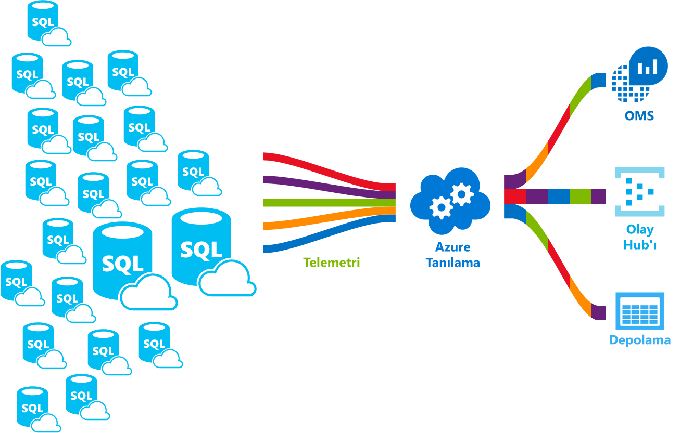

# <a name="azure-sql-database-metrics-and-diagnostics-logging"></a>Azure SQL Database ölçümleri ve tanılama günlükleri 
Azure SQL Database ölçümleri ve daha kolay izleme için tanılama günlükleri yayma. Azure SQL veritabanı toostore kaynak kullanımı, çalışanlar ve oturumlar ve bu Azure kaynakları birine bağlantısını yapılandırabilirsiniz:
- **Azure Depolama**: Küçük maliyetlerle çok sayıda telemetri arşivleme için
- **Azure Event Hub**: Azure SQL veritabanı telemetri özel izleme çözümü veya etkin işlem hatları ile tümleştirmek için
- **Azure günlük analizi**: için izleme çözümü bildirimi, uyarı ve yetenekleri Azaltıcı hello kutusu dışında 

    

## <a name="enable-logging"></a>Günlü kaydını etkinleştir

Ölçümleri ve Tanılama Günlüğü varsayılan olarak etkinleştirilmedi. Etkinleştirme ve ölçümleri ve tanılama günlükleri yöntemler aşağıdaki hello birini kullanarak yönetebilirsiniz:
- Azure portalına
- PowerShell
- Azure CLI
- REST API 
- Resource Manager şablonu

Ölçümleri ve tanılama günlükleri etkinleştirdiğinizde, burada seçilen verileri toplanır Azure kaynak toospecify hello gerekir. Seçenekleri kullanılabilir:
- Log Analytics
- Olay Hub'ı
- Azure Storage 

Yeni bir Azure kaynak sağlama veya var olan bir kaynak seçin. Merhaba depolama kaynağı seçtikten sonra hangi veri toocollect toospecify gerekir. Kullanılabilir seçenekler şunlardır:

- **[1 dakikalık ölçümleri](sql-database-metrics-diag-logging.md#1-minute-metrics)**  -içeren DTU yüzdesi, DTU sınırı, CPU yüzdesi, fiziksel veri okuma yüzdesi, günlük yazma yüzdesi, başarılı/başarısız/engellenen Güvenlik Duvarı bağlantılarını, oturumlar yüzdesi, çalışanların yüzdesi Depolama, depolama yüzdesi, XTP depolama yüzdesi

Olay hub'ı veya bir AzureStorage hesabı belirtirseniz, seçilen bir zaman dilimi silinir daha eski olan verilerin bir bekletme ilkesi toospecify belirtebilirsiniz. Günlük analizi belirtirseniz, hello bekletme ilkesi hello seçilen fiyatlandırma katmanı bağlıdır. Daha fazla bilgi edinin [günlük analizi fiyatlandırma](https://azure.microsoft.com/pricing/details/log-analytics/). 

Her iki hello okumanızı öneririz [Microsoft Azure ölçümlerini genel bakış](../monitoring-and-diagnostics/monitoring-overview-metrics.md) ve [genel bakış, Azure tanılama günlükleri](../monitoring-and-diagnostics/monitoring-overview-of-diagnostic-logs.md) toogain bir anlayış nasıl değil yalnızca makaleler hello ancak tooenable günlüğe kaydetme Ölçümleri ve günlük kategorileri çeşitli Azure hizmetlerine hello tarafından desteklenir.

### <a name="azure-portal"></a>Azure portalına

tooenable ölçümleri ve hello Azure portal, tanılama günlüklerini toplama tooyour Azure SQL veritabanı veya esnek havuz sayfasına gidin ve ardından **tanılama ayarlarını**.

   

### <a name="powershell"></a>PowerShell

tooenable ölçümleri ve günlük kaydı tanılama PowerShell kullanarak hello aşağıdaki komutları kullanın:

- bir depolama hesabında tanılama günlüklerinin tooenable depolama bu komutu kullanın:

   ```powershell
   Set-AzureRmDiagnosticSetting -ResourceId [your resource id] -StorageAccountId [your storage account id] -Enabled $true
   ```

   Merhaba depolama hesabı toowhich toosend hello istediğiniz günlükleri için hello depolama hesabı kimliği hello kaynak kimliğidir.

- Tanılama günlüklerini tooan olay hub'ı tooenable akış bu komutu kullanın:

   ```powershell
   Set-AzureRmDiagnosticSetting -ResourceId [your resource id] -ServiceBusRuleId [your service bus rule id] -Enabled $true
   ```

   Merhaba Service Bus kural kimliği bu biçiminde bir dize şöyledir:

   ```powershell
   {service bus resource ID}/authorizationrules/{key name}
   ``` 

- Tanılama günlüklerini tooa günlük analizi çalışma alanının tooenable gönderme bu komutu kullanın:

   ```powershell
   Set-AzureRmDiagnosticSetting -ResourceId [your resource id] -WorkspaceId [resource id of hello log analytics workspace] -Enabled $true
   ```

- Merhaba kaynak kimliği komutu aşağıdaki hello kullanarak günlük analizi çalışma alanınızın elde edebilirsiniz:

   ```powershell
   (Get-AzureRmOperationalInsightsWorkspace).ResourceId
   ```

Bu parametreleri tooenable birden çok çıktı seçenekleri birleştirebilirsiniz.

### <a name="cli"></a>CLI

tooenable ölçümleri ve günlük Tanılama'yı kullanarak Azure CLI, aşağıdaki komutları kullanın hello hello:

- bir depolama hesabında tanılama günlüklerinin tooenable depolama bu komutu kullanın:

   ```azurecli-interactive
   azure insights diagnostic set --resourceId <resourceId> --storageId <storageAccountId> --enabled true
   ```

   Merhaba depolama hesabı toowhich toosend hello istediğiniz günlükleri için hello depolama hesabı kimliği hello kaynak kimliğidir.

- Tanılama günlüklerini tooan olay hub'ı tooenable akış bu komutu kullanın:

   ```azurecli-interactive
   azure insights diagnostic set --resourceId <resourceId> --serviceBusRuleId <serviceBusRuleId> --enabled true
   ```

   Merhaba Service Bus kural kimliği bu biçiminde bir dize şöyledir:

   ```azurecli-interactive
   {service bus resource ID}/authorizationrules/{key name}
   ```

- Tanılama günlüklerini tooa günlük analizi çalışma alanının tooenable gönderme bu komutu kullanın:

   ```azurecli-interactive
   azure insights diagnostic set --resourceId <resourceId> --workspaceId <resource id of hello log analytics workspace> --enabled true
   ```

Bu parametreleri tooenable birden çok çıktı seçenekleri birleştirebilirsiniz.

### <a name="rest-api"></a>REST API

Hakkında çok okuma[hello Azure İzleyici REST API'sini kullanarak tanılama ayarlarını değiştirme](https://msdn.microsoft.com/library/azure/dn931931.aspx). 

### <a name="resource-manager-template"></a>Resource Manager şablonu

Hakkında çok okuma[Resource Manager şablonu kullanarak kaynak oluşturmada tanılama ayarlarını etkinleştirin](../monitoring-and-diagnostics/monitoring-enable-diagnostic-logs-using-template.md). 

## <a name="stream-into-log-analytics"></a>Günlük analizi akışa 
Azure SQL Database ölçümleri ve tanılama günlüklerini hello portalında veya Azure PowerShell cmdlet'leri, Azure CLI veya Azure İzleyici REST aracılığıyla tanılama ayarında günlük analizi etkinleştirerek hello yerleşik "tooLog Analytics Gönder" seçeneğini kullanarak günlük analizi içine gönderilebilen API.

### <a name="installation-overview"></a>Yüklemeye genel bakış

Azure SQL veritabanı Donanma izleme günlük analizi ile basit bir işlemdir. Üç adım gerekli değildir:

1.  Günlük analizi kaynağı oluşturma
2.  Günlük analizi oluşturulan hello veritabanları toorecord ölçümleri ve tanılama günlüklerini yapılandırma
3.  Yükleme **Azure SQL analizi** günlük analizi Galerisi'nde çözüm

### <a name="create-log-analytics-resource"></a>Günlük analizi kaynağı oluşturma

1. Tıklatın **yeni** hello sol menüde.
2. Tıklatın **izleme + Yönetimi**
3. Tıklatın **günlük analizi**
4. Gerekli hello ek bilgilerle Hello günlük analizi formu doldurun: çalışma alanı adı, abonelik, kaynak grubu, konum ve fiyatlandırma katmanı.

   

### <a name="configure-databases-toorecord-metrics-and-diagnostic-logs"></a>Veritabanlarını toorecord ölçümleri ve tanılama günlüklerini yapılandırma

Burada veritabanları kendi ölçümleri kayıt hello en kolay yolu tooconfigure hello Azure portal ' dir. Azure portal Merhaba, tooyour Azure SQL veritabanı kaynak gidin ve'ı tıklatın **tanılama ayarları**. 

### <a name="install-hello-azure-sql-analytics-solution-from-gallery"></a>Galeriden Hello Azure SQL analiz çözümü yükleyin  

1. Merhaba günlük analizi kaynak oluşturup verilerinizi içine akan sonra Azure SQL analiz çözümü yükleyin. Bu hello yapılabilir **Çözümleri Galerisi** , hello OMS giriş sayfası ve hello yan menüde bulabilirsiniz. Merhaba Galerisi'nde bulun ve tıklatın **Azure SQL analizi** çözümü ve tıklatın **Ekle**.

   

2. OMS sayfanız üzerinde yeni bir kutucuk olarak adlandırılan **Azure SQL analizi** görüntülenir. Bu döşeme seçilerek hello Azure SQL analizi panosu açılır.

### <a name="using-azure-sql-analytics-solution"></a>Azure SQL analiz çözümü kullanma

Azure SQL analizi hello hiyerarşisi Azure SQL veritabanı kaynakları aracılığıyla toonavigate sağlayan hiyerarşik bir Pano ' dir. Bu yeteneği sağlar, toodo, ancak aynı zamanda izleme üst düzey tooscope etkinleştirir izleme toojust hello sağ kaynakları ayarlayın.
Pano farklı kaynaklar seçili hello kaynak altında hello listesini içerir. Örneğin, seçili abonelik için hello gördüğünüz tüm sunucular, esnek havuzlar ve toohello ait veritabanları seçili abonelik. Ayrıca, esnek havuzlar ve veritabanları için bu kaynağın hello kaynak kullanım ölçümleri görebilirsiniz. Bu grafik DTU, CPU, g/ç, günlük, oturumlar, çalışanlar, bağlantıları ve GB depolama içerir.

## <a name="stream-into-azure-event-hub"></a>Azure Event hub'ı akışa

Azure SQL Database ölçümleri ve tanılama günlükleri, olay hub'ı hello portalında veya Azure PowerShell cmdlet'leri, Azure CLI veya Azure İzleyici REST aracılığıyla tanılama ayarında Service Bus kural kimliği etkinleştirerek hello yerleşik "akış tooan olay hub'ı" seçeneğini kullanarak içine gönderilebilen API. 

### <a name="what-toodo-with-metrics-and-diagnostic-logs-in-event-hub"></a>Hangi toodo ölçümleri ve Event Hub'ındaki tanılama günlükleri ile?
Olay Hub'ına seçili hello veri akışı verdikten sonra Gelişmiş izleme senaryolarında bir adım daha yakından tooenabling demektir. Olay hub'ları hello bir olay komut zincirinin "ön kapı" olarak görev yapan ve veriler bir Event Hub'ına toplandıktan sonra dönüştürülebilir ve tüm gerçek zamanlı analiz sağlayıcısı veya toplu işlem/depolama bağdaştırıcısı kullanılarak saklanır. Olay hub'ları, böylece olay tüketicileri hello olayları kendi zamanlamalarında erişebilir hello üretim hello üretimini ilgili olayların olay akışının ayırır. Olay hub'ı hakkında daha fazla bilgi için bkz:

- [Azure Event Hubs nedir](../event-hubs/event-hubs-what-is-event-hubs.md)?
- [Event Hubs kullanmaya başlayın](../event-hubs/event-hubs-csharp-ephcs-getstarted.md)


Yetenek akış hello kullanabilir birkaç yollar şunlardır:

-   Görüntüleme hizmet durumu "etkin yolunuzda" veri tooPowerBI - olay hub'ı kullanarak, akış analizi ve Powerbı, akış tarafından kolayca ölçümleri ve tanılama verilerinizi yakın gerçek zamanlı Öngörüler Azure hizmetlerinizi dönüştürebilirsiniz. Nasıl tooset bir olay hub'ları, Yukarı Akış Analizi ile verileri işlemek ve Powerbı çıkış olarak kullanan bir genel bakış için bkz: [akış analizi ve Power BI](../stream-analytics/stream-analytics-power-bi-dashboard.md).
-   Akış günlükleri toothird taraf günlüğe kaydetme ve telemetri akışları – kullanarak Event Hubs, akış ölçümleri ve tanılama günlüklerini toodifferent üçüncü taraf izleme ve günlük analiz çözümleri elde edebilirsiniz. 
-   Bir özel telemetri ve günlüğe kaydetme platformu – özel olarak geliştirilmiş telemetri platform zaten varsa veya olan tanılama günlüklerini alma yalnızca biri, yüksek düzeyde ölçeklenebilir hello yayımlama-abone olma yapı hakkında olay hub'ları yapısını tooflexibly sağlar düşünüyorum oluşturun. Bkz: [küresel ölçekteki telemetri Platform Dan Rosanova'nın Kılavuzu toousing olay hub'ları](https://azure.microsoft.com/documentation/videos/build-2015-designing-and-sizing-a-global-scale-telemetry-platform-on-azure-event-Hubs/).

## <a name="stream-into-azure-storage"></a>Azure depolama alanına akış

Azure SQL veritabanı ölçümleri ve tanılama günlüklerini Azure hello Azure portalında veya Azure Storage Azure PowerShell cmdlet'leri, Azure CLI ya da Azure tanılama ayarı etkinleştirerek hello yerleşik "tooa depolama hesabı Arşiv" seçeneğini kullanarak depolama alanına depolanabilir İzleyici REST API.

### <a name="schema-of-metrics-and-diagnostic-logs-in-hello-storage-account"></a>Ölçümleri ve tanılama günlüklerini hello depolama hesabındaki şeması

Ölçümleri ve tanılama günlüklerini toplama ayarladıktan sonra bir depolama kapsayıcısı hello ilk veri satırı kullanılamadığında seçtiğiniz hello depolama hesabı oluşturulur. Bu BLOB Hello yapıdır:

```powershell
insights-{metrics|logs}-{category name}/resourceId=/SUBSCRIPTIONS/{subscription ID}/ RESOURCEGROUPS/{resource group name}/PROVIDERS/Microsoft.SQL/servers/{resource_server}/ databases/{database_name}/y={four-digit numeric year}/m={two-digit numeric month}/d={two-digit numeric day}/h={two-digit 24-hour clock hour}/m=00/PT1H.json
```
    
Veya daha basit bir şekilde:

```powershell
insights-{metrics|logs}-{category name}/resourceId=/{resource Id}/y={four-digit numeric year}/m={two-digit numeric month}/d={two-digit numeric day}/h={two-digit 24-hour clock hour}/m=00/PT1H.json
```

Örneğin, bir blob adı 1 dakikalık ölçümünün olabilir:

```powershell
insights-metrics-minute/resourceId=/SUBSCRIPTIONS/s1id1234-5679-0123-4567-890123456789/RESOURCEGROUPS/TESTRESOURCEGROUP/PROVIDERS/MICROSOFT.SQL/ servers/Server1/databases/database1/y=2016/m=08/d=22/h=18/m=00/PT1H.json
```

Merhaba esnek havuz toorecord hello verileri istemeniz durumunda, blob adı biraz farklıdır:

```powershell
insights-{metrics|logs}-{category name}/resourceId=/SUBSCRIPTIONS/{subscription ID}/ RESOURCEGROUPS/{resource group name}/PROVIDERS/Microsoft.SQL/servers/{resource_server}/ elasticPools/{elastic_pool_name}/y={four-digit numeric year}/m={two-digit numeric month}/d={two-digit numeric day}/h={two-digit 24-hour clock hour}/m=00/PT1H.json
```

### <a name="download-metrics-and-logs-from-azure-storage"></a>İndirme ölçümleri ve Azure depolama günlükleri

Bkz: [Azure depolama biriminden ölçümleri ve tanılama günlüklerini indirin](../storage/blobs/storage-dotnet-how-to-use-blobs.md#download-blobs)

## <a name="1-minute-metrics"></a>1 dakikalık ölçümleri

| |  |
|---|---|
|**Kaynak**|**Ölçümler**|
|Database|DTU yüzdesi DTU kullanıldığında, DTU sınırı, CPU yüzdesi, fiziksel veri okuma yüzdesi, günlük yazma yüzdesi, başarılı/başarısız/engellenen Güvenlik Duvarı bağlantılarını, oturumlar yüzdesi, çalışanları yüzdesi, depolama, depolama yüzdesi, XTP depolama yüzdesi kilitlenmeleri |
|Esnek havuz|eDTU yüzde eDTU kullanıldığında, eDTU sınırı, CPU yüzdesi, fiziksel veri okuma yüzdesi, günlük yazma yüzdesi, oturumlar yüzdesi, çalışanları yüzdesi, depolama, depolama yüzdesi, depolama sınırı, XTP depolama yüzdesi |
|||

## <a name="next-steps"></a>Sonraki adımlar

- Her iki hello okuma [Microsoft Azure ölçümlerini genel bakış](../monitoring-and-diagnostics/monitoring-overview-metrics.md) ve [genel bakış, Azure tanılama günlükleri](../monitoring-and-diagnostics/monitoring-overview-of-diagnostic-logs.md) makaleler toogain değil yalnızca nasıl tooenable günlüğü, ancak hello ölçümleri ve günlük kategorileri bir anlama çeşitli Azure hizmetlerine Hello tarafından desteklenir.
- Bu makaleler toolearn event hubs hakkında okuyun:
   - [Azure Event Hubs nedir](../event-hubs/event-hubs-what-is-event-hubs.md)?
   - [Event Hubs kullanmaya başlayın](../event-hubs/event-hubs-csharp-ephcs-getstarted.md)
- Bkz: [Azure depolama biriminden ölçümleri ve tanılama günlüklerini indirin](../storage/blobs/storage-dotnet-how-to-use-blobs.md#download-blobs)
