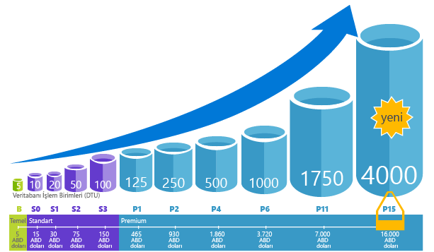
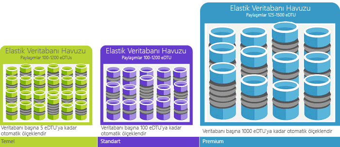

# Hello Azure SQL Database hizmeti nedir?What is hello Azure SQL Database service? 

SQL Veritabanı, Microsoft Azure'da yer alan ve ilişkisel veri, JSON, uzamsal ve XML gibi yapıları destekleyen çok amaçlı ilişkisel veritabanı hizmetidir.SQL Database is a general-purpose relational database service in Microsoft Azure that supports structures such as relational data, JSON, spatial, and XML. [Dinamik olarak ölçeklenebilir performans](sql-database-service-tiers.md) sunan bu hizmet çok büyük ölçekli analitik analiz ve raporlama için [columnstore dizinleri](https://docs.microsoft.com/sql/relational-databases/indexes/columnstore-indexes-overview) gibi seçenekler, raporlama ve çok büyük ölçekli işlemler için [bellek içi OLTP](sql-database-in-memory.md) özelliklerine sahiptir.It delivers [dynamically scalable performance](sql-database-service-tiers.md) and provides options such as [columnstore indexes](https://docs.microsoft.com/sql/relational-databases/indexes/columnstore-indexes-overview) for extreme analytic analysis and reporting, and [in-memory OLTP](sql-database-in-memory.md) for extreme transactional processing. Microsoft tüm düzeltme eki uygulama ve hello SQL kodunu temel sorunsuz bir şekilde güncelleştirme işler ve hemen tüm yönetimi altyapısını temel hello soyutlar.Microsoft handles all patching and updating of hello SQL code base seamlessly and abstracts away all management of hello underlying infrastructure. 

SQL veritabanını paylaşan kendi kod tabanını ile Merhaba [Microsoft SQL Server veritabanı motorunun](https://docs.microsoft.com/sql/sql-server/sql-server-technical-documentation).SQL Database shares its code base with hello [Microsoft SQL Server database engine](https://docs.microsoft.com/sql/sql-server/sql-server-technical-documentation). Microsoft'un bulut ilk stratejisi, SQL Server'ın en yeni işlevleri hello yayımlanan ilk tooSQL veritabanı ve tooSQL sunucusunun kendisi var.With Microsoft's cloud-first strategy, hello newest capabilities of SQL Server are released first tooSQL Database, and then tooSQL Server itself. Yükseltme - ve bu yeni özelliklere sahip veritabanları milyonlarca test veya bu yaklaşım düzeltme eki uygulama için hiçbir ek yükü en yeni SQL Server özellikleriyle ile Merhaba sağlar.This approach provides you with hello newest SQL Server capabilities with no overhead for patching or upgrading - and with these new features tested across millions of databases. Yeni özellikler açıklandıkça haberdar olmak için bkz:For information about new capabilities as they are announced, see:

- **[SQL veritabanı için Azure yol haritası](https://azure.microsoft.com/roadmap/?category=databases)**: yeni ve sonraki yakında kullanıma yer toofind.**[Azure Roadmap for SQL Database](https://azure.microsoft.com/roadmap/?category=databases)**: A place toofind out what’s new and what’s coming next. 
- **[Azure SQL Veritabanı blogu](https://azure.microsoft.com/blog/topics/database)**: SQL Server ürün ekibi üyelerinin SQL Veritabanı haberleri ve özellikleri hakkında yazdıkları blog.**[Azure SQL Database blog](https://azure.microsoft.com/blog/topics/database)**: A place where SQL Server product team members blog about SQL Database news and features. 

SQL Veritabanı birden fazla hizmet düzeyinde kesinti süresi olmadan dinamik kararlılık, yerleşik zeka iyileştirmesi, global düzeyde ölçeklenebilirlik ve kullanılabilirlik ile gelişmiş güvenlik seçeneklerine sahip tahmin edilebilir performansı neredeyse sıfır yönetim gereksinimiyle sunar.SQL Database delivers predictable performance at multiple service levels that provides dynamic scalability with no downtime, built-in intelligent optimization, global scalability and availability, and advanced security options — all with near-zero administration. Bu özellikler, hızlı uygulama geliştirme ve zaman toomarket hızlandırmaya, yerine çok değerli bir zaman ve kaynak toomanaging sanal makineleri ve altyapıyı ayırma toofocus izin verir.These capabilities allow you toofocus on rapid app development and accelerating your time toomarket, rather than allocating precious time and resources toomanaging virtual machines and infrastructure. Merhaba SQL veritabanı şu anda 38 verilerde hizmetidir Merhaba dünya genelinde veritabanınızı yakın bir veri merkezindeki toorun sağlayan düzenli olarak çevrimiçine daha fazla veri merkezleri ile hizalar.hello SQL Database service is currently in 38 data centers around hello world, with more data centers coming online regularly, which enables you toorun your database in a data center near you.

> [!NOTE]
> Azure'un platform güvenliği hakkında bilgi edinmek için de [Azure Güven Merkezi](https://azure.microsoft.com/support/trust-center/security/)'ni ziyaret edebilirsiniz.See [Azure Trust Center](https://azure.microsoft.com/support/trust-center/security/) for information about Azure's platform security.
>

## Ölçeklenebilir performans ve havuzlarScalable performance and pools

SQL Veritabanı ile her veritabanı diğerlerinden ayrı ve taşınabilir olmanın yanı sıra garantili performans düzeyinde ve kendi [hizmet katmanında](sql-database-service-tiers.md) yer alır.With SQL Database, each database is isolated from each other and portable, each with its own [service tier](sql-database-service-tiers.md) with a guaranteed performance level. SQL veritabanı için farklı gereksinimleri farklı performans düzeyleri sağlar ve toobe havuza alınmış toomaximize hello kaynaklarının kullanımını ve paradan tasarruf veritabanları etkinleştirir.SQL Database provides different performance levels for different needs, and enables databases toobe pooled toomaximize hello use of resources and save money.

### Kesinti olmadan performansı ayarlama ve ölçeklendirmeAdjust performance and scale without downtime

SQL veritabanı toosupport basit tooheavyweight veritabanı iş yükleri dört hizmet katmanları sunar: temel, standart, Premium ve Premium RS.SQL Database offers four service tiers toosupport lightweight tooheavyweight database workloads: Basic, Standard, Premium, and Premium RS. Düşük bir maliyetle aylık küçük, tek bir veritabanı üzerinde ilk uygulamanızı oluşturun ve ardından, hizmet katmanı hiçbir zaman toomeet hello ihtiyaçlarını çözümünüzü el ile veya programlama değiştirin.You can build your first app on a small, single database at a low cost per month and then change its service tier manually or programmatically at any time toomeet hello needs of your solution. Kapalı kalma süresi tooyour uygulama veya tooyour müşteriler olmadan performans ayarlayabilirsiniz.You can adjust performance without downtime tooyour app or tooyour customers. Veritabanı tootransparently yanıt kaynak gereksinimlerini ve etkinleştirir, tooonly gereksinim duyduğunuzda ihtiyacınız hello kaynaklar için ödeme değiştirme toorapidly dinamik ölçeklenebilirlik sağlar.Dynamic scalability enables your database tootransparently respond toorapidly changing resource requirements and enables you tooonly pay for hello resources that you need when you need them.

   

### Esnek havuzlar toomaximize kaynak kullanımıElastic pools toomaximize resource utilization

Birçok işletme ve uygulamalar için tek veritabanlarını mümkün toocreate olması ve performans yukarı veya aşağı isteğe bağlı özellikle kullanım desenlerini nispeten tahmin edilebilir yeterince ise çevir.For many businesses and applications, being able toocreate single databases and dial performance up or down on demand is enough, especially if usage patterns are relatively predictable. Ancak tahmin edilemeyen kullanım biçimlerine sahipseniz, bunu sabit toomanage maliyetleri ve iş modelinizin yapabilirsiniz.But if you have unpredictable usage patterns, it can make it hard toomanage costs and your business model. [Esnek havuzlar](sql-database-elastic-pool.md) tasarlanmış toosolve bu sorunu olan.[Elastic pools](sql-database-elastic-pool.md) are designed toosolve this problem. Merhaba kavram, basit bir işlemdir.hello concept is simple. Tek bir veritabanının yerine performans kaynakları tooa havuzu ayırma ve hello toplu performans kaynakların hello havuzunun yerine tek veritabanı performansı için ödeme yaparsınız.You allocate performance resources tooa pool rather than an individual database, and pay for hello collective performance resources of hello pool rather than for single database performance. 

   

Esnek havuzları ile isteğe bağlı kaynaklar için arttıkça veritabanı performansını yukarı ve aşağı arama üzerinde toofocus gerek yoktur.With elastic pools, you don’t need toofocus on dialing database performance up and down as demand for resources fluctuates. Merhaba havuza alınmış veritabanları hello performans kaynaklarını hello esnek havuzun gerektiğinde tüketebilir.hello pooled databases consume hello performance resources of hello elastic pool as needed. Havuza alınmış veritabanları kullanabilir, ancak tek tek veritabanı kullanımına olmasa bile maliyetleriniz tahmin edilebilir böylece hello sınırları hello havuzunun aşmayan.Pooled databases consume but don’t exceed hello limits of hello pool, so your cost remains predictable even if individual database usage doesn’t. Daha fazla nedir, şunları yapabilirsiniz [veritabanları toohello havuzu ekleyip](sql-database-elastic-pool-manage-portal.md), tüm denetim bir bütçe içinde veritabanları toothousands sayıda uygulamanızdan ölçeklendirme.What’s more, you can [add and remove databases toohello pool](sql-database-elastic-pool-manage-portal.md), scaling your app from a handful of databases toothousands, all within a budget that you control. En fazla kaynak kullanılabilir toodatabases hiçbir veritabanı hello havuzundaki tüm kullanan hello havuzu tooensure içinde havuz kaynakları ve havuza alınmış her veritabanı kaynakları garanti edilen en düşük miktarda olduğunu hello ve denetim hello minimum de kullanabilirsiniz.You can also control hello minimum and maximum resources available toodatabases in hello pool tooensure that no database in hello pool uses all hello pool resources and that every pooled database has a guaranteed minimum amount of resources. Esnek havuzları kullanan SaaS uygulamaları için Tasarım desenleri hakkında daha fazla toolearn bkz [SQL veritabanı ile çok kiracılı SaaS uygulamaları için Tasarım desenleri](sql-database-design-patterns-multi-tenancy-saas-applications.md).toolearn more about design patterns for SaaS applications using elastic pools, see [Design Patterns for Multi-tenant SaaS Applications with SQL Database](sql-database-design-patterns-multi-tenancy-saas-applications.md).

### Tek veritabanlarını havuza alınmış veritabanlarıyla karıştırmaBlend single databases with pooled databases

İster tek veritabanlarını isterseniz elastik havuzları seçin, tercihlerinizi dilediğiniz zaman değiştirebilirsiniz.Either way you go — single databases or elastic pools — you are not locked in. Tek veritabanlarını esnek havuzlar blend ve hızlı ve kolay bir şekilde hello hizmet katmanları tek veritabanları ve esnek havuzlar değiştirme tooadapt tooyour durum.You can blend single databases with elastic pools, and change hello service tiers of single databases and elastic pools quickly and easily tooadapt tooyour situation. Merhaba gücü ve erişim Azure ile karışımı ve diğer Azure SQL veritabanı toomeet benzersiz uygulamanızı tasarım gereksinimleri, sürücü maliyet ve kaynak verimliliği ile Hizmetleri ve yeni iş fırsatlarını yakalamak eşleştirme olabilir.With hello power and reach of Azure, you can mix-and-match other Azure services with SQL Database toomeet your unique app design needs, drive cost and resource efficiencies, and unlock new business opportunities.

### Kapsamlı izleme ve uyarı özellikleriExtensive monitoring and alerting capabilities

Ancak, tek veritabanları ve esnek havuzlar göreli performansını hello nasıl karşılaştırabilirsiniz?But how can you compare hello relative performance of single databases and elastic pools? Yukarı ve aşağı çevirdiğinizde hello sağ tıklayın durdurma nasıl bilebilirsiniz?How do you know hello right click-stop when you dial up and down? Merhaba kullandığınız [yerleşik performans izleme](sql-database-performance.md) ve [uyarı](sql-database-insights-alerts-portal.md) araçları, temel hello performans değerlendirmeleri birlikte [tek veritabanları için veritabanı işlem birimleri (Dtu'lar) ve Esnek havuz için Dtu'lar (Edtu'lar) esnek](sql-database-what-is-a-dtu.md).You use hello [built-in performance monitoring](sql-database-performance.md) and [alerting](sql-database-insights-alerts-portal.md) tools, combined with hello performance ratings based on [Database Transaction Units (DTUs) for single databases and elastic DTUs (eDTUs) for elastic pools](sql-database-what-is-a-dtu.md). Bu araçları kullanarak, hello etkisini yukarı veya aşağı geçerli göre ölçeklendirme hızla değerlendirebilirsiniz veya proje performans gereksinimlerine.Using these tools, you can quickly assess hello impact of scaling up or down based on your current or project performance needs. Ayrıntılı bilgi için bkz. [SQL Database seçenekleri ve performansı: Her hizmet katmanında nelerin kullanılabildiğini anlama](sql-database-service-tiers.md).See [SQL Database options and performance: Understand what's available in each service tier](sql-database-service-tiers.md) for details.

SQL Veritabanı ayrıca izlemeyi kolaylaştırmak için [ölçümler ve tanılama günlükleri oluşturabilir](sql-database-metrics-diag-logging.md).Additionally, SQL Database can [emit metrics and diagnostic logs](sql-database-metrics-diag-logging.md) for easier monitoring. SQL veritabanı toostore kaynak kullanımı, çalışanlar ve oturumlar ve bu Azure kaynakları birine bağlantısını yapılandırabilirsiniz:You can configure SQL Database toostore resource usage, workers and sessions, and connectivity into one of these Azure resources:

- **Azure Depolama**: Küçük maliyetlerle çok sayıda telemetri arşivleme için**Azure Storage**: For archiving vast amounts of telemetry for a small price
- **Azure Olay Hub'ı**: SQL Veritabanı telemetrisini özel izleme çözümünüz veya yoğun işlem hatlarıyla tümleştirmek için**Azure Event Hub**: For integrating SQL Database telemetry with your custom monitoring solution or hot pipelines
- **Azure Log Analytics**: Raporlama, uyarı ve azaltma özelliklerine sahip yerleşik izleme çözümü için**Azure Log Analytics**: For built-in monitoring solution with reporting, alerting, and mitigating capabilities

    

## Kullanılabilirlik özellikleriAvailability capabilities

Azure'ın Microsoft yönetimindeki veri merkezlerinin küresel bir ağı tarafından desteklenen ve endüstri lideri niteliğinde %99,99'luk bir kullanılabilirlik oranı sunan hizmet düzeyi sözleşmesi [(SLA)](http://azure.microsoft.com/support/legal/sla/), uygulamanızın 7/24 kesintiye uğramamasına yardımcı olur.Azure's industry leading 99.99% availability service level agreement [(SLA)](http://azure.microsoft.com/support/legal/sla/), powered by a global network of Microsoft-managed datacenters, helps keep your app running 24/7. SQL Veritabanı ayrıca aşağıdakiler dahil olmak üzere yerleşik [iş sürekliliği ve global ölçeklenebilirlik](sql-database-business-continuity.md) özelliklerine sahiptir:In addition, SQL Database provides built-in [business continuity and global scalability](sql-database-business-continuity.md) features, including:

- **[Otomatik yedekleme](sql-database-automated-backups.md)**: SQL Veritabanı otomatik olarak tam, değişiklik ve işlem günlüğü kapsamlı yedeklemeler gerçekleştirir.**[Automatic backups](sql-database-automated-backups.md)**: SQL Database automatically performs full, differential, and transaction log backups.
- **[Zaman içinde nokta geri yüklemeler](sql-database-recovery-using-backups.md)**: SQL veritabanı süre hello otomatik yedekleme saklama dönemi içinde kurtarma tooany noktası destekler.**[Point-in-time restores](sql-database-recovery-using-backups.md)**: SQL Database supports recovery tooany point in time within hello automatic backup retention period.
- **[Aktif coğrafi çoğaltma](sql-database-geo-replication-overview.md)**: SQL veritabanı sağlar, tooconfigure toofour okunabilir ikincil yukarı ya da hello aynı veritabanları veya Azure veri merkezlerinde genel olarak dağıtılmış.**[Active geo-replication](sql-database-geo-replication-overview.md)**: SQL Database allows you tooconfigure up toofour readable secondary databases in either hello same or globally distributed Azure data centers.  Örneğin, eşzamanlı salt okunur işlemler yüksek hacimli bir katalog veritabanına sahip bir SaaS uygulaması varsa, genel kullanım aktif coğrafi çoğaltma tooenable ölçek okuyun ve tooread iş yüklerinin performans sorunlarını hello birincil üzerinde kaldırın.For example, if you have a SaaS application with a catalog database that has a high volume of concurrent read-only transactions, use active geo-replication tooenable global read scale and remove bottlenecks on hello primary that are due tooread workloads. 
- **[Yük devretme grupları](sql-database-geo-replication-overview.md)**: SQL veritabanı sağlar tooenable yüksek kullanılabilirlik ve Yük Dengeleme saydam coğrafi çoğaltma ve yük devretme veritabanlarını ve esnek havuzlar büyük kümeleri dahil olmak üzere genel ölçekte.**[Failover groups](sql-database-geo-replication-overview.md)**: SQL Database allows you tooenable high availability and load balancing at global scale, including transparent geo-replication and failover of large sets of databases and elastic pools. Yük devretme gruplar ve en az yönetim yükü tüm hello karmaşık izleme, Yönlendirme ve yük devretme orchestration tooSQL veritabanı bırakarak Genel dağıtılmış SaaS uygulamaları aktif coğrafi çoğaltma etkinleştirir oluşturma.Failover groups and active geo-replication enables creation of globally distributed SaaS applications with minimal administration overhead leaving all hello complex monitoring, routing, and failover orchestration tooSQL Database.

## Yerleşik zekaBuilt-in intelligence

SQL veritabanı ile performans ve güvenlik, uygulamanızın en üst düzeye çıkarır ve önemli ölçüde çalıştıran ve veritabanlarını yönetme hello maliyetleri azaltmanıza yardımcı olur yerleşik zekaya alın.With SQL Database, you get built-in intelligence that helps you dramatically reduce hello costs of running and managing databases and maximizes both performance and security of your application. Müşteri milyonlarca gün boyunca iş yükleri çalıştıran, SQL veritabanı toplar ve tam olarak hello perde arkasında müşteri gizliliğine saygı göstermek sırasında telemetri verileri büyük bir miktarını işler.Running millions of customer workloads around-the-clock, SQL Database collects and processes a massive amount of telemetry data, while also fully respecting customer privacy behind hello scenes. Böylece Hello hizmet öğrenin ve uygulamanız ile uyum çeşitli algoritmalar sürekli hello telemetri verileri değerlendiriyorsanız.Various algorithms are continuously evaluating hello telemetry data so that hello service can learn and adapt with your application. Bu analize dayalı olarak, hello hizmeti performans önerileri uyarlanmış tooyour belirli iş yükü geliştirme ile gelir.Based on this analysis, hello service comes up with performance improving recommendations tailored tooyour specific workload. 

### Otomatik performans ayarlamaAutomatic performance tuning

SQL veritabanı toomonitor gerektiğini hello ayrıntılı bir anlayış sorgular sağlar.SQL Database provides detailed insight into hello queries that you need toomonitor. SQL veritabanının veritabanı desenleri hakkında öğrenir ve veritabanı şeması tooyour yükünüzü, tooadapt sağlar.SQL Database's learns about your database patterns and enables you tooadapt your database schema tooyour workload. SQL Veritabanı, [SQL Veritabanı Danışmanı](sql-database-advisor.md),'nı kullanarak performans ayarlama önerilerinde bulunur. Siz de bu ayarları gözden geçirebilir ve uygulayabilirsiniz.SQL Database provides performance tuning recommendations using  [SQL Database Advisor](sql-database-advisor.md), where you can review tuning actions and apply them. Ancak özellikle birden fazla veritabanıyla ilgilenirken bir veritabanını sürekli izlemek zor ve yorucu bir görevdir.However, constantly monitoring database is a hard and tedious task, especially when dealing with many databases. Veritabanları büyük sayıda yönetme bile tüm kullanılabilir araçları ve SQL Database ve Azure portal sağlayan raporları verimli bir şekilde imkansız toodo olabilir.Managing a huge number of databases might be impossible toodo efficiently even with all available tools and reports that SQL Database and Azure portal provide. İzleme ve veritabanınızı el ile ayarlama yerine, izleme ve eylemleri tooSQL ayarlama hello bazıları için temsilci seçme düşünebilirsiniz otomatik ayarlama özelliğini kullanarak veritabanı.Instead of monitoring and tuning your database manually, you might consider delegating some of hello monitoring and tuning actions tooSQL Database using automatic tuning feature. SQL veritabanı otomatik olarak öneriler, testleri, uygulayın ve her ayarlama Eylemler tooensure hello performansını artırma tutar doğrular.SQL Database automatically apply recommendations, tests, and verifies each of its tuning actions tooensure hello performance keeps improving. Bu şekilde, SQL veritabanı otomatik olarak tooyour iş yükü denetimli ve güvenli bir şekilde uyum sağlar.This way, SQL Database automatically adapts tooyour workload in controlled and safe way. Otomatik ayarlama, veritabanınızın hello performansı dikkatlice izlenen ve önce ve sonra her ayar eylemi karşılaştırılır ve hello performansı değil, eylem ayarlama hello geri anlamına gelir.Automatic tuning means that hello performance of your database is carefully monitored and compared before and after every tuning action, and if hello performance doesn’t improve, hello tuning action is reverted.

Bugün, çok ortaklarımızın çalıştıran biri [SaaS çok kiracılı uygulamaları](sql-database-design-patterns-multi-tenancy-saas-applications.md) SQL veritabanının üst kısmında toomake uygulamalarını her zaman kararlı ve öngörülebilir performans olmasını ayarlama otomatik performansına bağlı.Today, many of our partners running [SaaS multi-tenant apps](sql-database-design-patterns-multi-tenancy-saas-applications.md) on top of SQL Database are relying on automatic performance tuning toomake sure their applications always have stable and predictable performance. Bunlar için bu özellik büyük ölçüde performans olay hello gece hello ortadaki sahip olmanın hello riskini azaltır.For them, this feature tremendously reduces hello risk of having a performance incident in hello middle of hello night. Kendi müşteri tabanı parçası ayrıca SQL Server kullandığından, ayrıca, hello kullandıkları aynı dizin önerileri, SQL Server müşterilerine SQL veritabanı toohelp tarafından sağlanan.In addition, since part of their customer base also uses SQL Server, they are using hello same indexing recommendations provided by SQL Database toohelp their SQL Server customers.

SQL Veritabanında iki otomatik ayarlama yöntemi mevcuttur:There are two automatic tuning aspects that are available in SQL Database:

- **[Otomatik dizin yönetimi](sql-database-automatic-tuning.md#automatic-index-management)**: Veritabanınıza eklenmesi ve veritabanınızdan kaldırılması gereken dizinleri tanımlar.**[Automatic index management](sql-database-automatic-tuning.md#automatic-index-management)**: Identifies indexes that should be added in your database, and indexes that should be removed.
- **[Otomatik plan düzeltme](sql-database-automatic-tuning.md#automatic-plan-choice-correction)**: Sorunlu planları tanımlar ve SQL planı performans sorunlarını düzeltir (çok yakında, SQL Server 2017 ile kullanılabilir).**[Automatic plan correction](sql-database-automatic-tuning.md#automatic-plan-choice-correction)**: Identifies problematic plans and fixes SQL plan performance problems (coming soon, already available in SQL Server 2017).

### Uyarlamalı sorgu işlemeAdaptive query processing

Merhaba de ekliyoruz [Uyarlamalı sorgu işleme](/sql/relational-databases/performance/adaptive-query-processing) özellikleri tooSQL tablo değerli işlevler birden fazla deyim için bir araya eklemeli yürütme dahil olmak üzere veritabanı ailesi toplu iş modu bellek grant geri bildirim ve modu Uyarlamalı birleştirmeler toplu işlem .We are also adding hello [adaptive query processing](/sql/relational-databases/performance/adaptive-query-processing) family of features tooSQL Database, including interleaved execution for multi-statement table-valued functions, batch mode memory grant feedback, and batch mode adaptive joins. Bu Uyarlamalı sorgu işleme özelliklerin her biri daha fazla performans sorunları ilgili toohistorically çözümü sorgu iyileştirme sorunların çözümüne yardımcı benzer "öğrenin ve uyum" teknikleri uygulanır.Each of these adaptive query processing features applies similar “learn and adapt” techniques, helping further address performance issues related toohistorically intractable query optimization problems.

### Akıllı tehdit algılamaIntelligent threat detection

 [SQL tehdit algılama](sql-database-threat-detection.md) yararlanır [SQL veritabanı denetimi](sql-database-auditing.md) toocontinuously İzleyici Azure SQL veritabanları için zararlı deneme tooaccess hassas verileri.[SQL Threat Detection](sql-database-threat-detection.md) leverages [SQL Database auditing](sql-database-auditing.md) toocontinuously monitor Azure SQL databases for potentially harmful attempts tooaccess sensitive data. SQL tehdit algılama müşteriler toodetect sağlar ve güvenlik uyarıları anormal etkinlikler sağlayarak göründüklerinde toopotential tehditlerine yanıt güvenliği, yeni bir katman sağlar.SQL threat detection provides a new layer of security, which enables customers toodetect and respond toopotential threats as they occur by providing security alerts on anomalous activities. Şüpheli veritabanı etkinlikleri, potansiyel açıklar, SQL ekleme saldırıları ve anormal veritabanı erişim modellerinin tespit edilmesi halinde kullanıcılar uyarılır.Users receive alerts upon suspicious database activities, potential vulnerabilities, and SQL injection attacks, and anomalous database access patterns. Algılama uyarıları şüpheli etkinlik ayrıntılarını sağlayın ve eylem nasıl önerilir SQL tehdit tooinvestigate ve hello tehdidi azaltmak.SQL threat detection alerts provide details of suspicious activity and recommend action on how tooinvestigate and mitigate hello threat. Merhaba olay girişimi tooaccess sonuçlarından ihlal ya da hello veritabanındaki verileri yararlanma kullanıcılar hello şüpheli olayları toodetermine keşfedebilirsiniz.Users can explore hello suspicious events toodetermine if hello event results from an attempt tooaccess, breach, or exploit data in hello database. Tehdit algılama basit tooaddress olası tehditler toohello veritabanı hello gerek toobe güvenlik Uzman olmadan kolaylaştırır veya sistemleri izleme Gelişmiş Güvenlik yönetin.Threat detection makes it simple tooaddress potential threats toohello database without hello need toobe a security expert or manage advanced security monitoring systems.

## Gelişmiş koruma ve uyumlulukAdvanced security and compliance

SQL veritabanı sağlayan bir dizi [yerleşik güvenlik ve uyumluluk özellikleri](sql-database-security-overview.md) toohelp uygulamanızı çeşitli güvenlik ve uyumluluk gereksinimlerini karşılamak.SQL Database provides a range of [built-in security and compliance features](sql-database-security-overview.md) toohelp your application meet various security and compliance requirements. 

### Uyumluluk ve güvenlik denetimiAuditing for compliance and security

[SQL veritabanı denetimi](sql-database-auditing.md) veritabanı olaylarını izler ve bunları Azure depolama hesabınızdaki tooan denetim günlüğünü yazar.[SQL Database Auditing](sql-database-auditing.md) tracks database events and writes them tooan audit log in your Azure storage account. Denetim mevzuatla uyumluluk, veritabanı etkinliğini anlama ve işletme sorunlarını veya şüpheli güvenlik ihlallerini işaret edebilecek farklılıklar ve anormal durumlar hakkında öngörü sahip olmanıza yardımcı olabilir.Auditing can help you maintain regulatory compliance, understand database activity, and gain insight into discrepancies and anomalies that could indicate business concerns or suspected security violations.

### Bekleme sırasında veri şifrelemesiData encryption at rest

SQL veritabanı [saydam veri şifreleme](https://docs.microsoft.com/sql/relational-databases/security/encryption/transparent-data-encryption-with-azure-sql-database) gerçek zamanlı şifreleme ve şifre çözme hello veritabanının, ilişkili yedeklemelerinizi gerçekleştirerek kötü amaçlı etkinliği hello tehdide karşı korumaya yardımcı olur ve işlem günlüğü dosyalarını bekleyen değişiklikleri toohello uygulama gerek kalmadan.SQL Database [transparent data encryption](https://docs.microsoft.com/sql/relational-databases/security/encryption/transparent-data-encryption-with-azure-sql-database) helps protect against hello threat of malicious activity by performing real-time encryption and decryption of hello database, associated backups, and transaction log files at rest without requiring changes toohello application. Mayıs 2017'den itibaren oluşturulan tüm yeni Azure SQL veritabanları otomatik olarak saydam veri şifrelemesi (TDE) ile korunmaktadır.Starting in May 2017, all newly created Azure SQL databases are automatically protected with transparent data encryption (TDE). Depolama medyası çalınması karşı birçok uyumluluk standartlarını tooprotect gerektirdiği rest sırasında şifreleme teknolojisi kanıtlanmış SQL'in TDE var.TDE is SQL’s proven encryption-at-rest technology that is required by many compliance standards tooprotect against theft of storage media. Müşteriler hello TDE şifreleme anahtarları ve diğer gizli anahtarları Azure anahtar kasası kullanarak bir güvenli ve uyumlu şekilde yönetebilirsiniz.Customers can manage hello TDE encryption keys and other secrets in a secure and compliant manner using Azure Key Vault.

### Hareket halinde veri şifrelemesiData encryption in motion

SQL veritabanı olan hello yalnızca veritabanı sistem toooffer koruması yürütülen, REST ve sorgu ile işleme sırasında önemli verilerin [her zaman şifreli](https://docs.microsoft.com/sql/relational-databases/security/encryption/always-encrypted-database-engine).SQL Database is hello only database system toooffer protection of sensitive data in flight, at rest and during query processing with [Always Encrypted](https://docs.microsoft.com/sql/relational-databases/security/encryption/always-encrypted-database-engine). Her zaman şifreli benzersiz veri sunan bir endüstri-ilk olan kritik verilerin hello hırsızlığı içeren ihlallerine karşı güvenlik.Always Encrypted is an industry-first that offers unparalleled data security against breaches involving hello theft of critical data. Örneğin, her zaman şifreli ile müşterilerin kredi kartı numaralarını hello veritabanında sorgu işleme sırasında bile her zaman, şifrelenmiş kullanım hello noktada şifre çözme verileri izin vererek, yetkili personel veya tooprocess ihtiyaç duyan uygulamalar tarafından depolanır.For example, with Always Encrypted, customers’ credit card numbers are stored encrypted in hello database always, even during query processing, allowing decryption at hello point of use by authorized staff or applications that need tooprocess that data.

### Dinamik veri maskelemeDynamic data masking

[SQL veritabanı dinamik veri maskeleme](sql-database-dynamic-data-masking-get-started.md) toonon ayrıcalıklı kullanıcılar maskeleyerek gizli verilerin açığa sınırlar.[SQL Database dynamic data masking](sql-database-dynamic-data-masking-get-started.md) limits sensitive data exposure by masking it toonon-privileged users. Dinamik veri maskeleme yardımcı olan müşteriler toodesignate etkinleştirerek yetkisiz erişim toosensitive verilerin engellemek hello hassas verileri tooreveal hello uygulama katmanı üzerinde en az etkiyle ne kadarının.Dynamic data masking helps prevent unauthorized access toosensitive data by enabling customers toodesignate how much of hello sensitive data tooreveal with minimal impact on hello application layer. Bunu hello verileri hello veritabanında değişip değişmediğini sırada, belirlenen veritabanı alanları hello hassas verileri sorgu hello sonuç kümesinde gizler ilke tabanlı güvenlik özelliğidir.It’s a policy-based security feature that hides hello sensitive data in hello result set of a query over designated database fields, while hello data in hello database is not changed.

### Satır düzeyi güvenlikRow-level security

[Satır düzeyi güvenlik](https://docs.microsoft.com/sql/relational-databases/security/row-level-security) müşteriler toocontrol erişim toorows bir sorgu yürütülürken hello kullanıcı hello özellikler temelinde bir veritabanı tablosundaki sağlar (gibi grubu üyeliği veya yürütme bağlamı olarak).[Row-level security](https://docs.microsoft.com/sql/relational-databases/security/row-level-security) enables customers toocontrol access toorows in a database table based on hello characteristics of hello user executing a query (such as by group membership or execution context). Satır düzeyi güvenlik (RLS) hello tasarım ve uygulamanızda güvenlik kodlama basitleştirir.Row-level security (RLS) simplifies hello design and coding of security in your application. RLS tooimplement kısıtlamalar veri satırı erişimi sağlar.RLS enables you tooimplement restrictions on data row access. Örneğin çalışanları ilgili tootheir departmanı olan veri satırına erişmesini ya da Müşteri'nin veri erişim tooonly hello veri ilgili tootheir şirket kısıtlama.For example ensuring that workers can access only those data rows that are pertinent tootheir department, or restricting a customer's data access tooonly hello data relevant tootheir company.

### Azure Active Directory tümleştirmesi ve çok faktörlü kimlik doğrulamasıAzure Active Directory integration and multi-factor authentication

SQL veritabanı sağlar, toocentrally veritabanı kullanıcısı ve diğer Microsoft Hizmetleri ile kimliklerini yönetmek [Azure Active Directory Tümleştirme](sql-database-aad-authentication.md).SQL Database enables you toocentrally manage identities of database user and other Microsoft services with [Azure Active Directory integration](sql-database-aad-authentication.md). Bu özellik, izin yönetimini kolaylaştırırken güvenliği artırır.This capability simplified permission management and enhances security. Azure Active Directory destekler [çok faktörlü kimlik doğrulaması](sql-database-ssms-mfa-authentication.md) destekleyen tek bir oturum açma işlemi sırasında (MFA) tooincrease veri ve uygulama güvenlik.Azure Active Directory supports [multi-factor authentication](sql-database-ssms-mfa-authentication.md) (MFA) tooincrease data and application security while supporting a single sing-in process.

### Uyumluluk sertifikasıCompliance certification

SQL Veritabanı düzenli olarak denetimden geçmektedir ve birden fazla uyumluluk standardı sertifikasına sahiptir.SQL Database participates in regular audits and has been certified against several compliance standards. Merhaba daha fazla bilgi için bkz: [Microsoft Azure Trust Center](https://azure.microsoft.com/support/trust-center/), hello en güncel listesini bulabilirsiniz burada [SQL veritabanı uyumluluk sertifikalarından](https://azure.microsoft.com/support/trust-center/services/).For more information, see hello [Microsoft Azure Trust Center](https://azure.microsoft.com/support/trust-center/), where you can find hello most current list of [SQL Database compliance certifications](https://azure.microsoft.com/support/trust-center/services/).

## Kullanımı kolay araçlarEasy-to-use tools

SQL Veritabanı uygulama oluşturma ve uygulamaların bakımını yapma işlemlerinin daha kolay ve daha verimli şekilde yapılmasını sağlar.SQL Database makes building and maintaining applications easier and more productive. SQL veritabanı, en iyi neler toofocus sağlar: harika uygulamaları oluşturma.SQL Database allows you toofocus on what you do best: building great apps. Sahip olduğunuz araçları ve becerileri kullanarak SQL Veritabanı ile yönetebilir ve geliştirebilirsiniz.You can manage and develop in SQL Database using tools and skills you already have.

- **[Azure portal hello](https://portal.azure.com/)**: tüm Azure hizmetlerini yönetmek için web tabanlı bir uygulama**[hello Azure portal](https://portal.azure.com/)**: A web-based application for managing all Azure services 
- **[SQL Server Management Studio](https://docs.microsoft.com/sql/ssms/download-sql-server-management-studio-ssms)**: SQL Server tooSQL veritabanı ' herhangi bir SQL altyapı yönetmek için bir ücretsiz ve indirilebilir istemci uygulaması**[SQL Server Management Studio](https://docs.microsoft.com/sql/ssms/download-sql-server-management-studio-ssms)**: A free, downloadable client application for managing any SQL infrastructure, from SQL Server tooSQL Database
- **[Visual Studio'daki SQL Server Veri Araçları](https://docs.microsoft.com/sql/ssdt/download-sql-server-data-tools-ssdt)**: SQL Server ilişkisel veritabanları, Azure SQL veritabanları, Integration Services paketleri, Analysis Services veri modelleri ve Reporting Services raporları geliştirebileceğiniz ücretsiz ve indirilebilir istemci uygulaması.**[SQL Server Data Tools in Visual Studio](https://docs.microsoft.com/sql/ssdt/download-sql-server-data-tools-ssdt)**: A free, downloadable client application for developing SQL Server relational databases, Azure SQL databases, Integration Services packages, Analysis Services data models, and Reporting Services reports.
- **[Visual Studio Code](https://code.visualstudio.com/docs)**: ücretsiz, indirilebilir, açık kaynaklı, Windows, macOS ve uzantılarını hello dahil olmak üzere, Linux için kod düzenleyicisini [mssql uzantısı](https://aka.ms/mssql-marketplace) Microsoft SQL Server'ı sorgulamak için Azure SQL Database ve SQL veri ambarı.**[Visual Studio Code](https://code.visualstudio.com/docs)**: a free, downloadable, open source, code editor for Windows, macOS, and Linux that supports extensions, including hello [mssql extension](https://aka.ms/mssql-marketplace) for querying Microsoft SQL Server, Azure SQL Database, and SQL Data Warehouse.

SQL veritabanı, Python, Java, Node.js, PHP, Ruby ve hello MacOS .NET, Linux ve Windows uygulamaları oluşturma destekler.SQL Database supports building applications with Python, Java, Node.js, PHP, Ruby, and .NET on hello MacOS, Linux, and Windows. SQL veritabanı destekler hello aynı [bağlantı kitaplıkları](sql-database-libraries.md) SQL sunucusu olarak.SQL Database supports hello same [connection libraries](sql-database-libraries.md) as SQL Server.

## Merhaba SQL Server mühendislik ekibi ile gösterEngage with hello SQL Server engineering team

- [DBA Stack Exchange](https://dba.stackexchange.com/questions/tagged/sql-server): Veritabanı yönetimi hakkında sorular için[DBA Stack Exchange](https://dba.stackexchange.com/questions/tagged/sql-server): Ask database administration questions
- [Stack Overflow](http://stackoverflow.com/questions/tagged/sql-server): Geliştirme hakkında sorular için[Stack Overflow](http://stackoverflow.com/questions/tagged/sql-server): Ask development questions
- [MSDN Forumları](https://social.msdn.microsoft.com/Forums/en-US/home?category=sqlserver): Teknik sorular için[MSDN Forums](https://social.msdn.microsoft.com/Forums/en-US/home?category=sqlserver): Ask technical questions
- [Microsoft Connect](https://connect.microsoft.com/SQLServer/Feedback): Hata bildirimleri ve özellik istekleri için[Microsoft Connect](https://connect.microsoft.com/SQLServer/Feedback): Report bugs and request feature
- [Reddit](https://www.reddit.com/r/SQLServer/): SQL Server’ı tartışmak için[Reddit](https://www.reddit.com/r/SQLServer/): Discuss SQL Server

## Sonraki adımlarNext steps

- Merhaba bkz [fiyatlandırma sayfası](https://azure.microsoft.com/pricing/details/sql-database/) tek veritabanı ve esnek havuzlar maliyet karşılaştırmaları ve hesaplayıcıları için.See hello [pricing page](https://azure.microsoft.com/pricing/details/sql-database/) for single database and elastic pools cost comparisons and calculators.

- Bu hızlı başlattığınız tooget başlatır bakın:See these quick starts tooget you started:

  - [Hello Azure portalında bir SQL veritabanı oluşturmaCreate a SQL database in hello Azure portal](sql-database-get-started-portal.md)  
  - [Hello Azure CLI ile bir SQL veritabanı oluşturmaCreate a SQL database with hello Azure CLI](sql-database-get-started-cli.md)
  - [PowerShell ile SQL veritabanı oluşturmaCreate a SQL database using PowerShell](sql-database-get-started-powershell.md)

- Azure CLI ve PowerShell örnekleri için bkz.:For a set of Azure CLI and PowerShell samples, see:
  - [SQL Veritabanı için Azure CLI örnekleriAzure CLI samples for SQL Database](sql-database-cli-samples.md)
  - [SQL Veritabanı için Azure PowerShell örnekleriAzure PowerShell samples for SQL Database](sql-database-powershell-samples.md)
